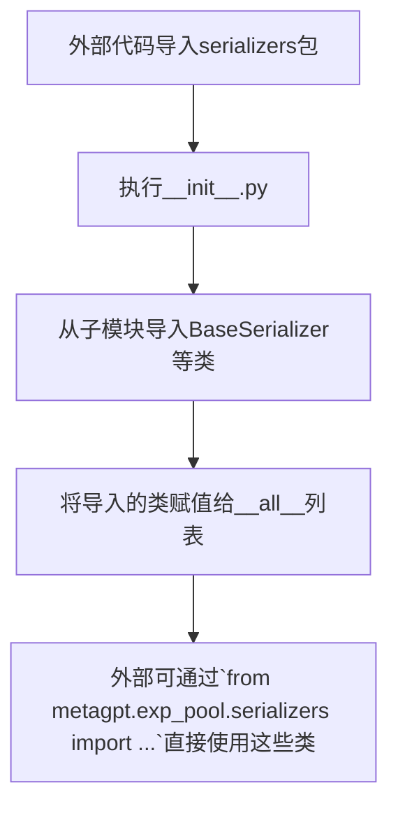

# `.\MetaGPT\metagpt\exp_pool\serializers\__init__.py` 详细设计文档

该文件是metagpt.exp_pool.serializers包的初始化模块，其核心功能是集中导入并导出该包下定义的各种序列化器类，为外部提供一个统一的、简洁的导入接口。它本身不包含业务逻辑，主要作用是管理模块的公共API。

## 整体流程



## 类结构

```
metagpt.exp_pool.serializers (Python包)
├── __init__.py (当前文件，包初始化模块)
├── base.py (定义BaseSerializer)
├── simple.py (定义SimpleSerializer)
├── action_node.py (定义ActionNodeSerializer)
└── role_zero.py (定义RoleZeroSerializer)
```

## 全局变量及字段


### `__all__`
    
一个字符串列表，用于定义当使用 `from module import *` 语法时，从当前模块（`__init__.py`）中公开导出的符号名称。

类型：`List[str]`
    


    

## 全局函数及方法


## 关键组件


### BaseSerializer

定义了序列化器的抽象基类，为所有具体序列化器提供统一的接口和基础功能。

### SimpleSerializer

提供简单直接的序列化与反序列化实现，适用于基础数据结构。

### ActionNodeSerializer

专门用于序列化和反序列化动作节点（ActionNode）对象，处理其特定的数据结构。

### RoleZeroSerializer

专门用于序列化和反序列化角色零（RoleZero）对象，处理其特定的数据结构。


## 问题及建议


### 已知问题

-   **模块初始化文件过于简单**：当前的 `__init__.py` 文件仅执行了导入和 `__all__` 定义，没有提供任何聚合功能、版本管理或配置选项。这虽然满足了基本需求，但作为一个核心组件的入口点，其功能性较弱。
-   **缺乏版本控制信息**：代码中没有包含模块的版本信息（如 `__version__`），这不利于依赖管理和调试。
-   **潜在的循环导入风险**：虽然当前结构清晰，但如果未来 `serializers` 子模块间存在复杂的相互依赖，并通过此 `__init__.py` 聚合，可能引发循环导入问题。目前代码尚未表现出此问题，但结构上存在这种隐患。

### 优化建议

-   **增强模块入口功能**：考虑在 `__init__.py` 中添加一个工厂函数或类，用于根据配置或上下文动态返回合适的序列化器实例，提高模块的易用性和灵活性。例如，可以添加一个 `get_serializer(name: str) -> BaseSerializer` 函数。
-   **添加版本信息**：定义 `__version__` 变量，与项目整体版本或该子模块的特定版本保持一致，便于追踪和管理。
-   **明确导出与懒加载**：对于大型模块，可以考虑使用 `__getattr__` 和 `__dir__` 实现子模块的懒加载，以优化启动性能。但需权衡增加的复杂度与带来的收益。
-   **添加类型提示再导出**：虽然 `__all__` 控制了 `from module import *` 的行为，但为了更好的IDE支持，可以考虑使用 `from ... import ... as ...` 的形式进行再导出，并为这些再导出的名称添加类型存根（stub）或确保原始导入已包含类型提示。
-   **考虑添加日志或配置钩子**：在初始化时，可以添加简单的日志记录，表明序列化器模块已加载，或者在后续支持通过环境变量等方式配置默认序列化器。


## 其它


### 设计目标与约束

该模块的设计目标是提供一个可扩展的序列化器（Serializer）框架，用于将不同类型的经验数据（如角色状态、动作节点等）序列化为可存储的格式（如字典、JSON字符串），并支持反序列化。核心约束包括：
1.  **接口一致性**：所有序列化器必须继承自 `BaseSerializer` 并实现其定义的抽象接口，确保统一的调用方式。
2.  **松耦合**：序列化逻辑应与具体的业务模型（如 `Role`、`ActionNode`）解耦，通过独立的序列化器类进行处理。
3.  **可发现性与易用性**：通过 `__init__.py` 集中导出公共序列化器类，方便其他模块导入和使用。
4.  **可扩展性**：当需要为新的数据类型添加序列化支持时，只需创建新的序列化器类并在 `__all__` 列表中声明即可，无需修改现有调用方代码。

### 错误处理与异常设计

当前模块主要进行类的导入和导出，本身不包含复杂的业务逻辑，因此错误处理主要围绕导入失败和序列化器使用不当两种情况：
1.  **导入错误**：如果 `from ... import ...` 语句中指定的模块或类不存在，Python 解释器会抛出 `ModuleNotFoundError` 或 `ImportError`。这通常意味着项目依赖或文件结构存在问题。
2.  **序列化器使用错误**：当调用者实例化一个序列化器（如 `SimpleSerializer`）并调用其 `serialize` 或 `deserialize` 方法时，如果传入的数据不符合预期，具体的序列化器实现应抛出清晰的异常（如 `TypeError`, `ValueError` 或自定义异常）。例如，`ActionNodeSerializer` 可能要求传入的对象必须包含特定的属性。这些异常处理策略定义在各个具体的序列化器类中，而非本 `__init__.py` 文件。

### 数据流与状态机

本文件作为模块初始化入口，不涉及具体的数据流或状态转换。其数据流角色是静态的：
*   **输入**：无运行时输入。在代码层面，其输入是其他模块（如 `metagpt.exp_pool.serializers.simple`）中定义的类。
*   **处理**：执行导入（`import`）语句，将分散定义的类加载到当前模块的命名空间中。
*   **输出**：通过 `__all__` 变量定义模块的公共接口，明确指明哪些类可以被外部通过 `from metagpt.exp_pool.serializers import *` 的方式导入。这创建了一个清晰的、面向外部的 API 契约。

### 外部依赖与接口契约

1.  **外部依赖**：
    *   **直接依赖**：依赖于同一包（`metagpt.exp_pool.serializers`）下的四个子模块：`base`、`simple`、`action_node`、`role_zero`。这些模块必须存在且可导入。
    *   **间接依赖**：具体的序列化器类（如 `ActionNodeSerializer`）可能依赖于项目内的其他模型类（如 `ActionNode`）或第三方库（如 `pydantic`、`json`）。这些依赖关系封装在各个序列化器的实现内部。

2.  **接口契约**：
    *   **提供方契约**：本模块对外承诺提供 `__all__` 列表中列出的四个类（`BaseSerializer`, `SimpleSerializer`, `ActionNodeSerializer`, `RoleZeroSerializer`）。外部代码可以信赖这些类的可用性和它们从 `BaseSerializer` 继承的接口（主要是 `serialize` 和 `deserialize` 方法）。
    *   **消费方契约**：任何导入并使用本模块序列化器的代码，需要遵循每个具体序列化器对输入数据格式的约定。例如，向 `RoleZeroSerializer.serialize` 传递一个非 `Role` 对象可能导致错误。

    