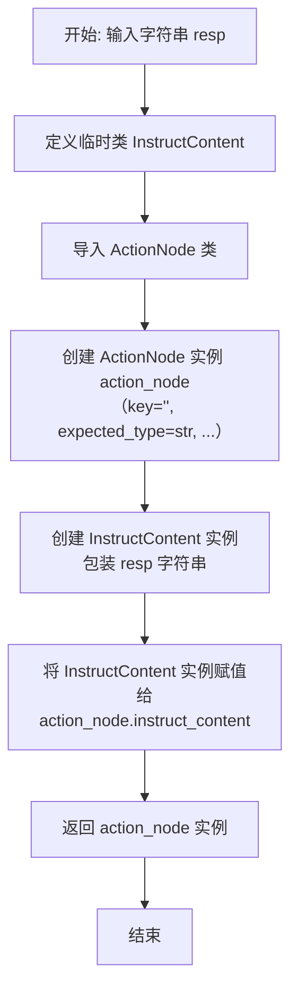
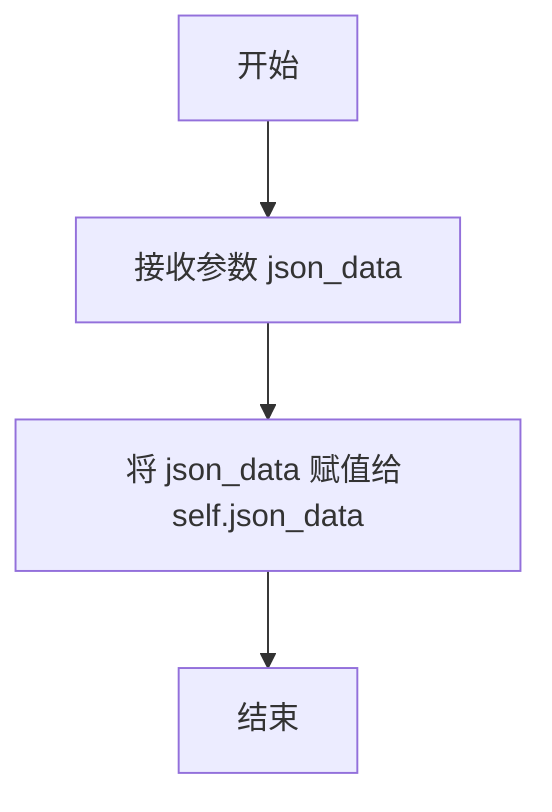
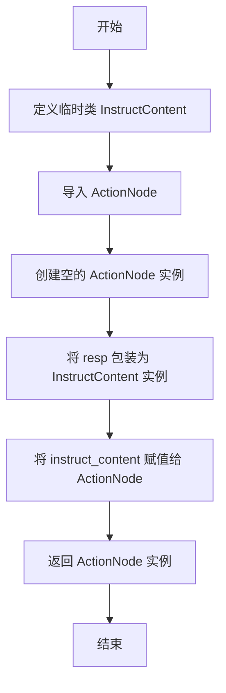

# `.\MetaGPT\metagpt\exp_pool\serializers\action_node.py` 详细设计文档

该文件定义了一个用于序列化和反序列化ActionNode对象的序列化器。它继承自SimpleSerializer，专门处理ActionNode类型，通过自定义的序列化方法将ActionNode的instruct_content转换为JSON字符串，并在反序列化时重建一个包含原始JSON数据的ActionNode对象，以解决ActionNode因包含不可序列化对象（如SSLContext）而无法直接序列化的问题。

## 整体流程

```mermaid
graph TD
    A[开始] --> B{序列化 or 反序列化?}
    B -- 序列化 --> C[调用 serialize_resp]
    C --> D[获取 ActionNode.instruct_content]
    D --> E[调用 model_dump_json() 转换为 JSON 字符串]
    E --> F[返回 JSON 字符串]
    B -- 反序列化 --> G[调用 deserialize_resp]
    G --> H[创建临时的 InstructContent 类]
    H --> I[用传入的 JSON 字符串初始化 InstructContent 实例]
    I --> J[创建新的 ActionNode 实例]
    J --> K[将 InstructContent 实例赋值给 action_node.instruct_content]
    K --> L[返回重建的 ActionNode 实例]
```

## 类结构

```
SimpleSerializer (基类)
└── ActionNodeSerializer (子类，处理ActionNode的序列化)
```

## 全局变量及字段


### `InstructContent.json_data`
    
存储序列化后的JSON字符串数据，用于在反序列化过程中临时保存ActionNode的指令内容。

类型：`str`
    
    

## 全局函数及方法


### `ActionNodeSerializer.serialize_resp`

该方法用于将 `ActionNode` 对象的响应内容（`instruct_content`）序列化为 JSON 字符串。它是 `ActionNodeSerializer` 序列化过程的核心部分，专门处理 `ActionNode` 类型的数据。

参数：

- `resp`：`ActionNode`，需要被序列化的 `ActionNode` 对象。

返回值：`str`，返回 `ActionNode` 对象中 `instruct_content` 字段的 JSON 字符串表示。

#### 流程图

```mermaid
flowchart TD
    A[开始] --> B[接收 ActionNode 对象 resp]
    B --> C[调用 resp.instruct_content.model_dump_json()]
    C --> D[返回 JSON 字符串]
    D --> E[结束]
```

#### 带注释源码

```python
def serialize_resp(self, resp: ActionNode) -> str:
    # 调用 ActionNode 对象 resp 的 instruct_content 属性的 model_dump_json 方法
    # 该方法将 instruct_content 的内容序列化为 JSON 格式的字符串
    return resp.instruct_content.model_dump_json()
```


### `ActionNodeSerializer.deserialize_resp`

该方法用于将序列化的字符串响应反序列化为一个 `ActionNode` 对象。它通过创建一个临时的 `InstructContent` 对象来包装原始字符串，并将其赋值给新创建的 `ActionNode` 实例的 `instruct_content` 字段，从而绕过 `ActionNode` 的直接序列化限制。

参数：

-  `resp`：`str`，需要被反序列化的字符串，通常是由 `serialize_resp` 方法生成的 JSON 字符串。

返回值：`ActionNode`，一个包含反序列化后 `instruct_content` 的 `ActionNode` 实例。

#### 流程图



#### 带注释源码

```python
def deserialize_resp(self, resp: str) -> ActionNode:
    """Customized deserialization, it will be triggered when a perfect experience is found.

    ActionNode cannot be serialized, it throws an error 'cannot pickle 'SSLContext' object'.
    """

    # 定义一个临时的 InstructContent 类，用于模拟原始 InstructContent 对象的行为。
    # 这个类只有一个属性 `json_data` 和一个返回该数据的方法 `model_dump_json`。
    class InstructContent:
        def __init__(self, json_data):
            self.json_data = json_data

        def model_dump_json(self):
            return self.json_data

    # 延迟导入 ActionNode 以避免循环导入问题。
    from metagpt.actions.action_node import ActionNode

    # 创建一个新的 ActionNode 实例，其字段使用默认或占位值初始化。
    action_node = ActionNode(key="", expected_type=Type[str], instruction="", example="")
    # 将传入的字符串 `resp` 包装到临时的 InstructContent 实例中，
    # 并将其赋值给 action_node 的 instruct_content 字段。
    action_node.instruct_content = InstructContent(resp)

    # 返回这个包含了“反序列化”后内容的 ActionNode 实例。
    return action_node
```


### `InstructContent.__init__`

`InstructContent` 类的构造函数，用于初始化一个 `InstructContent` 实例。它接收一个 JSON 格式的字符串数据，并将其存储为实例属性，以便后续通过 `model_dump_json` 方法返回。

参数：

- `json_data`：`str`，一个 JSON 格式的字符串，代表要存储的数据。

返回值：`None`，构造函数不返回任何值。

#### 流程图



#### 带注释源码

```python
def __init__(self, json_data):
    # 将传入的 JSON 字符串数据存储为实例属性
    self.json_data = json_data
```


### `ActionNodeSerializer.deserialize_resp`

该方法用于将序列化的字符串响应反序列化回 `ActionNode` 对象。它通过创建一个临时的 `InstructContent` 类来包装传入的 JSON 字符串，并将其赋值给新创建的 `ActionNode` 对象的 `instruct_content` 属性，从而绕过 `ActionNode` 直接序列化时可能遇到的特定对象（如 `SSLContext`）无法序列化的问题。

参数：

- `resp`：`str`，需要被反序列化的 JSON 格式字符串。

返回值：`ActionNode`，一个包含反序列化后 `instruct_content` 的 `ActionNode` 对象实例。

#### 流程图



#### 带注释源码

```python
def deserialize_resp(self, resp: str) -> ActionNode:
    """Customized deserialization, it will be triggered when a perfect experience is found.

    ActionNode cannot be serialized, it throws an error 'cannot pickle 'SSLContext' object'.
    """

    # 1. 定义一个临时的内部类 `InstructContent`，用于模拟原始 `InstructContent` 对象的行为。
    #    它接收一个 JSON 字符串，并通过 `model_dump_json` 方法返回它。
    class InstructContent:
        def __init__(self, json_data):
            self.json_data = json_data

        def model_dump_json(self):
            return self.json_data

    # 2. 在函数内部导入 `ActionNode` 类，以避免循环导入问题。
    from metagpt.actions.action_node import ActionNode

    # 3. 创建一个新的、内容为空的 `ActionNode` 实例。
    #    参数 `key`, `expected_type`, `instruction`, `example` 被赋予默认值。
    action_node = ActionNode(key="", expected_type=Type[str], instruction="", example="")

    # 4. 将传入的字符串 `resp` 包装成一个临时的 `InstructContent` 实例，
    #    并将其赋值给新创建的 `action_node` 的 `instruct_content` 属性。
    action_node.instruct_content = InstructContent(resp)

    # 5. 返回这个包含了反序列化后内容的 `ActionNode` 对象。
    return action_node
```

## 关键组件


### ActionNodeSerializer

负责序列化和反序列化ActionNode对象，特别是处理其instruct_content字段的JSON格式转换，以解决ActionNode直接序列化时可能遇到的SSLContext等不可序列化对象的错误。

### SimpleSerializer

作为ActionNodeSerializer的基类，提供了序列化和反序列化的基础框架，ActionNodeSerializer通过继承并重写其方法来定制对ActionNode对象的处理逻辑。

### InstructContent（内部类）

在反序列化过程中临时创建的内部类，用于模拟ActionNode中instruct_content字段的结构，以便能够接收和返回JSON格式的字符串数据，从而绕过直接反序列化ActionNode时可能遇到的复杂对象序列化问题。


## 问题及建议


### 已知问题

-   **反序列化逻辑不完整且脆弱**：`deserialize_resp` 方法创建了一个临时的 `InstructContent` 类来包装原始的 JSON 字符串，并将一个不完整的 `ActionNode` 实例（仅设置了 `key`, `expected_type`, `instruction`, `example` 等字段）返回。这会导致反序列化后的 `ActionNode` 对象丢失其原始状态（如 `instruct_content` 的真实结构、其他可能的字段），并且其 `instruct_content` 属性并非原始类型，只是一个包装器，这可能会破坏后续依赖于 `ActionNode` 完整功能的代码。
-   **硬编码的 `ActionNode` 初始化参数**：在 `deserialize_resp` 中，`ActionNode` 被硬编码为使用空字符串和默认值（如 `key=""`, `instruction=""`, `example=""`）初始化。这意味着序列化前的 `ActionNode` 对象的这些关键属性在反序列化后会永久丢失，破坏了对象的完整性。
-   **类型注解不精确**：`deserialize_resp` 方法的返回值注解为 `ActionNode`，但实际返回的是一个状态不完整、`instruct_content` 被替换的对象，这违反了类型契约，可能导致调用方出现运行时错误。
-   **序列化深度不足**：`serialize_resp` 方法仅序列化了 `resp.instruct_content` 的 JSON 表示。如果 `ActionNode` 对象还有其他需要持久化的状态（例如上面提到的 `key`, `instruction` 等），这些信息会在序列化过程中丢失。
-   **潜在的循环导入风险注释**：代码注释提到“避免循环导入”，但 `deserialize_resp` 方法内部又动态导入了 `ActionNode`。虽然这通常可以工作，但表明模块间的依赖关系需要谨慎管理。

### 优化建议

-   **实现完整的序列化/反序列化**：重构 `ActionNodeSerializer`，使其能够完整地序列化和反序列化 `ActionNode` 对象的所有必要状态。这可能需要为 `ActionNode` 及其 `instruct_content` 定义明确的、可序列化的数据模型（如 Pydantic Model），并使用 `model_dump_json` 和 `model_validate_json` 进行转换。
-   **移除硬编码，实现基于数据的重建**：`deserialize_resp` 应该能够根据序列化时保存的完整数据（而不仅仅是 `instruct_content` 的 JSON）来重建 `ActionNode` 对象。序列化格式应包含重建对象所需的所有信息。
-   **使用更健壮的序列化库**：考虑使用更强大的序列化库（如 `pickle`、`dill` 或 `json` 配合自定义编码器/解码器），前提是能解决注释中提到的 `SSLContext` 等不可序列化对象的错误。如果 `ActionNode` 包含不可序列化的成员，需要设计策略来排除或处理它们。
-   **明确序列化边界和契约**：在文档或代码注释中明确说明 `ActionNodeSerializer` 具体序列化和反序列化了 `ActionNode` 的哪些部分，以及反序列化后对象的有效状态是什么，以管理调用方的期望。
-   **考虑使用组合替代继承**：评估 `ActionNodeSerializer` 继承自 `SimpleSerializer` 是否合适。如果 `SimpleSerializer` 的通用逻辑不适用于 `ActionNode` 的特殊情况（如需要自定义 `instruct_content` 处理），或许使用组合（将 `SimpleSerializer` 作为成员）或完全独立的实现会更清晰。
-   **改进错误处理**：在 `deserialize_resp` 中，当解析传入的 `resp` 字符串失败时（例如，它不是有效的 JSON），应抛出更具体、更有帮助的异常，而不是依赖后续代码可能引发的泛化错误。


## 其它


### 设计目标与约束

本序列化器的核心设计目标是提供对 `ActionNode` 对象的序列化与反序列化支持，以适配经验池（`exp_pool`）的存储机制。主要约束包括：
1.  **避免循环导入**：由于 `ActionNode` 类可能依赖序列化器或其相关模块，代码通过 `TYPE_CHECKING` 进行延迟导入以打破循环依赖。
2.  **处理不可序列化对象**：原始的 `ActionNode` 对象可能包含无法被标准序列化库（如 `pickle`）处理的成员（例如 SSLContext），因此需要自定义序列化逻辑，仅提取和存储其核心数据部分（`instruct_content`）。
3.  **保持接口一致性**：作为 `SimpleSerializer` 的子类，必须实现 `serialize_resp` 和 `deserialize_resp` 方法，并遵循其定义的输入输出契约。

### 错误处理与异常设计

当前代码中显式的错误处理逻辑较少，主要依赖调用方或父类处理。潜在的异常点及设计考虑如下：
1.  **序列化异常**：`serialize_resp` 方法中直接调用 `resp.instruct_content.model_dump_json()`。如果 `resp` 的 `instruct_content` 为 `None` 或其 `model_dump_json` 方法内部出错（如包含非JSON序列化对象），将抛出 `AttributeError` 或 `TypeError` 等异常。这些异常未在方法内捕获，将直接向上层传播。
2.  **反序列化构造异常**：`deserialize_resp` 方法中构造 `ActionNode` 实例和模拟的 `InstructContent` 对象。此过程假设输入字符串 `resp` 是有效的，并且 `ActionNode` 的构造函数接受提供的参数。如果 `ActionNode` 的构造函数发生变更或输入字符串格式意外，可能导致运行时错误。
3.  **设计策略**：当前采用“快速失败”策略，将异常抛给调用者处理。这要求调用者（经验池管理模块）具备健全的错误处理机制，例如记录日志、使用默认值或跳过无效经验条目。

### 数据流与状态机

本模块不涉及复杂的状态机。其数据流是线性的、无状态的：
1.  **序列化数据流**：输入一个 `ActionNode` 对象 -> 访问其 `instruct_content` 属性 -> 调用该属性的 `model_dump_json()` 方法 -> 输出一个 JSON 格式的字符串。
2.  **反序列化数据流**：输入一个 JSON 格式的字符串 -> 创建一个临时的 `InstructContent` 类实例来包装该字符串 -> 创建一个“骨架” `ActionNode` 实例（其 `key`, `expected_type` 等字段为默认或空值） -> 将包装好的 `InstructContent` 实例赋值给 `action_node.instruct_content` -> 输出这个重建的 `ActionNode` 对象。
3.  **关键点**：反序列化过程并未完全还原原始的 `ActionNode` 对象，而是只还原了其 `instruct_content` 数据部分，并附着在一个新的、属性不全的 `ActionNode` 实例上。这暗示了该序列化器可能仅用于特定场景（如经验回放），其中 `instruct_content` 是唯一需要持久化的核心信息。

### 外部依赖与接口契约

1.  **父类依赖**：继承自 `metagpt.exp_pool.serializers.simple.SimpleSerializer`。必须实现其定义的抽象或约定方法 `serialize_resp` 和 `deserialize_resp`。
2.  **核心模型依赖**：依赖于 `metagpt.actions.action_node.ActionNode` 类及其 `instruct_content` 属性的结构（特别是需要具有 `model_dump_json()` 方法）。这是一个强耦合的依赖，`ActionNode` 类的相关接口变更会直接影响本序列化器。
3.  **类型标注依赖**：在类型检查时（`TYPE_CHECKING`）导入 `ActionNode` 和 `Type`，这确保了类型提示的正确性，但不影响运行时。
4.  **接口契约**：
    *   `serialize_resp(resp: ActionNode) -> str`：契约要求输入一个 `ActionNode` 实例，返回其 `instruct_content` 的 JSON 字符串表示。
    *   `deserialize_resp(resp: str) -> ActionNode`：契约要求输入一个 JSON 字符串，返回一个 `ActionNode` 实例。但如数据流部分所述，返回的实例可能只包含有效的 `instruct_content`，其他字段可能无实际意义。调用方需要了解这一限制。


    