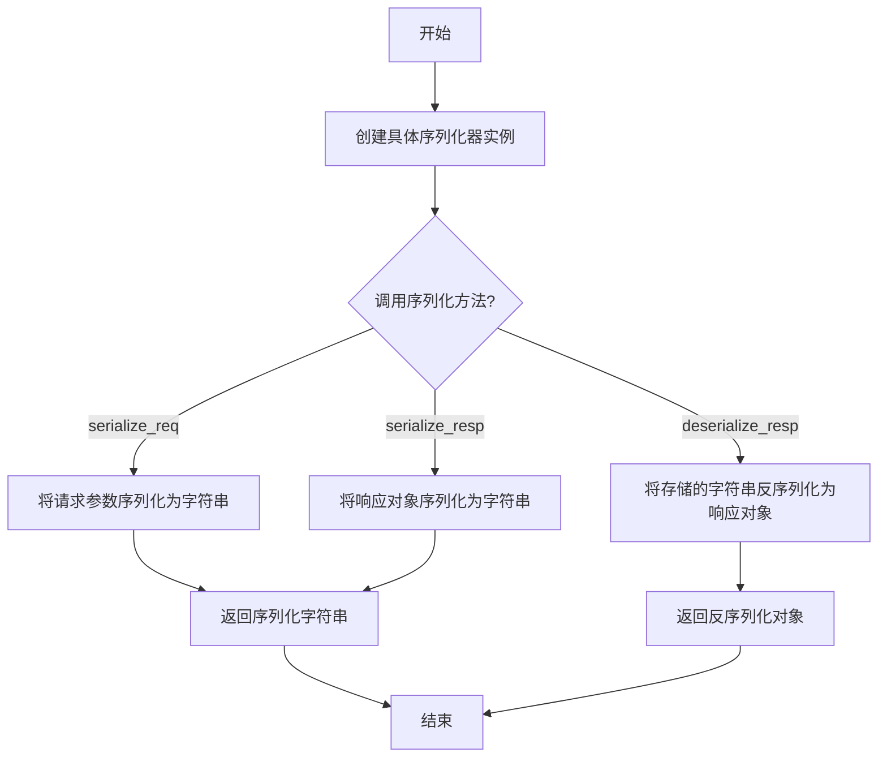
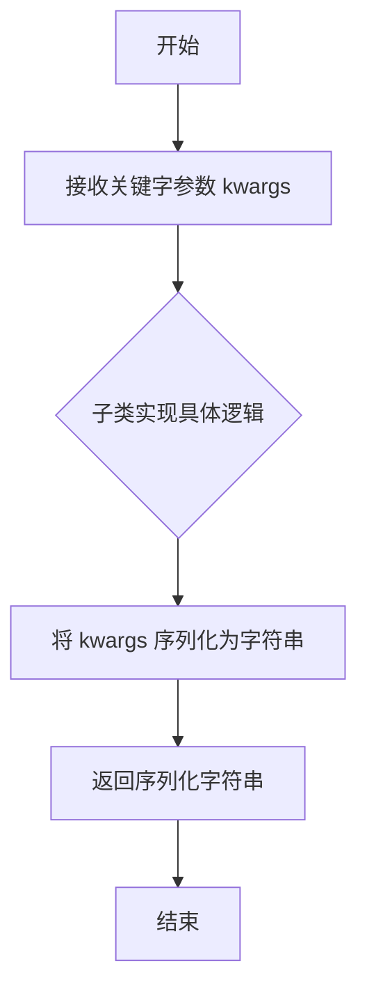
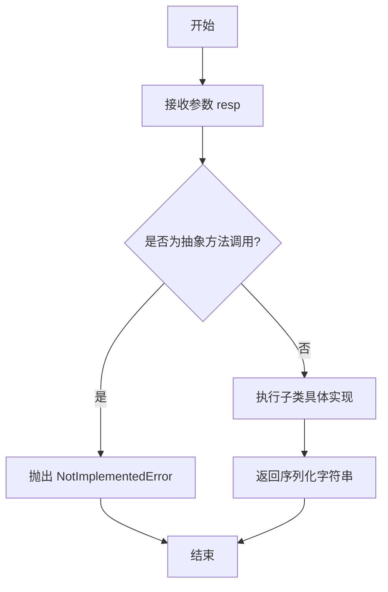

# `.\MetaGPT\metagpt\exp_pool\serializers\base.py` 详细设计文档

该文件定义了一个用于序列化和反序列化请求与响应的抽象基类 `BaseSerializer`。它利用 Pydantic 的 `BaseModel` 来提供数据验证和配置管理，并定义了序列化请求、序列化响应以及反序列化响应的抽象接口，旨在为不同数据格式（如 JSON、Pickle 等）的具体序列化实现提供一个统一的框架。

## 整体流程



## 类结构

```
BaseSerializer (抽象基类)
├── 继承自 Pydantic.BaseModel
├── 继承自 abc.ABC
└── 定义了三个抽象方法
```

## 全局变量及字段


### `BaseSerializer.model_config`
    
Pydantic模型配置字典，用于配置序列化器的行为，例如允许任意类型。

类型：`pydantic.ConfigDict`
    
    

## 全局函数及方法

### `BaseSerializer.serialize_req`

该方法是一个抽象方法，用于将请求参数序列化为字符串以便存储。它要求子类必须实现具体的序列化逻辑，并强调在实现时不应直接修改传入的关键字参数，若需修改应先创建副本以避免副作用。

参数：
-  `kwargs`：`Any`，表示任意数量的关键字参数，这些参数是需要被序列化的请求数据。

返回值：`str`，返回序列化后的字符串表示。

#### 流程图



#### 带注释源码

```python
    @abstractmethod
    def serialize_req(self, **kwargs) -> str:
        """Serializes the request for storage.

        Do not modify kwargs. If modification is necessary, use copy.deepcopy to create a copy first.
        Note that copy.deepcopy may raise errors, such as TypeError: cannot pickle '_thread.RLock' object.
        """
```

### `BaseSerializer.serialize_resp`

该方法是一个抽象方法，用于将函数的返回值序列化为字符串以便存储。它定义了序列化响应的接口规范，具体的序列化逻辑（如使用JSON、Pickle等）需要由继承`BaseSerializer`的子类实现。

参数：

- `resp`：`Any`，需要被序列化的函数返回值，可以是任意类型。

返回值：`str`，序列化后的字符串表示。

#### 流程图



#### 带注释源码

```python
    @abstractmethod
    def serialize_resp(self, resp: Any) -> str:
        """Serializes the function's return value for storage.

        Do not modify resp. The rest is the same as `serialize_req`.
        """
```


### `BaseSerializer.deserialize_resp`

该方法是一个抽象方法，用于将序列化后存储的响应字符串反序列化回函数原始的返回值对象。它定义了序列化器必须具备的反序列化能力接口，具体的反序列化逻辑（如使用 JSON、Pickle 等）由继承此基类的子类实现。

参数：

-  `resp`：`str`，需要被反序列化的、已序列化为字符串的响应数据。

返回值：`Any`，反序列化后得到的原始响应对象，其具体类型由子类实现决定。

#### 流程图

```mermaid
flowchart TD
    A[开始: 调用 deserialize_resp] --> B[输入参数: resp (str类型)]
    B --> C{是否为抽象方法?}
    C -- 是 --> D[抛出 NotImplementedError<br>（由子类实现具体逻辑）]
    C -- 否 --> E[子类实现具体反序列化逻辑<br>（例如: json.loads, pickle.loads）]
    E --> F[返回: 反序列化后的对象 (Any类型)]
    D --> G[流程结束（异常）]
    F --> H[流程结束（正常）]
```

#### 带注释源码

```python
    @abstractmethod
    def deserialize_resp(self, resp: str) -> Any:
        """Deserializes the stored response back to the function's return value"""
        # 这是一个抽象方法，使用 `@abstractmethod` 装饰器标记。
        # 它声明了方法签名：接受一个字符串参数 `resp`，并返回一个 `Any` 类型的对象。
        # 具体的实现必须由 `BaseSerializer` 的子类提供。
        # 子类实现应负责解析 `resp` 字符串，并将其转换回原始的函数返回值。
        # 例如，如果响应是用 JSON 序列化的，子类方法应使用 `json.loads(resp)`。
        # 如果响应是用 Pickle 序列化的，子类方法应使用 `pickle.loads(resp.encode())` 等。
        # 此方法不修改输入参数 `resp`。
```


## 关键组件


### BaseSerializer 基类

定义了序列化请求和响应的抽象基类，为存储和传输提供统一的序列化接口。

### 序列化请求方法 (serialize_req)

将请求参数序列化为字符串格式，用于存储或传输，要求不修改原始参数。

### 序列化响应方法 (serialize_resp)

将函数返回值序列化为字符串格式，用于存储或传输，要求不修改原始返回值。

### 反序列化响应方法 (deserialize_resp)

将存储的序列化字符串反序列化回原始的返回值对象。

### Pydantic 模型配置

通过 `model_config` 启用任意类型支持，允许在序列化/反序列化过程中处理非标准类型。


## 问题及建议


### 已知问题

-   **序列化方法缺乏类型安全约束**：`serialize_req` 和 `serialize_resp` 方法的参数和返回值类型定义过于宽泛（`Any` 和 `str`），这可能导致运行时类型错误，且降低了代码的可读性和可维护性。调用者难以确定应传入何种数据结构，序列化后的字符串格式也不明确。
-   **抽象类未定义通用配置或行为**：`BaseSerializer` 作为所有序列化器的基类，除了定义抽象方法外，没有提供任何通用的配置选项（如日期格式、编码方式）或默认实现（如通用的错误处理或日志记录），这可能导致子类实现重复代码或行为不一致。
-   **深拷贝警告可能引发混淆**：在 `serialize_req` 的文档字符串中提到了使用 `copy.deepcopy` 及其潜在错误（如无法序列化 `_thread.RLock` 对象），但这更像是一个实现细节的警告，而非接口契约的一部分。这可能会让子类开发者困惑，不清楚他们是否应该处理这个问题，以及如何正确处理。
-   **模型配置可能过于宽松**：`model_config = ConfigDict(arbitrary_types_allowed=True)` 允许 Pydantic 模型接受任意类型的字段，这虽然增加了灵活性，但也可能掩盖了类型错误，降低了静态类型检查工具的有效性，并可能使数据验证变得复杂。

### 优化建议

-   **为序列化方法引入泛型或更具体的类型提示**：考虑使用 `TypeVar` 或 `Protocol` 来约束 `serialize_req` 的 `kwargs` 和 `serialize_resp`/`deserialize_resp` 的 `resp` 参数类型。例如，可以定义一个 `Serializable` 协议或使用 `TypedDict` 来明确可序列化数据的结构。同时，可以规定序列化后的字符串为特定格式（如 JSON），并在返回值类型中体现（`-> str` 可考虑改为 `-> str` 并补充说明格式）。
-   **在基类中提供通用功能或配置点**：可以在 `BaseSerializer` 中添加类属性或方法，用于配置序列化/反序列化的通用行为，如 `default_encoding`、`datetime_format` 或一个可覆盖的 `_pre_serialize_hook` 方法。也可以提供一个 `serialize` 的默认实现，它处理通用的深拷贝和错误处理，子类只需实现具体的格式转换逻辑。
-   **重构文档，分离接口契约与实现建议**：将关于 `copy.deepcopy` 的警告移至一个独立的“实现说明”部分，或者创建一个 `_deep_safe_copy` 的受保护方法供子类使用。在抽象方法的文档中，应更专注于描述方法的职责、输入输出的语义，而非具体的实现技术。
-   **收紧 Pydantic 模型配置或提供验证**：除非有强烈理由，否则应考虑移除 `arbitrary_types_allowed=True` 配置，强制子类明确定义其字段类型。或者，在基类中添加一个 `model_post_init` 方法，用于在实例化后执行额外的数据验证或转换，确保数据的一致性。
-   **考虑添加版本控制支持**：如果序列化格式可能随时间演变，可以在基类中引入版本号概念。例如，添加一个 `version: ClassVar[str]` 属性，并在序列化后的字符串中包含版本信息，以便 `deserialize_resp` 能够根据版本号选择正确的反序列化逻辑，提高系统的向后兼容性。


## 其它


### 设计目标与约束

本模块旨在定义一个用于序列化请求和响应的抽象基类，为不同的序列化实现（如 JSON、Pickle、MessagePack 等）提供统一的接口契约。其核心设计目标包括：
1.  **接口标准化**：通过抽象方法 `serialize_req`、`serialize_resp` 和 `deserialize_resp`，强制所有子类实现一致的序列化与反序列化行为。
2.  **数据不可变性**：在序列化过程中，明确要求不得修改输入参数（`kwargs` 和 `resp`），以确保原始数据的完整性，避免副作用。如需修改，必须创建副本。
3.  **类型安全与灵活性**：利用 Pydantic 的 `BaseModel` 提供数据验证和配置管理（如 `arbitrary_types_allowed=True`），同时使用 `typing.Any` 保持返回值类型的灵活性，以适应各种可序列化对象。
4.  **抽象与多态**：作为抽象基类（ABC），它定义了接口而不提供具体实现，支持通过子类化实现多种序列化策略，符合开闭原则。

主要约束包括：
*   子类必须实现所有三个抽象方法。
*   序列化方法必须返回字符串，以便于存储或传输。
*   在实现 `serialize_req` 和 `serialize_resp` 时，开发者需自行处理深拷贝可能引发的异常（如 `TypeError`）。

### 错误处理与异常设计

当前基类未显式定义或处理特定异常，错误处理责任完全下放给具体子类实现。根据设计，可能涉及的异常情况包括：
1.  **序列化错误**：在 `serialize_req` 和 `serialize_resp` 中，当输入对象包含不可序列化的类型（如文件句柄、锁、数据库连接等）时，具体的序列化库（如 `json.dumps` 或 `pickle.dumps`）会抛出相应的异常（如 `TypeError`, `JSONEncodeError`）。文档已提示使用 `copy.deepcopy` 时可能遇到 `TypeError: cannot pickle '_thread.RLock' object` 等错误。
2.  **反序列化错误**：在 `deserialize_resp` 中，当输入的字符串格式无效、损坏或与预期格式不匹配时，具体的反序列化库会抛出异常（如 `json.JSONDecodeError`, `pickle.UnpicklingError`）。
3.  **抽象方法未实现错误**：如果子类未完整实现所有抽象方法，在实例化时会引发 `TypeError`。

**设计建议**：虽然基类未统一捕获异常，但建议子类在实现时：
*   记录详细的错误日志，包含序列化/反序列化的上下文信息。
*   根据应用场景，考虑抛出统一的、业务相关的自定义异常（如 `SerializationError`, `DeserializationError`），以便上层调用者进行更清晰的错误处理和恢复。

### 数据流与状态机

本模块不涉及复杂的状态管理或数据流转换，其数据流是线性和无状态的：
1.  **序列化（正向流）**：
    *   **输入**：`serialize_req` 接受可变关键字参数 `**kwargs`；`serialize_resp` 接受任意类型的响应对象 `resp: Any`。
    *   **处理**：子类实现特定的逻辑将输入对象转换为字符串表示。过程中不应修改原始输入。
    *   **输出**：字符串格式的数据，适用于存储（如数据库、缓存）或传输（如网络消息）。
2.  **反序列化（逆向流）**：
    *   **输入**：`deserialize_resp` 接受一个字符串 `resp: str`，该字符串通常是之前由 `serialize_resp` 生成的。
    *   **处理**：子类实现逻辑将字符串解析、还原为原始的 Python 对象。
    *   **输出**：`Any` 类型的 Python 对象，理论上应与原始 `resp` 对象类型兼容。

整个类自身是无状态的（不包含随时间变化的实例变量），每个方法调用都是独立的操作。

### 外部依赖与接口契约

1.  **外部依赖**：
    *   `abc.ABC` 和 `abc.abstractmethod`：用于定义抽象基类。
    *   `typing.Any`：用于类型注解，提供灵活性。
    *   `pydantic.BaseModel` 和 `pydantic.ConfigDict`：用于获得数据模型的功能和配置（当前主要利用了 `arbitrary_types_allowed=True` 来允许非Pydantic类型作为字段值，增强了作为Mixin类的兼容性）。这是唯一重要的第三方库依赖。

2.  **接口契约（对子类的强制要求）**：
    *   **`serialize_req(**kwargs) -> str`**：必须实现。将请求参数序列化为字符串。不得修改 `kwargs`。
    *   **`serialize_resp(resp: Any) -> str`**：必须实现。将响应对象序列化为字符串。不得修改 `resp`。
    *   **`deserialize_resp(resp: str) -> Any`**：必须实现。将序列化后的字符串反序列化为响应对象。
    *   所有子类必须继承自 `BaseSerializer` 并实现上述三个方法，否则无法实例化。

3.  **接口契约（对调用者的承诺）**：
    *   调用 `serialize_req` 和 `serialize_resp` 后，将获得一个可存储的字符串。
    *   调用 `deserialize_resp` 并传入一个由 `serialize_resp` 生成的字符串后，将获得一个与原对象语义上等价的 Python 对象（具体等价性由子类实现保证）。
    *   序列化过程不会改变传入的原始数据。

    