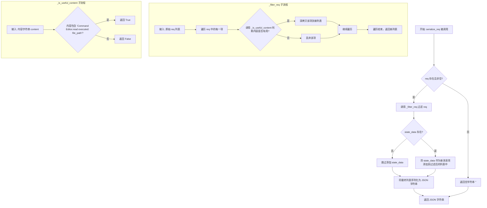
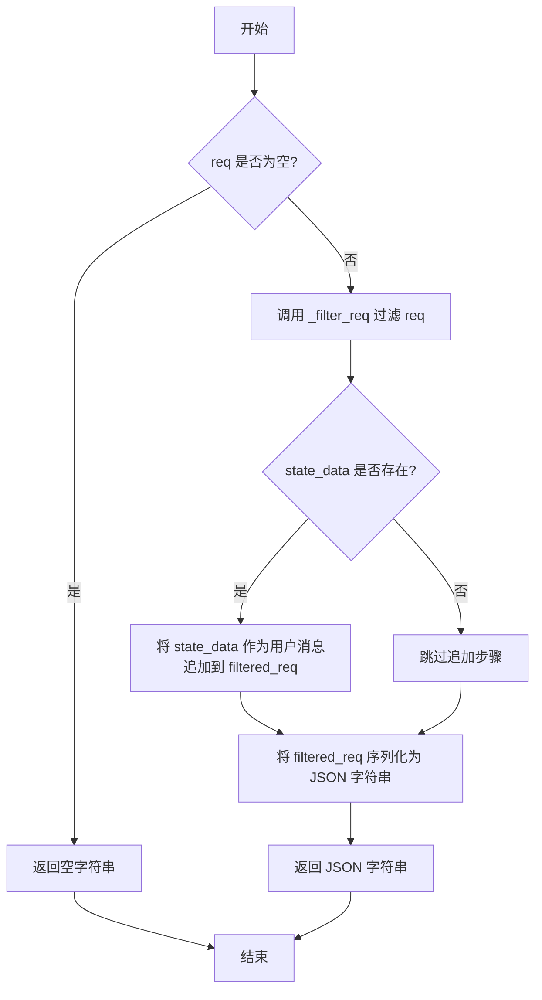
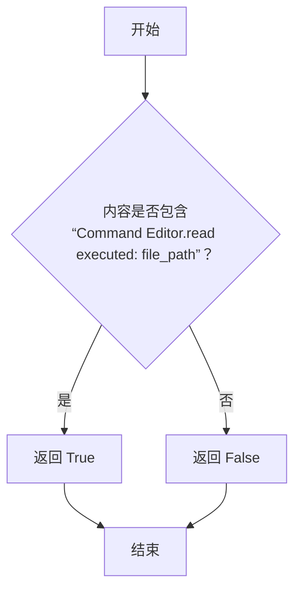

# `.\MetaGPT\metagpt\exp_pool\serializers\role_zero.py` 详细设计文档

该代码定义了一个名为 RoleZeroSerializer 的序列化器，它继承自 SimpleSerializer。其核心功能是处理并序列化对话请求（req），以便存储到数据库中。它通过过滤掉不必要的内容（基于特定规则判断内容是否有用）来精简请求数据，并可选择性地添加上下文状态数据（state_data），最终将处理后的列表转换为 JSON 字符串。

## 整体流程



## 类结构

```
SimpleSerializer (父类，来自 metagpt.exp_pool.serializers.simple)
└── RoleZeroSerializer (本文件定义的类)
    ├── serialize_req (公共方法)
    ├── _filter_req (私有方法)
    └── _is_useful_content (私有方法)
```

## 全局变量及字段


    

## 全局函数及方法


### `RoleZeroSerializer.serialize_req`

该方法用于将请求序列化为字符串，以便存储到数据库中。它通过过滤原始请求中的内容，仅保留必要的部分，以避免因请求过长而导致的嵌入错误。如果提供了额外的状态数据，会将其作为用户消息追加到过滤后的请求中。

参数：

-  `kwargs`：`dict`，包含序列化所需参数的关键字参数字典。其中，`req` 键对应的值应为要序列化的请求列表，`state_data` 键对应的值（可选）为要追加的状态数据字符串。

返回值：`str`，序列化后的请求，以 JSON 字符串格式返回。如果输入请求为空，则返回空字符串。

#### 流程图



#### 带注释源码

```python
def serialize_req(self, **kwargs) -> str:
    """Serialize the request for database storage, ensuring it is a string.

    Only extracts the necessary content from `req` because `req` may be very lengthy and could cause embedding errors.

    Args:
        req (list[dict]): The request to be serialized. Example:
            [
                {"role": "user", "content": "..."},
                {"role": "assistant", "content": "..."},
                {"role": "user", "content": "context"},
            ]

    Returns:
        str: The serialized request as a JSON string.
    """
    # 从关键字参数中获取请求列表，默认为空列表
    req = kwargs.get("req", [])

    # 如果请求为空，直接返回空字符串
    if not req:
        return ""

    # 调用内部方法过滤请求，只保留有用的内容
    filtered_req = self._filter_req(req)

    # 如果提供了状态数据，将其作为一条新的用户消息追加到过滤后的请求中
    if state_data := kwargs.get("state_data"):
        filtered_req.append({"role": "user", "content": state_data})

    # 将最终的请求列表序列化为 JSON 字符串并返回
    return json.dumps(filtered_req)
```


### `RoleZeroSerializer._filter_req`

该方法用于过滤传入的请求列表，仅保留那些内容被判定为“有用”的项。它通过遍历原始请求列表，对每个项的内容调用 `_is_useful_content` 方法进行判断，并深拷贝符合条件的项，最终返回一个新的过滤后的列表。

参数：

- `req`：`list[dict]`，原始的请求列表，其中每个字典通常包含 `role` 和 `content` 键。

返回值：`list[dict]`，过滤后的请求列表，仅包含内容被判定为有用的项。

#### 流程图

```mermaid
flowchart TD
    A[开始] --> B[初始化空列表 filtered_req]
    B --> C{遍历 req 中的每个 item}
    C --> D[调用 _is_useful_content(item['content'])]
    D --> E{内容是否有用？}
    E -- 是 --> F[深拷贝 item 并添加到 filtered_req]
    E -- 否 --> C
    F --> C
    C --> G[遍历结束]
    G --> H[返回 filtered_req]
    H --> I[结束]
```

#### 带注释源码

```python
def _filter_req(self, req: list[dict]) -> list[dict]:
    """Filter the `req` to include only necessary items.

    Args:
        req (list[dict]): The original request.

    Returns:
        list[dict]: The filtered request.
    """
    # 使用列表推导式，遍历原始请求列表 `req`
    # 对每个 `item`，检查其 `content` 字段是否通过 `_is_useful_content` 方法的判断
    # 如果判断为有用，则使用 `copy.deepcopy` 深拷贝该 `item`，以避免修改原始数据
    # 将所有符合条件的深拷贝项组成一个新的列表 `filtered_req`
    filtered_req = [copy.deepcopy(item) for item in req if self._is_useful_content(item["content"])]

    # 返回过滤后的列表
    return filtered_req
```

### `RoleZeroSerializer._is_useful_content`

该方法用于判断给定的内容字符串是否被视为“有用内容”。当前实现仅检查内容中是否包含特定的文件读取命令标识符，未来可扩展更多判断逻辑。

参数：
- `content`：`str`，需要判断的原始内容字符串。

返回值：`bool`，如果内容被视为有用则返回 `True`，否则返回 `False`。

#### 流程图



#### 带注释源码

```python
def _is_useful_content(self, content: str) -> bool:
    """Currently, only the content of the file is considered, and more judgments can be added later."""

    # 判断内容中是否包含特定的文件读取命令标识符
    if "Command Editor.read executed: file_path" in content:
        return True

    # 如果不包含，则视为无用内容
    return False
```

## 关键组件


### 序列化器基类继承

通过继承 `SimpleSerializer` 基类，复用基础的序列化框架，并在此基础上进行特定功能的扩展。

### 请求内容过滤

在序列化前对原始请求列表进行过滤，仅保留被判定为“有用”的内容条目，以减少存储开销并避免潜在的嵌入错误。

### 有用内容判定器

提供一个可扩展的方法 `_is_useful_content`，用于根据特定规则（当前版本基于文件路径关键词）判断请求中的内容片段是否应被保留。

### 状态数据注入

支持在序列化过程中，将额外的状态数据（`state_data`）作为一条新的用户消息追加到过滤后的请求列表中，实现上下文信息的动态补充。


## 问题及建议


### 已知问题

-   **内容过滤逻辑过于简单且脆弱**：`_is_useful_content` 方法仅通过检查字符串 `"Command Editor.read executed: file_path"` 是否存在来判断内容是否有用。这存在几个问题：1) 如果内容格式稍有变化（如大小写、空格、标点），过滤就会失效；2) 过滤条件单一，无法适应未来可能出现的其他有用内容模式；3) 这是一个硬编码的字符串，缺乏可配置性。
-   **序列化方法对输入参数的假设不明确**：`serialize_req` 方法通过 `kwargs.get("req", [])` 获取 `req` 参数，但方法文档中将其描述为必需参数 (`req (list[dict])`)。这种不一致性可能导致调用者困惑或运行时错误（如果 `req` 未提供但代码期望它是列表）。
-   **潜在的性能开销**：`_filter_req` 方法中对列表中的每个字典项都使用了 `copy.deepcopy`。如果 `req` 列表很大或字典结构复杂，这可能会带来不必要的性能开销，尤其是当过滤条件可能只保留很少一部分项时。
-   **缺乏错误处理**：代码没有对输入数据的有效性进行充分校验。例如，`req` 中的字典可能缺少 `"content"` 键，或者在 `_is_useful_content` 中假设 `content` 是字符串，但如果传入其他类型（如 `None`）会导致 `TypeError`。

### 优化建议

-   **增强内容过滤的健壮性和可扩展性**：
    -   将 `_is_useful_content` 中的硬编码字符串改为可配置的正则表达式或模式列表。
    -   考虑将过滤逻辑抽象为策略模式，允许运行时注册不同的内容判断器，以便轻松扩展新的有用内容模式。
    -   在过滤前，增加对 `content` 参数类型的检查，并处理 `None` 或非字符串情况。
-   **明确方法契约和参数处理**：
    -   修改 `serialize_req` 的方法签名，将 `req` 作为显式参数，例如 `def serialize_req(self, req: list[dict] = None, **kwargs) -> str:`，并在文档中明确其默认值和作用。
    -   或者在方法开始时对 `req` 进行更严格的校验，如果为 `None` 则初始化为空列表，并记录警告或引发特定异常。
-   **优化性能**：
    -   评估 `copy.deepcopy` 的必要性。如果原始 `req` 数据在序列化后不会被修改，且过滤后的列表是全新的，可以考虑使用浅拷贝 (`copy.copy`) 或直接构建新字典（如果内容本身是字符串等不可变对象）。
    -   如果 `req` 经常很大，可以考虑使用生成器表达式或迭代器进行惰性过滤，以减少内存占用。
-   **增加健壮性**：
    -   在 `_filter_req` 中，访问 `item["content"]` 之前，使用 `item.get("content")` 并检查其是否存在及类型。
    -   在 `serialize_req` 中，对 `json.dumps` 的调用进行异常捕获，处理可能的序列化错误（例如，如果 `filtered_req` 中包含不可序列化的对象）。
    -   考虑添加日志记录，以便在过滤掉大量内容或发生异常时进行调试。


## 其它


### 设计目标与约束

本序列化器的核心设计目标是为经验池（exp_pool）提供一种针对特定角色（RoleZero）的请求序列化方案。它继承自 `SimpleSerializer`，旨在处理可能非常冗长的对话请求（`req`），通过过滤仅保留对后续学习或分析有用的内容（如文件读取操作），以避免因内容过长导致的嵌入（embedding）错误或存储效率低下。主要约束包括：必须确保输出为字符串格式以适配数据库存储；过滤逻辑需保持轻量高效；同时需兼容父类接口，并能灵活处理可能存在的额外状态数据（`state_data`）。

### 错误处理与异常设计

代码中显式的错误处理较少，主要依赖调用方传入正确格式的数据。潜在风险点及处理方式如下：
1.  `kwargs.get("req", [])`：当 `req` 参数未提供时，默认为空列表，避免了 `KeyError`。
2.  `item["content"]`：在 `_filter_req` 方法中直接访问字典的 `"content"` 键，假设了 `req` 中每个字典项都包含此键。如果输入格式不符，将抛出 `KeyError`。这属于前置条件约束，应由调用方保证。
3.  `json.dumps(filtered_req)`：将过滤后的列表序列化为 JSON 字符串。如果列表中包含不可 JSON 序列化的对象（理论上经过 `copy.deepcopy` 和过滤后应避免），会抛出 `TypeError`。
当前设计将格式正确性的责任归于调用方，属于“快速失败”（fail-fast）策略。对于生产环境，可考虑在方法入口增加数据格式验证，并抛出更具描述性的自定义异常。

### 数据流与状态机

本模块不涉及复杂的状态机，其数据流是线性的、无状态的（Stateless）：
1.  **输入**：`serialize_req` 方法接收关键字参数，主要期待 `req`（对话列表）和可选的 `state_data`（状态字符串）。
2.  **处理**：
    a. 提取 `req`，若为空则直接返回空字符串。
    b. 调用 `_filter_req(req)`，其内部遍历 `req` 的每一项，使用 `_is_useful_content` 判断其 `content` 字段是否包含特定关键词（`"Command Editor.read executed: file_path"`），仅保留有用的项并进行深拷贝。
    c. 如果提供了 `state_data`，则将其作为一个新的用户消息字典追加到过滤后的列表末尾。
3.  **输出**：将最终的处理列表通过 `json.dumps` 转换为 JSON 字符串返回。
整个流程是确定性的，相同的输入必然产生相同的输出字符串。

### 外部依赖与接口契约

1.  **继承依赖**：继承自 `metagpt.exp_pool.serializers.simple.SimpleSerializer`。需遵循父类的接口契约（虽然代码中未展示父类方法，但假设 `serialize_req` 是重写或实现自父类）。任何对父类行为的更改都可能影响本类。
2.  **标准库依赖**：`copy`（用于深拷贝）、`json`（用于序列化）。这些是稳定的 Python 标准库组件。
3.  **输入契约**：
    *   `serialize_req` 的 `req` 参数应为 `list[dict]` 类型，其中每个字典至少包含 `"role"` 和 `"content"` 键，且 `"content"` 为字符串。
    *   `state_data` 应为字符串或 `None`。
4.  **输出契约**：始终返回 `str` 类型，要么是空字符串，要么是合法的 JSON 字符串，该字符串是过滤并可能追加数据后的消息列表的 JSON 表示。
5.  **内部方法契约**：`_filter_req` 和 `_is_useful_content` 是私有方法（以单下划线开头），意味着它们被视为内部实现细节，外部调用者不应直接依赖它们，其行为可能在后续版本中改变而不作通知。

    