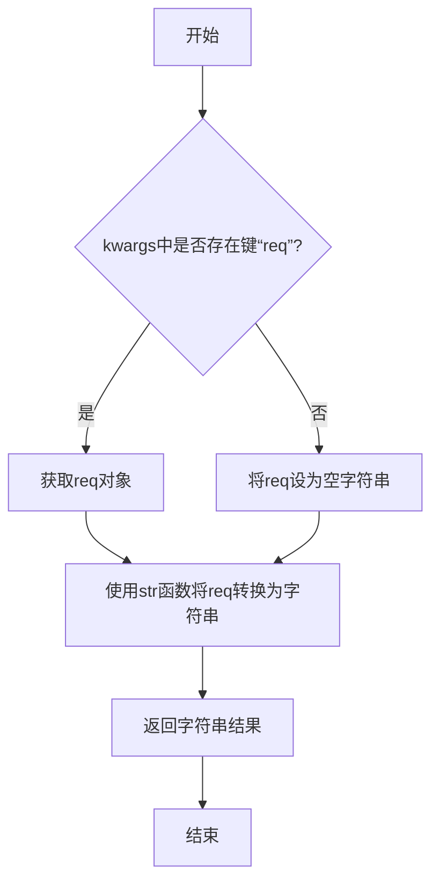
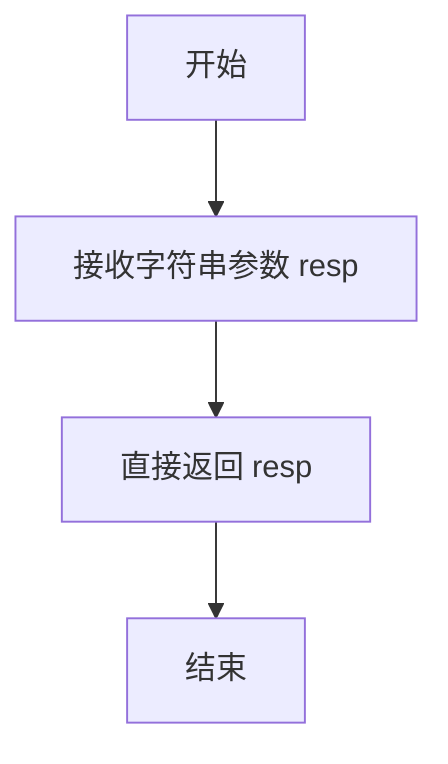

# `.\MetaGPT\metagpt\exp_pool\serializers\simple.py` 详细设计文档

该文件实现了一个简单的序列化器 `SimpleSerializer`，它继承自 `BaseSerializer`。其核心功能是提供最基本的序列化与反序列化操作：对于请求对象，直接使用 `str()` 函数将其转换为字符串；对于响应对象，同样使用 `str()` 函数进行序列化，而反序列化则直接返回原始的字符串响应。这是一个轻量级的、无格式转换的序列化实现，适用于对序列化格式没有严格要求或仅需进行字符串化处理的场景。

## 整体流程

```mermaid
graph TD
    A[调用序列化/反序列化方法] --> B{判断方法类型}
    B -- serialize_req --> C[获取req参数]
    C --> D[使用str(req)转换]
    D --> E[返回字符串结果]
    B -- serialize_resp --> F[获取resp参数]
    F --> G[使用str(resp)转换]
    G --> E
    B -- deserialize_resp --> H[获取resp字符串参数]
    H --> I[直接返回原字符串]
    I --> E
```

## 类结构

```
BaseSerializer (抽象基类，位于metagpt.exp_pool.serializers.base)
└── SimpleSerializer (简单序列化器实现)
```

## 全局变量及字段


    

## 全局函数及方法


### `SimpleSerializer.serialize_req`

该方法用于将请求对象序列化为字符串。它通过Python内置的`str()`函数，将传入的`req`参数（如果存在）转换为字符串。如果`req`参数不存在，则返回空字符串。

参数：
-  `kwargs`：`dict`，一个包含任意关键字参数的字典。该方法期望从该字典中获取键为`"req"`的值作为请求对象。

返回值：`str`，返回请求对象（或空字符串）的字符串表示形式。

#### 流程图



#### 带注释源码

```python
def serialize_req(self, **kwargs) -> str:
    """Just use `str` to convert the request object into a string."""

    # 从关键字参数字典kwargs中获取键为"req"的值。
    # 如果"req"不存在，则使用默认值空字符串""。
    # 然后使用Python内置的str()函数将其转换为字符串并返回。
    return str(kwargs.get("req", ""))
```


### `SimpleSerializer.serialize_resp`

该方法将任意类型的响应对象（`resp`）通过 Python 内置的 `str()` 函数转换为字符串。这是 `BaseSerializer` 接口中 `serialize_resp` 方法的一个简单实现，适用于不需要复杂序列化逻辑的场景。

参数：

-  `resp`：`Any`，需要被序列化为字符串的任意类型响应对象。

返回值：`str`，返回 `resp` 对象转换后的字符串表示。

#### 流程图

```mermaid
flowchart TD
    A[开始] --> B[接收参数 resp]
    B --> C{调用 str(resp) 进行转换}
    C --> D[返回转换后的字符串]
    D --> E[结束]
```

#### 带注释源码

```python
def serialize_resp(self, resp: Any) -> str:
    """Just use `str` to convert the response object into a string."""

    # 使用 Python 内置的 str() 函数将任意类型的 resp 对象转换为字符串。
    # 这是最简单直接的序列化方式，适用于基本数据类型或已定义良好 __str__ 方法的对象。
    return str(resp)
```


### `SimpleSerializer.deserialize_resp`

该方法用于反序列化一个字符串类型的响应，将其转换回原始的Python对象。在本实现中，它直接返回输入的字符串，不做任何转换。

参数：

-  `resp`：`str`，需要被反序列化的字符串响应。

返回值：`Any`，返回输入的字符串 `resp` 本身。

#### 流程图



#### 带注释源码

```python
def deserialize_resp(self, resp: str) -> Any:
    """Just return the string response as it is."""

    return resp
```


## 关键组件


### SimpleSerializer 类

一个简单的序列化器实现，提供了基础的请求序列化、响应序列化和响应反序列化功能。

### 序列化方法 (`serialize_req`)

将请求对象通过 `str()` 函数转换为字符串。

### 序列化方法 (`serialize_resp`)

将响应对象通过 `str()` 函数转换为字符串。

### 反序列化方法 (`deserialize_resp`)

将字符串形式的响应直接返回，不进行任何转换。


## 问题及建议


### 已知问题

-   **类型安全缺失**：`serialize_req` 方法通过 `kwargs.get("req", "")` 获取请求对象，这依赖于调用者传入正确的关键字参数 `req`。如果调用者传入其他参数名或未传入，方法将返回空字符串，可能导致序列化结果不符合预期且难以调试。
-   **反序列化功能不完整**：`deserialize_resp` 方法直接返回输入的字符串，没有将其转换回原始的响应对象类型。这违背了序列化/反序列化通常应保证 `deserialize(serialize(obj)) == obj` 的契约，使得该序列化器无法用于需要恢复对象状态的场景。
-   **序列化结果不可逆且信息有限**：`serialize_req` 和 `serialize_resp` 方法都使用 Python 内置的 `str()` 函数。对于复杂对象（如自定义类实例），`str()` 的默认实现（例如 `<__main__.MyObject at 0x...>`）产生的字符串包含的信息很少，且无法通过 `deserialize_resp` 恢复原对象。
-   **缺乏错误处理**：代码中没有对输入数据的有效性进行检查或异常处理。例如，如果传入的对象无法被 `str()` 安全转换，或者反序列化时传入非字符串类型，程序可能会抛出异常。

### 优化建议

-   **明确序列化契约并增强类型提示**：在 `serialize_req` 方法中，将参数 `req` 作为必需的位置或关键字参数，而不是从 `**kwargs` 中获取。同时，为所有方法的参数和返回值添加更精确的类型注解（例如使用 `typing` 模块的泛型），以提高代码的可读性和类型检查工具的效用。
-   **实现真正的双向序列化**：根据项目需求，选择或实现一种能够支持双向转换的序列化方案。例如，对于简单数据结构，可以使用 `json.dumps` 和 `json.loads`；对于需要保存类型信息的复杂对象，可以考虑 `pickle` 或第三方库如 `marshmallow`、`pydantic`。`SimpleSerializer` 应重命名为更能反映其实际功能的名称（如 `StringCastSerializer`），或者被一个功能完整的序列化器替代。
-   **增加数据验证和错误处理**：在序列化和反序列化方法中，添加输入验证（如检查类型）并使用 `try-except` 块捕获可能的异常（如 `TypeError`, `ValueError`），并抛出统一的、具有描述性的自定义异常，方便上游调用者处理。
-   **提供配置选项或扩展点**：如果 `str()` 转换在某些简单场景下足够使用，可以考虑让序列化器接受一个可选的 `转换器` 函数或格式化字符串参数，使其行为可配置，增加灵活性。
-   **完善文档和示例**：在类和方法文档字符串中，清晰说明当前实现的局限性（例如“仅用于调试输出，不支持反序列化还原对象”），并提供使用示例，避免开发者误用。


## 其它


### 设计目标与约束

该代码的设计目标是提供一个极简的序列化/反序列化实现，作为 `BaseSerializer` 抽象基类的具体实现。其核心约束是保持实现的简单性和通用性，不依赖于任何特定的数据格式（如 JSON、YAML），仅使用 Python 内置的 `str()` 函数进行转换。这使其适用于那些不关心结构化数据，仅需将对象转换为字符串形式进行存储或传递的场景。设计上要求它必须实现基类定义的 `serialize_req`、`serialize_resp` 和 `deserialize_resp` 接口。

### 错误处理与异常设计

当前代码没有显式的错误处理逻辑。它完全依赖 Python 内置 `str()` 函数的行为和调用方传入的参数。潜在的风险包括：
1.  **`serialize_req`**: 如果 `kwargs` 中不存在 `"req"` 键，则使用默认空字符串 `""`，这可能掩盖调用错误。
2.  **`str()` 转换异常**: 如果传入的对象其 `__str__` 方法抛出异常，此异常将直接传播给调用者。
3.  **类型安全缺失**: `deserialize_resp` 方法直接返回输入的字符串，声称返回 `Any` 类型，但实际上并未进行任何反序列化操作。调用者需自行知晓并处理返回的实为字符串这一事实，这可能导致下游逻辑的类型错误。
该设计将错误处理的职责完全交给了调用者，符合其“极简”的定位，但牺牲了健壮性和清晰性。

### 数据流与状态机

该组件无内部状态，所有方法都是纯函数。数据流非常简单：
1.  **序列化请求 (`serialize_req`)**：输入为关键字参数字典，从中提取 `"req"` 对应的值（或默认空字符串），通过 `str()` 转换为字符串输出。
2.  **序列化响应 (`serialize_resp`)**：输入为任意类型的 `resp` 对象，通过 `str()` 转换为字符串输出。
3.  **反序列化响应 (`deserialize_resp`)**：输入为一个字符串，直接将该字符串作为输出返回，未进行任何实际的数据结构还原。
整个流程不涉及状态转换，仅进行数据格式的浅层转换。

### 外部依赖与接口契约

1.  **外部依赖**:
    *   **父类**: `metagpt.exp_pool.serializers.base.BaseSerializer`。该类定义了必须实现的抽象接口，是本代码存在的基石。
    *   **Python 内置函数**: `str()` 和 `dict.get()`。
    *   **类型标注**: `typing.Any`。
2.  **接口契约**:
    *   **`serialize_req(self, **kwargs) -> str`**: 契约期望调用者通过 `kwargs` 传递一个 `"req"` 键，其值为需要序列化的对象。返回值是该对象的字符串表示。
    *   **`serialize_resp(self, resp: Any) -> str`**: 契约期望接收一个任意对象，返回其字符串表示。
    *   **`deserialize_resp(self, resp: str) -> Any`**: 契约具有误导性。它接收一个字符串，但返回类型声明为 `Any`，暗示可能返回某种反序列化后的对象。实际实现违反了这一暗示，直接返回原字符串，形成了脆弱的隐式契约：调用者必须知道该方法并未真正反序列化。

    