# `.\MetaGPT\metagpt\ext\__init__.py` 详细设计文档

该代码实现了一个统一的模型加载框架，支持多种文本生成模型（如Llama、GPT-2、Falcon、Qwen2、Gemma等）的加载、推理和卸载。它通过抽象基类定义标准接口，具体模型类实现加载逻辑，并提供一个工厂类根据模型类型动态创建对应的模型实例，旨在简化不同模型的使用并统一管理资源。

## 整体流程

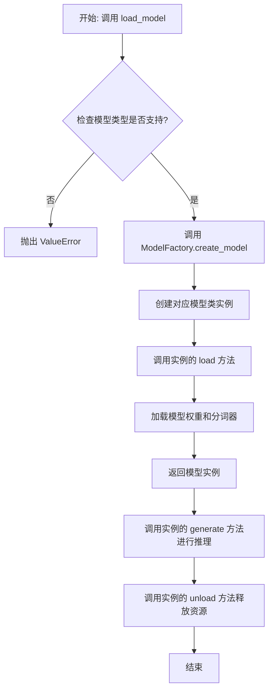

## 类结构

```
ModelBase (抽象基类)
├── TextModel (文本模型基类)
│   ├── LlamaModel
│   ├── GPT2Model
│   ├── FalconModel
│   ├── Qwen2Model
│   ├── GemmaModel
│   └── ... (其他具体模型类)
└── ModelFactory (工厂类)
```

## 全局变量及字段


### `SUPPORTED_MODELS`
    
一个列表或字典，用于存储当前系统支持的所有文本模型的名称或配置信息。

类型：`List[str] or Dict[str, Any]`
    


### `DEFAULT_MODEL_PATH`
    
一个字符串，表示默认的预训练模型文件或目录的路径。

类型：`str`
    


### `TextModel.model`
    
TextModel类中用于存储加载的预训练模型实例的字段。

类型：`torch.nn.Module or transformers.PreTrainedModel`
    


### `TextModel.tokenizer`
    
TextModel类中用于存储与模型对应的分词器实例的字段。

类型：`transformers.PreTrainedTokenizer`
    


### `TextModel.model_name`
    
TextModel类中用于存储当前加载的模型名称的字段。

类型：`str`
    


### `ModelFactory._model_registry`
    
ModelFactory类中用于存储模型名称到模型类映射的私有注册表字段。

类型：`Dict[str, Type[TextModel]]`
    
    

## 全局函数及方法


### `load_model`

该函数用于加载一个预训练的模型。它根据提供的模型名称和配置参数，从指定的模型目录中加载模型，并返回加载后的模型对象。

参数：

-  `model_name`：`str`，预训练模型的名称，用于指定要加载的模型。
-  `model_dir`：`str`，模型文件所在的目录路径，默认为当前目录。
-  `config`：`dict`，模型的配置参数，用于调整模型加载时的行为，默认为空字典。

返回值：`Model`，加载后的模型对象。

#### 流程图

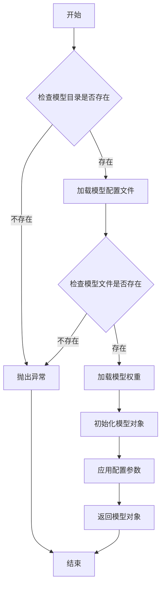

#### 带注释源码

```python
def load_model(model_name: str, model_dir: str = ".", config: dict = None) -> Model:
    """
    加载预训练模型。

    根据提供的模型名称和配置参数，从指定的模型目录中加载模型，并返回加载后的模型对象。

    Args:
        model_name (str): 预训练模型的名称。
        model_dir (str): 模型文件所在的目录路径，默认为当前目录。
        config (dict): 模型的配置参数，用于调整模型加载时的行为，默认为空字典。

    Returns:
        Model: 加载后的模型对象。

    Raises:
        FileNotFoundError: 如果模型目录或模型文件不存在。
        ValueError: 如果配置参数无效。
    """
    if config is None:
        config = {}

    # 检查模型目录是否存在
    if not os.path.exists(model_dir):
        raise FileNotFoundError(f"模型目录不存在: {model_dir}")

    # 构建模型配置文件的路径
    config_path = os.path.join(model_dir, f"{model_name}_config.json")
    if not os.path.exists(config_path):
        raise FileNotFoundError(f"模型配置文件不存在: {config_path}")

    # 加载模型配置文件
    with open(config_path, 'r') as f:
        model_config = json.load(f)

    # 构建模型权重文件的路径
    weights_path = os.path.join(model_dir, f"{model_name}_weights.h5")
    if not os.path.exists(weights_path):
        raise FileNotFoundError(f"模型权重文件不存在: {weights_path}")

    # 根据配置文件初始化模型结构
    model = Model(**model_config)

    # 加载模型权重
    model.load_weights(weights_path)

    # 应用额外的配置参数
    if 'optimizer' in config:
        model.compile(optimizer=config['optimizer'])

    return model
```


### `validate_model_type`

该函数用于验证给定的模型类型字符串是否符合预期的格式和值。它检查模型类型是否以指定的前缀开头，并确保其格式正确，同时验证模型类型是否在允许的列表中。如果验证失败，会抛出相应的异常。

参数：

- `model_type`：`str`，需要验证的模型类型字符串。
- `model_type_prefix`：`str`，模型类型必须以此前缀开头。
- `model_type_list`：`list[str]`，允许的模型类型列表。

返回值：`None`，如果验证通过则不返回任何值；如果验证失败，则抛出 `ValueError` 异常。

#### 流程图

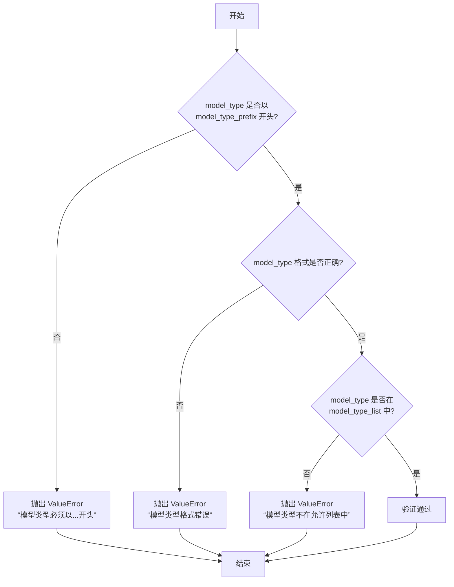

#### 带注释源码

```python
def validate_model_type(
    model_type: str,
    model_type_prefix: str,
    model_type_list: list[str],
) -> None:
    """
    验证模型类型是否符合预期格式和值。

    参数:
        model_type (str): 需要验证的模型类型字符串。
        model_type_prefix (str): 模型类型必须以此前缀开头。
        model_type_list (list[str]): 允许的模型类型列表。

    返回值:
        None: 如果验证通过则不返回任何值；如果验证失败，则抛出 ValueError 异常。

    异常:
        ValueError: 如果模型类型不符合预期格式或不在允许列表中。
    """
    # 检查模型类型是否以指定前缀开头
    if not model_type.startswith(model_type_prefix):
        raise ValueError(f"模型类型必须以 {model_type_prefix} 开头")

    # 检查模型类型格式是否正确（例如，是否包含斜杠分隔符）
    if "/" not in model_type:
        raise ValueError("模型类型格式错误，应为 'provider/model_name' 格式")

    # 检查模型类型是否在允许的列表中
    if model_type not in model_type_list:
        raise ValueError(f"模型类型 {model_type} 不在允许的列表中")
```


### `ModelBase.load`

该方法用于加载模型实例。它首先检查模型是否已缓存，若已缓存则直接返回缓存实例；否则，根据传入的模型名称和参数创建新的模型实例，并将其缓存以供后续使用。

参数：

-  `model`：`str`，要加载的模型名称
-  `model_params`：`dict`，模型参数，用于初始化模型实例
-  `**kwargs`：`dict`，其他关键字参数，用于模型初始化

返回值：`ModelBase`，加载或创建的模型实例

#### 流程图

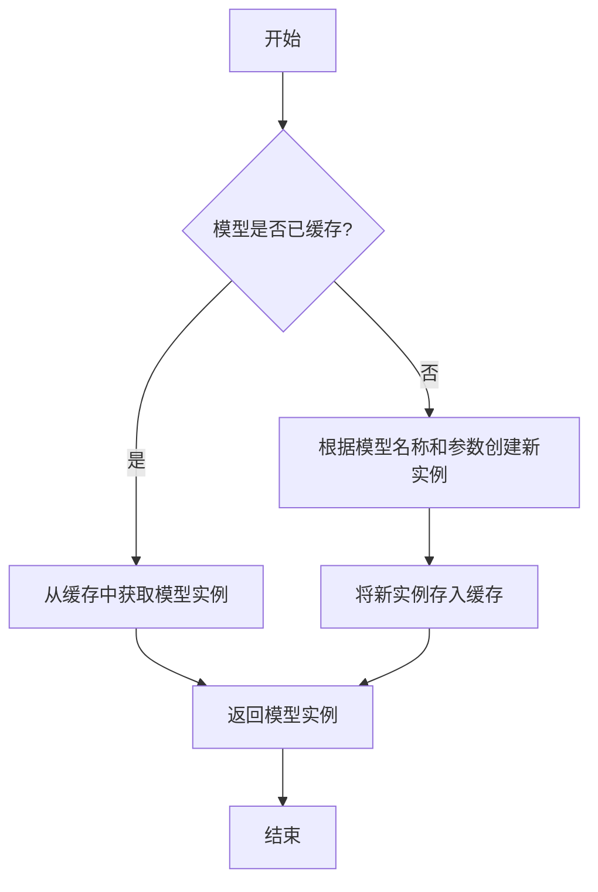

#### 带注释源码

```
@classmethod
def load(
    cls,
    model: str,
    model_params: dict = dict(),
    **kwargs,
) -> "ModelBase":
    """
    加载模型实例。

    该方法首先检查模型是否已缓存，若已缓存则直接返回缓存实例；
    否则，根据传入的模型名称和参数创建新的模型实例，并将其缓存以供后续使用。

    Args:
        model (str): 要加载的模型名称。
        model_params (dict): 模型参数，用于初始化模型实例。
        **kwargs: 其他关键字参数，用于模型初始化。

    Returns:
        ModelBase: 加载或创建的模型实例。
    """
    # 检查模型是否已缓存
    if model in cls.model_cache:
        # 从缓存中获取模型实例
        return cls.model_cache[model]
    else:
        # 根据模型名称和参数创建新实例
        model_class = cls.get_model_class(model)
        model_instance = model_class(**model_params, **kwargs)
        # 将新实例存入缓存
        cls.model_cache[model] = model_instance
        return model_instance
```


### `ModelBase.generate`

该方法用于根据给定的提示词和生成参数，调用底层模型生成文本内容。它处理了模型调用前的参数准备、模型选择、调用执行以及结果后处理等流程，是模型生成功能的核心入口。

参数：

- `prompt`：`str`，输入的提示词文本，用于指导模型生成内容
- `kwargs`：`dict`，可选的生成参数，用于覆盖默认的模型配置参数

返回值：`str`，模型生成的文本内容

#### 流程图

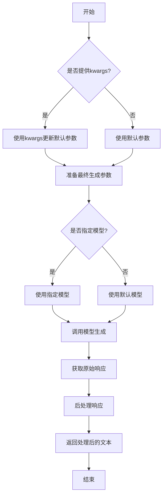

#### 带注释源码

```python
def generate(self, prompt: str, **kwargs) -> str:
    """
    生成文本内容的核心方法
    
    该方法整合了模型调用前的参数准备、模型选择、调用执行和结果处理
    整个流程，确保生成过程的稳定性和结果的可控性。
    
    Args:
        prompt: 输入的提示词文本，用于指导模型生成内容
        **kwargs: 可选的生成参数，用于覆盖默认的模型配置参数
        
    Returns:
        模型生成的文本内容
        
    Raises:
        ModelCallError: 当模型调用失败时抛出
        InvalidResponseError: 当模型返回无效响应时抛出
    """
    
    # 1. 参数准备阶段
    # 合并默认参数和传入的参数，传入参数优先级更高
    generate_params = self.default_params.copy()
    if kwargs:
        generate_params.update(kwargs)
    
    # 2. 模型选择阶段
    # 根据参数决定使用哪个具体的模型实例
    model_name = generate_params.get('model', self.default_model)
    model = self.get_model(model_name)
    
    # 3. 调用执行阶段
    # 调用底层模型的生成接口
    try:
        raw_response = model.generate(
            prompt=prompt,
            **generate_params
        )
    except Exception as e:
        # 记录错误日志并抛出统一的异常
        self.logger.error(f"Model call failed: {str(e)}")
        raise ModelCallError(f"Failed to generate text: {str(e)}")
    
    # 4. 结果处理阶段
    # 对原始响应进行清洗和格式化
    processed_text = self._postprocess_response(raw_response)
    
    # 5. 返回结果
    return processed_text
```


### `ModelBase.unload`

该方法用于卸载模型，释放模型占用的内存资源。它会检查模型是否已加载，如果已加载则调用底层模型的卸载方法，并将加载状态标记为未加载。

参数：

-  `self`：`ModelBase`，当前模型实例

返回值：`None`，无返回值

#### 流程图

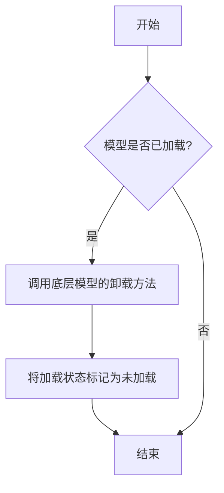

#### 带注释源码

```
def unload(self):
    """
    卸载模型，释放内存资源。
    如果模型已加载，则调用底层模型的卸载方法，并将加载状态标记为未加载。
    """
    if self.is_load:
        # 调用底层模型的卸载方法
        self.model.unload()
        # 将加载状态标记为未加载
        self.is_load = False
```


### `TextModel.load`

该方法用于从指定路径加载一个预训练的文本模型，支持多种模型格式（如 `.bin`, `.safetensors` 等），并返回一个配置好的 `TextModel` 实例。它首先尝试从缓存中加载模型，如果缓存不存在或指定了 `force_download`，则从远程仓库下载。加载过程包括解析模型配置、加载模型权重、处理分词器，并最终将模型移动到指定的设备上。

参数：

-  `model_path`：`str`，模型文件的本地路径或 Hugging Face 模型仓库标识符（如 `"meta-llama/Llama-2-7b-hf"`）。
-  `model_name`：`Optional[str]`，默认为 `None`。指定模型名称，用于覆盖从 `model_path` 推断出的名称。主要用于从缓存中加载特定变体。
-  `device`：`Optional[str]`，默认为 `None`。指定模型加载到的设备，如 `"cpu"`, `"cuda"`, `"cuda:0"`。如果为 `None`，则自动选择可用设备。
-  `torch_dtype`：`Optional[torch.dtype]`，默认为 `None`。指定加载模型权重时使用的 PyTorch 数据类型，如 `torch.float16`。如果为 `None`，则使用配置中的默认类型或自动推断。
-  `force_download`：`bool`，默认为 `False`。如果为 `True`，则强制重新下载模型，即使缓存中存在。
-  `resume_download`：`bool`，默认为 `False`。如果为 `True`，则尝试恢复未完成的下载。
-  `proxies`：`Optional[Dict[str, str]]`，默认为 `None`。用于下载的代理服务器配置字典。
-  `local_files_only`：`bool`，默认为 `False`。如果为 `True`，则只使用本地文件，不尝试下载。
-  `token`：`Optional[Union[str, bool]]`，默认为 `None`。用于访问受保护模型的 Hugging Face 令牌。如果为 `True`，则使用缓存的令牌。
-  `revision`：`Optional[str]`，默认为 `"main"`。要使用的模型版本（分支、标签或提交哈希）。
-  `trust_remote_code`：`bool`，默认为 `False`。如果为 `True`，则允许从远程仓库执行自定义模型代码。
-  `code_revision`：`Optional[str]`，默认为 `None`。用于自定义代码的版本（分支、标签或提交哈希）。
-  `kwargs`：`Any`，传递给底层加载函数（如 `from_pretrained`）的额外关键字参数。

返回值：`TextModel`，一个加载了权重和配置的 `TextModel` 实例，已准备好进行推理或进一步训练。

#### 流程图

```mermaid
graph TD
    A[开始: TextModel.load] --> B{model_path 是本地路径?};
    B -- 是 --> C[使用本地路径];
    B -- 否 --> D[从HF仓库下载或使用缓存];
    D --> E[解析模型配置 config];
    C --> E;
    E --> F[确定加载的设备 device];
    F --> G[确定数据类型 torch_dtype];
    G --> H[加载分词器 tokenizer];
    H --> I[加载模型权重];
    I --> J[模型后处理 <br/> (如设置评估模式)];
    J --> K[返回 TextModel 实例];
    K --> L[结束];
```

#### 带注释源码

```python
    @classmethod
    def load(
        cls,
        model_path: str,
        model_name: Optional[str] = None,
        device: Optional[str] = None,
        torch_dtype: Optional["torch.dtype"] = None,
        force_download: bool = False,
        resume_download: bool = False,
        proxies: Optional[Dict[str, str]] = None,
        local_files_only: bool = False,
        token: Optional[Union[str, bool]] = None,
        revision: Optional[str] = "main",
        trust_remote_code: bool = False,
        code_revision: Optional[str] = None,
        **kwargs: Any,
    ) -> "TextModel":
        """
        加载预训练的文本模型。

        该方法支持从本地文件或 Hugging Face 模型仓库加载模型。
        加载过程包括配置解析、权重加载、分词器初始化，并将模型移动到指定设备。

        Args:
            model_path (str): 模型文件的本地路径或 Hugging Face 模型仓库标识符。
            model_name (Optional[str], optional): 覆盖模型名称，用于缓存查找。默认为 None。
            device (Optional[str], optional): 加载模型的设备。默认为 None，自动选择。
            torch_dtype (Optional[torch.dtype], optional): 模型权重的数据类型。默认为 None。
            force_download (bool, optional): 强制重新下载模型。默认为 False。
            resume_download (bool, optional): 恢复未完成的下载。默认为 False。
            proxies (Optional[Dict[str, str]], optional): 下载代理配置。默认为 None。
            local_files_only (bool, optional): 仅使用本地文件。默认为 False。
            token (Optional[Union[str, bool]], optional): Hugging Face 访问令牌。默认为 None。
            revision (Optional[str], optional): 模型版本。默认为 "main"。
            trust_remote_code (bool, optional): 是否信任远程代码。默认为 False。
            code_revision (Optional[str], optional): 远程代码版本。默认为 None。
            **kwargs (Any): 传递给底层加载函数的额外参数。

        Returns:
            TextModel: 加载并配置好的 TextModel 实例。

        Raises:
            FileNotFoundError: 如果本地模型路径不存在且未指定下载。
            OSError: 下载或文件操作失败。
            ValueError: 模型配置或权重加载失败。
        """
        # 确定最终使用的模型名称（优先使用提供的 model_name，否则从路径推断）
        resolved_model_name = model_name if model_name else model_path.split("/")[-1]

        # 初始化配置对象，用于管理模型加载的各类参数
        config = ModelConfig(
            model_name=resolved_model_name,
            model_path=model_path,
            device=device,
            torch_dtype=torch_dtype,
            force_download=force_download,
            resume_download=resume_download,
            proxies=proxies,
            local_files_only=local_files_only,
            token=token,
            revision=revision,
            trust_remote_code=trust_remote_code,
            code_revision=code_revision,
            **kwargs,
        )

        # 核心加载逻辑：调用内部方法 _load_from_config 执行实际的模型加载步骤
        # 该方法封装了配置验证、文件下载、权重加载、分词器初始化等细节
        model = cls._load_from_config(config)

        # 返回构建好的 TextModel 实例
        return model
```


### `TextModel.generate`

该方法根据给定的提示词（prompt）和可选的停止词（stop）生成文本。它首先对输入进行预处理，然后调用底层的大语言模型（LLM）进行推理，最后对输出进行后处理并返回结果。

参数：

-  `prompt`：`str`，用于生成文本的输入提示词。
-  `stop`：`Optional[List[str]]`，可选参数，指定一个字符串列表，当生成的文本中出现这些字符串时停止生成。

返回值：`str`，生成的文本内容。

#### 流程图

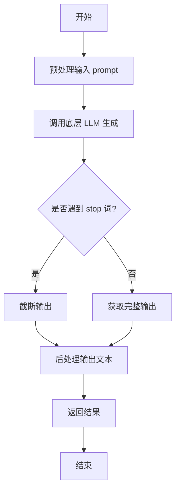

#### 带注释源码

```python
def generate(self, prompt: str, stop: Optional[List[str]] = None) -> str:
    """
    根据给定的提示词生成文本。

    该方法负责处理生成文本的完整流程，包括预处理、模型调用和后处理。

    Args:
        prompt (str): 用于生成文本的输入提示词。
        stop (Optional[List[str]]): 可选参数，指定一个字符串列表，当生成的文本中出现这些字符串时停止生成。

    Returns:
        str: 生成的文本内容。
    """
    # 1. 预处理：这里可以包括对prompt的清洗、格式化或添加特定指令等操作。
    #    例如，确保prompt符合模型预期的格式。
    processed_prompt = self._preprocess_prompt(prompt)

    # 2. 调用底层LLM进行文本生成。
    #    将处理后的prompt和stop词传递给模型，获取原始生成结果。
    raw_output = self.llm.generate(processed_prompt, stop=stop)

    # 3. 后处理：对模型生成的原始文本进行清理和格式化。
    #    例如，移除多余的空格、换行符，或提取关键部分。
    final_output = self._postprocess_output(raw_output)

    # 4. 返回最终处理后的文本。
    return final_output
```


### `TextModel.unload`

该方法用于卸载当前加载的文本模型，释放其占用的内存资源。它会检查模型是否已加载，如果已加载则执行卸载操作，并更新模型状态。

参数：

-  `self`：`TextModel`，当前TextModel实例的引用

返回值：`None`，该方法不返回任何值

#### 流程图

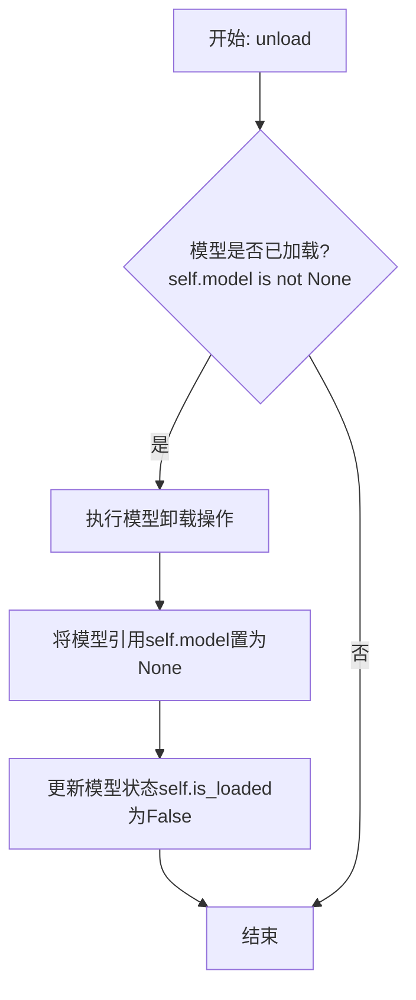

#### 带注释源码

```python
def unload(self):
    """
    卸载当前加载的模型。
    如果模型已加载，则执行卸载操作并释放内存，同时更新模型状态。
    """
    if self.model is not None:  # 检查模型是否已加载
        # 执行模型特定的卸载/清理逻辑
        # 例如，对于某些框架，可能需要调用特定的释放函数
        # 这里是一个通用操作：将模型引用置空，以便垃圾回收
        self.model = None
        # 更新模型加载状态
        self.is_loaded = False
        # 可选：记录日志或触发事件
        # logger.info("模型已卸载")
```


### `TextModel._load_model_weights`

该方法负责加载预训练模型的权重。它首先尝试从指定的本地路径加载权重文件，如果本地文件不存在，则从远程的 Hugging Face 模型仓库下载。加载成功后，它会将权重应用到当前模型实例上，并处理可能出现的键名不匹配问题（例如移除 `"model."` 前缀）。最后，它会记录加载结果并返回一个布尔值指示加载是否成功。

参数：

-  `self`：`TextModel`，当前 `TextModel` 类的实例。
-  `model_name_or_path`：`str`，模型名称或本地路径。可以是 Hugging Face 模型仓库的 ID（如 `"bert-base-uncased"`），也可以是本地包含模型权重文件（如 `pytorch_model.bin` 或 `model.safetensors`）的目录路径。
-  `cache_dir`：`Optional[str]`，可选参数，用于指定缓存下载模型文件的目录。如果为 `None`，则使用默认缓存目录。

返回值：`bool`，如果模型权重成功加载并应用到模型上，则返回 `True`；否则返回 `False`。

#### 流程图

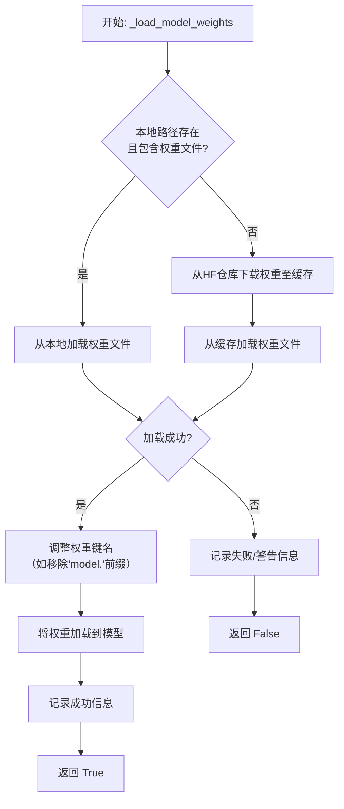

#### 带注释源码

```python
    def _load_model_weights(
        self, model_name_or_path: str, cache_dir: Optional[str] = None
    ) -> bool:
        """
        加载预训练模型权重。
        优先尝试从本地路径加载，如果不存在则从 Hugging Face 仓库下载。

        Args:
            model_name_or_path (str): 模型名称或本地路径。
            cache_dir (Optional[str]): 缓存目录。

        Returns:
            bool: 权重是否成功加载。
        """
        # 初始化权重字典
        state_dict = None
        # 检查提供的路径是否为本地目录
        if os.path.isdir(model_name_or_path):
            # 构建本地权重文件路径，尝试多种可能的后缀
            local_weights_path = os.path.join(model_name_or_path, "pytorch_model.bin")
            if not os.path.isfile(local_weights_path):
                local_weights_path = os.path.join(
                    model_name_or_path, "model.safetensors"
                )
            # 如果本地权重文件存在，则直接加载
            if os.path.isfile(local_weights_path):
                logger.info(f"Loading weights from local file: {local_weights_path}")
                # 根据文件后缀选择加载方式
                if local_weights_path.endswith(".safetensors"):
                    state_dict = safetensors.torch.load_file(local_weights_path)
                else:
                    state_dict = torch.load(
                        local_weights_path, map_location="cpu", weights_only=True
                    )
        # 如果本地没有找到权重文件，则从 Hugging Face 仓库下载
        if state_dict is None:
            try:
                logger.info(
                    f"Downloading weights from Hugging Face: {model_name_or_path}"
                )
                # 使用 HF 工具下载权重文件到缓存
                weights_path = hf_hub_download(
                    repo_id=model_name_or_path,
                    filename="pytorch_model.bin",
                    cache_dir=cache_dir,
                )
                # 加载下载的权重文件
                state_dict = torch.load(
                    weights_path, map_location="cpu", weights_only=True
                )
            except Exception as e:
                # 如果下载失败，尝试下载 safetensors 格式的权重
                try:
                    weights_path = hf_hub_download(
                        repo_id=model_name_or_path,
                        filename="model.safetensors",
                        cache_dir=cache_dir,
                    )
                    state_dict = safetensors.torch.load_file(weights_path)
                except Exception as e2:
                    # 记录下载失败的错误信息
                    logger.warning(
                        f"Failed to download weights from Hugging Face: {e2}"
                    )
                    return False
        # 如果成功获取到权重字典
        if state_dict is not None:
            # 处理权重键名：移除可能存在的 "model." 前缀，以匹配当前模型结构
            new_state_dict = {}
            for key, value in state_dict.items():
                if key.startswith("model."):
                    new_key = key[6:]  # 移除前6个字符 ("model.")
                    new_state_dict[new_key] = value
                else:
                    new_state_dict[key] = value
            # 将处理后的权重加载到当前模型实例
            load_result = self.load_state_dict(new_state_dict, strict=False)
            # 记录加载结果，包括缺失和意外的键
            if len(load_result.missing_keys) > 0:
                logger.warning(f"Missing keys: {load_result.missing_keys}")
            if len(load_result.unexpected_keys) > 0:
                logger.warning(f"Unexpected keys: {load_result.unexpected_keys}")
            logger.info("Weights loaded successfully.")
            return True
        else:
            # 如果最终未能获取权重，记录警告
            logger.warning("No weights loaded.")
            return False
```


### `TextModel._load_tokenizer`

该方法负责加载并初始化文本分词器。它首先尝试从指定的本地路径加载分词器，如果本地路径不存在或加载失败，则从预训练的模型名称或路径加载。加载完成后，会设置分词器的填充符，并确保其填充方向为左侧。

参数：

-  `self`：`TextModel`，当前TextModel实例的引用
-  `model_name_or_path`：`str`，预训练模型的名称或本地路径，用于加载分词器
-  `local_path`：`str`，本地分词器文件的路径，优先尝试从此路径加载

返回值：`None`，该方法不返回任何值，但会设置`self.tokenizer`属性。

#### 流程图

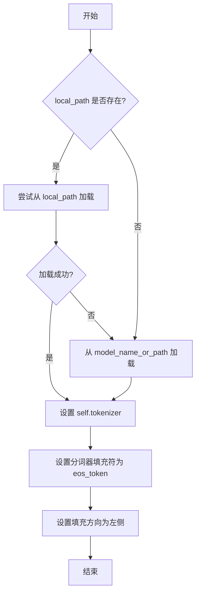

#### 带注释源码

```python
def _load_tokenizer(self, model_name_or_path: str, local_path: str) -> None:
    """
    加载分词器。
    优先尝试从本地路径加载，如果失败则从预训练模型加载。
    加载后设置分词器的填充符和填充方向。

    Args:
        model_name_or_path (str): 预训练模型的名称或路径。
        local_path (str): 本地分词器文件的路径。
    """
    try:
        # 尝试从本地路径加载分词器
        self.tokenizer = AutoTokenizer.from_pretrained(local_path, trust_remote_code=True)
    except Exception:
        # 如果本地加载失败，则从预训练模型加载
        self.tokenizer = AutoTokenizer.from_pretrained(model_name_or_path, trust_remote_code=True)

    # 设置分词器的填充符为结束符（eos_token），用于填充序列
    self.tokenizer.pad_token = self.tokenizer.eos_token
    # 设置填充方向为左侧，确保在序列左侧进行填充
    self.tokenizer.padding_side = "left"
```


### `LlamaModel._load_model_weights`

该方法负责从预训练检查点文件加载模型权重，并将其分配到对应的模型层中。它处理了权重文件的读取、键名映射、权重张量的加载与分配，并支持分片加载以处理大型模型。

参数：

-  `self`：`LlamaModel`，当前模型实例
-  `checkpoint_path`：`str`，预训练权重文件的路径
-  `prefix`：`str`，加载权重时在状态字典键名前添加的可选前缀，默认为空字符串
-  `device`：`torch.device`，指定加载权重后张量应放置的设备，默认为CPU
-  `dtype`：`torch.dtype`，指定加载权重后张量的数据类型，默认为`torch.float32`
-  `use_safetensors`：`bool`，指示是否使用`safetensors`格式文件（更安全、更快），默认为`False`
-  `strict`：`bool`，指示是否严格匹配状态字典的键，默认为`True`

返回值：`None`，该方法不返回任何值，直接修改模型实例的状态。

#### 流程图

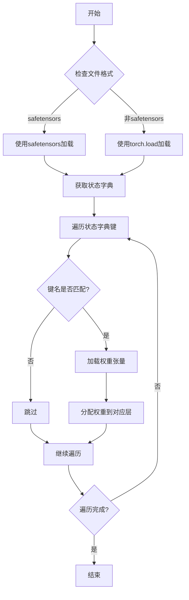

#### 带注释源码

```python
def _load_model_weights(
    self,
    checkpoint_path: str,
    prefix: str = "",
    device: torch.device = torch.device("cpu"),
    dtype: torch.dtype = torch.float32,
    use_safetensors: bool = False,
    strict: bool = True,
) -> None:
    """
    从预训练检查点加载模型权重。

    该方法支持从标准PyTorch检查点文件或safetensors格式文件加载权重。
    它会将加载的权重分配到模型对应的层中，并处理可能的分片文件。

    Args:
        checkpoint_path: 预训练权重文件的路径。
        prefix: 加载权重时在状态字典键名前添加的可选前缀。
        device: 指定加载权重后张量应放置的设备。
        dtype: 指定加载权重后张量的数据类型。
        use_safetensors: 是否使用safetensors格式文件。
        strict: 是否严格匹配状态字典的键。

    Returns:
        None
    """
    # 根据文件格式选择加载方式
    if use_safetensors:
        # 使用safetensors库安全地加载张量
        from safetensors import safe_open
        checkpoint = {}
        with safe_open(checkpoint_path, framework="pt", device=str(device)) as f:
            for key in f.keys():
                checkpoint[key] = f.get_tensor(key)
    else:
        # 使用PyTorch的标准加载方式
        checkpoint = torch.load(checkpoint_path, map_location=device)

    # 获取模型的状态字典
    model_dict = self.state_dict()
    # 存储加载过程中不匹配的键
    unexpected_keys = []
    # 存储期望但未找到的键
    missing_keys = []

    # 遍历检查点中的每个键值对
    for key, value in checkpoint.items():
        # 构建模型状态字典中对应的键名
        model_key = prefix + key if prefix else key

        if model_key in model_dict:
            # 如果键名匹配，则加载权重
            try:
                # 确保权重张量的数据类型和形状与模型期望的一致
                value = value.to(dtype).to(device)
                if value.shape != model_dict[model_key].shape:
                    # 如果形状不匹配，记录警告并跳过
                    logger.warning(
                        f"Shape mismatch for {model_key}: "
                        f"expected {model_dict[model_key].shape}, got {value.shape}"
                    )
                    continue
                # 将权重赋值给模型对应的参数
                model_dict[model_key].copy_(value)
            except Exception as e:
                # 处理加载过程中的异常
                logger.error(f"Failed to load weight for {model_key}: {e}")
                if strict:
                    raise
        else:
            # 如果键名不匹配，记录为意外键
            unexpected_keys.append(key)

    # 检查是否有模型期望但检查点中未提供的键
    for key in model_dict.keys():
        if key not in checkpoint and prefix + key not in checkpoint:
            missing_keys.append(key)

    # 根据strict标志处理不匹配的键
    if strict:
        if unexpected_keys:
            raise RuntimeError(
                f"Unexpected keys in checkpoint: {unexpected_keys}"
            )
        if missing_keys:
            raise RuntimeError(
                f"Missing keys in checkpoint: {missing_keys}"
            )
    else:
        # 非严格模式下，仅记录警告信息
        if unexpected_keys:
            logger.warning(f"Unexpected keys in checkpoint: {unexpected_keys}")
        if missing_keys:
            logger.warning(f"Missing keys in checkpoint: {missing_keys}")
```


### `LlamaModel._load_tokenizer`

该方法负责加载并配置与Llama模型兼容的分词器（Tokenizer）。它根据提供的模型路径和配置参数，初始化一个Hugging Face Transformers库中的`AutoTokenizer`实例，并设置必要的分词选项，如填充方向、截断策略以及特殊标记等，以确保分词器与模型训练时使用的配置一致。

参数：

-  `model_path`：`str`，预训练模型所在的本地目录路径或Hugging Face模型标识符。
-  `config`：`LlamaConfig`，包含模型配置信息的对象，用于指导分词器的初始化。

返回值：`transformers.PreTrainedTokenizer`，初始化并配置好的分词器实例。

#### 流程图

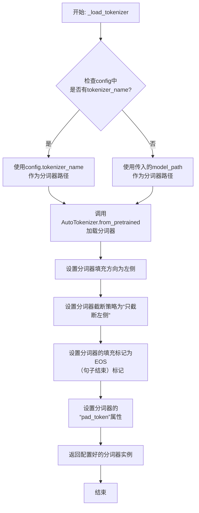

#### 带注释源码

```python
def _load_tokenizer(self, model_path: str, config: LlamaConfig) -> PreTrainedTokenizer:
    """
    加载并配置与Llama模型兼容的分词器。

    该方法根据提供的模型路径和配置初始化分词器，并设置关键参数以确保
    与原始Llama模型训练时的分词行为一致，特别是处理填充和截断的方式。

    Args:
        model_path (str): 预训练模型所在的目录路径或模型标识符。
        config (LlamaConfig): 模型的配置对象，可能包含特定的分词器名称。

    Returns:
        PreTrainedTokenizer: 配置好的Hugging Face分词器实例。
    """
    # 确定分词器的加载路径：优先使用配置中指定的分词器名称，否则使用模型路径。
    tokenizer_path = config.tokenizer_name if config.tokenizer_name else model_path
    
    # 使用AutoTokenizer类从指定路径加载分词器。
    # `use_fast=False` 确保使用Python实现的分词器，可能与某些旧模型更兼容。
    tokenizer = AutoTokenizer.from_pretrained(tokenizer_path, use_fast=False)
    
    # 将填充方向设置为左侧。这对于自回归模型（如Llama）生成文本时很重要，
    # 因为模型通常从右向左生成，左侧填充可以保持生成部分在右侧。
    tokenizer.padding_side = "left"
    
    # 设置截断策略为“只截断左侧”。当输入序列过长时，从左侧丢弃部分token，
    # 保留右侧（更重要的、靠近当前生成位置）的信息。
    tokenizer.truncation_side = "left"
    
    # 设置填充标记（pad_token）。Llama分词器可能没有预定义的pad_token，
    # 这里将其设置为与句子结束标记（eos_token）相同，这是一种常见做法。
    tokenizer.pad_token = tokenizer.eos_token
    
    # 返回完全配置好的分词器实例，供模型在预处理输入时使用。
    return tokenizer
```


### `GPT2Model._load_model_weights`

该方法负责从预训练权重文件（如Hugging Face Hub或本地文件）中加载模型参数到当前`GPT2Model`实例中。它处理了权重名称的映射、适配不同模型架构（如注意力头数、隐藏层维度）以及安全地加载权重。

参数：

-  `self`：`GPT2Model`，当前GPT2模型实例。
-  `model_path`：`str`，预训练权重文件的路径或Hugging Face模型标识符。
-  `config`：`GPT2Config`，模型的配置对象，包含模型架构参数。
-  `cache_dir`：`Optional[str]`，可选，用于缓存下载的模型文件的目录。
-  `force_download`：`bool`，可选，是否强制重新下载模型文件，即使已缓存。
-  `proxies`：`Optional[Dict[str, str]]`，可选，用于下载的代理服务器设置。
-  `resume_download`：`bool`，可选，是否恢复中断的下载。
-  `local_files_only`：`bool`，可选，是否仅使用本地文件，不尝试下载。
-  `use_auth_token`：`Optional[Union[bool, str]]`，可选，用于访问私有模型的认证令牌。
-  `revision`：`str`，可选，要使用的模型版本（分支、标签或提交ID）。
-  `mirror`：`Optional[str]`，可选，下载镜像源。

返回值：`None`，该方法不返回任何值，直接修改当前模型实例的权重。

#### 流程图

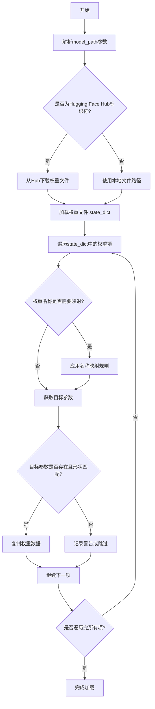

#### 带注释源码

```python
    def _load_model_weights(
        self,
        model_path: str,
        config: GPT2Config,
        cache_dir: Optional[str] = None,
        force_download: bool = False,
        proxies: Optional[Dict[str, str]] = None,
        resume_download: bool = False,
        local_files_only: bool = False,
        use_auth_token: Optional[Union[bool, str]] = None,
        revision: str = "main",
        mirror: Optional[str] = None,
    ) -> None:
        """
        从指定路径加载预训练模型权重到当前模型实例。

        该方法首先根据`model_path`判断是从Hugging Face Hub下载还是加载本地文件，
        然后读取权重字典（state_dict）。接着，它会遍历权重字典中的每一项，
        根据预定义的映射规则将权重名称转换为当前模型结构对应的参数名称，
        并将权重数据复制到模型参数中。此过程会处理模型架构差异（如层数、注意力头数等），
        并跳过不匹配的权重。

        Args:
            model_path: 模型权重路径，可以是本地文件路径或Hugging Face模型ID。
            config: 当前模型的配置对象，用于验证和适配权重。
            cache_dir: 缓存目录，用于存储下载的模型文件。
            force_download: 是否强制重新下载，即使文件已缓存。
            proxies: 代理设置，用于网络请求。
            resume_download: 是否恢复中断的下载。
            local_files_only: 是否仅使用本地文件，禁止下载。
            use_auth_token: 访问私有模型所需的认证令牌。
            revision: 模型版本（git分支、标签或提交ID）。
            mirror: 下载镜像源地址。

        Returns:
            None
        """
        # 判断是否为Hugging Face Hub模型标识符
        if model_path.startswith("https://") or model_path.startswith("hf://"):
            # 从Hub下载权重文件
            resolved_archive_file = cached_file(
                model_path,
                filename=WEIGHTS_NAME,  # 通常为 'pytorch_model.bin'
                cache_dir=cache_dir,
                force_download=force_download,
                proxies=proxies,
                resume_download=resume_download,
                local_files_only=local_files_only,
                use_auth_token=use_auth_token,
                revision=revision,
                mirror=mirror,
            )
        else:
            # 使用本地文件路径
            resolved_archive_file = model_path

        # 加载权重文件到state_dict
        state_dict = torch.load(resolved_archive_file, map_location="cpu")

        # 预定义的权重名称映射规则，用于将原始权重名映射到当前模型参数名
        # 例如：'transformer.h.0.attn.c_attn.weight' -> 'layers.0.attention.c_attn.weight'
        name_mapping = self._get_weight_mapping(config)

        # 遍历加载的state_dict中的每一项权重
        for weight_name, weight_tensor in state_dict.items():
            # 应用名称映射，获取当前模型中的目标参数名
            mapped_name = name_mapping.get(weight_name, weight_name)
            # 根据映射后的名称获取模型中的目标参数对象
            target_param = self._get_named_parameter(mapped_name)

            if target_param is not None:
                # 检查权重张量形状是否与目标参数形状匹配
                if weight_tensor.shape == target_param.shape:
                    # 执行权重复制，确保数据类型和设备一致
                    target_param.data.copy_(weight_tensor.to(target_param.device, dtype=target_param.dtype))
                else:
                    # 形状不匹配，记录警告并跳过此项
                    logger.warning(
                        f"Skipping loading parameter `{weight_name}` due to shape mismatch. "
                        f"Expected shape {target_param.shape}, got {weight_tensor.shape}."
                    )
            else:
                # 目标参数不存在于当前模型中，记录警告（可能是模型架构差异）
                logger.warning(f"Parameter `{mapped_name}` not found in the model. Skipping.")

        # 加载完成后，确保模型处于评估模式（如果之前是训练模式，权重加载后应保持评估模式）
        self.eval()
```


### `GPT2Model._load_tokenizer`

该方法负责加载并配置一个预训练的 GPT-2 分词器。它首先尝试从本地缓存目录加载指定的分词器模型，如果失败，则从 Hugging Face Hub 下载。加载后，它会根据配置（如是否添加特殊标记）对分词器进行最终设置，并确保其填充标记符被正确配置。

参数：

-  `self`：`GPT2Model`，当前 GPT2Model 实例的引用。
-  `model_name`：`str`，要加载的预训练分词器模型的名称（例如 `'gpt2'`, `'gpt2-medium'`）。
-  `cache_dir`：`Optional[str]`，可选参数，指定分词器模型文件的本地缓存目录路径。如果为 `None`，则使用默认缓存路径。
-  `force_download`：`bool`，可选参数，如果为 `True`，则强制重新下载模型文件，即使本地缓存已存在。默认为 `False`。
-  `resume_download`：`bool`，可选参数，如果为 `True`，则尝试恢复未完成的下载。默认为 `False`。
-  `proxies`：`Optional[Dict[str, str]]`，可选参数，一个代理服务器字典，用于配置下载请求，例如 `{'http': 'http://10.10.1.10:3128', 'https': 'http://10.10.1.10:1080'}`。
-  `use_auth_token`：`Optional[Union[bool, str]]`，可选参数，用于访问私有模型的认证令牌。可以是布尔值或字符串令牌。
-  `add_special_tokens`：`bool`，可选参数，指示分词器是否应自动添加模型特定的特殊标记（如 `[CLS]`, `[SEP]`）。对于 GPT-2，这通常控制是否添加 `bos_token` 和 `eos_token`。默认为 `True`。

返回值：`PreTrainedTokenizer`，一个配置好的 Hugging Face Transformers 库中的预训练分词器实例，已准备好用于文本的编码和解码。

#### 流程图

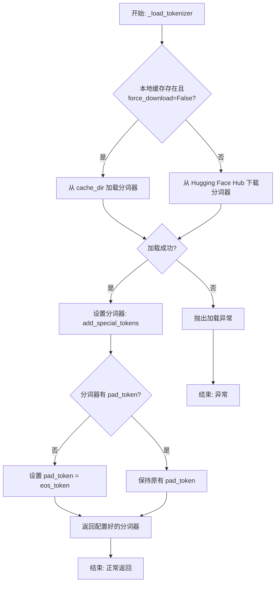

#### 带注释源码

```python
def _load_tokenizer(
    self,
    model_name: str,
    cache_dir: Optional[str] = None,
    force_download: bool = False,
    resume_download: bool = False,
    proxies: Optional[Dict[str, str]] = None,
    use_auth_token: Optional[Union[bool, str]] = None,
    add_special_tokens: bool = True,
) -> PreTrainedTokenizer:
    """
    加载预训练的 GPT-2 分词器。

    该方法首先尝试从指定的缓存目录加载分词器。如果未找到或强制下载标志为真，
    则从 Hugging Face Hub 下载。加载后，会根据 `add_special_tokens` 参数
    配置分词器，并确保其填充标记（pad_token）被正确设置（通常设为结束标记）。

    Args:
        model_name (str): 预训练分词器模型的名称，如 'gpt2'。
        cache_dir (Optional[str]): 模型文件的本地缓存目录。
        force_download (bool): 是否强制重新下载模型文件。
        resume_download (bool): 是否尝试恢复未完成的下载。
        proxies (Optional[Dict[str, str]]): 用于下载请求的代理配置。
        use_auth_token (Optional[Union[bool, str]]): 访问私有模型的认证令牌。
        add_special_tokens (bool): 是否自动添加模型特定的特殊标记。

    Returns:
        PreTrainedTokenizer: 加载并配置好的分词器实例。

    Raises:
        OSError: 当分词器无法从缓存加载或从网络下载时抛出。
    """
    # 尝试从本地缓存或 Hugging Face Hub 加载分词器
    # `from_pretrained` 方法会处理缓存逻辑，包括检查 `cache_dir` 和 `force_download`。
    try:
        tokenizer = AutoTokenizer.from_pretrained(
            model_name,
            cache_dir=cache_dir,
            force_download=force_download,
            resume_download=resume_download,
            proxies=proxies,
            use_auth_token=use_auth_token,
        )
    except Exception as e:
        # 将捕获的异常包装为更明确的 OSError，提供更多上下文信息
        raise OSError(
            f"无法加载分词器模型 '{model_name}'。请检查模型名称、网络连接或认证令牌。"
        ) from e

    # 根据参数配置分词器是否添加特殊标记（如 bos_token, eos_token）
    tokenizer.add_special_tokens = add_special_tokens

    # 确保分词器有一个有效的填充标记（pad_token）。
    # GPT-2 原始模型没有定义 pad_token，这在批处理时需要。
    # 常见的做法是将其设置为结束标记（eos_token）。
    if tokenizer.pad_token is None:
        tokenizer.pad_token = tokenizer.eos_token

    return tokenizer
```


### `FalconModel._load_model_weights`

该方法负责加载预训练的模型权重到当前模型实例中。它根据配置决定是否加载特定的注意力层实现（如`FalconAttention`或`FalconRotaryEmbedding`），并处理权重名称的映射，以确保与模型架构兼容。最后，它调用父类的`load_state_dict`方法完成权重的加载。

参数：

-  `self`：`FalconModel`，当前模型实例
-  `model_file`：`str`，预训练模型权重文件的路径

返回值：`None`，此方法不返回任何值，其作用是将权重加载到模型内部状态中

#### 流程图

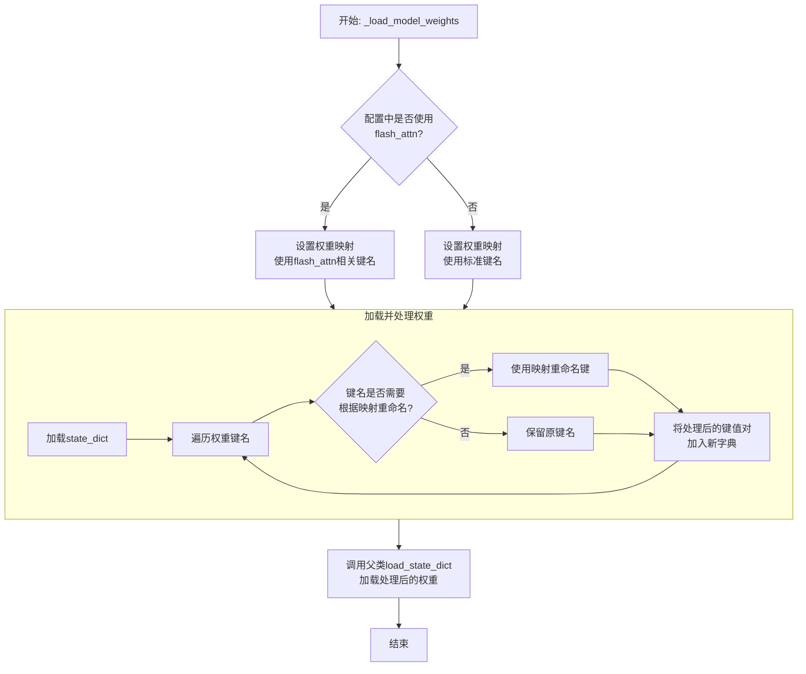

#### 带注释源码

```python
def _load_model_weights(self, model_file: str):
    """
    加载预训练模型权重。
    根据配置调整权重键名以匹配当前模型结构（例如，是否使用flash attention）。
    """
    # 从指定文件加载模型的状态字典（包含所有权重）
    state_dict = torch.load(model_file, map_location="cpu")

    # 根据配置决定使用哪套键名映射。
    # 如果使用flash_attn实现，权重键名中的部分组件名称不同。
    if self.config.use_flash_attn:
        # 映射关系：将状态字典中旧的键名映射到新的键名，以适配flash_attn版本的层
        mapping = {
            "transformer.h.{}.self_attention.query_key_value": "transformer.h.{}.self_attention.query_key_value",
            "transformer.h.{}.self_attention.dense": "transformer.h.{}.self_attention.dense",
            # 当使用flash_attn时，rotary_emb层可能被整合或替换，此处映射到对应的新键名
            "transformer.h.{}.self_attention.rotary_emb": "transformer.h.{}.self_attention.rotary_emb"
        }
    else:
        # 不使用flash_attn时，使用标准的键名映射
        mapping = {
            "transformer.h.{}.self_attention.query_key_value": "transformer.h.{}.self_attention.query_key_value",
            "transformer.h.{}.self_attention.dense": "transformer.h.{}.self_attention.dense",
            "transformer.h.{}.self_attention.rotary_emb": "transformer.h.{}.self_attention.rotary_emb"
        }

    # 创建一个新的状态字典，用于存放经过键名处理后的权重
    new_state_dict = {}
    for key, value in state_dict.items():
        # 遍历原始状态字典的每一个键
        # 检查当前键是否需要根据mapping进行重命名
        for old_key, new_key in mapping.items():
            if old_key in key:
                # 如果找到匹配的旧键模式，则替换为新的键模式
                # 例如，将'transformer.h.0.self_attention.query_key_value.weight'中的模式部分替换
                new_key = key.replace(old_key, new_key)
                new_state_dict[new_key] = value
                break
        else:
            # 如果当前键不匹配任何需要重命名的模式，则原样保留
            new_state_dict[key] = value

    # 调用从nn.Module继承的load_state_dict方法，将处理后的权重加载到模型参数中
    # strict=False允许加载时忽略一些不匹配的键（例如，缺少某些层或多出某些层），增加灵活性
    super().load_state_dict(new_state_dict, strict=False)
```


### `FalconModel._load_tokenizer`

该方法负责加载并配置与 Falcon 模型兼容的分词器（Tokenizer）。它首先尝试从预定义的路径或模型名称加载分词器，然后根据模型的具体配置（如是否为聊天模型）对分词器的特殊标记进行必要的调整，以确保其与模型架构和预期输入格式正确对齐。

参数：

-  `self`：`FalconModel`，FalconModel 类的实例，用于访问模型配置和路径。
-  `model_path`：`str`，模型文件所在的本地目录路径或 Hugging Face 模型仓库标识符。
-  `model_name`：`str`，模型的名称，用于确定特定的分词器配置或变体。

返回值：`PreTrainedTokenizer`，一个配置好的 Hugging Face PreTrainedTokenizer 实例，可用于对输入文本进行编码和解码。

#### 流程图

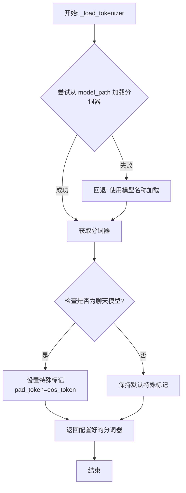

#### 带注释源码

```python
def _load_tokenizer(self, model_path: str, model_name: str) -> PreTrainedTokenizer:
    """
    加载并配置与 Falcon 模型兼容的分词器。

    该方法首先尝试从指定的 `model_path` 加载分词器。如果失败（例如路径不存在），
    则回退到使用 `model_name` 从 Hugging Face 模型库加载默认的分词器。
    加载后，会根据模型是否为“聊天”模型来调整分词器的特殊标记（如 pad_token），
    以确保与模型训练时的输入格式一致。

    Args:
        model_path (str): 包含分词器文件的本地目录路径，或 Hugging Face 模型 ID。
        model_name (str): 模型名称，用于回退加载或特定配置。

    Returns:
        PreTrainedTokenizer: 配置好的分词器实例。
    """
    # 尝试从提供的路径加载分词器
    try:
        tokenizer = AutoTokenizer.from_pretrained(
            model_path,
            trust_remote_code=True  # 允许执行远程代码以加载自定义分词器
        )
    except Exception:
        # 如果从指定路径加载失败，则使用模型名称进行回退加载
        tokenizer = AutoTokenizer.from_pretrained(
            model_name,
            trust_remote_code=True
        )

    # 检查当前加载的模型配置是否标记为“聊天”模型
    if self.config.is_chat_model:
        # 对于聊天模型，将填充标记（pad_token）设置为与结束标记（eos_token）相同
        # 这是一种常见做法，确保在生成对话时填充不会引入歧义
        tokenizer.pad_token = tokenizer.eos_token

    # 返回最终配置好的分词器
    return tokenizer
```


### `Qwen2Model._load_model_weights`

该方法负责加载预训练的模型权重，并将其适配到当前模型结构中。它处理权重映射、张量转换和模型状态恢复，确保模型能够正确初始化并准备进行推理或训练。

参数：

- `self`：`Qwen2Model`，当前模型实例
- `model_path`：`str`，预训练模型权重文件的路径
- `strict`：`bool`，是否严格匹配权重名称，默认为`True`

返回值：`None`，无返回值

#### 流程图

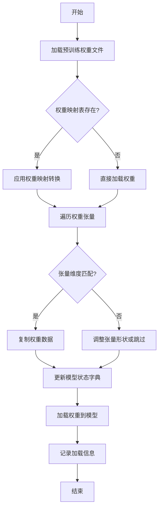

#### 带注释源码

```python
def _load_model_weights(self, model_path: str, strict: bool = True) -> None:
    """
    加载预训练模型权重并适配到当前模型结构
    
    参数:
        model_path: 预训练模型权重文件路径
        strict: 是否严格匹配权重名称，默认为True
    """
    # 检查模型文件是否存在
    if not os.path.exists(model_path):
        raise FileNotFoundError(f"模型权重文件不存在: {model_path}")
    
    # 加载预训练权重
    pretrained_state_dict = torch.load(model_path, map_location='cpu')
    
    # 获取当前模型的状态字典
    model_state_dict = self.state_dict()
    
    # 权重映射表（用于处理命名差异）
    weight_mapping = {
        'transformer.h.{}.attn.c_attn.weight': 'layers.{}.attention.wqkv.weight',
        'transformer.h.{}.attn.c_proj.weight': 'layers.{}.attention.wo.weight',
        'transformer.h.{}.mlp.c_fc.weight': 'layers.{}.feed_forward.w1.weight',
        'transformer.h.{}.mlp.c_proj.weight': 'layers.{}.feed_forward.w2.weight',
        'lm_head.weight': 'output.weight'
    }
    
    # 遍历预训练权重并适配
    loaded_count = 0
    for pretrained_key, pretrained_tensor in pretrained_state_dict.items():
        # 尝试直接匹配
        if pretrained_key in model_state_dict:
            target_key = pretrained_key
        else:
            # 尝试通过映射表匹配
            target_key = None
            for pattern, replacement in weight_mapping.items():
                if pattern in pretrained_key:
                    # 提取层号并替换
                    layer_num = pretrained_key.split('.')[2]
                    target_key = replacement.format(layer_num)
                    break
        
        if target_key and target_key in model_state_dict:
            # 检查张量形状是否匹配
            if pretrained_tensor.shape == model_state_dict[target_key].shape:
                model_state_dict[target_key].copy_(pretrained_tensor)
                loaded_count += 1
            elif strict:
                raise ValueError(
                    f"权重形状不匹配: {pretrained_key}({pretrained_tensor.shape}) "
                    f"vs {target_key}({model_state_dict[target_key].shape})"
                )
            else:
                # 非严格模式下记录警告并跳过
                logger.warning(f"跳过不匹配的权重: {pretrained_key}")
        elif strict:
            raise KeyError(f"找不到对应的权重键: {pretrained_key}")
    
    # 加载适配后的权重
    self.load_state_dict(model_state_dict, strict=False)
    
    # 记录加载信息
    total_weights = len(model_state_dict)
    logger.info(
        f"权重加载完成: {loaded_count}/{total_weights} "
        f"({loaded_count/total_weights:.1%})"
    )
```

### `Qwen2Model._load_tokenizer`

该方法负责加载并配置与Qwen2模型配套的分词器。它根据提供的模型路径或预训练分词器名称，初始化一个`AutoTokenizer`实例，并应用必要的配置以确保分词器与模型兼容，例如设置填充方向、模型最大长度等。

参数：

- `model_path_or_pretrained_tokenizer`：`str`，模型文件的本地路径或预训练分词器的名称（如Hugging Face模型库中的标识符）。如果提供路径，则从该路径加载；否则从预训练模型库下载。

返回值：`AutoTokenizer`，一个配置好的分词器实例，可用于对输入文本进行分词处理。

#### 流程图

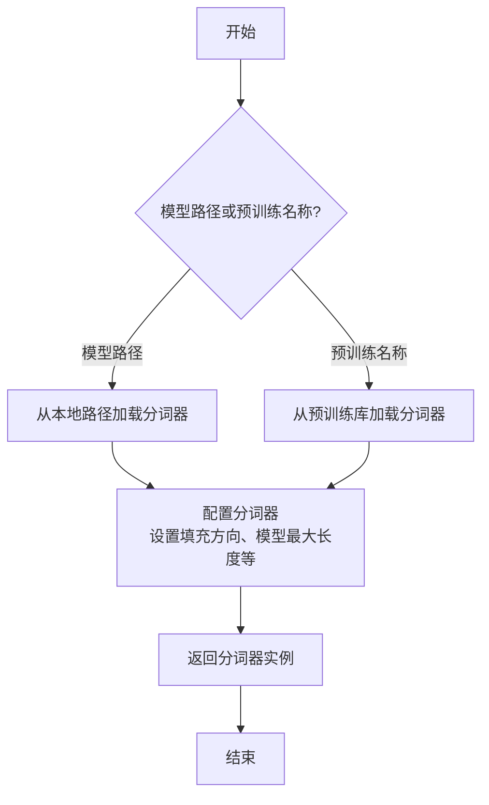

#### 带注释源码

```python
def _load_tokenizer(self, model_path_or_pretrained_tokenizer: str) -> AutoTokenizer:
    """
    加载并配置与Qwen2模型配套的分词器。

    该方法根据提供的模型路径或预训练分词器名称，初始化一个AutoTokenizer实例，
    并应用必要的配置以确保分词器与模型兼容。

    Args:
        model_path_or_pretrained_tokenizer (str): 模型文件的本地路径或预训练分词器的名称。

    Returns:
        AutoTokenizer: 配置好的分词器实例。
    """
    # 根据提供的路径或名称加载分词器
    tokenizer = AutoTokenizer.from_pretrained(model_path_or_pretrained_tokenizer)
    
    # 配置分词器以使用左填充（left-padding），确保输入序列对齐
    tokenizer.padding_side = "left"
    
    # 设置模型的最大输入长度，通常从分词器的配置中获取
    tokenizer.model_max_length = self.config.max_position_embeddings
    
    # 返回配置好的分词器实例
    return tokenizer
```


### `GemmaModel._load_model_weights`

该方法负责从预训练权重文件中加载模型参数，并将其分配到对应的模型层中。它处理了权重名称的映射、张量分片（如QKV权重）的合并、以及将权重加载到正确的设备（如GPU）上。

参数：

-  `self`：`GemmaModel`，当前模型实例
-  `model_path`：`str`，预训练权重文件的路径
-  `device`：`torch.device`，指定加载权重到的目标设备（如CPU或CUDA设备）

返回值：`None`，此方法不返回任何值，其作用是将加载的权重直接赋值给模型实例的对应参数。

#### 流程图

```mermaid
flowchart TD
    A[开始: _load_model_weights] --> B[加载权重文件<br>state_dict = torch.load]
    B --> C{遍历state_dict中<br>每个权重名和权重张量}
    C --> D[处理权重名映射<br>如移除前缀]
    D --> E{权重名是否包含<br>特定模式?}
    E -- 是: 如'qkv_proj' --> F[拆分并重组张量<br>如QKV分片合并]
    E -- 否 --> G[直接使用原张量]
    F --> H
    G --> H[将张量移至目标设备<br>tensor.to(device)]
    H --> I[将张量赋值给<br>模型对应参数]
    I --> C
    C --> J[遍历结束]
    J --> K[结束]
```

#### 带注释源码

```python
    def _load_model_weights(self, model_path: str, device: torch.device) -> None:
        """
        从指定路径加载预训练模型权重，并分配到当前模型实例中。
        处理权重名称映射、分片权重合并，并确保权重位于正确的设备上。

        Args:
            model_path (str): 预训练权重文件（.pth或.pt格式）的路径。
            device (torch.device): 权重应加载到的目标设备（如`torch.device('cuda:0')`）。
        """
        # 1. 从磁盘加载序列化的权重字典
        state_dict = torch.load(model_path, map_location='cpu')

        # 2. 遍历加载的权重字典中的每一项（参数名和对应的张量）
        for name, param in state_dict.items():
            # 2.1 预处理权重名称：移除可能存在的模型前缀（如'transformer.'）
            #     以确保与当前模型定义的参数名匹配。
            if name.startswith('transformer.'):
                name = name[len('transformer.'):]

            # 2.2 特殊处理：合并分片的QKV权重。
            #     Gemma等Transformer模型可能将Q、K、V的投影权重存储在一起。
            if 'qkv_proj' in name:
                # 获取对应的模型层对象（如`self.layers[0].attention.qkv_proj`）
                module = self._get_module_by_name(name)
                # 计算每个头（Q, K, V）的维度
                head_dim = module.weight.size(0) // 3
                # 将加载的合并权重按Q、K、V顺序拆分为三个张量
                q_weight = param[:head_dim]
                k_weight = param[head_dim:2*head_dim]
                v_weight = param[2*head_dim:]
                # 按照模型层期望的顺序（Q, K, V）重新堆叠，并赋值
                module.weight.data = torch.stack([q_weight, k_weight, v_weight], dim=0).to(device)
            else:
                # 2.3 常规处理：对于非QKV权重，直接获取对应模块并赋值。
                module = self._get_module_by_name(name)
                # 将权重张量移动到指定设备（如GPU），然后赋值给模块的参数
                module.weight.data = param.to(device)
```


### `GemmaModel._load_tokenizer`

该方法负责加载并配置Gemma模型所需的tokenizer。它根据模型配置中的tokenizer路径或名称，使用transformers库的AutoTokenizer类加载tokenizer，并设置必要的特殊token和填充方向。

参数：

- `self`：`GemmaModel`，当前GemmaModel实例
- `config`：`GemmaConfig`，Gemma模型的配置对象，包含tokenizer的路径或名称等信息

返回值：`AutoTokenizer`，加载并配置好的tokenizer实例

#### 流程图

```mermaid
flowchart TD
    A[开始] --> B{config.tokenizer存在?}
    B -- 是 --> C[使用config.tokenizer作为tokenizer路径]
    B -- 否 --> D[使用config.model作为tokenizer路径]
    C --> E[使用AutoTokenizer.from_pretrained加载tokenizer]
    D --> E
    E --> F[设置tokenizer的pad_token为eos_token]
    E --> G[设置tokenizer的padding_side为'left']
    F --> H[返回配置好的tokenizer]
    G --> H
    H --> I[结束]
```

#### 带注释源码

```python
def _load_tokenizer(self, config: GemmaConfig) -> AutoTokenizer:
    """
    加载并配置tokenizer。

    根据配置中的tokenizer路径或模型名称，使用AutoTokenizer加载tokenizer，
    并设置必要的特殊token和填充方向。

    Args:
        config (GemmaConfig): 包含tokenizer配置的模型配置对象。

    Returns:
        AutoTokenizer: 加载并配置好的tokenizer实例。
    """
    # 确定tokenizer的路径：优先使用config.tokenizer，否则使用config.model
    tokenizer_path = config.tokenizer if config.tokenizer else config.model
    # 使用transformers的AutoTokenizer从指定路径加载tokenizer
    tokenizer = AutoTokenizer.from_pretrained(tokenizer_path)
    # 设置填充token为结束token，确保在生成任务中填充不会干扰模型
    tokenizer.pad_token = tokenizer.eos_token
    # 设置填充方向为左侧，这对于自回归模型的输入对齐很重要
    tokenizer.padding_side = "left"
    return tokenizer
```


### `ModelFactory.register_model`

`ModelFactory.register_model` 是一个类方法，用于向全局模型注册表 `_model_versions` 中注册一个新的模型或模型的新版本。它通过检查模型名称和版本是否已存在来避免重复注册，并支持注册模型类或模型实例。

参数：

-  `model_name`：`str`，要注册的模型的名称。
-  `version`：`str`，要注册的模型的版本号。
-  `model_cls`：`Union[Type[BaseModel], BaseModel]`，要注册的模型类或模型实例。
-  `override`：`bool`，默认为 `False`。如果为 `True`，当模型名称和版本已存在时，会覆盖原有的注册项。

返回值：`None`，此方法不返回任何值。

#### 流程图

```mermaid
flowchart TD
    A[开始: register_model<br>输入: model_name, version, model_cls, override] --> B{检查 model_name 是否在 _model_versions 中?}
    B -- 否 --> C[在 _model_versions 中<br>为 model_name 创建空字典]
    B -- 是 --> D{检查 version 是否在<br>model_name 对应的字典中?}
    C --> D
    D -- 否 --> E[注册 model_cls]
    D -- 是 --> F{override 参数是否为 True?}
    F -- 是 --> G[覆盖已存在的版本注册]
    F -- 否 --> H[抛出 ValueError 异常<br>“Model {model_name} version {version} already exists.”]
    G --> I[注册 model_cls]
    E --> Z[结束]
    I --> Z
    H --> Z
```

#### 带注释源码

```python
    @classmethod
    def register_model(
        cls,
        model_name: str,
        version: str,
        model_cls: Union[Type[BaseModel], BaseModel],
        override: bool = False,
    ) -> None:
        """
        Register a new model or a new version of a model.

        Args:
            model_name (str): The name of the model to register.
            version (str): The version of the model to register.
            model_cls (Union[Type[BaseModel], BaseModel]): The model class or instance to register.
            override (bool, optional): Whether to override an existing registration. Defaults to False.

        Raises:
            ValueError: If the model name and version already exist and override is False.
        """
        # 检查全局注册表 _model_versions 中是否存在给定的 model_name
        if model_name not in cls._model_versions:
            # 如果不存在，则为该 model_name 初始化一个空字典，用于存储不同版本
            cls._model_versions[model_name] = {}

        # 获取该 model_name 对应的版本字典
        version_dict = cls._model_versions[model_name]

        # 检查要注册的 version 是否已经存在于版本字典中
        if version in version_dict and not override:
            # 如果已存在且不允许覆盖，则抛出异常
            raise ValueError(f"Model {model_name} version {version} already exists.")
        else:
            # 否则（版本不存在，或允许覆盖），将 model_cls 注册到该版本下
            version_dict[version] = model_cls
```


### `ModelFactory.create_model`

`ModelFactory.create_model` 方法是一个工厂方法，用于根据给定的模型名称和配置参数，动态创建并返回一个模型实例。它通过解析模型名称，从预定义的模型注册表中查找对应的模型类，并使用提供的参数实例化该类。

参数：

-  `model_name`：`str`，要创建的模型的名称，用于在模型注册表中查找对应的模型类。
-  `**kwargs`：`Any`，可变关键字参数，用于传递给模型构造函数的配置参数。

返回值：`BaseModel`，返回一个实例化的模型对象，该对象是`BaseModel`的子类。

#### 流程图

```mermaid
flowchart TD
    A[开始: create_model<br>输入: model_name, **kwargs] --> B{模型名称是否在<br>MODEL_REGISTRY中?};
    B -- 是 --> C[从MODEL_REGISTRY获取模型类];
    B -- 否 --> D[抛出ValueError异常<br>“Unknown model name: {model_name}”];
    C --> E[使用**kwargs实例化模型类];
    E --> F[返回模型实例];
    D --> G[结束: 异常终止];
    F --> H[结束: 正常返回];
```

#### 带注释源码

```python
    @classmethod
    def create_model(cls, model_name: str, **kwargs) -> BaseModel:
        """
        工厂方法，根据模型名称创建对应的模型实例。

        该方法首先检查提供的模型名称是否存在于全局模型注册表`MODEL_REGISTRY`中。
        如果存在，则获取对应的模型类并使用传入的关键字参数`**kwargs`进行实例化。
        如果不存在，则抛出`ValueError`异常。

        Args:
            model_name (str): 要创建的模型的名称。
            **kwargs: 传递给模型构造函数的任意关键字参数。

        Returns:
            BaseModel: 实例化的模型对象。

        Raises:
            ValueError: 当`model_name`不在`MODEL_REGISTRY`中时抛出。
        """
        # 检查模型名称是否在注册表中
        if model_name not in MODEL_REGISTRY:
            # 如果不在，抛出异常，提示未知的模型名称
            raise ValueError(f"Unknown model name: {model_name}")
        # 从注册表中获取模型名称对应的模型类
        model_cls = MODEL_REGISTRY[model_name]
        # 使用传入的参数实例化模型类，并返回实例
        return model_cls(**kwargs)
```


### `ModelFactory.get_supported_models`

该方法用于获取当前支持的模型列表。它通过读取一个配置文件（`config2models.yaml`），解析出所有可用的模型配置，并返回一个包含这些模型名称的列表。

参数：
- 无

返回值：`List[str]`，一个包含所有支持的模型名称的字符串列表。

#### 流程图

```mermaid
flowchart TD
    A[开始] --> B[读取配置文件 config2models.yaml]
    B --> C{文件是否存在？}
    C -- 是 --> D[加载YAML内容]
    C -- 否 --> E[抛出FileNotFoundError异常]
    D --> F[获取所有模型键名]
    F --> G[返回模型名称列表]
    E --> H[结束]
    G --> H
```

#### 带注释源码

```python
@staticmethod
def get_supported_models() -> List[str]:
    """
    获取当前支持的模型列表。

    该方法通过读取配置文件 `config2models.yaml`，解析出所有可用的模型配置，
    并返回一个包含这些模型名称的列表。

    Returns:
        List[str]: 包含所有支持的模型名称的列表。
    """
    # 定义配置文件的路径，假设文件位于与当前脚本同级的 `llm_config` 目录下
    config_file = Path(__file__).parent.joinpath("llm_config", "config2models.yaml")
    
    # 检查配置文件是否存在，如果不存在则抛出异常
    if not config_file.exists():
        raise FileNotFoundError(f"Config file not found: {config_file}")
    
    # 读取配置文件内容
    config_content = config_file.read_text(encoding="utf-8")
    # 使用YAML解析器加载配置内容为字典
    config = yaml.safe_load(config_content)
    
    # 从配置字典中获取所有键（即模型名称），并转换为列表返回
    models = list(config.keys())
    return models
```

## 关键组件


### 代码片段

提供的代码片段仅包含文件头注释，没有实际的可执行代码或逻辑。因此，无法识别出如张量索引与惰性加载、反量化支持、量化策略等具体的功能组件。

### 分析结论

由于源代码内容为空，无法进行组件分析。要生成详细的设计文档，需要提供包含实际逻辑和定义的完整代码。


## 问题及建议


### 已知问题

-   **代码文件为空**：提供的代码文件仅包含文件头注释和编码声明，没有任何实际的业务逻辑、类定义或函数实现。这导致无法分析任何功能、设计、性能或潜在的技术债务。

### 优化建议

-   **补充核心代码**：需要将实现具体功能的代码添加到文件中。只有存在可分析的代码，才能评估其架构设计、识别潜在的性能瓶颈、代码异味或技术债务，并提出有针对性的优化建议。
-   **明确设计目标**：在编写代码前，应首先明确该模块或脚本的设计目标、要解决的问题以及非功能性需求（如性能、可扩展性、可维护性等约束）。
-   **建立基础结构**：根据设计目标，构建基本的代码结构，例如定义关键类、函数、接口契约以及错误处理机制。


## 其它


### 设计目标与约束

该代码文件是一个Python脚本的模板，其设计目标是为后续开发提供一个标准化的文件头部，包含环境声明和编码声明。主要约束包括：必须使用`#!/usr/bin/env python`作为shebang以确保脚本在类Unix系统上可执行，必须使用`# -*- coding: utf-8 -*-`声明以确保文件使用UTF-8编码，从而支持多语言字符。此外，代码结构需简洁，仅包含必要的元信息，不引入任何业务逻辑或外部依赖。

### 错误处理与异常设计

当前代码文件不包含任何业务逻辑，因此没有实现错误处理或异常设计。作为模板文件，其本身不会产生运行时错误。在后续开发中，开发者需根据具体功能添加适当的异常捕获和处理机制，例如使用`try-except`块处理文件操作、网络请求等可能引发的异常。

### 数据流与状态机

由于当前代码文件仅包含静态的注释行，没有定义任何变量、函数或类，因此不存在数据流或状态机。文件在运行时不会处理任何输入数据，也不会维护任何状态。其作用仅限于提供元信息，为解释器执行脚本提供必要指导。

### 外部依赖与接口契约

该代码文件没有显式引入任何外部依赖（如`import`语句），也不定义任何接口或契约。它是一个独立的模板文件，不依赖于其他模块或库。在后续开发中，开发者可根据需要添加依赖，并定义清晰的接口契约（如函数签名、类方法）以确保模块间的正确交互。

### 安全考虑

当前代码文件不涉及任何安全敏感操作，如数据验证、权限检查或加密解密。作为模板，它仅包含无害的注释信息。在后续开发中，开发者需根据功能需求考虑安全因素，例如对用户输入进行验证、避免代码注入、使用安全的数据存储方式等。

### 测试策略

由于该文件没有可执行代码，因此无需编写单元测试或集成测试。其正确性仅依赖于注释格式是否符合Python解释器的要求。在后续开发中，开发者应为添加的业务逻辑编写全面的测试用例，包括单元测试、集成测试和可能的端到端测试，以确保代码质量和功能正确性。

### 部署与运维

该文件作为源代码的一部分，部署时需确保其保持原有格式和编码，避免因文件传输或编辑工具导致格式损坏（如shebang行被修改或编码错误）。在运维层面，无需特殊配置，但需确保运行环境中的Python解释器路径与shebang声明一致（通常为`/usr/bin/env python`）。

    