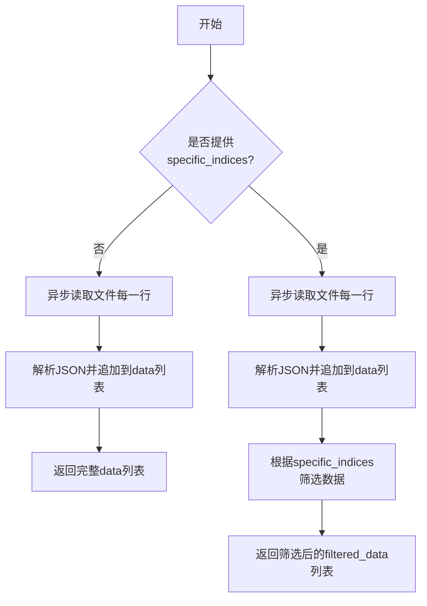
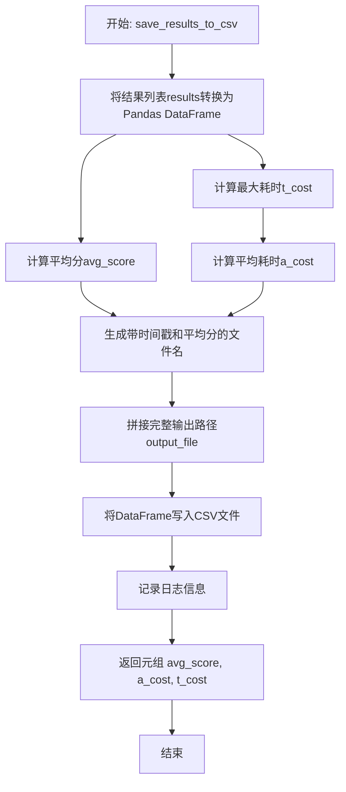
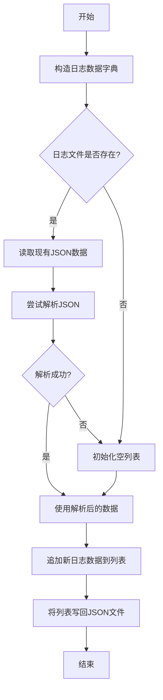
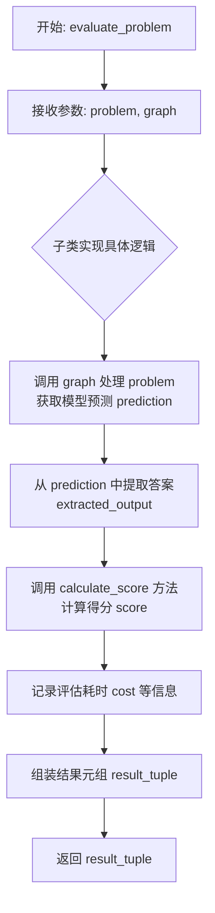
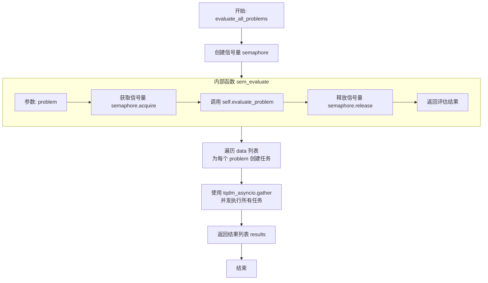
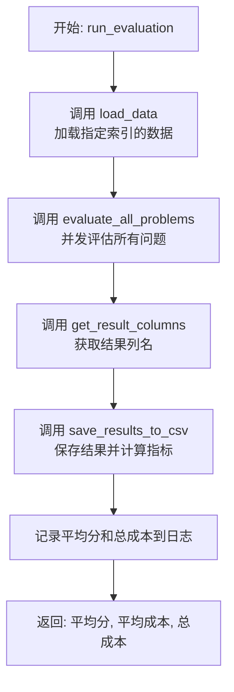

# `.\MetaGPT\metagpt\ext\aflow\benchmark\benchmark.py` 详细设计文档

该代码定义了一个用于评估AI模型性能的异步基准测试框架。它提供了一个抽象基类 `BaseBenchmark`，用于加载测试数据、并发执行评估任务、计算得分、记录不匹配结果，并将最终结果保存为CSV文件。该框架支持自定义评估逻辑和评分标准，适用于对文本生成模型等进行批量、可扩展的性能测试。

## 整体流程

```mermaid
graph TD
    A[开始: run_evaluation] --> B[load_data: 异步加载JSONL测试数据]
    B --> C[evaluate_all_problems: 创建并发评估任务]
    C --> D[使用信号量控制最大并发数]
    D --> E[循环调用evaluate_problem(抽象方法)]
    E --> F[calculate_score(抽象方法): 计算单个问题得分]
    F --> G[记录不匹配结果到log.json]
    G --> H[汇总所有结果]
    H --> I[save_results_to_csv: 计算平均分、总耗时等并保存CSV]
    I --> J[结束并返回统计信息]
```

## 类结构

```
BaseBenchmark (抽象基类)
├── __init__
├── load_data (异步)
├── save_results_to_csv
├── log_mismatch
├── evaluate_problem (抽象方法，异步)
├── calculate_score (抽象方法)
├── get_result_columns (抽象方法)
├── evaluate_all_problems (异步)
└── run_evaluation (异步)
```

## 全局变量及字段


### `BaseBenchmark.name`
    
基准测试的名称，用于标识和日志记录。

类型：`str`
    


### `BaseBenchmark.file_path`
    
存储待评估问题数据集的JSONL文件路径。

类型：`str`
    


### `BaseBenchmark.log_path`
    
用于存储评估结果CSV文件和错误日志JSON文件的目录路径。

类型：`str`
    


### `BaseBenchmark.PASS`
    
表示评估结果通过的常量字符串。

类型：`str`
    


### `BaseBenchmark.FAIL`
    
表示评估结果失败的常量字符串。

类型：`str`
    
    

## 全局函数及方法


### `BaseBenchmark.__init__`

`BaseBenchmark` 类的构造函数，用于初始化基准测试实例的核心属性，包括基准名称、数据文件路径和日志输出路径。

参数：

-  `name`：`str`，基准测试的名称，用于标识和日志记录。
-  `file_path`：`str`，包含待评估问题数据集的JSONL文件路径。
-  `log_path`：`str`，用于存储评估结果CSV文件和错误日志JSON文件的目录路径。

返回值：`None`，构造函数不返回任何值。

#### 流程图

```mermaid
flowchart TD
    A[开始: __init__(name, file_path, log_path)] --> B[初始化实例字段 self.name]
    B --> C[初始化实例字段 self.file_path]
    C --> D[初始化实例字段 self.log_path]
    D --> E[结束]
```

#### 带注释源码

```python
def __init__(self, name: str, file_path: str, log_path: str):
    # 将传入的基准名称赋值给实例变量 self.name
    self.name = name
    # 将传入的数据文件路径赋值给实例变量 self.file_path
    self.file_path = file_path
    # 将传入的日志文件路径赋值给实例变量 self.log_path
    self.log_path = log_path
```


### `BaseBenchmark.load_data`

该方法用于从指定的JSONL文件中异步加载数据，并可根据提供的索引列表筛选出特定的数据行。

参数：
- `specific_indices`：`List[int]`，可选参数，指定需要加载的数据行索引列表。如果为`None`，则加载所有数据。

返回值：`List[dict]`，返回一个字典列表，每个字典代表从JSONL文件中解析出的一行数据。如果提供了`specific_indices`，则只返回对应索引的数据行。

#### 流程图



#### 带注释源码

```python
async def load_data(self, specific_indices: List[int] = None) -> List[dict]:
    # 初始化一个空列表用于存储加载的数据
    data = []
    # 使用aiofiles异步打开文件，指定编码为utf-8
    async with aiofiles.open(self.file_path, mode="r", encoding="utf-8") as file:
        # 异步迭代文件的每一行
        async for line in file:
            # 将每一行的JSON字符串解析为Python字典，并添加到data列表中
            data.append(json.loads(line))
    # 检查是否传入了特定的索引列表
    if specific_indices is not None:
        # 如果传入了索引列表，则根据索引筛选数据
        # 使用列表推导式，只选取索引在有效范围内（i < len(data)）的数据行
        filtered_data = [data[i] for i in specific_indices if i < len(data)]
        # 返回筛选后的数据
        return filtered_data
    # 如果没有传入索引列表，则返回全部数据
    return data
```

### `BaseBenchmark.save_results_to_csv`

该方法将评估结果列表转换为一个Pandas DataFrame，计算关键指标（平均分、总耗时、平均耗时），并将DataFrame保存为一个CSV文件。文件名包含了平均分和时间戳，便于追踪和比较不同批次的评估结果。

参数：

- `results`：`List[Tuple[Any, ...]]`，包含每个问题评估结果的元组列表。每个元组的结构应与`get_result_columns`方法返回的列名列表相对应。
- `columns`：`List[str]`，DataFrame的列名列表，用于描述`results`中每个元组元素的意义。

返回值：`Tuple[float, float, float]`，返回一个包含三个浮点数的元组，依次为：平均分(`avg_score`)、平均耗时(`a_cost`)、总耗时(`t_cost`)。

#### 流程图



#### 带注释源码

```python
def save_results_to_csv(self, results: List[Tuple[Any, ...]], columns: List[str]):
    # 1. 将结果列表和列名转换为Pandas DataFrame，便于数据操作和分析。
    df = pd.DataFrame(results, columns=columns)

    # 2. 计算关键性能指标。
    #    - 平均分：所有`score`列值的平均值。
    avg_score = df["score"].mean()
    #    - 总耗时：所有`cost`列值中的最大值（假设`cost`代表单个问题的处理耗时）。
    t_cost = df["cost"].max()
    #    - 平均耗时：总耗时除以问题数量。如果结果为空，则平均耗时为0。
    a_cost = t_cost / len(df) if len(df) > 0 else 0

    # 3. 生成文件名，格式为“{平均分}_{时间戳}.csv”。
    #    时间戳格式为年月日_时分秒，确保文件名唯一且包含评估信息。
    current_time = datetime.now().strftime("%Y%m%d_%H%M%S")
    filename = f"{avg_score:.5f}_{current_time}.csv"

    # 4. 拼接完整的文件输出路径。
    output_file = os.path.join(self.log_path, filename)

    # 5. 将DataFrame写入CSV文件，不包含行索引。
    df.to_csv(output_file, index=False)

    # 6. 记录文件保存成功的日志信息。
    logger.info(f"Results saved to {output_file}")

    # 7. 返回计算出的关键指标。
    return avg_score, a_cost, t_cost
```

### `BaseBenchmark.log_mismatch`

该方法用于记录模型预测结果与预期答案不匹配的详细信息。它将问题、预期答案、模型原始输出、提取后的输出以及用于提取答案的代码（如果有）记录到一个JSON日志文件中。如果日志文件已存在，则追加新的记录；如果不存在，则创建新文件。

参数：
- `problem`：`str`，需要评估的问题或题目描述。
- `expected_output`：`Any`，该问题的标准答案或预期输出。
- `prediction`：`str`，模型对该问题的原始输出字符串。
- `extracted_output`：`Any`，从模型原始输出中提取或解析后的答案。
- `extract_answer_code`：`str`，用于从模型输出中提取答案的代码或方法描述，默认为"None"。

返回值：`None`，该方法不返回任何值，其作用是将数据写入日志文件。

#### 流程图



#### 带注释源码

```python
def log_mismatch(
    self,
    problem: str,
    expected_output: Any,
    prediction: str,
    extracted_output: Any,
    extract_answer_code: str = "None",
):
    # 1. 构造包含所有相关信息的日志数据字典
    log_data = {
        "question": problem,
        "right_answer": expected_output,
        "model_output": prediction,
        "extracted_output": extracted_output,
        "extract_answer_code": extract_answer_code,
    }
    # 2. 确定日志文件的完整路径
    log_file = Path(self.log_path) / "log.json"
    # 3. 检查日志文件是否存在
    if log_file.exists():
        # 3.1 如果存在，则尝试读取并解析其中的JSON数据
        with log_file.open("r", encoding="utf-8") as f:
            try:
                data = json.load(f)
            except json.JSONDecodeError:
                # 3.2 如果文件内容不是有效的JSON（例如文件损坏或为空），则初始化一个空列表
                data = []
    else:
        # 4. 如果文件不存在，则初始化一个空列表
        data = []
    # 5. 将新的日志数据追加到列表中
    data.append(log_data)
    # 6. 调用工具函数将整个列表写回JSON文件，使用UTF-8编码和4个空格的缩进
    write_json_file(log_file, data, encoding="utf-8", indent=4)
```


### `BaseBenchmark.evaluate_problem`

这是一个抽象方法，定义了评估单个问题（problem）的核心流程。它接收一个问题描述和一个图（graph）处理函数，执行评估逻辑，并返回一个包含评估结果的元组。具体的评估逻辑、评分计算和结果格式由子类实现。

参数：

-  `problem`：`dict`，包含待评估问题的信息，例如问题描述、预期答案等。
-  `graph`：`Callable`，一个可调用对象（通常是函数或方法），用于处理问题并生成模型的预测输出。

返回值：`Tuple[Any, ...]`，返回一个元组，包含对单个问题评估后的各项结果。元组的具体内容和顺序由子类的 `get_result_columns` 方法定义，通常包括问题ID、模型预测、提取后的答案、得分、耗时等。

#### 流程图



#### 带注释源码

```
    @abstractmethod
    async def evaluate_problem(self, problem: dict, graph: Callable) -> Tuple[Any, ...]:
        # 这是一个抽象方法，需要子类提供具体实现。
        # 其核心职责是：
        # 1. 使用传入的 `graph` 处理 `problem`，得到模型的原始输出（prediction）。
        # 2. 从原始输出中提取出结构化的答案（extracted_output）。
        # 3. 调用 `calculate_score` 方法，将提取的答案与问题中的预期答案进行比较，计算得分。
        # 4. 记录处理该问题所消耗的时间或其他度量（cost）。
        # 5. 将上述所有信息（可能还包括问题ID、原始预测等）打包成一个元组并返回。
        # 返回的元组结构必须与 `get_result_columns` 方法定义的列名顺序一致。
        pass
```


### `BaseBenchmark.calculate_score`

这是一个抽象方法，定义了评估基准测试中单个问题得分的核心逻辑。它接收模型的预期输出和实际预测输出，计算一个得分并可能返回一个处理后的输出（例如，从原始预测中提取的答案）。具体的评分规则（如精确匹配、模糊匹配、数值比较等）由继承此基类的子类实现。

参数：

-  `expected_output`：`Any`，问题的标准答案或预期输出。
-  `prediction`：`Any`，模型对问题给出的原始预测输出。

返回值：`Tuple[float, Any]`，返回一个元组，第一个元素是计算出的得分（通常为0.0到1.0之间的浮点数），第二个元素是处理后的输出（例如，从`prediction`中提取出的结构化答案）。

#### 流程图

```mermaid
flowchart TD
    A[开始] --> B[接收参数<br>expected_output, prediction]
    B --> C{是否为抽象方法?}
    C -- 是 --> D[由子类实现具体逻辑]
    D --> E[子类计算得分<br>并处理输出]
    E --> F[返回元组<br>(score, processed_output)]
    C -- 否<br>（直接调用基类方法） --> G[抛出 NotImplementedError]
    G --> H[结束]
    F --> H
```

#### 带注释源码

```python
    @abstractmethod
    def calculate_score(self, expected_output: Any, prediction: Any) -> Tuple[float, Any]:
        """
        抽象方法：计算给定预测相对于预期输出的得分。
        此方法必须由继承BaseBenchmark的子类实现，以定义特定基准测试的评分规则。

        参数:
            expected_output (Any): 问题的标准答案或预期输出。
            prediction (Any): 模型对问题给出的原始预测输出。

        返回:
            Tuple[float, Any]: 一个包含两个元素的元组。
                - 第一个元素 (float): 计算出的得分，通常表示预测的准确性（例如，1.0表示完全正确，0.0表示错误）。
                - 第二个元素 (Any): 处理后的输出，例如从原始预测中提取或转换后的答案，用于后续记录或分析。
        """
        pass
```


### `BaseBenchmark.get_result_columns`

这是一个抽象方法，用于定义评估结果数据集的列名。它要求子类实现，以返回一个字符串列表，该列表指定了`save_results_to_csv`方法中创建的结果`DataFrame`的列结构。

参数：
- `self`：`BaseBenchmark`，`BaseBenchmark`类的实例。

返回值：`List[str]`，一个字符串列表，表示结果`DataFrame`的列名。

#### 流程图

```mermaid
flowchart TD
    A[开始] --> B[子类实现方法]
    B --> C[返回列名列表 List[str]]
    C --> D[结束]
```

#### 带注释源码

```
    @abstractmethod
    def get_result_columns(self) -> List[str]:
        pass
```


### `BaseBenchmark.evaluate_all_problems`

该方法用于并发地评估一批问题。它通过信号量（`asyncio.Semaphore`）控制最大并发任务数，为数据集中的每个问题创建一个异步评估任务，并使用进度条（`tqdm_asyncio`）包装所有任务的并发执行过程，最终返回所有问题的评估结果列表。

参数：

-  `data`：`List[dict]`，包含待评估问题信息的字典列表。
-  `graph`：`Callable`，一个可调用对象（例如函数或方法），在评估每个问题时会被调用，用于处理问题或生成答案。
-  `max_concurrent_tasks`：`int`，最大并发任务数，默认为50，用于控制同时进行评估的任务数量，防止资源过载。

返回值：`List[Tuple[Any, ...]]`，返回一个列表，其中每个元素是一个元组，代表对应问题的评估结果。元组的具体内容由子类实现的 `evaluate_problem` 方法决定。

#### 流程图



#### 带注释源码

```python
async def evaluate_all_problems(self, data: List[dict], graph: Callable, max_concurrent_tasks: int = 50):
    # 创建一个信号量，用于限制最大并发任务数，防止系统资源过载
    semaphore = asyncio.Semaphore(max_concurrent_tasks)

    # 定义一个内部异步函数，用于包装单个问题的评估过程
    async def sem_evaluate(problem):
        # 异步上下文管理器，确保在评估期间持有信号量，评估完成后自动释放
        async with semaphore:
            # 调用抽象的 evaluate_problem 方法执行具体的问题评估逻辑
            return await self.evaluate_problem(problem, graph)

    # 为数据列表中的每个问题创建一个异步任务
    tasks = [sem_evaluate(problem) for problem in data]
    # 使用 tqdm_asyncio.gather 并发执行所有任务，并显示进度条
    # desc 参数设置进度条描述，total 参数设置总任务数
    return await tqdm_asyncio.gather(*tasks, desc=f"Evaluating {self.name} problems", total=len(data))
```

### `BaseBenchmark.run_evaluation`

`run_evaluation` 方法是 `BaseBenchmark` 类的核心执行方法。它负责协调整个评估流程：首先加载指定的数据集，然后并发地对数据集中的每个问题进行评估，最后将评估结果汇总并保存到CSV文件中，同时计算并返回平均得分和成本指标。

参数：

- `graph`：`Callable`，一个可调用对象（例如函数或方法），用于处理每个问题。它通常代表一个推理图或模型，是评估过程中执行具体任务的核心组件。
- `va_list`：`List[int]`，一个整数列表，指定要从数据集中加载的特定数据行的索引。如果为空或为`None`，则加载全部数据。
- `max_concurrent_tasks`：`int`，可选参数，默认值为50。它控制并发评估任务的最大数量，用于限制同时进行的异步任务数，防止资源过载。

返回值：`Tuple[float, float, float]`，返回一个包含三个浮点数的元组，分别代表整个评估过程的平均得分 (`average_score`)、平均成本 (`average_cost`) 和总成本 (`total_cost`)。

#### 流程图



#### 带注释源码

```python
async def run_evaluation(self, graph: Callable, va_list: List[int], max_concurrent_tasks: int = 50):
    # 1. 数据加载阶段：根据提供的索引列表加载评估数据。
    data = await self.load_data(va_list)
    
    # 2. 并发评估阶段：使用信号量控制最大并发数，对所有加载的数据进行评估。
    results = await self.evaluate_all_problems(data, graph, max_concurrent_tasks)
    
    # 3. 结果处理阶段：获取结果表格的列名。
    columns = self.get_result_columns()
    
    # 4. 结果保存与指标计算阶段：将结果保存为CSV，并计算平均分、平均成本和总成本。
    average_score, average_cost, total_cost = self.save_results_to_csv(results, columns)
    
    # 5. 日志记录阶段：将关键指标记录到日志中。
    logger.info(f"Average score on {self.name} dataset: {average_score:.5f}")
    logger.info(f"Total Cost: {total_cost:.5f}")
    
    # 6. 返回阶段：将计算出的指标返回给调用者。
    return average_score, average_cost, total_cost
```

## 关键组件


### 异步数据加载与处理

通过 `aiofiles` 库实现异步文件读取，支持按指定索引列表加载数据，提高了处理大型数据集时的 I/O 效率。

### 异步并发评估控制

利用 `asyncio.Semaphore` 和 `tqdm_asyncio.gather` 实现带进度显示的异步并发任务执行，通过信号量机制控制最大并发任务数，避免资源过载。

### 抽象基准测试框架

定义了 `BaseBenchmark` 抽象基类，通过抽象方法 `evaluate_problem`、`calculate_score` 和 `get_result_columns` 强制子类实现具体的评估逻辑、评分规则和结果列定义，提供了可扩展的基准测试框架。

### 结果记录与持久化

提供 `save_results_to_csv` 方法将评估结果（包括平均分、单次成本、总成本）保存为 CSV 文件，并使用 `log_mismatch` 方法将模型预测与期望输出不匹配的案例记录到 JSON 日志文件中，便于后续分析和调试。

### 评估流程编排

`run_evaluation` 方法作为主入口，编排了从数据加载、并发评估到结果保存和日志输出的完整评估流程，实现了关注点分离和流程自动化。


## 问题及建议


### 已知问题

-   **`log_mismatch` 方法存在潜在的竞态条件**：该方法在读取和写入日志文件时，没有使用任何锁机制。当多个异步任务并发调用此方法时，可能导致日志文件内容被覆盖或损坏，因为多个协程可能同时读取旧数据、追加新数据并写入，造成数据丢失。
-   **`load_data` 方法在处理 `specific_indices` 时效率低下**：该方法首先读取整个文件的所有行到内存中，然后再根据索引列表进行过滤。当数据集文件很大，但只需要评估其中一小部分（`specific_indices`）时，会造成不必要的内存消耗和I/O开销。
-   **`save_results_to_csv` 方法中的文件名可能冲突**：文件名基于平均分和当前时间生成。如果在同一秒内（时间格式精确到分钟）运行两次评估，且平均分相同，将导致文件被覆盖。虽然概率较低，但在自动化或高频运行场景下是潜在风险。
-   **`evaluate_all_problems` 方法缺少错误处理**：如果某个 `evaluate_problem` 任务执行失败（例如，网络超时、代码异常），`asyncio.gather` 会抛出异常并中断整个评估流程，导致部分结果丢失，无法实现容错或部分成功。
-   **抽象基类（ABC）的职责可能过重**：`BaseBenchmark` 同时负责数据加载、结果保存、日志记录和并发控制。这违反了单一职责原则，使得类难以维护和测试，特别是当需要改变其中某一部分（如日志格式或并发策略）时。

### 优化建议

-   **为 `log_mismatch` 方法引入文件锁或使用原子写入**：可以使用 `aiofiles` 配合文件锁（如 `fcntl` 或第三方库 `aiofile`），或者改为先将日志条目追加到内存队列，然后由单个后台任务负责批量写入文件，以避免并发写入冲突。
-   **优化 `load_data` 方法以支持流式过滤**：可以修改方法逻辑，使其在读取文件时，只将行号在 `specific_indices` 列表中的行加载到内存。这需要预先知道文件的行号与索引的对应关系（例如，每行一个JSON对象）。或者，如果索引是稀疏的，可以改为使用 `linecache` 模块按需读取特定行。
-   **增强 `save_results_to_csv` 文件名的唯一性**：在文件名中加入更精确的时间戳（如 `%Y%m%d_%H%M%S_%f` 包含微秒）或一个随机字符串/进程ID，以确保每次运行生成的文件名绝对唯一，避免覆盖。
-   **在 `evaluate_all_problems` 中增加任务级错误处理**：使用 `asyncio.gather` 的 `return_exceptions=True` 参数，使异常作为结果返回而不是抛出。然后可以在结果处理阶段过滤出成功的评估结果，记录失败的案例，并继续处理其他任务，提高评估流程的健壮性。
-   **重构 `BaseBenchmark` 以遵循单一职责原则**：考虑将不同的职责拆分到独立的类或模块中。例如：
    -   `DataLoader`: 负责从文件加载和过滤数据。
    -   `ResultExporter`: 负责将结果保存为CSV并计算统计信息。
    -   `MismatchLogger`: 负责记录不匹配的案例，并处理并发写入问题。
    -   `ConcurrentEvaluator`: 负责管理并发评估任务和信号量。
    这样，`BaseBenchmark` 可以更专注于定义评估流程的模板方法（如 `run_evaluation`），而将具体实现委托给这些组件，提高代码的可测试性和可扩展性。


## 其它


### 设计目标与约束

本代码旨在提供一个可扩展的基准测试框架，用于评估不同模型或算法在特定数据集上的性能。其核心设计目标包括：
1.  **抽象与可扩展性**：通过抽象基类 `BaseBenchmark` 定义评估流程的通用接口，允许通过继承创建针对不同任务（如代码生成、数学推理）的具体评测类。
2.  **异步高性能**：利用 `asyncio` 实现异步 I/O 和并发任务处理，以高效地并行评估大量问题，并通过信号量 (`Semaphore`) 控制最大并发数，防止资源过载。
3.  **结果可追溯性**：将详细的评估结果（包括得分、耗时）保存为结构化的 CSV 文件，并将模型输出与预期答案不匹配的案例记录到 JSON 日志文件中，便于后续分析和调试。
4.  **流程标准化**：固化“加载数据 -> 并发评估 -> 结果汇总与保存”的核心工作流，确保不同评测任务执行流程的一致性。

主要约束包括：
1.  **数据格式依赖**：`load_data` 方法假设输入文件为每行一个 JSON 对象的格式（JSON Lines）。更改数据格式需要重写此方法。
2.  **计算逻辑抽象**：具体的评分规则 (`calculate_score`)、结果列定义 (`get_result_columns`) 和单个问题的评估逻辑 (`evaluate_problem`) 必须由子类实现，框架本身不包含任何领域逻辑。
3.  **外部依赖**：强依赖于 `pandas`, `aiofiles`, `tqdm` 等第三方库进行数据处理、异步文件操作和进度显示。

### 错误处理与异常设计

当前代码的错误处理策略较为基础，主要集中在数据读取和日志记录的容错性上：
1.  **JSON 解析错误**：在 `log_mismatch` 方法中读取已存在的 `log.json` 文件时，使用 `try-except` 捕获 `json.JSONDecodeError`。如果文件损坏或格式错误，将初始化一个空列表并继续执行，避免了因单个日志文件问题导致整个评估进程中断。
2.  **文件操作错误**：代码中使用了 `aiofiles.open` 和标准的 `open`，但并未显式捕获 `IOError` 或 `OSError`。这意味着文件路径错误、权限问题等 I/O 异常会直接向上抛出，可能导致程序崩溃。这是一个潜在的风险点。
3.  **索引越界保护**：在 `load_data` 方法中，对 `specific_indices` 参数进行了检查 (`if i < len(data)`)，防止因传入的索引超出数据列表范围而引发 `IndexError`。
4.  **除零保护**：在 `save_results_to_csv` 方法中计算平均成本 (`a_cost`) 时，检查了结果列表的长度 (`if len(df) > 0`)，避免了在空数据集上计算导致的除零错误。
5.  **抽象方法未实现错误**：由于 `BaseBenchmark` 是抽象基类 (ABC)，如果子类没有实现 `evaluate_problem`, `calculate_score`, `get_result_columns` 这三个抽象方法，在实例化子类时会抛出 `TypeError`。

**优化建议**：应在 `load_data`, `save_results_to_csv` 等涉及文件操作和外部调用的方法中增加更全面的异常处理（例如，包装在 `try-except` 块中），并记录或抛出更具上下文信息的错误，以提高框架的健壮性。

### 数据流与状态机

本框架的数据流是线性的、无状态的批处理流程，不涉及复杂的状态机。其核心数据流如下：
1.  **输入**：评测数据集文件（JSON Lines 格式）和可选的特定索引列表 (`va_list`)。
2.  **处理**：
    a. **数据加载**：`run_evaluation` -> `load_data`。异步读取文件，并按需过滤数据，生成 `List[dict]` 格式的问题列表。
    b. **并发评估**：`run_evaluation` -> `evaluate_all_problems` -> `evaluate_problem` (子类实现)。这是核心环节。为每个问题创建异步任务，通过信号量控制并发度。每个任务调用子类实现的 `evaluate_problem` 方法，该方法内部应调用 `graph` (代表被评测的模型/算法)，并使用 `calculate_score` 计算得分，最终返回一个包含各类结果信息的元组。
    c. **结果收集**：所有异步任务的结果通过 `asyncio.gather` 收集，形成结果列表 `List[Tuple]`。
3.  **输出与持久化**：
    a. **结果汇总**：`run_evaluation` -> `save_results_to_csv`。将结果列表转换为 `DataFrame`，计算平均分、总耗时和平均耗时，并将 `DataFrame` 保存为 CSV 文件。
    b. **错误日志**：在 `evaluate_problem` 的实现中（框架未展示，应由子类完成），当预测答案与预期答案不匹配时，可调用 `log_mismatch` 方法，将问题详情、预期输出、模型原始输出、提取后的输出以及提取代码记录到 `log.json` 文件中。

整个过程中，`BaseBenchmark` 实例本身除了配置参数（`name`, `file_path`, `log_path`）外，不维护任何评估过程的状态。每次 `run_evaluation` 调用都是独立的。

### 外部依赖与接口契约

**外部依赖库**：
1.  `asyncio`：Python 标准库，用于提供异步运行和并发控制的基础设施。
2.  `aiofiles`：提供对异步文件 I/O 操作的支持，用于 `load_data` 方法。
3.  `pandas`：用于将评估结果列表转换为结构化的 `DataFrame` 并保存为 CSV 文件。
4.  `tqdm`：用于在异步任务执行时显示进度条，提升用户体验。
5.  `metagpt.utils.common`：项目内部工具库，依赖其中的 `write_json_file` 函数来安全地写入 JSON 日志文件。
6.  `metagpt.logs`：项目内部日志模块，依赖其中的 `logger` 对象进行信息输出。

**关键接口契约**：
1.  **`graph: Callable` 参数**：这是评测框架与被评测对象之间的核心契约。在 `evaluate_problem` 和 `run_evaluation` 中，`graph` 被作为一个可调用对象传入。框架约定，子类在实现 `evaluate_problem` 时，需要调用 `graph(problem)` 或类似形式来获取模型对当前 `problem` 的预测。`graph` 的具体签名和返回值格式由子类与调用方约定，框架不做强制要求，这提供了极大的灵活性。
2.  **子类必须实现的抽象方法**：
    *   `async evaluate_problem(problem: dict, graph: Callable) -> Tuple[Any, ...]`：定义如何评估单个问题。必须返回一个元组，其内容与 `get_result_columns` 返回的列名顺序一致。
    *   `calculate_score(expected_output: Any, prediction: Any) -> Tuple[float, Any]`：定义如何根据预期答案和模型预测计算得分。返回得分和可能经过提取或处理后的答案。
    *   `get_result_columns() -> List[str]`：定义 `evaluate_problem` 返回的元组中每个元素的列名，用于生成 CSV 文件的表头。
3.  **数据文件契约**：`load_data` 方法默认期望输入文件是 UTF-8 编码的 JSON Lines 格式。子类可以重写此方法来支持其他格式。
4.  **日志路径契约**：`log_path` 目录需要存在，否则 `save_results_to_csv` 和 `log_mismatch` 中的文件操作可能会失败。


    