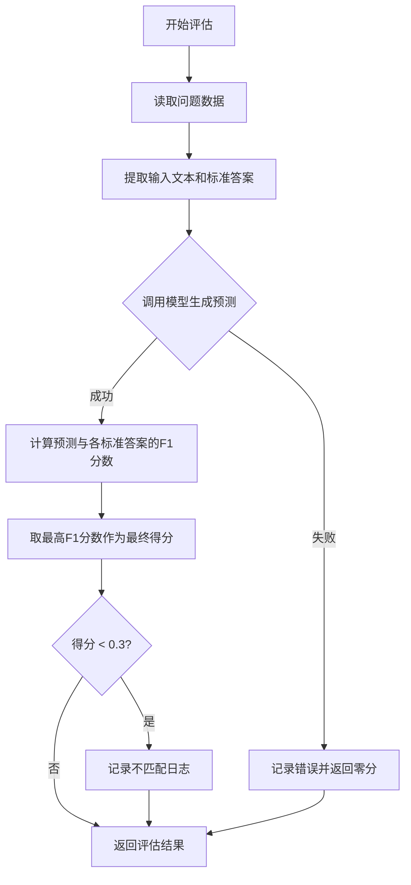
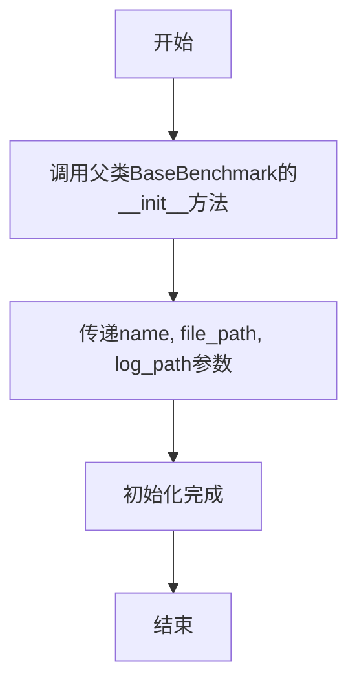

# `.\MetaGPT\metagpt\ext\aflow\benchmark\drop.py` 详细设计文档

该代码实现了一个用于评估问答模型在DROP数据集上性能的基准测试类。它通过计算模型预测答案与标准答案之间的F1分数来评估模型性能，并集成了重试机制和错误处理，以增强测试的鲁棒性。

## 整体流程



## 类结构

```
BaseBenchmark (基准测试基类)
└── DROPBenchmark (DROP数据集评估类)
```

## 全局变量及字段


### `logger`
    
用于记录日志的日志记录器实例，提供不同级别的日志记录功能。

类型：`Logger`
    


    

## 全局函数及方法

### `DROPBenchmark.__init__`

该方法用于初始化 `DROPBenchmark` 类的实例，继承自 `BaseBenchmark` 基类，并设置基准测试的名称、数据文件路径和日志文件路径。

参数：

- `name`：`str`，基准测试的名称。
- `file_path`：`str`，基准测试数据文件的路径。
- `log_path`：`str`，基准测试日志文件的路径。

返回值：`None`，无返回值。

#### 流程图



#### 带注释源码

```python
def __init__(self, name: str, file_path: str, log_path: str):
    # 调用父类BaseBenchmark的构造函数，传递名称、文件路径和日志路径参数
    super().__init__(name, file_path, log_path)
```


### `DROPBenchmark.normalize_answer`

该方法用于对答案字符串进行标准化处理，以便后续进行精确的文本比较和F1分数计算。它通过一系列文本清理步骤（包括转换为小写、移除标点、移除冠词、修复空白字符）来规范化输入字符串，最终返回一个清理后的字符串。

参数：

-  `s`：`str`，需要被标准化的原始答案字符串。

返回值：`str`，经过标准化处理后的字符串。

#### 流程图

```mermaid
flowchart TD
    A[开始: 输入字符串 s] --> B[调用 lower(s) 转换为小写]
    B --> C[调用 remove_punc 移除标点符号]
    C --> D[调用 remove_articles 移除冠词 'a', 'an', 'the']
    D --> E[调用 white_space_fix 修复空白字符]
    E --> F[返回标准化后的字符串]
```

#### 带注释源码

```python
def normalize_answer(self, s: str) -> str:
    """
    Normalize answers for evaluation.
    """

    def remove_articles(text):
        # 使用正则表达式移除文本中的英文冠词 'a', 'an', 'the'
        return re.sub(r"\b(a|an|the)\b", " ", text)

    def white_space_fix(text):
        # 将文本按空白字符分割成列表，再用单个空格重新连接，从而规范化空白字符
        return " ".join(text.split())

    def remove_punc(text):
        # 移除字符串中所有的标点符号
        exclude = set(string.punctuation)
        return "".join(ch for ch in text if ch not in exclude)

    def lower(text):
        # 将文本转换为全小写
        return text.lower()

    # 按顺序应用上述标准化函数：先小写，再移除标点，再移除冠词，最后修复空白字符
    return white_space_fix(remove_articles(remove_punc(lower(s))))
```


### `DROPBenchmark.calculate_score`

计算预测答案与标准答案之间的F1分数，用于评估答案的相似度。

参数：

- `ground_truth`：`str`，标准答案字符串
- `prediction`：`str`，模型预测的答案字符串

返回值：`Tuple[float, str]`，返回一个元组，包含计算出的F1分数（浮点数）和原始的预测答案字符串。

#### 流程图

```mermaid
flowchart TD
    A[开始] --> B[标准化预测答案<br>prediction]
    A --> C[标准化标准答案<br>ground_truth]
    B --> D[将标准化后的预测答案<br>分词为列表 prediction_tokens]
    C --> E[将标准化后的标准答案<br>分词为列表 ground_truth_tokens]
    D --> F[计算两个词列表的<br>共同词频 Counter]
    E --> F
    F --> G{共同词数量<br>num_same == 0?}
    G -- 是 --> H[返回 (0, prediction)]
    G -- 否 --> I[计算精确率 precision<br>num_same / len(prediction_tokens)]
    I --> J[计算召回率 recall<br>num_same / len(ground_truth_tokens)]
    J --> K[计算F1分数<br>2 * precision * recall / (precision + recall)]
    K --> L[返回 (f1, prediction)]
```

#### 带注释源码

```python
def calculate_score(self, ground_truth: str, prediction: str) -> Tuple[float, str]:
    """
    Compute the F1 score between prediction and ground truth answers.
    """
    # 1. 对预测答案和标准答案进行标准化处理（小写、去标点、去停用词、规范化空格）
    prediction_tokens = self.normalize_answer(prediction).split()
    ground_truth_tokens = self.normalize_answer(ground_truth).split()
    
    # 2. 使用Counter计算两个词列表的共同词频
    common = Counter(prediction_tokens) & Counter(ground_truth_tokens)
    # 3. 计算共同词的总出现次数
    num_same = sum(common.values())
    
    # 4. 如果没有任何共同词，F1分数为0
    if num_same == 0:
        return 0, prediction
    
    # 5. 计算精确率：共同词数 / 预测答案词数
    precision = 1.0 * num_same / len(prediction_tokens)
    # 6. 计算召回率：共同词数 / 标准答案词数
    recall = 1.0 * num_same / len(ground_truth_tokens)
    # 7. 计算F1分数：2 * (精确率 * 召回率) / (精确率 + 召回率)
    f1 = (2 * precision * recall) / (precision + recall)
    
    # 8. 返回F1分数和原始预测答案
    return f1, prediction
```


### `DROPBenchmark._generate_output`

该方法是一个异步方法，用于执行重试逻辑，调用传入的图（graph）函数来处理输入文本，并返回其输出。它通过装饰器 `@retry` 配置了重试机制，在遇到 `Exception` 时最多重试5次，每次重试间隔1秒。

参数：

- `graph`：`Callable`，一个可调用对象（通常是异步函数），用于处理输入文本并生成输出。
- `input_text`：`str`，需要处理的输入文本。

返回值：`Any`，返回 `graph(input_text)` 的调用结果，具体类型取决于 `graph` 函数的返回值。

#### 流程图

```mermaid
graph TD
    A[开始: 调用 _generate_output] --> B[装饰器: 配置重试逻辑]
    B --> C{尝试调用 graph(input_text)}
    C -->|成功| D[返回结果]
    C -->|抛出 Exception| E{重试次数 < 5?}
    E -->|是| F[等待1秒]
    F --> C
    E -->|否| G[抛出异常]
    G --> H[结束]
    D --> H
```

#### 带注释源码

```python
@retry(stop=stop_after_attempt(5), wait=wait_fixed(1), retry=retry_if_exception_type(Exception), reraise=True)
async def _generate_output(self, graph, input_text):
    # 使用重试装饰器调用传入的graph函数
    # stop_after_attempt(5): 最多重试5次
    # wait_fixed(1): 每次重试间隔1秒
    # retry_if_exception_type(Exception): 仅在遇到Exception时重试
    # reraise=True: 重试次数用尽后重新抛出最后的异常
    return await graph(input_text)  # 异步调用graph并返回其结果
```

### `DROPBenchmark.evaluate_problem`

该方法用于评估一个给定的问题（problem）通过一个图（graph）处理后的输出结果。它接收一个问题字典和一个图处理函数，生成输入文本的预测输出，并与期望的多个答案进行比较，计算最高的F1分数作为评估得分。同时，它处理异常情况，记录不匹配的样本，并返回评估结果。

参数：

- `problem`：`dict`，包含评估所需数据的问题字典，其中应包含“context”键作为输入文本，“ref_text”键作为期望的答案（多个答案用“|”分隔）。
- `graph`：`Callable`，一个可调用的图处理函数，接收输入文本并返回预测输出和成本。

返回值：`Tuple[str, str, str, float, float]`，返回一个包含输入文本、预测输出（或错误信息）、期望输出、最高F1分数和成本的元组。

#### 流程图

```mermaid
flowchart TD
    A[开始] --> B[从problem中提取input_text和expected_output]
    B --> C[将expected_output按'|'分割为answers列表]
    C --> D{尝试调用graph生成输出}
    D -->|成功| E[获取output和cost]
    D -->|异常| F[记录异常并返回错误信息]
    E --> G[初始化f1_scores列表]
    G --> H[遍历answers列表]
    H --> I{answer是否非空?}
    I -->|是| J[将output按'|'分割为output_parts]
    J --> K[遍历output_parts]
    K --> L[计算answer与output_part的F1分数]
    L --> M[将F1分数添加到f1_scores]
    M --> K
    K -->|遍历完成| H
    I -->|否| H
    H -->|遍历完成| N[计算f1_scores中的最大值作为uni_score]
    N --> O{uni_score < 0.3?}
    O -->|是| P[记录不匹配样本]
    O -->|否| Q[返回结果元组]
    P --> Q
    F --> R[返回包含错误信息的结果元组]
    Q --> S[结束]
    R --> S
```

#### 带注释源码

```python
async def evaluate_problem(self, problem: dict, graph: Callable) -> Tuple[str, str, str, float, float]:
    # 从问题字典中提取输入文本和期望输出
    input_text = problem["context"]
    expected_output = problem["ref_text"]
    # 将期望输出按“|”分割成多个答案，用于后续多答案比较
    answers = expected_output.split("|")

    try:
        # 调用图处理函数生成预测输出和成本，使用重试机制处理可能的异常
        output, cost = await self._generate_output(graph, input_text)
        # 初始化一个列表来存储所有计算出的F1分数
        f1_scores = []

        # 遍历每个期望答案
        for answer in answers:
            # 跳过空答案
            if answer.strip() != "":
                # 将预测输出按“|”分割成多个部分，以处理多部分预测
                output_parts = output.split("|")
                # 遍历每个预测输出部分
                for output_part in output_parts:
                    # 计算当前答案与当前预测部分的F1分数
                    f1_score, _ = self.calculate_score(answer, output_part)
                    # 将F1分数添加到列表中
                    f1_scores.append(f1_score)

        # 从所有F1分数中取最大值作为最终的统一分数
        uni_score = max(f1_scores)

        # 如果统一分数低于0.3，记录不匹配的样本以便后续分析
        if uni_score < 0.3:
            self.log_mismatch(input_text, expected_output, output, output)

        # 返回包含输入文本、预测输出、期望输出、统一分数和成本的结果元组
        return input_text, output, expected_output, uni_score, cost

    except Exception as e:
        # 如果发生异常（包括重试后仍失败），记录异常信息
        logger.info(f"Maximum retries reached. Skipping this sample. Error: {e}")
        # 返回包含错误信息的结果元组，分数和成本设为0.0
        return input_text, str(e), expected_output, 0.0, 0.0
```

### `DROPBenchmark.get_result_columns`

该方法用于定义并返回评估结果数据集的列名列表。这些列名描述了在评估过程中每个样本（问题）所记录和输出的关键信息字段。

参数：
- 无

返回值：`List[str]`，一个包含五个字符串的列表，分别代表输入文本、模型预测输出、期望输出、评估分数和计算成本的列名。

#### 流程图

```mermaid
flowchart TD
    Start[开始] --> A[定义结果列名列表]
    A --> B[返回列表<br>['inputs', 'prediction', 'expected_output', 'score', 'cost']]
    B --> End[结束]
```

#### 带注释源码

```python
def get_result_columns(self) -> List[str]:
    # 返回一个固定的字符串列表，定义了评估结果数据集的列结构。
    # 这些列分别对应：
    # - inputs: 输入给模型的上下文或问题文本。
    # - prediction: 模型生成的预测答案。
    # - expected_output: 数据集中提供的标准答案。
    # - score: 根据特定指标（如F1分数）计算出的模型表现分数。
    # - cost: 生成该预测所消耗的计算资源成本（例如API调用费用）。
    return ["inputs", "prediction", "expected_output", "score", "cost"]
```

## 关键组件


### 文本规范化组件 (`normalize_answer` 方法)

提供了一套文本预处理流程，用于在评估前对答案字符串进行标准化，包括转换为小写、移除标点符号、移除冠词和修复空白字符，以确保评估的公平性和一致性。

### 评估分数计算组件 (`calculate_score` 方法)

实现了基于 F1 分数的答案匹配评估逻辑，通过计算预测答案与标准答案之间分词级别的精确率和召回率来得出一个介于 0 到 1 之间的分数，用于衡量模型输出的准确性。

### 容错执行组件 (`_generate_output` 方法)

一个经过装饰器增强的异步方法，封装了对图计算 (`graph`) 的调用，并提供了自动重试机制，以增强在面对临时性异常（如网络波动）时的系统鲁棒性。

### 问题评估流程组件 (`evaluate_problem` 方法)

定义了单个问题样本的完整评估流程：准备输入、调用模型、处理多答案标准、计算最佳匹配分数、记录异常结果，并最终返回包含输入、预测、标准答案、分数和成本的元组。

### 结果列定义组件 (`get_result_columns` 方法)

定义了评估结果数据集的列结构，明确了输出结果的格式，确保后续的结果记录、存储和分析能够遵循统一的模式。


## 问题及建议


### 已知问题

-   **异常处理粒度较粗**：`evaluate_problem`方法中的`try-except`块捕获了所有`Exception`类型，这可能会掩盖代码中特定的、可恢复的错误，使得调试和问题定位变得困难。
-   **重试逻辑可能不适用于所有场景**：`_generate_output`方法对所有`Exception`都进行重试，但某些异常（如输入验证错误、逻辑错误）重试是无效的，可能导致不必要的延迟和资源消耗。
-   **日志记录不完整**：当`uni_score < 0.3`时，会记录不匹配信息，但未记录具体的`f1_scores`值或预测与标准答案的详细对比，不利于后续分析模型的具体失败模式。
-   **潜在的性能瓶颈**：`evaluate_problem`方法中，对于每个标准答案，都会遍历模型输出的所有部分（`output_parts`）计算F1分数。如果标准答案或模型输出包含大量部分，可能导致计算复杂度较高。
-   **代码可读性与维护性**：`normalize_answer`方法内部嵌套了多个辅助函数，虽然逻辑清晰，但嵌套结构可能影响可读性。可以考虑重构为类方法或独立的工具函数。

### 优化建议

-   **细化异常处理**：建议将`evaluate_problem`方法中的通用`Exception`捕获替换为更具体的异常类型（如`TimeoutError`, `ConnectionError`等），并为不同类型的异常设计不同的处理策略（如重试、跳过、记录特定错误等）。
-   **优化重试策略**：修改`_generate_output`方法的`retry`装饰器，使用`retry_if_exception_type`指定仅对网络超时、临时服务不可用等可重试的异常进行重试，避免对逻辑错误进行无效重试。
-   **增强日志信息**：在记录不匹配时，除了记录输入、输出和期望输出，建议同时记录计算出的所有`f1_scores`、最佳匹配的答案部分以及对应的预测部分，以便进行更深入的错误分析。
-   **优化计算逻辑**：考虑优化`evaluate_problem`中计算最佳F1分数的逻辑。例如，可以先将模型输出的所有部分进行归一化和分词，然后与每个标准答案进行比较，避免重复的字符串分割和归一化操作。对于大规模评估，可以考虑使用向量化计算或并行处理来提升性能。
-   **重构辅助函数**：将`normalize_answer`方法内部的嵌套函数提取为类的私有方法（如`_remove_articles`, `_white_space_fix`等）或模块级的工具函数，以提高代码的可读性和可测试性。同时，考虑为这些文本预处理步骤添加单元测试。
-   **添加配置化参数**：将`0.3`这个判定为不匹配的F1分数阈值作为类初始化参数或配置项，提高代码的灵活性和可配置性。
-   **考虑内存与性能监控**：对于大规模数据集评估，建议添加简单的性能监控，记录每个问题评估的耗时，并在评估结束后输出总体统计信息（如平均耗时、最长耗时等），以帮助识别性能瓶颈。


## 其它


### 设计目标与约束

本模块旨在为DROP数据集提供一个标准化的评估基准。其核心设计目标是：1. 实现一个可复用的评估框架，能够计算模型预测答案与标准答案之间的F1分数；2. 提供健壮的错误处理机制，在网络或模型调用失败时通过重试保证评估流程的连续性；3. 输出结构化的评估结果，便于后续分析和比较。主要约束包括：评估逻辑（如F1计算、答案归一化）需与DROP官方评估标准保持一致；需要与外部图计算引擎（`graph`参数）异步交互；评估过程需记录成本（`cost`）和错误样本。

### 错误处理与异常设计

模块采用分层错误处理策略。在`evaluate_problem`方法中，通过`try-except`块捕获`_generate_output`调用及后续处理过程中的所有异常。对于`_generate_output`方法，使用`tenacity`库装饰器实现了针对通用异常（`Exception`）的重试机制（最多5次，每次间隔1秒），以应对临时的网络或服务不稳定问题。若重试耗尽仍失败，异常将被捕获，记录日志，并返回错误信息和零分，确保单个样本的失败不会中断整个评估流程。此外，当F1分数低于阈值（0.3）时，会调用`log_mismatch`方法记录不匹配的样本，便于后续分析。

### 数据流与状态机

数据流始于包含`context`和`ref_text`的问题字典。`evaluate_problem`方法接收该字典和评估图函数（`graph`）。核心流程为：1. 提取输入文本和标准答案（可能为多个，用“|”分隔）；2. 通过`_generate_output`异步调用外部图函数，获取模型预测输出和成本；3. 对每个标准答案和预测输出的每个部分（同样用“|”分隔）计算F1分数；4. 取所有F1分数中的最大值作为该样本的最终得分（`uni_score`）。模块本身是无状态的，不维护内部状态机，每次评估都是独立的函数调用。状态变化主要体现在外部的重试计数器以及日志记录中。

### 外部依赖与接口契约

1.  **父类依赖**：继承自`BaseBenchmark`，需实现`evaluate_problem`和`get_result_columns`方法，并可能使用其`log_mismatch`等方法。依赖其定义的基准测试基础结构。
2.  **计算图依赖**：`evaluate_problem`方法的`graph`参数是一个可调用对象，其接口契约为：接受一个字符串输入，异步返回一个包含输出字符串和成本浮点数的元组`(str, float)`。这是与外部AI模型或推理管道交互的关键接口。
3.  **工具库依赖**：`tenacity`用于重试逻辑；`re`, `string`, `collections.Counter`用于答案归一化和分数计算；`metagpt.logs.logger`用于日志记录。
4.  **数据格式契约**：输入问题字典必须包含`context`（字符串）和`ref_text`（字符串，答案用“|”分隔）键。`get_result_columns`方法定义了输出结果DataFrame的列名契约。

### 性能考量与扩展性

当前实现中，对于包含多个标准答案和多个预测输出的情况，会进行嵌套循环的F1计算（`m * n`次），在答案数量较多时可能成为性能瓶颈。`normalize_answer`函数使用了多次字符串遍历和正则匹配，对于大规模评估可能影响速度。扩展性方面，该类专注于DROP数据集的特定评估逻辑（F1分数、答案归一化规则）。若要支持其他评估指标（如精确匹配、ROUGE）或数据集，需要修改`calculate_score`和`normalize_answer`方法，或通过策略模式进行抽象。异步`_generate_output`方法的设计有利于在高并发调用外部服务时提升整体吞吐量。

    