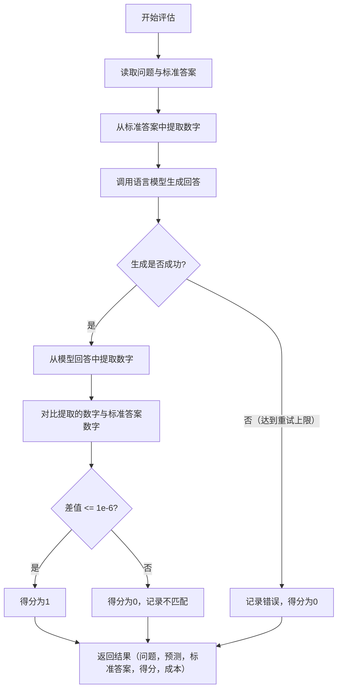
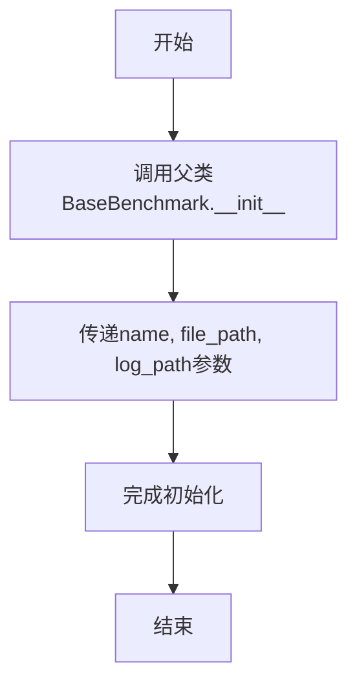
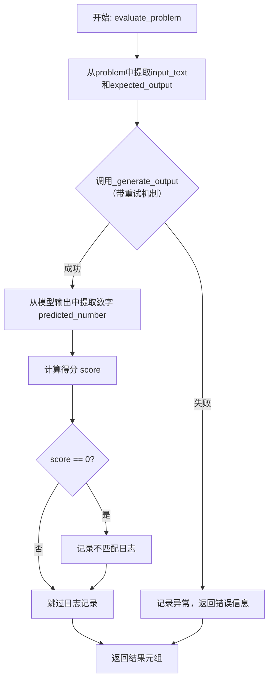
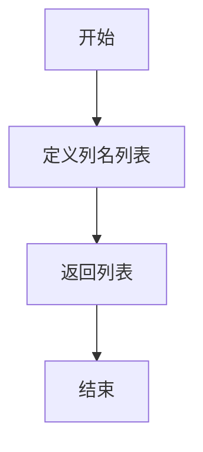

# `.\MetaGPT\metagpt\ext\aflow\benchmark\gsm8k.py` 详细设计文档

该代码实现了一个名为GSM8KBenchmark的基准测试类，专门用于评估语言模型在GSM8K数学推理数据集上的性能。它通过从模型生成的文本中提取数值答案，与标准答案进行对比来计算得分，并支持重试机制和错误日志记录。

## 整体流程



## 类结构

```
BaseBenchmark (基准测试基类)
└── GSM8KBenchmark (GSM8K数据集评估类)
```

## 全局变量及字段


### `logger`
    
用于记录日志的全局日志记录器实例，提供不同级别的日志输出功能。

类型：`metagpt.logs.Logger`
    


    

## 全局函数及方法

### `GSM8KBenchmark.__init__`

该方法用于初始化GSM8KBenchmark类的实例，继承自BaseBenchmark基类，并设置基准测试的名称、数据文件路径和日志文件路径。

参数：

- `name`：`str`，基准测试的名称
- `file_path`：`str`，包含测试数据（如GSM8K问题）的文件路径
- `log_path`：`str`，用于记录测试结果和日志的文件路径

返回值：`None`，无返回值

#### 流程图



#### 带注释源码

```python
def __init__(self, name: str, file_path: str, log_path: str):
    # 调用父类BaseBenchmark的构造函数，传递名称、文件路径和日志路径参数
    super().__init__(name, file_path, log_path)
```

### `GSM8KBenchmark.extract_number`

该方法用于从给定的文本字符串中提取最后一个数值，并将其转换为浮点数。它通过正则表达式匹配文本中的所有数字（包括整数、小数和带千位分隔符的数字），然后尝试将最后一个匹配到的数字转换为浮点数。如果转换失败或没有匹配到任何数字，则返回 `None`。

参数：

- `text`：`str`，需要从中提取数字的文本字符串。

返回值：`Optional[float]`，成功提取并转换的最后一个数字的浮点值，如果提取或转换失败则返回 `None`。

#### 流程图

```mermaid
flowchart TD
    A[开始: extract_number(text)] --> B["使用正则表达式查找所有数字<br>matches = re.findall(...)"]
    B --> C{"matches 是否为空?"}
    C -->|是| D[返回 None]
    C -->|否| E["获取最后一个匹配项<br>last_number = matches[-1]"]
    E --> F["移除千位分隔符<br>last_number.replace(',', '')"]
    F --> G["尝试转换为浮点数<br>float(last_number)"]
    G --> H{"转换是否成功?"}
    H -->|是| I[返回浮点数结果]
    H -->|否| D
```

#### 带注释源码

```python
def extract_number(self, text: str) -> Optional[float]:
    # 使用正则表达式匹配文本中的所有数字。
    # 该模式匹配：
    # 1. 可选的正负号 [-+]?
    # 2. 整数部分 \d+
    # 3. 可选的千位分隔符 (?:,\d{3})*
    # 4. 可选的小数部分 (?:\.\d+)?
    # 或者匹配简单的小数形式 \d+\.\d+
    matches = re.findall(r"[-+]?\d+(?:,\d{3})*(?:\.\d+)?|\d+\.\d+", str(text))
    
    # 检查是否找到了匹配项
    if matches:
        # 获取最后一个匹配到的数字字符串
        last_number = matches[-1]
        # 移除数字中可能存在的千位分隔符（逗号）
        last_number = last_number.replace(",", "")
        try:
            # 尝试将处理后的字符串转换为浮点数
            return float(last_number)
        except ValueError:
            # 如果转换失败（例如字符串不是有效的数字表示），返回 None
            return None
    else:
        # 如果没有找到任何数字匹配，返回 None
        return None
```

### `GSM8KBenchmark.calculate_score`

该方法用于计算模型在GSM8K数学问题上的得分。它通过比较模型预测的数值与标准答案的数值，判断预测是否正确。如果预测值与标准答案的绝对误差在1e-6以内，则判定为正确，得分为1.0；否则为0.0。该方法还负责处理预测值为`None`的特殊情况。

参数：

- `expected_output`：`float`，标准答案的数值。
- `prediction`：`float`，模型预测的数值。

返回值：`Tuple[float, float]`，返回一个元组，第一个元素是得分（1.0或0.0），第二个元素是传入的预测值`prediction`。

#### 流程图

```mermaid
flowchart TD
    A[开始] --> B{预测值是否为None?}
    B -- 是 --> C[返回 (0.0, prediction)]
    B -- 否 --> D{abs(expected - prediction) <= 1e-6?}
    D -- 是 --> E[返回 (1.0, prediction)]
    D -- 否 --> F[返回 (0.0, prediction)]
```

#### 带注释源码

```python
def calculate_score(self, expected_output: float, prediction: float) -> Tuple[float, float]:
    # 如果预测值为None，直接返回0分和None
    if prediction is None:
        return 0.0, prediction
    # 计算预测值与标准答案的绝对误差，若在容差范围内则得1分，否则得0分
    return 1.0 if abs(expected_output - prediction) <= 1e-6 else 0.0, prediction
```

### `GSM8KBenchmark._generate_output`

该方法是一个异步方法，用于执行重试逻辑，调用给定的图（graph）函数来处理输入文本，并返回其输出和成本。它通过装饰器实现了在遇到异常时的自动重试机制。

参数：

- `graph`：`Callable`，一个可调用对象（通常是异步函数），接受一个字符串输入并返回处理结果和成本。
- `input_text`：`str`，需要处理的输入文本。

返回值：`Tuple[str, float]`，返回一个元组，包含图函数处理后的输出字符串和计算出的成本（浮点数）。

#### 流程图

```mermaid
graph TD
    A[开始调用 _generate_output] --> B{是否发生异常?};
    B -- 否 --> C[调用 graph(input_text) 并等待结果];
    C --> D[返回结果 output, cost];
    B -- 是 --> E{重试次数 < 5?};
    E -- 是 --> F[等待1秒];
    F --> B;
    E -- 否 --> G[抛出异常];
```

#### 带注释源码

```python
@retry(stop=stop_after_attempt(5), wait=wait_fixed(1), retry=retry_if_exception_type(Exception), reraise=True)
async def _generate_output(self, graph, input_text):
    # 使用重试装饰器，最多尝试5次，每次失败后等待1秒，仅对Exception类型的异常进行重试，重试失败后重新抛出异常
    return await graph(input_text)  # 异步调用传入的graph函数，并返回其结果
```


### `GSM8KBenchmark.evaluate_problem`

该方法用于评估单个GSM8K数学问题。它接收一个问题字典和一个图（graph）调用函数，通过图生成预测答案，提取其中的数字并与标准答案进行比较，计算得分，并记录不匹配的情况。整个过程包含重试机制以处理临时性错误。

参数：

-  `problem`：`dict`，包含待评估问题的字典，其中必须包含键`"question"`（问题文本）和`"answer"`（标准答案文本）。
-  `graph`：`Callable`，一个可调用对象（通常是异步函数），接收问题文本作为输入，返回模型的预测输出和计算成本。

返回值：`Tuple[str, str, float, float, float]`，返回一个包含五个元素的元组，依次为：原始问题文本、模型生成的完整输出（或错误信息）、标准答案的数值、本次评估的得分（0或1）、本次评估的计算成本。

#### 流程图



#### 带注释源码

```
async def evaluate_problem(self, problem: dict, graph: Callable) -> Tuple[str, str, float, float, float]:
    # 1. 从问题字典中提取输入文本和标准答案
    input_text = problem["question"]
    expected_output = self.extract_number(problem["answer"])

    try:
        # 2. 调用带有重试机制的_generate_output方法，获取模型输出和成本
        output, cost = await self._generate_output(graph, input_text)
        # 3. 从模型输出文本中提取预测的数字
        predicted_number = self.extract_number(output)
        # 4. 将预测数字与标准答案比较，计算得分（0或1）
        score, extracted_output = self.calculate_score(expected_output, predicted_number)

        # 5. 如果预测错误（得分为0），记录不匹配的详细信息到日志
        if score == 0:
            self.log_mismatch(input_text, expected_output, output, extracted_output)

        # 6. 返回评估结果：问题、模型输出、标准答案、得分、成本
        return input_text, output, expected_output, score, cost

    except Exception as e:
        # 7. 如果重试后仍然失败，记录错误并返回默认失败结果
        logger.info(f"Maximum retries reached. Skipping this sample. Error: {e}")
        return input_text, str(e), expected_output, 0.0, 0.0
```


### `GSM8KBenchmark.get_result_columns`

该方法用于定义并返回评估结果数据集的列名列表。这些列名描述了在评估过程中每个样本（即每个数学问题）所记录的信息字段。

参数：
- 无

返回值：`List[str]`，一个字符串列表，包含了结果数据集中各列的名称。

#### 流程图



#### 带注释源码

```
    def get_result_columns(self) -> List[str]:
        # 返回一个字符串列表，定义了评估结果数据集的列结构。
        # 这些列分别对应：
        # - 'question': 原始问题文本
        # - 'prediction': 模型生成的完整答案文本
        # - 'expected_output': 从标准答案中提取的期望数值
        # - 'score': 该问题的得分（1.0 表示正确，0.0 表示错误）
        # - 'cost': 生成该答案所消耗的成本（例如API调用费用）
        return ["question", "prediction", "expected_output", "score", "cost"]
```

## 关键组件


### 基准测试框架集成

该类继承自 `BaseBenchmark`，提供了一个用于评估模型在 GSM8K 数学推理数据集上性能的基准测试框架。

### 数字提取与匹配

通过正则表达式从文本中提取数字，并实现精确的数值匹配逻辑，用于比较模型预测答案与标准答案。

### 异步执行与重试机制

使用 `tenacity` 库为模型调用过程实现了带重试的异步执行机制，以提高评估过程的鲁棒性。

### 评估结果记录与日志

实现了评估结果的标准化输出，并包含对预测错误的详细日志记录功能，便于后续分析。


## 问题及建议


### 已知问题

-   **数字提取逻辑不健壮**：`extract_number` 方法使用简单的正则表达式匹配数字，可能无法正确处理复杂文本中的数字格式（如科学计数法、带单位的数字、分数等），导致提取失败或提取到错误的数字。
-   **错误处理粒度较粗**：`evaluate_problem` 方法在 `_generate_output` 重试失败后，捕获所有 `Exception` 并返回错误信息。这掩盖了具体的异常类型，不利于问题诊断和针对性处理。
-   **评分标准过于严格**：`calculate_score` 方法使用绝对误差 `1e-6` 作为判断标准。对于某些数值计算问题（尤其是浮点数运算），这可能导致因微小的浮点精度差异而错误地判定为不匹配。
-   **日志记录信息不足**：`log_mismatch` 方法（在父类中定义）记录不匹配信息，但当前代码在 `evaluate_problem` 中仅记录了输入、预期输出、模型原始输出和提取的数字。缺少对 `graph` 调用成本 (`cost`) 的记录，不利于进行成本-性能分析。
-   **缺乏输入验证**：`evaluate_problem` 方法直接使用 `problem["question"]` 和 `problem["answer"]`，未对 `problem` 字典的键是否存在或值是否有效进行验证，可能导致运行时错误。

### 优化建议

-   **增强数字提取能力**：重构 `extract_number` 方法，使其能处理更广泛的数字表示形式。可以考虑使用更复杂的正则表达式，或集成专门的数学表达式解析库（如 `sympy`）来提升鲁棒性。
-   **细化异常处理**：在 `evaluate_problem` 的 `try-except` 块中，应更具体地捕获可能发生的异常（如 `TimeoutError`, `ValueError` 等），并为不同类型的异常提供不同的处理逻辑或错误信息，便于调试。
-   **采用更灵活的评分策略**：修改 `calculate_score` 方法，引入相对误差容忍度或可配置的误差阈值。例如，可以允许一定百分比内的误差，或者对于整数结果要求完全匹配，对于浮点数允许微小误差。
-   **完善日志内容**：在调用 `log_mismatch` 时，将本次评估的 `cost` 信息也一并记录。这有助于后续分析模型性能与推理成本之间的关系。
-   **添加输入验证**：在 `evaluate_problem` 方法开始处，添加对 `problem` 参数的检查，确保其包含必要的 `"question"` 和 `"answer"` 键，并且值类型符合预期（例如，`"answer"` 应为字符串）。可以使用 `assert` 语句或抛出更明确的异常（如 `KeyError`, `TypeError`）。
-   **考虑性能优化**：`_generate_output` 方法使用了重试机制。如果 `graph` 调用非常频繁，重试可能带来显著的时间开销。可以考虑实现异步批处理调用，或者使用更高效的并发控制策略来提升整体评估速度。


## 其它


### 设计目标与约束

本代码旨在为GSM8K数学推理数据集提供一个基准测试框架。其核心设计目标是：1) 提供一个可复用的评估流程，能够对给定的“图”（graph，代表一个可执行的推理流程或模型）进行自动化测试；2) 从模型的文本输出中精确提取数值答案，并与标准答案进行比对；3) 具备容错和重试机制，以应对模型调用可能出现的临时性失败；4) 记录评估过程中的详细信息，特别是答案不匹配的案例，便于后续分析。主要约束包括：依赖于父类`BaseBenchmark`提供的基础设施（如日志记录、结果保存）；评估逻辑严格针对GSM8K数据集的格式（包含`question`和`answer`字段）；答案比对采用绝对误差容限（1e-6）。

### 错误处理与异常设计

代码的错误处理主要围绕`_generate_output`方法和`evaluate_problem`方法展开。`_generate_output`方法使用`tenacity`库装饰器，定义了重试策略：当执行`graph(input_text)`发生任何`Exception`时，将最多重试5次，每次间隔1秒。如果所有重试均失败，异常将被重新抛出（`reraise=True`）。在`evaluate_problem`方法中，使用try-except块捕获`_generate_output`重试后仍可能抛出的异常。一旦捕获异常，会将错误信息记录到日志，并返回一个得分为0、成本为0的结果元组，确保单个样本的评估失败不会中断整个批处理流程。对于答案提取（`extract_number`）和数值转换可能引发的`ValueError`，在方法内部进行了处理并返回`None`，避免了异常的传播。

### 数据流与状态机

1.  **初始化**：`GSM8KBenchmark`实例化，继承父类的名称、数据文件路径和日志路径。
2.  **评估单样本**：调用`evaluate_problem`方法。
    *   **输入**：包含`question`和`answer`的字典`problem`，以及可调用对象`graph`。
    *   **流程**：
        a. 从`problem`中提取`input_text`（问题）和`expected_output`（通过`extract_number`从答案文本解析出的数值）。
        b. 调用受重试保护的`_generate_output(graph, input_text)`，获取模型的文本`output`和`cost`。
        c. 使用`extract_number`从模型`output`中解析`predicted_number`。
        d. 调用`calculate_score`，比较`expected_output`和`predicted_number`，得到`score`（0或1）和`extracted_output`（用于日志的预测值）。
        e. 如果`score`为0（不匹配），调用`log_mismatch`（继承自父类）记录详情。
        f. 返回结果元组`(input_text, output, expected_output, score, cost)`。
    *   **异常路径**：若步骤b重试后仍失败，捕获异常，返回`(input_text, error_message, expected_output, 0.0, 0.0)`。
3.  **结果汇总**：父类`BaseBenchmark`预计会循环调用`evaluate_problem`处理所有样本，并利用`get_result_columns`方法获取结果表的列名以组织最终输出。整个评估过程是无状态的，每个样本的处理相互独立。

### 外部依赖与接口契约

1.  **继承与内部依赖**：
    *   `BaseBenchmark`：父类，提供`name`, `file_path`, `log_path`初始化、`log_mismatch`方法以及评估流程的骨架。`GSM8KBenchmark`必须实现`evaluate_problem`和`get_result_columns`方法。
    *   `metagpt.logs.logger`：用于记录错误信息。
2.  **第三方库依赖**：
    *   `re`：用于正则表达式匹配，从文本中提取数字。
    *   `tenacity`：提供重试装饰器，实现`_generate_output`方法的容错逻辑。
3.  **关键接口契约**：
    *   `graph: Callable`：这是最重要的外部接口。它必须是一个可异步调用的对象（`awaitable`），接受一个字符串（`input_text`）作为输入，并返回一个元组`(str, float)`，分别代表生成的文本输出和计算成本（或其他度量）。该接口的稳定性和行为直接影响本评估框架的可靠性。
    *   `problem`字典：必须包含键为`"question"`（字符串）和`"answer"`（字符串，且包含可被`extract_number`解析的数值）的项。
    *   `extract_number`方法：定义了解析文本中最后一个数值的规则。调用者需确保文本格式符合此规则，否则可能返回`None`。

### 性能考量

1.  **计算性能**：核心开销在于`graph`的调用，其性能取决于外部模型或流程。框架自身的开销（文本解析、数值比较）可忽略不计。
2.  **I/O与网络性能**：如果`graph`涉及网络调用（如访问远程API），则网络延迟和稳定性将成为主要瓶颈。当前的重试机制（`wait_fixed(1)`）有助于应对短暂的网络波动，但固定的1秒等待可能不是最优策略，对于可预见的长时间故障或速率限制场景可能不足。
3.  **内存与存储**：评估过程流式处理每个样本，理论上内存占用恒定。最终结果和错误日志的存储依赖于父类的实现。对于大规模数据集，需确保日志文件不会无限增长。
4.  **并发性**：当前代码未显式处理并发评估。如果需要在多个样本上并行调用`graph`以提高评估吞吐量，需要在调用`evaluate_problem`的上一层（可能在父类或客户端代码）实现并发控制（例如，使用`asyncio.gather`）。框架本身是线程/协程安全的，前提是`graph`调用也是安全的。

### 测试策略

1.  **单元测试**：
    *   `extract_number`：应测试包含各种格式数字（整数、小数、带千位分隔符、负数、科学计数法？当前正则不支持）的文本，以及不含数字、数字格式错误的文本。
    *   `calculate_score`：应测试完全匹配、在容差范围内匹配、超出容差不匹配、预测值为`None`等情况。
    *   `evaluate_problem`：应使用Mock对象模拟`graph`的行为，测试正常返回、返回异常、返回无法解析的数字等场景，并验证返回的元组格式和日志记录行为。
2.  **集成测试**：
    *   使用一小部分真实的GSM8K数据，连接一个简单的、确定性的`graph`（例如，返回固定答案或简单回显），运行完整的评估流程，验证从数据加载、处理到结果输出的端到端功能。
    *   测试重试逻辑：模拟一个在首次调用时抛出异常、后续调用成功的`graph`，验证是否按预期重试并最终成功。
3.  **非功能性测试**：对于包含大量样本的评估，监控执行时间和资源消耗，确保在可接受范围内。

    