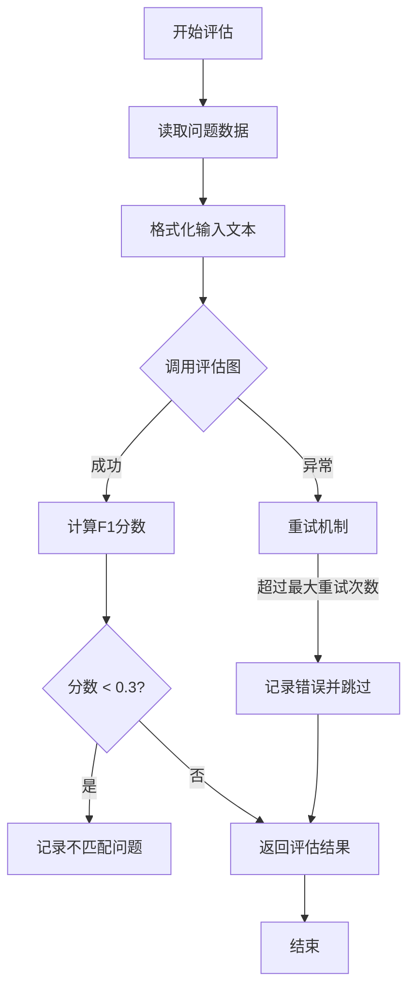
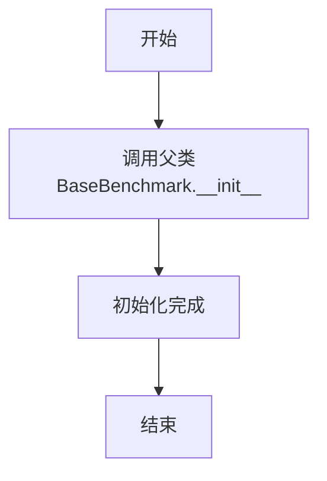
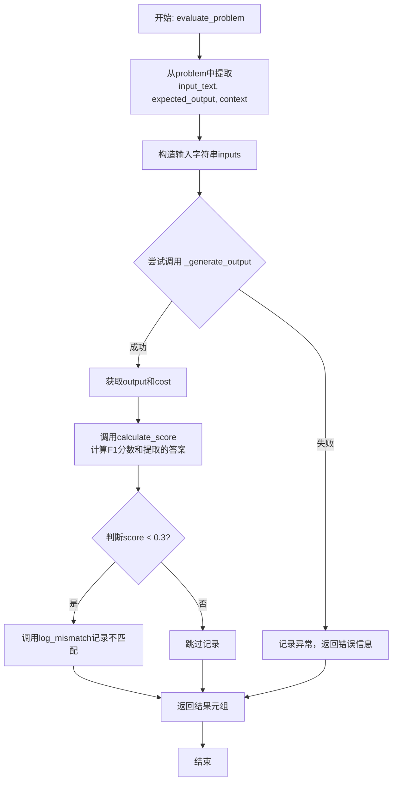
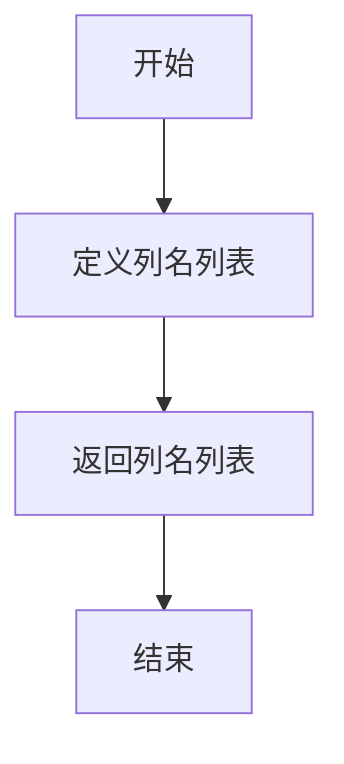

# `.\MetaGPT\metagpt\ext\aflow\benchmark\hotpotqa.py` 详细设计文档

该代码实现了一个用于评估问答系统在HotpotQA数据集上性能的基准测试类。它通过计算模型预测答案与标准答案之间的F1分数来量化性能，并集成了重试机制、日志记录和错误处理，以支持对复杂推理流程的稳定评估。

## 整体流程



## 类结构

```
BaseBenchmark (抽象基类)
└── HotpotQABenchmark (HotpotQA基准测试类)
```

## 全局变量及字段


### `logger`
    
用于记录日志的全局日志记录器实例，来自metagpt.logs模块

类型：`Logger`
    


    

## 全局函数及方法

### `HotpotQABenchmark.__init__`

该方法用于初始化 `HotpotQABenchmark` 类的实例，继承自 `BaseBenchmark` 基类，并设置基准测试的名称、数据文件路径和日志文件路径。

参数：

- `name`：`str`，基准测试的名称。
- `file_path`：`str`，包含基准测试问题数据文件的路径。
- `log_path`：`str`，用于记录不匹配或错误信息的日志文件路径。

返回值：`None`，此方法为构造函数，不返回任何值。

#### 流程图



#### 带注释源码

```python
def __init__(self, name: str, file_path: str, log_path: str):
    # 调用父类 BaseBenchmark 的构造函数，传递名称、文件路径和日志路径
    super().__init__(name, file_path, log_path)
```


### `HotpotQABenchmark.normalize_answer`

该方法用于对答案字符串进行标准化处理，通过一系列文本清理步骤（包括转换为小写、移除标点、移除冠词、修复空白字符）来统一文本格式，以便后续进行准确的文本比较和评分。

参数：

-  `s`：`str`，需要被标准化的原始答案字符串。

返回值：`str`，经过标准化处理后的字符串。

#### 流程图

```mermaid
flowchart TD
    A[开始: 输入字符串 s] --> B[调用 lower(s) 转换为小写]
    B --> C[调用 remove_punc 移除标点符号]
    C --> D[调用 remove_articles 移除冠词]
    D --> E[调用 white_space_fix 修复空白字符]
    E --> F[返回标准化后的字符串]
```

#### 带注释源码

```python
def normalize_answer(self, s: str) -> str:
    # 定义内部函数：移除冠词（a, an, the）
    def remove_articles(text):
        return re.sub(r"\b(a|an|the)\b", " ", text)

    # 定义内部函数：修复空白字符，将多个空白字符规范化为单个空格
    def white_space_fix(text):
        return " ".join(text.split())

    # 定义内部函数：移除所有标点符号
    def remove_punc(text):
        exclude = set(string.punctuation)
        return "".join(ch for ch in text if ch not in exclude)

    # 定义内部函数：将文本转换为小写
    def lower(text):
        return text.lower()

    # 按顺序执行标准化步骤：小写 -> 去标点 -> 去冠词 -> 修复空白
    return white_space_fix(remove_articles(remove_punc(lower(s))))
```


### `HotpotQABenchmark.calculate_score`

该方法用于计算模型预测答案与标准答案之间的F1分数，以评估问答任务的准确性。它首先对答案进行标准化处理（如小写转换、去除标点等），然后基于词级别的精确率（Precision）和召回率（Recall）计算F1分数。

参数：

- `ground_truth`：`str`，标准答案字符串
- `prediction`：`str`，模型预测的答案字符串

返回值：`Tuple[float, str]`，返回一个元组，包含计算出的F1分数（float）和经过标准化处理的预测答案字符串（str）

#### 流程图

```mermaid
flowchart TD
    A[开始] --> B[标准化预测答案<br>prediction]
    A --> C[标准化标准答案<br>ground_truth]
    B --> D[将标准化后的答案<br>分词为token列表]
    C --> E[将标准化后的答案<br>分词为token列表]
    D --> F[计算两个token列表的<br>词频交集]
    E --> F
    F --> G{交集数量<br>num_same == 0?}
    G -- 是 --> H[返回 (0, prediction)]
    G -- 否 --> I[计算精确率<br>precision = num_same / len(prediction_tokens)]
    I --> J[计算召回率<br>recall = num_same / len(ground_truth_tokens)]
    J --> K[计算F1分数<br>f1 = 2 * precision * recall / (precision + recall)]
    K --> L[返回 (f1, prediction)]
    H --> M[结束]
    L --> M
```

#### 带注释源码

```python
def calculate_score(self, ground_truth: str, prediction: str) -> Tuple[float, str]:
    # 1. 对预测答案进行标准化处理（小写、去标点、去停用词等），并分词
    prediction_tokens = self.normalize_answer(prediction).split()
    # 2. 对标准答案进行同样的标准化处理和分词
    ground_truth_tokens = self.normalize_answer(ground_truth).split()
    
    # 3. 使用Counter计算两个token列表的词频，并取交集
    #    交集结果是一个Counter，其值表示每个共同token在两个列表中出现的较小次数
    common = Counter(prediction_tokens) & Counter(ground_truth_tokens)
    # 4. 计算所有共同token的总出现次数（交集的大小）
    num_same = sum(common.values())
    
    # 5. 如果没有任何共同token，则F1分数为0
    if num_same == 0:
        return 0, prediction
    
    # 6. 计算精确率：共同token数 / 预测答案token总数
    precision = 1.0 * num_same / len(prediction_tokens)
    # 7. 计算召回率：共同token数 / 标准答案token总数
    recall = 1.0 * num_same / len(ground_truth_tokens)
    # 8. 计算F1分数：2 * 精确率 * 召回率 / (精确率 + 召回率)
    f1 = (2 * precision * recall) / (precision + recall)
    
    # 9. 返回F1分数和原始的预测答案字符串
    return f1, prediction
```

### `HotpotQABenchmark._generate_output`

该方法是一个异步方法，用于执行重试逻辑，调用传入的 `graph` 函数来处理输入的文本，并返回其输出。它通过 `tenacity` 库实现了在遇到异常时的自动重试机制。

参数：
- `graph`：`Callable`，一个可调用对象（通常是异步函数），用于处理输入文本并生成输出。
- `input_text`：`str`，需要处理的输入文本。

返回值：`Any`，返回 `graph` 函数处理 `input_text` 后的输出结果。

#### 流程图

```mermaid
flowchart TD
    A[开始] --> B{调用 graph(input_text)};
    B --> C{是否成功?};
    C -- 是 --> D[返回结果];
    C -- 否<br>发生异常 --> E{重试次数 < 5?};
    E -- 是 --> F[等待1秒];
    F --> B;
    E -- 否 --> G[抛出异常];
```

#### 带注释源码

```python
@retry(stop=stop_after_attempt(5), wait=wait_fixed(1), retry=retry_if_exception_type(Exception), reraise=True)
async def _generate_output(self, graph, input_text):
    # 使用 tenacity 装饰器实现重试逻辑：
    # stop=stop_after_attempt(5): 最多重试5次
    # wait=wait_fixed(1): 每次重试前等待1秒
    # retry=retry_if_exception_type(Exception): 当发生任何 Exception 及其子类异常时重试
    # reraise=True: 重试次数用尽后，重新抛出最后的异常
    return await graph(input_text) # 异步调用 graph 函数并返回其结果
```

### `HotpotQABenchmark.evaluate_problem`

该方法用于评估一个给定的问答问题。它接收一个问题字典和一个图计算函数，构造输入文本，调用图计算函数生成预测答案，然后通过计算F1分数将预测答案与标准答案进行比较，最后记录评估结果。如果F1分数低于阈值（0.3），则记录不匹配的案例。

参数：
- `problem`：`dict`，包含问题、上下文和标准答案的字典。
- `graph`：`Callable`，一个可调用的图计算函数，用于根据输入文本生成答案。

返回值：`Tuple[str, str, str, str, float, float]`，返回一个包含问题文本、上下文字符串、模型输出、标准答案、F1分数和计算成本的元组。

#### 流程图



#### 带注释源码

```python
async def evaluate_problem(self, problem: dict, graph: Callable) -> Tuple[str, str, str, str, float, float]:
    # 从问题字典中提取问题文本、标准答案和上下文段落
    input_text = problem["question"]
    expected_output = problem["answer"]
    paragraphs = [item[1] for item in problem["context"] if isinstance(item[1], list)]
    # 将上下文段落列表连接成一个字符串
    context_str = "\n".join(" ".join(paragraph) for paragraph in paragraphs)
    # 构造最终的输入字符串，包含上下文、问题和答案提示
    inputs = f"Context: {context_str}\n\nQuestion: {input_text}\n\nAnswer:"

    try:
        # 调用带有重试机制的图计算函数，生成答案并获取计算成本
        output, cost = await self._generate_output(graph, inputs)
        # 计算预测答案与标准答案之间的F1分数，并获取处理后的预测文本
        score, extracted_output = self.calculate_score(expected_output, output)

        # 如果F1分数低于阈值（0.3），则记录不匹配的案例
        if (
            score < 0.3
        ):  # We set the threshold for collecting incorrect questions to 0.3, as F1 Score cannot be simply judged using 0-1
            self.log_mismatch(input_text, expected_output, output, extracted_output)

        # 返回评估结果：问题、上下文、模型输出、标准答案、分数、成本
        return input_text, context_str, output, expected_output, score, cost

    except Exception as e:
        # 如果重试后仍然失败，记录错误并返回默认值
        logger.info(f"Maximum retries reached. Skipping this sample. Error: {e}")
        return input_text, context_str, str(e), expected_output, 0.0, 0.0
```

### `HotpotQABenchmark.get_result_columns`

该方法用于定义并返回评估结果数据集的列名列表。这些列名对应着 `evaluate_problem` 方法返回的元组中的各个元素，确保了结果数据结构的清晰和一致性。

参数：
- `self`：`HotpotQABenchmark`，当前 `HotpotQABenchmark` 类的实例。

返回值：`List[str]`，一个包含六个字符串的列表，分别代表结果数据集的列名：`"question"`, `"context"`, `"prediction"`, `"expected_output"`, `"score"`, `"cost"`。

#### 流程图



#### 带注释源码

```python
def get_result_columns(self) -> List[str]:
    # 返回一个固定的字符串列表，定义了评估结果数据集的列结构。
    # 这些列名与 `evaluate_problem` 方法返回的元组顺序一一对应：
    # 问题、上下文、模型预测、期望答案、F1分数、计算成本。
    return ["question", "context", "prediction", "expected_output", "score", "cost"]
```

## 关键组件


### 文本规范化组件 (`normalize_answer` 方法)

提供了一套文本预处理流程，用于在计算答案相似度前对字符串进行标准化处理，包括转换为小写、移除标点、移除冠词和规范化空白字符。

### 答案评分组件 (`calculate_score` 方法)

基于F1分数计算预测答案与标准答案之间的相似度，通过词袋模型（Bag-of-Words）和词频统计（Counter）来评估答案的重合度。

### 异步执行与重试组件 (`_generate_output` 方法)

封装了异步图（`graph`）的调用逻辑，并集成了基于`tenacity`库的重试机制，以增强在临时性异常下的操作鲁棒性。

### 问题评估流程组件 (`evaluate_problem` 方法)

定义了完整的单问题评估流程：从原始问题数据中构建输入提示（`inputs`），调用模型获取预测输出，计算F1分数，并根据阈值记录不匹配的案例。

### 结果列定义组件 (`get_result_columns` 方法)

定义了评估结果数据集的列结构，确保评估结果输出的格式统一和可读性。


## 问题及建议


### 已知问题

-   **F1分数阈值设定过于主观且缺乏依据**：代码中硬编码了`score < 0.3`作为判断答案是否错误的阈值。这个值（0.3）的选择缺乏理论或实验依据，可能无法准确反映模型的实际表现。对于不同难度或类型的问题，合适的阈值可能不同。
-   **答案归一化函数存在潜在缺陷**：`normalize_answer`函数通过移除所有标点符号和停用词（a, an, the）来简化文本比较。这种方法虽然简单，但可能导致信息丢失或误判。例如，移除所有标点可能使“Let‘s eat, Grandma.”和“Lets eat Grandma”被判定为相同，而语义完全不同。此外，移除“the”等词在某些语境下（如“The Who”乐队名）也会导致错误。
-   **重试机制可能掩盖根本问题**：`_generate_output`方法使用`@retry`装饰器，对任何`Exception`都进行最多5次重试。虽然这提高了鲁棒性，但也可能掩盖了代码或数据中存在的系统性、非暂时性问题（如逻辑错误、数据格式错误），导致程序在多次失败后简单地跳过样本，而没有提供足够的信息来诊断和修复根本原因。
-   **上下文构建逻辑可能不健壮**：在`evaluate_problem`方法中，构建`context_str`的逻辑依赖于`problem["context"]`中每个子项的第二项（`item[1]`）是列表类型。如果数据结构不符合预期（例如，`item[1]`不是列表，或者`problem["context"]`的结构发生变化），此代码将静默地忽略这些项或引发错误，导致上下文信息不完整。
-   **异常处理信息粒度不足**：当`_generate_output`重试耗尽后，异常被捕获并记录一条日志，但返回的错误信息仅为`str(e)`。这丢失了异常的详细类型、堆栈跟踪等关键调试信息，不利于问题定位。

### 优化建议

-   **将阈值参数化或采用更科学的评估策略**：建议将`0.3`这个阈值作为可配置参数（如`__init__`中的`error_threshold`），允许根据不同任务进行调整。更好的做法是，不依赖单一阈值，而是记录所有样本的详细分数分布，后续进行统计分析，或者实现更灵活的评估策略（如根据分数区间分类）。
-   **改进答案归一化方法**：考虑使用更先进的文本规范化技术，例如基于词干提取（stemming）或词形还原（lemmatization）的方法，以更好地处理同义词和不同词形。对于标点符号，可以考虑只移除影响较小的标点，或者使用更语义化的比较方式（如基于嵌入向量的相似度计算作为F1分数的补充或替代）。
-   **优化重试策略和错误处理**：
    1.  将重试条件限定为更具体的异常类型（如网络超时、特定API错误），而非通用的`Exception`。
    2.  在重试失败后，除了记录简要信息，还应将更详细的异常信息（如类型、堆栈跟踪）记录到日志或作为返回结果的一部分，以便于调试。
    3.  考虑区分暂时性错误和永久性错误，对于后者（如输入数据格式错误）应尽早失败并给出明确提示。
-   **增强上下文构建的健壮性**：在构建`context_str`之前，添加数据验证步骤。例如，检查`problem["context"]`的结构，使用`isinstance`进行更严格的类型检查，或者使用`try...except`来优雅地处理不符合预期的数据格式，并记录警告。
-   **丰富返回信息和日志记录**：在`evaluate_problem`方法中，当发生异常时，除了返回错误字符串，还可以考虑返回一个特殊的标记（如`None`）或一个包含错误详情的字典。同时，提升日志级别（如使用`logger.error`或`logger.exception`）并记录更多上下文信息（如问题ID、输入文本等），以方便问题追踪。
-   **考虑性能优化**：`normalize_answer`和`calculate_score`函数在每次评估时都会被调用。如果评估数据集很大，这些字符串操作和`Counter`计算可能成为性能瓶颈。可以考虑对`normalize_answer`函数进行性能剖析（profiling），或者对于已知的、不变的标准答案，预先计算其归一化后的词频计数器。


## 其它


### 设计目标与约束

该代码旨在为HotpotQA数据集提供一个基准测试（Benchmark）实现，用于评估图（graph）处理模型在问答任务上的性能。核心设计目标包括：1) 提供标准化的答案评估方法（基于F1分数）；2) 支持异步模型调用与重试机制以提高鲁棒性；3) 记录评估过程中的详细信息（如问题、上下文、预测、成本）以便分析。主要约束包括：依赖于特定的输入数据格式（包含`question`、`answer`、`context`字段的字典）；评估逻辑（如F1阈值0.3）与日志记录路径由父类`BaseBenchmark`定义或初始化参数决定。

### 错误处理与异常设计

代码通过`tenacity`库的`@retry`装饰器实现了针对`_generate_output`方法的重试机制，当发生任何`Exception`时，最多重试5次，每次间隔1秒。若重试耗尽仍失败，则在`evaluate_problem`方法中捕获异常，记录日志，并返回错误信息作为预测结果，同时将分数和成本设为0.0。这种设计确保了单个问题评估失败不会导致整个基准测试进程中断，同时通过日志记录了失败详情。然而，异常处理粒度较粗，所有异常类型均触发重试，可能包括本不应重试的错误（如逻辑错误）。

### 数据流与状态机

数据流始于`evaluate_problem`方法接收一个`problem`字典和`graph`可调用对象。`problem`中的数据被提取并格式化为包含上下文和问题的`inputs`字符串。该字符串被传递给`_generate_output`方法，后者异步调用`graph`函数并返回`output`和`cost`。`output`与`problem`中的`expected_output`一同送入`calculate_score`方法进行标准化和F1分数计算。根据分数是否低于阈值0.3，决定是否调用`log_mismatch`（来自父类）记录不匹配案例。最终，所有相关数据（问题、上下文、预测输出、期望输出、分数、成本）被组装并返回。整个过程是无状态的，每个问题的评估相互独立。

### 外部依赖与接口契约

1.  **继承依赖**：继承自`metagpt.ext.aflow.benchmark.benchmark.BaseBenchmark`，依赖其定义的`__init__`、`log_mismatch`等方法及可能的`name`、`file_path`、`log_path`属性。
2.  **库依赖**：
    *   `tenacity`: 用于实现重试逻辑。
    *   `re`, `string`, `collections.Counter`: 用于答案文本的标准化处理和F1计算。
    *   `metagpt.logs.logger`: 用于记录错误信息。
3.  **接口契约**：
    *   `graph`参数 (`Callable`): 必须是一个可异步调用的对象，接受一个字符串输入，并返回一个元组 `(output_str, cost_float)`。
    *   `problem`参数 (`dict`): 必须包含键`"question"`（字符串）、`"answer"`（字符串）和`"context"`（列表，其元素为元组，第二个元素是字符串列表表示的段落）。
4.  **数据契约**：`get_result_columns`方法定义了评估结果应包含的列名，这约束了`evaluate_problem`返回值的顺序和含义，也暗示了结果可能被用于组装成表格（如pandas DataFrame）进行后续分析。

    