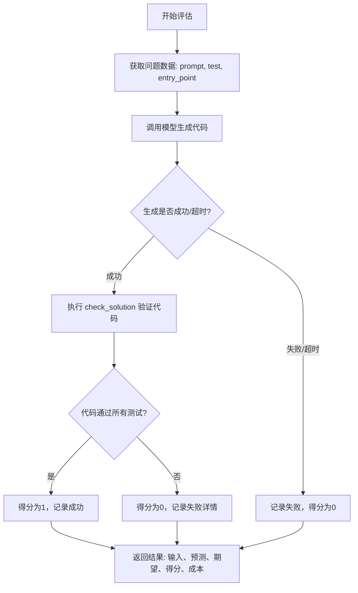
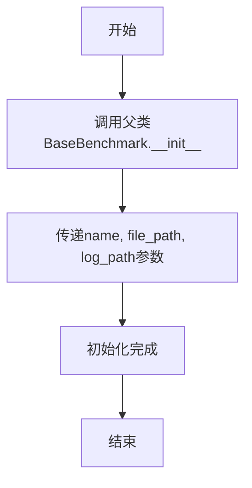
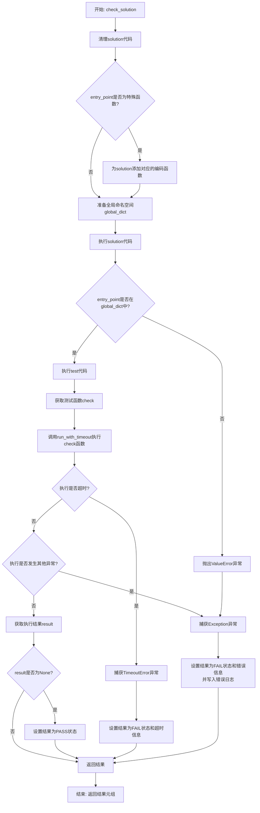
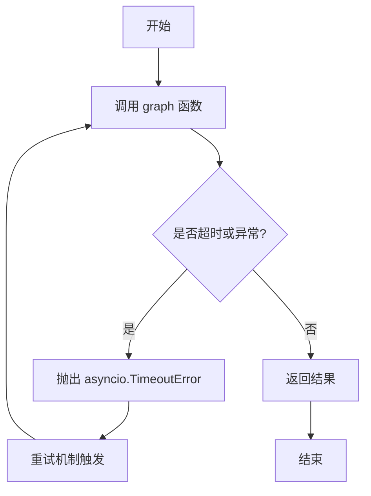
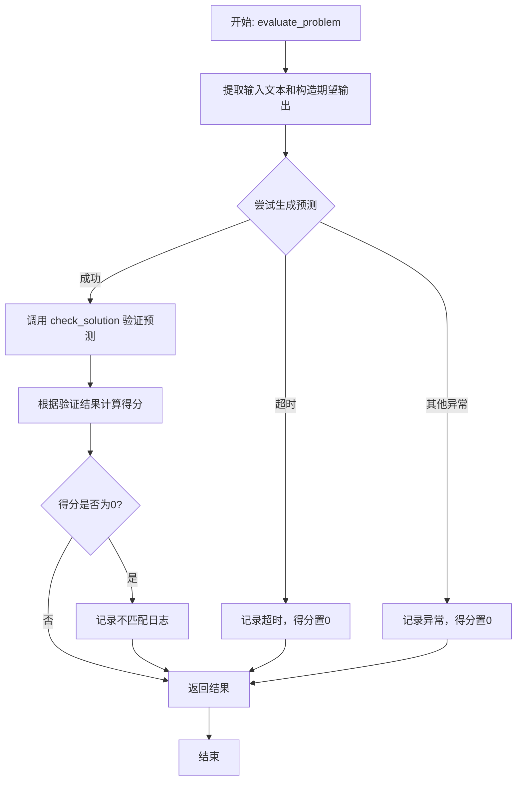
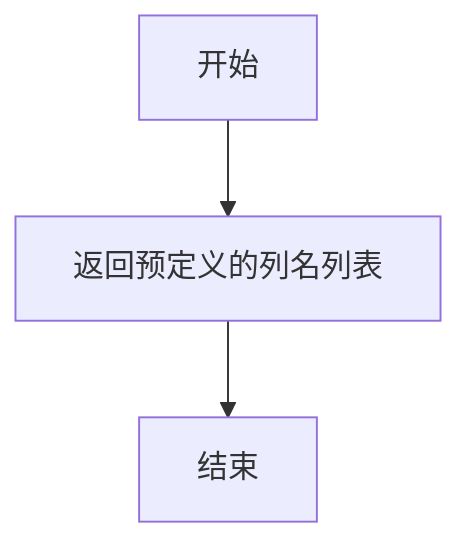

# `.\MetaGPT\metagpt\ext\aflow\benchmark\humaneval.py` 详细设计文档

该代码实现了一个名为 HumanEvalBenchmark 的基准测试类，专门用于评估代码生成模型在 HumanEval 数据集上的表现。其核心功能是：接收一个代码生成模型（通过 graph 函数调用），针对 HumanEval 数据集中的每个编程问题，生成代码解决方案，然后通过动态执行和测试来验证生成代码的正确性，并计算得分和成本。

## 整体流程



## 类结构

```
BaseBenchmark (抽象基类)
└── HumanEvalBenchmark (HumanEval基准测试实现类)
    ├── TimeoutError (内部异常类)
    ├── __init__ (构造函数)
    ├── run_with_timeout (带超时的函数执行)
    ├── check_solution (验证解决方案)
    ├── _generate_output (带重试和超时的模型调用)
    ├── evaluate_problem (评估单个问题)
    ├── calculate_score (计算得分 - 接口占位)
    └── get_result_columns (获取结果列名)
```

## 全局变量及字段


### `HumanEvalBenchmark.name`
    
基准测试的名称，用于标识不同的测试实例。

类型：`str`
    


### `HumanEvalBenchmark.file_path`
    
基准测试数据文件的路径，用于加载测试用例。

类型：`str`
    


### `HumanEvalBenchmark.log_path`
    
日志文件的路径，用于记录测试过程中的错误和结果。

类型：`str`
    
    

## 全局函数及方法

### `HumanEvalBenchmark.__init__`

初始化 `HumanEvalBenchmark` 类的实例，继承自 `BaseBenchmark` 并设置基准测试的名称、文件路径和日志路径。

参数：

- `name`：`str`，基准测试的名称
- `file_path`：`str`，基准测试数据文件的路径
- `log_path`：`str`，日志文件的路径

返回值：`None`，无返回值

#### 流程图



#### 带注释源码

```python
def __init__(self, name: str, file_path: str, log_path: str):
    # 调用父类BaseBenchmark的初始化方法，传递名称、文件路径和日志路径参数
    super().__init__(name, file_path, log_path)
```

### `HumanEvalBenchmark.run_with_timeout`

该方法用于在指定的超时时间内执行一个给定的函数。它通过创建一个独立的线程来运行目标函数，并使用事件（Event）机制来监控执行状态。如果在超时时间内函数未执行完毕，则会抛出`TimeoutError`异常；如果函数执行过程中抛出异常，该方法会重新抛出该异常；如果函数正常执行完毕，则返回其结果。

参数：

- `func`：`Callable`，需要被执行的函数或可调用对象。
- `args`：`tuple`，传递给`func`的参数元组。
- `timeout`：`int` 或 `float`，允许函数执行的最大时间（秒）。

返回值：`Any`，目标函数`func`的执行结果。如果函数执行超时，则抛出`TimeoutError`；如果函数执行中抛出异常，则重新抛出该异常。

#### 流程图

```mermaid
flowchart TD
    A[开始: run_with_timeout(func, args, timeout)] --> B[初始化结果列表 result<br>和停止事件 stop_event]
    B --> C[定义目标函数 target<br>在线程中执行 func(*args)]
    C --> D[启动线程执行 target]
    D --> E{等待 stop_event 或超时?}
    E -- 超时 --> F[抛出 TimeoutError]
    E -- 事件被设置 --> G[检查 result 列表]
    G --> H{result 是否为空?}
    H -- 是 --> I[返回 None]
    H -- 否 --> J{result[0] 是否为异常?}
    J -- 是 --> K[抛出 result[0] 异常]
    J -- 否 --> L[返回 result[0]]
```

#### 带注释源码

```python
def run_with_timeout(self, func, args, timeout):
    # 初始化一个列表用于存储函数执行结果或异常
    result = []
    # 创建一个线程事件，用于同步线程执行状态
    stop_event = threading.Event()

    # 定义在线程中执行的目标函数
    def target():
        try:
            # 执行传入的函数，并将结果存入 result 列表
            result.append(func(*args))
        except Exception as e:
            # 如果执行过程中发生异常，将异常对象存入 result 列表
            result.append(e)
        finally:
            # 无论成功或失败，都设置事件，通知主线程执行结束
            stop_event.set()

    # 创建并启动一个线程来执行 target 函数
    thread = threading.Thread(target=target)
    thread.start()
    # 主线程等待 stop_event 被设置，最多等待 timeout 秒
    # 如果超时前事件被设置，is_timeout 为 False；否则为 True
    is_timeout = not stop_event.wait(timeout)

    # 如果超时，抛出自定义的 TimeoutError 异常
    if is_timeout:
        raise self.TimeoutError("Function execution timed out")

    # 检查 result 列表是否为空（理论上不会，因为 target 总会 append）
    if not result:
        return None
    # 如果 result 的第一个元素是异常实例，则重新抛出该异常
    if isinstance(result[0], Exception):
        raise result[0]
    # 否则，返回函数的正常执行结果
    return result[0]
```

### `HumanEvalBenchmark.check_solution`

该方法用于评估一个给定的代码解决方案（`solution`）是否能够通过指定的测试用例（`test`）。它首先对解决方案代码进行清理和预处理，然后在一个受控的全局命名空间中执行该代码和测试代码，最后调用测试函数来验证解决方案的正确性。整个过程包含超时控制和异常处理，以确保评估的健壮性。

参数：

- `solution`：`str`，待评估的解决方案代码字符串。
- `test`：`str`，用于测试解决方案的测试代码字符串。
- `entry_point`：`str`，解决方案中需要测试的目标函数名称。

返回值：`tuple`，返回一个元组，包含两个元素。第一个元素是评估结果状态（`self.PASS` 或 `self.FAIL`），第二个元素是详细的描述信息（例如，通过信息、错误信息或超时信息）。

#### 流程图



#### 带注释源码

```python
def check_solution(self, solution, test, entry_point):
    # 1. 清理解决方案代码，确保其格式正确且安全
    solution = sanitize(code=solution, entrypoint=entry_point)
    try:
        # 2. 准备一个全局命名空间，包含常用的Python模块和类型
        global_dict = {
            "math": __import__("math"),
            "hashlib": __import__("hashlib"),
            "re": __import__("re"),
            "List": List,
            "Dict": Dict,
            "Tuple": Tuple,
            "Optional": Optional,
            "Any": Any,
        }

        # 3. 处理特殊函数：为某些解码函数添加对应的编码函数定义
        if entry_point == "decode_cyclic":
            solution = (
                '\n\ndef encode_cyclic(s: str):\n    """\n    returns encoded string by cycling groups of three characters.\n    """\n    # split string to groups. Each of length 3.\n    groups = [s[(3 * i):min((3 * i + 3), len(s))] for i in range((len(s) + 2) // 3)]\n    # cycle elements in each group. Unless group has fewer elements than 3.\n    groups = [(group[1:] + group[0]) if len(group) == 3 else group for group in groups]\n    return "".join(groups)'
                + "\n\n"
                + solution
            )
        elif entry_point == "decode_shift":
            solution = (
                '\n\ndef encode_shift(s: str):\n    """\n    returns encoded string by shifting every character by 5 in the alphabet.\n    """\n    return "".join([chr(((ord(ch) + 5 - ord("a")) % 26) + ord("a")) for ch in s])\n\n\n'
                + solution
            )
        elif entry_point == "find_zero":
            solution = (
                "\n\ndef poly(xs: list, x: float):\n    return sum(coeff * (x ** i) for i, coeff in enumerate(xs))\n\n"
                + solution
            )

        # 4. 在准备好的全局命名空间中执行解决方案代码
        exec(solution, global_dict)

        # 5. 验证目标函数（entry_point）是否在全局命名空间中定义
        if entry_point not in global_dict:
            raise ValueError(f"Function {entry_point} is not defined in the solution.")

        # 6. 在同一个全局命名空间中执行测试代码
        exec(test, global_dict)

        # 7. 从全局命名空间中获取测试函数 `check`
        check = global_dict["check"]

        # 8. 使用超时机制运行测试函数 `check`，传入目标函数作为参数
        result = self.run_with_timeout(check, (global_dict[entry_point],), 15)

        # 9. 如果测试函数返回None，则视为通过
        if result is None:
            result = (self.PASS, "The solution passed all test cases.")

    # 10. 处理执行超时异常
    except self.TimeoutError:
        result = (
            self.FAIL,
            "Execution timed out. Please check if your solution contains infinite loops or overly time-consuming operations.",
        )
    # 11. 处理其他所有异常
    except Exception as e:
        error_message = f"Error: {str(e)}.\n Solution: {solution}.\n Test: {test}"
        result = (self.FAIL, error_message)

        # 12. 将错误信息记录到日志文件中
        with open("error.log", "a", encoding="utf-8") as log_file:
            log_file.write(f"{time.strftime('%Y-%m-%d %H:%M:%S')} - {error_message}\n")

    # 13. 返回评估结果（状态， 描述信息）
    return result
```

### `HumanEvalBenchmark._generate_output`

该方法是一个异步方法，用于执行给定的图（graph）函数以生成输出，并设置了60秒的超时限制。它使用了`tenacity`库的`@retry`装饰器，在遇到异常时会自动重试最多5次，每次重试间隔1秒。

参数：

- `graph`：`Callable`，一个可调用对象（通常是异步函数），用于根据提示和入口点生成预测结果。
- `prompt`：`str`，输入提示文本，用于指导图函数生成代码解决方案。
- `entry_point`：`str`，入口点函数名，用于标识需要生成的函数。

返回值：`Any`，返回图函数执行的结果，通常是生成的代码预测及其相关成本。

#### 流程图



#### 带注释源码

```python
@retry(stop=stop_after_attempt(5), wait=wait_fixed(1), retry=retry_if_exception_type(Exception), reraise=True)
async def _generate_output(self, graph, prompt, entry_point):
    # 使用 asyncio.wait_for 设置 60 秒超时，调用 graph 函数生成输出
    return await asyncio.wait_for(graph(prompt, entry_point), timeout=60)
```

### `HumanEvalBenchmark.evaluate_problem`

该方法用于评估一个给定编程问题（HumanEval数据集中的一个样本）的解决方案。它接收一个问题数据字典和一个图（graph）函数，使用图函数生成代码预测，然后通过执行测试用例来验证预测代码的正确性。最终，它返回输入、预测、期望输出、得分和成本。

参数：

- `data`：`dict`，包含评估所需数据的字典，键包括 `"prompt"`（问题描述）、`"entry_point"`（目标函数名）、`"test"`（测试代码）、`"canonical_solution"`（标准答案）。
- `graph`：`Callable`，一个可调用对象（通常是异步函数），用于根据输入提示和入口点生成代码预测和成本。

返回值：`Tuple[str, str, str, float, float]`，返回一个元组，包含输入文本、预测代码、期望输出（包含测试详情和标准答案）、得分（1.0 表示通过，0.0 表示失败）和成本。

#### 流程图



#### 带注释源码

```python
async def evaluate_problem(self, data: dict, graph: Callable) -> Tuple[str, str, str, float, float]:
    # 从数据中提取问题描述作为输入文本
    input_text = data["prompt"]
    # 构造期望输出字符串，包含标准答案
    expected_output = (
        "\nCorrect Solution:\ndef "
        + data["entry_point"]
        + "(params you should put here):"
        + "\n\n"
        + data["canonical_solution"]
    )

    try:
        # 调用内部方法生成代码预测和成本，带有重试和超时机制
        prediction, cost = await self._generate_output(graph, input_text, data["entry_point"])

        # 使用 check_solution 方法执行测试，验证预测代码的正确性
        ret = self.check_solution(prediction, data["test"], data["entry_point"])
        # 获取测试的详细结果（通过信息或错误信息）
        test_case_details = ret[1]
        # 将测试详情拼接到期望输出中
        expected_output = test_case_details + expected_output

        # 根据检查结果计算得分：如果状态为 PASS 则得1分，否则得0分
        score = 1.0 if ret[0] == self.PASS else 0.0

        # 如果得分为0（即测试失败），记录不匹配的详细信息到日志
        if score == 0:
            self.log_mismatch(input_text, expected_output, prediction, score)

        # 返回评估结果：输入、预测、期望输出、得分、成本
        return input_text, prediction, expected_output, score, cost

    # 处理生成预测时的超时异常
    except asyncio.TimeoutError:
        logger.info("Timeout error. Skipping this sample.")
        return input_text, "Timeout", expected_output, 0.0, 0.0

    # 处理其他所有异常（包括重试耗尽后的异常）
    except Exception as e:
        logger.info(f"Maximum retries reached. Skipping this sample. Error: {e}")
        return input_text, str(e), expected_output, 0.0, 0.0
```

### `HumanEvalBenchmark.calculate_score`

该方法用于计算给定预测输出与期望输出之间的分数。然而，根据代码注释，HumanEval 的评分逻辑已在 `evaluate_problem` 方法中实现，此方法仅是为了符合接口规范而存在，因此它实际上不执行任何评分计算，直接返回默认值。

参数：

- `expected_output`：`str`，期望的输出字符串，通常包含正确的解决方案。
- `prediction`：`str`，模型生成的预测输出字符串。

返回值：`Tuple[float, str]`，返回一个元组，其中第一个元素是分数（始终为 0.0），第二个元素是预测输出字符串。

#### 流程图

```mermaid
graph TD
    A[开始] --> B[接收参数 expected_output 和 prediction]
    B --> C[返回元组 (0.0, prediction)]
    C --> D[结束]
```

#### 带注释源码

```python
def calculate_score(self, expected_output: str, prediction: str) -> Tuple[float, str]:
    # The scoring logic for HumanEval is already implemented in evaluate_problem, this is just to conform to the interface
    # HumanEval 的评分逻辑已在 evaluate_problem 方法中实现，此方法仅是为了符合接口规范
    return 0.0, prediction  # 直接返回默认分数 0.0 和预测输出
```

### `HumanEvalBenchmark.get_result_columns`

该方法用于定义并返回评估结果数据集的列名列表。它不执行任何计算或逻辑处理，仅提供一个静态的、预定义的列名集合，用于后续存储和展示评估结果。

参数：
- 无

返回值：`List[str]`，一个包含字符串的列表，表示结果数据集中各列的名称。

#### 流程图



#### 带注释源码

```python
def get_result_columns(self) -> List[str]:
    # 返回一个固定的字符串列表，定义了评估结果数据表的列结构。
    # 这些列名用于存储和标识每个评估样本的输入、模型输出、期望输出、得分和成本。
    return ["inputs", "prediction", "expected_output", "score", "cost"]
```

## 关键组件


### 超时执行与线程管理

通过 `run_with_timeout` 方法，利用独立的线程和事件机制，为代码执行（特别是测试用例）设置时间限制，防止无限循环或耗时操作阻塞主流程。

### 代码净化与执行环境构建

通过 `sanitize` 函数和动态构建 `global_dict`，为待评估的代码片段创建一个安全、可控的执行环境，并注入必要的标准库和类型模块。

### 特殊函数处理

针对特定函数名（如 `decode_cyclic`, `decode_shift`, `find_zero`），在待测代码前动态注入其依赖的辅助函数定义，确保测试用例能够正确执行。

### 异步重试机制

通过 `tenacity` 库的 `@retry` 装饰器，为 `_generate_output` 方法（调用外部 `graph` 函数生成预测）实现了带重试策略的异步调用，增强了在临时性故障下的鲁棒性。

### 基准测试评估流程

`evaluate_problem` 方法定义了完整的评估流程：生成预测、执行测试、计算得分、记录不匹配结果，并统一处理超时和异常情况，是 `HumanEvalBenchmark` 的核心业务逻辑。


## 问题及建议


### 已知问题

-   **线程安全与资源管理**：`run_with_timeout` 方法使用 `threading` 模块创建新线程来执行代码，但未妥善处理线程的终止。当函数执行超时后，主线程虽然会抛出 `TimeoutError`，但子线程仍在后台运行，可能导致资源泄漏或不可预知的行为（例如，如果被执行的函数修改了共享状态）。
-   **全局命名空间污染与安全风险**：`check_solution` 方法使用 `exec` 执行用户提供的代码（`solution` 和 `test`），并预置了 `global_dict`。虽然导入了部分安全模块，但 `exec` 本身具有极高的安全风险。恶意或错误的代码可能执行危险操作（如删除文件、无限循环、占用大量内存），或通过 `__import__` 等方式引入其他危险模块，存在严重的安全漏洞。
-   **硬编码的特殊情况处理**：`check_solution` 方法中针对 `decode_cyclic`, `decode_shift`, `find_zero` 等特定 `entry_point` 进行了硬编码的解决方案修补。这种做法缺乏扩展性，当需要支持新的、具有依赖关系的函数时，需要修改此核心方法，违反了开闭原则。
-   **错误日志记录路径硬编码**：在 `check_solution` 方法的异常处理中，错误信息被写入一个名为 `"error.log"` 的硬编码文件路径。这缺乏灵活性，且在多进程或多实例运行环境下可能导致日志写入冲突或信息丢失。
-   **接口不一致**：`calculate_score` 方法被声明为用于计算分数，但其实现仅返回 `0.0` 和 `prediction`，实际的评分逻辑在 `evaluate_problem` 中完成。这造成了接口的误导和冗余，`calculate_score` 方法在当前上下文中似乎没有实际作用。
-   **超时机制的双重性与混淆**：代码中存在两套超时机制：1) `_generate_output` 方法使用 `asyncio.wait_for` 对 `graph` 调用设置60秒超时；2) `check_solution` 内部的 `run_with_timeout` 对测试执行设置15秒超时。这种分层是合理的，但 `run_with_timeout` 的实现（使用线程和 `Event`）在异步环境中可能不是最佳选择，且两处超时错误处理方式不同（一处返回 `"Timeout"`，另一处抛出 `TimeoutError`），可能造成处理逻辑的复杂化。

### 优化建议

-   **重构 `run_with_timeout` 或使用 `asyncio` 原生超时**：考虑使用 `asyncio.to_thread` 配合 `asyncio.wait_for` 来替代当前的 `threading` 方案，以更好地融入异步环境，并利用 `asyncio` 的 `CancelledError` 来更优雅地取消任务。如果必须保留线程，应在超时后尝试设置线程为守护线程或使用能强制终止线程的机制（需谨慎，因为强制终止线程可能不稳定），并确保线程对象被正确引用和清理。
-   **强化代码执行沙箱**：强烈建议使用更安全的代码执行环境来替代 `exec`，例如：
    -   使用 `ast` 模块解析并限制可用的语法节点。
    -   使用 `restrictedpython` 等沙箱工具。
    -   在独立的子进程（如通过 `multiprocessing`）中运行不可信代码，并严格限制其资源（CPU时间、内存、系统调用）。这是解决安全问题的根本途径。
-   **将特殊情况处理抽象为可配置策略**：将针对特定 `entry_point` 的解决方案修补逻辑提取出来，设计成可注册的策略模式或插件机制。例如，可以定义一个 `SolutionPreprocessor` 基类，然后通过配置文件或注册表来管理不同 `entry_point` 对应的预处理器。这样便于扩展和维护。
-   **配置化日志路径**：将错误日志的文件路径作为类初始化参数或从配置中读取，避免硬编码。同时，考虑使用更强大的日志库（如 Python 内置的 `logging` 模块）来管理日志级别、格式和输出目的地。
-   **重构或移除 `calculate_score` 方法**：重新审视 `BaseBenchmark` 基类的设计。如果 `calculate_score` 方法确实为接口所需但当前实现无意义，应更新其实现以反映真实的评分逻辑（即调用 `check_solution` 的结果）。或者，如果可能，修改基类接口，将评分逻辑完全整合到 `evaluate_problem` 中，消除这个冗余方法。
-   **统一并明确超时策略**：审查并明确两层超时的职责。确保 `run_with_timeout` 的实现与异步环境兼容。考虑将超时时间（如15秒和60秒）提取为可配置的类常量或初始化参数。在 `evaluate_problem` 中，对 `asyncio.TimeoutError` 和 `self.TimeoutError` 的处理可以进一步统一或明确区分其来源，使日志和错误信息更清晰。
-   **增加代码执行前的静态检查**：在 `exec` 执行前，可以对 `solution` 代码进行简单的静态分析，例如检查是否包含明显危险的字符串（如 `'__import__(\"os\")'`, `'eval'`, `'open'` 等），作为一道额外的安全过滤。
-   **改进 `global_dict` 的构建**：当前 `global_dict` 手动添加了部分类型和模块。可以考虑使用 `importlib.import_module` 动态导入，并提供一个更严格的白名单机制来控制可访问的模块和内置函数。


## 其它


### 设计目标与约束

1.  **功能目标**：实现一个针对 HumanEval 代码生成基准测试的评估器。核心功能是接收一个代码生成模型（`graph`），向其提供 HumanEval 数据集中的问题描述（`prompt`），获取生成的代码（`prediction`），并执行测试用例来验证代码的正确性。
2.  **性能目标**：确保评估过程稳定可靠。通过超时机制（`run_with_timeout`）防止单个测试用例执行时间过长或陷入死循环，通过重试机制（`@retry`）处理模型调用过程中的临时性失败。
3.  **安全约束**：由于需要动态执行生成的、不可信的代码，必须进行安全处理。使用 `sanitize` 函数对代码进行清理，并在受限的全局命名空间（`global_dict`）中执行，仅导入必要的标准库模块（如 `math`, `hashlib`, `re`）和类型提示，以降低安全风险。
4.  **接口约束**：继承自 `BaseBenchmark` 基类，需实现其定义的抽象接口（如 `evaluate_problem`, `calculate_score`, `get_result_columns`），确保与基准测试框架的兼容性。

### 错误处理与异常设计

1.  **超时异常 (`TimeoutError`)**：自定义异常，用于标识 `run_with_timeout` 方法中函数执行超时。在 `check_solution` 中被捕获，返回 `FAIL` 状态和超时提示信息。
2.  **执行时异常**：在 `exec` 执行生成的代码或测试代码时，可能抛出 `SyntaxError`, `NameError`, `TypeError` 等。这些异常在 `check_solution` 的 `try-except` 块中被捕获，记录错误详情（包括解决方案和测试代码）到 `error.log` 文件，并返回 `FAIL` 状态。
3.  **重试异常**：`_generate_output` 方法使用 `tenacity.retry` 装饰器。当 `graph` 函数调用因 `Exception` 失败时，会进行最多5次、间隔1秒的重试。若重试耗尽仍失败，异常会向上抛出，在 `evaluate_problem` 中被捕获，记录日志并返回零分。
4.  **异步超时 (`asyncio.TimeoutError`)**：`_generate_output` 方法使用 `asyncio.wait_for` 为 `graph` 调用设置60秒超时。超时异常在 `evaluate_problem` 中被捕获，记录为“Timeout”并返回零分。
5.  **优雅降级**：`evaluate_problem` 方法对主要流程进行了异常包裹。无论是模型生成失败、代码检查失败还是其他未预料错误，最终都会返回一个包含问题输入、预测结果（或错误信息）、期望输出、分数和成本的元组，保证评估流程不会因单个样本的失败而中断。

### 数据流与状态机

1.  **评估主流程**：
    *   **输入**：`evaluate_problem` 接收一个 `data` 字典（包含 `prompt`, `entry_point`, `test`, `canonical_solution`）和一个可调用对象 `graph`（代码生成模型）。
    *   **处理**：
        1.  调用 `_generate_output(graph, prompt, entry_point)` 获取生成的代码 `prediction` 和成本 `cost`。
        2.  调用 `check_solution(prediction, test, entry_point)` 验证代码。
            *   先对 `prediction` 进行 `sanitize` 清理。
            *   根据 `entry_point` 可能注入辅助函数（如 `encode_cyclic`）。
            *   在受限 `global_dict` 中 `exec` 执行清理后的代码和测试代码。
            *   通过 `run_with_timeout` 执行测试函数 `check`，并捕获结果或异常。
        3.  根据 `check_solution` 返回的 `(status, message)` 计算分数 `score`（PASS=1.0, FAIL=0.0）。
    *   **输出**：返回元组 `(input_text, prediction, expected_output, score, cost)`。其中 `expected_output` 被增强为包含测试详情和标准答案。
2.  **状态转换**：
    *   **代码检查状态**：`check_solution` 内部是一个典型的状态机。
        *   **初始状态**：准备执行。
        *   **成功状态**：代码通过所有测试，返回 `(PASS, ...)`。
        *   **超时状态**：执行超时，返回 `(FAIL, “Execution timed out...”)`。
        *   **异常状态**：执行中抛出任何异常，返回 `(FAIL, error_message)`。
    *   **评估流程状态**：`evaluate_problem` 根据子过程结果决定最终状态。
        *   **成功评估**：模型成功生成代码并通过检查或明确失败。
        *   **生成超时**：模型调用超时，结果为 `(..., “Timeout”, ..., 0.0, 0.0)`。
        *   **生成失败**：模型调用重试后仍异常，结果为 `(..., str(e), ..., 0.0, 0.0)`。

### 外部依赖与接口契约

1.  **父类依赖 (`BaseBenchmark`)**：
    *   **契约**：必须实现 `evaluate_problem`, `calculate_score`, `get_result_columns` 方法。`__init__` 需调用 `super().__init__`。假定父类提供了 `PASS`, `FAIL` 常量以及 `log_mismatch` 方法。
    *   **影响**：定义了类的核心接口和行为框架。
2.  **模型接口 (`graph: Callable`)**：
    *   **契约**：`graph` 必须是一个异步可调用对象，接受 `(prompt: str, entry_point: str)` 参数，并返回一个元组 `(prediction: str, cost: float)`。
    *   **调用上下文**：在 `_generate_output` 中被调用，并受60秒超时和最多5次重试的保护。
3.  **工具库依赖**：
    *   **`tenacity`**：用于实现 `_generate_output` 方法的重试逻辑。依赖 `retry`, `stop_after_attempt`, `wait_fixed`, `retry_if_exception_type`。
    *   **`metagpt.utils.sanitize.sanitize`**：用于清理生成的代码，是安全执行的关键前提。其具体行为是外部约定的。
    *   **`metagpt.logs.logger`**：用于记录信息级别的日志。
4.  **标准库依赖**：`asyncio` (异步操作), `threading` (超时控制), `time` (日志时间戳), `typing` (类型注解)。这些是稳定的依赖。
5.  **隐式依赖 (通过 `exec`)**：`math`, `hashlib`, `re` 模块以及 `typing` 中的 `List`, `Dict` 等类型。被测试的代码可能会使用这些模块，因此需要在 `global_dict` 中预先导入。

    