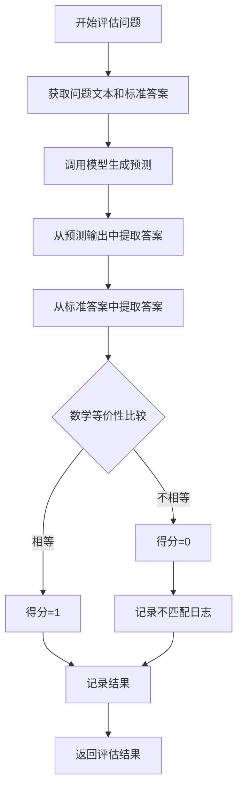
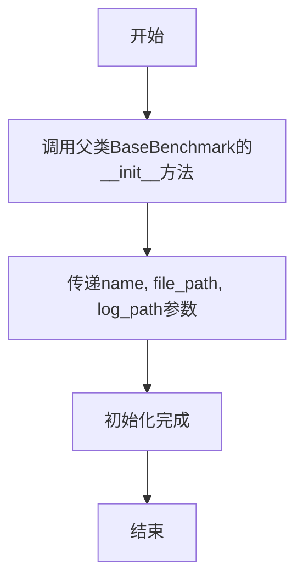
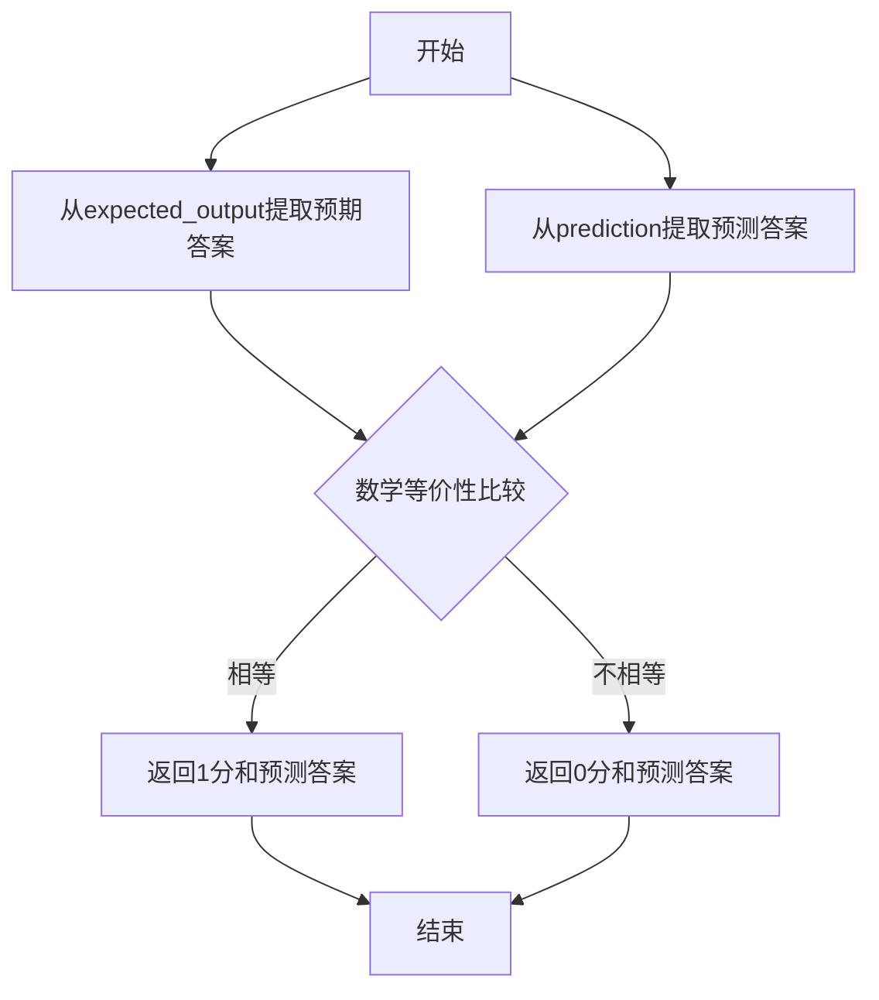
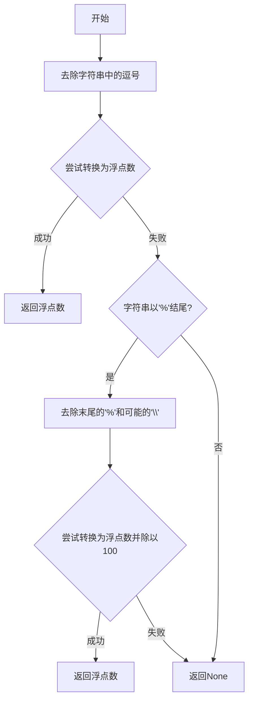
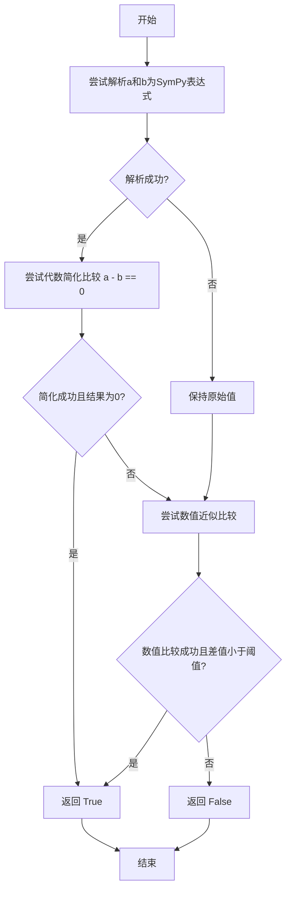
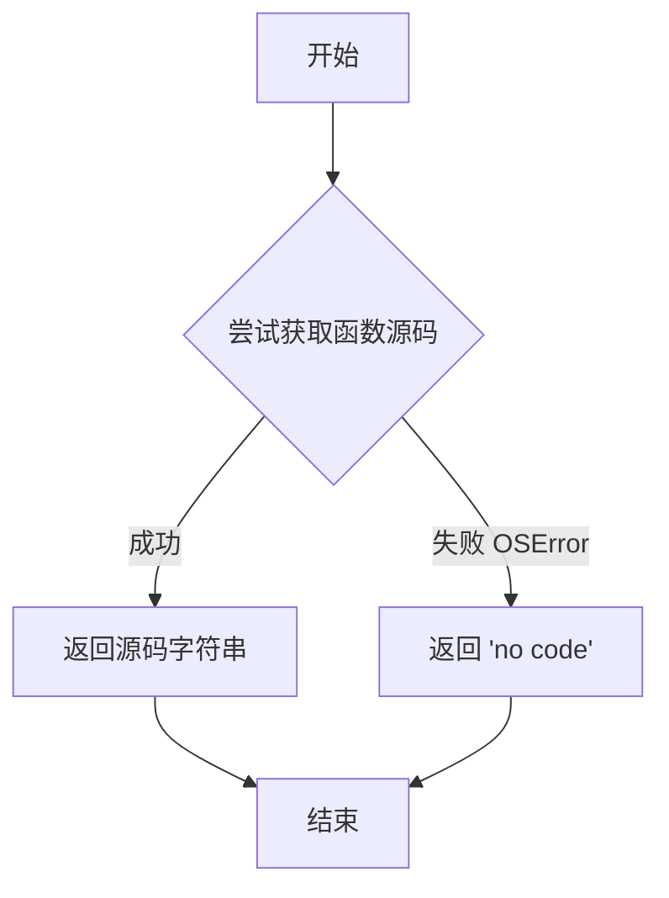
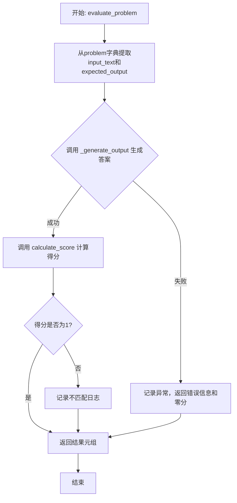
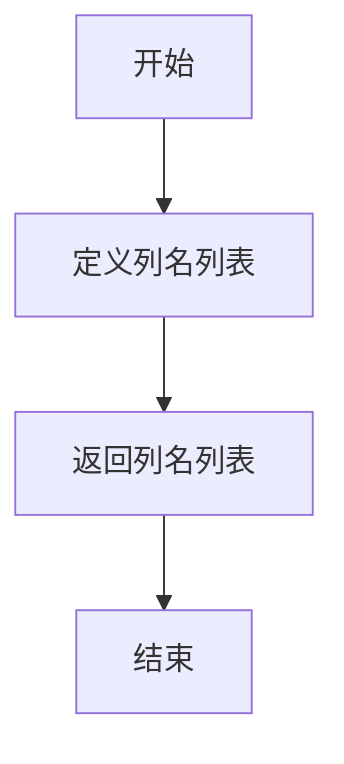

# `.\MetaGPT\metagpt\ext\aflow\benchmark\math.py` 详细设计文档

该代码实现了一个名为 MATHBenchmark 的数学问题评估基准测试类，主要用于评估大语言模型在解决数学问题上的表现。它通过解析模型输出中的答案（支持 LaTeX 格式的 \boxed{} 或文本末尾答案），与标准答案进行数学等价性比较（支持数值近似和符号计算），并计算得分。

## 整体流程



## 类结构

```
BaseBenchmark (抽象基类)
└── MATHBenchmark (数学评估基准)
```

## 全局变量及字段


### `logger`
    
用于记录日志的全局日志记录器实例

类型：`Logger`
    


    

## 全局函数及方法

### `MATHBenchmark.__init__`

该方法用于初始化 `MATHBenchmark` 类的实例，继承自 `BaseBenchmark` 类，并设置基准测试的名称、数据文件路径和日志文件路径。

参数：

- `name`：`str`，基准测试的名称
- `file_path`：`str`，包含测试问题的数据文件路径
- `log_path`：`str`，日志文件的存储路径

返回值：`None`，无返回值

#### 流程图



#### 带注释源码

```python
def __init__(self, name: str, file_path: str, log_path: str):
    # 调用父类 BaseBenchmark 的构造函数，传递名称、文件路径和日志路径参数
    super().__init__(name, file_path, log_path)
```

### `MATHBenchmark.extract_model_answer`

该方法用于从模型生成的文本中提取最终答案。它首先尝试匹配LaTeX格式的`\boxed{}`命令，如果找到则返回最后一个`\boxed{}`中的内容；否则，它会将文本按句子分割，并返回最后一个非空句子作为答案。

参数：

- `text`：`str`，需要从中提取答案的原始文本。

返回值：`str`，提取出的答案字符串。

#### 流程图

```mermaid
flowchart TD
    A[开始: 输入文本text] --> B{使用正则表达式查找\n所有\\boxed{...}模式};
    B --> C{是否找到匹配?};
    C -- 是 --> D[返回最后一个匹配项\n并去除首尾空白];
    C -- 否 --> E[按句子结束符\n分割文本为句子列表];
    E --> F{句子列表是否非空?};
    F -- 是 --> G[返回最后一个句子];
    F -- 否 --> H[返回空字符串];
    D --> I[结束: 返回答案];
    G --> I;
    H --> I;
```

#### 带注释源码

```python
def extract_model_answer(self, text: str) -> str:
    # 定义正则表达式模式，用于匹配LaTeX的\boxed{...}命令。
    # 模式允许嵌套一层花括号，并使用re.DOTALL标志使.匹配换行符。
    pattern = r"\\boxed{((?:[^{}]|{[^{}]*})*)}"
    # 在文本中查找所有匹配该模式的内容
    boxed_matches = re.findall(pattern, text, re.DOTALL)
    # 如果找到了\boxed{}格式的答案
    if boxed_matches:
        # 返回最后一个匹配项（通常是最新的或最终的答案），并去除首尾空白字符
        return boxed_matches[-1].strip()

    # 如果没有找到\boxed{}格式，则尝试按句子提取。
    # 定义匹配句子结束符（句号、问号、感叹号）的模式，要求前面不是数字（避免匹配小数点）。
    sentence_end_pattern = r"(?<!\d)[.!?]\s+"
    # 使用该模式分割文本，得到一个句子列表
    sentences = re.split(sentence_end_pattern, text)
    # 清理列表：去除每个句子的空白，并过滤掉空字符串
    sentences = [s.strip() for s in sentences if s.strip()]
    # 如果句子列表非空，返回最后一个句子；否则返回空字符串
    return sentences[-1] if sentences else ""
```

### `MATHBenchmark.calculate_score`

该方法用于计算模型在数学问题上的得分。它从给定的预期输出和模型预测中提取答案，然后通过数学等价性比较来判断预测是否正确。如果预测与预期答案在数学上等价，则返回1分，否则返回0分，并同时返回提取出的预测答案。

参数：

- `expected_output`：`str`，包含预期答案的文本，通常是一个数学问题的标准解答。
- `prediction`：`str`，模型生成的预测文本，可能包含答案。

返回值：`Tuple[int, str]`，返回一个元组，第一个元素是得分（1表示正确，0表示错误），第二个元素是从预测文本中提取出的答案。

#### 流程图



#### 带注释源码

```python
def calculate_score(self, expected_output: str, prediction: str) -> Tuple[int, str]:
    # 从预期输出文本中提取答案
    expected_answer = self.extract_model_answer(expected_output)
    # 从模型预测文本中提取答案
    predicted_answer = self.extract_model_answer(prediction)

    # 比较提取出的答案是否在数学上等价
    if self.math_equal(predicted_answer, expected_answer):
        # 如果等价，返回1分和预测答案
        return 1, predicted_answer
    else:
        # 如果不等价，返回0分和预测答案
        return 0, predicted_answer
```

### `MATHBenchmark.math_equal`

该方法用于判断两个数学表达式（预测答案和参考答案）在数学意义上是否相等。它通过多种策略进行比较：首先进行字符串精确匹配；如果失败，尝试将两者解析为数值并进行浮点数近似比较（容差1e-3）；如果数值比较失败，则尝试进行符号化数学等价性比较。该方法旨在处理数学问题答案比较中常见的格式差异和表示多样性。

参数：

- `prediction`：`Any`，模型预测的答案，可以是字符串、数字或其他可转换为字符串的类型。
- `reference`：`Any`，参考的标准答案，可以是字符串、数字或其他可转换为字符串的类型。

返回值：`bool`，如果两个答案在数学意义上相等则返回`True`，否则返回`False`。

#### 流程图

```mermaid
flowchart TD
    A[开始: math_equal(prediction, reference)] --> B{字符串是否完全相同?}
    B -- 是 --> C[返回 True]
    B -- 否 --> D{尝试数值比较}
    D -- 成功且数值接近 --> E[返回 True]
    D -- 失败 --> F{尝试符号化比较}
    F -- 成功且符号等价 --> G[返回 True]
    F -- 失败 --> H[返回 False]
```

#### 带注释源码

```python
def math_equal(self, prediction: Any, reference: Any) -> bool:
    # 策略1: 字符串精确匹配。这是最快、最直接的比较方式。
    if str(prediction) == str(reference):
        return True

    # 策略2: 数值近似比较。
    try:
        # 检查两个输入是否都能被解析为数字。
        if self.is_digit(prediction) and self.is_digit(reference):
            # 解析字符串，处理逗号分隔符和百分号。
            prediction = self.parse_digits(prediction)
            reference = self.parse_digits(reference)
            # 使用math.isclose进行浮点数比较，容差为1e-3。
            return isclose(prediction, reference, abs_tol=1e-3)
    except:
        # 如果数值比较过程中出现任何异常（如解析失败、类型错误），则静默忽略，进入下一个策略。
        pass

    # 策略3: 符号化数学等价性比较。
    try:
        # 使用sympy库尝试将输入解析为数学表达式并进行简化比较。
        return self.symbolic_equal(prediction, reference)
    except:
        # 如果符号比较失败，则静默忽略。
        pass

    # 所有策略都失败，判定为不相等。
    return False
```

### `MATHBenchmark.is_digit`

该方法用于判断给定的输入是否可以解析为一个有效的数字。它通过调用 `parse_digits` 方法来尝试将输入转换为浮点数，如果转换成功则返回 `True`，否则返回 `False`。

参数：

- `num`：`Any`，需要判断是否为数字的输入值

返回值：`bool`，如果输入可以解析为数字则返回 `True`，否则返回 `False`

#### 流程图

```mermaid
graph TD
    A[开始] --> B[调用 parse_digits(num)]
    B --> C{parse_digits 返回 None?}
    C -->|是| D[返回 False]
    C -->|否| E[返回 True]
    D --> F[结束]
    E --> F
```

#### 带注释源码

```python
def is_digit(self, num):
    # 调用 parse_digits 方法尝试将输入解析为数字
    # 如果解析成功（返回值不为 None），则返回 True，否则返回 False
    return self.parse_digits(num) is not None
```

### `MATHBenchmark.parse_digits`

该方法用于解析一个字符串形式的数字，将其转换为浮点数。它能够处理包含逗号分隔符的数字字符串，以及以百分号结尾的百分比数字。

参数：
- `num`：`Any`，需要解析的数字，通常为字符串类型，但也可以是其他可转换为字符串的类型。

返回值：`float` 或 `None`，如果解析成功则返回对应的浮点数，否则返回 `None`。

#### 流程图



#### 带注释源码

```python
def parse_digits(self, num):
    # 去除字符串中的逗号，例如将"1,000"转换为"1000"
    num = regex.sub(",", "", str(num))
    try:
        # 尝试直接转换为浮点数
        return float(num)
    except:
        # 如果转换失败，检查是否为百分比形式
        if num.endswith("%"):
            # 去除末尾的百分号
            num = num[:-1]
            # 如果末尾有反斜杠，也去除（处理可能的转义字符）
            if num.endswith("\\"):
                num = num[:-1]
            try:
                # 尝试将剩余部分转换为浮点数并除以100，得到百分比的小数表示
                return float(num) / 100
            except:
                # 如果转换失败，返回None
                pass
    # 所有尝试都失败时返回None
    return None
```

### `MATHBenchmark.symbolic_equal`

该方法用于判断两个数学表达式在符号意义上是否相等。它首先尝试将输入解析为SymPy表达式，然后通过代数简化或数值近似来比较它们是否相等。

参数：

- `a`：`Any`，第一个待比较的数学表达式，可以是字符串、数字或SymPy表达式。
- `b`：`Any`，第二个待比较的数学表达式，可以是字符串、数字或SymPy表达式。

返回值：`bool`，如果两个表达式在符号意义上相等则返回`True`，否则返回`False`。

#### 流程图



#### 带注释源码

```python
def symbolic_equal(self, a, b):
    # 内部函数：尝试使用多种解析器将字符串解析为SymPy表达式
    def _parse(s):
        # 依次尝试使用LaTeX解析器和SymPy表达式解析器
        for f in [parse_latex, parse_expr]:
            try:
                return f(s)
            except:
                pass
        # 如果解析失败，返回原始值
        return s

    # 尝试解析输入参数a和b
    a = _parse(a)
    b = _parse(b)

    # 方法1：尝试代数简化比较
    try:
        # 简化表达式 a - b，如果结果为0则认为相等
        if simplify(a - b) == 0:
            return True
    except:
        # 简化过程中出现异常则忽略，继续尝试其他方法
        pass

    # 方法2：尝试数值近似比较
    try:
        # 将表达式转换为数值，使用1e-3的绝对容差进行比较
        if isclose(N(a), N(b), abs_tol=1e-3):
            return True
    except:
        # 数值转换或比较过程中出现异常则忽略
        pass
    
    # 所有比较方法都失败，返回False
    return False
```

### `MATHBenchmark.get_function_code`

该方法用于获取给定函数的源代码字符串。它通过Python的`inspect`模块尝试获取函数的源码，如果获取失败（例如函数是内置函数或来自已编译的扩展模块），则返回一个默认的字符串"no code"。

参数：

- `func`：`Any`，需要获取源代码的Python函数对象。

返回值：`str`，如果成功获取到函数的源代码，则返回该源代码字符串；否则返回字符串"no code"。

#### 流程图



#### 带注释源码

```python
def get_function_code(self, func):
    """
    获取给定函数的源代码字符串。
    
    该方法使用inspect.getsource来尝试获取函数的源代码。如果函数是内置的、
    来自已编译的扩展模块，或者由于其他原因无法获取源码，则会捕获OSError异常
    并返回一个默认的字符串"no code"。
    
    参数:
        func (Any): 需要获取源代码的Python函数对象。
        
    返回值:
        str: 函数的源代码字符串，如果获取失败则返回"no code"。
    """
    try:
        # 使用inspect模块获取函数的源代码
        source_code = inspect.getsource(func)
        return source_code
    except OSError:
        # 当无法获取源代码时（例如，函数是内置的或来自C扩展），返回默认字符串
        return "no code"
```


### `MATHBenchmark._generate_output`

该方法是一个异步方法，用于执行重试逻辑，调用给定的图（graph）处理输入文本，并返回其输出。它通过装饰器实现了在遇到异常时的自动重试机制。

参数：

-  `graph`：`Callable`，一个可调用对象（例如异步函数），代表需要执行的图或模型，用于处理输入文本。
-  `input_text`：`str`，需要被图处理的输入文本。

返回值：`Any`，返回图处理`input_text`后产生的输出结果。具体类型由`graph`的返回值决定。

#### 流程图

```mermaid
flowchart TD
    A[开始: 调用 _generate_output] --> B{执行 graph(input_text) };
    B -- 成功 --> C[返回结果];
    B -- 抛出异常 --> D{重试次数 < 5?};
    D -- 是 --> E[等待1秒];
    E --> B;
    D -- 否 --> F[抛出最后一次异常];
```

#### 带注释源码

```
    @retry(stop=stop_after_attempt(5), wait=wait_fixed(1), retry=retry_if_exception_type(Exception), reraise=True)
    # 使用tenacity库的retry装饰器配置重试逻辑：
    # stop=stop_after_attempt(5): 最多重试5次后停止。
    # wait=wait_fixed(1): 每次重试前固定等待1秒。
    # retry=retry_if_exception_type(Exception): 当抛出任何Exception类型的异常时进行重试。
    # reraise=True: 重试次数用尽后，重新抛出最后一次的异常。
    async def _generate_output(self, graph, input_text):
        # 异步调用传入的graph函数，并传入input_text作为参数。
        return await graph(input_text)
```


### `MATHBenchmark.evaluate_problem`

该方法用于评估一个给定的数学问题。它接收一个问题字典和一个图（graph）函数作为输入，通过图函数生成预测答案，然后与预期答案进行比较计算得分，并记录成本。如果预测失败或比较失败，会进行错误处理和日志记录。

参数：

- `problem`：`dict`，包含数学问题及其解决方案的字典，键包括"problem"（问题文本）和"solution"（预期答案文本）。
- `graph`：`Callable`，一个可调用对象（通常是异步函数），接收问题文本作为输入，返回模型生成的答案和计算成本。

返回值：`Tuple[str, str, str, int, float]`，返回一个元组，包含：原始问题文本、模型生成的答案（或错误信息）、预期答案、得分（0或1）、计算成本。

#### 流程图



#### 带注释源码

```python
async def evaluate_problem(self, problem: dict, graph: Callable) -> Tuple[str, str, str, int, float]:
    # 从问题字典中提取输入文本和预期输出
    input_text = problem["problem"]
    expected_output = problem["solution"]

    try:
        # 调用图函数生成模型输出和计算成本，使用重试机制
        output, cost = await self._generate_output(graph, input_text)
        # 计算得分并提取模型答案
        uni_score, extracted_output = self.calculate_score(expected_output, output)

        # 如果得分为0（即答案错误），记录不匹配的详细信息
        if uni_score == 0:
            self.log_mismatch(
                input_text,
                expected_output,
                output,
                extracted_output,
                extract_answer_code=self.get_function_code(self.extract_model_answer),
            )

        # 返回评估结果：问题、模型输出、预期输出、得分、成本
        return input_text, output, expected_output, uni_score, cost

    except Exception as e:
        # 如果发生异常（例如重试耗尽），记录错误并返回零分和零成本
        logger.info(f"Maximum retries reached. Skipping this sample. Error: {e}")
        return input_text, str(e), expected_output, 0.0, 0.0
```

### `MATHBenchmark.get_result_columns`

该方法返回一个字符串列表，定义了评估结果数据集的列名。

参数：
- 无

返回值：`List[str]`，返回一个包含列名（`"question"`, `"prediction"`, `"expected_output"`, `"score"`, `"cost"`）的列表。

#### 流程图



#### 带注释源码

```python
def get_result_columns(self) -> List[str]:
    # 返回一个固定的字符串列表，定义了评估结果数据集的列结构。
    # 这些列名用于存储和标识每个评估样本的各个组成部分。
    return ["question", "prediction", "expected_output", "score", "cost"]
```

## 关键组件

### 数学表达式解析与比较

该组件负责将模型输出的字符串答案与标准答案进行数学等价性判断。它通过多种策略（如数值近似、符号计算、LaTeX解析）来比较两个数学表达式是否相等，而非简单的字符串匹配，从而提高了数学问题评估的鲁棒性和准确性。

### 答案提取器

该组件用于从模型生成的文本或标准答案文本中提取出最终的数学答案。它首先尝试匹配LaTeX格式的`\boxed{}`命令，如果失败则回退到提取文本的最后一句。这种设计旨在处理模型输出中可能包含的推理过程和最终答案混合的情况。

### 异步评估与重试机制

该组件封装了调用图计算（`graph`）以获取模型预测的核心异步流程，并集成了自动重试逻辑。当图计算因临时性错误（如网络波动）失败时，它会自动进行最多5次重试，每次间隔1秒，从而增强了整个评估流程的容错能力和稳定性。

### 日志记录与错误追踪

该组件在模型预测与标准答案不匹配时，负责记录详细的错误信息。它会捕获问题、标准答案、模型原始输出、提取的答案以及用于提取答案的函数源码，为后续的调试和模型改进提供了关键的数据支持。

## 问题及建议


### 已知问题

-   **数值精度与容差处理单一**：`math_equal` 方法中，对于数值比较仅使用了固定的 `abs_tol=1e-3` 绝对容差。对于不同数量级（如极小数或极大数）的数学问题，单一的容差策略可能导致误判（例如，将 `1.001` 和 `1.002` 判为相等，或将 `0.0001` 和 `0.0002` 判为不等）。
-   **符号计算异常处理过于宽泛**：`symbolic_equal` 方法中，`simplify(a - b) == 0` 和 `isclose(N(a), N(b), ...)` 的尝试都被包裹在 `try...except` 块中，且 `except` 捕获了所有异常（`except:`）。这会掩盖解析或计算过程中的具体错误（如语法错误、未定义符号），不利于调试和问题定位。
-   **答案提取逻辑可能不完整**：`extract_model_answer` 方法首先尝试匹配 `\boxed{}` 格式，若无则取最后一句。对于复杂或非标准格式的答案（例如，答案嵌在文本中间、多行 `\boxed{}`、或使用其他标记如 `\answer`），此方法可能无法正确提取。
-   **错误处理与资源管理**：`evaluate_problem` 方法中，当 `_generate_output` 重试耗尽后捕获异常时，返回的 `cost` 为 `0.0`。这可能与实际情况不符，如果失败前已产生计算成本（如API调用），则成本统计会不准确。同时，异常信息被转换为字符串作为 `prediction` 返回，可能干扰结果分析。
-   **代码健壮性**：`parse_digits` 方法中处理百分比的逻辑（`if num.endswith("\\"):`）意图不明确，可能是为了转义字符，但缺乏注释，且逻辑可能不健壮。`is_digit` 方法依赖于 `parse_digits` 的返回值是否为 `None`，但 `parse_digits` 在无法解析时也返回 `None`，这可能导致将非数字字符串误判为数字比较路径。

### 优化建议

-   **采用相对容差或动态容差策略**：在 `math_equal` 的数值比较中，考虑结合相对容差（`rel_tol`）或根据数值的规模动态调整容差。例如，可以使用 `math.isclose(prediction, reference, rel_tol=1e-3, abs_tol=1e-6)`。
-   **细化异常捕获与日志记录**：修改 `symbolic_equal` 及相关方法中的 `except:` 语句，改为捕获特定的异常类型（如 `SympifyError`, `TypeError`, `ValueError`）。在 `except` 块中记录更详细的警告信息，帮助识别解析失败的具体原因。
-   **增强答案提取的鲁棒性**：可以扩展 `extract_model_answer` 方法，支持更多常见的答案表示模式（如多种LaTeX环境、纯数字提取）。考虑使用更强大的解析库或定义更灵活的正则表达式。对于取最后一句的备选方案，可以增加对句子结构的简单验证（例如，是否包含数字或数学符号）。
-   **完善成本计算与错误信息处理**：在 `evaluate_problem` 的异常处理中，考虑记录或估算失败尝试所产生的部分成本。将异常对象与预测输出分离，例如，在返回元组中增加一个专门的 `error` 字段，或使用一个包含状态、结果、错误和成本的 `dataclass`。
-   **重构与增加代码清晰度**：为 `parse_digits` 中的特殊逻辑添加注释，说明其目的。考虑将 `is_digit` 和 `parse_digits` 合并或重命名，使其语义更清晰（例如，`try_parse_number`）。对 `_generate_output` 的重试装饰器，可以明确指定其重试的异常类型列表，而非通用的 `Exception`。
-   **考虑性能优化**：`symbolic_equal` 中的 `_parse` 函数会依次尝试 `parse_latex` 和 `parse_expr`。如果输入字符串格式已知，可以避免不必要的尝试。对于大规模评估，可以考虑缓存已解析的表达式结果（如果输入重复率高）。
-   **增强可测试性与配置化**：将容差值（`abs_tol`, `rel_tol`）、重试次数、答案提取模式等作为类初始化参数，提高代码的灵活性和可测试性。


## 其它


### 设计目标与约束

该代码旨在实现一个针对数学问题（MATH）的自动化评估基准测试系统。核心设计目标包括：1) 从模型生成的文本中准确提取数学答案（支持LaTeX格式的`\boxed{}`和自然语言结尾）；2) 通过多种方法（字符串匹配、数值近似、符号计算）对提取的答案进行高鲁棒性的等价性判断；3) 提供异步评估接口，集成重试机制以增强容错性。主要约束包括：依赖`sympy`进行符号计算，对非标准数学格式的解析能力有限；重试逻辑可能掩盖底层模型的系统性错误；答案提取规则可能无法覆盖所有模型输出格式。

### 错误处理与异常设计

代码采用了分层和防御式的错误处理策略。在`math_equal`方法中，数值比较和符号计算均被`try-except`块包裹，确保一种方法失败时能回退到另一种，最终返回`False`。`_generate_output`方法使用`tenacity`库装饰，对任何`Exception`进行最多5次、间隔1秒的重试，重试耗尽后异常被重新抛出。顶层`evaluate_problem`方法捕获所有异常，记录日志并返回零分和错误信息，保证单个问题评估失败不会中断整个基准测试流程。这种设计确保了评估过程的健壮性。

### 数据流与状态机

数据流始于包含`"problem"`和`"solution"`字段的问题字典。`evaluate_problem`方法接收该字典和评估图（`graph`），构造输入文本。通过`_generate_output`（含重试）异步调用`graph`获得模型输出和成本。模型输出和标准答案分别经由`extract_model_answer`方法进行答案提取。提取后的答案对通过`calculate_score`方法计算得分，该方法内部调用`math_equal`进行多策略等价性判断。最终，原始输入、模型输出、标准答案、得分（0/1）和成本被组装并返回。整个过程是无状态的，每个问题的评估相互独立。

### 外部依赖与接口契约

**外部库依赖：**
1.  `sympy`：用于解析LaTeX (`parse_latex`) 和符号表达式 (`parse_expr`)，以及进行符号简化 (`simplify`) 和数值求值 (`N`)。
2.  `regex`：提供更强大的正则表达式支持，用于`parse_digits`中的复杂数字清理。
3.  `tenacity`：为`_generate_output`方法提供重试机制。
4.  `inspect`：用于`get_function_code`方法获取函数源码。

**接口契约：**
1.  `BaseBenchmark`基类：定义了基准测试的通用接口和结构（如`__init__`, `log_mismatch`等方法），`MATHBenchmark`继承并实现了其抽象方法。
2.  `graph`参数 (`Callable`)：在`evaluate_problem`和`_generate_output`中，`graph`是一个可调用对象，需接受一个字符串输入并返回一个元组 `(output_text, cost)`。这是一个关键的外部交互点。
3.  问题数据格式：期望`problem`参数是一个字典，必须包含`"problem"`（题目文本）和`"solution"`（标准答案文本）键。

### 性能考量

1.  **计算开销**：`symbolic_equal`方法中的`sympy`符号运算（`simplify`, `N`）可能是性能瓶颈，尤其对于复杂表达式。`math_equal`方法中的多层`try-except`虽然增强了鲁棒性，但在答案明显不匹配时也引入了不必要的尝试开销。
2.  **重试机制**：`_generate_output`的重试策略（5次*1秒等待）在`graph`调用不稳定时可能导致评估总时间显著增加，需根据实际服务稳定性调整参数。
3.  **内存与状态**：评估本身是无状态和流式的，内存占用主要取决于同时评估的问题数量和数据本身，通常较低。

### 安全与合规性

1.  **代码执行**：`get_function_code`使用`inspect.getsource`，仅用于记录和调试，不执行任何动态代码，风险较低。
2.  **输入处理**：代码未对输入的`problem`字典和`graph`的输出进行显式的安全清洗或验证。如果`graph`来自不可信源或其输出被恶意构造（例如包含特殊字符冲击正则表达式或`sympy`解析器），可能存在潜在风险，尽管在当前评估场景下概率较低。
3.  **依赖安全**：依赖的第三方库（如`sympy`, `tenacity`）需保持更新，以避免已知漏洞。

### 测试策略建议

1.  **单元测试**：应重点测试`extract_model_answer`对各种输出格式（`\boxed{}`、句末答案、无答案文本）的提取准确性；测试`math_equal`及其子方法（`is_digit`, `parse_digits`, `symbolic_equal`）对不同类型答案（字符串、整数、浮点数、百分比、LaTeX表达式）的等价性判断。
2.  **集成测试**：模拟`graph`接口，测试完整的`evaluate_problem`流程，包括正常情况、`graph`抛出异常的情况以及重试逻辑。
3.  **模糊测试**：对`extract_model_answer`和`parse_digits`等输入处理函数进行模糊测试，以发现边界情况和潜在崩溃点。
4.  **基准测试**：对包含大量问题的数据集运行评估，监控总体执行时间和内存使用情况，识别性能热点。

    