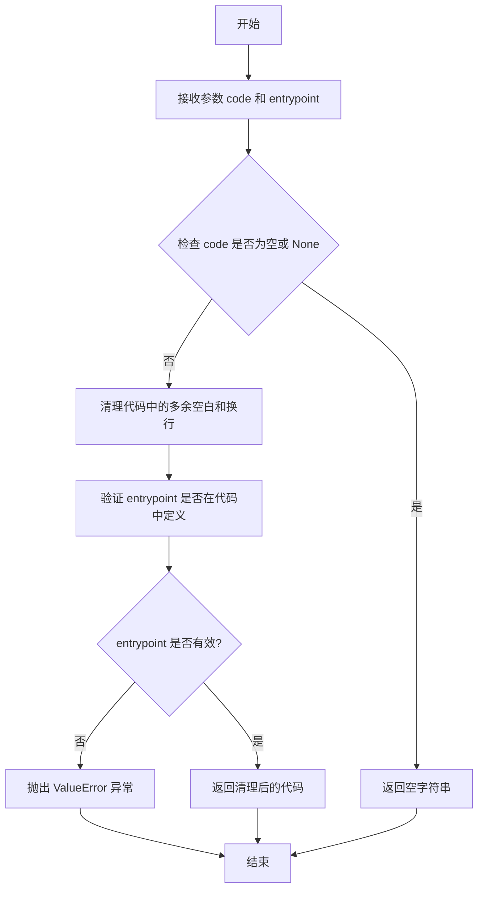
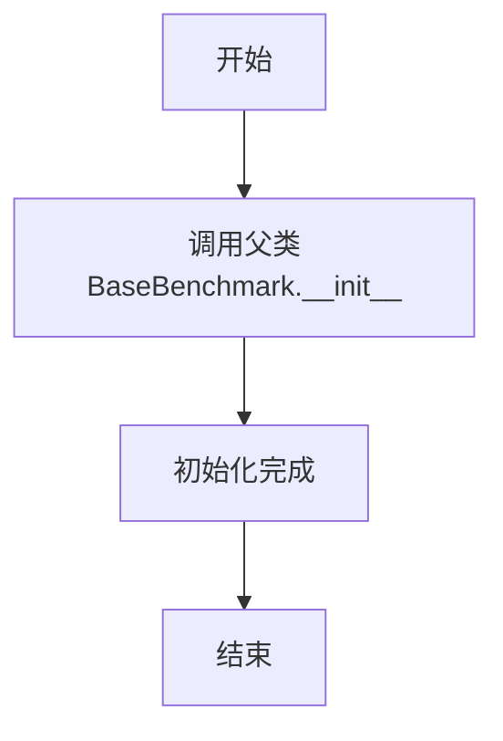
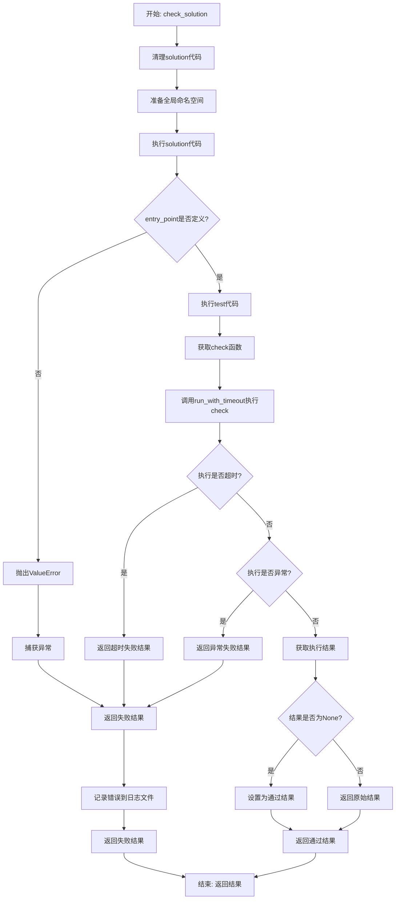
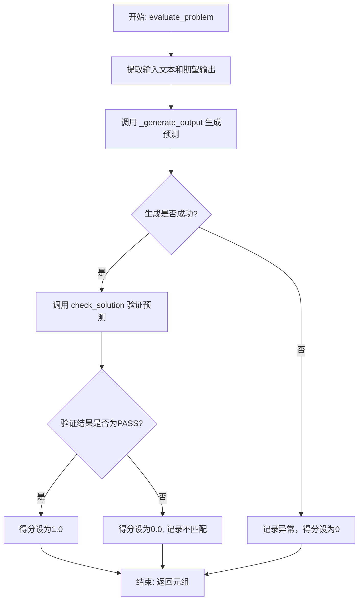
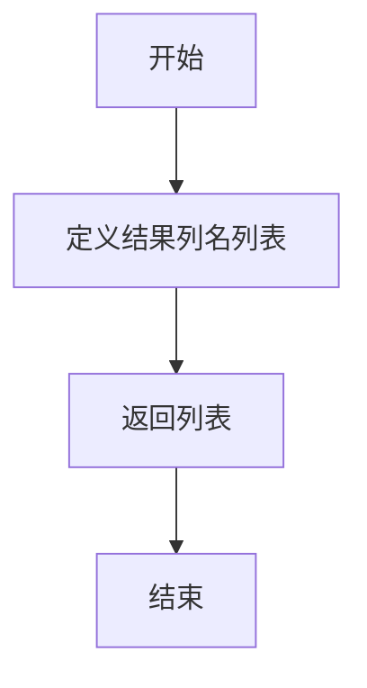

# `.\MetaGPT\metagpt\ext\aflow\benchmark\mbpp.py` 详细设计文档

该代码实现了一个名为MBPPBenchmark的基准测试类，用于评估代码生成模型在MBPP（Mostly Basic Python Problems）数据集上的性能。其核心功能是：给定一个编程问题描述（prompt），通过调用外部的代码生成图（graph）来生成解决方案代码，然后在一个受控的沙箱环境中执行该代码并运行预定义的测试用例，最后根据测试通过与否来评分。整个过程包含了超时控制、错误处理、重试机制和日志记录。

## 整体流程

```mermaid
graph TD
    A[开始评估一个问题] --> B[调用 _generate_output 生成代码]
    B --> C{生成成功?}
    C -- 是 --> D[调用 check_solution 验证代码]
    C -- 否（重试耗尽）--> E[记录错误，返回0分]
    D --> F[执行 sanitize 清理代码]
    F --> G[在沙箱中 exec 执行代码]
    G --> H{函数 entry_point 存在?}
    H -- 否 --> I[抛出 ValueError]
    H -- 是 --> J[执行测试用例]
    J --> K[调用 run_with_timeout 运行测试]
    K --> L{测试在15秒内完成?}
    L -- 是 --> M{测试通过?}
    M -- 是 --> N[返回 (PASS, 成功信息)]
    M -- 否 --> O[返回 (FAIL, 错误信息)]
    L -- 否（超时）--> P[返回 (FAIL, 超时信息)]
    N --> Q[根据PASS/FAIL计算分数 (1.0/0.0)]
    O --> Q
    P --> Q
    Q --> R[记录不匹配情况（如果得分为0）]
    R --> S[返回评估结果元组]
    I --> O
    E --> S
```

## 类结构

```
BaseBenchmark (抽象基类，来自 metagpt.ext.aflow.benchmark.benchmark)
└── MBPPBenchmark
    ├── 嵌套类: TimeoutError
    ├── 方法: __init__
    ├── 方法: run_with_timeout
    ├── 方法: check_solution
    ├── 方法: _generate_output
    ├── 方法: evaluate_problem
    ├── 方法: calculate_score
    └── 方法: get_result_columns
```

## 全局变量及字段


### `logger`
    
用于记录日志的全局日志记录器实例，来自metagpt.logs模块

类型：`Logger`
    


    

## 全局函数及方法

### `sanitize`

`sanitize` 函数用于清理和验证给定的代码字符串，确保其符合特定的格式要求，并提取或验证指定的入口点函数。

参数：

- `code`：`str`，需要清理和验证的原始代码字符串。
- `entrypoint`：`str`，期望在代码中存在的函数名，作为入口点。

返回值：`str`，清理和验证后的代码字符串。

#### 流程图



#### 带注释源码

```
def sanitize(code: str, entrypoint: str) -> str:
    """
    清理和验证给定的代码字符串，确保其符合特定的格式要求，并提取或验证指定的入口点函数。

    Args:
        code (str): 需要清理和验证的原始代码字符串。
        entrypoint (str): 期望在代码中存在的函数名，作为入口点。

    Returns:
        str: 清理和验证后的代码字符串。

    Raises:
        ValueError: 如果代码为空或入口点函数未在代码中定义。
    """
    # 检查代码是否为空或 None
    if not code:
        return ""

    # 清理代码中的多余空白和换行
    code = code.strip()
    code = "\n".join([line.rstrip() for line in code.splitlines()])

    # 验证入口点函数是否在代码中定义
    if entrypoint and entrypoint not in code:
        raise ValueError(f"Entry point '{entrypoint}' not found in the provided code.")

    return code
```

### `MBPPBenchmark.__init__`

该方法用于初始化 `MBPPBenchmark` 类的实例，继承自 `BaseBenchmark` 基类，并设置基准测试的名称、数据文件路径和日志文件路径。

参数：

- `name`：`str`，基准测试的名称。
- `file_path`：`str`，包含测试数据（如问题和测试用例）的文件路径。
- `log_path`：`str`，用于记录测试结果和错误的日志文件路径。

返回值：`None`，此方法为构造函数，不返回任何值。

#### 流程图



#### 带注释源码

```python
def __init__(self, name: str, file_path: str, log_path: str):
    # 调用父类BaseBenchmark的构造函数，传递名称、文件路径和日志路径
    super().__init__(name, file_path, log_path)
```

### `MBPPBenchmark.run_with_timeout`

该方法用于在指定的超时时间内执行一个函数。它通过创建一个独立的线程来运行目标函数，并使用一个事件（`threading.Event`）来监控执行状态。如果在超时时间内函数未执行完毕，则会抛出 `TimeoutError` 异常。如果函数执行过程中抛出异常，该方法会捕获并重新抛出该异常。如果函数正常执行完毕，则返回其结果。

参数：

- `func`：`Callable`，需要被执行的函数，该函数应不接受任何参数。
- `timeout`：`int` 或 `float`，允许函数执行的最大时间（秒）。

返回值：`Any`，返回传入的 `func` 函数的执行结果。如果函数执行超时，则抛出 `TimeoutError` 异常；如果函数执行过程中发生异常，则抛出该异常。

#### 流程图

```mermaid
flowchart TD
    A[开始: run_with_timeout(func, timeout)] --> B[初始化结果列表 result 和停止事件 stop_event]
    B --> C[定义目标函数 target<br>在线程中执行 func<br>将结果或异常存入 result<br>设置 stop_event]
    C --> D[创建并启动线程执行 target]
    D --> E{等待 stop_event 或超时?}
    E -- 超时 --> F[抛出 TimeoutError]
    E -- 事件被设置 --> G{result 列表为空?}
    G -- 是 --> H[返回 None]
    G -- 否 --> I{result[0] 是异常?}
    I -- 是 --> J[抛出该异常]
    I -- 否 --> K[返回 result[0]]
    F --> L[结束]
    H --> L
    J --> L
    K --> L
```

#### 带注释源码

```python
def run_with_timeout(self, func, timeout):
    # 初始化一个列表用于存储函数执行结果或异常
    result = []
    # 创建一个线程事件，用于同步和超时控制
    stop_event = threading.Event()

    # 定义在线程中执行的目标函数
    def target():
        try:
            # 执行传入的函数，并将结果添加到 result 列表中
            result.append(func())
        except Exception as e:
            # 如果执行过程中发生异常，将异常对象添加到 result 列表中
            result.append(e)
        finally:
            # 无论成功或失败，都设置事件，表示线程执行结束
            stop_event.set()

    # 创建一个线程，其目标函数是上面定义的 target
    thread = threading.Thread(target=target)
    # 启动线程
    thread.start()
    # 主线程等待 stop_event 被设置，最多等待 timeout 秒
    # 如果超时前事件被设置，wait 返回 True，否则返回 False
    is_timeout = not stop_event.wait(timeout)

    # 如果等待超时
    if is_timeout:
        # 抛出自定义的 TimeoutError 异常
        raise self.TimeoutError("Function execution timed out")

    # 如果 result 列表为空（理论上不会发生，因为 target 总会 append）
    if not result:
        return None
    # 如果 result 中的第一个元素是异常实例
    if isinstance(result[0], Exception):
        # 重新抛出这个异常
        raise result[0]
    # 返回正常的函数执行结果
    return result[0]
```

### `MBPPBenchmark.check_solution`

该方法用于验证一个给定的代码解决方案（`solution`）是否能够通过指定的测试用例（`test`）。它通过执行代码、运行测试并处理执行过程中可能出现的超时或异常来评估解决方案的正确性。

参数：

- `solution`：`str`，待验证的代码解决方案字符串。
- `test`：`str`，用于验证解决方案的测试代码字符串。
- `entry_point`：`str`，解决方案中需要被测试的主函数或入口点名称。

返回值：`Tuple[int, str]`，返回一个元组，其中第一个元素是测试结果状态（`self.PASS` 或 `self.FAIL`），第二个元素是详细的测试结果描述或错误信息。

#### 流程图



#### 带注释源码

```python
def check_solution(self, solution, test, entry_point):
    # 1. 清理和规范化输入的解决方案代码，确保入口点函数名正确
    solution = sanitize(code=solution, entrypoint=entry_point)
    try:
        # 2. 准备一个安全的全局命名空间，包含常用的Python模块和类型提示
        global_dict = {
            "math": __import__("math"),
            "hashlib": __import__("hashlib"),
            "re": __import__("re"),
            "List": List,
            "Dict": Dict,
            "Tuple": Tuple,
            "Optional": Optional,
            "Any": Any,
        }

        # 3. 在准备好的命名空间中执行解决方案代码，定义其中的函数和变量
        exec(solution, global_dict)

        # 4. 验证入口点函数是否在解决方案中被正确定义
        if entry_point not in global_dict:
            raise ValueError(f"Function {entry_point} is not defined in the solution.")

        # 5. 在同一个命名空间中执行测试代码，这会定义或运行测试逻辑
        exec(test, global_dict)

        # 6. 从命名空间中获取测试执行函数 `check`
        check = global_dict["check"]

        # 7. 使用超时机制运行 `check` 函数，防止无限循环或长时间运行
        result = self.run_with_timeout(check, 15)

        # 8. 如果 `check` 函数没有返回结果（可能在某些边缘情况下），则视为通过
        if result is None:
            result = (self.PASS, "The solution passed all test cases.")

    # 9. 处理执行超时异常
    except self.TimeoutError:
        result = (
            self.FAIL,
            "Execution timed out. Please check if your solution contains infinite loops or overly time-consuming operations.",
        )
    # 10. 处理其他所有执行过程中可能出现的异常
    except Exception as e:
        error_message = f"Error: {str(e)}.\n Solution: {solution}.\n Test: {test}"
        result = (self.FAIL, error_message)

        # 11. 将错误信息记录到日志文件中，便于后续调试和分析
        with open("error.log", "a", encoding="utf-8") as log_file:
            log_file.write(f"{time.strftime('%Y-%m-%d %H:%M:%S')} - {error_message}\n")

    # 12. 返回最终的测试结果（通过/失败）和详细信息
    return result
```

### `MBPPBenchmark._generate_output`

该方法是一个异步方法，用于通过重试机制调用一个图（`graph`）函数来生成预测输出。它使用 `tenacity` 库的 `@retry` 装饰器，在遇到异常时最多重试5次，每次重试间隔1秒。其核心目的是确保在外部服务或计算可能暂时失败时，能够通过重试提高调用的成功率。

参数：

- `graph`：`Callable`，一个可调用对象（通常是异步函数），用于根据提示词和入口点生成预测。
- `prompt`：`str`，传递给 `graph` 函数的提示文本，描述了需要解决的问题。
- `entry_point`：`str`，传递给 `graph` 函数的入口点，通常指代需要生成的函数名。

返回值：`Any`，返回 `graph` 函数调用的结果，通常是生成的代码预测及其成本。

#### 流程图

```mermaid
graph TD
    A[开始调用 _generate_output] --> B{是否达到最大重试次数?};
    B -- 否 --> C[调用 graph(prompt, entry_point)];
    C --> D{调用是否成功?};
    D -- 是 --> E[返回结果];
    D -- 否，抛出异常 --> F[触发重试机制];
    F --> G[等待1秒];
    G --> B;
    B -- 是，达到最大重试次数 --> H[抛出最终异常];
    H --> I[结束];
```

#### 带注释源码

```python
    @retry(stop=stop_after_attempt(5), wait=wait_fixed(1), retry=retry_if_exception_type(Exception), reraise=True)
    async def _generate_output(self, graph, prompt, entry_point):
        # 使用装饰器配置重试逻辑：最多尝试5次，每次等待1秒，对所有Exception类型进行重试，并重新抛出最终的异常。
        return await graph(prompt, entry_point) # 异步调用传入的graph函数，并返回其结果。
```

### `MBPPBenchmark.evaluate_problem`

该方法用于评估一个给定的编程问题。它接收一个问题数据字典和一个图函数（graph），使用图函数生成代码预测，然后通过执行测试用例来验证预测代码的正确性，最终返回评估结果，包括输入、预测、期望输出、得分和成本。

参数：

- `data`：`dict`，包含问题描述、测试用例、入口函数名和正确答案代码的字典。
- `graph`：`Callable`，一个可调用对象（通常是异步函数），用于根据输入提示和入口点生成代码预测。

返回值：`Tuple[str, str, str, float, float]`，返回一个元组，包含输入文本、预测代码、期望输出（或错误信息）、得分（1.0表示通过，0.0表示失败）和生成预测的成本。

#### 流程图



#### 带注释源码

```python
async def evaluate_problem(self, data: dict, graph: Callable) -> Tuple[str, str, str, float, float]:
    # 从数据中提取输入文本（问题描述）
    input_text = data["prompt"]
    # 构造期望输出字符串，包含“Correct Solution:”前缀和标准答案代码
    expected_output = "\nCorrect Solution:\ndef " + data["code"]

    try:
        # 使用重试机制调用图函数，生成代码预测并获取成本
        prediction, cost = await self._generate_output(graph, input_text, data["entry_point"])

        # 调用check_solution方法验证生成的预测代码
        ret = self.check_solution(prediction, data["test"], data["entry_point"])
        # 从验证结果中提取测试用例详情
        test_case_details = ret[1]
        # 更新期望输出，包含测试详情和标准答案
        expected_output = test_case_details + "\nCorrect Solution:" + data["code"]

        # 根据验证结果计算得分：如果状态为PASS则得1分，否则得0分
        score = 1.0 if ret[0] == self.PASS else 0.0

        # 如果得分为0（即预测失败），记录输入、期望输出、预测和得分的不匹配情况
        if score == 0:
            self.log_mismatch(input_text, expected_output, prediction, score)

        # 返回评估结果元组
        return input_text, prediction, expected_output, score, cost

    except Exception as e:
        # 如果生成或验证过程中发生任何异常（包括重试耗尽），记录错误信息
        logger.info(f"Maximum retries reached. Skipping this sample. Error: {e}")
        # 返回异常信息作为预测，得分和成本均为0
        return input_text, str(e), expected_output, 0.0, 0.0
```

### `MBPPBenchmark.calculate_score`

该方法用于计算给定预测输出相对于期望输出的得分。根据代码注释，MBPP（Probably Approximately Correct Programming）的评分逻辑已在 `evaluate_problem` 方法中实现，此方法仅为符合基类接口而存在，因此其实现是固定的，总是返回0分和原始预测字符串。

参数：

- `expected_output`：`str`，期望的正确输出字符串。
- `prediction`：`str`，模型生成的预测输出字符串。

返回值：`Tuple[float, str]`，返回一个元组，其中第一个元素是得分（固定为0.0），第二个元素是未经处理的预测字符串。

#### 流程图

```mermaid
graph TD
    A[开始] --> B[接收参数 expected_output 和 prediction]
    B --> C[构造返回值元组 (0.0, prediction)]
    C --> D[返回元组]
    D --> E[结束]
```

#### 带注释源码

```python
def calculate_score(self, expected_output: str, prediction: str) -> Tuple[float, str]:
    # The scoring logic for MBPP is already implemented in evaluate_problem, this is just to conform to the interface
    # MBPP的评分逻辑已在evaluate_problem方法中实现，此方法仅为符合接口而存在
    return 0.0, prediction # 固定返回0分和原始预测字符串
```

### `MBPPBenchmark.get_result_columns`

该方法用于定义并返回评估结果数据集的列名列表。它不执行任何计算或逻辑处理，仅提供一个固定的字符串列表，用于标识`evaluate_problem`方法返回的元组中每个元素的含义。

参数：
-  `self`：`MBPPBenchmark`，当前`MBPPBenchmark`类的实例。

返回值：`List[str]`，一个包含五个字符串的列表，分别代表输入文本、模型预测输出、期望输出、得分和成本。

#### 流程图



#### 带注释源码

```python
def get_result_columns(self) -> List[str]:
    # 返回一个固定的字符串列表，定义了评估结果数据集中各列的名称。
    # 这些列名与 `evaluate_problem` 方法的返回值顺序一一对应。
    return ["inputs", "prediction", "expected_output", "score", "cost"]
```

## 关键组件


### 超时执行与线程管理

通过 `run_with_timeout` 方法，利用 `threading` 模块创建独立线程执行代码检查，并结合 `threading.Event` 实现超时控制，防止因无限循环或耗时操作导致程序挂起。

### 代码执行与沙箱环境

在 `check_solution` 方法中，通过 `exec` 函数在受限的全局命名空间（`global_dict`）中动态执行生成的解决方案代码和测试代码，以验证其功能正确性，同时通过 `sanitize` 函数进行初步的代码安全过滤。

### 异步重试机制

通过 `tenacity` 库的 `@retry` 装饰器为 `_generate_output` 方法提供了自动重试能力，在遇到异常时最多重试5次，每次间隔1秒，增强了调用外部图（`graph`）服务的鲁棒性。

### 基准测试评估流程

`evaluate_problem` 方法定义了完整的评估流程：调用图函数生成预测代码，使用 `check_solution` 验证代码，根据验证结果计算得分，并在失败时记录不匹配信息，最后整合所有结果返回。

### 错误处理与日志记录

在 `check_solution` 和 `evaluate_problem` 方法中，通过捕获 `TimeoutError` 和其他 `Exception` 来优雅地处理执行超时和运行时错误，并将错误详情记录到 `error.log` 文件中，便于问题追踪。


## 问题及建议


### 已知问题

-   **全局命名空间污染风险**：`check_solution` 方法中使用 `exec` 执行用户提供的代码，虽然预先导入了部分模块，但无法完全控制用户代码对全局命名空间的修改，可能导致后续测试执行环境被污染或产生不可预知的副作用。
-   **硬编码的超时时间**：`run_with_timeout` 方法中线程等待的超时时间（15秒）是硬编码的，缺乏灵活性，可能不适用于所有测试场景。
-   **错误日志路径硬编码**：`check_solution` 方法中将错误信息写入 `"error.log"` 文件，路径是硬编码的，可能与项目约定的日志路径（如初始化时传入的 `log_path`）不一致，导致日志分散。
-   **潜在的资源泄漏**：`run_with_timeout` 方法中，如果目标函数 `func` 执行超时，创建的线程可能仍在后台运行，没有被终止，可能导致资源（如线程、内存）泄漏。
-   **异常处理粒度较粗**：`evaluate_problem` 方法中，`_generate_output` 的重试机制捕获所有 `Exception` 类型，可能将一些不应重试的错误（如参数错误）也包含在内。
-   **接口方法实现不一致**：`calculate_score` 方法被定义为返回 `(float, str)`，但其实现直接返回 `(0.0, prediction)`，并未实际计算分数，与父类 `BaseBenchmark` 的接口契约可能存在不一致，且方法注释说明其存在仅为符合接口，这暗示了设计上的妥协。

### 优化建议

-   **隔离代码执行环境**：建议使用更安全的代码执行沙箱（如 `PyPy` 的沙箱、`docker` 容器）或至少使用 `exec` 的 `globals` 和 `locals` 参数创建一个全新的、隔离的命名空间来执行用户代码，避免污染基准测试的运行环境。
-   **配置化超时参数**：将 `run_with_timeout` 中的超时时间改为可配置参数，例如通过类初始化参数或配置文件传入，提高代码的适应性和可测试性。
-   **统一日志管理**：将 `check_solution` 方法中的错误日志写入操作，改为使用类初始化时传入的 `log_path` 路径，或使用项目中统一的日志记录器（如 `metagpt.logs.logger`），确保日志集中管理。
-   **改进超时线程管理**：在 `run_with_timeout` 方法中，当检测到超时后，应尝试设置线程为守护线程或使用带有超时控制的线程通信机制，并在必要时强制终止线程（注意：强制终止线程在 Python 中不安全，通常建议通过设置标志位让线程自行退出）。可以考虑使用 `concurrent.futures` 模块的 `ThreadPoolExecutor` 来更好地管理线程生命周期和超时。
-   **细化重试异常类型**：优化 `_generate_output` 方法的 `retry` 装饰器，明确指定需要重试的特定异常类型（如网络超时、临时服务不可用等），而不是捕获所有 `Exception`，避免对逻辑错误进行无效重试。
-   **重构或明确接口职责**：重新审视 `calculate_score` 方法的设计。如果其逻辑确实已在 `evaluate_problem` 中完成，应考虑是否可以从父类接口中移除该方法，或在子类中将其实现为抛出 `NotImplementedError` 并更新文档。如果必须保留，则应实现其应有的评分逻辑，确保接口行为一致且清晰。
-   **增强代码可测试性**：考虑将 `check_solution` 方法中依赖的 `exec` 和全局字典构建逻辑抽取为独立的、可模拟（mock）的方法，便于编写单元测试，而无需实际执行动态代码。


## 其它


### 设计目标与约束

本模块旨在为MBPP（Mostly Basic Python Problems）数据集提供一个自动化评估基准。其核心设计目标包括：1) 安全地执行用户提交的、可能包含错误的Python代码，以验证其正确性；2) 通过超时机制和沙箱环境（`sanitize`）防止恶意或低效代码导致系统资源耗尽或安全风险；3) 提供可重试的异步接口，以稳定地调用外部大语言模型（`graph`）生成代码；4) 记录详细的评估结果和错误日志，便于问题追踪和分析。主要约束包括：依赖`tenacity`进行重试、依赖`metagpt.utils.sanitize`进行代码净化、执行环境需包含`math`、`hashlib`、`re`等标准库，以及评估逻辑与MBPP数据集的特定格式（包含`prompt`、`test`、`entry_point`、`code`字段）强耦合。

### 错误处理与异常设计

模块采用分层错误处理策略。1) **执行层**：`check_solution`方法通过`try-except`捕获代码执行时的通用异常和自定义的`TimeoutError`，将错误信息与解决方案、测试用例一同记录到`error.log`文件，并返回`(self.FAIL, error_message)`。2) **调用层**：`_generate_output`方法使用`@retry`装饰器，当调用外部`graph`函数出现`Exception`时自动重试最多5次，每次间隔1秒，若最终失败则抛出异常。3) **评估层**：`evaluate_problem`方法捕获所有异常（包括重试耗尽后的异常），记录日志并返回得分为0的默认结果，确保单个问题评估失败不会中断整个基准测试流程。自定义的`TimeoutError`用于区分执行超时与其他运行时错误。

### 数据流与状态机

数据流始于MBPP格式的原始问题数据`data`。在`evaluate_problem`中：1) `data["prompt"]`作为输入文本，`data["test"]`和`data["entry_point"]`作为验证依据。2) 输入文本和入口点通过异步调用`_generate_output`传递给`graph`组件，生成代码预测`prediction`和成本`cost`。3) `prediction`、`data["test"]`、`data["entry_point"]`流入`check_solution`进行验证。4) `check_solution`内部：代码先被`sanitize`净化，然后在注入必要模块的`global_dict`中通过`exec`动态定义和测试，最后通过`run_with_timeout`执行测试函数`check`。5) 验证结果`ret`（状态为`PASS`或`FAIL`，附带详情）返回给`evaluate_problem`。6) `evaluate_problem`根据`ret[0]`计算得分（1或0），若失败则调用`log_mismatch`记录差异，最终组装并返回包含输入、预测、期望输出、得分、成本的元组。整个过程构成一个线性工作流，无复杂的状态转换。

### 外部依赖与接口契约

1.  **外部库依赖**：
    *   `tenacity`: 用于实现`_generate_output`方法的重试逻辑。
    *   `metagpt.utils.sanitize`: 用于净化用户提交的代码，是安全执行的关键前提。
    *   `metagpt.logs.logger`: 用于记录错误和运行信息。
    *   `threading` 和 `time`: 用于实现`run_with_timeout`的超时控制。

2.  **接口契约**：
    *   **父类契约**：继承自`BaseBenchmark`，必须实现`evaluate_problem`、`calculate_score`、`get_result_columns`等方法，并遵循其定义的输入输出格式。
    *   **Graph组件契约**：`evaluate_problem`方法的`graph`参数是一个可调用对象，其接口必须为`async def graph(prompt: str, entry_point: str) -> Tuple[str, float]`，即异步接收提示和入口点，返回生成的代码字符串和计算成本。
    *   **数据格式契约**：输入参数`data`必须是一个字典，且包含`prompt`、`test`、`entry_point`、`code`这几个键，分别对应问题描述、测试代码、入口函数名和参考答案。
    *   **文件系统契约**：模块会向当前工作目录下的`error.log`文件追加写入错误日志。

### 并发与线程安全

模块在`run_with_timeout`方法中使用了`threading`模块创建新线程来运行待测试的代码，并通过`threading.Event`进行线程间同步以控制超时。主线程通过`stop_event.wait(timeout)`等待子线程完成或超时。此设计存在潜在风险：1) **资源泄漏**：超时后，`target`线程可能仍在后台运行，未被终止。2) **状态污染**：由于`exec`和动态执行，子线程中定义的全局变量可能影响解释器状态（尽管在新的`global_dict`中执行，但某些操作可能仍有副作用）。当前实现并非完全线程安全，主要依赖于执行隔离（每个测试在独立的`exec`调用中）和超时后不再关心子线程结果。对于高并发评估场景，建议使用进程池（如`multiprocessing`）实现更彻底的隔离，或使用`concurrent.futures`并提供显式的线程终止机制。

    