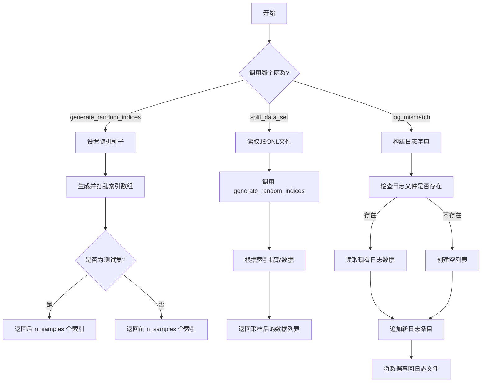
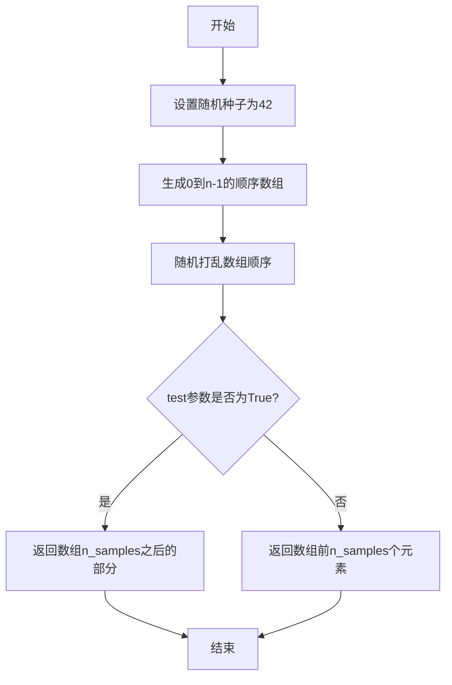
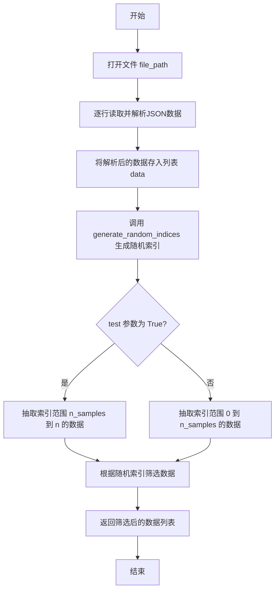
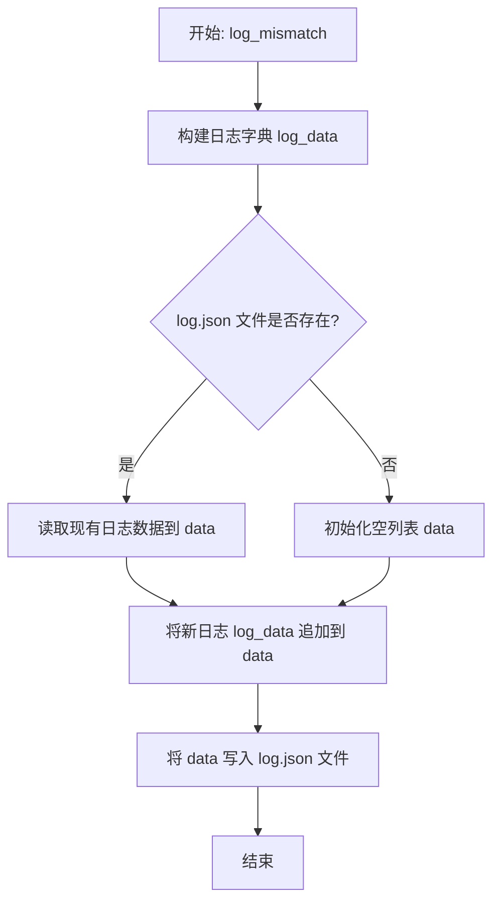

# `.\MetaGPT\metagpt\ext\aflow\benchmark\utils.py` 详细设计文档

该代码文件提供了一系列用于数据处理和日志记录的实用工具函数，主要包括：1) 生成随机索引以进行数据采样；2) 从JSONL文件中读取数据并根据随机索引进行分割；3) 记录模型预测与正确答案不匹配的情况到日志文件中。

## 整体流程



## 类结构

```
utils.py (工具函数集合)
├── generate_random_indices (生成随机索引)
├── split_data_set (分割数据集)
└── log_mismatch (记录不匹配日志)
```

## 全局变量及字段


### `data`
    
用于临时存储从文件中读取的JSON行数据的列表。

类型：`list`
    


### `random_indices`
    
通过generate_random_indices函数生成的随机索引数组，用于从数据集中抽取样本。

类型：`numpy.ndarray`
    


### `log_data`
    
一个字典，用于记录模型预测与期望输出不匹配时的详细信息，包括问题、正确答案、模型输出和提取的输出。

类型：`dict`
    


### `log_file`
    
日志文件的完整路径，用于存储不匹配的记录。

类型：`str`
    


### `data`
    
在log_mismatch函数中，用于存储从现有日志文件读取的日志条目列表，或作为新日志列表的初始值。

类型：`list`
    


    

## 全局函数及方法

### `generate_random_indices`

该函数用于生成一个指定长度的随机索引数组，并根据`test`参数返回数组的前`n_samples`个元素或剩余元素。函数内部通过设置随机种子确保结果可复现。

参数：

- `n`：`int`，需要生成索引的总数，即数组的长度。
- `n_samples`：`int`，需要抽取的样本数量。
- `test`：`bool`，默认为`False`。若为`True`，则返回索引数组中`n_samples`之后的部分；若为`False`，则返回索引数组的前`n_samples`个元素。

返回值：`numpy.ndarray`，一个包含随机索引的NumPy数组。

#### 流程图



#### 带注释源码

```python
def generate_random_indices(n, n_samples, test=False):
    """
    Generate random indices
    """

    def _set_seed(seed=42):
        np.random.seed(seed)  # 设置NumPy的随机种子，确保结果可复现

    _set_seed()  # 调用内部函数设置种子
    indices = np.arange(n)  # 生成一个从0到n-1的顺序数组
    np.random.shuffle(indices)  # 随机打乱数组顺序
    if test:
        return indices[n_samples:]  # 如果test为True，返回打乱后数组的n_samples之后部分
    else:
        return indices[:n_samples]  # 如果test为False，返回打乱后数组的前n_samples个元素
```

### `split_data_set`

该函数用于从指定的JSONL文件中读取数据，并根据给定的样本数量随机抽取一部分数据。它通过调用`generate_random_indices`函数生成随机索引，然后根据这些索引从原始数据中筛选出对应的数据条目，最终返回筛选后的数据列表。

参数：

- `file_path`：`str`，JSONL格式数据文件的路径。
- `samples`：`int`，需要抽取的样本数量。
- `test`：`bool`，指示是否抽取测试集。若为`True`，则抽取索引范围在`[n_samples, n)`的数据；若为`False`，则抽取索引范围在`[0, n_samples)`的数据。

返回值：`list`，包含随机抽取的数据条目的列表。

#### 流程图



#### 带注释源码

```python
def split_data_set(file_path, samples, test=False):
    # 初始化一个空列表用于存储从文件中读取的数据
    data = []

    # 打开指定路径的文件，以只读模式读取
    with open(file_path, "r") as file:
        # 逐行读取文件内容
        for line in file:
            # 将每行的JSON字符串解析为Python对象，并添加到data列表中
            data.append(json.loads(line))
    
    # 调用generate_random_indices函数生成随机索引
    # 参数：数据总长度、样本数量、是否为测试集标志
    random_indices = generate_random_indices(len(data), samples, test)
    
    # 根据生成的随机索引从data列表中筛选出对应的数据条目
    data = [data[i] for i in random_indices]
    
    # 返回筛选后的数据列表
    return data
```

### `log_mismatch`

该函数用于记录模型预测结果与期望输出之间的不匹配信息。它将问题、正确答案、模型原始输出以及从模型输出中提取的数值等信息，以JSON格式追加记录到指定路径下的`log.json`文件中。如果目标日志文件不存在，则会创建新文件。

参数：

- `problem`：`str`，需要模型回答的问题或输入文本。
- `expected_output`：`str`，该问题对应的标准答案或期望输出。
- `prediction`：`str`，模型对该问题的原始输出文本。
- `predicted_number`：`str`，从模型原始输出中提取出的数值结果。
- `path`：`str`，日志文件`log.json`的存储目录路径。

返回值：`None`，该函数没有返回值，其作用是将数据写入文件。

#### 流程图



#### 带注释源码

```python
def log_mismatch(problem, expected_output, prediction, predicted_number, path):
    # 1. 将传入的参数组织成一个字典，便于后续以JSON格式记录
    log_data = {
        "question": problem,
        "right_answer": expected_output,
        "model_output": prediction,
        "extracted_output": predicted_number,
    }

    # 2. 根据传入的路径参数，拼接出完整的日志文件路径
    log_file = os.path.join(path, "log.json")

    # 3. 检查日志文件是否已存在，以决定是读取现有数据还是创建新列表
    if os.path.exists(log_file):
        # 如果文件存在，则读取文件中的现有JSON数据
        data = read_json_file(log_file)
    else:
        # 如果文件不存在，则初始化一个空列表用于存放日志条目
        data = []

    # 4. 将本次的日志数据追加到列表中
    data.append(log_data)

    # 5. 将更新后的列表数据写回（或新建）日志文件
    write_json_file(log_file, data, encoding="utf-8", indent=4)
```

## 关键组件


### 数据采样与索引生成

通过`generate_random_indices`函数实现，用于从指定数量的数据中随机抽取固定数量的索引，支持训练/测试集划分。

### 数据集分割与加载

通过`split_data_set`函数实现，从指定的JSONL文件中读取数据，并根据随机生成的索引列表对数据进行采样，返回训练或测试子集。

### 结果比对与日志记录

通过`log_mismatch`函数实现，用于记录模型预测结果与标准答案不匹配的案例，并将详细信息以JSON格式追加保存到日志文件中。


## 问题及建议


### 已知问题

-   **函数职责不单一**：`split_data_set` 函数同时负责读取文件、解析JSON行、生成随机索引和筛选数据。这违反了单一职责原则，使得函数难以测试、理解和复用。
-   **硬编码的随机种子**：`generate_random_indices` 函数内部固定了随机种子 (`seed=42`)，这虽然保证了可复现性，但也意味着所有调用该函数的地方都无法灵活地控制随机性，降低了代码的灵活性。
-   **潜在的I/O性能瓶颈**：`split_data_set` 函数使用 `for line in file:` 循环逐行读取和解析JSON。对于大型文件，这种方式效率较低，可能成为性能瓶颈。
-   **异常处理缺失**：代码中没有对文件不存在、JSON解析错误、路径创建失败等常见异常进行捕获和处理，可能导致程序在运行时意外崩溃。
-   **日志文件并发写入风险**：`log_mismatch` 函数在读取现有日志文件和写入新数据之间不是原子操作。在多进程或多线程环境下，可能导致日志数据丢失或损坏（竞态条件）。
-   **代码复用性差**：`split_data_set` 函数与特定的数据格式（每行一个JSON对象）和文件读取逻辑紧密耦合，难以直接用于其他格式的数据源。

### 优化建议

-   **重构函数以遵循单一职责原则**：将 `split_data_set` 函数拆分为更小的、功能独立的函数。例如，可以分离出 `load_jsonl_file`（读取并解析JSON行文件）、`sample_indices`（生成样本索引）和 `select_items_by_indices`（根据索引选择数据项）。
-   **将随机种子参数化**：修改 `generate_random_indices` 函数，使其接受一个可选的 `seed` 参数。调用者可以根据需要传入不同的种子或 `None`（使用系统时间）。这可以在保证可复现性的同时提供灵活性。
-   **优化文件读取方式**：考虑使用更高效的方式读取JSON行文件，例如使用 `jsonlines` 库，或者使用列表推导式配合 `map` 函数。对于非常大的文件，可以考虑流式处理或分块读取。
-   **添加健壮的异常处理**：在文件操作（`open`）、JSON解析（`json.loads`）和路径操作（`os.path.join`, `os.path.exists`）周围添加 `try-except` 块，以优雅地处理可能出现的 `FileNotFoundError`、`JSONDecodeError`、`OSError` 等异常，并记录有意义的错误信息。
-   **确保日志写入的线程/进程安全**：为 `log_mismatch` 函数添加锁机制（例如使用 `threading.Lock` 或 `multiprocessing.Lock`），或者将读取-追加-写入操作封装在一个原子事务中（虽然标准文件操作难以实现，但使用锁是常见做法）。更好的方式是使用成熟的日志库（如 `logging` 模块），它们通常内置了线程安全处理。
-   **提高代码的抽象和复用能力**：将数据加载和采样逻辑抽象化。例如，可以设计一个通用的数据采样器类，它接受一个数据列表或可迭代对象以及采样参数，而不是与特定的文件格式绑定。这样相同的采样逻辑可以应用于内存中的数据或从数据库查询的结果。
-   **考虑使用类型注解**：为函数参数和返回值添加类型注解（Type Hints），这可以显著提高代码的可读性，并方便使用静态类型检查工具（如 `mypy`）来提前发现潜在的类型错误。


## 其它


### 设计目标与约束

本模块旨在提供数据处理和日志记录相关的通用工具函数。设计目标包括：1) 提供可复用的随机索引生成和数据分割功能；2) 实现结构化的错误结果日志记录，便于后续分析；3) 保持函数职责单一，降低模块间耦合。主要约束是依赖外部库（如numpy）和项目内部工具函数（`read_json_file`, `write_json_file`），需确保这些依赖的稳定性和可用性。

### 错误处理与异常设计

当前代码对错误处理考虑不足。例如，`split_data_set`函数假设文件存在且格式正确，若文件不存在或非标准JSON Lines格式，将抛出未处理的异常。`log_mismatch`函数依赖的`read_json_file`和`write_json_file`可能抛出IO或JSON解析错误，但本模块未进行捕获或处理。建议增加`try-except`块来捕获`FileNotFoundError`、`JSONDecodeError`、`IOError`等异常，并根据场景选择记录日志、抛出封装后的业务异常或返回错误标识。

### 数据流与状态机

模块内数据流清晰且线性。`generate_random_indices`：输入参数 -> 内部设置随机种子 -> 生成并打乱索引数组 -> 根据`test`标志返回切片。`split_data_set`：文件路径 -> 逐行读取并解析JSON -> 调用`generate_random_indices`获取索引 -> 根据索引筛选数据 -> 返回列表。`log_mismatch`：输入问题、答案、预测等信息 -> 构建字典对象 -> 检查日志文件是否存在 -> 读取现有数据或初始化新列表 -> 追加新条目 -> 写回文件。整个过程无复杂状态转移，属于纯函数或过程式操作。

### 外部依赖与接口契约

1.  **外部库依赖**：`numpy`（用于生成随机索引和数组操作），`json`（用于JSON解析），`os`（用于路径操作）。需在项目环境中确保这些库已正确安装。
2.  **内部项目依赖**：`from metagpt.utils.common import read_json_file, write_json_file`。这两个函数是本模块与项目其他部分的关键接口。其契约是：`read_json_file(file_path)`应返回从指定路径解析出的Python对象（如列表、字典）；`write_json_file(file_path, data, encoding, indent)`应将`data`对象序列化为JSON并写入指定路径。本模块的`log_mismatch`功能正确性严重依赖于这两个函数的实现。
3.  **函数接口契约**：
    *   `generate_random_indices(n, n_samples, test=False)`：要求`n`和`n_samples`为整数，且`n_samples <= n`。返回一个numpy数组。
    *   `split_data_set(file_path, samples, test=False)`：要求`file_path`指向一个合法的JSON Lines格式文件。返回一个Python列表。
    *   `log_mismatch(problem, expected_output, prediction, predicted_number, path)`：要求`path`是一个有效的目录路径。无返回值，但会产生副作用（写入文件）。

### 性能考虑

1.  `split_data_set`函数将整个文件内容一次性加载到内存列表`data`中。如果处理的文件非常大（例如数GB的JSON Lines文件），可能导致内存溢出。建议对于大文件考虑流式读取或分块处理。
2.  `log_mismatch`函数在每次调用时都会读取整个日志文件，追加一条记录后再完整写回。当日志文件变得很大时，I/O操作会成为性能瓶颈，且存在并发写入冲突的风险（如果多个进程同时调用）。建议采用更高效的日志记录机制，如使用`logging`模块按行追加，或使用数据库存储日志条目。

### 安全性与合规性

1.  `split_data_set`和`log_mismatch`函数直接使用传入的`file_path`和`path`参数进行文件操作，存在路径遍历攻击的风险（如果参数来自不可信的用户输入）。应增加输入验证，例如检查路径是否在预期的工作目录内。
2.  `log_mismatch`记录的数据可能包含敏感信息（如原始问题、模型预测），需确保日志文件的存储位置和访问权限符合数据安全规定。
3.  当前代码未显式指定文件编码（除了`write_json_file`调用中的`encoding='utf-8'`）。在`split_data_set`中使用默认编码打开文件，在不同系统环境下可能导致乱码。建议统一明确指定编码（如`utf-8`）。

### 测试策略建议

1.  **单元测试**：应为每个函数编写单元测试。`generate_random_indices`需测试边界条件（如`n_samples`等于0或`n`）、`test`标志为True/False时的输出。`split_data_set`需模拟文件存在/不存在、空文件、格式错误等场景。`log_mismatch`需测试日志文件创建、追加、以及`read_json_file`/`write_json_file`异常时的行为。
2.  **集成测试**：测试本模块与`metagpt.utils.common`模块的集成，确保文件读写接口按预期工作。
3.  **性能测试**：针对大文件场景测试`split_data_set`的内存使用和`log_mismatch`的I/O性能。

    