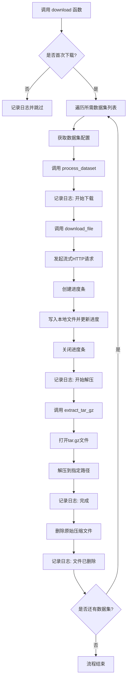
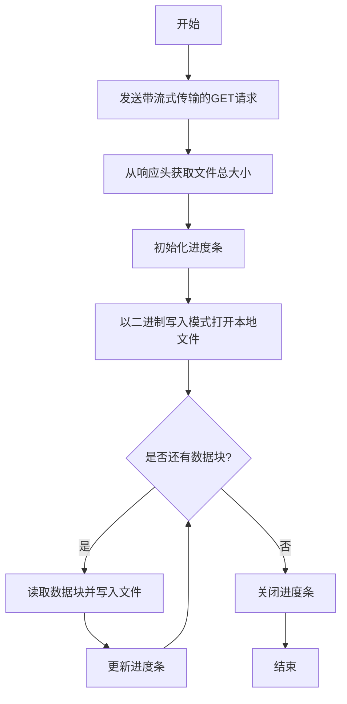
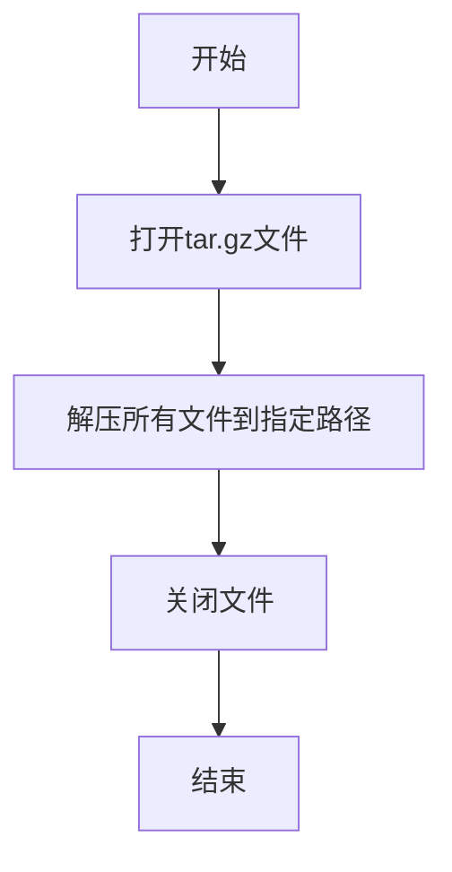
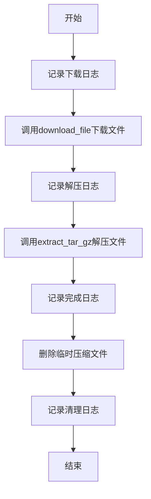
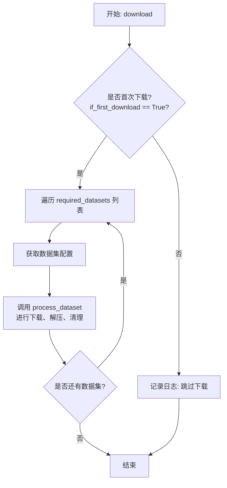

# `.\MetaGPT\metagpt\ext\aflow\data\download_data.py` 详细设计文档

该代码是一个数据集下载和提取工具，主要功能是从预定义的Google Drive URL下载压缩格式（.tar.gz）的数据集文件，在下载过程中显示进度条，下载完成后自动解压到指定目录，并清理下载的原始压缩文件。

## 整体流程



## 类结构

```
全局函数
├── download_file
├── extract_tar_gz
├── process_dataset
└── download
```

## 全局变量及字段


### `datasets_to_download`
    
一个字典，定义了可供下载的数据集信息，包括每个数据集的下载URL、压缩文件名和提取路径。

类型：`Dict[str, Dict[str, str]]`
    


    

## 全局函数及方法

### `download_file`

该函数用于从指定的URL下载文件，并在下载过程中显示进度条。

参数：

- `url`：`str`，要下载文件的URL地址
- `filename`：`str`，下载后保存到本地的文件名

返回值：`None`，该函数不返回任何值，仅执行下载操作

#### 流程图



#### 带注释源码

```python
def download_file(url: str, filename: str) -> None:
    """Download a file from the given URL and show progress."""
    # 发送GET请求，启用流式传输以支持大文件下载
    response = requests.get(url, stream=True)
    
    # 从响应头获取文件总大小，如果不存在则默认为0
    total_size = int(response.headers.get("content-length", 0))
    
    # 定义数据块大小（1KB）
    block_size = 1024
    
    # 初始化进度条，显示总大小和单位
    progress_bar = tqdm(total=total_size, unit="iB", unit_scale=True)

    # 以二进制写入模式打开文件
    with open(filename, "wb") as file:
        # 迭代读取响应数据，每次读取block_size大小的数据块
        for data in response.iter_content(block_size):
            # 将数据块写入文件，并获取写入的字节数
            size = file.write(data)
            # 更新进度条，增加已写入的字节数
            progress_bar.update(size)
    
    # 下载完成后关闭进度条
    progress_bar.close()
```

### `extract_tar_gz`

该函数用于解压一个 `.tar.gz` 格式的压缩文件到指定的目录路径。

参数：
-  `filename`：`str`，需要解压的 `.tar.gz` 文件的路径。
-  `extract_path`：`str`，解压后文件的目标存放目录路径。

返回值：`None`，该函数不返回任何值，其作用是将文件解压到指定目录。

#### 流程图



#### 带注释源码

```python
def extract_tar_gz(filename: str, extract_path: str) -> None:
    """Extract a tar.gz file to the specified path."""
    # 使用 `tarfile` 模块以读取模式（`r:`）和 gzip 压缩（`:gz`）打开指定的文件
    with tarfile.open(filename, "r:gz") as tar:
        # 将 tar 文件中的所有成员解压到 `extract_path` 指定的目录
        tar.extractall(path=extract_path)
```

### `process_dataset`

该函数负责下载、解压并清理一个数据集文件。它首先从指定的URL下载一个压缩文件，然后将其解压到目标路径，最后删除下载的临时压缩文件。

参数：

- `url`：`str`，数据集文件的下载URL地址。
- `filename`：`str`，下载到本地的压缩文件的名称。
- `extract_path`：`str`，解压文件的目标路径。

返回值：`None`，该函数不返回任何值，所有操作均为副作用。

#### 流程图



#### 带注释源码

```python
def process_dataset(url: str, filename: str, extract_path: str) -> None:
    """Download, extract, and clean up a dataset."""
    # 步骤1：记录开始下载的日志信息
    logger.info(f"Downloading {filename}...")
    # 步骤2：调用辅助函数，从指定URL下载文件到本地
    download_file(url, filename)

    # 步骤3：记录开始解压的日志信息
    logger.info(f"Extracting {filename}...")
    # 步骤4：调用辅助函数，将下载的压缩文件解压到指定路径
    extract_tar_gz(filename, extract_path)

    # 步骤5：记录下载和解压完成的日志信息
    logger.info(f"{filename} download and extraction completed.")

    # 步骤6：删除本地的临时压缩文件以清理空间
    os.remove(filename)
    # 步骤7：记录文件已删除的日志信息
    logger.info(f"Removed {filename}")
```


### `download`

`download` 函数是处理数据集下载和提取的主入口函数。它根据传入的参数列表和标志位，决定是下载并处理指定的数据集，还是跳过下载过程。

参数：

-  `required_datasets`：`list` 或 `iterable`，需要下载的数据集名称列表。
-  `if_first_download`：`bool`，是否执行首次下载的标志。如果为 `True`，则下载并处理指定的数据集；如果为 `False`，则跳过下载过程。

返回值：`None`，该函数不返回任何值，其作用是通过下载、解压和清理文件来完成数据处理流程。

#### 流程图



#### 带注释源码

```python
def download(required_datasets, if_first_download: bool = True):
    """Main function to process all selected datasets"""
    # 检查是否需要进行首次下载
    if if_first_download:
        # 遍历用户指定的数据集名称列表
        for dataset_name in required_datasets:
            # 根据数据集名称从全局配置字典中获取对应的配置信息（URL、文件名、解压路径）
            dataset = datasets_to_download[dataset_name]
            # 从配置中获取解压目标路径
            extract_path = dataset["extract_path"]
            # 调用核心处理函数，依次执行下载、解压、删除压缩包操作
            process_dataset(dataset["url"], dataset["filename"], extract_path)
    else:
        # 如果不需要下载，则记录日志并跳过所有操作
        logger.info("Skip downloading datasets")
```


## 关键组件


### 数据集下载管理器

负责管理多个数据集的下载、解压和清理流程，通过统一的配置字典定义数据集来源、目标文件名和提取路径，并支持选择性下载。

### 文件下载器

通过HTTP流式下载文件，并利用进度条实时显示下载进度，确保大文件下载的可视化和可靠性。

### 压缩文件解压器

专门处理`.tar.gz`格式的压缩文件，将其内容解压到指定的目录路径中。

### 数据集处理流水线

整合下载、解压和后续清理（如删除原始压缩包）步骤，为单个数据集提供完整的端到端处理流程。

### 配置驱动的数据集列表

使用一个中心化的字典来定义所有可下载的数据集元信息（URL、文件名、解压路径），使数据集的管理和扩展变得清晰和集中。


## 问题及建议


### 已知问题

-   **硬编码的配置**：数据集URL、文件名和提取路径被硬编码在全局字典 `datasets_to_download` 中。这使得添加、修改或移除数据集变得困难，需要直接修改源代码，降低了代码的可维护性和灵活性。
-   **缺乏错误处理与重试机制**：`download_file` 和 `extract_tar_gz` 函数在网络请求失败、文件损坏或磁盘空间不足时，会直接抛出异常并导致程序崩溃。没有实现重试逻辑或更优雅的错误恢复机制。
-   **潜在的资源泄漏**：`download_file` 函数中，如果文件写入过程发生异常，`progress_bar.close()` 可能不会被执行，导致进度条资源未正确释放。虽然Python的垃圾回收最终会处理，但显式管理更佳。
-   **不完整的下载验证**：代码仅依赖HTTP响应的 `content-length` 头来显示进度，但下载完成后没有验证文件的完整性（例如，通过校验和或文件大小），可能导致使用损坏的数据集。
-   **同步阻塞下载**：`download_file` 函数是同步和阻塞的。在下载大型文件时，这会阻塞主线程，无法同时处理其他任务或提供更细粒度的进度反馈。
-   **文件删除风险**：`process_dataset` 函数在解压后立即删除压缩包。如果后续解压或处理步骤失败，原始数据将丢失，用户需要重新下载。
-   **路径处理不健壮**：`extract_path` 在传递给 `tar.extractall` 前，没有确保目录存在。虽然 `tarfile` 可能会创建目录，但显式创建更安全。此外，路径使用了硬编码的 `metagpt/ext/aflow/` 前缀，缺乏可配置性。

### 优化建议

-   **外部化配置**：将 `datasets_to_download` 字典移至外部配置文件（如JSON、YAML）或环境变量中。这样可以在不修改代码的情况下管理数据集列表，也便于不同环境（开发、测试、生产）使用不同的配置。
-   **增强错误处理**：
    -   在 `download_file` 中使用 `try...except` 块捕获 `requests` 异常和IO异常。
    -   为网络请求添加重试机制（例如，使用 `tenacity` 库或自定义重试逻辑）。
    -   在 `extract_tar_gz` 中捕获 `tarfile` 异常。
    -   在 `process_dataset` 中，将 `os.remove` 放在 `finally` 块中或仅在验证解压成功后才执行。
-   **使用上下文管理器管理资源**：确保 `progress_bar` 在 `with tqdm(...) as progress_bar:` 语句块中使用，以保证在任何情况下都能正确关闭。
-   **添加完整性校验**：下载完成后，计算文件的哈希值（如MD5、SHA256）并与预存的哈希值进行比较，确保文件完整无误。可以将哈希值一并存储在配置文件中。
-   **实现异步或并行下载**：对于需要下载多个数据集的情况，可以考虑使用 `asyncio` + `aiohttp` 进行异步下载，或者使用 `concurrent.futures` 实现并行下载，以提升效率。
-   **改进文件管理策略**：
    -   在删除压缩包前，先验证目标提取目录中是否已存在预期文件。
    -   提供一个命令行参数或配置选项，允许用户选择是否保留下载的压缩包。
-   **强化路径与目录管理**：
    -   在 `process_dataset` 或 `extract_tar_gz` 中，使用 `os.makedirs(extract_path, exist_ok=True)` 确保提取目录存在。
    -   将基础路径（如 `metagpt/ext/aflow/`）作为可配置的根目录，使脚本更容易集成到不同的项目结构中。
-   **提升日志信息**：当前的日志信息较为基础。可以增加更详细的日志，如下载开始/结束时间、下载速度、解压文件列表等，便于监控和调试。
-   **增加干运行模式**：为 `download` 函数增加一个 `dry_run` 参数，当设置为 `True` 时，只打印将要执行的操作（如下载URL、目标路径等），而不实际执行，方便用户预览。
-   **函数职责分离**：`process_dataset` 函数同时负责下载、解压和清理。考虑将其拆分为更细粒度的函数（如 `download_if_not_exists`, `verify_integrity`, `extract_safely`），每个函数只做一件事，提高可测试性和复用性。


## 其它


### 设计目标与约束

本模块的核心设计目标是提供一个简单、可靠且可扩展的数据集下载与解压工具。其核心约束包括：1) 必须支持从远程URL下载大型文件，并显示进度；2) 必须支持解压`.tar.gz`格式的压缩包；3) 必须允许用户通过配置选择需要下载的数据集；4) 操作完成后应自动清理下载的压缩文件以节省磁盘空间；5) 代码应具备良好的日志记录能力，以便于跟踪和调试。

### 错误处理与异常设计

当前代码的错误处理较为基础，主要依赖Python内置异常和`requests`库的异常。例如，`requests.get`可能抛出连接超时、HTTP错误等异常，`tarfile.open`可能因文件损坏或路径问题抛出`tarfile.TarError`，文件操作可能抛出`OSError`。然而，代码中并未显式捕获和处理这些异常，这可能导致程序意外终止。一个健壮的设计应包含`try-except`块来捕获潜在异常，记录详细的错误日志，并根据错误类型进行重试、跳过或向用户报告等操作。

### 数据流与状态机

模块的数据流清晰且线性：1) 用户通过`download`函数入口，传入所需数据集列表和首次下载标志。2) 若为首次下载，函数遍历列表，从`datasets_to_download`字典中获取每个数据集的配置（URL、文件名、解压路径）。3) 调用`process_dataset`函数，该函数依次执行：调用`download_file`从网络下载文件到本地；调用`extract_tar_gz`将下载的压缩包解压到指定目录；调用`os.remove`删除本地压缩包。整个过程是顺序执行、无状态转换的，每个数据集的处理相互独立。没有复杂的并发或状态机逻辑。

### 外部依赖与接口契约

**外部依赖：**
1.  `requests`: 用于发起HTTP请求以下载文件。接口契约：期望远程服务器支持HTTP GET请求并返回文件流。
2.  `tqdm`: 用于在控制台显示文件下载进度条。这是一个纯展示性依赖。
3.  `tarfile`: Python标准库，用于解压`.tar.gz`格式文件。
4.  `metagpt.logs.logger`: 项目内部的日志记录器，用于输出信息、警告和错误日志。契约是它提供了`info`等方法。

**接口契约（函数签名与行为）：**
*   `download(required_datasets, if_first_download=True)`: 主入口。`required_datasets`参数应为一个包含`datasets_to_download`字典中键名的列表。函数行为是下载并处理列表中指定的所有数据集，除非`if_first_download`为`False`。
*   `datasets_to_download`字典：作为配置接口，其结构是固定的，每个条目必须包含`"url"`、`"filename"`、`"extract_path"`三个键。用户通过修改此字典来配置要处理的数据集。

### 配置管理

当前模块的配置是硬编码在代码中的`datasets_to_download`字典。这种方式虽然简单直接，但缺乏灵活性。任何数据集URL、文件名或路径的变更都需要直接修改源代码，不利于维护和不同环境（开发、测试、生产）的部署。优化的方向是将配置外部化，例如使用JSON、YAML配置文件或环境变量，使配置与代码分离，便于管理和动态调整。

### 安全考虑

1.  **文件路径安全**：`extract_tar_gz`函数使用`tar.extractall(path=extract_path)`，如果压缩包内包含绝对路径或恶意构造的`..`路径，可能导致文件被提取到预期之外的目录（路径遍历攻击）。更安全的做法是使用`tar.extractall(path=extract_path, filter='data')`（Python 3.12+）或手动检查并清理成员路径。
2.  **下载源可信度**：代码从固定的Google Drive链接下载文件。需要确保这些链接是官方、可信的来源，防止下载到恶意篡改的数据。
3.  **临时文件清理**：代码在解压后立即删除压缩包，这是一个好的做法，避免了残留文件。但如果下载或解压过程失败，可能会留下不完整的文件。更完善的清理逻辑应在异常处理中考虑。

### 测试策略建议

1.  **单元测试**：
    *   `download_file`: 模拟`requests`响应，测试正常下载、网络错误、内容长度缺失等情况。
    *   `extract_tar_gz`: 使用预制的测试用`.tar.gz`文件，测试正常解压、解压到不存在的路径、处理损坏压缩包等情况。
    *   `process_dataset`: 模拟`download_file`和`extract_tar_gz`，测试其组合逻辑和文件清理行为。
2.  **集成测试**：在可控的测试环境中，使用一个小的测试数据集URL，运行完整的`download`函数流程，验证从下载、解压到清理的端到端功能。
3.  **配置测试**：测试`datasets_to_download`字典配置错误（如缺少必要键、URL无效）时程序的反应。
4.  **Mock使用**：在测试中广泛使用`unittest.mock`来模拟网络请求、文件系统操作和日志记录，使测试快速、独立且不依赖外部资源。

    