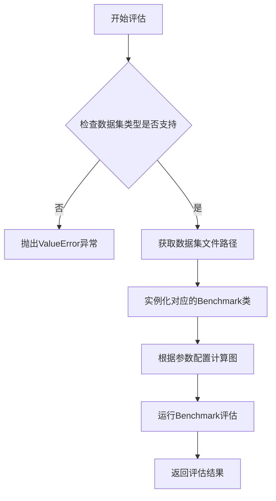
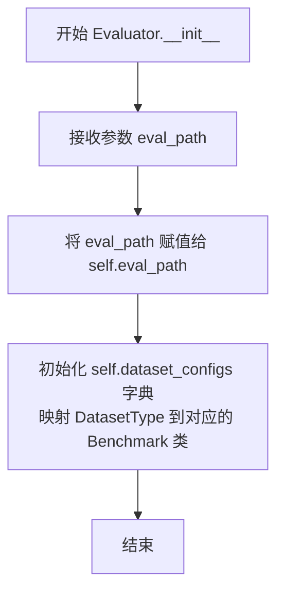
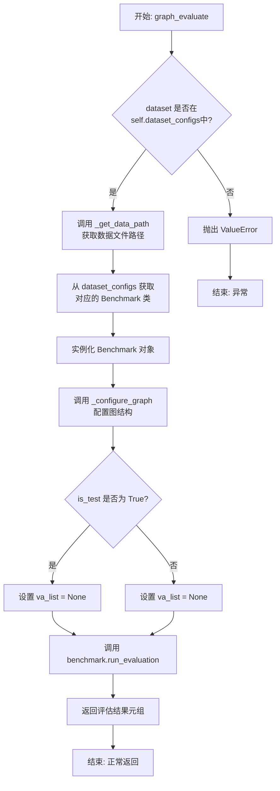
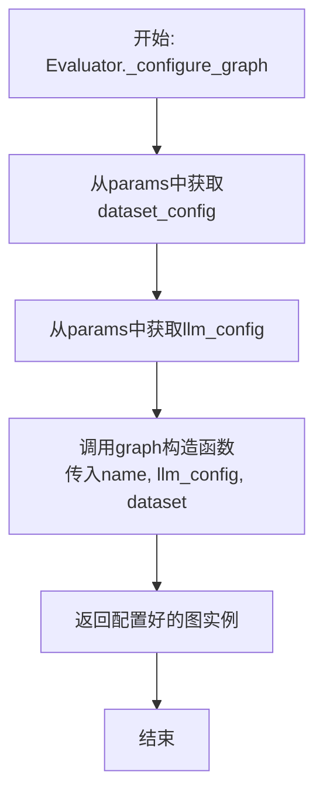
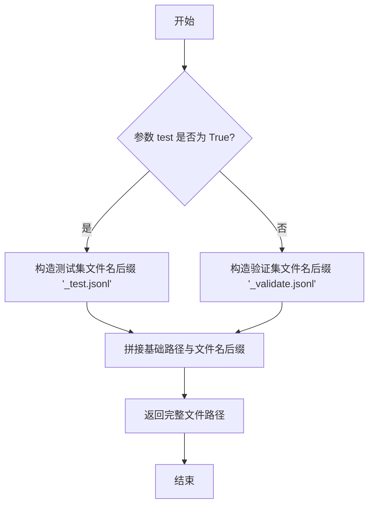

# `.\MetaGPT\metagpt\ext\aflow\scripts\evaluator.py` 详细设计文档

该代码实现了一个评估器（Evaluator），用于对不同的AI基准测试数据集（如HumanEval、GSM8K、MATH等）进行自动化评估。它通过配置不同的基准测试类（Benchmark）来加载对应数据集，并支持传入一个可配置的计算图（graph）和参数（params）来执行评估任务，最终返回评估结果（如准确率等指标）。

## 整体流程



## 类结构

```
Evaluator (评估器主类)
├── __init__ (初始化方法)
├── graph_evaluate (主评估方法)
├── _configure_graph (私有方法: 配置计算图)
└── _get_data_path (私有方法: 获取数据路径)
```

## 全局变量及字段


### `DatasetType`
    
一个字符串字面量类型，定义了当前支持的评估数据集类型。

类型：`typing.Literal['HumanEval', 'MBPP', 'GSM8K', 'MATH', 'HotpotQA', 'DROP']`
    


### `Evaluator.eval_path`
    
评估结果或相关文件的存储路径。

类型：`str`
    


### `Evaluator.dataset_configs`
    
一个字典，将数据集类型映射到对应的基准测试类，用于实例化具体的评估器。

类型：`Dict[DatasetType, BaseBenchmark]`
    
    

## 全局函数及方法


### `Evaluator.__init__`

`Evaluator` 类的构造函数，用于初始化评估器实例。它接收一个评估路径参数，并初始化一个内部字典，该字典将数据集类型映射到对应的基准测试类，为后续的评估任务做好准备。

参数：

-  `eval_path`：`str`，评估过程中使用的根路径或配置文件路径。

返回值：`None`，构造函数不返回任何值。

#### 流程图



#### 带注释源码

```python
def __init__(self, eval_path: str):
    # 存储传入的评估路径，供后续方法（如 _get_data_path）使用
    self.eval_path = eval_path
    # 初始化一个字典，将支持的数据集类型（字符串）映射到对应的基准测试类。
    # 这些类（如 GSM8KBenchmark）负责具体数据集的加载和评估逻辑。
    self.dataset_configs: Dict[DatasetType, BaseBenchmark] = {
        "GSM8K": GSM8KBenchmark,
        "MATH": MATHBenchmark,
        "HumanEval": HumanEvalBenchmark,
        "HotpotQA": HotpotQABenchmark,
        "MBPP": MBPPBenchmark,
        "DROP": DROPBenchmark,
    }
```


### `Evaluator.graph_evaluate`

该方法用于对指定的数据集（dataset）使用给定的图（graph）和配置参数（params）进行评估。它首先验证数据集类型，然后根据是否为测试集构建数据文件路径，接着实例化对应的基准测试类（Benchmark），并根据参数配置图结构，最后调用基准测试的`run_evaluation`方法执行评估并返回结果。

参数：

-  `dataset`：`DatasetType`，指定要评估的数据集类型，例如 "HumanEval"、"GSM8K" 等。
-  `graph`：`Any`，待评估的图结构或图构建函数。
-  `params`：`dict`，包含配置图的参数字典，例如LLM配置（`llm_config`）和数据集配置（`dataset`）。
-  `path`：`str`，日志文件的存储路径。
-  `is_test`：`bool`，可选参数，默认为`False`。指示是否使用测试集进行评估。若为`True`，则使用`{dataset}_test.jsonl`文件；否则使用`{dataset}_validate.jsonl`文件。

返回值：`Tuple[float, float, float]`，返回一个包含三个浮点数的元组，通常代表评估的准确率、召回率、F1分数或其他由具体`Benchmark.run_evaluation`方法定义的指标。

#### 流程图



#### 带注释源码

```python
async def graph_evaluate(
    self, dataset: DatasetType, graph, params: dict, path: str, is_test: bool = False
) -> Tuple[float, float, float]:
    # 1. 检查数据集类型是否受支持
    if dataset not in self.dataset_configs:
        raise ValueError(f"Unsupported dataset: {dataset}")

    # 2. 根据数据集类型和是否为测试集，构建数据文件路径
    data_path = self._get_data_path(dataset, is_test)
    # 3. 获取对应数据集的基准测试类
    benchmark_class = self.dataset_configs[dataset]
    # 4. 实例化基准测试对象，传入数据集名称、数据文件路径和日志路径
    benchmark = benchmark_class(name=dataset, file_path=data_path, log_path=path)

    # 5. 使用传入的 params 配置图结构
    configured_graph = await self._configure_graph(dataset, graph, params)
    # 6. 设置验证/测试数据列表。当前逻辑下，无论 is_test 为何值，va_list 均为 None，
    #    表示使用全部数据。注释提示了未来可按需设置部分数据（如 [1, 2, 3]）。
    if is_test:
        va_list = None  # For test data, generally use None to test all
    else:
        va_list = None  # Use None to test all Validation data, or set va_list (e.g., [1, 2, 3]) to use partial data
    # 7. 调用基准测试对象的评估方法，传入配置好的图和数据列表，并返回评估结果
    return await benchmark.run_evaluation(configured_graph, va_list)
```


### `Evaluator._configure_graph`

该方法根据给定的数据集名称、图对象和参数字典，配置并返回一个已配置的图实例。它从参数字典中提取数据集配置和LLM配置，并将它们作为参数传递给图对象的构造函数。

参数：

-  `dataset`：`DatasetType`，要评估的数据集类型，用于为图实例命名。
-  `graph`：`callable`，一个可调用的图类或图工厂函数，用于创建图实例。
-  `params`：`dict`，一个包含配置参数的字典，通常包含`dataset`和`llm_config`等键。

返回值：`Awaitable[object]`，返回一个异步可等待对象，其最终结果是一个根据参数配置好的图实例。

#### 流程图



#### 带注释源码

```
async def _configure_graph(self, dataset, graph, params: dict):
    # 从参数字典中获取数据集特定的配置，如果不存在则返回空字典
    dataset_config = params.get("dataset", {})
    # 从参数字典中获取LLM（大语言模型）的配置，如果不存在则返回空字典
    llm_config = params.get("llm_config", {})
    # 调用传入的graph可调用对象（通常是一个图类），
    # 传入数据集名称作为图名，以及提取出的LLM配置和数据集配置，
    # 创建并返回一个配置好的图实例。
    return graph(name=dataset, llm_config=llm_config, dataset=dataset_config)
```


### `Evaluator._get_data_path`

该方法根据给定的数据集类型和测试标志，构造并返回对应的数据文件路径。

参数：

-  `dataset`：`DatasetType`，数据集类型，例如 "HumanEval"、"MBPP" 等。
-  `test`：`bool`，布尔标志，指示是否请求测试集（True）或验证集（False）。

返回值：`str`，返回构造出的数据文件的完整路径字符串。

#### 流程图



#### 带注释源码

```python
def _get_data_path(self, dataset: DatasetType, test: bool) -> str:
    # 构造数据文件的基础路径，将数据集名称转换为小写
    base_path = f"metagpt/ext/aflow/data/{dataset.lower()}"
    # 根据 test 参数的值，选择使用测试集文件还是验证集文件
    return f"{base_path}_test.jsonl" if test else f"{base_path}_validate.jsonl"
```


## 关键组件


### 数据集评估框架

一个统一的评估器，用于管理和执行不同数据集（如HumanEval、MBPP、GSM8K等）的基准测试，通过配置化的方式将评估任务委托给具体的基准测试类。

### 基准测试抽象与实现

定义了`BaseBenchmark`抽象基类以及多个具体实现类（如`GSM8KBenchmark`、`MATHBenchmark`等），每个类封装了特定数据集的评估逻辑、数据加载和评分方法。

### 图配置与参数化

提供异步方法`_configure_graph`，用于根据传入的参数（如LLM配置、数据集配置）动态配置和初始化评估所用的计算图（graph），实现评估流程的灵活定制。

### 数据路径管理

通过`_get_data_path`方法，根据数据集名称和测试/验证模式，统一生成对应的数据文件路径，确保数据文件能被正确加载。


## 问题及建议


### 已知问题

-   **硬编码的数据路径**：`_get_data_path` 方法中，数据文件的路径是硬编码的字符串。这降低了代码的灵活性，如果项目结构发生变化或需要支持不同的数据存储位置，修改起来会很麻烦。
-   **配置逻辑过于简单且不完整**：`_configure_graph` 方法目前仅从`params`中提取`dataset`和`llm_config`配置，并直接传递给`graph`。这种配置方式过于简单，缺乏对`graph`对象内部结构的了解，可能无法正确配置所有必要的参数。同时，`params`参数的结构和内容没有明确的文档或类型提示，容易导致调用错误。
-   **测试模式逻辑不清晰**：在`graph_evaluate`方法中，无论`is_test`是`True`还是`False`，`va_list`变量都被设置为`None`，并且注释表明这是为了“测试所有数据”。这混淆了验证集和测试集的概念，使得`is_test`参数的实际作用不明确，可能无法实现预期的“仅测试部分数据”的功能。
-   **缺乏错误处理和日志记录**：代码中没有对文件读取、`graph`配置、`benchmark`运行等关键操作进行显式的错误处理（如`try-except`）。同时，也缺乏详细的日志记录，不利于调试和监控评估过程。
-   **潜在的同步/异步混用风险**：`__init__`和`_get_data_path`是同步方法，而`graph_evaluate`和`_configure_graph`是异步方法。虽然目前没有直接问题，但在更复杂的调用链中，如果同步方法中调用了阻塞的IO操作，可能会影响异步事件循环的性能。

### 优化建议

-   **将数据路径配置化**：建议将数据文件的基础路径（如`"metagpt/ext/aflow/data/"`）甚至完整的路径模板通过配置文件、环境变量或构造函数的参数传入，提高代码的可配置性和可维护性。
-   **重构并明确配置机制**：建议为`graph`对象定义一个明确的配置接口或数据类（例如`GraphConfig`），并在`_configure_graph`方法中根据`dataset`和`params`构建这个配置对象。同时，应为`params`参数添加类型提示（如`TypedDict`）以明确其结构。
-   **明确测试与验证逻辑**：重新设计`graph_evaluate`方法中关于数据加载的逻辑。可以为`va_list`参数设置一个默认值（如`None`表示全部），并允许调用者显式传入。`is_test`参数应严格用于切换加载`_test.jsonl`还是`_validate.jsonl`文件，而具体评估哪些数据条目应由`va_list`控制。同时，更新相关注释。
-   **增强健壮性和可观测性**：
    -   在`graph_evaluate`方法中，使用`try-except`块捕获`benchmark.run_evaluation`等可能抛出的异常，并记录日志或抛出更友好的自定义异常。
    -   在关键步骤（如开始评估、加载数据、完成评估）添加详细的日志记录（使用`logging`模块），输出数据集名称、配置参数、进度和结果等信息。
-   **考虑完全异步化或明确职责**：评估`__init__`和`_get_data_path`中是否有潜在的阻塞操作。如果没有，保持现状即可。如果有，或者为了代码风格统一，可以考虑将它们也改为异步方法，或者确保它们只执行轻量级的逻辑。更清晰的做法是将路径解析等纯计算逻辑与可能涉及IO的配置加载逻辑分离。


## 其它


### 设计目标与约束

本模块的核心设计目标是提供一个统一、可扩展的评估框架，用于对不同的数据集（如代码生成、数学推理、问答等）进行自动化评估。它旨在封装不同数据集的评估细节，向上层提供一致的接口（`graph_evaluate`），简化多数据集评估流程。主要约束包括：1) 必须兼容现有的 `BaseBenchmark` 及其子类接口；2) 评估流程需支持异步操作以适应可能的I/O密集型任务（如调用大语言模型）；3) 数据文件路径需遵循固定的命名和目录结构约定。

### 错误处理与异常设计

模块的错误处理主要围绕输入验证和运行时异常。在 `graph_evaluate` 方法中，首先检查传入的 `dataset` 参数是否在预定义的 `DatasetType` 范围内，若不在则抛出 `ValueError`。在 `_get_data_path` 方法中，假设数据文件存在，未显式处理文件不存在的情况，此错误将传递给底层的 `BaseBenchmark` 类处理。整体设计倾向于将具体的评估错误（如数据解析失败、评估逻辑错误）交由各个 `BaseBenchmark` 子类在其 `run_evaluation` 方法中封装和处理，本 `Evaluator` 类主要作为协调者，不深入处理底层评估异常。

### 数据流与状态机

数据流始于调用者调用 `Evaluator.graph_evaluate` 方法，传入数据集类型、待评估的图结构、配置参数等。`Evaluator` 根据数据集类型选择对应的 `BaseBenchmark` 子类，并调用 `_get_data_path` 确定数据文件路径。随后，通过 `_configure_graph` 方法，利用传入的 `params` 参数对原始的 `graph` 进行配置（如设置LLM参数、数据集特定参数），生成一个已配置的图实例。最后，将此配置好的图实例和验证数据列表（`va_list`）传递给具体 `Benchmark` 实例的 `run_evaluation` 方法，启动评估流程。评估结果（准确率等指标）由 `run_evaluation` 返回，并最终由 `graph_evaluate` 返回给调用者。整个过程是线性的，无复杂的状态转换。

### 外部依赖与接口契约

1.  **外部依赖**：
    *   **`BaseBenchmark` 及其子类 (`DROPBenchmark`, `GSM8KBenchmark` 等)**：定义了评估的核心逻辑和数据加载方式。`Evaluator` 依赖于这些类的构造函数和 `run_evaluation` 异步方法。
    *   **`graph` 参数**：代表一个可调用的图工厂或构造函数，其接口需接受 `name`、`llm_config`、`dataset` 等参数并返回一个可运行的图实例。这是与外部工作流或图执行引擎的契约。
    *   **文件系统**：依赖固定的目录结构 (`metagpt/ext/aflow/data/`) 和文件命名规则 (`{dataset}_validate.jsonl` 或 `{dataset}_test.jsonl`) 来定位数据文件。

2.  **接口契约**：
    *   **`Evaluator.graph_evaluate` 接口**：调用者需提供符合 `DatasetType` 的数据集标识、一个可配置的 `graph` 对象、配置参数字典 `params` 以及日志路径 `path`。它返回一个包含评估指标的元组 `(float, float, float)`。
    *   **`BaseBenchmark.run_evaluation` 接口**：每个 `Benchmark` 子类必须实现此异步方法，接受一个配置好的图实例和一个可选的验证数据索引列表，并返回评估结果元组。

    