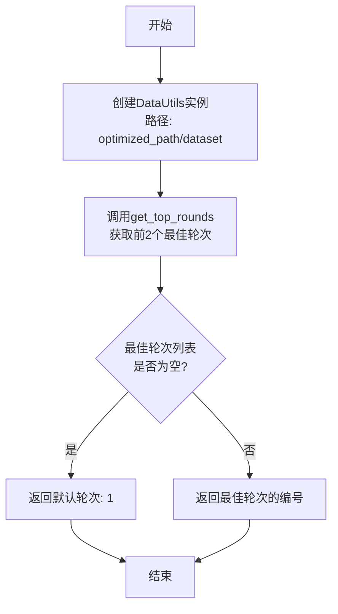
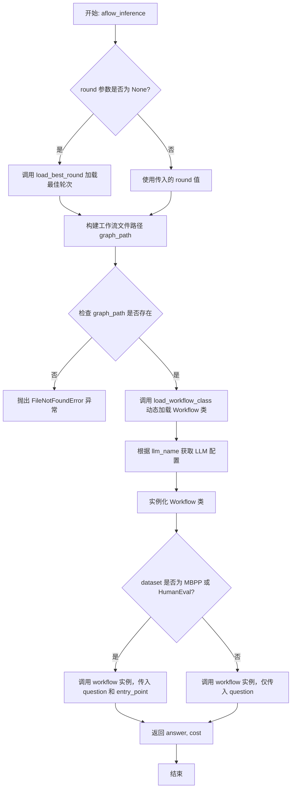

# `.\MetaGPT\metagpt\ext\aflow\scripts\interface.py` 详细设计文档

该代码提供了一个名为AFLOW（可能是Automated Flow的缩写）的推理接口。其核心功能是：根据指定的数据集和问题，动态加载并执行一个预先优化好的工作流（Workflow）来生成答案，同时计算并返回执行成本。它支持自动选择最佳性能的轮次或手动指定轮次，并能处理代码生成类任务所需的额外参数。

## 整体流程

```mermaid
graph TD
    A[开始: 调用aflow_inference] --> B{是否指定round?}
    B -- 否 --> C[调用load_best_round确定最佳轮次]
    B -- 是 --> D[使用指定轮次]
    C --> D
    D --> E[构建工作流文件路径graph_path]
    E --> F{graph_path是否存在?}
    F -- 否 --> G[抛出FileNotFoundError]
    F -- 是 --> H[调用load_workflow_class动态加载Workflow类]
    H --> I[创建LLM配置，实例化Workflow]
    I --> J{数据集是否为MBPP或HumanEval?}
    J -- 是 --> K[调用workflow(question, entry_point=entry_point)]
    J -- 否 --> L[调用workflow(question)]
    K --> M[返回(answer, cost)]
    L --> M
```

## 类结构

```
该文件主要包含函数，无显式的类层次结构。
├── 全局函数: load_best_round, load_workflow_class, aflow_inference
└── 主程序入口: __main__
```

## 全局变量及字段


### `logger`
    
用于记录日志的全局日志记录器实例

类型：`Logger`
    


### `ModelsConfig`
    
用于管理模型配置的配置类

类型：`class`
    


### `DatasetType`
    
表示数据集类型的类型别名或枚举

类型：`type`
    


### `DataUtils`
    
用于处理数据相关操作的实用工具类

类型：`class`
    


    

## 全局函数及方法


### `load_best_round`

该函数用于从指定数据集的优化结果中，加载并返回表现最佳的轮次编号。它通过调用`DataUtils`工具获取评分最高的轮次，如果不存在有效的轮次，则默认返回第一轮。

参数：

-  `dataset`：`str`，数据集名称，用于定位对应的优化结果目录。
-  `optimized_path`：`str`，优化结果保存的根目录路径，默认为`"metagpt/ext/aflow/scripts/optimized"`。

返回值：`int`，返回表现最佳的轮次编号。如果不存在有效的轮次，则返回1。

#### 流程图



#### 带注释源码

```python
def load_best_round(dataset: str, optimized_path: str = "metagpt/ext/aflow/scripts/optimized") -> int:
    """加载最佳表现的轮次"""
    # 1. 根据数据集名称和优化路径，创建数据工具实例
    data_utils = DataUtils(f"{optimized_path}/{dataset}")

    # 2. 调用工具方法，获取评分最高的前2个轮次，模式为"Graph"
    top_rounds = data_utils.get_top_rounds(sample=2, mode="Graph")
    # 3. 检查是否存在有效的轮次（top_rounds[1]可能为None）
    if not top_rounds[1]:
        # 4. 如果没有，则返回默认的第一轮
        return 1

    # 5. 如果存在，则返回最佳轮次的编号
    return top_rounds[1]["round"]
```


### `load_workflow_class`

该函数用于动态加载指定Python文件路径中的`Workflow`类。它通过`importlib`模块，在不将目标文件永久添加到`sys.modules`的情况下，从文件系统中导入模块并返回其`Workflow`类属性。

参数：

-  `graph_path`：`str`，包含目标`Workflow`类定义的Python文件的路径。

返回值：`type`，从指定文件动态加载的`Workflow`类。

#### 流程图

```mermaid
flowchart TD
    A[开始: 输入graph_path] --> B[importlib.util.spec_from_file_location<br>创建模块规范]
    B --> C[importlib.util.module_from_spec<br>根据规范创建模块对象]
    C --> D[sys.modules['workflow_module'] = module<br>将模块临时注册到sys.modules]
    D --> E[spec.loader.exec_module(module)<br>执行模块代码]
    E --> F[return module.Workflow<br>返回模块中的Workflow类]
    F --> G[结束]
```

#### 带注释源码

```python
def load_workflow_class(graph_path: str):
    """动态加载工作流类"""
    # 1. 根据文件路径创建一个模块规范（ModuleSpec）对象。
    #    这相当于为动态导入准备了一个“蓝图”。
    spec = importlib.util.spec_from_file_location("workflow_module", graph_path)
    # 2. 根据上一步创建的规范，生成一个新的、空的模块对象。
    module = importlib.util.module_from_spec(spec)
    # 3. 将这个新模块对象以'workflow_module'为名临时注册到sys.modules中。
    #    这一步是必须的，因为Python在导入模块时会检查sys.modules。
    #    注册后，模块内的代码（如import语句）才能正确解析对自身的引用。
    sys.modules["workflow_module"] = module
    # 4. 执行模块的代码。这会将模块文件中定义的类、函数、变量等加载到上一步创建的module对象中。
    spec.loader.exec_module(module)
    # 5. 从已加载的模块对象中，获取并返回名为'Workflow'的属性（通常是一个类）。
    return module.Workflow
```


### `aflow_inference`

该函数是AFLOW（自适应工作流）系统的核心推理接口。它根据指定的数据集和问题，动态加载并执行一个经过优化的“工作流”类，以生成答案并计算推理成本。其主要职责包括：确定要使用的工作流版本（轮次）、动态加载对应的工作流Python模块、实例化工作流对象，并最终执行推理任务。

参数：

-  `dataset`：`DatasetType`，指定要使用的数据集类型（如MBPP, HumanEval等），这决定了加载哪个优化后的工作流以及推理时的参数。
-  `question`：`str`，用户输入的问题或任务描述，是工作流推理的主要输入。
-  `entry_point`：`Optional[str]`，可选的入口点参数，主要用于代码生成类数据集（如MBPP, HumanEval），指定目标函数的名称。
-  `round`：`Optional[int]`，可选参数，指定要使用的优化轮次。如果为None，则自动加载该数据集下表现最佳的轮次。
-  `llm_name`：`str`，指定用于推理的大语言模型名称，默认为“gpt-4o-mini”。
-  `optimized_path`：`str`，存储优化后工作流文件的根目录路径，默认为“metagpt/ext/aflow/scripts/optimized”。

返回值：`Tuple[str, float]`，返回一个包含两个元素的元组。第一个元素（`str`）是工作流推理后生成的答案文本；第二个元素（`float`）是执行此次推理所消耗的成本。

#### 流程图



#### 带注释源码

```python
async def aflow_inference(
    dataset: DatasetType, # 参数：数据集类型，决定加载哪个工作流
    question: str, # 参数：用户输入的问题
    entry_point: Optional[str] = None, # 参数：可选的入口点（用于代码任务）
    round: Optional[int] = None, # 参数：可选的指定轮次，为空则用最佳轮次
    llm_name: str = "gpt-4o-mini", # 参数：使用的LLM模型名称
    optimized_path: str = "metagpt/ext/aflow/scripts/optimized", # 参数：优化工作流存储路径
) -> Tuple[str, float]: # 返回值：包含答案和成本的元组
    """AFLOW推理接口

    Args:
        dataset: 数据集名称
        question: 输入问题
        round: 指定使用的轮次，如果为None则使用最佳轮次
        llm_name: 使用的LLM模型名称
        optimized_path: 优化结果保存路径

    Returns:
        (答案, 成本)的元组
    """
    # 如果没有指定轮次，使用最佳轮次
    if round is None:
        round = load_best_round(dataset, optimized_path) # 调用辅助函数确定最佳轮次

    logger.info(f"Using round {round} for inference") # 记录日志

    # 构建工作流路径并加载
    graph_path = Path(optimized_path) / dataset / "workflows" / f"round_{round}" / "graph.py" # 根据参数拼接工作流文件路径
    if not graph_path.exists(): # 检查文件是否存在
        raise FileNotFoundError(f"Workflow file not found: {graph_path}") # 不存在则抛出异常

    # 动态加载工作流类
    WorkflowClass = load_workflow_class(str(graph_path)) # 调用辅助函数动态导入模块并获取Workflow类

    # 创建工作流实例
    llm_config = ModelsConfig.default().get(llm_name) # 根据模型名称获取LLM配置
    workflow = WorkflowClass( # 实例化工作流对象
        name=f"{dataset}_workflow",
        llm_config=llm_config,
        dataset=dataset,
    )

    # 执行推理
    if dataset in ["MBPP", "HumanEval"]: # 判断是否为代码生成类数据集
        # 代码类任务需要额外的entry_point参数
        answer, cost = await workflow(question, entry_point=entry_point) # 异步调用工作流，传入额外参数
    else:
        answer, cost = await workflow(question) # 异步调用工作流，仅传入问题

    return answer, cost # 返回推理结果和成本
```

## 关键组件


### 动态工作流加载器

负责根据指定的路径动态加载包含`Workflow`类的Python模块，实现了工作流代码的运行时加载与实例化，支持AFLOW系统灵活调用不同轮次优化后的工作流。

### 最佳轮次选择器

根据存储在指定路径下的优化结果数据，自动评估并选择在特定数据集上表现最佳的工作流执行轮次，为推理过程提供最优的起点。

### 配置化LLM管理器

通过统一的配置对象`ModelsConfig`来管理和获取不同LLM模型（如`gpt-4o-mini`）的配置参数，确保工作流实例能够使用正确的模型设置进行初始化。

### 多数据集推理适配器

在核心推理接口`aflow_inference`中，根据输入的数据集类型（如`MBPP`, `HumanEval`）自动适配不同的调用参数（例如为代码生成类任务传递`entry_point`），实现了统一接口下的差异化处理逻辑。


## 问题及建议


### 已知问题

-   **硬编码路径和配置**：代码中多处使用了硬编码的字符串路径（如 `optimized_path="metagpt/ext/aflow/scripts/optimized"`），这使得代码的可移植性和可配置性较差。如果项目结构或部署环境发生变化，需要修改多处代码。
-   **动态导入的潜在风险**：`load_workflow_class` 函数使用 `importlib` 动态加载 Python 模块。如果加载的 `graph.py` 文件包含恶意代码或存在语法错误，可能会引发安全风险或运行时异常，且错误信息可能不够清晰。
-   **错误处理不完善**：`load_best_round` 函数在 `top_rounds[1]` 为空时直接返回 `1`，这可能掩盖了数据加载失败或数据格式不正确的根本问题。主函数 `aflow_inference` 中的 `FileNotFoundError` 是唯一的显式异常处理，对于工作流执行过程中可能发生的其他错误（如网络超时、LLM API 错误）缺乏处理。
-   **代码重复与条件分支**：在 `aflow_inference` 函数中，根据 `dataset` 类型决定是否传递 `entry_point` 参数，这导致了条件分支和潜在的代码重复。如果未来支持更多类型的任务，此分支逻辑会变得更加复杂。
-   **同步与异步混合**：主模块中定义了同步函数 `load_best_round` 和 `load_workflow_class`，而核心的 `aflow_inference` 是异步函数。虽然这在当前简单场景下可行，但在更复杂的并发或集成场景中，混合使用可能带来不必要的复杂性。
-   **缺乏缓存机制**：每次调用 `aflow_inference` 都可能重新加载工作流类和数据，对于频繁的推理请求，这会带来不必要的 I/O 开销和延迟。
-   **入口点参数的必要性不明确**：对于 `MBPP` 和 `HumanEval` 数据集，`entry_point` 参数是必需的，但此约束仅通过代码内的条件分支体现，接口文档和类型提示中未做强制说明，可能导致调用方误用。

### 优化建议

-   **配置外部化**：将 `optimized_path`、默认 `llm_name` 等配置项移至配置文件（如 YAML、JSON）或环境变量中，通过配置管理类统一加载，提高灵活性和可维护性。
-   **增强动态加载的安全性**：在 `load_workflow_class` 中，可以考虑对加载路径进行白名单校验或安全性扫描。同时，使用更健壮的异常处理，捕获 `ImportError`, `SyntaxError` 等，并提供更友好的错误日志。
-   **完善错误处理与日志**：
    -   在 `load_best_round` 中，如果无法加载有效轮次，应抛出一个更具信息量的自定义异常（如 `NoValidRoundError`），而不是静默返回默认值。
    -   在 `aflow_inference` 中，使用 `try-except` 块包裹工作流执行过程，捕获可能出现的多种异常（如 `asyncio.TimeoutError`, `ValueError` 等），并记录详细的错误上下文。
    -   增加更细粒度的日志记录，例如记录加载的工作流路径、LLM 配置、推理开始和结束时间等。
-   **重构参数传递逻辑**：考虑创建一个任务配置对象（`TaskConfig`）或使用 `**kwargs` 来统一管理不同数据集所需的参数，使函数签名更简洁，并避免条件分支。可以在工作流基类或工厂方法中处理参数分发。
-   **统一同步/异步模型**：评估是否将所有函数都改为异步，或者将 `load_best_round` 和 `load_workflow_class` 改为异步函数（如果它们涉及 I/O 操作）。如果保持同步，应明确其边界，并考虑在异步上下文中使用 `run_in_executor` 来避免阻塞事件循环。
-   **引入缓存**：对于加载的工作流类实例或 `DataUtils` 对象，可以实现一个简单的缓存机制（如使用 `functools.lru_cache` 装饰同步函数，或为异步函数实现一个基于字典的缓存），以减少重复加载的开销。
-   **明确接口契约**：在 `aflow_inference` 函数的文档字符串中，明确说明对于 `dataset` 为 `"MBPP"` 或 `"HumanEval"` 时，`entry_point` 参数为必需。同时，考虑使用 `typing` 模块的 `Literal` 类型或枚举来更严格地定义 `dataset` 的可选值。
-   **增加单元测试和集成测试**：为关键函数（如 `load_best_round`, `load_workflow_class`, `aflow_inference`）编写单元测试，模拟各种正常和异常场景。同时，建立集成测试流程，确保端到端的推理功能正常工作。


## 其它


### 设计目标与约束

本模块的核心设计目标是提供一个统一的、可配置的接口，用于执行基于AFLOW框架优化后的工作流进行推理。主要约束包括：1) 支持动态加载不同数据集和不同优化轮次生成的工作流类；2) 兼容不同类型的任务（如通用问答与代码生成），并处理其参数差异；3) 依赖外部配置文件（`ModelsConfig`）来初始化LLM，确保模型调用的灵活性与一致性；4) 需要从指定目录结构中发现并加载最优或指定的工作流实现。

### 错误处理与异常设计

模块的错误处理主要围绕文件加载和参数验证展开。当指定的工作流文件（`graph.py`）不存在时，会抛出`FileNotFoundError`并给出明确路径信息，便于调试。动态导入模块（`importlib`）可能因模块语法错误或缺失依赖而失败，但当前代码未显式捕获此类异常，这可能导致`aflow_inference`调用因`Spec`或`Loader`错误而中断。对于`load_best_round`函数，当`get_top_rounds`返回空结果时，它默认返回轮次1，这是一种静默的降级处理，但可能掩盖了数据路径错误或优化结果不存在的问题。建议增加更明确的日志或异常来区分“无数据”和“路径错误”的情况。

### 数据流与状态机

数据流始于用户调用`aflow_inference`函数，传入数据集、问题等参数。函数内部首先确定使用的轮次（用户指定或自动加载最佳轮次），然后根据固定的目录模式（`{optimized_path}/{dataset}/workflows/round_{round}/graph.py`）定位并动态加载`Workflow`类。加载后，利用`ModelsConfig`获取LLM配置，实例化工作流对象。根据数据集类型（`MBPP`/`HumanEval` 或其它），工作流被调用并传入相应参数（问题及可选的入口点）。工作流执行其内部逻辑（此为黑盒，由动态加载的类定义）后，返回答案和成本。整个过程是线性的、无状态的，每次调用都是独立的，不依赖前次调用的结果。

### 外部依赖与接口契约

1.  **文件系统契约**：依赖特定的目录结构来组织优化后的工作流。`optimized_path`下需按`{dataset}/workflows/round_{round}/`的格式存放，且每个`round_{round}`目录下必须包含一个可导入的`graph.py`文件，该文件需定义一个名为`Workflow`的类。
2.  **类接口契约**：动态加载的`Workflow`类必须接受`name`、`llm_config`、`dataset`参数进行初始化，并且其实例必须是一个可异步调用的对象（即定义了`__await__`或`__call__`方法）。对于`MBPP`和`HumanEval`数据集，其`__call__`方法必须接受`entry_point`关键字参数。
3.  **配置依赖**：依赖`metagpt.configs.models_config.ModelsConfig`来获取LLM配置。它期望`ModelsConfig.default().get(llm_name)`返回一个可用于初始化工作流的配置字典。
4.  **工具依赖**：依赖`metagpt.ext.aflow.scripts.optimizer_utils.data_utils.DataUtils`来从优化结果中读取最佳轮次信息。
5.  **日志依赖**：使用`metagpt.logs.logger`进行日志记录。

    