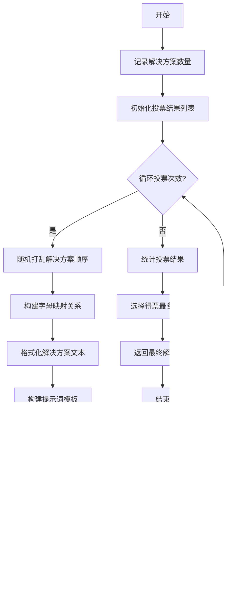

# `.\MetaGPT\metagpt\ext\aflow\scripts\operator.py` 详细设计文档

该代码实现了一个基于大语言模型（LLM）的自动化工作流（aflow）操作符（Operator）框架，包含多种用于代码生成、测试、评审、集成和格式化的具体操作符，旨在通过LLM驱动的多步骤流程解决编程问题或生成答案。

## 整体流程


## 类结构

```
Operator (抽象基类)
├── Custom
├── AnswerGenerate
├── CustomCodeGenerate
├── Programmer
├── Test
├── Format
├── Review
├── Revise
├── ScEnsemble
└── MdEnsemble
```

## 全局变量及字段


### `Operator.name`
    
操作符实例的名称，用于标识不同的操作符。

类型：`str`
    


### `Operator.llm`
    
大语言模型实例，用于执行各种生成和推理任务。

类型：`LLM`
    


### `MdEnsemble.vote_count`
    
投票轮数，控制多数投票集成方法中执行投票的次数。

类型：`int`
    
    

## 全局函数及方法

### `run_code`

`run_code` 是一个独立的全局函数，用于在受控环境中执行传入的 Python 代码字符串。其主要功能是执行代码并捕获结果或错误，特别关注安全性和资源限制。它会检查代码中是否包含被禁止导入的库（如 `os`、`sys` 等），然后在一个新的全局命名空间中执行代码，并期望代码定义并调用一个名为 `solve` 的函数以获取执行结果。

参数：
- `code`：`str`，需要被执行的 Python 代码字符串。

返回值：`Tuple[str, str]`，返回一个元组。第一个元素是状态字符串（"Success" 或 "Error"），第二个元素是执行结果字符串或错误信息字符串。

#### 流程图

```mermaid
flowchart TD
    A[开始: 输入代码字符串] --> B{检查禁止的导入库};
    B -- 发现禁止导入 --> C[记录日志];
    C --> D[返回错误状态和消息];
    B -- 未发现禁止导入 --> E[创建新的全局命名空间];
    E --> F[执行 exec(code, global_namespace)];
    F --> G{执行是否发生异常?};
    G -- 是 --> H[捕获异常信息];
    H --> I[返回错误状态和异常堆栈];
    G -- 否 --> J{全局命名空间中<br>是否存在可调用的'solve'函数?};
    J -- 否 --> K[返回错误状态和'Function not found'消息];
    J -- 是 --> L[调用 global_namespace['solve']()];
    L --> M[返回成功状态和结果字符串];
```

#### 带注释源码

```python
def run_code(code):
    try:
        # 创建一个新的全局命名空间，用于隔离执行环境
        global_namespace = {}

        # 定义禁止导入的库列表，主要用于防止不安全或资源密集型操作
        disallowed_imports = [
            "os",
            "sys",
            "subprocess",
            "multiprocessing",
            "matplotlib",
            "seaborn",
            "plotly",
            "bokeh",
            "ggplot",
            "pylab",
            "tkinter",
            "PyQt5",
            "wx",
            "pyglet",
        ]

        # 检查代码中是否包含禁止的导入语句
        for lib in disallowed_imports:
            if f"import {lib}" in code or f"from {lib}" in code:
                logger.info("Detected prohibited import: %s", lib)
                # 如果发现禁止导入，立即返回错误
                return "Error", f"Prohibited import: {lib} and graphing functionalities"

        # 在隔离的命名空间中执行代码
        exec(code, global_namespace)
        # 假设被执行的代码会定义一个名为 'solve' 的函数
        # 检查该函数是否存在且可调用
        if "solve" in global_namespace and callable(global_namespace["solve"]):
            # 调用 solve 函数并获取其结果
            result = global_namespace["solve"]()
            # 返回成功状态和结果字符串
            return "Success", str(result)
        else:
            # 如果未找到 solve 函数，返回错误
            return "Error", "Function 'solve' not found"
    except Exception as e:
        # 如果执行过程中发生任何异常，捕获并格式化异常信息
        exc_type, exc_value, exc_traceback = sys.exc_info()
        tb_str = traceback.format_exception(exc_type, exc_value, exc_traceback)
        # 返回错误状态和包含错误详情及堆栈的字符串
        return "Error", f"Execution error: {str(e)}\n{''.join(tb_str)}"
```

### `Operator.__call__`

该方法是一个抽象方法，用于定义所有`Operator`子类的核心调用接口。它要求子类必须实现自己的`__call__`方法，以执行具体的操作逻辑。当尝试直接调用基类`Operator`的实例时，会抛出`NotImplementedError`异常，强制子类实现此方法。

参数：
-  `*args`：`tuple`，可变位置参数，用于接收调用时传入的位置参数。
-  `**kwargs`：`dict`，可变关键字参数，用于接收调用时传入的关键字参数。

返回值：`NotImplementedError`，当直接调用基类`Operator`的`__call__`方法时，会抛出此异常，指示该方法需要在子类中实现。

#### 流程图


#### 带注释源码

```python
    def __call__(self, *args, **kwargs):
        # 这是一个抽象方法，用于定义所有Operator子类的调用接口。
        # 当直接调用基类Operator的实例时，会抛出NotImplementedError异常，
        # 强制子类必须实现自己的__call__方法以执行具体的操作逻辑。
        raise NotImplementedError
```

### `Operator._fill_node`

该方法是一个异步辅助方法，用于根据给定的操作类、提示模板和额外参数，通过LLM填充并创建一个`ActionNode`实例，并返回其结构化内容。

参数：
- `op_class`：`type`，一个Pydantic模型类，定义了期望LLM返回的数据结构。
- `prompt`：`str`，发送给LLM的提示文本，用于指导其生成内容。
- `mode`：`str`，可选参数，指定`ActionNode.fill`方法的填充模式（如`"single_fill"`, `"xml_fill"`, `"code_fill"`）。
- `**extra_kwargs`：`dict`，额外的关键字参数，将被合并到`fill_kwargs`中传递给`ActionNode.fill`方法。

返回值：`dict`，返回由`ActionNode`的`instruct_content`属性（一个Pydantic模型）序列化后的字典，包含了LLM根据提示和结构生成的内容。

#### 流程图


#### 带注释源码

```python
async def _fill_node(self, op_class, prompt, mode=None, **extra_kwargs):
    # 1. 构建用于填充ActionNode的关键参数字典。
    #    基础参数包括上下文（提示词）和LLM实例。
    fill_kwargs = {"context": prompt, "llm": self.llm}
    # 2. 如果指定了模式（如'xml_fill'），则添加到参数字典中。
    if mode:
        fill_kwargs["mode"] = mode
    # 3. 将调用者传入的任何额外参数更新到参数字典中。
    fill_kwargs.update(extra_kwargs)

    # 4. 核心步骤：从Pydantic模型类（op_class）创建ActionNode，
    #    并异步调用其fill方法，利用LLM根据prompt和模型结构生成内容。
    node = await ActionNode.from_pydantic(op_class).fill(**fill_kwargs)

    # 5. 提取填充后的结构化内容（一个Pydantic模型），并将其序列化为字典返回。
    #    这是LLM生成结果的最终结构化形式。
    return node.instruct_content.model_dump()
```

### `Custom.__call__`

该方法是一个异步调用方法，它接收一个输入字符串和一个指令字符串，将两者拼接后作为提示词，调用父类`Operator`的`_fill_node`方法，使用`GenerateOp`操作节点和`single_fill`模式来生成并返回一个响应。

参数：
- `self`：`Custom`，`Custom`类的实例
- `input`：`str`，需要处理的输入文本
- `instruction`：`str`，指导如何处理输入的指令文本

返回值：`Any`，返回由`_fill_node`方法生成的响应内容，其具体类型取决于`GenerateOp`操作节点的输出结构。

#### 流程图


#### 带注释源码

```python
async def __call__(self, input, instruction):
    # 将指令和输入拼接，形成完整的提示词
    prompt = instruction + input
    # 调用父类Operator的_fill_node方法，使用GenerateOp操作节点和'single_fill'模式来填充并生成响应
    response = await self._fill_node(GenerateOp, prompt, mode="single_fill")
    # 返回生成的响应
    return response
```

### `AnswerGenerate.__call__`

该方法接收一个问题输入，使用预定义的答案生成提示模板，通过大语言模型生成结构化答案，并返回解析后的答案内容。

参数：

- `input`：`str`，需要生成答案的问题文本
- `mode`：`str`，可选参数，指定填充模式，默认为None

返回值：`Tuple[str, str]`，返回一个元组，包含从大语言模型响应中解析出的答案内容

#### 流程图


#### 带注释源码

```python
async def __call__(self, input: str, mode: str = None) -> Tuple[str, str]:
    # 使用预定义的答案生成提示模板，将用户输入的问题填充到模板中
    prompt = ANSWER_GENERATION_PROMPT.format(input=input)
    
    # 调用父类Operator的_fill_node方法，使用AnswerGenerateOp操作类，
    # 指定xml_fill模式来解析LLM的结构化响应
    response = await self._fill_node(AnswerGenerateOp, prompt, mode="xml_fill")
    
    # 返回从LLM响应中解析出的答案内容
    return response
```

### `CustomCodeGenerate.__call__`

该方法接收一个问题描述、入口点函数名和指令，通过LLM生成符合要求的Python代码。

参数：

- `problem`：`str`，需要解决的编程问题描述
- `entry_point`：`str`，期望生成的函数名称
- `instruction`：`str`，给LLM的代码生成指令

返回值：`dict`，包含LLM生成的代码内容

#### 流程图


#### 带注释源码

```python
async def __call__(self, problem, entry_point, instruction):
    # 将指令和问题描述拼接成完整的提示词
    prompt = instruction + problem
    
    # 调用父类的_fill_node方法生成代码
    # 使用GenerateOp作为操作类，设置模式为code_fill
    # 传入entry_point作为期望生成的函数名
    response = await self._fill_node(
        GenerateOp, 
        prompt, 
        mode="code_fill", 
        function_name=entry_point
    )
    
    # 返回LLM生成的代码响应
    return response
```

### `Programmer.__call__`

该方法实现了代码生成与执行的自动化流程。它接收一个问题描述和可选的分析文本，通过LLM生成代码，执行该代码，并根据执行结果进行反馈循环。如果执行失败，会收集错误信息作为反馈，重新生成代码，最多重试3次。最终返回生成的代码和执行结果（成功时的输出或失败时的错误信息）。

参数：

- `problem`：`str`，需要解决的问题描述，作为代码生成的输入
- `analysis`：`str`，可选的分析文本，默认为"None"，用于辅助代码生成

返回值：`Dict[str, str]`，包含两个键值对的字典：`"code"`对应生成的代码字符串，`"output"`对应代码执行结果（成功时为输出字符串，失败时为错误信息）

#### 流程图

```mermaid
graph TD
    A[开始: 调用Programmer] --> B[初始化: code=None, output=None, feedback='']
    B --> C{循环 i in range(3)}
    C --> D[调用code_generate生成代码]
    D --> E{代码生成成功?}
    E -- 否 --> F[返回: 无代码生成]
    E -- 是 --> G[调用exec_code执行代码]
    G --> H{执行状态?}
    H -- Success --> I[返回: 代码和输出]
    H -- Error --> J[记录错误日志]
    J --> K[构建错误反馈信息]
    K --> L[更新feedback变量]
    L --> C
    C -- 循环结束 --> M[返回: 最后一次的代码和输出]
```

#### 带注释源码

```python
    @retry(stop=stop_after_attempt(3), wait=wait_fixed(2))  # 使用tenacity库实现重试机制，最多尝试3次，每次等待2秒
    async def __call__(self, problem: str, analysis: str = "None"):
        """
        Call method, generate code and execute, retry up to 3 times.
        """
        code = None  # 初始化代码变量
        output = None  # 初始化输出变量
        feedback = ""  # 初始化反馈信息，用于在重试时传递错误信息
        for i in range(3):  # 最多尝试3次
            # 调用code_generate方法生成代码，传入问题、分析文本和上一轮的反馈
            code_response = await self.code_generate(problem, analysis, feedback, mode="code_fill")
            code = code_response.get("code")  # 从响应中提取生成的代码
            if not code:  # 如果未生成代码，直接返回
                return {"code": code, "output": "No code generated"}
            # 调用exec_code方法异步执行生成的代码
            status, output = await self.exec_code(code)
            if status == "Success":  # 如果执行成功，返回代码和输出
                return {"code": code, "output": output}
            else:  # 如果执行失败
                # 记录错误日志
                logger.info(f"Execution error on attempt {i + 1}, error message: {output}")
                # 构建详细的错误反馈信息，包含代码、状态和错误输出，用于下一轮代码生成
                feedback = (
                    f"\nThe result of the error from the code you wrote in the previous round:\n"
                    f"Code: {code}\n\nStatus: {status}, {output}"
                )
        # 如果3次尝试都失败，返回最后一次生成的代码和输出（错误信息）
        return {"code": code, "output": output}
```

### `Programmer.exec_code`

该方法用于异步执行给定的Python代码，并设置超时限制。它通过将代码执行任务提交到独立的进程池中运行，以防止阻塞主事件循环，并在超时或发生异常时返回相应的错误信息。

参数：

- `code`：`str`，需要执行的Python代码字符串。
- `timeout`：`int`，可选参数，默认为30秒，表示代码执行的最大等待时间。

返回值：`Tuple[str, str]`，返回一个元组，包含执行状态（“Success”或“Error”）和相应的输出或错误信息。

#### 流程图


#### 带注释源码

```python
async def exec_code(self, code, timeout=30):
    """
    异步执行代码，如果发生超时则返回错误。
    """
    # 获取当前运行的事件循环
    loop = asyncio.get_running_loop()
    # 创建一个最大工作进程数为1的进程池执行器
    with concurrent.futures.ProcessPoolExecutor(max_workers=1) as executor:
        try:
            # 将同步的run_code函数提交到进程池中异步执行
            future = loop.run_in_executor(executor, run_code, code)
            # 等待任务完成，最多等待timeout秒
            result = await asyncio.wait_for(future, timeout=timeout)
            # 返回执行结果（状态， 输出）
            return result
        except asyncio.TimeoutError:
            # 如果超时，尝试立即关闭进程池（不等待任务完成）
            executor.shutdown(wait=False, cancel_futures=True)
            # 返回超时错误信息
            return "Error", "Code execution timed out"
        except Exception as e:
            # 捕获其他未知异常并返回错误信息
            return "Error", f"Unknown error: {str(e)}"
```

### `Programmer.code_generate`

该方法根据给定的问题描述、分析文本和反馈信息，使用大语言模型（LLM）生成相应的Python代码。它通过构造特定的提示词，调用`ActionNode`的填充机制来生成代码，并返回生成的代码内容。

参数：

- `problem`：`str`，需要解决的编程问题描述。
- `analysis`：`str`，对问题的分析文本，用于指导代码生成。
- `feedback`：`str`，来自之前代码执行尝试的反馈信息，用于改进当前代码生成。
- `mode`：`str`，指定`ActionNode`的填充模式，例如`"code_fill"`。

返回值：`dict`，包含由LLM生成的代码内容，具体结构取决于`CodeGenerateOp`类的定义。

#### 流程图


#### 带注释源码

```python
async def code_generate(self, problem, analysis, feedback, mode):
    """
    异步方法，用于生成代码。
    根据问题、分析和反馈信息，构造提示词，调用LLM生成代码。
    """
    # 使用预定义的代码验证提示词模板，将问题、分析和反馈信息填充进去
    prompt = PYTHON_CODE_VERIFIER_PROMPT.format(problem=problem, analysis=analysis, feedback=feedback)
    # 调用父类Operator的_fill_node方法，使用CodeGenerateOp类来生成代码
    # 传入指定的填充模式（mode）和函数名（function_name="solve"）
    response = await self._fill_node(CodeGenerateOp, prompt, mode, function_name="solve")
    # 返回LLM生成的响应，通常是一个包含代码的字典
    return response
```

### `Test.__call__`

该方法用于测试给定的解决方案代码。它会执行多轮测试（默认3轮），每轮使用提取的测试用例来验证解决方案。如果测试通过，返回成功结果；如果失败，会根据错误类型（执行错误或断言失败）生成反思提示，调用LLM生成改进后的解决方案，并继续下一轮测试。如果所有轮次都失败，返回最终失败结果。

参数：

- `problem`：`str`，问题描述字符串
- `solution`：`str`，待测试的解决方案代码字符串
- `entry_point`：`str`，测试用例的入口点标识符，用于提取对应的测试用例
- `test_loop`：`int`，测试循环次数，默认为3

返回值：`Dict[str, Any]`，返回一个字典，包含测试结果和最终的解决方案。如果测试成功，`result`为`True`，`solution`为原始或改进后的解决方案；如果测试失败，`result`为`False`，`solution`为最后一轮测试后的解决方案。

#### 流程图


#### 带注释源码

```python
async def __call__(self, problem, solution, entry_point, test_loop: int = 3):
    """
    "Test": {
    "description": "Test the solution with test cases, if the solution is correct, return 'no error', if the solution is incorrect, return reflect on the soluion and the error information",
    "interface": "test(problem: str, solution: str, entry_point: str) -> str"
    }
    """
    # 循环测试，最多进行test_loop轮
    for _ in range(test_loop):
        # 调用exec_code方法执行测试，返回测试结果
        result = self.exec_code(solution, entry_point)
        # 如果测试通过，返回成功结果
        if result == "no error":
            return {"result": True, "solution": solution}
        # 如果发生执行错误（非断言错误）
        elif "exec_fail_case" in result:
            result = result["exec_fail_case"]
            # 构建执行错误反思提示，包含问题、解决方案和错误信息
            prompt = REFLECTION_ON_PUBLIC_TEST_PROMPT.format(
                problem=problem,
                solution=solution,
                exec_pass=f"executed unsuccessfully, error: \n {result}",
                test_fail="executed unsucessfully",
            )
            # 调用LLM生成反思和改进后的解决方案
            response = await self._fill_node(ReflectionTestOp, prompt, mode="code_fill")
            # 更新解决方案为改进后的版本
            solution = response["reflection_and_solution"]
        # 如果发生断言失败或其他测试错误
        else:
            # 构建测试失败反思提示，包含问题、解决方案和失败信息
            prompt = REFLECTION_ON_PUBLIC_TEST_PROMPT.format(
                problem=problem,
                solution=solution,
                exec_pass="executed successfully",
                test_fail=result,
            )
            # 调用LLM生成反思和改进后的解决方案
            response = await self._fill_node(ReflectionTestOp, prompt, mode="code_fill")
            # 更新解决方案为改进后的版本
            solution = response["reflection_and_solution"]

    # 所有轮次测试结束后，执行最终测试
    result = self.exec_code(solution, entry_point)
    # 如果最终测试通过，返回成功结果
    if result == "no error":
        return {"result": True, "solution": solution}
    # 否则返回失败结果
    else:
        return {"result": False, "solution": solution}
```

### `Test.exec_code`

该方法用于执行给定的解决方案代码，并针对指定的入口点（entry_point）从JSONL文件中提取测试用例进行验证。它会遍历所有测试用例，将解决方案与每个测试用例组合成可执行的测试代码，然后执行这些测试代码。如果所有测试用例都通过，则返回"no error"；如果出现执行错误或断言失败，则返回相应的错误信息。

参数：

- `solution`：`str`，待测试的解决方案代码字符串。
- `entry_point`：`str`，入口点名称，用于从JSONL文件中提取对应的测试用例。

返回值：`Union[str, List[Dict], Dict]`，返回值为字符串"no error"表示所有测试通过；返回包含错误信息的字典列表表示有测试用例失败；返回包含执行失败信息的字典表示代码执行过程中出现异常。

#### 流程图


#### 带注释源码

```python
def exec_code(self, solution, entry_point):
    # 从JSONL文件中提取与entry_point对应的测试用例
    test_cases = extract_test_cases_from_jsonl(entry_point)

    # 初始化失败用例列表
    fail_cases = []
    # 遍历每个测试用例
    for test_case in test_cases:
        # 将解决方案代码与当前测试用例组合成可执行的测试函数代码
        test_code = test_case_2_test_function(solution, test_case, entry_point)
        try:
            # 执行测试代码
            exec(test_code, globals())
        except AssertionError as e:
            # 捕获断言错误，记录详细的错误信息
            exc_type, exc_value, exc_traceback = sys.exc_info()
            tb_str = traceback.format_exception(exc_type, exc_value, exc_traceback)
            # 可选：将错误信息写入日志文件（当前代码中注释掉了）
            # with open("tester.txt", "a") as f:
            #     f.write("test_error of " + entry_point + "\n")
            error_infomation = {
                "test_fail_case": {
                    "test_case": test_case,
                    "error_type": "AssertionError",
                    "error_message": str(e),
                    "traceback": tb_str,
                }
            }
            fail_cases.append(error_infomation)
        except Exception as e:
            # 捕获其他执行异常，记录错误信息并立即返回
            # 可选：将错误信息写入日志文件（当前代码中注释掉了）
            # with open("tester.txt", "a") as f:
            #     f.write(entry_point + " " + str(e) + "\n")
            return {"exec_fail_case": str(e)}
    # 检查是否有失败用例
    if fail_cases != []:
        return fail_cases
    else:
        return "no error"
```

### `Format.__call__`

该方法接收一个问题描述和一个解决方案，使用大语言模型（LLM）和特定的格式化提示词（`FORMAT_PROMPT`）对解决方案进行格式化处理，并返回格式化后的结果。

参数：
- `problem`：`str`，需要解决的问题的描述。
- `solution`：`str`，针对问题的原始解决方案文本。
- `mode`：`str`，可选参数，指定调用底层 `_fill_node` 方法时的模式。

返回值：`dict`，包含由大语言模型生成的格式化后的解决方案内容。

#### 流程图


#### 带注释源码

```python
async def __call__(self, problem, solution, mode: str = None):
    # 使用 FORMAT_PROMPT 模板，将问题描述和原始解决方案填充到提示词中
    prompt = FORMAT_PROMPT.format(problem_description=problem, solution=solution)
    # 调用父类 Operator 的 _fill_node 方法，传入 FormatOp 类、提示词和可选的模式参数
    # 该方法会使用 LLM 处理提示词，并返回一个 ActionNode 对象，从中提取结构化内容
    response = await self._fill_node(FormatOp, prompt, mode)
    # 返回格式化后的响应，通常是一个包含格式化后解决方案的字典
    return response
```

### `Review.__call__`

该方法属于 `Review` 类，是 `Operator` 类的子类。其核心功能是接收一个问题描述和一个解决方案，通过调用大语言模型（LLM）对解决方案进行评审，并返回评审结果。

参数：

- `problem`：`str`，需要评审的问题描述。
- `solution`：`str`，待评审的解决方案。
- `mode`：`str`，操作模式，默认为 `None`。在本方法中，该参数未被使用，而是固定使用 `"xml_fill"` 模式调用父类方法。

返回值：`dict`，返回一个字典，包含从大语言模型（LLM）获取的评审结果。具体内容由 `ReviewOp` 这个 `ActionNode` 的定义决定。

#### 流程图


#### 带注释源码

```python
async def __call__(self, problem, solution, mode: str = None):
    # 使用 REVIEW_PROMPT 模板，将问题描述和解决方案填充到提示词中
    prompt = REVIEW_PROMPT.format(problem=problem, solution=solution)
    # 调用父类 Operator 的 _fill_node 方法。
    # 该方法会使用指定的 ActionNode (ReviewOp) 和提示词 (prompt) 与 LLM 交互。
    # mode 参数被固定为 'xml_fill'，表示期望 LLM 以 XML 格式返回结构化数据。
    response = await self._fill_node(ReviewOp, prompt, mode="xml_fill")
    # 返回 LLM 处理后的响应，通常是一个包含评审意见的字典。
    return response
```

### `Revise.__call__`

该方法接收一个问题描述、一个解决方案和反馈信息，使用LLM生成修订后的解决方案。

参数：

- `problem`：`str`，需要解决的问题描述
- `solution`：`str`，当前的解决方案文本
- `feedback`：`str`，对当前解决方案的反馈意见
- `mode`：`str`，操作模式（可选参数）

返回值：`dict`，包含修订后的解决方案的字典

#### 流程图


#### 带注释源码

```python
async def __call__(self, problem, solution, feedback, mode: str = None):
    # 使用REVISE_PROMPT模板格式化提示词，包含问题、解决方案和反馈信息
    prompt = REVISE_PROMPT.format(problem=problem, solution=solution, feedback=feedback)
    
    # 调用父类的_fill_node方法，使用ReviseOp操作类生成修订内容
    # mode参数指定为"xml_fill"，表示使用XML格式填充
    response = await self._fill_node(ReviseOp, prompt, mode="xml_fill")
    
    # 返回修订后的解决方案
    return response
```

### `ScEnsemble.__call__`

该方法实现了自洽性集成（Self-Consistency Ensemble）算法。它接收一个候选解决方案列表和一个问题描述，通过LLM（大语言模型）评估这些解决方案，并选择最可能正确的那个。具体做法是将每个解决方案标记为一个字母选项（A, B, C...），构造一个提示词要求模型选择最佳方案，然后根据模型的“投票”结果返回对应的原始解决方案。

参数：

- `self`：`ScEnsemble`，ScEnsemble类的实例
- `solutions`：`List[str]`，待评估的候选解决方案字符串列表
- `problem`：`str`，需要解决的问题描述

返回值：`Dict[str, str]`，返回一个字典，键为`"response"`，值为被选中的解决方案字符串。

#### 流程图

```mermaid
graph TD
    A[开始: __call__(solutions, problem)] --> B[初始化 answer_mapping 字典和 solution_text 字符串]
    B --> C{遍历 solutions 列表?}
    C -- 是 --> D[为当前解决方案分配字母标识 A, B, C...]
    D --> E[将字母索引映射存入 answer_mapping]
    E --> F[将带字母标识的解决方案文本追加到 solution_text]
    F --> C
    C -- 否 --> G[使用 problem 和 solution_text 格式化提示词 SC_ENSEMBLE_PROMPT]
    G --> H[调用 _fill_node 方法， 使用 ScEnsembleOp 和 xml_fill 模式获取LLM响应]
    H --> I[从响应中提取 solution_letter 字段]
    I --> J[清理并大写字母标识]
    J --> K[使用 answer_mapping 将字母映射回原始解决方案索引]
    K --> L[返回字典 {'response': 选中的解决方案}]
    L --> M[结束]
```

#### 带注释源码

```python
async def __call__(self, solutions: List[str], problem: str):
    # 初始化一个字典，用于将字母标识（A, B, C...）映射回原始解决方案在列表中的索引。
    answer_mapping = {}
    # 初始化一个字符串，用于构建包含所有带字母标识的解决方案的文本块。
    solution_text = ""
    # 遍历输入的解决方案列表。
    for index, solution in enumerate(solutions):
        # 为当前解决方案生成字母标识（0->'A', 1->'B', ...）。
        answer_mapping[chr(65 + index)] = index
        # 将带字母标识的解决方案格式化后追加到 solution_text 中。
        solution_text += f"{chr(65 + index)}: \n{str(solution)}\n\n\n"

    # 使用预定义的提示词模板 SC_ENSEMBLE_PROMPT， 将问题和解决方案文本填入，生成最终提示。
    prompt = SC_ENSEMBLE_PROMPT.format(question=problem, solutions=solution_text)
    # 调用父类方法，使用指定的操作类(ScEnsembleOp)和模式(xml_fill)与LLM交互，获取响应。
    response = await self._fill_node(ScEnsembleOp, prompt, mode="xml_fill")

    # 从LLM的响应中提取‘solution_letter’字段，即模型选择的字母。
    answer = response.get("solution_letter", "")
    # 清理空白字符并转换为大写，确保格式一致。
    answer = answer.strip().upper()

    # 使用映射字典找到该字母对应的原始解决方案索引，并返回该解决方案。
    return {"response": solutions[answer_mapping[answer]]}
```

### `MdEnsemble.__call__`

该方法实现了基于多数投票的集成学习策略（Majority Voting Ensemble）。它接收多个候选解决方案，通过多次随机打乱顺序并让LLM选择最佳答案，最终统计所有投票结果，选择得票最多的解决方案作为最终输出。

参数：

- `solutions`：`List[str]`，候选解决方案列表
- `problem`：`str`，待解决的问题描述
- `mode`：`str`，操作模式（当前未使用）

返回值：`Dict[str, str]`，包含最终选择的解决方案

#### 流程图



#### 带注释源码

```python
async def __call__(self, solutions: List[str], problem: str, mode: str = None):
    # 记录输入的解决方案数量，用于调试
    logger.info(f"solution count: {len(solutions)}")
    # 初始化存储所有投票结果的列表
    all_responses = []

    # 进行指定次数的投票循环
    for _ in range(self.vote_count):
        # 随机打乱解决方案顺序，并建立字母到原始索引的映射
        shuffled_solutions, answer_mapping = self.shuffle_answers(solutions)

        # 构建格式化的解决方案文本，每个解决方案前加上字母标识
        solution_text = ""
        for index, solution in enumerate(shuffled_solutions):
            solution_text += f"{chr(65 + index)}: \n{str(solution)}\n\n\n"

        # 使用模板构建提示词，包含打乱后的解决方案和问题描述
        prompt = MD_ENSEMBLE_PROMPT.format(solutions=solution_text, question=problem)
        # 调用LLM获取选择结果，使用XML填充模式
        response = await self._fill_node(MdEnsembleOp, prompt, mode="xml_fill")

        # 从响应中提取选择的字母，默认为"A"
        answer = response.get("solution_letter", "A")
        # 清理空格并转换为大写
        answer = answer.strip().upper()

        # 如果选择的字母在映射表中，找到对应的原始索引
        if answer in answer_mapping:
            original_index = answer_mapping[answer]
            # 记录本次投票结果
            all_responses.append(original_index)

    # 统计所有投票结果，找到出现次数最多的索引
    most_frequent_index = Counter(all_responses).most_common(1)[0][0]
    # 根据索引获取最终的解决方案
    final_answer = solutions[most_frequent_index]
    # 返回包含最终解决方案的字典
    return {"solution": final_answer}
```

### `MdEnsemble.shuffle_answers`

这是一个静态方法，用于对给定的答案列表进行随机打乱，并生成一个映射关系，将打乱后的字母标识符（如'A', 'B'...）映射回原始答案列表中的索引。

参数：

- `solutions`：`List[str]`，需要被打乱的原始答案列表。

返回值：`Tuple[List[str], Dict[str, str]]`，返回一个元组，包含打乱后的答案列表和一个映射字典。字典的键是打乱后答案对应的字母标识符（如'A'），值是该答案在原始列表中的索引。

#### 流程图

```mermaid
flowchart TD
    A[开始] --> B[复制原始答案列表 solutions]
    B --> C[随机打乱复制的列表]
    C --> D[初始化空映射字典 answer_mapping]
    D --> E[遍历打乱后的列表<br/>i 从 0 到 len-1]
    E --> F{遍历完成?}
    F -- 否 --> G[获取当前答案 solution]
    G --> H[计算该答案在原始列表中的索引 original_index]
    H --> I[生成字母标识符 letter = chr(65 + i)]
    I --> J[将映射 letter: original_index 存入字典]
    J --> E
    F -- 是 --> K[返回打乱后的列表和映射字典]
    K --> L[结束]
```

#### 带注释源码

```python
@staticmethod
def shuffle_answers(solutions: List[str]) -> Tuple[List[str], Dict[str, str]]:
    # 1. 创建原始答案列表的副本，避免修改原始数据
    shuffled_solutions = solutions.copy()
    # 2. 使用 random.shuffle 对副本进行原地随机打乱
    random.shuffle(shuffled_solutions)
    # 3. 初始化一个空字典，用于存储打乱后答案的字母标识符到原始索引的映射
    answer_mapping = {
        # 遍历打乱后的列表，i 是当前答案在打乱后列表中的位置
        # chr(65 + i) 将数字转换为大写字母（65 是 'A' 的 ASCII 码）
        # solutions.index(solution) 查找当前答案在原始列表中的索引
        chr(65 + i): solutions.index(solution)
        for i, solution in enumerate(shuffled_solutions)
    }
    # 4. 返回打乱后的列表和映射字典
    return shuffled_solutions, answer_mapping
```

## 关键组件


### 张量索引与惰性加载

代码中未直接涉及张量操作或显式的惰性加载机制。主要的“加载”操作体现在通过 `ActionNode.from_pydantic` 动态创建并填充操作节点，以及通过 `exec` 函数动态执行生成的代码，这可以视为一种运行时的“惰性”代码加载与执行。

### 反量化支持

代码中未涉及任何模型权重或数据的量化与反量化操作。所有处理均基于文本（字符串）和语言模型（LLM）的生成与推理。

### 量化策略

代码中未涉及模型压缩或推理加速相关的量化策略。其核心策略是围绕代码生成、测试、评审、修订等操作流程的组织与重试机制，例如 `Programmer` 类中的 `@retry` 装饰器实现了最多3次的重试策略。

### 操作符（Operator）基类与派生类

定义了统一的 `Operator` 基类，并派生出 `Custom`、`AnswerGenerate`、`Programmer`、`Test`、`Review`、`Revise`、`ScEnsemble`、`MdEnsemble` 等多个具体操作符。每个操作符封装了特定的任务逻辑（如代码生成、测试、集成等），并通过 `__call__` 方法提供统一接口，是构建自动化工作流（aflow）的核心组件。

### 代码执行与沙箱（`run_code` 函数与 `Programmer.exec_code` 方法）

提供了在受限环境中安全执行动态生成Python代码的能力。`run_code` 函数通过 `exec` 执行代码，并禁止了可能有害的库导入（如 `os`, `sys`）。`Programmer.exec_code` 方法进一步使用 `ProcessPoolExecutor` 在独立进程中运行代码，并设置了超时机制，增强了安全性和稳定性。

### 集成策略（`ScEnsemble` 与 `MdEnsemble` 类）

实现了两种集成方法以提高答案的可靠性。`ScEnsemble`（自洽集成）基于单一投票从多个解决方案中选出最佳答案。`MdEnsemble`（多数投票集成）通过多次随机打乱解决方案顺序并进行多次投票，最终选择得票最多的解决方案，旨在减少选项顺序带来的偏差。

### 测试与反馈循环（`Test` 类）

实现了代码解决方案的自动化测试流程。它执行测试用例，捕获执行失败或断言错误，并根据错误信息生成反思提示，驱动 `ReflectionTestOp` 生成改进后的解决方案，形成一个“生成-测试-反思-修订”的闭环。

### 提示工程与模板

通过导入的 `prompt` 模块（如 `PYTHON_CODE_VERIFIER_PROMPT`, `REFLECTION_ON_PUBLIC_TEST_PROMPT` 等）定义了一系列结构化的提示模板。这些模板与特定的 `ActionNode` 子类（如 `CodeGenerateOp`, `ReflectionTestOp`）配合，指导LLM生成格式化和结构化的输出内容。


## 问题及建议


### 已知问题

-   **代码执行安全性风险**：`run_code` 和 `Test.exec_code` 函数使用 `exec()` 执行任意代码，存在严重的安全隐患。虽然通过 `disallowed_imports` 列表进行了一些限制，但这种黑名单机制并不完备，无法防御所有恶意代码或危险操作（如无限循环、内存耗尽、文件系统访问等）。在生产环境中直接执行用户或模型生成的代码是危险的。
-   **错误处理不完善**：`Programmer.exec_code` 方法在捕获到 `asyncio.TimeoutError` 后，尝试通过 `executor.shutdown(wait=False, cancel_futures=True)` 强制关闭进程池。这种方式可能无法可靠地终止正在执行的子进程，导致资源（如僵尸进程）泄漏。此外，`Test.exec_code` 方法将异常信息写入本地文件 `tester.txt`，这种做法不利于日志集中管理、监控和问题排查，且存在并发写入冲突的风险。
-   **潜在的阻塞操作**：`Programmer.exec_code` 使用 `ProcessPoolExecutor` 在单独的进程中执行代码以避免阻塞事件循环，这是正确的。然而，`Test.exec_code` 方法直接在主线程中同步执行 `exec()`，如果生成的测试代码执行时间较长或包含阻塞操作，会阻塞整个异步事件循环，影响系统并发性能。
-   **硬编码与配置缺失**：多个类（如 `Programmer` 的代码生成重试次数、`Test` 的测试循环次数 `test_loop`、`MdEnsemble` 的投票次数 `vote_count`）的关键参数被硬编码在方法或初始化函数中，缺乏外部配置能力。这使得调整系统行为（如重试策略、集成规模）需要修改源代码，降低了灵活性和可维护性。
-   **代码重复与结构不一致**：`run_code` 函数被定义为全局函数，但其功能与 `Programmer` 类紧密相关。`Test` 类中也有一个同名的 `exec_code` 方法，功能类似但实现细节不同（如错误处理、测试用例处理），这造成了代码重复和逻辑不一致，增加了维护成本。
-   **资源管理不明确**：`Programmer.exec_code` 方法为每次代码执行都创建了一个新的 `ProcessPoolExecutor`。频繁创建和销毁进程池会带来额外的开销。虽然 `max_workers=1` 限制了并发，但更好的做法可能是复用进程池或使用更轻量的执行策略。

### 优化建议

-   **增强代码执行安全性**：
    -   考虑使用 Docker 容器或沙箱（如 `pysandbox`、`seccomp`）来隔离代码执行环境，严格限制其资源（CPU、内存、运行时间）和系统调用。
    -   将黑名单机制升级为白名单机制，只允许执行预定义的安全模块和函数。
    -   对生成的代码进行静态分析，检查是否存在危险模式（如无限循环、递归过深、危险导入）。
-   **改进错误与资源管理**：
    -   重构 `Programmer.exec_code` 的超时处理机制。考虑使用 `asyncio.create_task` 配合 `asyncio.wait_for` 来管理子进程任务，并确保在超时后能通过进程信号（如 `SIGTERM`）可靠地终止子进程，并做好进程资源的清理。
    -   移除 `Test.exec_code` 中写入本地文件 `tester.txt` 的逻辑，改为使用项目统一的日志系统（如 `metagpt.logs.logger`）记录错误信息，确保日志的线程/进程安全以及可配置的输出目的地。
-   **异步化阻塞操作**：
    -   将 `Test.exec_code` 方法改造为异步方法。可以借鉴 `Programmer.exec_code` 的模式，将测试代码的执行也放入进程池中，或者确保测试代码本身是纯计算且快速的。如果必须同步执行，应使用 `asyncio.to_thread` 将其放入单独的线程中运行，避免阻塞事件循环。
-   **引入配置管理**：
    -   将重试次数（`Programmer.__call__` 中的循环和 `@retry` 装饰器）、测试循环次数（`Test.__call__` 的 `test_loop`）、投票次数（`MdEnsemble` 的 `vote_count`）、代码执行超时时间、允许的导入列表等参数提取到配置文件或环境变量中。可以通过在类初始化时传入一个配置对象来实现。
-   **重构代码结构，消除重复**：
    -   将 `run_code` 函数整合到 `Programmer` 类中作为一个受保护的静态或实例方法。
    -   创建一个 `BaseCodeExecutor` 抽象类或工具类，封装安全的代码执行、超时处理和资源管理逻辑。然后让 `Programmer` 和 `Test` 类继承或组合这个基类，确保执行逻辑的一致性和可复用性。
    -   统一 `Test.exec_code` 和 `Programmer` 中代码执行的错误处理和结果返回格式。
-   **优化资源利用**：
    -   考虑在 `Operator` 基类或应用层面初始化一个共享的、大小可控的 `ProcessPoolExecutor` 实例，供所有需要执行代码的 `Operator` 子类（如 `Programmer`, `Test`）复用，而不是每次执行都新建。
    -   明确执行环境的生命周期管理，在应用关闭时优雅地关闭共享的进程池。


## 其它


### 设计目标与约束

本模块旨在提供一个基于大语言模型（LLM）的、可扩展的算子（Operator）框架，用于自动化执行代码生成、测试、评审、集成等复杂任务。核心设计目标包括：1）**模块化**：每个算子职责单一，通过继承基类`Operator`实现，便于独立开发、测试和替换。2）**异步友好**：算子方法均设计为异步，以高效利用I/O等待时间，支持高并发场景。3）**可配置性与可扩展性**：通过`LLM`实例、算子名称、模式（`mode`）等参数进行配置，并支持通过`Custom`和`CustomCodeGenerate`算子进行自定义提示词扩展。4）**鲁棒性**：在代码执行（`Programmer.exec_code`）和测试（`Test.exec_code`）环节引入了超时控制、进程隔离、安全沙箱（禁止危险库导入）和重试机制（`@retry`），以提高系统稳定性。主要约束包括：对`metagpt`框架和`tenacity`库的强依赖；代码执行环境受限，无法进行网络、文件系统或图形化操作；测试功能依赖于特定格式（`jsonl`）的测试用例文件。

### 错误处理与异常设计

系统的错误处理策略分层进行：1）**算子调用层**：基类`Operator`的`__call__`方法定义为抽象（`NotImplementedError`），强制子类实现。子类算子（如`Programmer.__call__`）使用`@retry`装饰器在LLM调用失败时自动重试。2）**代码执行层**：`run_code`函数和`Programmer.exec_code`方法通过`try-except`捕获所有执行异常，将异常信息格式化为字符串返回，而非抛出，使调用方能继续流程。`Programmer.exec_code`还使用`asyncio.wait_for`处理超时，并通过`ProcessPoolExecutor`实现进程级隔离，防止错误代码导致主进程崩溃。3）**测试层**：`Test.exec_code`方法区分`AssertionError`（测试用例失败）和其他`Exception`（代码执行失败），并收集详细的错误上下文（包括测试用例、错误类型、消息和堆栈跟踪）用于后续的反思（`Reflection`）步骤。4）**日志记录**：关键步骤（如执行错误、检测到禁止导入）通过`logger.info`记录，便于调试和监控。

### 数据流与状态机

模块的核心数据流围绕“问题（`problem`）”和“解决方案（`solution`，可以是代码或文本）”展开。典型流程（如`Programmer`）构成一个带状态循环的管道：`问题 + 分析 -> 生成代码 -> 执行验证 -> [成功] 输出结果 / [失败] 生成反馈 -> 重新生成代码`。`Test`算子的流程类似一个测试-反思循环：`问题 + 代码 -> 执行测试 -> [全部通过] 返回成功 / [部分失败] 生成反思 -> 更新代码 -> 重新测试`。`MdEnsemble`和`ScEnsemble`算子的数据流是聚合型的：`多个解决方案 -> 多次投票/选择 -> 聚合出最优解`。每个算子内部，数据通常经由`_fill_node`方法，将输入和提示词模板结合，调用LLM生成结构化输出（`ActionNode`），再提取所需内容。状态信息（如`Programmer`中的`feedback`，`Test`中的测试轮次）由算子内部维护，驱动循环的进行或终止。

### 外部依赖与接口契约

1.  **框架与库依赖**：
    *   **强依赖**：`metagpt`（提供`LLM`、`ActionNode`、`logger`）、`tenacity`（重试逻辑）。版本变更可能导致API不兼容。
    *   **内部模块依赖**：`metagpt.ext.aflow.scripts.operator_an`（所有`*Op`数据模型）、`metagpt.ext.aflow.scripts.prompts.prompt`（所有提示词模板）、`metagpt.ext.aflow.scripts.utils`（`extract_test_cases_from_jsonl`, `test_case_2_test_function`）。这些模块需保持稳定的导出接口。
2.  **接口契约**：
    *   **算子基类契约**：任何`Operator`子类必须实现异步的`__call__`方法。`_fill_node`是受保护的辅助方法，约定了如何调用`ActionNode`。
    *   **LLM接口契约**：依赖`metagpt.llm.LLM`的接口，该接口需支持与`ActionNode`协作的异步调用。
    *   **工具函数契约**：`run_code`函数接受字符串代码，返回`(状态: str, 输出: str)`的元组。`extract_test_cases_from_jsonl`和`test_case_2_test_function`需遵循特定的输入输出格式以支持`Test`算子。
    *   **数据格式契约**：`Test`算子依赖特定`jsonl`格式的测试用例文件。`*Op`数据模型（如`CodeGenerateOp`）的结构定义了与LLM交互的输入输出Schema，需与提示词模板保持一致。
3.  **环境假设**：代码执行在受限的沙箱环境中进行，假设存在全局的`solve`函数定义。测试执行假设在拥有相应测试文件的环境中运行。

### 安全与合规考虑

1.  **代码安全沙箱**：`run_code`函数明确禁止导入`os`, `sys`, `subprocess`等可能用于执行系统命令、访问文件系统或创建进程的库，同时也禁止了`matplotlib`等图形库，以防止资源耗尽或恶意操作。这是通过简单的字符串匹配实现的，可能被绕过（如`__import__('os')`），属于一项需注意的技术债务。
2.  **进程隔离**：`Programmer.exec_code`使用`ProcessPoolExecutor`在独立子进程中运行用户代码，提供了操作系统级别的隔离，即使代码导致崩溃或无限循环，也可以通过超时机制终止子进程，保护主服务稳定性。
3.  **输入输出处理**：当前设计未对`problem`、`solution`等输入字符串进行严格的清理或长度限制，可能存在提示词注入或过载攻击的风险。输出内容（如LLM生成的代码）直接用于执行，需完全信任LLM的输出安全性，这存在潜在风险。
4.  **数据与日志**：错误信息（包括堆栈跟踪）被记录和返回，可能包含敏感信息，需注意在生产环境中进行脱敏处理。`Test`算子将错误信息写入`tester.txt`文件，存在日志文件管理、轮转和权限问题。

    