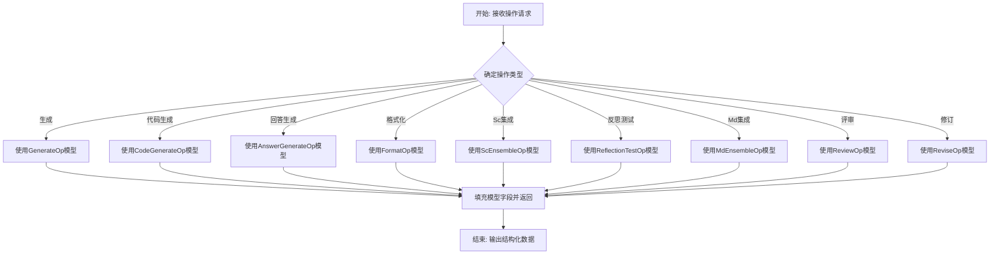

# `.\MetaGPT\metagpt\ext\aflow\scripts\operator_an.py` 详细设计文档

该文件定义了一系列用于操作（Operator）的Pydantic数据模型（Action Nodes）。这些模型作为结构化数据容器，用于在不同处理步骤（如生成、代码生成、回答生成、格式化、集成、反思测试、评审和修订）之间传递和验证特定格式的数据。每个模型对应一个特定的操作类型，并定义了该操作所需的输出字段及其描述。

## 整体流程



## 类结构

```
BaseModel (Pydantic基类)
├── GenerateOp
├── CodeGenerateOp
├── AnswerGenerateOp
├── FormatOp
├── ScEnsembleOp
├── ReflectionTestOp
├── MdEnsembleOp
├── ReviewOp
└── ReviseOp
```

## 全局变量及字段


### `GenerateOp.response`
    
针对当前问题的解决方案文本。

类型：`str`
    


### `CodeGenerateOp.code`
    
针对当前问题的完整代码解决方案。

类型：`str`
    


### `AnswerGenerateOp.thought`
    
解决该问题的逐步思考过程。

类型：`str`
    


### `AnswerGenerateOp.answer`
    
针对该问题的最终答案。

类型：`str`
    


### `FormatOp.solution`
    
针对当前问题的格式化答案。

类型：`str`
    


### `ScEnsembleOp.thought`
    
关于最一致解决方案的思考过程。

类型：`str`
    


### `ScEnsembleOp.solution_letter`
    
最一致解决方案对应的字母标识。

类型：`str`
    


### `ReflectionTestOp.reflection_and_solution`
    
针对代码执行错误或测试用例失败的修正性解决方案。

类型：`str`
    


### `MdEnsembleOp.thought`
    
用于确定最佳解决方案的逐步分析过程。

类型：`str`
    


### `MdEnsembleOp.solution_letter`
    
被选中的最佳解决方案对应的字母标识（仅一个字母）。

类型：`str`
    


### `ReviewOp.review_result`
    
评审结果，表示解决方案是否通过评审。

类型：`bool`
    


### `ReviewOp.feedback`
    
基于评审标准给出的反馈意见。

类型：`str`
    


### `ReviseOp.solution`
    
基于反馈意见修订后的解决方案。

类型：`str`
    
    

## 全局函数及方法


## 关键组件


### 数据模型基类 (BaseModel)

所有操作类的基类，使用Pydantic库定义，用于数据验证和序列化。

### 通用生成操作 (GenerateOp)

用于生成通用文本响应的操作模型。

### 代码生成操作 (CodeGenerateOp)

专门用于生成完整代码解决方案的操作模型。

### 答案生成操作 (AnswerGenerateOp)

用于生成包含逐步思考过程和最终答案的操作模型。

### 格式化操作 (FormatOp)

用于生成格式化答案的操作模型。

### 自洽集成操作 (ScEnsembleOp)

用于在多解决方案中选择最一致方案的操作模型，包含思考过程和方案字母标识。

### 反思测试操作 (ReflectionTestOp)

用于根据代码执行错误或测试用例失败生成纠正性解决方案的操作模型。

### 多数决策集成操作 (MdEnsembleOp)

用于通过逐步分析多个解决方案以确定最佳方案的操作模型。

### 评审操作 (ReviewOp)

用于评审解决方案并给出布尔结果和反馈的操作模型。

### 修订操作 (ReviseOp)

用于根据反馈生成修订后解决方案的操作模型。


## 问题及建议


### 已知问题

-   **字段默认值不明确**：多个类（如 `GenerateOp`, `CodeGenerateOp`, `AnswerGenerateOp` 等）的字符串字段默认值为空字符串 `""`。在 Pydantic 模型中，这可能导致难以区分“用户未提供值”和“用户明确提供了一个空字符串作为有效响应”两种情况。虽然对于当前描述的场景（如 `response`, `code`, `answer`）可能影响不大，但在需要严格校验输入完整性的场景下，这会成为一个语义模糊点。
-   **类名和字段名语义重叠**：部分类名和其核心字段名在语义上高度重叠或重复，例如 `GenerateOp` 类包含 `response` 字段，`CodeGenerateOp` 类包含 `code` 字段。虽然直观，但缺乏更具体的上下文描述，可能在其他模块引用时产生混淆，尤其是当这些类作为更大数据结构的一部分时。
-   **缺乏数据验证逻辑**：当前模型仅定义了字段的类型（`str`, `bool`）和默认值，但未利用 Pydantic 强大的数据验证功能（如 `Field` 的 `min_length`, `max_length`, `regex` 等约束）。例如，`solution_letter` 字段理论上应只接受单个字母，但当前定义无法阻止传入多个字符或非字母字符串。
-   **模型间关系不清晰**：代码定义了一系列操作（`Op`）类，它们很可能在某个工作流或管道中按顺序使用。然而，仅从这些独立的类定义中，无法看出它们之间的调用关系、数据流转或生命周期，缺乏对整体架构的文档说明。

### 优化建议

-   **明确字段的“可选性”**：对于非必填字段，建议将默认值设置为 `None` 并使用 `Optional[str]` 类型。这能更清晰地表示“字段可能不存在”，并通过 Pydantic 的 `None` 处理来区分用户未提供值和提供了空值。例如：`response: Optional[str] = Field(default=None, description="...")`。
-   **增强字段验证**：为字段添加具体的验证规则以提高数据质量。例如：
    -   为 `solution_letter` 字段添加正则表达式验证：`solution_letter: str = Field(default="", description="...", regex="^[A-Za-z]$")`。
    -   为 `thought`, `answer`, `code` 等文本字段设置合理的 `min_length` 或 `max_length` 约束，防止接收无意义或过长的数据。
-   **引入基类或共用结构**：如果多个类有共同的字段（例如多个类都有 `thought` 字段），可以考虑创建一个包含这些公共字段的基类（如 `BaseThoughtOp`），让其他类继承它，以提升代码的复用性和一致性。
-   **补充架构和上下文文档**：建议在模块级或类级别添加文档字符串，简要说明这些操作类的设计目的、它们通常如何被使用（例如，是某个 Agent 的响应格式，还是工作流中的步骤节点），以及彼此之间的关系。这能极大提升代码的可维护性和新开发者的理解速度。
-   **考虑使用枚举类型**：对于 `ReviewOp` 中的 `review_result` 字段，虽然当前是布尔值，但如果未来可能有更多状态（如“待定”、“需修改”），可以考虑预先设计为枚举类型（`Literal[True, False]` 或自定义 `Enum`），使意图更明确。


## 其它


### 设计目标与约束

本模块的设计目标是定义一组用于结构化数据交换的、强类型的操作（Operation）数据模型。这些模型作为不同处理节点（例如，代码生成节点、答案生成节点、评审节点等）之间输入和输出的标准化契约。其核心约束包括：1) 所有模型必须继承自 `pydantic.BaseModel` 以确保数据验证和序列化能力；2) 字段定义需使用 `pydantic.Field` 提供默认值和描述，以增强自描述性和接口清晰度；3) 模型设计应保持单一职责，每个类仅封装一个特定操作所需的数据结构。

### 错误处理与异常设计

本模块本身不包含业务逻辑，因此不主动抛出或处理运行时异常。其错误处理主要体现在数据验证层面，由 `pydantic` 库在模型实例化或数据解析时自动执行。当传入的数据不符合模型字段的类型注解或约束（例如，`review_result` 字段接收到非布尔值）时，`pydantic` 将抛出 `ValidationError` 异常。调用方有责任捕获并处理此类验证错误。模块设计上通过明确的类型注解和字段描述，旨在预防和减少因数据结构不一致导致的运行时错误。

### 数据流与状态机

这些操作模型是数据流中的静态载体，本身不驱动状态变化。它们在一个可能的工作流或管道（Pipeline）中流动，每个模型代表流程中一个特定步骤的输入或输出。例如，`CodeGenerateOp` 可能由代码生成节点产生，并作为后续测试或评审节点的输入；`ReviewOp` 的输出（包含 `review_result` 和 `feedback`）可能决定流程是进入 `ReviseOp` 修订环节还是继续向下推进。模型序列定义了数据在流程节点间传递的格式和内容，共同构成了一个隐式的、基于数据内容的状态转移机制。

### 外部依赖与接口契约

本模块的核心外部依赖是 `pydantic` 库（`BaseModel`, `Field`），用于实现数据模型的基类、字段验证和序列化功能。模块对外提供的接口契约即这些公开的操作模型类（如 `GenerateOp`, `ReviewOp`）。任何消费此模块的系统或服务，在需要与定义这些操作类型的处理单元交互时，都应按照相应模型的结构来构造请求数据或解析响应数据。字段的 `description` 属性构成了接口契约的重要文档部分，明确了每个字段的语义。

    