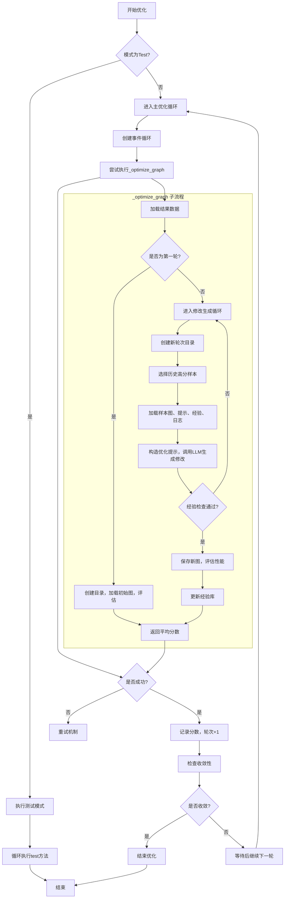
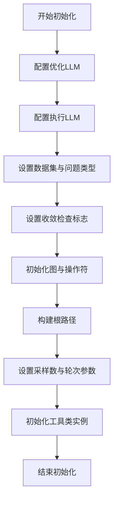
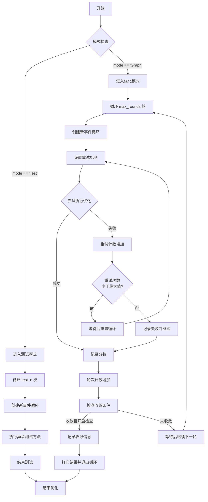
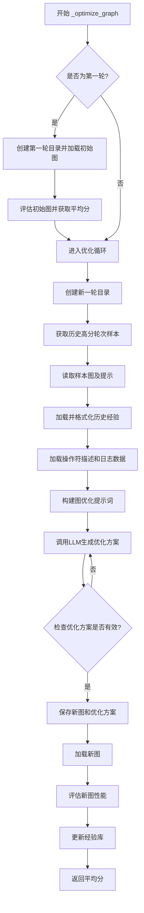
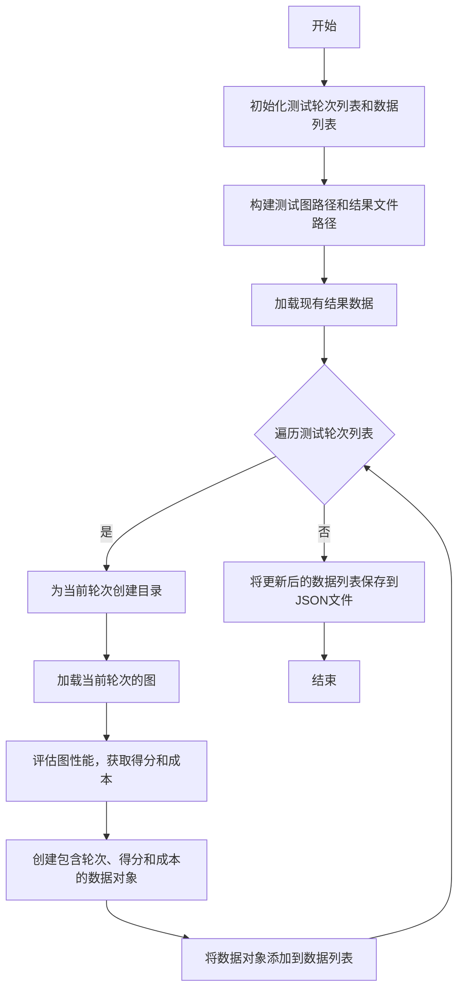

# `.\MetaGPT\metagpt\ext\aflow\scripts\optimizer.py` 详细设计文档

该代码实现了一个基于图结构的优化器，用于迭代优化工作流图（graph）。它通过加载历史数据、评估当前图性能、利用LLM生成图修改建议、验证修改有效性并更新经验库的循环过程，旨在自动提升图在特定任务（如数学、代码、问答）上的表现。

## 整体流程



## 类结构

```
BaseModel (Pydantic基类)
└── GraphOptimize (优化结果数据模型)

Optimizer (主优化器类)
├── 字段: optimize_llm_config, optimize_llm, execute_llm_config, dataset, type, check_convergence, graph, operators, root_path, sample, top_scores, round, max_rounds, validation_rounds, graph_utils, data_utils, experience_utils, evaluation_utils, convergence_utils
├── 方法: __init__, optimize, _optimize_graph, test
```

## 全局变量及字段


### `QuestionType`
    
定义问题类型的字面量，用于指定优化任务所属的领域，如数学、代码或问答。

类型：`Literal["math", "code", "qa"]`
    


### `OptimizerType`
    
定义优化器运行模式的字面量，用于区分正常的图优化流程和测试模式。

类型：`Literal["Graph", "Test"]`
    


### `GraphOptimize.modification`
    
存储由LLM生成的图优化建议或修改指令。

类型：`str`
    


### `GraphOptimize.graph`
    
存储优化后的图结构表示，通常以字符串形式描述节点和边的关系。

类型：`str`
    


### `GraphOptimize.prompt`
    
存储用于生成图优化建议的提示词模板或上下文。

类型：`str`
    


### `Optimizer.optimize_llm_config`
    
用于配置优化阶段使用的LLM（大语言模型）的参数，如模型名称、API密钥等。

类型：`dict`
    


### `Optimizer.optimize_llm`
    
根据optimize_llm_config创建的LLM实例，负责生成图优化建议。

类型：`LLM instance`
    


### `Optimizer.execute_llm_config`
    
用于配置执行阶段使用的LLM的参数，该LLM可能用于评估或执行优化后的图。

类型：`dict`
    


### `Optimizer.dataset`
    
指定优化任务所使用的数据集类型，决定了评估和优化的数据来源。

类型：`DatasetType`
    


### `Optimizer.type`
    
指定当前优化任务的问题类型（如math, code, qa），影响优化策略和评估标准。

类型：`QuestionType`
    


### `Optimizer.check_convergence`
    
控制是否在优化过程中检查收敛性的标志，为True时会在满足条件时提前终止优化循环。

类型：`bool`
    


### `Optimizer.graph`
    
存储当前正在处理或已加载的图结构，在优化过程中会被更新。

类型：`str or None`
    


### `Optimizer.operators`
    
存储可用于图优化的操作符列表，这些操作符定义了图结构可以进行的变换类型。

类型：`List`
    


### `Optimizer.root_path`
    
优化过程中生成的所有文件（如图、经验、结果）的根目录路径，基于数据集和优化路径构建。

类型：`str`
    


### `Optimizer.sample`
    
指定在每一轮优化中，从历史最佳轮次中采样多少轮作为参考。

类型：`int`
    


### `Optimizer.top_scores`
    
存储历史最佳评估分数的列表，用于跟踪优化进展和收敛性判断。

类型：`List`
    


### `Optimizer.round`
    
记录当前优化轮次的计数器，从initial_round开始递增。

类型：`int`
    


### `Optimizer.max_rounds`
    
优化过程的最大轮次限制，防止无限循环。

类型：`int`
    


### `Optimizer.validation_rounds`
    
在评估图性能时，使用的验证数据集执行次数，用于获得更稳定的平均分数。

类型：`int`
    


### `Optimizer.graph_utils`
    
提供图文件加载、保存、创建目录以及构建优化提示词等与图操作相关的工具类实例。

类型：`GraphUtils`
    


### `Optimizer.data_utils`
    
提供加载、保存结果数据，选择历史最佳轮次等数据处理功能的工具类实例。

类型：`DataUtils`
    


### `Optimizer.experience_utils`
    
管理优化经验（如历史修改和效果）的工具类实例，用于指导新的优化并避免重复修改。

类型：`ExperienceUtils`
    


### `Optimizer.evaluation_utils`
    
负责评估优化后图性能的工具类实例，计算得分和成本等指标。

类型：`EvaluationUtils`
    


### `Optimizer.convergence_utils`
    
负责检查优化过程是否收敛的工具类实例，基于历史得分判断是否达到稳定状态。

类型：`ConvergenceUtils`
    
    

## 全局函数及方法

### `Optimizer.__init__`

初始化优化器实例，配置优化过程所需的核心组件、参数和工具类，为后续的图优化流程做好准备。

参数：

- `dataset`：`DatasetType`，指定使用的数据集类型
- `question_type`：`QuestionType`，指定问题类型（如数学、代码、问答）
- `opt_llm_config`：`dict`，优化阶段使用的LLM配置
- `exec_llm_config`：`dict`，执行阶段使用的LLM配置
- `operators`：`List`，可用的图操作符列表
- `sample`：`int`，每轮优化中采样的最佳轮次数
- `check_convergence`：`bool`，是否启用收敛性检查，默认为False
- `optimized_path`：`str`，优化结果和中间数据的存储根路径
- `initial_round`：`int`，初始优化轮次，默认为1
- `max_rounds`：`int`，最大优化轮次，默认为20
- `validation_rounds`：`int`，每轮优化中用于验证的图执行次数，默认为5

返回值：`None`，构造函数无返回值

#### 流程图



#### 带注释源码

```python
def __init__(
    self,
    dataset: DatasetType,
    question_type: QuestionType,
    opt_llm_config,
    exec_llm_config,
    operators: List,
    sample: int,
    check_convergence: bool = False,
    optimized_path: str = None,
    initial_round: int = 1,
    max_rounds: int = 20,
    validation_rounds: int = 5,
) -> None:
    # 配置优化阶段使用的LLM
    self.optimize_llm_config = opt_llm_config
    self.optimize_llm = create_llm_instance(self.optimize_llm_config)
    # 配置执行阶段使用的LLM（暂未实例化）
    self.execute_llm_config = exec_llm_config

    # 设置优化任务的基本属性
    self.dataset = dataset
    self.type = question_type
    self.check_convergence = check_convergence

    # 初始化图结构（当前为空）和可用的操作符列表
    self.graph = None
    self.operators = operators

    # 构建优化结果的存储根路径，格式为 {optimized_path}/{dataset}
    self.root_path = f"{optimized_path}/{self.dataset}"
    # 设置每轮优化中采样的最佳轮次数
    self.sample = sample
    # 初始化用于存储每轮最高分数的列表
    self.top_scores = []
    # 设置当前优化轮次、最大轮次和验证轮次
    self.round = initial_round
    self.max_rounds = max_rounds
    self.validation_rounds = validation_rounds

    # 初始化各个功能模块的工具类实例，并传入根路径用于数据管理
    self.graph_utils = GraphUtils(self.root_path)
    self.data_utils = DataUtils(self.root_path)
    self.experience_utils = ExperienceUtils(self.root_path)
    self.evaluation_utils = EvaluationUtils(self.root_path)
    self.convergence_utils = ConvergenceUtils(self.root_path)
```

### `Optimizer.optimize`

该方法执行图优化过程，根据指定的模式（"Graph"或"Test"）进行多轮优化或测试验证。在"Graph"模式下，它会循环执行多轮优化，每轮尝试生成并评估改进后的图结构，同时检查收敛条件以提前终止优化。在"Test"模式下，它会对指定轮次的图进行测试评估。

参数：

- `mode`：`OptimizerType`，优化模式，可选值为"Graph"（执行优化流程）或"Test"（执行测试验证）。

返回值：`None`，该方法不返回任何值，优化结果通过内部状态和日志输出。

#### 流程图



#### 带注释源码

```python
def optimize(self, mode: OptimizerType = "Graph"):
    # 如果模式为"Test"，则执行测试流程
    if mode == "Test":
        test_n = 3  # 验证数据集的执行次数
        for i in range(test_n):
            # 为每次测试创建新的事件循环
            loop = asyncio.new_event_loop()
            asyncio.set_event_loop(loop)
            # 运行异步测试方法并获取分数
            score = loop.run_until_complete(self.test())
        return None  # 测试模式不返回优化结果

    # 进入图优化主循环，最多执行 max_rounds 轮
    for opt_round in range(self.max_rounds):
        # 为每轮优化创建新的事件循环
        loop = asyncio.new_event_loop()
        asyncio.set_event_loop(loop)

        retry_count = 0
        max_retries = 1  # 设置最大重试次数为1

        # 重试机制：尝试执行优化，失败后重试
        while retry_count < max_retries:
            try:
                # 运行异步图优化方法并获取分数
                score = loop.run_until_complete(self._optimize_graph())
                break  # 成功则跳出重试循环
            except Exception as e:
                retry_count += 1
                logger.info(f"Error occurred: {e}. Retrying... (Attempt {retry_count}/{max_retries})")
                # 如果达到最大重试次数，记录日志并设置分数为None
                if retry_count == max_retries:
                    logger.info("Max retries reached. Moving to next round.")
                    score = None

                # 指数退避等待，避免频繁重试
                wait_time = 5 * retry_count
                time.sleep(wait_time)

            # 如果还有重试机会，重置事件循环
            if retry_count < max_retries:
                loop = asyncio.new_event_loop()
                asyncio.set_event_loop(loop)

        # 优化轮次计数增加
        self.round += 1
        logger.info(f"Score for round {self.round}: {score}")

        # 检查是否达到收敛条件（例如，最近几轮分数稳定）
        converged, convergence_round, final_round = self.convergence_utils.check_convergence(top_k=3)

        # 如果检测到收敛且开启了收敛检查，则提前终止优化循环
        if converged and self.check_convergence:
            logger.info(
                f"Convergence detected, occurred in round {convergence_round}, final round is {final_round}"
            )
            # 打印每轮的平均分数和标准差
            self.convergence_utils.print_results()
            break  # 跳出优化主循环

        # 每轮优化后等待一段时间，避免资源过度使用
        time.sleep(5)
```

### `Optimizer._optimize_graph`

该方法是一个异步方法，负责执行图优化流程的核心迭代。它首先加载历史数据，然后进入一个循环，根据历史经验、评分和操作符描述生成新的图优化方案，并检查其有效性。一旦生成有效的优化方案，它会保存新图、评估其性能，并更新经验库，最后返回该轮优化的平均得分。

参数：
-  `self`：`Optimizer`，当前Optimizer实例的引用
-  无其他显式参数，但方法内部使用了大量实例属性（如 `self.round`, `self.root_path`, `self.operators` 等）

返回值：`float`，返回评估后得到的图性能平均得分。

#### 流程图



#### 带注释源码

```python
async def _optimize_graph(self):
    # 定义验证轮次，用于评估图性能
    validation_n = self.validation_rounds  # validation datasets's execution number
    # 构建图存储的基础路径
    graph_path = f"{self.root_path}/workflows"
    # 加载历史评估结果数据
    data = self.data_utils.load_results(graph_path)

    # 如果是第一轮优化，则进行初始化操作
    if self.round == 1:
        # 为第一轮创建存储目录
        directory = self.graph_utils.create_round_directory(graph_path, self.round)
        # 加载初始图结构
        self.graph = self.graph_utils.load_graph(self.round, graph_path)
        # 评估初始图的性能，获取平均分
        avg_score = await self.evaluation_utils.evaluate_graph(self, directory, validation_n, data, initial=True)

    # 进入优化循环，直到生成满足条件的优化方案
    while True:
        # 为新一轮优化创建目录
        directory = self.graph_utils.create_round_directory(graph_path, self.round + 1)

        # 获取历史评分最高的若干轮次
        top_rounds = self.data_utils.get_top_rounds(self.sample)
        # 从高分轮次中随机选择一个作为优化样本
        sample = self.data_utils.select_round(top_rounds)

        # 读取选定样本的图文件和对应的提示词
        prompt, graph_load = self.graph_utils.read_graph_files(sample["round"], graph_path)
        # 从图文件中提取出用于解决问题的核心图结构
        graph = self.graph_utils.extract_solve_graph(graph_load)

        # 加载历史经验数据
        processed_experience = self.experience_utils.load_experience()
        # 将经验数据格式化为针对选定样本的提示信息
        experience = self.experience_utils.format_experience(processed_experience, sample["round"])

        # 加载可用操作符的描述
        operator_description = self.graph_utils.load_operators_description(self.operators)
        # 加载选定样本的详细执行日志
        log_data = self.data_utils.load_log(sample["round"])

        # 综合所有信息，构建用于请求LLM进行图优化的提示词
        graph_optimize_prompt = self.graph_utils.create_graph_optimize_prompt(
            experience, sample["score"], graph[0], prompt, operator_description, self.type, log_data
        )

        # 使用ActionNode和Pydantic模型来结构化地调用LLM
        graph_optimize_node = await ActionNode.from_pydantic(GraphOptimize).fill(
            context=graph_optimize_prompt, mode="xml_fill", llm=self.optimize_llm
        )

        # 从LLM的响应中解析出优化方案
        response = await self.graph_utils.get_graph_optimize_response(graph_optimize_node)

        # 检查生成的优化方案是否有效（例如，是否与历史经验冲突）
        check = self.experience_utils.check_modification(
            processed_experience, response["modification"], sample["round"]
        )

        # 如果方案有效，则跳出循环；否则，重新生成
        if check:
            break

    # 保存新生成的图和优化方案到文件
    self.graph_utils.write_graph_files(directory, response, self.round + 1, self.dataset)

    # 基于样本和优化方案创建新的经验数据
    experience = self.experience_utils.create_experience_data(sample, response["modification"])

    # 加载新保存的图
    self.graph = self.graph_utils.load_graph(self.round + 1, graph_path)

    # 记录目录信息
    logger.info(directory)

    # 评估新图的性能
    avg_score = await self.evaluation_utils.evaluate_graph(self, directory, validation_n, data, initial=False)

    # 将本轮的经验和评分更新到经验库中
    self.experience_utils.update_experience(directory, experience, avg_score)

    # 返回本轮优化的平均得分
    return avg_score
```

### `Optimizer.test`

该方法用于在测试模式下评估指定轮次（rounds）的图（graph）性能。它会加载指定轮次的图，使用评估工具进行测试，记录得分和成本，并将结果保存到JSON文件中。

参数：

- `self`：`Optimizer`，当前Optimizer实例的引用

返回值：`None`，该方法不返回任何值

#### 流程图



#### 带注释源码

```python
async def test(self):
    # 定义要测试的轮次列表，这里固定为第5轮
    rounds = [5]  # You can choose the rounds you want to test here.
    data = []

    # 构建测试专用的图存储路径
    graph_path = f"{self.root_path}/workflows_test"
    # 获取结果数据将要保存的JSON文件路径
    json_file_path = self.data_utils.get_results_file_path(graph_path)

    # 加载该路径下已有的结果数据（如果存在）
    data = self.data_utils.load_results(graph_path)

    # 遍历所有指定的测试轮次
    for round in rounds:
        # 为当前测试轮次创建对应的目录
        directory = self.graph_utils.create_round_directory(graph_path, round)
        # 从指定路径加载当前轮次的图结构
        self.graph = self.graph_utils.load_graph(round, graph_path)

        # 调用评估工具，在测试模式下评估当前图的性能
        # 返回得分、平均成本和总成本
        score, avg_cost, total_cost = await self.evaluation_utils.evaluate_graph_test(self, directory, is_test=True)

        # 根据当前轮次、得分和成本创建一个新的数据记录
        new_data = self.data_utils.create_result_data(round, score, avg_cost, total_cost)
        # 将新记录添加到数据列表中
        data.append(new_data)

        # 将更新后的完整数据列表保存到JSON文件中
        self.data_utils.save_results(json_file_path, data)
```

## 关键组件


### 张量索引与惰性加载

代码中未直接涉及张量索引与惰性加载机制。该代码主要处理工作流图的优化与评估，其数据加载（如`DataUtils.load_results`）和图形加载（如`GraphUtils.load_graph`）可能涉及文件I/O操作，但未实现显式的惰性加载或张量索引逻辑。

### 反量化支持

代码中未涉及任何量化或反量化操作。该代码的核心是使用大语言模型（LLM）进行工作流图的迭代优化和评估，不涉及模型权重或数据的量化处理。

### 量化策略

代码中未涉及任何量化策略。优化过程（`_optimize_graph`方法）基于历史经验数据和LLM生成修改建议来改进图结构，其“优化”指的是逻辑流程的优化，而非模型参数的量化压缩。


## 问题及建议


### 已知问题

-   **异步事件循环管理不当**：在 `optimize` 和 `test` 方法中，每次循环都创建新的 `asyncio.new_event_loop()` 并手动设置事件循环。这种做法在嵌套调用或复杂异步环境中容易导致事件循环冲突、资源泄漏和不可预测的行为，违反了 `asyncio` 的最佳实践。
-   **硬编码的测试参数**：`test` 方法中 `rounds = [5]` 和 `optimize` 方法中 `test_n = 3` 是硬编码的。这使得测试配置不灵活，无法通过外部参数进行调整，限制了代码的复用性和测试场景的覆盖范围。
-   **异常重试逻辑存在缺陷**：`optimize` 方法中的重试机制在每次重试前会重新创建事件循环 (`loop = asyncio.new_event_loop()`)，但此操作位于 `while retry_count < max_retries:` 循环内部。如果第一次重试失败，第二次重试时，创建新循环的代码不会被执行，因为它在 `while` 循环体之外（仅在 `if retry_count < max_retries:` 条件下执行）。这可能导致后续重试使用已关闭或状态异常的事件循环。
-   **潜在的阻塞操作**：`optimize` 方法中使用了 `time.sleep(5)` 和 `time.sleep(wait_time)`。在异步编程范式中，使用同步的 `time.sleep` 会阻塞整个事件循环，影响并发性能。应考虑使用 `asyncio.sleep` 替代。
-   **代码重复与职责模糊**：`optimize` 方法中同时处理了主优化流程 (`mode == "Graph"`) 和测试流程 (`mode == "Test"`)，但测试流程的逻辑与主流程差异较大，且部分逻辑（如创建事件循环、运行评估）与 `_optimize_graph` 和 `test` 方法存在重复。这违反了单一职责原则，使得 `optimize` 方法过于臃肿且难以维护。
-   **配置参数传递不清晰**：`Optimizer` 类的 `__init__` 方法接收了大量配置参数（如 `opt_llm_config`, `exec_llm_config`, `operators`, `sample`, `check_convergence` 等），但部分参数（如 `exec_llm_config`）在初始化后并未被类内部使用（例如，未用于创建执行LLM实例）。这可能导致调用者困惑，不清楚哪些参数是必需的。
-   **结果数据管理耦合**：`data` 对象在 `_optimize_graph` 和 `test` 方法中被多次加载和传递。数据加载 (`self.data_utils.load_results`) 和保存的逻辑分散在多个方法中，与核心的优化/测试逻辑耦合，降低了代码的内聚性，也使得数据状态管理变得复杂。

### 优化建议

-   **重构异步事件循环管理**：移除手动创建和设置事件循环的代码。确保整个 `Optimizer` 类及其方法在一个统一、由外部调用者管理的异步上下文中运行（例如，使用 `asyncio.run` 或在现有的异步函数中调用）。将 `optimize` 和 `test` 方法改为 `async def`，并在内部使用 `await` 调用其他异步方法（如 `_optimize_graph`）。
-   **参数化测试配置**：将 `test` 方法中的 `rounds` 和 `optimize` 方法中的 `test_n` 作为类初始化参数或方法参数传入。例如，可以为 `test` 方法增加 `test_rounds: List[int]` 参数，为 `optimize` 方法增加 `test_executions: int` 参数（当 `mode="Test"` 时使用），以提高灵活性。
-   **修复并简化重试逻辑**：将重试机制重构为一个独立的、装饰器式的函数，专注于重试逻辑。确保在每次重试时，相关的资源（如事件循环，如果需要）被正确重置。如果坚持在当前结构内修改，应确保创建新循环的代码在每次重试时都能执行，或者更佳的是，如前所述，移除手动循环管理。
-   **使用异步休眠**：将 `time.sleep` 替换为 `await asyncio.sleep`，以避免阻塞事件循环，提升程序的并发处理能力。
-   **分离关注点，重构方法**：
    -   将 `optimize` 方法中 `mode == "Test"` 的逻辑完全移除，因为 `test` 方法已经独立存在。`optimize` 方法应只专注于优化流程。
    -   考虑将 `_optimize_graph` 方法中的“生成并检查修改”循环（`while True:`）提取到一个单独的方法中，如 `_generate_and_validate_modification`，使主方法逻辑更清晰。
    -   审查 `Optimizer` 类的职责，考虑是否可以将“评估”、“经验管理”、“收敛检查”等职责进一步委托给相应的 `*Utils` 类，让 `Optimizer` 主要充当流程编排者。
-   **清理未使用的配置参数**：审查 `__init__` 方法中的所有参数，移除那些在类内部未被使用的参数（如 `exec_llm_config`，如果确实未使用）。或者，明确其用途并在代码中添加相应的使用逻辑或注释。考虑使用一个配置数据类（如 `OptimizerConfig`）来集中管理所有配置，提高可读性和可维护性。
-   **解耦数据管理逻辑**：将数据加载和保存的职责更彻底地封装在 `DataUtils` 类中。`Optimizer` 的方法应通过 `DataUtils` 提供的接口与数据交互，而不直接关心文件路径和序列化细节。考虑引入一个简单的数据上下文或状态对象来管理当前优化回合的数据，减少在方法间传递 `data` 变量的需要。


## 其它


### 设计目标与约束

本优化器的核心设计目标是通过多轮迭代，自动优化用于解决特定类型问题（如数学、代码、问答）的图结构（或工作流）。它通过结合历史经验数据、性能评估和LLM驱动的图修改建议，旨在提升图在目标任务上的性能得分。主要约束包括：1) 优化过程依赖于外部LLM服务的稳定性和响应质量；2) 优化轮次和验证轮次数量有限，以控制计算成本和时间；3) 图结构的修改需通过经验检查，以避免无效或退化的修改；4) 系统设计为支持特定数据集和问题类型，通用性有限。

### 错误处理与异常设计

代码中采用了基础的错误重试机制来处理`_optimize_graph`方法中可能出现的异常。当捕获到任何`Exception`时，会进行最多1次重试，每次重试前有递增的等待时间。若重试耗尽，则记录日志并将本轮得分设为`None`，继续下一轮优化。这种设计较为简单，缺乏对特定异常类型（如网络超时、LLM API限制、文件IO错误）的差异化处理。未捕获的异常可能导致进程终止。`test`方法中没有显式的错误处理。

### 数据流与状态机

**数据流**：
1.  **初始化**：加载配置、数据集、操作符，初始化各工具类（`GraphUtils`, `DataUtils`等）。
2.  **优化循环**：
    a. 加载上一轮最佳图及其元数据（提示词、分数、日志）。
    b. 加载历史经验数据。
    c. 组合以上信息，通过LLM（`ActionNode`）生成图修改建议。
    d. 检查修改建议是否与历史经验冲突，冲突则重新生成。
    e. 保存新图，并在多个验证数据集上评估新图的性能得分。
    f. 记录本轮经验（修改、得分）和结果。
    g. 检查收敛条件（如最近几轮得分是否稳定），满足则终止循环。
3.  **测试模式**：对指定轮次的图进行独立评估，记录得分和成本。

**状态机**：
优化器本身没有复杂的状态机，但其`round`属性标识了当前的优化轮次，是推进流程的关键状态。`graph`属性存储当前加载的图结构。`top_scores`列表跟踪历史高分。收敛检查逻辑（`check_convergence`）基于历史得分序列判断是否达到终止状态。

### 外部依赖与接口契约

1.  **LLM服务**：通过`create_llm_instance`创建LLM实例，依赖`metagpt.provider.llm_provider_registry`。`optimize_llm`用于生成图优化建议，`execute_llm_config`（虽在`__init__`中接收但未在提供代码中显式使用）可能用于图执行评估。契约：期望LLM能理解特定格式的优化提示并返回结构化的`GraphOptimize`对象。
2.  **工具类模块**：依赖`metagpt.ext.aflow.scripts.optimizer_utils`下的多个工具类（`GraphUtils`, `DataUtils`, `ExperienceUtils`, `EvaluationUtils`, `ConvergenceUtils`）。契约：这些工具类需提供特定的文件读写、数据加载、评估计算和收敛判断方法，并遵循约定的路径结构。
3.  **动作节点**：依赖`metagpt.actions.action_node.ActionNode`。契约：用于封装对LLM的调用，并解析返回的XML或结构化数据。
4.  **数据集**：依赖`metagpt.ext.aflow.scripts.evaluator.DatasetType`。契约：定义了可用的数据集类型。
5.  **文件系统**：严重依赖本地文件系统来存储和读取图文件、结果JSON、经验数据等。路径结构由`root_path`（如`{optimized_path}/{dataset}`）定义。

### 性能考量

1.  **LLM调用成本与延迟**：每轮优化至少调用一次LLM生成修改建议，每轮评估需在多个验证集上执行图（可能涉及多次LLM调用），总LLM调用次数为`优化轮次 * (1 + 验证轮次 * 验证集数量)`，成本与延迟是主要瓶颈。
2.  **文件I/O**：每轮都需要读写图文件、结果文件、经验文件。随着轮次增加，文件操作可能成为性能瓶颈，尤其是当图文件较大时。
3.  **内存使用**：加载历史数据（如所有轮次的结果、经验）时，如果数据量巨大，可能占用较多内存。当前通过`sample`参数限制加载的轮次数量进行缓解。
4.  **异步执行**：`evaluate_graph`和`evaluate_graph_test`方法设计为异步，可能用于并发执行多个验证任务以提高评估效率，但代码中未展示具体的并发实现细节。
5.  **收敛检查开销**：`check_convergence`方法可能需要计算多轮得分的统计量（如移动平均、标准差），计算开销较小。

### 安全与合规

1.  **数据安全**：优化过程读取和生成的数据（如图结构、提示词、评估结果）存储在本地文件系统。需确保存储路径的访问权限适当，防止未授权访问。代码中未涉及加密或脱敏处理。
2.  **模型输入/输出**：传递给LLM的提示词可能包含从数据集加载的问题、历史图结构、操作符描述等。需注意避免提示词中意外包含敏感信息。LLM返回的图修改内容未经内容安全过滤。
3.  **依赖安全**：项目依赖第三方库（如`pydantic`, `metagpt`等），需管理这些依赖的版本以规避已知安全漏洞。
4.  **资源使用**：长时间运行的优化循环可能消耗大量计算资源和LLM API配额，需要有监控和配额管理机制，代码中未体现。

    