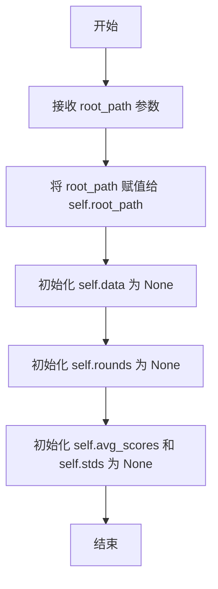
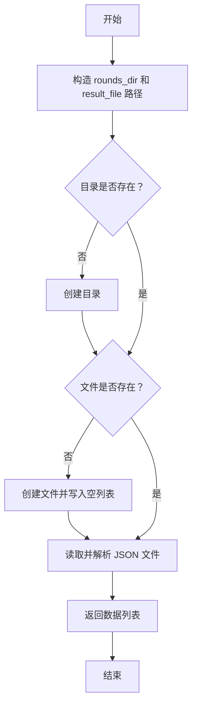
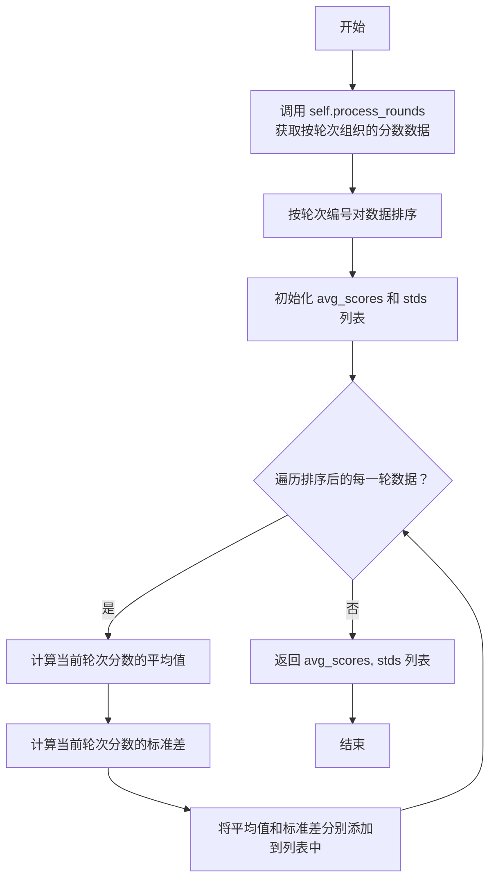

# `.\MetaGPT\metagpt\ext\aflow\scripts\optimizer_utils\convergence_utils.py` 详细设计文档

该代码实现了一个用于分析多轮迭代过程中评分数据收敛性的工具类。它从指定路径读取JSON格式的评分结果，按轮次组织数据，计算每轮的平均分和标准差，并基于动态选取的Top-K高分及其统计特性（如均值变化和标准误差）来判断评分序列是否在连续多轮内达到统计意义上的收敛状态。

## 整体流程

```mermaid
graph TD
    A[开始: 初始化ConvergenceUtils] --> B[调用check_convergence]
    B --> C{调用calculate_avg_and_std}
    C --> D{调用process_rounds}
    D --> E{调用load_data}
    E --> F[读取或创建results.json]
    F --> G[按轮次组织评分数据]
    G --> H[计算每轮平均分与标准差]
    H --> I[数据足够计算收敛?]
    I -- 否 --> J[返回未收敛]
    I -- 是 --> K[遍历每轮数据]
    K --> L[动态选取当前及之前轮次的Top-K高分]
    L --> M[计算当前轮Y值(均值)及标准误差]
    M --> N{是否为第一轮?}
    N -- 否 --> O[计算Y值变化Delta_Y及其标准误差]
    O --> P{Delta_Y是否在置信区间内?}
    P -- 是 --> Q[收敛计数器+1]
    Q --> R{连续收敛轮数达标?}
    R -- 是 --> S[返回已收敛及轮次范围]
    R -- 否 --> T[继续下一轮]
    P -- 否 --> U[重置收敛计数器]
    U --> T
    N -- 是 --> V[更新上一轮Y值及标准误差]
    V --> T
    T --> K
    K --> W[遍历结束，返回未收敛]
```

## 类结构

```
ConvergenceUtils
├── __init__
├── load_data
├── process_rounds
├── calculate_avg_and_std
├── check_convergence
└── print_results
```

## 全局变量及字段


### `ConvergenceUtils.root_path`
    
存储结果文件所在根目录的路径，用于定位和加载数据。

类型：`str`
    


### `ConvergenceUtils.data`
    
缓存从JSON文件加载的原始数据，每个条目包含轮次（round）和分数（score）。

类型：`list[dict]`
    


### `ConvergenceUtils.rounds`
    
缓存按轮次（round）分组后的分数列表，键为轮次号，值为该轮次的所有分数。

类型：`dict[int, list[float]]`
    


### `ConvergenceUtils.avg_scores`
    
缓存按轮次排序后计算得到的每轮平均分数列表。

类型：`list[float]`
    


### `ConvergenceUtils.stds`
    
缓存按轮次排序后计算得到的每轮分数标准差列表。

类型：`list[float]`
    
    

## 全局函数及方法

### `ConvergenceUtils.__init__`

初始化 `ConvergenceUtils` 类的实例，设置根路径并初始化用于存储分析结果的内部状态变量。

参数：
- `root_path`：`str`，用于存储结果数据的根目录路径。后续方法将在此路径下查找或创建 `workflows/results.json` 文件。

返回值：`None`，此方法为构造函数，不返回任何值。

#### 流程图



#### 带注释源码

```python
def __init__(self, root_path):
    # 存储传入的根路径，用于后续文件操作
    self.root_path = root_path
    # 初始化数据存储变量，将在 `load_data` 或 `process_rounds` 方法中被填充
    self.data = None
    # 初始化轮次数据存储变量，将在 `process_rounds` 方法中被填充
    self.rounds = None
    # 初始化平均分和标准差存储变量，将在 `calculate_avg_and_std` 或 `check_convergence` 方法中被填充
    self.avg_scores, self.stds = None, None
```

### `ConvergenceUtils.load_data`

该方法用于从指定根目录下的 `workflows/results.json` 文件中读取数据。如果文件或目录不存在，它会自动创建目录和一个包含空列表的 JSON 文件，确保读取操作不会因文件缺失而失败。

参数：
- `root_path`：`str`，数据文件的根目录路径。

返回值：`list`，从 `results.json` 文件中读取并解析出的数据列表。如果文件是新创建的，则返回空列表 `[]`。

#### 流程图



#### 带注释源码

```python
def load_data(self, root_path):
    """
    Read JSON file, create a new file if it doesn't exist, then return the data.
    """
    # 构造工作流目录和结果文件的完整路径
    rounds_dir = os.path.join(root_path, "workflows")
    result_file = os.path.join(rounds_dir, "results.json")

    # 确保目录存在，如果不存在则创建
    os.makedirs(rounds_dir, exist_ok=True)

    # 如果结果文件不存在，则创建一个新的文件并写入一个空列表
    if not os.path.exists(result_file):
        with open(result_file, "w") as file:
            json.dump([], file)

    # 读取结果文件，解析 JSON 内容并返回
    with open(result_file, "r") as file:
        return json.load(file)
```

### `ConvergenceUtils.process_rounds`

该方法用于处理从JSON文件加载的原始数据，并按轮次（round）对分数（score）进行分组和组织。它首先调用`load_data`方法从指定路径加载数据，然后遍历数据条目，根据轮次编号将分数归类到对应的列表中，最终返回一个以轮次编号为键、该轮次所有分数列表为值的字典。

参数：
-  `self`：`ConvergenceUtils`，`ConvergenceUtils`类的实例，用于访问实例属性和其他方法。

返回值：`dict`，一个字典，其中键为轮次编号（整数），值为该轮次所有分数的列表（浮点数列表）。

#### 流程图

```mermaid
graph TD
    A[开始] --> B[调用 load_data 加载数据]
    B --> C[初始化空字典 rounds]
    C --> D{遍历数据条目 entry}
    D --> E[获取当前条目的 round 和 score]
    E --> F{round 是否在 rounds 中?}
    F -- 否 --> G[在 rounds 中为该 round 创建空列表]
    G --> H
    F -- 是 --> H[将 score 添加到 rounds[round] 列表中]
    H --> I{是否还有更多条目?}
    I -- 是 --> D
    I -- 否 --> J[返回 rounds 字典]
    J --> K[结束]
```

#### 带注释源码

```python
def process_rounds(self):
    """
    按轮次组织数据，返回一个按轮次分组的分数字典。
    """
    # 1. 从指定根路径加载原始JSON数据，并赋值给实例变量 self.data
    self.data = self.load_data(root_path=self.root_path)
    # 2. 初始化一个空字典，用于存储按轮次分组的结果
    rounds = {}
    # 3. 遍历加载的每一条数据条目
    for entry in self.data:
        # 3.1 从当前条目中提取轮次编号
        round_number = entry["round"]
        # 3.2 从当前条目中提取分数
        score = entry["score"]
        # 3.3 检查当前轮次是否已存在于字典中，若不存在则为其初始化一个空列表
        if round_number not in rounds:
            rounds[round_number] = []
        # 3.4 将当前分数添加到对应轮次的分数列表中
        rounds[round_number].append(score)
    # 4. 返回组织好的字典
    return rounds
```


### `ConvergenceUtils.calculate_avg_and_std`

该方法用于计算每一轮（round）的平均分数和标准差。它首先通过调用 `process_rounds` 方法加载并组织数据，然后对轮次进行排序，最后使用 NumPy 计算每一轮所有分数的平均值和标准差。

参数：
- `self`：`ConvergenceUtils`，`ConvergenceUtils` 类的实例。

返回值：`tuple`，包含两个列表：第一个列表是每一轮的平均分数（`avg_scores`），第二个列表是每一轮的标准差（`stds`）。

#### 流程图



#### 带注释源码

```python
def calculate_avg_and_std(self):
    """
    计算每一轮的平均分数和标准差，返回两个列表：平均分数列表和标准差列表。
    """
    # 1. 调用 process_rounds 方法，加载数据并按轮次组织，结果存储在 self.rounds 中
    self.rounds = self.process_rounds()

    # 2. 按轮次编号（字典的键）对 self.rounds 的条目进行排序
    sorted_rounds = sorted(self.rounds.items(), key=lambda x: x[0])
    # 3. 初始化两个空列表，用于存储每一轮的平均分数和标准差
    avg_scores = []
    stds = []
    # 4. 遍历排序后的每一轮数据
    for round_number, scores in sorted_rounds:
        # 4.1 使用 NumPy 计算当前轮次所有分数的平均值，并添加到 avg_scores 列表
        avg_scores.append(np.mean(scores))
        # 4.2 使用 NumPy 计算当前轮次所有分数的标准差，并添加到 stds 列表
        stds.append(np.std(scores))
    # 5. 返回包含平均分数列表和标准差列表的元组
    return avg_scores, stds
```


### `ConvergenceUtils.check_convergence`

该方法用于检查一个多轮次评估过程是否已经收敛。其核心逻辑是：在每一轮，它动态地从当前轮及之前所有轮次中选取平均分最高的 `top_k` 个轮次，计算这些轮次的平均分（`y_current`）及其标准误（`sigma_y_current`）。然后，它比较当前轮与上一轮的 `y` 值变化（`delta_y`）是否在由置信水平 `z` 和标准误 `sigma_delta_y` 定义的置信区间内。如果连续 `consecutive_rounds` 轮的变化都在此区间内，则判定为收敛。

参数：
- `top_k`：`int`，用于计算收敛指标 `y` 的顶级轮次数量。
- `z`：`int` 或 `float`，Z分数，对应收敛判断的置信水平（例如，z=0 表示不考虑置信区间，仅当 `delta_y` 为0时才收敛）。
- `consecutive_rounds`：`int`，判定收敛所需满足条件的连续轮次数。

返回值：`tuple`，包含三个元素的元组 `(converged, convergence_round, final_round)`。
- `converged`：`bool`，是否检测到收敛。
- `convergence_round`：`int` 或 `None`，收敛开始的轮次索引（从0开始）。如果未收敛，则为 `None`。
- `final_round`：`int` 或 `None`，收敛结束的轮次索引。如果未收敛，则为 `None`。

#### 流程图

```mermaid
flowchart TD
    A[开始检查收敛] --> B{总轮数 >= top_k + 1?}
    B -- 否 --> C[返回 False, None, None]
    B -- 是 --> D[初始化: convergence_count=0, previous_y=None, sigma_y_previous=None]
    D --> E[循环: i 从 0 到 总轮数-1]
    E --> F[动态选取前 i+1 轮中<br>平均分最高的 top_k 个轮次]
    F --> G[计算 y_current<br>（top_k 轮平均分的均值）]
    G --> H[计算 sigma_y_current<br>（y_current 的标准误）]
    H --> I{previous_y 是否为 None?}
    I -- 是 --> J[更新 previous_y = y_current<br>sigma_y_previous = sigma_y_current]
    J --> K[循环结束?]
    K -- 否 --> E
    I -- 否 --> L[计算 delta_y = y_current - previous_y<br>sigma_delta_y = sqrt(sigma_y_current² + sigma_y_previous²)]
    L --> M{abs(delta_y) <= z * sigma_delta_y?}
    M -- 是 --> N[convergence_count += 1]
    N --> O{convergence_count >= consecutive_rounds?}
    O -- 是 --> P[返回 True, i - consecutive_rounds + 1, i]
    O -- 否 --> J
    M -- 否 --> Q[convergence_count = 0]
    Q --> J
    K -- 是 --> R[返回 False, None, None]
```

#### 带注释源码

```python
def check_convergence(self, top_k=3, z=0, consecutive_rounds=5):
    """
    检查收敛性。z 是对应置信水平的 z 分数。
    consecutive_rounds 是必须满足停止条件的连续轮数。
    """
    # 计算每一轮的平均分和标准差
    self.avg_scores, self.stds = self.calculate_avg_and_std()
    # 如果总轮数不足以计算 top_k+1 轮，则返回未收敛
    if len(self.avg_scores) < top_k + 1:
        return False, None, None
    convergence_count = 0  # 收敛计数器
    previous_y = None  # 上一轮的 Y 值（top_k 分数的平均值）
    sigma_y_previous = None  # 上一轮 Y 值的标准误
    for i in range(len(self.avg_scores)):
        # 从当前轮及之前所有轮次中动态选取 top_k
        top_k_indices = np.argsort(self.avg_scores[: i + 1])[::-1][
            :top_k
        ]  # 按平均分降序选择前 k 个索引
        top_k_scores = [self.avg_scores[j] for j in top_k_indices]  # 获取 top k 分数列表
        top_k_stds = [
            self.stds[j] for j in top_k_indices
        ]  # 获取 top k 分数对应的标准差列表
        # 计算当前轮 top k 分数的平均值，即 y_current
        y_current = np.mean(top_k_scores)
        # 计算 y_current 的标准误（sigma_y_current），代表分数的离散程度
        sigma_y_current = np.sqrt(np.sum([s**2 for s in top_k_stds]) / (top_k**2))
        # 如果不是第一轮，则计算 Y 的变化量（Delta_Y）及其对应的标准误
        if previous_y is not None:
            # 计算当前轮与上一轮之间的 Y 差异
            delta_y = y_current - previous_y
            # 计算 Y 差异的标准误（sigma_Delta_Y）
            sigma_delta_y = np.sqrt(sigma_y_current**2 + sigma_y_previous**2)
            # 检查 Y 的变化是否在可接受的置信区间内，即收敛条件
            if abs(delta_y) <= z * sigma_delta_y:
                convergence_count += 1
                # 如果连续收敛的轮数达到设定值，则返回收敛信息
                if convergence_count >= consecutive_rounds:
                    return True, i - consecutive_rounds + 1, i
            else:
                # 如果变化较大，则重置收敛计数器
                convergence_count = 0
        # 更新上一轮的 Y 值和标准误
        previous_y = y_current
        sigma_y_previous = sigma_y_current
    # 如果未满足收敛条件，则返回未收敛
    return False, None, None
```


### `ConvergenceUtils.print_results`

该方法用于计算并打印所有轮次的平均分数和标准差。它首先调用 `calculate_avg_and_std` 方法计算数据，然后遍历结果，使用 `logger.info` 格式化输出每一轮的平均分和标准差。

参数：
- `self`：`ConvergenceUtils`，`ConvergenceUtils` 类的实例。

返回值：`None`，该方法不返回任何值，仅执行打印操作。

#### 流程图

```mermaid
flowchart TD
    A[开始] --> B[调用 calculate_avg_and_std<br>计算 avg_scores 和 stds]
    B --> C[初始化循环<br>i=1]
    C --> D{i <= len(avg_scores)?}
    D -- 是 --> E[获取第 i 轮的<br>avg_score 和 std]
    E --> F[使用 logger.info 格式化输出<br>Round i: Average Score = avg_score, Standard Deviation = std]
    F --> G[i++]
    G --> D
    D -- 否 --> H[结束]
```

#### 带注释源码

```python
    def print_results(self):
        """
        打印所有轮次的平均分数和标准差。
        """
        # 调用 calculate_avg_and_std 方法，计算所有轮次的平均分（avg_scores）和标准差（stds）
        self.avg_scores, self.stds = self.calculate_avg_and_std()
        # 使用 enumerate 遍历 avg_scores 和 stds，i 从 1 开始计数，代表轮次编号
        for i, (avg_score, std) in enumerate(zip(self.avg_scores, self.stds), 1):
            # 使用 logger.info 打印每一轮的信息，格式化平均分和标准差保留四位小数
            logger.info(f"Round {i}: Average Score = {avg_score:.4f}, Standard Deviation = {std:.4f}")
```


## 关键组件


### 数据加载与初始化组件

负责从指定路径的JSON文件中读取多轮实验的得分数据，并在文件不存在时自动创建空文件进行初始化，确保后续处理流程的顺利进行。

### 数据预处理与组织组件

将加载的原始数据按轮次（round）进行分组和整理，构建一个以轮次为键、该轮次所有得分列表为值的字典结构，为后续的统计分析提供结构化的数据。

### 统计分析计算组件

对每一轮次的得分数据计算其平均值（代表该轮次的中心趋势）和标准差（代表该轮次得分的离散程度），并返回按轮次排序后的平均值列表和标准差列表。

### 收敛性判定算法组件

实现核心的收敛性检测逻辑。该算法动态地从历史所有轮次中选取平均分最高的top_k个轮次，计算其均值（Y值）及其标准误。通过比较连续轮次间Y值的变化（ΔY）是否在由Z分数和标准误定义的置信区间内，来判断模型性能是否趋于稳定。当连续满足条件的轮次达到预设阈值（consecutive_rounds）时，判定为已收敛。


## 问题及建议


### 已知问题

-   **硬编码文件路径和结构**：`load_data` 方法内部硬编码了 `"workflows"` 子目录和 `"results.json"` 文件名。这使得代码与特定的文件系统结构强耦合，降低了复用性和灵活性。如果数据存储位置或格式发生变化，需要修改源代码。
-   **数据加载与处理逻辑耦合**：`process_rounds` 方法内部直接调用了 `load_data`。这意味着每次调用 `process_rounds` 都会重新从磁盘读取文件，如果 `check_convergence` 或 `print_results` 被多次调用，会导致不必要的重复 I/O 操作，影响性能。
-   **状态管理不清晰**：类字段 `self.data`, `self.rounds`, `self.avg_scores`, `self.stds` 的初始化（`None`）和赋值分散在多个方法中（如 `process_rounds`, `calculate_avg_and_std`, `check_convergence`）。这种隐式的状态变更使得类的内部状态难以追踪和理解，增加了维护的复杂度。
-   **缺乏输入验证和错误处理**：代码假设 JSON 文件格式完全正确，且包含 `"round"` 和 `"score"` 字段。如果文件损坏、格式错误或字段缺失，`json.load` 或字典键访问会抛出异常，导致程序崩溃。此外，对 `top_k`、`consecutive_rounds` 等参数的有效性（如正整數）也未做检查。
-   **收敛算法逻辑可能过于严格**：当前的收敛判定基于连续多轮 `Delta_Y` 的绝对值小于 `z * sigma_delta_y`。如果 `z` 设置不当（例如为0），或者数据噪声较大，可能导致算法永远无法收敛，或过早/过晚收敛。算法对参数 `z` 和 `consecutive_rounds` 非常敏感，但缺乏对参数选择的指导或自适应机制。
-   **性能瓶颈**：在 `check_convergence` 的循环中，每次迭代都通过 `np.argsort(self.avg_scores[: i + 1])[::-1][:top_k]` 重新计算前 `i+1` 轮中的 top_k 索引。这是一个 O(n log n) 的操作，且随着轮数 `i` 增加，计算成本线性增长。对于大量轮次，这可能成为性能瓶颈。

### 优化建议

-   **解耦数据加载与路径配置**：将文件路径和结构（如子目录名、文件名）作为构造函数的参数，或通过配置文件/环境变量注入，而不是硬编码在方法内部。这提高了代码的可配置性和可测试性。
-   **实现惰性加载与缓存**：将数据加载 (`load_data`)、处理 (`process_rounds`)、计算 (`calculate_avg_and_std`) 分离，并确保它们只执行一次。可以使用属性装饰器 (`@property`) 或显式的缓存标志来实现惰性求值和结果复用，避免重复的 I/O 和计算。
-   **重构状态管理**：明确类字段的初始化时机和依赖关系。考虑将 `data`, `rounds`, `avg_scores`, `stds` 设置为私有属性，并通过清晰的公共方法（如 `get_processed_data`, `get_statistics`）来访问，确保状态变更的透明性和可控性。
-   **增强健壮性**：
    -   在 `load_data` 中，使用 `try-except` 块捕获 `json.JSONDecodeError` 等异常，并提供有意义的错误信息或默认行为。
    -   在 `process_rounds` 中，验证数据条目是否包含必需的键，并处理缺失或异常值（如记录警告、跳过或使用默认值）。
    -   在方法开始处验证输入参数（如 `top_k > 0`, `consecutive_rounds > 0`）。
-   **优化收敛算法性能**：在 `check_convergence` 中，维护一个当前观察到的 `avg_scores` 的排序结构（如使用堆 `heapq`），以便在 O(log n) 时间内动态获取 top_k 元素，而不是每次迭代都进行全量排序。这将显著提升算法在处理多轮数据时的效率。
-   **提高算法可解释性与可调性**：
    -   考虑在 `check_convergence` 方法中返回更详细的收敛信息，例如每轮的 `y_current`、`delta_y` 和 `sigma_delta_y` 值，便于调试和分析。
    -   可以提供多种收敛判定策略（如基于绝对阈值、相对变化率等），并通过策略模式允许用户选择或组合。
    -   在文档中详细说明参数 `z` 和 `consecutive_rounds` 的物理意义和设置建议。
-   **改进日志和输出**：`print_results` 方法直接使用 `logger.info`，将输出与日志系统绑定。考虑将其分离，提供一个返回格式化字符串的方法，让调用者决定如何输出（如日志、打印、写入文件）。同时，确保日志级别恰当，避免在非调试场景下输出过多信息。


## 其它


### 设计目标与约束

本模块的核心设计目标是提供一个轻量级、可复用的工具类，用于分析多轮迭代过程中性能指标（分数）的收敛性。其主要约束包括：1) 输入数据格式固定为包含`round`和`score`字段的JSON列表；2) 收敛性判断算法基于动态选取的Top-K分数均值及其统计误差；3) 代码需具备良好的可读性和可测试性，便于集成到更大的自动化工作流中。

### 错误处理与异常设计

当前代码的错误处理较为基础，主要依赖Python内置异常和文件系统操作。潜在风险包括：1) `load_data`方法中，若`results.json`文件存在但内容格式非法（非JSON列表），`json.load`会抛出`json.JSONDecodeError`，但未被捕获。2) `process_rounds`方法假设数据条目中必然包含`round`和`score`键，若缺失会导致`KeyError`。3) `calculate_avg_and_std`方法使用`np.mean`和`np.std`，若某轮`scores`列表为空，将产生`RuntimeWarning`并返回`nan`，可能影响后续计算。建议增加数据验证和异常捕获逻辑。

### 数据流与状态机

模块的数据流清晰：从指定根目录的`workflows/results.json`文件读取原始数据 -> 按轮次组织分数 -> 计算每轮的平均分与标准差 -> 执行收敛性检测算法。类内部状态通过`data`、`rounds`、`avg_scores`、`stds`等字段管理。`check_convergence`方法是核心状态机，其内部维护`convergence_count`计数器，根据连续多轮`Delta_Y`是否在置信区间内来判断状态是否从“未收敛”转移到“已收敛”。

### 外部依赖与接口契约

1.  **外部库依赖**：`numpy`（用于数值计算）、`metagpt.logs`（用于日志记录）。`json`和`os`为标准库。
2.  **文件接口契约**：期望在`{root_path}/workflows/results.json`路径存在一个JSON文件，其内容为字典列表，每个字典必须包含整数类型的`"round"`和数值类型的`"score"`键。
3.  **类接口契约**：
    *   `__init__(root_path: str)`: 初始化时需提供数据根目录路径。
    *   `check_convergence(top_k=3, z=0, consecutive_rounds=5) -> (bool, Optional[int], Optional[int])`: 主调用接口，返回收敛状态、起始轮次和结束轮次。
    *   `print_results() -> None`: 辅助接口，打印结果。

### 算法详述与假设

收敛性检测算法基于以下步骤和假设：
1.  **动态Top-K选择**：在每一轮`i`，算法从第1轮到第`i`轮的所有平均分中，选择最高的`top_k`个。
2.  **统计量计算**：计算这`top_k`个分数的均值(`y_current`)及其标准误(`sigma_y_current`)。
3.  **变化量检验**：计算当前轮与上一轮的`y`值变化量(`delta_y`)及其标准误(`sigma_delta_y`)。
4.  **收敛判定**：若`|delta_y| <= z * sigma_delta_y`（即变化量在`z`倍标准误的置信区间内），则认为该轮满足收敛条件。当**连续**`consecutive_rounds`轮满足条件时，判定为整体收敛。
5.  **关键假设**：算法假设分数服从正态分布，且各轮分数相互独立，以便使用标准误进行区间估计。`z`参数通常对应标准正态分布的分位数（如`z=1.96`对应95%置信水平），默认值`0`使得条件极为严格（仅当`delta_y == 0`才收敛）。

### 配置参数说明

`check_convergence`方法的参数控制算法行为：
*   `top_k (int)`: 用于计算代表分数的样本数量。值越小，对少数高分轮次越敏感；值越大，稳定性越高，但可能平滑掉早期提升。
*   `z (float)`: 置信区间系数，决定了判定“无显著变化”的宽严程度。`z=0`要求绝对无变化；`z>0`允许在统计误差范围内的微小波动。
*   `consecutive_rounds (int)`: 要求连续满足收敛条件的轮次数。用于防止偶然波动导致的误判，提高判定稳健性。

### 测试策略建议

1.  **单元测试**：
    *   `load_data`: 测试文件不存在时的创建行为，以及文件存在时的正确读取。
    *   `process_rounds`: 测试不同结构输入数据的分组是否正确。
    *   `calculate_avg_and_std`: 测试平均值和标准差计算是否正确。
    *   `check_convergence`: 构造已知收敛/不收敛的数据序列，验证算法返回结果是否符合预期，并测试边界条件（如总轮数不足）。
2.  **集成测试**：模拟完整工作流，生成`results.json`文件，调用该类并验证其输出与日志。
3.  **参数敏感性测试**：针对不同的`top_k`, `z`, `consecutive_rounds`组合，验证其对相同数据集的收敛判定结果。

### 部署与集成考量

1.  **资源需求**：仅依赖CPU和少量内存，无特殊硬件要求。`numpy`的引入需在部署环境中确保可用。
2.  **集成模式**：该类可作为独立脚本运行（如示例`__main__`部分），也可作为库被其他模块（如工作流控制器、实验管理器）导入并调用`check_convergence`方法。
3.  **日志与监控**：当前使用`logger.info`输出结果，集成时需确保`metagpt.logs` logger被正确配置，或适配为项目通用的日志工具。

    