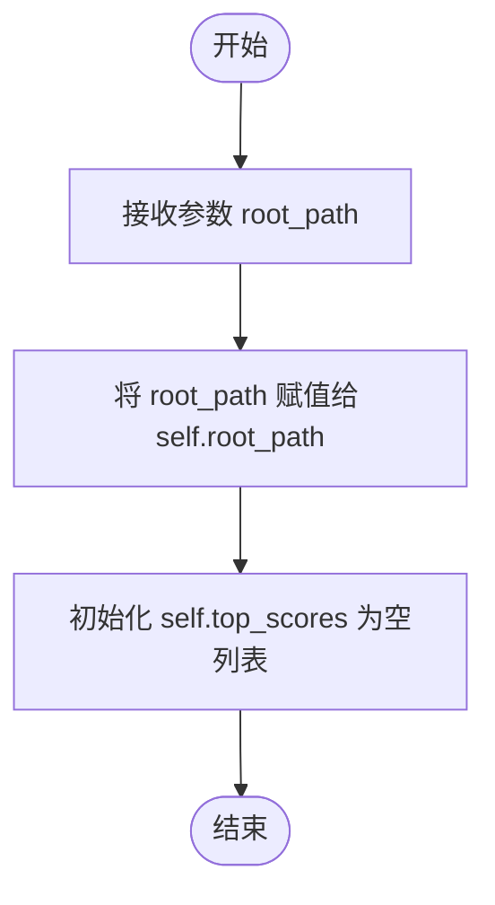
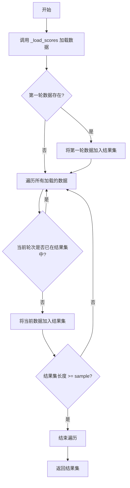
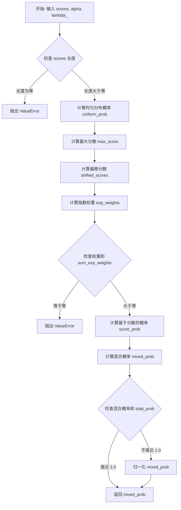
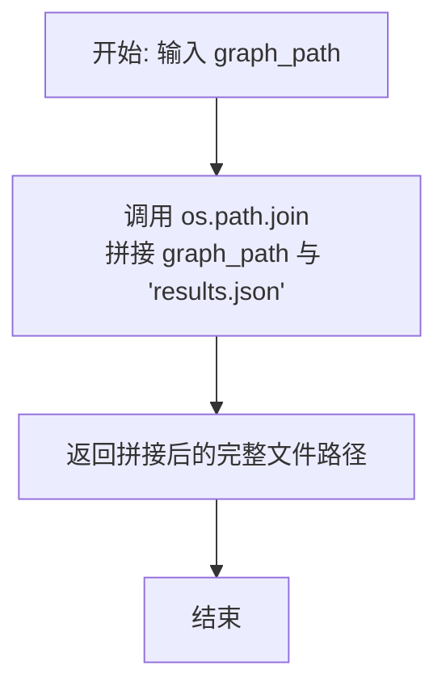
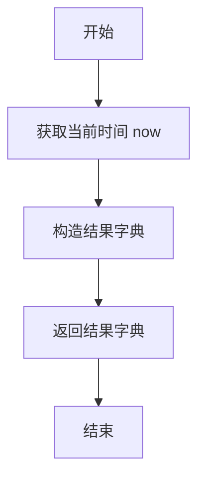
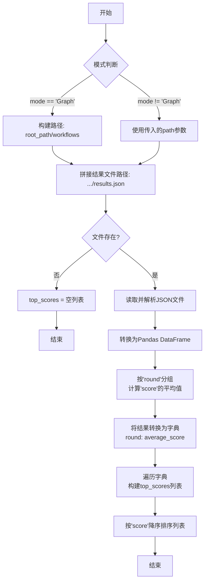

# `.\MetaGPT\metagpt\ext\aflow\scripts\optimizer_utils\data_utils.py` 详细设计文档

该代码定义了一个名为 DataUtils 的工具类，主要用于管理和分析多轮实验（例如强化学习或工作流评估）的结果数据。其核心功能包括：从指定目录结构（如 `workflows/round_X`）中加载和解析 JSON 格式的结果文件（`results.json` 和 `log.json`）；根据分数对实验轮次进行排序和筛选；实现一种基于分数的混合概率分布（结合均匀分布和指数加权分布）来随机选择轮次；以及创建、保存和更新结果数据。它旨在支持对实验过程进行回顾性分析和采样决策。

## 整体流程

```mermaid
graph TD
    A[开始: DataUtils 初始化] --> B[调用方法 (如 get_top_rounds, select_round)]
    B --> C{方法类型?}
    C -- 数据加载/处理 --> D[调用 _load_scores 或 load_results]
    D --> E[读取并解析 JSON 文件]
    E --> F[转换为 Pandas DataFrame 或 List]
    F --> G[计算聚合指标 (如平均分)]
    G --> H[返回处理后的数据列表]
    C -- 轮次选择 --> I[调用 select_round]
    I --> J[对项目按分数排序]
    J --> K[调用 _compute_probabilities 计算混合概率]
    K --> L[根据概率分布随机选择一项]
    L --> M[返回选中项]
    C -- 日志处理 --> N[调用 load_log]
    N --> O[检查日志文件路径]
    O --> P{文件存在?}
    P -- 否 --> Q[返回空字符串]
    P -- 是 --> R[读取并解析 JSON 日志]
    R --> S[随机采样最多3条记录]
    S --> T[格式化为字符串并返回]
    C -- 数据保存 --> U[调用 save_results]
    U --> V[将数据列表写入 JSON 文件]
```

## 类结构

```
DataUtils
├── __init__
├── load_results
├── get_top_rounds
├── select_round
├── _compute_probabilities
├── load_log
├── get_results_file_path
├── create_result_data
├── save_results
└── _load_scores
```

## 全局变量及字段


### `DataUtils.root_path`
    
数据文件存储的根目录路径，用于构建其他文件路径。

类型：`str`
    


### `DataUtils.top_scores`
    
缓存从结果文件中加载并处理后的各轮次平均得分数据，按得分降序排序。

类型：`list[dict]`
    
    

## 全局函数及方法


### `DataUtils.__init__`

`DataUtils` 类的构造函数，用于初始化一个`DataUtils`实例。它接收一个根路径参数，并将其存储为实例属性，同时初始化一个用于存储顶级分数列表的空列表。

参数：

-  `root_path`：`str`，数据文件所在的根目录路径。后续方法将基于此路径构建完整的文件路径。

返回值：`None`，构造函数不返回任何值。

#### 流程图



#### 带注释源码

```
def __init__(self, root_path: str):
    # 将传入的根路径参数存储为实例变量，供类内其他方法使用。
    self.root_path = root_path
    # 初始化一个空列表，用于后续存储从结果文件中加载并处理后的“轮次-平均分”数据。
    self.top_scores = []
```


### `DataUtils.load_results`

该方法用于从指定路径下的 `results.json` 文件中加载结果数据。如果文件存在且内容为有效的 JSON 格式，则返回解析后的列表；如果文件不存在或 JSON 解析失败，则返回一个空列表。

参数：

-  `path`：`str`，包含 `results.json` 文件的目录路径。

返回值：`list`，从 `results.json` 文件中加载的数据列表，如果文件不存在或内容无效则返回空列表 `[]`。

#### 流程图

```mermaid
flowchart TD
    A[开始: load_results(path)] --> B[拼接完整文件路径<br>result_path = os.path.join(path, "results.json")]
    B --> C{文件是否存在?<br>os.path.exists(result_path)}
    C -- 否 --> D[返回空列表 []]
    C -- 是 --> E[尝试打开并读取文件]
    E --> F{JSON解析是否成功?}
    F -- 否<br>捕获JSONDecodeError --> D
    F -- 是 --> G[返回解析后的列表 json.load(json_file)]
    G --> H[结束]
    D --> H
```

#### 带注释源码

```python
def load_results(self, path: str) -> list:
    # 1. 根据传入的目录路径，拼接出 results.json 文件的完整路径。
    result_path = os.path.join(path, "results.json")
    # 2. 检查该文件是否存在。
    if os.path.exists(result_path):
        # 3. 如果文件存在，以只读模式打开它。
        with open(result_path, "r") as json_file:
            try:
                # 4. 尝试使用 json 模块解析文件内容。
                return json.load(json_file)
            except json.JSONDecodeError:
                # 5. 如果解析失败（文件内容不是有效的JSON），捕获异常并返回空列表。
                return []
    # 6. 如果文件不存在，直接返回空列表。
    return []
```


### `DataUtils.get_top_rounds`

该方法从加载的评分数据中，根据指定的采样数量，筛选出不同轮次（round）中评分最高的记录，并确保第一轮（round=1）的记录总是被包含在内。

参数：

- `sample`：`int`，需要采样的不同轮次的数量。
- `path`：`str`，可选参数，指定加载评分数据的具体路径。如果为None，则使用类初始化时指定的`root_path`。
- `mode`：`str`，指定数据加载模式，默认为"Graph"。此参数影响`_load_scores`方法内部如何构建数据路径。

返回值：`list`，一个字典列表，每个字典代表一个被选中的轮次，包含`round`和`score`键。列表长度不超过`sample`参数，且始终包含第一轮（如果存在）。

#### 流程图



#### 带注释源码

```python
def get_top_rounds(self, sample: int, path=None, mode="Graph"):
    # 1. 加载评分数据到 self.top_scores 列表
    self._load_scores(path, mode)
    # 2. 初始化集合和列表，用于去重和存储最终结果
    unique_rounds = set()
    unique_top_scores = []

    # 3. 确保第一轮（round == 1）的数据总是被包含在结果中
    first_round = next((item for item in self.top_scores if item["round"] == 1), None)
    if first_round:
        unique_top_scores.append(first_round)
        unique_rounds.add(1)

    # 4. 遍历所有加载的评分数据
    for item in self.top_scores:
        # 5. 检查当前轮次是否已被选取
        if item["round"] not in unique_rounds:
            # 6. 如果未被选取，则加入结果集
            unique_top_scores.append(item)
            unique_rounds.add(item["round"])

            # 7. 检查是否已达到所需的采样数量
            if len(unique_top_scores) >= sample:
                break

    # 8. 返回筛选出的不同轮次的最高评分数据列表
    return unique_top_scores
```

### `DataUtils.select_round`

该方法用于从一个包含“轮次”信息的字典列表中，根据每个字典的`score`字段，使用一种混合概率分布（结合均匀分布和基于分数的指数分布）随机选择一个轮次。其核心是引入随机性，同时让高分轮次有更高的被选中概率。

参数：

- `items`：`list`，一个字典列表，每个字典必须包含`score`键，表示该轮次的分数。

返回值：`dict`，从输入列表中根据概率分布随机选择出的一个字典元素。

#### 流程图

```mermaid
flowchart TD
    A[开始: select_round(items)] --> B{items 列表是否为空?};
    B -- 是 --> C[抛出 ValueError 异常];
    B -- 否 --> D[按 score 降序排序 items];
    D --> E[提取 scores 列表并乘以100];
    E --> F[调用 _compute_probabilities(scores) 计算概率];
    F --> G[使用 numpy.random.choice 根据概率选择索引];
    G --> H[记录日志: 概率分布、排序列表、选中索引和元素];
    H --> I[返回选中的字典元素];
    C --> J[结束: 异常];
    I --> K[结束: 返回结果];
```

#### 带注释源码

```python
def select_round(self, items):
    # 1. 输入验证：确保列表不为空
    if not items:
        raise ValueError("Item list is empty.")

    # 2. 数据处理：根据'score'字段对列表进行降序排序
    sorted_items = sorted(items, key=lambda x: x["score"], reverse=True)
    # 将分数乘以100，可能是为了放大差异，便于后续概率计算
    scores = [item["score"] * 100 for item in sorted_items]

    # 3. 核心逻辑：调用内部方法计算每个元素的选中概率
    probabilities = self._compute_probabilities(scores)
    # 记录计算出的概率分布和排序后的列表，用于调试和观察
    logger.info(f"\nMixed probability distribution: {probabilities}")
    logger.info(f"\nSorted rounds: {sorted_items}")

    # 4. 随机选择：根据计算出的概率分布，随机选择一个索引
    selected_index = np.random.choice(len(sorted_items), p=probabilities)
    # 记录最终选择结果
    logger.info(f"\nSelected index: {selected_index}, Selected item: {sorted_items[selected_index]}")

    # 5. 返回结果：返回选中索引对应的字典元素
    return sorted_items[selected_index]
```

### `DataUtils._compute_probabilities`

该方法根据给定的分数列表，计算一个混合概率分布。该分布结合了均匀分布和基于分数指数加权的分布，通过一个混合参数 `lambda_` 来控制两者的权重。最终返回一个归一化的概率数组，用于后续的随机选择。

参数：

- `scores`：`list` 或 `numpy.ndarray`，原始分数列表，通常为数值型数据。
- `alpha`：`float`，默认为 `0.2`，用于控制指数加权分布的陡峭程度。`alpha` 值越大，高分项的概率被放大的程度越高。
- `lambda_`：`float`，默认为 `0.3`，混合参数。`lambda_` 表示均匀分布的权重，`1 - lambda_` 表示基于分数的指数加权分布的权重。

返回值：`numpy.ndarray`，一个与输入 `scores` 长度相同的概率数组，所有元素之和为 1.0，表示每个分数对应的被选中概率。

#### 流程图



#### 带注释源码

```python
def _compute_probabilities(self, scores, alpha=0.2, lambda_=0.3):
    # 将输入分数转换为numpy数组，并指定为高精度浮点数以确保计算稳定性
    scores = np.array(scores, dtype=np.float64)
    n = len(scores)

    # 防御性编程：如果分数列表为空，则抛出异常
    if n == 0:
        raise ValueError("Score list is empty.")

    # 计算均匀分布概率：每个选项的概率相等，均为 1/n
    uniform_prob = np.full(n, 1.0 / n, dtype=np.float64)

    # 计算基于分数的指数加权概率分布
    # 1. 找到最高分，用于数值稳定性（防止指数运算溢出）
    max_score = np.max(scores)
    # 2. 将所有分数减去最高分，使得最高分的偏移值为0，其他为负数
    shifted_scores = scores - max_score
    # 3. 计算指数权重：exp(alpha * shifted_scores)
    #    alpha控制分布的“锐利”程度，alpha越大，高分项的概率被放大得越多
    exp_weights = np.exp(alpha * shifted_scores)

    # 计算所有权重的和
    sum_exp_weights = np.sum(exp_weights)
    # 防御性编程：如果权重和为0（例如所有分数都是负无穷），则无法归一化
    if sum_exp_weights == 0:
        raise ValueError("Sum of exponential weights is 0, cannot normalize.")

    # 4. 归一化指数权重，得到基于分数的概率分布
    score_prob = exp_weights / sum_exp_weights

    # 混合两种概率分布：lambda_ * 均匀分布 + (1 - lambda_) * 分数分布
    # lambda_ 控制探索（均匀）与利用（分数）的权衡
    mixed_prob = lambda_ * uniform_prob + (1 - lambda_) * score_prob

    # 由于浮点数计算可能存在微小误差，确保概率总和为1.0
    total_prob = np.sum(mixed_prob)
    if not np.isclose(total_prob, 1.0):
        mixed_prob = mixed_prob / total_prob

    # 返回最终的混合概率分布
    return mixed_prob
```

### `DataUtils.load_log`

该方法用于加载指定轮次（round）的日志文件，并从中随机抽取最多3条日志记录，以格式化的JSON字符串形式返回。如果日志文件不存在或为空，则返回空字符串。

参数：

- `cur_round`：`int`，当前轮次编号，用于在特定模式下构建日志文件路径。
- `path`：`str`，可选参数，当`mode`不为"Graph"时，直接指定日志文件的路径。
- `mode`：`str`，模式选择，默认为"Graph"。当为"Graph"时，根据`root_path`和`cur_round`构建路径；否则使用`path`参数指定的路径。

返回值：`str`，返回一个包含随机抽取的日志条目的格式化JSON字符串，每个条目之间用两个换行符分隔。如果文件不存在或数据为空，则返回空字符串。

#### 流程图

```mermaid
flowchart TD
    A[开始] --> B{模式是否为'Graph'?}
    B -- 是 --> C[构建路径: root_path/workflows/round_{cur_round}/log.json]
    B -- 否 --> D[使用传入的path作为日志路径]
    C --> E
    D --> E{检查日志文件是否存在?}
    E -- 否 --> F[返回空字符串]
    E -- 是 --> G[调用read_json_file读取JSON数据]
    G --> H{数据是字典吗?}
    H -- 是 --> I[将字典转换为列表]
    H -- 否 --> J{数据是列表吗?}
    J -- 否 --> K[将数据转换为列表]
    I --> L
    K --> L
    J -- 是 --> L{数据列表是否为空?}
    L -- 是 --> F
    L -- 否 --> M[计算抽样大小: min(3, 数据长度)]
    M --> N[使用random.sample随机抽取样本]
    N --> O[遍历每个样本，格式化为JSON字符串并拼接]
    O --> P[返回拼接后的日志字符串]
    F --> Q[结束]
    P --> Q
```

#### 带注释源码

```python
def load_log(self, cur_round, path=None, mode: str = "Graph"):
    # 根据模式决定日志文件的路径
    if mode == "Graph":
        # 在Graph模式下，路径基于root_path和当前轮次构建
        log_dir = os.path.join(self.root_path, "workflows", f"round_{cur_round}", "log.json")
    else:
        # 在其他模式下，直接使用传入的path参数
        log_dir = path

    # 检查文件是否存在，不存在则返回空字符串
    if not os.path.exists(log_dir):
        return ""  # 如果文件不存在，返回空字符串
    # 记录日志路径（用于调试）
    logger.info(log_dir)
    # 使用工具函数读取JSON文件
    data = read_json_file(log_dir, encoding="utf-8")

    # 确保数据是列表格式，便于后续处理
    if isinstance(data, dict):
        # 如果是字典，转换为单元素列表
        data = [data]
    elif not isinstance(data, list):
        # 如果既不是字典也不是列表，强制转换为列表
        data = list(data)

    # 检查数据是否为空
    if not data:
        return ""

    # 确定抽样大小，最多抽取3条记录
    sample_size = min(3, len(data))
    # 从数据中随机抽取指定数量的样本
    random_samples = random.sample(data, sample_size)

    # 初始化日志字符串
    log = ""
    # 遍历每个随机样本
    for sample in random_samples:
        # 将样本格式化为美观的JSON字符串并追加到log中，每个条目后加两个换行符
        log += json.dumps(sample, indent=4, ensure_ascii=False) + "\n\n"

    # 返回拼接好的日志字符串
    return log
```


### `DataUtils.get_results_file_path`

该方法用于根据给定的图（或工作流）路径，构建并返回该路径下 `results.json` 文件的完整路径。它是一个简单的路径拼接工具函数，旨在封装文件路径的构建逻辑，提高代码的可读性和可维护性。

参数：

-  `graph_path`：`str`，表示图或工作流所在的目录路径。

返回值：`str`，返回拼接后的 `results.json` 文件的完整路径字符串。

#### 流程图



#### 带注释源码

```python
def get_results_file_path(self, graph_path: str) -> str:
    # 使用 os.path.join 方法，将输入的 graph_path 与固定的文件名 "results.json" 进行拼接。
    # 这确保了路径在不同操作系统（如 Windows, Linux, macOS）上的兼容性。
    return os.path.join(graph_path, "results.json")
```


### `DataUtils.create_result_data`

该方法用于创建一个包含单轮实验结果的字典对象，其中包含轮次、得分、平均成本、总成本以及当前时间戳。

参数：

- `round`：`int`，当前实验的轮次编号。
- `score`：`float`，当前轮次的得分。
- `avg_cost`：`float`，当前轮次的平均成本。
- `total_cost`：`float`，当前轮次的总成本。

返回值：`dict`，一个包含`round`、`score`、`avg_cost`、`total_cost`和`time`键的字典，其中`time`为方法调用时的当前时间。

#### 流程图



#### 带注释源码

```python
def create_result_data(self, round: int, score: float, avg_cost: float, total_cost: float) -> dict:
    # 获取当前时间，作为结果的时间戳
    now = datetime.datetime.now()
    # 构造并返回包含所有输入参数及时间戳的字典
    return {"round": round, "score": score, "avg_cost": avg_cost, "total_cost": total_cost, "time": now}
```


### `DataUtils.save_results`

该方法用于将给定的数据列表以 JSON 格式保存到指定的文件路径中。它封装了底层的文件写入操作，确保数据被格式化和编码后持久化存储。

参数：

-  `json_file_path`：`str`，目标 JSON 文件的完整路径。
-  `data`：`list`，需要保存到文件中的数据列表。

返回值：`None`，此方法不返回任何值。

#### 流程图

```mermaid
flowchart TD
    A[开始: save_results(json_file_path, data)] --> B[调用 write_json_file<br/>传入路径、数据、编码和缩进参数]
    B --> C[write_json_file 内部执行<br/>打开文件、写入 JSON 数据、关闭文件]
    C --> D[结束: 数据保存完成]
```

#### 带注释源码

```python
def save_results(self, json_file_path: str, data: list):
    # 调用工具函数 write_json_file，将数据列表 `data` 以 JSON 格式写入到 `json_file_path` 指定的文件中。
    # 参数 `encoding="utf-8"` 确保文件使用 UTF-8 编码，支持多语言字符。
    # 参数 `indent=4` 使生成的 JSON 文件具有缩进格式，便于人类阅读和调试。
    write_json_file(json_file_path, data, encoding="utf-8", indent=4)
```


### `DataUtils._load_scores`

该方法用于加载并处理指定路径下的`results.json`文件，计算每一轮（round）的平均得分（score），并按得分降序排序后存储在实例变量`top_scores`中。

参数：
- `path`：`str`，可选参数。当`mode`不为`"Graph"`时，指定包含`results.json`文件的目录路径。如果为`None`且`mode`为`"Graph"`，则使用类初始化时指定的`root_path`。
- `mode`：`str`，默认为`"Graph"`。指定工作模式。当为`"Graph"`时，将在`self.root_path`下的`"workflows"`目录中查找结果文件；否则，使用`path`参数指定的路径。

返回值：`list`，返回一个字典列表，每个字典包含`"round"`（轮次）和`"score"`（该轮次的平均得分）两个键值对，列表已按`"score"`降序排列。

#### 流程图



#### 带注释源码

```python
def _load_scores(self, path=None, mode="Graph"):
    # 根据模式决定从哪个目录加载结果文件
    if mode == "Graph":
        # 模式为'Graph'时，使用根路径下的'workflows'子目录
        rounds_dir = os.path.join(self.root_path, "workflows")
    else:
        # 其他模式时，使用传入的path参数指定的目录
        rounds_dir = path

    # 拼接出结果文件（results.json）的完整路径
    result_file = os.path.join(rounds_dir, "results.json")
    # 初始化实例变量top_scores为空列表
    self.top_scores = []

    # 使用工具函数读取JSON文件内容，返回Python数据结构（通常是列表）
    data = read_json_file(result_file, encoding="utf-8")
    # 将读取的数据转换为Pandas DataFrame，便于进行数据分析和聚合操作
    df = pd.DataFrame(data)

    # 使用DataFrame的groupby功能，按'round'列分组
    # 然后计算每个分组内'score'列的平均值
    # 最后将结果（Series）转换为字典，键为轮次（round），值为该轮的平均得分
    scores_per_round = df.groupby("round")["score"].mean().to_dict()

    # 遍历计算出的每轮平均得分字典
    for round_number, average_score in scores_per_round.items():
        # 将轮次和平均得分构造成字典，并添加到top_scores列表中
        self.top_scores.append({"round": round_number, "score": average_score})

    # 对top_scores列表进行排序，排序依据是每个字典中的'score'值，reverse=True表示降序排列
    self.top_scores.sort(key=lambda x: x["score"], reverse=True)

    # 返回处理并排序后的列表
    return self.top_scores
```

## 关键组件


### 数据加载与结果管理

负责从文件系统加载JSON格式的结果数据，并提供基于轮次（round）和分数（score）的筛选、排序与概率选择功能。核心方法包括加载结果文件、获取指定数量的高分轮次、以及根据分数计算概率分布以进行随机选择。

### 日志处理与采样

负责加载指定轮次的日志文件（JSON格式），并从中随机采样若干条记录，将其格式化为字符串以供后续使用。该组件处理文件不存在的情况，并支持不同的日志存储模式（如“Graph”模式）。

### 结果数据持久化

负责创建表示单轮结果的数据结构（包含轮次、分数、平均成本、总成本和时间戳），并将结果列表保存回JSON文件。该组件封装了数据创建和文件写入的逻辑。

### 内部分数计算与加载

内部方法，负责从所有轮次的结果文件中计算每个轮次的平均分数，并按分数降序排序，为`get_top_rounds`等方法提供数据支持。该组件处理不同运行模式下的路径差异。


## 问题及建议


### 已知问题

-   **`_load_scores` 方法存在潜在的性能瓶颈和错误处理缺失**：该方法使用 `pandas.DataFrame` 处理可能很小的数据，引入了不必要的重量级依赖。当 `read_json_file` 返回 `None` 或非列表/字典数据时，`pd.DataFrame(data)` 会抛出异常，且未对文件不存在或读取失败的情况进行妥善处理。
-   **`load_log` 方法逻辑不一致且健壮性不足**：当 `mode` 不为 “Graph” 时，`log_dir` 直接使用传入的 `path` 参数，但该参数可能为 `None`（如 `get_top_rounds` 调用时），导致 `os.path.exists` 检查可能出错。此外，对 `read_json_file` 返回的数据类型处理逻辑（`dict` 转 `list`）可能不够通用。
-   **`select_round` 方法存在数值稳定性风险**：在 `_compute_probabilities` 中计算 `exp_weights` 时，若 `scores` 与 `max_score` 差值过大（负值绝对值很大），`np.exp` 可能下溢为0，导致 `sum_exp_weights` 为0，进而引发 `ValueError`。虽然当前有检查，但未从根本上预防。
-   **类职责模糊，状态管理混乱**：`DataUtils` 类同时负责数据加载（如 `load_results`）、数据处理（如 `get_top_rounds`, `select_round`）、文件路径构建和结果保存。`self.top_scores` 作为类字段被 `_load_scores` 和 `get_top_rounds` 方法共享和修改，但其生命周期和有效性依赖于方法调用顺序，这种隐式状态容易导致 bug。
-   **异常处理不完整**：多个方法（如 `load_results`, `_load_scores`）在文件不存在或数据格式错误时静默返回空列表或空值，调用方可能无法区分“无数据”和“加载失败”。`select_round` 在 `items` 为空时抛出 `ValueError`，但其他类似情况（如 `_compute_probabilities` 中 `n==0`）也抛出异常，风格不统一。
-   **硬编码和魔法值**：方法中硬编码了文件路径结构（如 `"workflows"`, `"round_{cur_round}"`, `"log.json"`, `"results.json"`）和模式判断（`mode == "Graph"`），降低了代码的灵活性和可配置性。`load_log` 中采样数量 `3` 是魔法值。

### 优化建议

-   **简化 `_load_scores`，移除 `pandas` 依赖**：对于简单的 JSON 数据分组和聚合，使用标准库（`collections.defaultdict`）或列表推导式即可完成，避免引入重型库。同时，应增加对 `data` 为 `None` 或非预期类型的检查。
-   **重构 `load_log` 方法，明确参数职责**：建议将 `path` 参数重命名为 `log_dir_or_file`，并明确其在不同 `mode` 下的含义。当 `mode` 非 “Graph” 时，应要求 `log_dir_or_file` 必须提供。同时，可以增加一个 `sample_size` 参数来替代硬编码的 `3`。
-   **增强 `_compute_probabilities` 的数值稳定性**：在计算 `exp_weights` 前，可以对 `shifted_scores` 进行裁剪（clipping）或使用 `scipy.special.logsumexp` 技巧来稳定计算，避免指数下溢或上溢。
-   **重构类设计，明确职责分离**：考虑将类拆分为更小、职责单一的组件。例如：
    -   `ResultManager`: 专门负责 `results.json` 的读取、写入和结果数据的创建。
    -   `LogLoader`: 负责根据规则加载和采样日志文件。
    -   `RoundSelector`: 封装轮次选择逻辑，包括概率计算。
    -   移除 `self.top_scores` 这种共享状态，改为在方法内部计算并返回。
-   **完善错误处理与日志记录**：定义清晰的异常类型（如 `DataLoadingError`, `InvalidDataError`）并统一抛出。在文件不存在或数据为空时，是返回空值还是抛出异常，应根据业务逻辑明确选择，并在文档中说明。增加更详细的 `DEBUG` 级别日志，便于跟踪数据流。
-   **提取配置，减少硬编码**：将文件路径模板、默认采样大小、概率计算参数（`alpha`, `lambda_`）等提取为类常量、配置文件或通过 `__init__` 参数注入，提高可维护性。
-   **增加类型注解和文档字符串**：为所有公共方法添加完整的类型注解和描述其行为、参数、返回值及可能异常的文档字符串（docstring），提升代码可读性和可维护性。
-   **添加单元测试**：为关键算法（如 `_compute_probabilities`, `select_round`）和数据加载逻辑编写单元测试，覆盖边界条件（如空列表、极大/极小分数、文件不存在等），确保重构和优化不会引入回归错误。


## 其它


### 设计目标与约束

本模块（`DataUtils`）的设计目标是提供一个可复用的数据工具类，用于管理、加载、处理和持久化与多轮次工作流评估相关的数据。其核心约束包括：1) 必须能够从特定的文件系统目录结构中读取和写入JSON格式的结果与日志数据；2) 需要支持基于分数的概率性选择逻辑，以平衡探索与利用；3) 需要处理可能缺失或格式异常的数据文件，保证程序的健壮性；4) 性能上需满足中等规模数据（如数百个轮次结果）的快速处理。

### 错误处理与异常设计

模块采用了防御性编程和显式异常处理相结合的策略。对于外部文件操作（如`load_results`, `load_log`），通过`os.path.exists`检查文件存在性，并返回空列表或空字符串以避免程序崩溃。对于关键的计算逻辑（如`_compute_probabilities`和`select_round`中的空列表检查），使用`ValueError`抛出明确的异常，强制调用方处理无效输入。JSON解析错误通过`try-except`捕获`json.JSONDecodeError`并返回默认值。整体上，错误处理倾向于在工具类内部消化非致命错误，而对于调用方必须关注的逻辑错误则抛出异常。

### 数据流与状态机

模块的核心数据流始于从文件系统加载`results.json`数据，并将其转换为内部的`top_scores`列表（状态）。`get_top_rounds`方法基于此状态进行过滤和采样。`select_round`方法则基于传入的`items`（通常来自`get_top_rounds`的输出）进行概率选择，其内部状态由`_compute_probabilities`方法计算出的概率分布决定。`load_log`方法独立地从指定路径加载日志数据。`save_results`方法将结果数据列表持久化回文件系统，构成数据流的终点。模块本身没有复杂的状态机，其状态（`top_scores`）主要在`_load_scores`调用时被刷新。

### 外部依赖与接口契约

**外部依赖：**
1.  **文件系统**：依赖特定的目录结构，如`{root_path}/workflows/round_{n}/log.json`和`{path}/results.json`。
2.  **第三方库**：`numpy`（用于数值计算）、`pandas`（用于数据分组聚合）、`json`、`os`、`datetime`、`random`。
3.  **项目内部模块**：`metagpt.logs.logger`（用于日志记录）、`metagpt.utils.common.read_json_file/write_json_file`（用于文件读写）。

**接口契约：**
1.  `__init__(root_path: str)`：初始化时必须提供根路径。
2.  `get_top_rounds(sample: int, path=None, mode="Graph") -> list`：返回一个包含唯一轮次信息的字典列表，列表长度不超过`sample`。
3.  `select_round(items: list) -> dict`：输入一个包含`score`键的字典列表，返回一个根据特定概率分布选出的字典。若输入为空列表则抛出`ValueError`。
4.  `load_log(cur_round, path=None, mode="Graph") -> str`：返回指定轮次日志的随机采样字符串，若文件不存在则返回空字符串。
5.  `save_results(json_file_path: str, data: list) -> None`：将数据列表以JSON格式写入指定路径。

### 配置与参数化

模块的行为主要通过方法参数和内部硬编码常量进行配置：
1.  **路径配置**：通过`root_path`初始化参数和各个方法的`path`、`mode`参数控制数据源。
2.  **采样配置**：`get_top_rounds`中的`sample`参数控制返回的轮次数量。`load_log`中固定采样3条日志。
3.  **概率选择配置**：`_compute_probabilities`方法中的`alpha`（控制分数影响的强度）和`lambda_`（控制均匀分布与分数分布的混合比例）是影响`select_round`行为的关键参数，目前为硬编码。这些参数是未来优化和调优的主要切入点。

### 安全与合规考虑

1.  **路径遍历**：代码中使用了`os.path.join`来拼接路径，这在一定程度上防止了简单的路径遍历攻击，但未对输入的`root_path`或`path`参数进行严格的净化或校验。如果这些参数来自不可信源，可能存在风险。
2.  **数据泄露**：模块处理的数据（分数、成本、日志）可能包含敏感信息。当前设计将日志内容以格式化JSON字符串返回，调用方需负责对这部分信息进行适当的脱敏或访问控制。
3.  **资源耗尽**：`load_log`方法使用`random.sample`，如果日志文件异常巨大，将其全部读入内存可能导致内存压力。目前通过采样3条缓解了此问题。


    