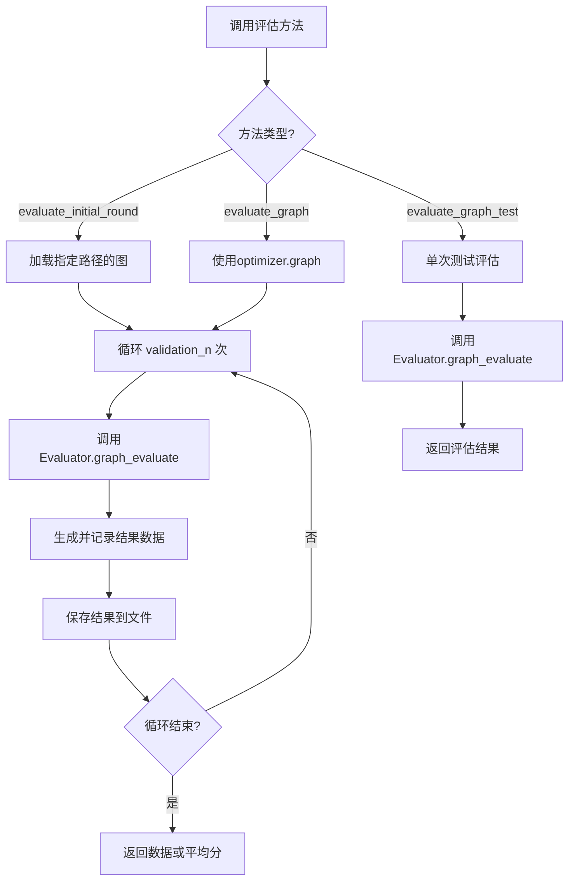
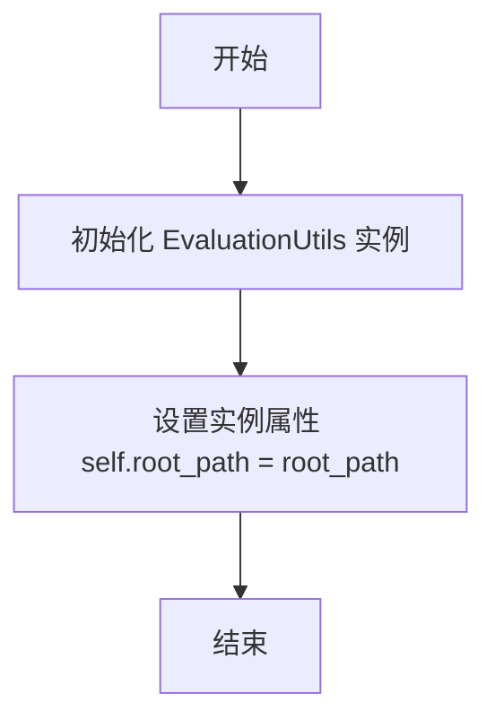
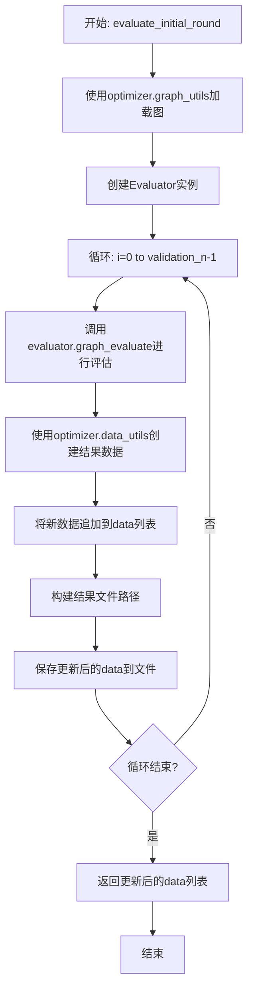
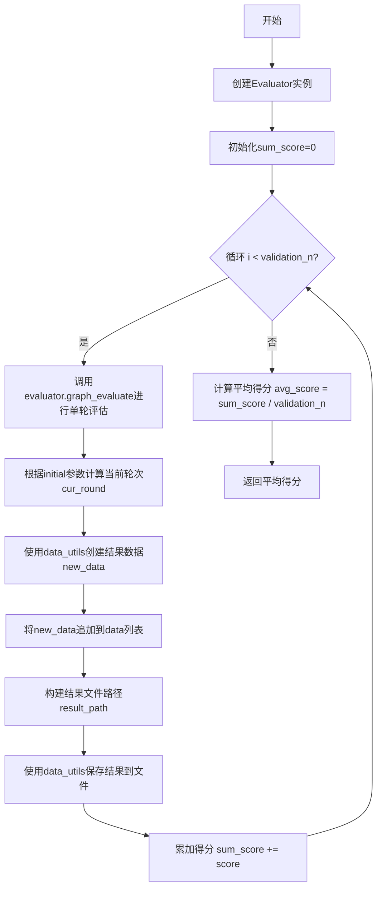
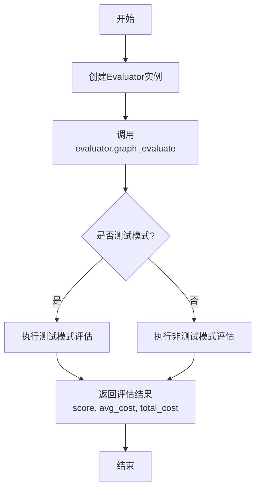

# `.\MetaGPT\metagpt\ext\aflow\scripts\optimizer_utils\evaluation_utils.py` 详细设计文档

该文件定义了一个名为 `EvaluationUtils` 的工具类，其核心功能是封装和管理对工作流图（graph）的评估过程。它提供了异步方法来执行多轮验证评估、计算平均得分、记录评估结果数据，并支持在测试模式下进行单次评估。该类作为评估流程的协调者，依赖于外部的 `Evaluator`、`optimizer` 及其组件（如 `graph_utils`, `data_utils`）来完成具体的图加载、评估执行和结果持久化任务。

## 整体流程



## 类结构

```
EvaluationUtils
├── __init__
├── evaluate_initial_round
├── evaluate_graph
└── evaluate_graph_test
```

## 全局变量及字段


### `EvaluationUtils.root_path`
    
存储评估相关文件（如工作流图、结果数据）的根目录路径。

类型：`str`
    
    

## 全局函数及方法

### `EvaluationUtils.__init__`

初始化 `EvaluationUtils` 类的实例，设置评估工具运行所需的根路径。

参数：
- `root_path`：`str`，评估工具运行所需的根目录路径。

返回值：`None`，此方法为构造函数，不返回任何值。

#### 流程图



#### 带注释源码

```python
def __init__(self, root_path: str):
    # 初始化 EvaluationUtils 实例
    # 参数 root_path: 评估工具运行所需的根目录路径
    self.root_path = root_path  # 将传入的根路径保存为实例属性
```

### `EvaluationUtils.evaluate_initial_round`

该方法用于执行初始轮次的图评估。它首先加载指定的工作流图，然后使用`Evaluator`对图进行多次评估（次数由`validation_n`指定）。每次评估后，它会将评估结果（得分、平均成本、总成本）封装成数据对象，追加到传入的`data`列表中，并立即将更新后的完整结果列表保存到文件中。最终返回更新后的结果数据列表。

参数：

- `optimizer`：`object`，优化器对象，提供数据集、图工具、数据工具、配置等必要组件。
- `graph_path`：`str`，工作流图定义文件的路径。
- `directory`：`str`，评估过程中用于存储临时文件或日志的目录路径。
- `validation_n`：`int`，需要执行的评估次数。
- `data`：`list`，用于累积存储所有评估结果数据的列表。

返回值：`list`，更新后的评估结果数据列表，包含了本次初始轮次所有评估运行的结果。

#### 流程图



#### 带注释源码

```python
async def evaluate_initial_round(self, optimizer, graph_path, directory, validation_n, data):
    # 使用 optimizer 的 graph_utils 来加载图
    # 将加载的图对象赋值给optimizer.graph，供后续评估使用
    optimizer.graph = optimizer.graph_utils.load_graph(optimizer.round, graph_path)
    # 实例化评估器，指定评估输出路径
    evaluator = Evaluator(eval_path=directory)

    # 循环执行指定次数（validation_n）的评估
    for i in range(validation_n):
        # 调用评估器的核心方法进行单次图评估
        # 传入数据集、图、配置字典和输出目录，并指定为非测试模式
        score, avg_cost, total_cost = await evaluator.graph_evaluate(
            optimizer.dataset,
            optimizer.graph,
            {"dataset": optimizer.dataset, "llm_config": optimizer.execute_llm_config},
            directory,
            is_test=False,
        )

        # 使用optimizer的数据工具，将本轮评估结果封装成标准数据结构
        new_data = optimizer.data_utils.create_result_data(optimizer.round, score, avg_cost, total_cost)
        # 将新生成的结果数据追加到总结果列表中
        data.append(new_data)

        # 根据图路径获取对应的结果文件保存路径
        result_path = optimizer.data_utils.get_results_file_path(graph_path)
        # 将当前包含所有轮次结果的数据列表保存到文件
        optimizer.data_utils.save_results(result_path, data)

    # 返回更新后的结果数据列表
    return data
```

### `EvaluationUtils.evaluate_graph`

该方法用于对给定的图（graph）进行多轮评估，计算平均得分。它创建一个评估器（Evaluator），在指定的验证轮数（validation_n）内，使用优化器（optimizer）提供的数据集和图配置进行图评估，收集每轮的得分和成本数据，并保存结果。最后返回所有轮次的平均得分。

参数：

- `optimizer`：`object`，优化器对象，提供数据集、图、配置和工具方法
- `directory`：`str`，评估结果保存的目录路径
- `validation_n`：`int`，验证轮数，即评估执行的次数
- `data`：`list`，用于存储每轮评估结果数据的列表
- `initial`：`bool`，默认为`False`，指示是否为初始轮评估，影响当前轮次（round）的计算

返回值：`float`，所有验证轮次的平均得分（sum_score / validation_n）

#### 流程图



#### 带注释源码

```python
async def evaluate_graph(self, optimizer, directory, validation_n, data, initial=False):
    # 1. 创建评估器实例，指定评估结果保存路径
    evaluator = Evaluator(eval_path=directory)
    # 2. 初始化总得分，用于后续计算平均值
    sum_score = 0

    # 3. 循环执行指定轮数（validation_n）的评估
    for i in range(validation_n):
        # 3.1 调用评估器的核心方法进行单轮图评估
        #     传入数据集、图对象、配置字典（包含数据集和LLM配置）、目录和测试标志
        score, avg_cost, total_cost = await evaluator.graph_evaluate(
            optimizer.dataset,
            optimizer.graph,
            {"dataset": optimizer.dataset, "llm_config": optimizer.execute_llm_config},
            directory,
            is_test=False,
        )

        # 3.2 根据initial参数决定当前评估所属的轮次（round）
        #     若非初始轮，则使用optimizer.round + 1；否则使用optimizer.round
        cur_round = optimizer.round + 1 if initial is False else optimizer.round

        # 3.3 使用优化器的数据工具创建本轮评估的结果数据对象
        new_data = optimizer.data_utils.create_result_data(cur_round, score, avg_cost, total_cost)
        # 3.4 将本轮结果数据追加到总数据列表中
        data.append(new_data)

        # 3.5 构建结果文件的保存路径（基于优化器的根路径下的workflows目录）
        result_path = optimizer.data_utils.get_results_file_path(f"{optimizer.root_path}/workflows")
        # 3.6 使用数据工具将当前所有轮次的数据保存到结果文件
        optimizer.data_utils.save_results(result_path, data)

        # 3.7 累加本轮得分到总得分
        sum_score += score

    # 4. 计算并返回所有轮次的平均得分
    return sum_score / validation_n
```

### `EvaluationUtils.evaluate_graph_test`

该方法用于对给定的优化器（optimizer）中的图（graph）进行单次评估测试，并返回评估结果（分数、平均成本、总成本）。它主要用于测试场景，可以灵活指定是否为测试模式。

参数：

- `optimizer`：`object`，包含数据集、图、LLM配置等评估所需组件的优化器对象。
- `directory`：`str`，评估过程中用于存储中间文件或结果的目录路径。
- `is_test`：`bool`，默认为`True`，指示此次评估是否为测试模式。测试模式可能影响评估器的内部行为（例如是否输出详细日志或进行额外验证）。

返回值：`tuple`，返回一个三元组 `(score, avg_cost, total_cost)`，分别代表评估得分、平均成本和总成本。

#### 流程图



#### 带注释源码

```python
async def evaluate_graph_test(self, optimizer, directory, is_test=True):
    # 1. 实例化评估器，传入评估目录路径
    evaluator = Evaluator(eval_path=directory)
    
    # 2. 调用评估器的graph_evaluate方法进行图评估
    #    参数说明：
    #    - optimizer.dataset: 评估所用的数据集
    #    - optimizer.graph: 待评估的图结构
    #    - 第三个参数是一个配置字典，包含数据集和LLM配置
    #    - directory: 评估输出目录
    #    - is_test: 是否为测试模式标志
    #    该方法返回一个三元组 (score, avg_cost, total_cost)
    return await evaluator.graph_evaluate(
        optimizer.dataset,
        optimizer.graph,
        {"dataset": optimizer.dataset, "llm_config": optimizer.execute_llm_config},
        directory,
        is_test=is_test,
    )
```

## 关键组件


### Evaluator

用于评估图（graph）性能的核心组件，通过调用其 `graph_evaluate` 方法，可以基于给定的数据集、图配置和LLM配置对图进行评分和成本计算。

### Graph Utils

负责图的加载功能，在初始评估轮次中，通过 `load_graph` 方法从指定路径加载图结构到优化器中。

### Data Utils

负责评估结果数据的创建、文件路径获取和持久化存储，提供了 `create_result_data`、`get_results_file_path` 和 `save_results` 等方法，用于管理评估过程中产生的数据。

### Optimizer

作为评估过程的协调者和上下文提供者，持有数据集（`dataset`）、图（`graph`）、LLM配置（`execute_llm_config`）、当前轮次（`round`）和根路径（`root_path`）等关键信息，并作为参数传递给各个评估工具方法。


## 问题及建议


### 已知问题

-   **代码重复度高**：`evaluate_initial_round` 和 `evaluate_graph` 方法的核心评估循环逻辑高度相似，存在大量重复代码，违反了 DRY（Don‘t Repeat Yourself）原则，增加了维护成本和出错风险。
-   **职责不清晰**：`EvaluationUtils` 类承担了过多的职责，包括加载图、创建评估器、执行多轮评估、数据组装、结果保存等。这违反了单一职责原则，使得类变得臃肿且难以测试。
-   **硬编码路径**：`evaluate_graph` 方法中，结果文件路径被硬编码为 `f"{optimizer.root_path}/workflows"`，缺乏灵活性，且与 `evaluate_initial_round` 方法中从参数 `graph_path` 推导路径的逻辑不一致。
-   **参数传递复杂**：方法参数列表较长（如 `optimizer, directory, validation_n, data, initial=False`），且 `optimizer` 对象被深度使用（访问其内部的 `graph_utils`, `data_utils`, `dataset` 等），导致方法间耦合度高，依赖关系不明确。
-   **异常处理缺失**：代码中没有对文件加载、数据保存、评估过程等可能发生的异常（如 `FileNotFoundError`, `IOError`, 评估器内部错误）进行捕获和处理，程序健壮性不足。
-   **同步/异步混合风险**：类方法均为 `async`，但内部调用的 `optimizer` 对象方法（如 `graph_utils.load_graph`, `data_utils.save_results`）的同步/异步性质不明确，可能存在潜在的阻塞或并发问题。

### 优化建议

-   **提取公共逻辑**：将 `evaluate_initial_round` 和 `evaluate_graph` 中共同的评估循环、数据记录和结果保存逻辑抽取为一个独立的私有方法（如 `_run_evaluation_loop`），以减少代码重复。
-   **重构以遵循单一职责原则**：
    -   考虑将图加载逻辑移至调用方或 `optimizer` 中。
    -   将数据创建和保存逻辑封装到专门的 `DataManager` 或 `ResultService` 类中。
    -   `EvaluationUtils` 应专注于“评估”这一核心任务，即协调 `Evaluator` 执行评估并返回结果。
-   **参数化与依赖注入**：
    -   将硬编码的路径（如 `workflows`）作为可配置参数。
    -   考虑通过构造函数或方法参数显式注入 `Evaluator`、`DataUtils` 等依赖，而不是通过 `optimizer` 对象间接访问，以降低耦合度，提高可测试性。
-   **增强异常处理**：在关键操作（如文件 I/O、评估调用）周围添加 `try-except` 块，记录或抛出适当的异常，确保程序在部分失败时能提供清晰的错误信息并保持稳定。
-   **明确异步契约**：审查并确保所有被调用的 `optimizer` 内部方法（尤其是 `data_utils` 和 `graph_utils` 的方法）与 `EvaluationUtils` 的异步上下文兼容。如有必要，将其改为异步方法或使用线程池执行。
-   **增加类型注解与文档**：为方法参数、返回值和关键变量添加更详细的类型注解。为每个公共方法编写清晰的文档字符串，说明其用途、参数、返回值及可能抛出的异常。


## 其它


### 设计目标与约束

本模块 `EvaluationUtils` 是 `aflow` 项目中的一个评估工具类，其核心设计目标是为图优化流程提供可复用的评估功能。主要约束包括：1) 必须与外部 `Evaluator` 类协同工作，遵循其接口契约；2) 评估过程需要支持多次验证 (`validation_n`) 以获取稳定结果；3) 评估结果需要被序列化并持久化存储；4) 需要区分初始轮次评估和常规轮次评估，以处理不同的数据记录逻辑。

### 错误处理与异常设计

当前代码中未显式包含错误处理逻辑。潜在的异常点包括：1) `optimizer.graph_utils.load_graph` 可能因文件不存在或格式错误而失败；2) `evaluator.graph_evaluate` 可能在评估过程中因外部服务（如LLM）不可用或内部逻辑错误而抛出异常；3) `optimizer.data_utils.save_results` 可能因文件权限或磁盘空间问题导致写入失败。建议在关键操作周围添加 `try-except` 块，捕获特定异常（如 `FileNotFoundError`, `RuntimeError`），并记录错误日志或向上层抛出封装后的业务异常，以确保流程的健壮性和可调试性。

### 数据流与状态机

数据流主要围绕 `optimizer` 对象、`data` 列表和文件系统展开。输入是 `optimizer`（包含图、数据集、配置等状态）、图文件路径、评估目录和验证次数。核心处理是调用 `Evaluator` 进行图评估，获取分数和成本。输出是更新后的 `data` 列表（追加了新的评估结果）和持久化到文件系统的结果文件。状态变化体现在：1) `optimizer.graph` 在 `evaluate_initial_round` 中被加载的新图覆盖；2) `data` 列表在每次评估迭代后追加新记录；3) 结果文件内容被更新。模块本身不维护复杂的状态机，其行为由调用方传入的参数（如 `initial` 标志）控制。

### 外部依赖与接口契约

1.  **`metagpt.ext.aflow.scripts.evaluator.Evaluator`**: 核心外部依赖，提供 `graph_evaluate` 方法。契约要求传入数据集、图对象、配置字典、目录路径和测试标志，并返回分数、平均成本和总成本。
2.  **`optimizer` 对象**: 作为上下文提供者，必须包含以下属性或方法，构成隐式接口契约：
    *   `graph_utils`: 需提供 `load_graph(round, path)` 方法。
    *   `dataset`: 评估所用的数据集对象。
    *   `execute_llm_config`: LLM执行的配置信息。
    *   `data_utils`: 需提供 `create_result_data`, `get_results_file_path`, `save_results` 方法。
    *   `round`: 当前优化轮次（整数）。
    *   `graph`: 当前待评估的图对象（在 `evaluate_initial_round` 中会被写入）。
    *   `root_path`: 项目根路径。
3.  **文件系统**: 依赖特定的目录结构来读取图文件和写入评估结果文件。

### 性能考量

1.  **I/O 操作**: `evaluate_initial_round` 和 `evaluate_graph` 方法在每次评估迭代后都调用 `save_results` 进行文件写入。在 `validation_n` 较大时，这可能导致频繁的磁盘I/O，成为性能瓶颈。建议改为在循环结束后一次性保存所有结果，或在内存中累积数据后由调用方决定保存时机。
2.  **评估开销**: `evaluator.graph_evaluate` 方法可能涉及LLM调用或复杂计算，其执行时间是主要性能成本。`validation_n` 参数直接决定了总评估时间，需要在评估准确性和耗时之间取得平衡。
3.  **内存使用**: `data` 列表会随着评估轮次增加而不断增长。虽然单次评估结果数据量不大，但在极长期的自动化优化任务中，需注意内存监控，或实现数据分页/归档机制。

### 可测试性设计

当前类的可测试性较高，因其主要逻辑是协调调用外部依赖。可以通过以下方式提升：
1.  **依赖注入**: 将 `Evaluator` 的实例化过程参数化（例如通过 `__init__` 传入或提供工厂方法），以便在单元测试中轻松替换为 Mock 对象。
2.  **接口隔离**: 明确 `optimizer` 参数所需的最小接口，并定义为一个协议（Protocol）或抽象基类（ABC），这有助于在开发和测试时明确依赖关系。
3.  **分离关注点**: `evaluate_initial_round` 方法同时负责加载图和进行评估，可以拆分为两个独立的方法，使每个方法的职责更单一，更容易测试。
4.  现有的 `evaluate_graph_test` 方法专门用于最终测试，是一个良好的设计，隔离了测试评估逻辑。

### 配置与参数化

模块的行为由以下参数控制：
1.  `validation_n` (int): 控制评估的重复次数，直接影响结果的稳定性和运行时间。
2.  `directory` (str): 评估过程中的工作目录，影响临时文件生成和结果查找路径。
3.  `initial` (bool): 在 `evaluate_graph` 中用于区分是否处于初始轮次，从而决定记录结果时使用的 `round` 编号。
4.  `is_test` (bool): 在 `evaluate_graph_test` 中传递给 `Evaluator`，可能用于切换评估的严格模式或数据集。
建议未来可以考虑将这些参数的一部分（如默认的 `validation_n`）提升为类级别或模块级别的配置常量，以增强可维护性。

### 安全与合规性

当前代码未涉及明显的安全与合规性问题。潜在考虑点包括：
1.  **路径安全**: 方法接收 `directory`, `graph_path` 等路径参数，应确保对这些路径的访问是授权的，防止路径遍历攻击（如使用 `../../`）。虽然在本项目上下文中可能可控，但作为通用工具，建议对输入路径进行规范化检查。
2.  **数据隐私**: 如果 `optimizer.dataset` 包含敏感信息，在调用 `evaluator.graph_evaluate` 以及后续的序列化（`save_results`）过程中，需确保评估框架和存储结果符合相关的数据隐私规定。
3.  **依赖安全**: 需要确保所依赖的 `Evaluator` 及其底层实现（如LLM调用）符合安全实践，例如使用安全的网络连接、管理好API密钥等。

    