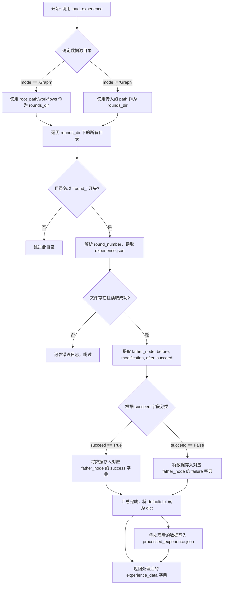
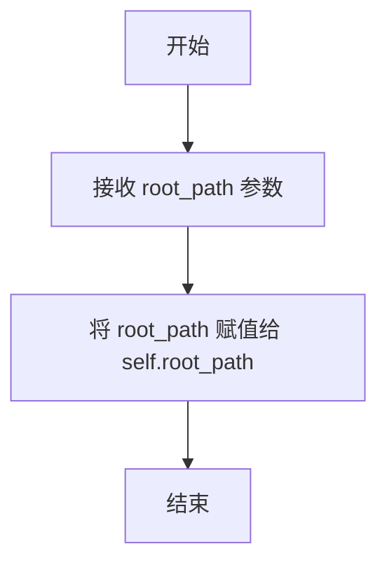
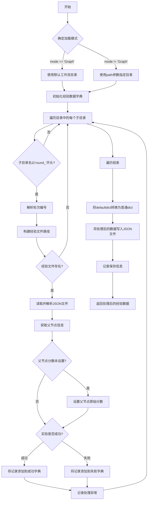
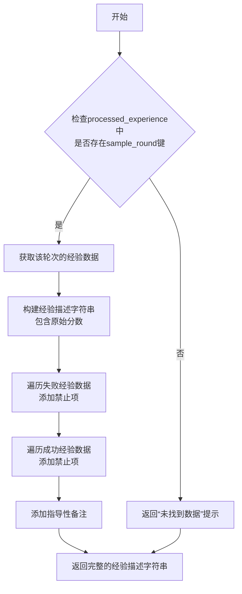
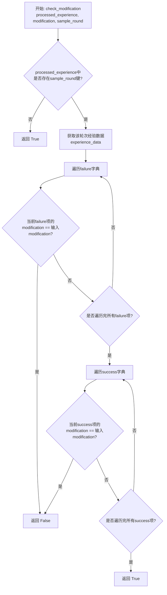
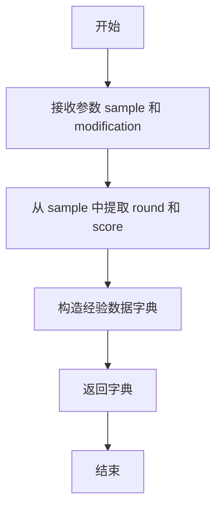
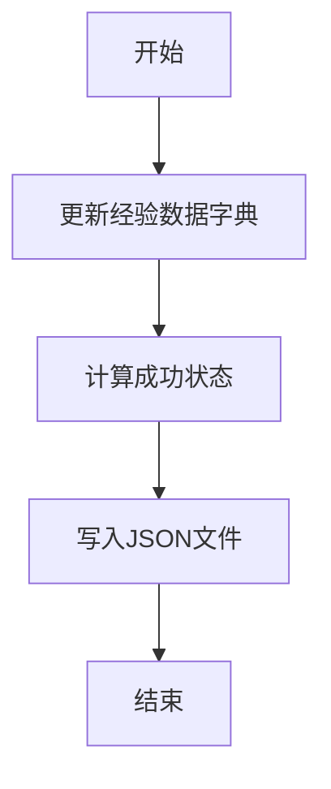

# `.\MetaGPT\metagpt\ext\aflow\scripts\optimizer_utils\experience_utils.py` 详细设计文档

该代码定义了一个名为 ExperienceUtils 的工具类，用于管理和处理经验数据。其核心功能是：从指定目录结构（如包含多轮次实验的 `workflows` 文件夹）中加载、解析和汇总实验经验数据（存储在 `experience.json` 文件中），生成结构化的经验总结，并支持基于历史经验验证新的修改建议是否与历史成功或失败记录重复。

## 整体流程



## 类结构

```
ExperienceUtils
├── __init__
├── load_experience
├── format_experience
├── check_modification
├── create_experience_data
└── update_experience
```

## 全局变量及字段


### `ExperienceUtils.root_path`
    
存储经验数据根目录的路径，用于定位和加载经验文件。

类型：`str`
    
    

## 全局函数及方法

### `ExperienceUtils.__init__`

初始化 `ExperienceUtils` 类的实例，设置经验数据处理的根目录路径。

参数：

- `root_path`：`str`，经验数据存储的根目录路径。

返回值：`None`，无返回值。

#### 流程图



#### 带注释源码

```python
def __init__(self, root_path: str):
    # 初始化 ExperienceUtils 类的实例
    # 参数 root_path: 经验数据存储的根目录路径
    self.root_path = root_path  # 将传入的根目录路径保存为实例变量
```

### `ExperienceUtils.load_experience`

该方法用于从指定目录（默认为工作流目录）加载多轮实验的经验数据，按“父节点”进行聚合，并将处理后的数据保存为JSON文件。

参数：

- `path`：`str`，可选，指定经验数据所在的目录路径。如果未提供且`mode`为"Graph"，则使用默认的工作流目录。
- `mode`：`str`，默认为"Graph"，指定加载模式。当为"Graph"时，使用`self.root_path`下的"workflows"目录；否则使用`path`参数指定的目录。

返回值：`dict`，返回一个字典，其中键为父节点（father node），值为包含该节点原始分数、成功和失败经验记录的字典。

#### 流程图



#### 带注释源码

```python
def load_experience(self, path=None, mode: str = "Graph"):
    # 根据模式确定经验数据所在的根目录
    if mode == "Graph":
        rounds_dir = os.path.join(self.root_path, "workflows")
    else:
        rounds_dir = path

    # 初始化一个默认字典，用于存储聚合后的经验数据。
    # 每个键（父节点）对应的值是一个包含“score”、“success”和“failure”的字典。
    experience_data = defaultdict(lambda: {"score": None, "success": {}, "failure": {}})

    # 遍历指定目录下的所有条目
    for round_dir in os.listdir(rounds_dir):
        # 检查条目是否为目录且名称以“round_”开头
        if os.path.isdir(os.path.join(rounds_dir, round_dir)) and round_dir.startswith("round_"):
            round_path = os.path.join(rounds_dir, round_dir)
            try:
                # 从目录名中提取轮次编号（例如，“round_1” -> 1）
                round_number = int(round_dir.split("_")[1])
                # 构建经验JSON文件的完整路径
                json_file_path = os.path.join(round_path, "experience.json")
                # 检查经验文件是否存在
                if os.path.exists(json_file_path):
                    # 读取并解析JSON文件
                    data = read_json_file(json_file_path, encoding="utf-8")
                    # 获取该轮实验的“父节点”标识
                    father_node = data["father node"]

                    # 如果该父节点的原始分数尚未设置，则使用当前文件的“before”分数进行初始化
                    if experience_data[father_node]["score"] is None:
                        experience_data[father_node]["score"] = data["before"]

                    # 根据实验的成功或失败状态，将修改记录和分数添加到相应的字典中
                    if data["succeed"]:
                        experience_data[father_node]["success"][round_number] = {
                            "modification": data["modification"],
                            "score": data["after"],
                        }
                    else:
                        experience_data[father_node]["failure"][round_number] = {
                            "modification": data["modification"],
                            "score": data["after"],
                        }
            except Exception as e:
                # 处理单个轮次目录时发生异常，记录错误日志并继续处理其他目录
                logger.info(f"Error processing {round_dir}: {str(e)}")

    # 将defaultdict转换为普通的字典，以便后续序列化或返回
    experience_data = dict(experience_data)

    # 定义处理后的经验数据的输出文件路径
    output_path = os.path.join(rounds_dir, "processed_experience.json")
    # 将处理后的数据写入JSON文件
    with open(output_path, "w", encoding="utf-8") as outfile:
        json.dump(experience_data, outfile, indent=4, ensure_ascii=False)

    # 记录文件保存成功的日志信息
    logger.info(f"Processed experience data saved to {output_path}")
    # 返回处理后的经验数据字典
    return experience_data
```

### `ExperienceUtils.format_experience`

该方法用于将处理后的经验数据（`processed_experience`）中指定轮次（`sample_round`）的经验信息格式化为一段结构化的文本描述。它会提取该轮次的原始分数、成功和失败的经验教训，并生成一个总结性的提示文本，用于指导后续的决策或学习过程。

参数：

- `processed_experience`：`dict`，包含所有轮次处理后的经验数据字典，键为轮次标识，值为该轮次的详细经验信息。
- `sample_round`：`str`，指定要格式化的经验数据对应的轮次标识。

返回值：`str`，返回一个格式化的字符串，包含指定轮次的原始分数、成功和失败的经验教训总结，以及一个指导性的备注。如果未找到指定轮次的数据，则返回相应的提示信息。

#### 流程图



#### 带注释源码

```python
def format_experience(self, processed_experience, sample_round):
    # 从处理后的经验数据字典中，获取指定轮次（sample_round）的经验数据
    experience_data = processed_experience.get(sample_round)
    # 检查是否成功获取到指定轮次的数据
    if experience_data:
        # 初始化经验描述字符串，首先包含原始分数
        experience = f"Original Score: {experience_data['score']}\n"
        experience += "These are some conclusions drawn from experience:\n\n"
        # 遍历该轮次的所有失败经验记录
        for key, value in experience_data["failure"].items():
            # 为每条失败经验添加一条“绝对禁止”的建议，并附上修改内容和对应的分数
            experience += f"-Absolutely prohibit {value['modification']} (Score: {value['score']})\n"
        # 遍历该轮次的所有成功经验记录
        for key, value in experience_data["success"].items():
            # 为每条成功经验添加一条“绝对禁止”的建议（注意：成功经验的描述中不包含分数）
            experience += f"-Absolutely prohibit {value['modification']} \n"
        # 在描述末尾添加一个重要的指导性备注，强调需要根本性改变思维方式
        experience += "\n\nNote: Take into account past failures and avoid repeating the same mistakes, as these failures indicate that these approaches are ineffective. You must fundamentally change your way of thinking, rather than simply using more advanced Python syntax like for, if, else, etc., or modifying the prompt."
    else:
        # 如果未找到指定轮次的数据，则返回一个提示信息
        experience = f"No experience data found for round {sample_round}."
    # 返回最终格式化好的经验描述字符串
    return experience
```

### `ExperienceUtils.check_modification`

该方法用于检查给定的修改项（`modification`）是否已存在于指定轮次（`sample_round`）的经验数据中。它通过遍历该轮次经验数据中的“失败”和“成功”记录，判断给定的修改项是否已被尝试过。如果修改项已存在，则返回`False`表示不应重复尝试；如果不存在或该轮次无经验数据，则返回`True`表示可以尝试。

参数：
- `processed_experience`：`dict`，已处理的经验数据字典，通常由`load_experience`方法生成。
- `modification`：`str`，待检查的修改项描述字符串。
- `sample_round`：`str`，指定的经验轮次标识符，用于从`processed_experience`中查找对应轮次的数据。

返回值：`bool`，如果修改项在指定轮次的经验数据中不存在（或该轮次无数据），则返回`True`，表示可以尝试此修改；否则返回`False`，表示此修改已被尝试过，应避免重复。

#### 流程图



#### 带注释源码

```python
def check_modification(self, processed_experience, modification, sample_round):
    # 从已处理的经验数据字典中，获取指定轮次（sample_round）的数据
    experience_data = processed_experience.get(sample_round)
    # 如果该轮次存在经验数据
    if experience_data:
        # 遍历该轮次“失败”经验记录
        for key, value in experience_data["failure"].items():
            # 如果某条失败记录的修改项与待检查的修改项相同
            if value["modification"] == modification:
                # 返回False，表示此修改已被尝试并失败，不应重复
                return False
        # 遍历该轮次“成功”经验记录
        for key, value in experience_data["success"].items():
            # 如果某条成功记录的修改项与待检查的修改项相同
            if value["modification"] == modification:
                # 返回False，表示此修改已被尝试并成功，无需重复
                return False
        # 如果遍历完所有记录都未找到相同的修改项，则返回True，表示可以尝试
        return True
    else:
        # 如果该轮次没有经验数据，也返回True，表示可以尝试（因为没有历史记录限制）
        return True
```

### `ExperienceUtils.create_experience_data`

该方法用于根据给定的样本（`sample`）和修改内容（`modification`）创建一个新的经验数据字典。该字典包含了经验记录的初始状态，包括父节点（即样本所属的轮次）、修改内容、修改前的分数，以及待填充的修改后分数和成功状态。

参数：

- `sample`：`dict`，包含经验样本信息的字典，其中必须包含 `"round"` 和 `"score"` 键。
- `modification`：`str`，描述对代码或流程所做的具体修改内容。

返回值：`dict`，返回一个包含经验数据初始状态的字典，结构为 `{"father node": ..., "modification": ..., "before": ..., "after": None, "succeed": None}`。

#### 流程图



#### 带注释源码

```python
def create_experience_data(self, sample, modification):
    # 根据传入的样本和修改内容，构造一个经验数据字典。
    # 该字典记录了经验的初始状态，包括父节点（轮次）、修改内容、修改前的分数。
    # 修改后的分数（after）和成功状态（succeed）初始化为 None，将在后续步骤中更新。
    return {
        "father node": sample["round"],  # 父节点，标识此经验属于哪一轮实验
        "modification": modification,    # 具体的修改内容描述
        "before": sample["score"],       # 修改前的分数，取自样本
        "after": None,                   # 修改后的分数，初始为 None，待后续填充
        "succeed": None,                 # 修改是否成功，初始为 None，待后续判断
    }
```

### `ExperienceUtils.update_experience`

该方法用于更新经验数据，将执行后的平均分数和成功状态写入到经验文件中，并保存到指定目录。

参数：

- `directory`：`str`，经验数据文件所在的目录路径。
- `experience`：`dict`，待更新的经验数据字典，包含执行前的分数、修改内容等信息。
- `avg_score`：`float`，执行后的平均分数，用于计算成功状态。

返回值：`None`，该方法不返回任何值，仅执行文件写入操作。

#### 流程图



#### 带注释源码

```python
def update_experience(self, directory, experience, avg_score):
    # 将执行后的平均分数更新到经验数据字典中
    experience["after"] = avg_score
    # 根据平均分数是否大于执行前的分数，计算成功状态
    experience["succeed"] = bool(avg_score > experience["before"])

    # 将更新后的经验数据字典写入到指定目录的 experience.json 文件中
    write_json_file(os.path.join(directory, "experience.json"), experience, encoding="utf-8", indent=4)
```

## 关键组件


### 经验数据加载与处理组件

负责从指定目录结构（如 `workflows/round_*`）中加载多轮实验的原始经验数据（`experience.json`），并按“父节点”（father node）进行聚合、分类（成功/失败）和结构化处理，最终生成并保存一个统一的、易于查询的 `processed_experience.json` 文件。

### 经验数据格式化组件

负责将处理后的结构化经验数据，根据指定的轮次（sample_round），格式化为一段可读的、指导性的文本提示。该文本总结了原始分数、失败的修改（绝对禁止项）以及成功的修改，旨在为后续决策提供明确的经验指导。

### 修改建议校验组件

负责在给定轮次（sample_round）的经验数据中，校验一个特定的修改建议（modification）是否已经存在于历史成功或失败记录中。用于在生成新建议前进行去重和冲突检查，避免重复尝试已知无效或有效的修改。

### 经验数据创建与更新组件

负责创建单轮实验的初始经验数据模板（包含父节点、修改建议、修改前分数等），以及在实验结束后，根据平均得分（avg_score）更新该轮经验数据的结果（修改后分数、是否成功），并将其持久化到对应的 `experience.json` 文件中。


## 问题及建议


### 已知问题

-   **硬编码的文件路径和模式逻辑**：`load_experience` 方法中，`mode` 参数为 `"Graph"` 时，会硬编码拼接 `"workflows"` 子目录路径。这降低了代码的灵活性和可配置性，如果目录结构发生变化，需要修改源代码。
-   **异常处理过于宽泛**：`load_experience` 方法中使用 `except Exception as e` 捕获所有异常，虽然记录了日志，但可能导致程序在遇到严重错误时仍继续运行，产生不完整或错误的数据。
-   **数据验证缺失**：在读取 `experience.json` 文件后，直接访问 `data["father node"]` 等键值，未对 `data` 的格式和必需字段进行验证。如果文件内容损坏或格式不符，将导致运行时错误。
-   **逻辑错误**：`format_experience` 方法中，对于 `success` 条目，输出的提示信息是 `“-Absolutely prohibit {value['modification']} \n”`，这与 `success`（成功）的语义相矛盾，可能是一个逻辑或文案错误。
-   **潜在的性能问题**：`load_experience` 方法会遍历指定目录下的所有子目录。如果历史轮次（`round_*` 目录）非常多，且每个目录都包含 `experience.json` 文件，可能会造成 I/O 瓶颈和内存消耗（尽管使用了 `defaultdict`）。
-   **方法职责不单一**：`load_experience` 方法同时负责加载数据、处理数据、序列化数据到文件并返回结果。这违反了单一职责原则，使得方法难以测试和维护。

### 优化建议

-   **解耦配置与逻辑**：将 `"workflows"` 这类路径配置提取为类常量或通过 `__init__` 参数传入，提高代码的可配置性。
-   **细化异常处理**：将 `except Exception` 替换为更具体的异常类型（如 `KeyError`, `json.JSONDecodeError`, `FileNotFoundError` 等），并根据异常类型决定是跳过错误文件还是终止处理。
-   **增加数据验证**：在解析 `experience.json` 文件内容后，使用 `dict.get()` 方法安全访问键值，或使用 `Pydantic` 等库定义数据模型并进行验证，确保数据的完整性和正确性。
-   **修正逻辑错误**：审查 `format_experience` 方法的业务逻辑，确保成功和失败经验的描述是准确且符合预期的。例如，成功经验可能应该是推荐或允许的修改。
-   **考虑性能优化**：对于大规模数据，可以考虑使用异步 I/O 或分批处理来加载和解析文件。如果 `processed_experience.json` 文件已存在且源数据未变更，可以引入缓存机制避免重复处理。
-   **重构方法以遵循单一职责**：将 `load_experience` 方法拆分为更小的函数，例如：`_discover_round_dirs`, `_load_single_experience_file`, `_aggregate_experience_data`, `_save_processed_data`。这样每个函数只做一件事，提高可测试性和代码清晰度。
-   **增强类型提示**：为所有方法参数和返回值添加更精确的类型提示（例如使用 `TypedDict` 定义 `experience_data` 的结构），这有助于静态类型检查工具（如 `mypy`）发现潜在问题，并提高代码的可读性。


## 其它


### 设计目标与约束

本模块旨在为智能体（Agent）提供一个经验管理框架，用于记录、加载、处理和格式化在任务执行过程中（特别是多轮迭代工作流中）产生的成功与失败经验。其核心设计目标包括：
1.  **经验持久化**：将每轮迭代的经验（如修改建议、前后得分、成功与否）以结构化的JSON格式保存到文件系统中，确保经验可追溯和复用。
2.  **经验聚合**：能够从多轮迭代的目录结构中，按“父节点”（father node）聚合成功与失败的经验，生成一个统一的、便于查询的数据结构。
3.  **经验查询与校验**：提供接口，允许根据特定轮次查询格式化后的经验文本，或校验新的修改建议是否与历史经验（特别是失败经验）冲突。
4.  **低侵入性**：作为工具类存在，与主业务逻辑解耦，通过文件I/O进行数据交换，约束是依赖特定的目录结构（如包含`round_xx`子目录和`experience.json`文件）。

### 错误处理与异常设计

模块采用了防御性编程和宽容处理的原则：
1.  **文件与目录读取容错**：在`load_experience`方法中，使用`try-except`块包裹对每个`round_`目录的处理逻辑。当单个回合目录处理出错（如JSON文件格式错误、目录名不符合预期）时，会记录错误日志（`logger.info`）并跳过该目录，避免因单个错误导致整个经验加载过程失败。
2.  **资源存在性检查**：在读取`experience.json`文件前，使用`os.path.exists`进行检查，避免因文件不存在而引发异常。
3.  **默认返回值设计**：在`format_experience`和`check_modification`方法中，当查询的指定轮次经验不存在时，分别返回提示文本和`True`。`check_modification`在经验数据为空时返回`True`，这是一种“默认允许”的策略，确保在无历史经验约束时流程可继续。
4.  **异常范围**：捕获的异常类型为通用的`Exception`，这虽然能捕获所有错误，但不利于精确诊断。建议在后续优化中细化异常类型（如`json.JSONDecodeError`, `ValueError`, `OSError`）。

### 数据流与状态机

1.  **数据流**：
    *   **输入**：文件系统中的目录（`root_path`下的`workflows`目录或指定路径），内含多个`round_xx`子目录，每个子目录包含一个`experience.json`文件。
    *   **处理**：`load_experience`方法遍历目录，读取并解析JSON文件，按`father node`为键聚合数据，形成`processed_experience`字典。该字典随后被序列化保存为`processed_experience.json`文件，并作为返回值。
    *   **输出**：
        *   持久化的`processed_experience.json`文件。
        *   内存中的`processed_experience`字典，供`format_experience`和`check_modification`方法使用。
        *   `format_experience`方法输出格式化的经验字符串。
        *   `check_modification`方法输出布尔值，指示修改建议是否被允许。
        *   `update_experience`方法更新单个`experience.json`文件。

2.  **状态机（经验生命周期）**：
    *   **创建**：`create_experience_data`方法根据初始样本创建一条待验证的经验记录（状态为`before`有值，`after`和`succeed`为`None`）。
    *   **更新/完成**：`update_experience`方法根据本轮迭代的平均得分（`avg_score`）更新该经验记录，计算`after`并判定`succeed`（状态变为完成）。
    *   **聚合**：`load_experience`方法收集所有已完成状态的经验记录，按父节点分类聚合。
    *   **应用**：通过`format_experience`和`check_modification`方法，将聚合后的经验应用于新的决策或提示生成过程。

### 外部依赖与接口契约

1.  **外部依赖**：
    *   **Python标准库**：`json`, `os`, `collections.defaultdict`。
    *   **项目内部模块**：
        *   `metagpt.logs.logger`: 用于记录信息日志和错误日志。
        *   `metagpt.utils.common.read_json_file`: 用于读取JSON文件，应处理文件不存在或格式错误等异常，返回Python字典。
        *   `metagpt.utils.common.write_json_file`: 用于将Python字典写入JSON文件。

2.  **接口契约（对调用者）**：
    *   `__init__(root_path: str)`: 要求传入经验数据存储的根路径。
    *   `load_experience(path=None, mode="Graph") -> dict`: 返回聚合后的经验字典。`mode`参数控制是从固定子目录（`workflows`）还是指定`path`加载。
    *   `format_experience(processed_experience, sample_round) -> str`: 要求传入`load_experience`返回的字典和指定的轮次编号，返回格式化字符串。
    *   `check_modification(processed_experience, modification, sample_round) -> bool`: 要求传入经验字典、待检查的修改字符串和轮次编号，返回是否允许该修改。
    *   `create_experience_data(sample, modification) -> dict`: 要求传入包含`round`和`score`的样本字典以及修改字符串，返回一个初始化的经验字典。
    *   `update_experience(directory, experience, avg_score) -> None`: 要求传入经验文件所在目录、待更新的经验字典和本轮平均得分，方法会更新字典并写回文件。

3.  **文件系统契约**：
    *   期望的目录结构为：`{root_path}/workflows/round_{number}/experience.json`（当`mode="Graph"`时）。
    *   `experience.json`文件需包含键：`father node`, `modification`, `before`, `after`, `succeed`。
    *   生成的`processed_experience.json`文件将保存在`load_experience`方法处理的目录下。

    