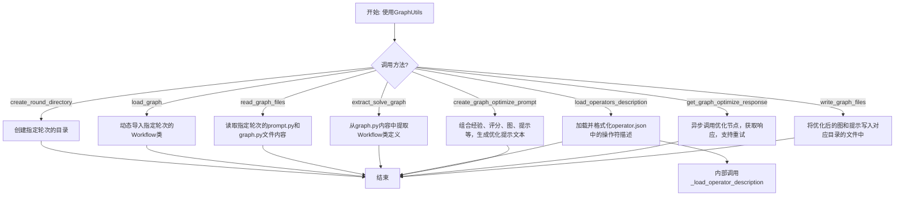
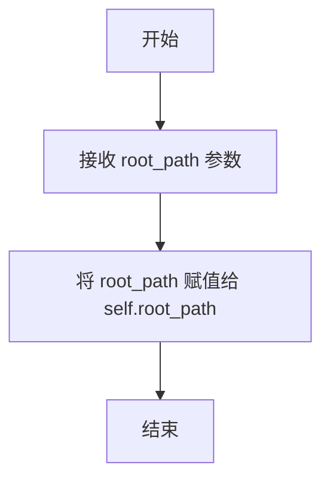
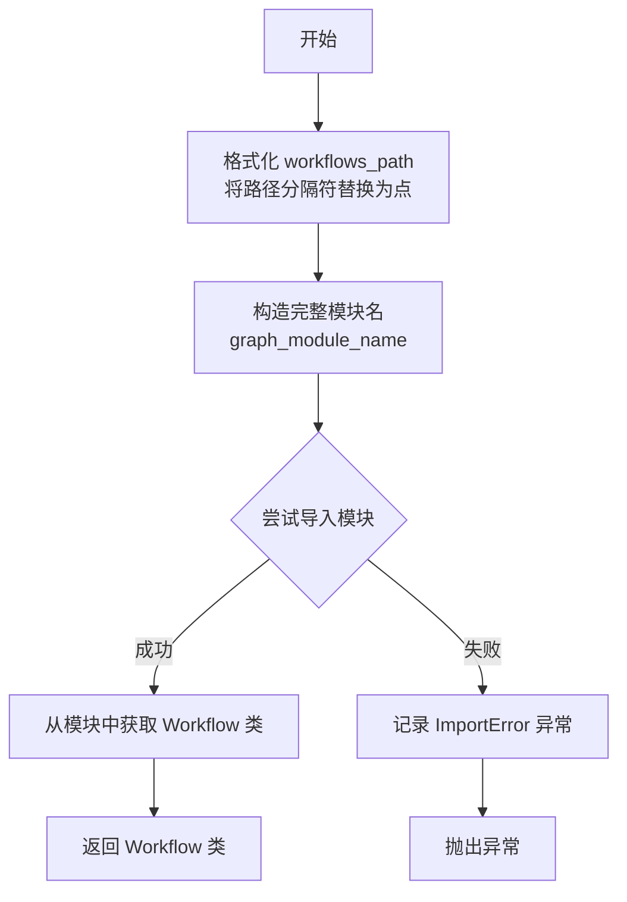
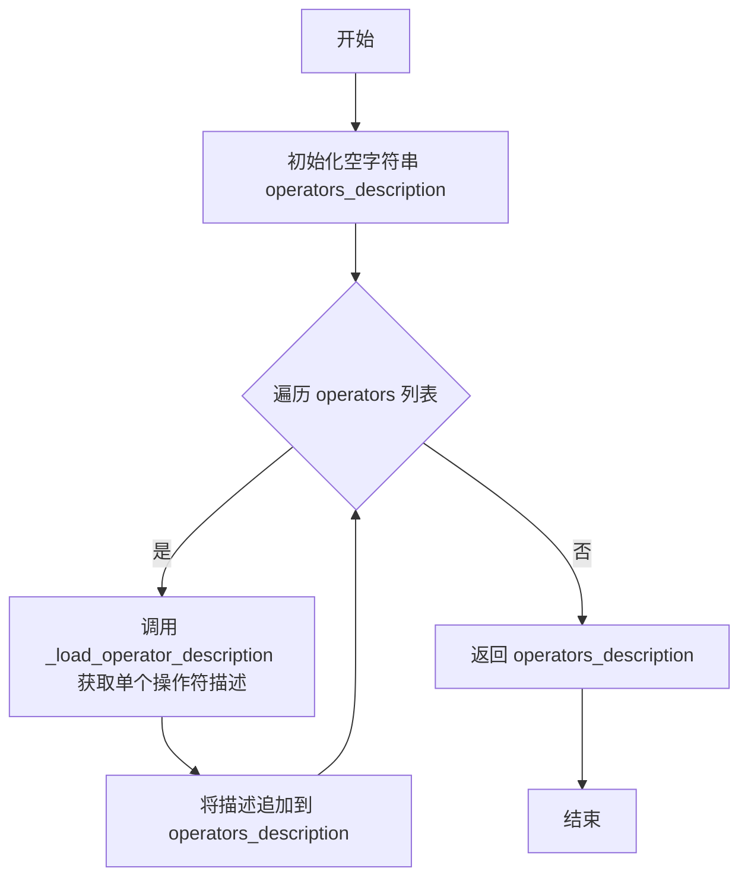
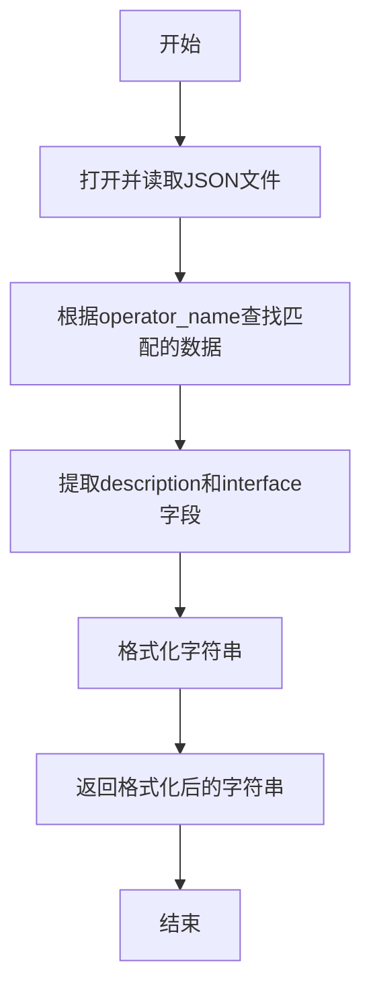
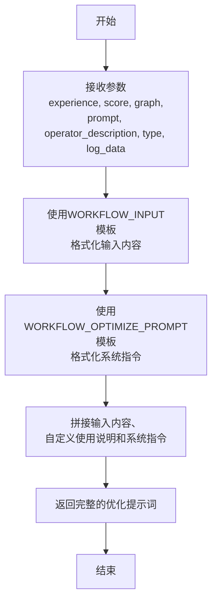
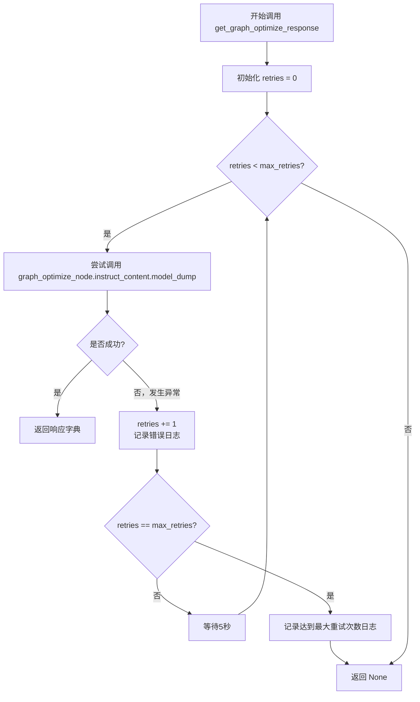
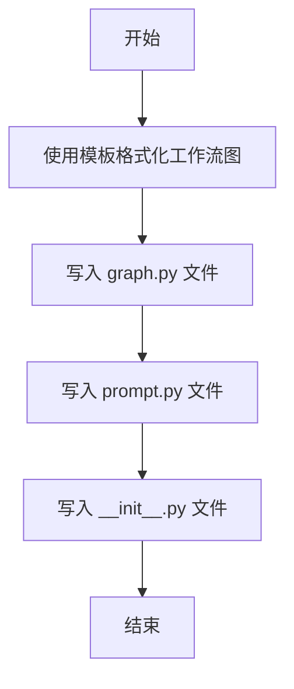

# `.\MetaGPT\metagpt\ext\aflow\scripts\optimizer_utils\graph_utils.py` 详细设计文档

该代码定义了一个名为 GraphUtils 的工具类，主要用于管理和优化工作流图（Workflow）。其核心功能包括：根据轮次（round）创建和管理对应的目录结构、动态加载指定轮次的工作流图模块、读取和解析工作流图及其提示（prompt）文件、从工作流图代码中提取关键类定义、加载并格式化操作符（operator）的描述信息、根据给定的经验、评分、图、提示等信息构造用于优化工作流图的提示文本、通过异步调用获取工作流图的优化响应（支持重试机制）、以及将优化后的工作流图和提示写入到对应的文件中。该类服务于一个多轮次的工作流图优化流程，是连接图定义、优化逻辑和文件持久化的核心工具。

## 整体流程



## 类结构

```
GraphUtils
├── __init__
├── create_round_directory
├── load_graph
├── read_graph_files
├── extract_solve_graph
├── load_operators_description
├── _load_operator_description
├── create_graph_optimize_prompt
├── get_graph_optimize_response
└── write_graph_files
```

## 全局变量及字段


### `WORKFLOW_CUSTOM_USE`
    
工作流优化提示模板的一部分，用于定义自定义使用方式或约束条件。

类型：`str`
    


### `WORKFLOW_INPUT`
    
工作流优化提示模板的一部分，用于格式化输入数据，包含经验、分数、图结构等信息。

类型：`str`
    


### `WORKFLOW_OPTIMIZE_PROMPT`
    
工作流优化的系统提示模板，用于指导优化过程。

类型：`str`
    


### `WORKFLOW_TEMPLATE`
    
工作流图（graph.py）的代码模板，用于生成新的工作流文件。

类型：`str`
    


### `logger`
    
用于记录代码执行过程中的日志信息，便于调试和监控。

类型：`logging.Logger`
    


### `GraphUtils.root_path`
    
GraphUtils类的根路径，用于定位工作流模板和操作符描述文件等资源。

类型：`str`
    
    

## 全局函数及方法

### `GraphUtils.__init__`

初始化 `GraphUtils` 类的实例，设置其根路径属性。

参数：

- `root_path`：`str`，表示工作流文件所在的根目录路径。

返回值：`None`，此方法为构造函数，不返回任何值。

#### 流程图



#### 带注释源码

```python
def __init__(self, root_path: str):
    # 初始化 GraphUtils 类的实例
    # 参数 root_path: 工作流文件所在的根目录路径
    self.root_path = root_path  # 将传入的根路径保存为实例变量
```

### `GraphUtils.create_round_directory`

该方法用于在指定的图（工作流）路径下，根据给定的轮次号创建一个对应的轮次目录。如果目录已存在，则不会引发错误。

参数：

- `graph_path`：`str`，表示工作流图文件存储的基础路径。
- `round_number`：`int`，表示当前优化或执行的轮次编号。

返回值：`str`，返回新创建（或已存在）的轮次目录的完整路径。

#### 流程图

```mermaid
flowchart TD
    A[开始] --> B[拼接目录路径<br>directory = os.path.join(graph_path, f"round_{round_number}")]
    B --> C[创建目录<br>os.makedirs(directory, exist_ok=True)]
    C --> D[返回目录路径]
    D --> E[结束]
```

#### 带注释源码

```python
def create_round_directory(self, graph_path: str, round_number: int) -> str:
    # 根据基础路径和轮次号，拼接出完整的轮次目录路径。
    # 例如：graph_path = "/workflows", round_number = 1 -> "/workflows/round_1"
    directory = os.path.join(graph_path, f"round_{round_number}")
    # 创建目录。`exist_ok=True` 参数确保如果目录已存在，不会抛出FileExistsError异常。
    os.makedirs(directory, exist_ok=True)
    # 返回创建好的目录路径，供后续文件读写操作使用。
    return directory
```

### `GraphUtils.load_graph`

该方法用于动态加载指定轮次（round）的工作流（Workflow）类。它通过构造模块路径，使用Python的`__import__`和`getattr`函数来导入并返回目标类。如果导入失败，会记录错误信息并抛出异常。

参数：

- `round_number`：`int`，表示要加载的工作流所属的轮次编号。
- `workflows_path`：`str`，表示工作流模块的基础路径（例如，`"workflows"`）。

返回值：`type`，返回加载到的`Workflow`类（一个Python类对象）。

#### 流程图



#### 带注释源码

```python
def load_graph(self, round_number: int, workflows_path: str):
    # 将文件系统路径分隔符（\ 或 /）替换为 Python 模块路径分隔符（.）
    workflows_path = workflows_path.replace("\\", ".").replace("/", ".")
    # 构造目标模块的完整名称，格式为：{workflows_path}.round_{round_number}.graph
    graph_module_name = f"{workflows_path}.round_{round_number}.graph"

    try:
        # 动态导入指定的模块，fromlist=[""] 确保返回的是模块对象而非顶层包
        graph_module = __import__(graph_module_name, fromlist=[""])
        # 从导入的模块中获取名为 "Workflow" 的类
        graph_class = getattr(graph_module, "Workflow")
        # 返回获取到的类
        return graph_class
    except ImportError as e:
        # 如果导入失败（例如模块不存在），记录错误日志
        logger.info(f"Error loading graph for round {round_number}: {e}")
        # 重新抛出异常，通知调用者加载失败
        raise
```

### `GraphUtils.read_graph_files`

该方法用于读取指定轮次（round）的图优化工作流文件，包括提示（prompt）文件和图定义（graph）文件。它通过构造文件路径，尝试以UTF-8编码打开并读取这两个文件的内容。如果文件不存在或读取过程中发生任何其他异常，它会记录错误日志并重新抛出异常。

参数：

- `round_number`：`int`，表示当前优化轮次的编号，用于定位对应的文件目录。
- `workflows_path`：`str`，表示工作流文件存储的根目录路径。

返回值：`tuple[str, str]`，返回一个包含两个字符串的元组，第一个字符串是`prompt.py`文件的内容，第二个字符串是`graph.py`文件的内容。

#### 流程图

```mermaid
graph TD
    A[开始] --> B[构造prompt.py文件路径]
    B --> C[构造graph.py文件路径]
    C --> D{尝试读取文件}
    D -->|成功| E[读取prompt.py内容]
    E --> F[读取graph.py内容]
    F --> G[返回元组 (prompt_content, graph_content)]
    D -->|失败| H[捕获FileNotFoundError]
    H --> I[记录文件未找到错误日志]
    I --> J[重新抛出异常]
    D -->|失败| K[捕获其他Exception]
    K --> L[记录通用错误日志]
    L --> J
```

#### 带注释源码

```python
def read_graph_files(self, round_number: int, workflows_path: str):
    # 构造指定轮次下的 prompt.py 文件路径
    prompt_file_path = os.path.join(workflows_path, f"round_{round_number}", "prompt.py")
    # 构造指定轮次下的 graph.py 文件路径
    graph_file_path = os.path.join(workflows_path, f"round_{round_number}", "graph.py")

    try:
        # 以 UTF-8 编码打开并读取 prompt.py 文件内容
        with open(prompt_file_path, "r", encoding="utf-8") as file:
            prompt_content = file.read()
        # 以 UTF-8 编码打开并读取 graph.py 文件内容
        with open(graph_file_path, "r", encoding="utf-8") as file:
            graph_content = file.read()
    except FileNotFoundError as e:
        # 如果文件不存在，记录错误日志并重新抛出异常
        logger.info(f"Error: File not found for round {round_number}: {e}")
        raise
    except Exception as e:
        # 捕获其他所有读取异常，记录错误日志并重新抛出异常
        logger.info(f"Error loading prompt for round {round_number}: {e}")
        raise
    # 返回读取到的两个文件内容组成的元组
    return prompt_content, graph_content
```

### `GraphUtils.extract_solve_graph`

该方法用于从给定的图定义字符串中，使用正则表达式提取所有匹配的 `Workflow` 类定义。

参数：

- `graph_load`：`str`，包含图定义（通常是 `graph.py` 文件内容）的字符串。

返回值：`List[str]`，一个字符串列表，其中每个字符串都是一个匹配到的完整 `class Workflow:` 类定义。

#### 流程图

```mermaid
flowchart TD
    A[开始: extract_solve_graph(graph_load)] --> B[定义正则表达式模式<br/>pattern = r"class Workflow:.+"]
    B --> C[使用re.findall查找所有匹配项]
    C --> D{是否找到匹配项?}
    D -- 是 --> E[返回匹配到的字符串列表]
    D -- 否 --> F[返回空列表]
    E --> G[结束]
    F --> G
```

#### 带注释源码

```python
def extract_solve_graph(self, graph_load: str) -> List[str]:
    # 定义正则表达式模式，用于匹配以 "class Workflow:" 开头的整个类定义。
    # re.DOTALL 标志使 '.' 匹配包括换行符在内的所有字符，确保能捕获多行的类定义。
    pattern = r"class Workflow:.+"
    # 使用 re.findall 在输入的 graph_load 字符串中查找所有匹配该模式的子串。
    # 返回一个包含所有匹配结果的列表。
    return re.findall(pattern, graph_load, re.DOTALL)
```

### `GraphUtils.load_operators_description`

该方法用于加载并格式化一组操作符的描述信息。它遍历给定的操作符列表，为每个操作符从指定的JSON配置文件中读取其描述和接口信息，并将这些信息格式化为一个可读的字符串。

参数：

- `operators`：`List[str]`，一个包含操作符名称的列表。

返回值：`str`，一个格式化后的字符串，其中每一行对应一个操作符的描述，格式为“序号. 操作符名称: 描述, with interface 接口信息).”。

#### 流程图



#### 带注释源码

```python
def load_operators_description(self, operators: List[str]) -> str:
    # 构造操作符描述文件的路径，该文件位于根目录下的 workflows/template/ 文件夹中
    path = f"{self.root_path}/workflows/template/operator.json"
    # 初始化一个空字符串，用于累积所有操作符的描述
    operators_description = ""
    # 遍历传入的操作符列表，enumerate 用于同时获取索引（从0开始）和操作符名称
    for id, operator in enumerate(operators):
        # 调用内部方法 _load_operator_description 来获取单个操作符的格式化描述
        # id + 1 是为了让序号从1开始
        operator_description = self._load_operator_description(id + 1, operator, path)
        # 将获取到的单个操作符描述追加到总字符串中，并添加换行符
        operators_description += f"{operator_description}\n"
    # 返回所有操作符描述的拼接字符串
    return operators_description
```

### `GraphUtils._load_operator_description`

该方法用于从指定的JSON文件中加载特定操作符的描述信息，并根据给定的ID、操作符名称和文件路径，格式化返回一个包含操作符描述和接口信息的字符串。

参数：

- `id`：`int`，操作符的唯一标识符，用于在输出字符串中作为序号。
- `operator_name`：`str`，要查找的操作符名称，作为JSON数据中的键。
- `file_path`：`str`，包含操作符描述的JSON文件的路径。

返回值：`str`，返回一个格式化字符串，格式为“{id}. {operator_name}: {description}, with interface {interface}).”，其中`description`和`interface`是从JSON文件中提取的对应操作符的描述和接口信息。

#### 流程图



#### 带注释源码

```python
def _load_operator_description(self, id: int, operator_name: str, file_path: str) -> str:
    # 打开指定路径的JSON文件并加载数据
    with open(file_path, "r") as f:
        operator_data = json.load(f)
        # 根据操作符名称从JSON数据中获取匹配的数据
        matched_data = operator_data[operator_name]
        # 提取描述信息
        desc = matched_data["description"]
        # 提取接口信息
        interface = matched_data["interface"]
        # 格式化并返回字符串，包含ID、操作符名称、描述和接口
        return f"{id}. {operator_name}: {desc}, with interface {interface})."
```

### `GraphUtils.create_graph_optimize_prompt`

该方法用于生成一个用于优化工作流（Workflow）的提示词（Prompt）。它通过整合经验、评分、当前工作流图、提示词、操作符描述、优化类型和日志数据，构建一个结构化的输入字符串，该字符串随后可用于指导大语言模型（LLM）进行工作流的优化分析或生成。

参数：

- `experience`：`str`，描述先前优化尝试的经验或上下文信息。
- `score`：`float`，对当前工作流或提示词的评估分数。
- `graph`：`str`，当前工作流图（graph.py）的源代码内容。
- `prompt`：`str`，当前提示词（prompt.py）的源代码内容。
- `operator_description`：`str`，工作流中可用操作符（Operator）的描述信息。
- `type`：`str`，优化的类型或目标（例如，优化图结构或优化提示词）。
- `log_data`：`str`，与当前工作流执行相关的日志数据。

返回值：`str`，一个格式化后的、完整的提示词字符串，用于输入给LLM进行工作流优化。

#### 流程图



#### 带注释源码

```python
def create_graph_optimize_prompt(
    self,
    experience: str,          # 历史经验或上下文
    score: float,             # 当前工作流的评估分数
    graph: str,               # 当前工作流图(graph.py)的代码
    prompt: str,              # 当前提示词(prompt.py)的代码
    operator_description: str, # 可用操作符的描述
    type: str,                # 优化类型（如图优化或提示优化）
    log_data: str,            # 相关执行日志
) -> str:
    # 1. 使用 WORKFLOW_INPUT 模板将用户提供的所有参数格式化为一个结构化的输入段落。
    graph_input = WORKFLOW_INPUT.format(
        experience=experience,
        score=score,
        graph=graph,
        prompt=prompt,
        operator_description=operator_description,
        type=type,
        log=log_data,
    )
    # 2. 根据优化类型，使用 WORKFLOW_OPTIMIZE_PROMPT 模板生成系统指令。
    graph_system = WORKFLOW_OPTIMIZE_PROMPT.format(type=type)
    # 3. 将格式化后的输入、固定的自定义使用说明（WORKFLOW_CUSTOM_USE）和系统指令拼接起来，形成最终的提示词。
    return graph_input + WORKFLOW_CUSTOM_USE + graph_system
```

### `GraphUtils.get_graph_optimize_response`

该方法是一个异步方法，用于从 `graph_optimize_node` 对象中获取优化后的图结构响应。它实现了带指数退避的重试机制，以处理可能出现的临时性错误（如网络问题或服务不稳定）。在达到最大重试次数后，若仍失败则返回 `None`。

参数：

- `graph_optimize_node`：`object`，一个包含 `instruct_content` 属性的节点对象，该属性应具有 `model_dump` 方法以返回序列化的响应数据。

返回值：`dict | None`，成功时返回 `graph_optimize_node.instruct_content.model_dump()` 的结果（一个字典），失败时返回 `None`。

#### 流程图



#### 带注释源码

```python
async def get_graph_optimize_response(self, graph_optimize_node):
    # 最大重试次数，用于处理临时性故障
    max_retries = 5
    # 当前已尝试次数
    retries = 0

    # 重试循环
    while retries < max_retries:
        try:
            # 尝试从节点对象中提取并序列化指令内容
            response = graph_optimize_node.instruct_content.model_dump()
            # 成功则直接返回响应
            return response
        except Exception as e:
            # 发生异常，增加重试计数
            retries += 1
            # 记录错误日志，包含当前重试次数
            logger.info(f"Error generating prediction: {e}. Retrying... ({retries}/{max_retries})")
            # 检查是否已达到最大重试次数
            if retries == max_retries:
                # 达到最大重试次数，记录最终失败日志并退出循环
                logger.info("Maximum retries reached. Skipping this sample.")
                break
            # 打印详细的异常堆栈信息，便于调试
            traceback.print_exc()
            # 等待一段时间（指数退避的简化版，此处为固定5秒），避免频繁重试
            time.sleep(5)
    # 循环结束（因达到最大重试次数或异常退出），返回None表示失败
    return None
```

### `GraphUtils.write_graph_files`

该方法用于将优化后的工作流图和提示信息写入到指定目录的文件中，包括 `graph.py`、`prompt.py` 和 `__init__.py`。

参数：

- `directory`：`str`，目标目录的路径，用于存放生成的文件。
- `response`：`dict`，包含优化后工作流图（`graph`）和提示信息（`prompt`）的字典。
- `round_number`：`int`，当前优化轮次编号，用于格式化工作流图模板。
- `dataset`：`str`，数据集名称，用于格式化工作流图模板。

返回值：`None`，该方法不返回任何值，其作用是将数据写入文件。

#### 流程图



#### 带注释源码

```python
def write_graph_files(self, directory: str, response: dict, round_number: int, dataset: str):
    # 使用 WORKFLOW_TEMPLATE 模板，将响应中的图、轮次和数据集信息格式化为最终的图代码
    graph = WORKFLOW_TEMPLATE.format(graph=response["graph"], round=round_number, dataset=dataset)

    # 将格式化后的图代码写入到指定目录下的 graph.py 文件中
    with open(os.path.join(directory, "graph.py"), "w", encoding="utf-8") as file:
        file.write(graph)

    # 将响应中的提示信息写入到指定目录下的 prompt.py 文件中
    with open(os.path.join(directory, "prompt.py"), "w", encoding="utf-8") as file:
        file.write(response["prompt"])

    # 在指定目录下创建一个空的 __init__.py 文件，使其成为一个 Python 包
    with open(os.path.join(directory, "__init__.py"), "w", encoding="utf-8") as file:
        file.write("")
```

## 关键组件


### 图结构管理与加载

负责工作流图（Workflow）的目录创建、动态加载和文件读取，支持多轮次（round）的图版本管理。

### 操作符描述加载

从JSON配置文件中加载预定义操作符的描述和接口信息，用于构建工作流图的优化提示。

### 工作流图优化提示构建

根据经验、评分、现有图结构、提示词、操作符描述等信息，构建用于优化工作流图的LLM提示字符串。

### 图优化响应获取与重试

异步调用图优化节点（LLM）并获取响应，内置指数退避重试机制以提高在临时性故障下的鲁棒性。

### 优化结果持久化

将LLM优化后生成的新工作流图代码和提示词写入到指定轮次的目录文件中，完成一轮优化迭代。


## 问题及建议


### 已知问题

-   **硬编码路径与配置**：代码中多处使用了硬编码的路径字符串（如 `f"{self.root_path}/workflows/template/operator.json"`）和从外部模块导入的常量（如 `WORKFLOW_TEMPLATE`）。这使得代码的可配置性和可移植性较差，难以适应不同的部署环境或项目结构。
-   **异常处理粒度较粗**：在 `read_graph_files` 和 `load_graph` 等方法中，异常被捕获后仅记录日志并重新抛出。虽然记录了错误，但缺乏更细致的错误分类（如区分文件不存在、权限错误、格式错误等），不利于调用方进行针对性的错误恢复或向用户提供更清晰的反馈。
-   **潜在的循环导入风险**：`load_graph` 方法使用 `__import__` 动态导入模块。如果 `graph.py` 文件本身导入了当前模块或存在其他循环依赖，可能导致运行时错误或难以调试的导入问题。
-   **同步阻塞式重试逻辑**：`get_graph_optimize_response` 方法使用同步的 `time.sleep(5)` 进行重试等待。在异步上下文中（方法标记为 `async`），这会阻塞整个事件循环，影响系统并发性能。
-   **字符串操作可能引发错误**：`extract_solve_graph` 方法使用正则表达式 `r"class Workflow:.+"` 来提取类定义，假设 `graph_load` 字符串中只包含一个 `Workflow` 类。如果文件中有多个类或该模式出现在注释、字符串字面量中，可能导致提取错误或不完整。
-   **文件写入缺乏原子性**：`write_graph_files` 方法依次写入多个文件。如果在写入过程中发生错误（如磁盘空间不足），可能导致部分文件被更新而另一些没有，留下不一致的状态。

### 优化建议

-   **引入配置管理**：将硬编码的路径、模板字符串等抽取到配置文件（如 YAML、JSON）或环境变量中。可以创建一个配置类来集中管理这些设置，提高代码的灵活性和可维护性。
-   **细化异常类型**：定义更具体的自定义异常类（如 `GraphFileNotFoundError`, `GraphImportError`, `InvalidGraphFormatError`），并在相应的地方抛出。在顶层调用处可以捕获这些特定异常，执行不同的处理逻辑或提供更准确的错误信息。
-   **使用 importlib 替代 `__import__`**：考虑使用 Python 标准库的 `importlib` 模块来动态导入，它提供了更清晰、更强大的 API 来处理导入，并能更好地控制导入过程。
-   **将重试逻辑异步化**：在 `get_graph_optimize_response` 方法中，使用 `asyncio.sleep` 替代 `time.sleep` 以避免阻塞事件循环。或者，考虑使用专为异步环境设计的重试库（如 `tenacity`），它们提供了更丰富、更健壮的重试机制。
-   **改进代码提取方法**：对于 `extract_solve_graph`，可以考虑使用 Python 的 `ast`（抽象语法树）模块来解析 Python 源代码，从而更准确、更安全地定位和提取类定义，避免正则表达式的局限性。
-   **实现原子性文件写入**：对于 `write_graph_files`，可以先将内容写入临时文件，待所有文件都成功写入后，再通过原子性的重命名操作（`os.rename`）替换目标文件。这可以确保要么所有文件都更新成功，要么都保持原状。同时，考虑在写入前检查目标目录是否存在并有写权限。
-   **增加输入验证与类型提示**：在方法（如 `create_graph_optimize_prompt`）的入口处，增加对输入参数的验证（如非空检查、类型检查）。虽然已有类型提示，但运行时验证可以更早地捕获错误。对于字典类型的 `response` 参数，可以验证其是否包含必需的键（如 `"graph"`, `"prompt"`）。
-   **考虑性能优化**：`load_operators_description` 方法在每次调用时都会打开并读取同一个 JSON 文件。如果 `operators` 列表较长或该方法被频繁调用，可以考虑缓存 `operator.json` 文件的内容，避免重复的 I/O 操作。


## 其它


### 设计目标与约束

本模块的核心设计目标是提供一个可扩展、可维护的图（工作流）优化工具集。它旨在支持多轮次（round）的迭代优化过程，通过动态加载、分析、提示生成和结果持久化来驱动工作流的演进。主要约束包括：1) 对文件系统结构的强依赖（如按轮次组织的目录、特定的文件命名约定），这要求外部调用者必须遵循约定的项目结构。2) 与外部AI服务（通过`graph_optimize_node`接口）的异步交互，引入了网络延迟和失败重试的逻辑。3) 对特定提示模板（`WORKFLOW_TEMPLATE`, `WORKFLOW_INPUT`等）和操作符元数据文件（`operator.json`）的依赖，这些外部资源的内容和格式直接影响模块功能。

### 错误处理与异常设计

模块采用了分层的错误处理策略。对于可预见的错误（如文件未找到、模块导入失败），在`load_graph`和`read_graph_files`等方法中捕获特定的异常（`ImportError`, `FileNotFoundError`），记录日志后重新抛出，将错误处理责任传递给调用者。对于与外部AI服务交互等不可靠操作，在`get_graph_optimize_response`方法中实现了带指数退避（通过固定间隔休眠模拟）的重试机制（最多5次），在达到最大重试次数后优雅降级，返回`None`。所有方法都使用`logger.info`记录关键操作和错误信息，便于追踪和调试。异常传播设计允许上层调用者根据业务逻辑决定是终止流程、跳过当前轮次还是采取其他恢复措施。

### 数据流与状态机

模块的数据流围绕“轮次（round）”概念组织，形成一个清晰的线性状态转移过程。1) **初始化与路径准备**：`GraphUtils`实例化时确定根路径。2) **加载阶段**：给定轮次号，通过`load_graph`动态导入图类，或通过`read_graph_files`读取图与提示的源码内容。`extract_solve_graph`可对图源码进行正则提取。`load_operators_description`从JSON文件加载操作符描述。3) **提示构建与优化阶段**：`create_graph_optimize_prompt`整合经验、分数、图、提示、操作符描述等，生成发送给AI模型的优化提示。4) **交互与重试阶段**：`get_graph_optimize_response`异步调用AI服务，在失败时循环重试，直至成功或达到上限。5) **持久化阶段**：`write_graph_files`将AI返回的优化结果（图结构和提示）按照模板格式化后，写入新创建的轮次目录中。整个过程的状态由轮次号、文件系统状态和AI响应结果驱动。

### 外部依赖与接口契约

1.  **文件系统接口**：依赖特定的目录结构（`{workflows_path}/round_{n}/`）和文件（`graph.py`, `prompt.py`, `operator.json`）。契约要求这些路径可访问，文件格式符合预期（如`graph.py`包含`Workflow`类，`operator.json`为特定结构的JSON）。
2.  **Python模块导入系统**：`load_graph`方法使用`__import__`动态导入模块，契约要求目标模块位于Python路径下，且可通过点分路径访问。
3.  **AI服务接口**：`get_graph_optimize_response`方法接收一个`graph_optimize_node`参数，该参数需提供一个`instruct_content`属性，该属性是一个具有`model_dump()`方法的对象（推测为Pydantic模型）。契约要求调用该方法返回一个包含`graph`和`prompt`键的字典。模块不关心该节点的具体实现（如HTTP客户端）。
4.  **模板与提示词**：重度依赖从`metagpt.ext.aflow.scripts.prompts.optimize_prompt`导入的四个字符串常量（`WORKFLOW_TEMPLATE`, `WORKFLOW_INPUT`, `WORKFLOW_OPTIMIZE_PROMPT`, `WORKFLOW_CUSTOM_USE`）。这些常量定义了与AI交互的提示模板和输出格式，是模块逻辑的核心组成部分，任何变更都需要同步调整。
5.  **日志接口**：依赖`metagpt.logs.logger`进行日志记录，假定其已配置并可用。

### 安全与合规考量

1.  **路径遍历风险**：`load_graph`方法通过字符串替换构造导入路径，`read_graph_files`和`write_graph_files`使用`os.path.join`。虽然一定程度上缓解了路径遍历，但若`workflows_path`或`round_number`来自不可信输入，仍需调用者进行验证，防止访问或创建预期外的目录文件。
2.  **动态代码执行**：`load_graph`动态导入并获取类，这本质上执行了代码。确保`graph.py`来源可信至关重要，否则可能导致任意代码执行。
3.  **数据泄露**：`write_graph_files`写入的文件内容（优化后的工作流和提示）可能包含敏感信息。模块本身不处理加密或访问控制，需由部署环境保障目录权限和文件安全。
4.  **外部服务依赖**：与AI服务的交互可能传输包含业务逻辑或数据的工作流信息。需确保通信通道（如TLS加密）和AI服务提供商符合数据隐私和合规要求（如GDPR）。

    