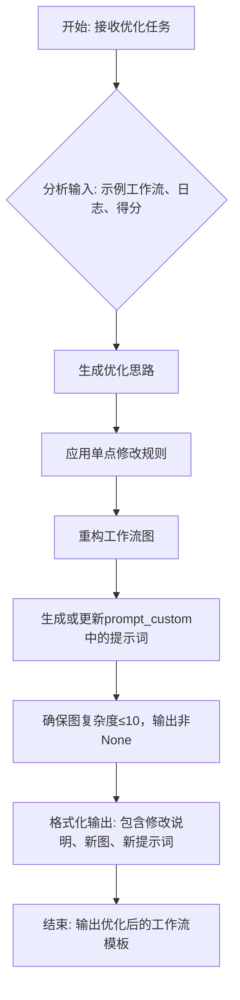

# `.\MetaGPT\metagpt\ext\aflow\scripts\prompts\optimize_prompt.py` 详细设计文档

该文件定义了一个用于优化和生成工作流（Graph）及其对应提示词（Prompt）的模板系统。它包含用于指导工作流优化的提示词模板、输入格式模板、自定义方法使用示例以及最终的工作流代码生成模板。核心功能是提供一个框架，让用户基于给定的示例工作流和性能日志，通过修改节点、参数和提示词来优化解决特定类型问题的工作流。

## 整体流程



## 类结构

```
无显式类定义 (本文件主要为字符串模板和常量定义)
├── 全局常量 (WORKFLOW_OPTIMIZE_PROMPT, WORKFLOW_INPUT, WORKFLOW_CUSTOM_USE, WORKFLOW_TEMPLATE)
└── 隐含的类/模块依赖 (operator, prompt_custom, create_llm_instance, CostManager)
```

## 全局变量及字段


### `WORKFLOW_OPTIMIZE_PROMPT`
    
用于指导优化工作流图和提示的详细指令模板，定义了优化目标、约束和输出格式要求。

类型：`str`
    


### `WORKFLOW_INPUT`
    
提供给优化系统的输入模板，包含历史经验、性能日志和优化约束，用于生成具体的优化方案。

类型：`str`
    


### `WORKFLOW_CUSTOM_USE`
    
展示如何在图工作流中使用自定义方法的示例和最佳实践说明，包括输入拼接和上下文构建。

类型：`str`
    


### `WORKFLOW_TEMPLATE`
    
Python工作流模板字符串，定义了图工作流的导入依赖、类型声明和基本结构框架。

类型：`str`
    


    

## 全局函数及方法


## 关键组件


### 工作流优化提示 (WORKFLOW_OPTIMIZE_PROMPT)

一个用于指导AI重构和优化问题解决工作流（图）及其对应提示词的指令模板，定义了优化目标、约束（如图复杂度不超过10）、允许的技术手段（如关键思维方法、Python控制流、机器学习技术）以及输出格式要求。

### 工作流输入模板 (WORKFLOW_INPUT)

一个结构化的输入模板，用于向优化系统提供历史经验（包括图、提示词、得分和错误日志），并严格规定了单次优化的粒度（每次仅修改一个细节点，代码变更不超过5行），旨在引导系统进行渐进式、聚焦的改进。

### 工作流自定义方法使用示例 (WORKFLOW_CUSTOM_USE)

提供了在生成的工作流图中如何使用`custom`方法的代码示例，说明了如何调用自定义提示词、拼接输入信息，并鼓励在图中适当引入更多预定义的`operator`以提升性能。

### 工作流代码模板 (WORKFLOW_TEMPLATE)

一个Python代码模板，用于生成最终可执行的工作流脚本。它预置了必要的导入语句（如操作符、自定义提示词模块、LLM实例创建和成本管理），并定义了数据集类型字面量，要求将优化后的图代码插入到指定位置。


## 问题及建议


### 已知问题

-   **提示词模板过于复杂且职责不清**：`WORKFLOW_OPTIMIZE_PROMPT` 和 `WORKFLOW_INPUT` 两个提示词模板内容冗长，混合了任务目标、约束条件、格式要求、错误示例、使用范例等多种信息。这导致其核心指令不清晰，增加了理解和维护的难度，也容易在迭代修改时引入不一致性。
-   **硬编码的路径和模块名**：`WORKFLOW_TEMPLATE` 中的导入语句（如 `metagpt.ext.aflow.scripts.optimized.{dataset}.workflows.round_{round}.prompt`）包含了硬编码的深层目录结构。这使得代码的灵活性和可移植性差，当项目结构或命名约定发生变化时，需要多处修改。
-   **潜在的运行时错误风险**：`WORKFLOW_OPTIMIZE_PROMPT` 中要求“确保它们完整且正确以避免运行时故障”，但同时又允许通过自然语言描述来修改图结构和提示词。这种基于文本生成代码的方式，如果没有严格的静态检查或验证机制，极易在生成的代码中引入语法错误、未定义变量或逻辑错误，导致运行时失败。
-   **缺乏明确的版本或配置管理**：代码中通过 `{dataset}` 和 `{round}` 来区分不同的工作流配置，但这套机制是隐式的，依赖于外部传入的字符串。没有看到对配置有效性、版本兼容性或回滚策略的考虑，在复杂的多轮优化场景下可能造成配置混乱。

### 优化建议

-   **重构并拆分提示词模板**：将 `WORKFLOW_OPTIMIZE_PROMPT` 和 `WORKFLOW_INPUT` 拆分为多个职责单一的模板。例如，可以分离出：`指令说明模板`、`输入格式模板`、`约束条件模板`、`错误案例模板`和`使用示例模板`。通过组合这些基础模板来构建最终提示，提高可读性和可维护性。
-   **抽象化路径和导入逻辑**：将 `WORKFLOW_TEMPLATE` 中的硬编码路径提取为配置项或通过一个专门的路径解析函数/类来动态生成。例如，可以定义一个 `WorkflowConfig` 类，包含 `dataset`, `round` 等属性，并提供一个 `generate_import_statement(config)` 的方法来创建正确的导入语句，降低耦合度。
-   **引入生成代码的验证环节**：在由提示词生成的图代码被执行前，增加一个验证步骤。这个步骤可以包括：1) 基础语法检查（例如使用 `ast` 模块）；2) 关键变量和函数的存在性检查；3) 图结构复杂度检查（如节点数不超过10）。验证失败时应提供清晰的错误信息并阻止执行，而不是直接运行可能出错的代码。
-   **建立显式的配置管理机制**：设计一个轻量级的版本化配置管理系统。为每一轮 (`round`) 的优化结果（图、提示词、得分）创建独立的配置文件或数据库记录，并关联其对应的 `dataset` 和 `round` 标识。这有助于追踪优化历史、对比不同版本的性能以及进行安全的回滚操作。


## 其它


### 设计目标与约束

本代码旨在提供一个用于生成和优化特定类型问题（如代码生成、数学推理、问答等）求解工作流（Graph）及其对应提示词（Prompt）的框架。其核心设计目标是通过迭代优化，结合逻辑控制流、关键思维方法和机器学习技术，构建高效、可靠且复杂度可控的自动化问题求解管道。主要约束包括：1) 每次优化仅允许修改一个细节点，且代码变更不超过5行，以确保迭代的聚焦性和可控性；2) 生成的图复杂度不得超过10个节点，以平衡表达能力和可管理性；3) 必须使用`prompt_custom`模块中的自定义提示词，禁止生成或使用内置提示词；4) 图的任何输出字段均不能为`None`；5) 生成的提示词必须完整、正确且不包含任何占位符，以避免运行时错误。

### 错误处理与异常设计

当前代码片段主要定义了用于指导工作流优化的提示词模板，并未包含显式的运行时错误处理或异常捕获机制。错误处理的设计隐含在优化指令中：1) **预防性设计**：通过严格约束（如禁止输出`None`、提示词需完整）来预防常见错误。2) **基于日志的优化**：优化过程需要参考先前执行出错的日志（`{log}`），从而识别并修复导致错误的模式（如信息丢失、格式错误）。3) **图结构完整性**：要求确保图的所有必要提示词（来自`prompt_custom`）都被包含，且移除未使用的提示词，这有助于避免因缺失或冗余依赖导致的运行时异常。系统层面的异常（如LLM调用失败、模块导入错误）预计由外围框架（如`metagpt`）处理。

### 数据流与状态机

数据流围绕“优化迭代”这一核心过程展开：1) **输入**：历史经验（包含图、提示词、分数、修改记录、错误日志）作为优化起点。2) **处理**：`WORKFLOW_OPTIMIZE_PROMPT` 定义了优化逻辑，指导对图节点、参数、提示词进行增、删、改，并融入关键思维方法（如复查、集成、自我提问）和控制结构（循环、条件判断）。`WORKFLOW_INPUT` 提供了具体的输入格式和优化约束。3) **输出**：优化后的完整图定义和所有必要的`prompt_custom`提示词。状态可以抽象为：`就绪（接收输入）` -> `分析（生成优化思路）` -> `重构（修改图与提示词）` -> `输出（生成新版本）`。每次优化是一个独立的、受严格约束的状态转换。

### 外部依赖与接口契约

1.  **外部依赖**：
    *   **核心框架**：强依赖 `metagpt` 框架，特别是其 `ext.aflow.scripts.optimized.{dataset}.workflows` 下的模块结构、`operator`（算子库）、`prompt_custom`（自定义提示词模块）。
    *   **LLM服务**：依赖 `metagpt.provider.llm_provider_registry.create_llm_instance` 来创建语言模型实例，用于执行图中定义的`custom`、`generate`等方法。
    *   **成本管理**：依赖 `metagpt.utils.cost_manager.CostManager` 进行API调用成本核算。
    *   **类型提示**：依赖 `typing.Literal` 定义数据集类型。

2.  **接口契约**：
    *   **`prompt_custom` 模块**：优化器生成的提示词必须存储在此模块中，并以 `XXX_PROMPT` 的变量名形式提供。图（Graph）通过 `prompt_custom.XXX_PROMPT` 引用它们。这是图与提示词存储之间明确的接口约定。
    *   **`operator` 模块**：图中使用的功能节点（如`custom`, `generate`）由此模块提供。优化器被鼓励使用更多已提供但尚未使用的算子。
    *   **Graph执行环境**：生成的图代码（`{graph}`）将被插入到 `WORKFLOW_TEMPLATE` 中，形成一个可执行的Python模块。该模板预导入了必要的依赖，并定义了`DatasetType`。生成的图必须符合此模板的运行时环境。
    *   **输入/输出格式**：`WORKFLOW_INPUT` 中的XML-like标签（`<sample>`, `<experience>`, `<graph>`等）定义了与上游经验数据源的接口格式。优化器的输出（修改后的图和提示词）需符合 `WORKFLOW_OPTIMIZE_PROMPT` 中的要求（如将修改说明放在`<modification>`标签内）。

### 安全与合规考虑

1.  **提示词安全**：由于提示词（`prompt_custom` 中的内容）由优化过程动态生成，需确保生成的提示词不包含可能导致LLM产生有害、偏见或泄露敏感信息的指令。当前框架依赖优化指令（`WORKFLOW_OPTIMIZE_PROMPT`）中的约束（如“完整和正确”）进行间接控制，但缺乏主动的内容安全过滤机制。
2.  **代码注入**：图中可能包含通过`custom`方法执行的、由LLM生成的代码或指令。框架假设在`operator`模块中对`custom`等方法的实现进行了适当的沙箱化或安全处理，以防止任意代码执行风险。优化器被要求自行导入必要库，这需在受控环境下进行。
3.  **数据合规**：处理的数据集类型（`HumanEval`, `MBPP`等）在`DatasetType`中定义，使用这些数据集需遵循其各自的许可协议。框架本身不处理数据，但生成的解决方案可能用于这些数据集。
4.  **成本控制**：通过`CostManager`进行成本管理，但优化过程本身可能因生成复杂的图或提示词导致更多的LLM调用，从而增加成本。优化指令中“图复杂度不超过10”也是一项成本控制措施。


    