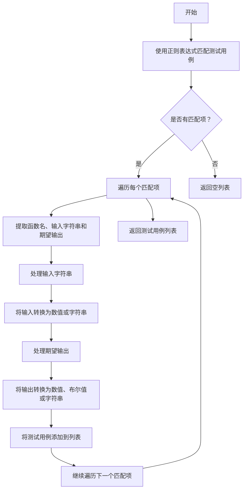
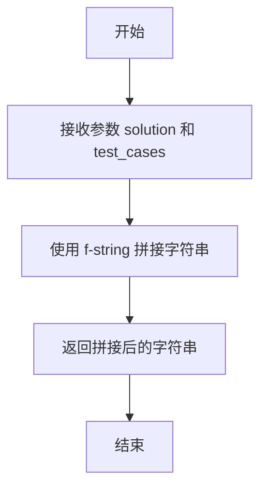
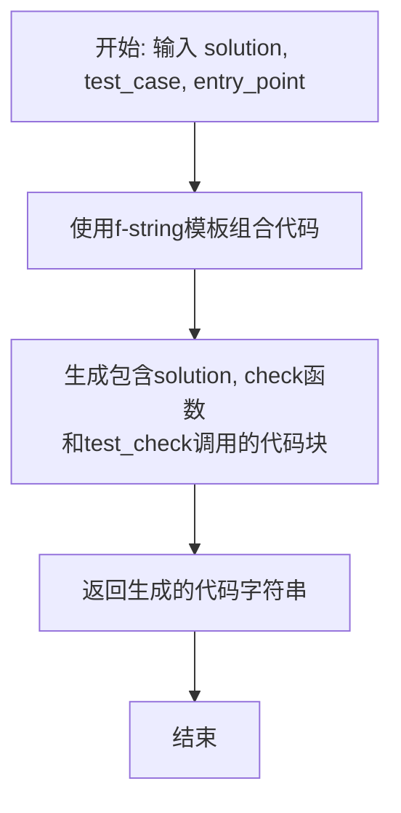

# `.\MetaGPT\metagpt\ext\aflow\scripts\utils.py` 详细设计文档

该代码文件是一个用于处理代码测试用例的工具模块，主要功能包括：1) 根据指定的代码数据集（HumanEval或MBPP）和函数入口点，从JSONL文件中提取预定义的测试用例字符串；2) 从Python文档字符串（docstring）中解析出格式化的测试用例（函数名、输入参数列表、期望输出）；3) 将解决方案代码和测试用例组合生成可执行的测试函数。

## 整体流程

```mermaid
graph TD
    A[开始] --> B{调用哪个函数?}
    B -- extract_test_cases_from_jsonl --> C{指定数据集和入口点}
    C --> D{入口点是否在硬编码字典中?}
    D -- 是 --> E[返回硬编码的测试用例字符串]
    D -- 否 --> F[读取对应的JSONL文件]
    F --> G{遍历文件，匹配entry_point}
    G -- 匹配成功 --> H[返回对应的test字段值]
    G -- 匹配失败 --> I[返回None]
    B -- extract_test_cases --> J[输入文档字符串]
    J --> K[使用正则表达式匹配所有 >>> 格式的测试用例]
    K --> L[遍历每个匹配项]
    L --> M[解析函数名、输入参数、期望输出]
    M --> N[将输入参数转换为数值或字符串]
    N --> O[将期望输出转换为布尔值、数值或字符串]
    O --> P[将[函数名, 输入列表, 期望输出]加入结果列表]
    P --> Q[返回测试用例列表]
    B -- test_cases_2_test_functions --> R[输入解决方案代码和测试用例字符串]
    R --> S[将两者拼接成一个字符串]
    S --> T[返回拼接后的字符串]
    B -- test_case_2_test_function --> U[输入解决方案代码、单个测试用例字符串、入口点]
    U --> V[拼接代码，生成包含check函数和test_check调用的完整测试模块]
    V --> W[返回生成的测试模块字符串]
```

## 类结构

```
utils.py
├── CodeDataset (枚举类)
├── extract_test_cases_from_jsonl (全局函数)
├── extract_test_cases (全局函数)
├── test_cases_2_test_functions (全局函数)
└── test_case_2_test_function (全局函数)
```

## 全局变量及字段


### `CodeDataset.HUMAN_EVAL`
    
表示HumanEval代码数据集的枚举值，用于标识和区分不同的代码测试数据集。

类型：`CodeDataset`
    


### `CodeDataset.MBPP`
    
表示MBPP代码数据集的枚举值，用于标识和区分不同的代码测试数据集。

类型：`CodeDataset`
    
    

## 全局函数及方法

### `extract_test_cases_from_jsonl`

该函数根据给定的函数入口点名称和数据集类型，从指定的JSONL文件中提取对应的测试用例。如果函数名存在于预设的硬编码映射中，则直接返回对应的空字符串；否则，它会遍历JSONL文件，查找匹配`entry_point`的条目并返回其`test`字段的内容。

参数：

- `entry_point`：`str`，要查找测试用例的目标函数的名称。
- `dataset`：`CodeDataset`，指定数据集来源，默认为`CodeDataset.HUMAN_EVAL`。其值应为`CodeDataset`枚举的成员（如`CodeDataset.HUMAN_EVAL.value`或`CodeDataset.MBPP.value`）。

返回值：`str` 或 `None`，返回找到的测试用例字符串。如果函数名在硬编码映射中，返回空字符串；如果从文件中找到匹配项，返回其`test`字段的值；如果都未找到，则返回`None`。

#### 流程图

```mermaid
flowchart TD
    A[开始: extract_test_cases_from_jsonl] --> B{dataset 是 HUMAN_EVAL?};
    B -- 是 --> C[设置 file_path 和 hardcoded_cases<br>为 HumanEval 配置];
    B -- 否 --> D{dataset 是 MBPP?};
    D -- 是 --> E[设置 file_path 和 hardcoded_cases<br>为 MBPP 配置];
    D -- 否 --> F[返回 None];
    C --> G{entry_point 在<br>hardcoded_cases 中?};
    E --> G;
    G -- 是 --> H[返回 hardcoded_cases[entry_point]<br>（空字符串）];
    G -- 否 --> I[打开 file_path 文件];
    I --> J[遍历文件每一行];
    J --> K[解析 JSON];
    K --> L{data.entry_point == entry_point?};
    L -- 是 --> M[返回 data.test];
    L -- 否 --> N[继续下一行];
    N --> J;
    J -- 文件结束 --> O[返回 None];
```

#### 带注释源码

```python
def extract_test_cases_from_jsonl(entry_point: str, dataset: CodeDataset = CodeDataset.HUMAN_EVAL):
    # 根据传入的数据集枚举值，确定要读取的文件路径和硬编码的测试用例映射表。
    if dataset == CodeDataset.HUMAN_EVAL.value:
        file_path = "metagpt/ext/aflow/data/humaneval_public_test.jsonl"
        # 为 HumanEval 数据集预设的硬编码函数名映射，值为空字符串。
        hardcoded_cases = {
            "find_zero": "",
            "decode_cyclic": "",
            "decode_shift": "",
            "by_length": "",
            "add": "",
            "triangle_area": "",
            "correct_bracketing": "",
            "solve": "",
            "sum_squares": "",
            "starts_one_ends": "",
        }
    elif dataset == CodeDataset.MBPP.value:
        file_path = "metagpt/ext/aflow/data/mbpp_public_test.jsonl"
        # 为 MBPP 数据集预设的硬编码函数名映射，值为空字符串。
        hardcoded_cases = {
            "remove_odd": "",
            "replace_spaces": "",
            "snake_to_camel": "",
            "Split": "",
            "swap_List": "",
            "square_Sum": "",
            "sort_sublists": "",
            "unique_sublists": "",
        }
    # 首先检查目标函数名是否在硬编码映射中，如果是，则直接返回对应的空字符串。
    if entry_point in hardcoded_cases:
        return hardcoded_cases[entry_point]

    # 如果不在硬编码映射中，则打开对应的 JSONL 文件进行查找。
    with open(file_path, "r") as file:
        # 遍历文件的每一行。
        for line in file:
            # 将每一行解析为 JSON 对象。
            data = json.loads(line)
            # 检查当前 JSON 对象的 "entry_point" 字段是否与目标函数名匹配。
            if data.get("entry_point") == entry_point:
                # 如果匹配，则返回该对象的 "test" 字段内容。
                return data.get("test")

    # 如果遍历完整个文件都没有找到匹配项，则返回 None。
    return None
```

### `extract_test_cases`

该函数用于从给定的文档字符串（docstring）中提取测试用例。它使用正则表达式匹配文档字符串中符合特定格式的测试用例（例如 `>>> function_name(input) expected_output`），并将匹配到的函数名、输入参数和期望输出解析并转换为适当的数据类型（如整数、浮点数、布尔值或字符串），最后返回一个包含所有测试用例的列表。

参数：

- `docstring`：`str`，包含测试用例的文档字符串。

返回值：`List[Tuple[str, List[Any], Any]]`，返回一个列表，其中每个元素是一个元组，包含函数名、输入参数列表和期望输出。

#### 流程图



#### 带注释源码

```python
def extract_test_cases(docstring: str) -> List[Tuple[str, List[Any], Any]]:
    # 使用正则表达式匹配测试用例，捕获函数名和任何输出
    pattern = r">>> (\w+)\((.*?)\)\n\s*(.*?)(?=\n|$)"
    matches = re.findall(pattern, docstring, re.DOTALL)

    test_cases = []
    for match in matches:
        func_name, input_str, expected_output = match

        # 处理输入
        input_list = []
        for item in input_str.split(","):
            item = item.strip()
            try:
                # 尝试将输入转换为数值类型
                if "." in item:
                    input_list.append(float(item))
                else:
                    input_list.append(int(item))
            except ValueError:
                # 如果无法转换为数值，则保留为字符串
                input_list.append(item.strip("'\""))

        # 处理输出
        try:
            # 尝试将输出转换为数值或布尔值
            if expected_output.lower() == "true":
                expected_output = True
            elif expected_output.lower() == "false":
                expected_output = False
            elif "." in expected_output:
                expected_output = float(expected_output)
            else:
                expected_output = int(expected_output)
        except ValueError:
            # 如果无法转换，则保留为字符串
            expected_output = expected_output.strip("'\"")

        test_cases.append([func_name, input_list, expected_output])

    return test_cases
```

### `test_cases_2_test_functions`

该函数接收一个解决方案代码字符串和一个测试用例字符串，将它们拼接成一个新的字符串。这个新字符串包含了解决方案代码和紧随其后的测试用例代码，通常用于生成一个可以直接运行的测试脚本。

参数：
- `solution`：`str`，包含待测试函数或解决方案的源代码字符串。
- `test_cases`：`str`，包含测试用例的源代码字符串。

返回值：`str`，返回一个拼接后的字符串，其中 `solution` 和 `test_cases` 以换行符分隔。

#### 流程图



#### 带注释源码

```python
def test_cases_2_test_functions(solution: str, test_cases: str):
    # 使用 f-string 将解决方案代码和测试用例代码拼接成一个新的字符串。
    # 拼接时，solution 和 test_cases 之间用一个空行分隔，以提高可读性。
    tester_function = f"""
{solution}

{test_cases}
"""
    # 返回拼接后的完整测试函数字符串。
    return tester_function
```


### `test_case_2_test_function`

该函数用于将给定的解决方案代码、单个测试用例字符串和入口点函数名，组合成一个完整的、可执行的Python测试函数。它通过将解决方案代码和测试用例包装在一个名为`check`的测试函数中，并最终调用该函数来执行测试。

参数：

-  `solution`：`str`，包含待测试函数实现的源代码字符串。
-  `test_case`：`str`，一个单独的测试用例字符串，通常格式为`assert candidate(...) == ...`。
-  `entry_point`：`str`，待测试函数的名称，将作为参数传递给`check`函数。

返回值：`str`，返回一个完整的、可执行的Python代码字符串，该代码包含了解决方案、测试包装函数以及执行测试的调用。

#### 流程图



#### 带注释源码

```python
def test_case_2_test_function(solution: str, test_case: str, entry_point: str):
    # 使用f-string模板，将输入的参数组合成一个完整的Python代码字符串。
    # 该字符串包含三部分：
    # 1. 原始的解决方案代码 (solution)。
    # 2. 一个名为`check`的函数，它接收一个候选函数`candidate`作为参数，
    #    并在其函数体内执行传入的`test_case`。
    # 3. 一个名为`test_check`的函数，它调用`check`函数，并将入口点函数`entry_point`
    #    作为参数传入，从而执行测试。
    # 4. 最后一行直接调用`test_check()`来运行测试。
    tester_function = f"""
{solution}


def check(candidate):
    {test_case}

def test_check():
    check({entry_point})

test_check()
"""
    return tester_function
```


## 关键组件


### 测试用例提取与处理组件

该组件负责从不同来源（JSONL文件或硬编码字典）提取测试用例，并对从文档字符串中提取的测试用例进行解析和类型转换，为后续的代码测试提供标准化的输入和预期输出数据。

### 数据集枚举与配置管理组件

该组件通过枚举类`CodeDataset`定义了支持的数据集类型（如HumanEval、MBPP），并管理不同数据集对应的文件路径和硬编码测试用例字典，实现了数据集相关配置的集中管理和类型安全。

### 测试函数生成器组件

该组件包含两个函数，用于将解决方案代码和测试用例（或单个测试用例）组合成可执行的Python测试函数代码块，为动态执行和验证代码逻辑提供了基础。


## 问题及建议


### 已知问题

-   **硬编码文件路径**：`extract_test_cases_from_jsonl` 函数中的 `file_path` 是硬编码的字符串，这使得代码的可移植性和可配置性很差。如果文件位置发生变化，或者需要在不同环境中运行，都需要修改源代码。
-   **硬编码测试用例**：函数内部维护了一个硬编码的 `hardcoded_cases` 字典。这种将数据逻辑与代码逻辑耦合的方式，使得维护和更新测试用例变得困难，容易出错且不便于扩展。
-   **脆弱的正则表达式**：`extract_test_cases` 函数依赖一个固定的正则表达式模式来解析文档字符串中的测试用例。该模式对于多行参数、复杂数据结构（如列表、字典）或嵌套函数调用等情况可能无法正确匹配，导致解析失败或结果错误。
-   **类型转换逻辑不健壮**：`extract_test_cases` 函数中尝试将字符串转换为 `int` 或 `float` 的逻辑过于简单。它无法正确处理科学计数法、复数、`None` 值，也无法安全地处理可能引发转换异常的边缘情况。
-   **布尔值转换逻辑有缺陷**：在转换期望输出时，代码仅检查字符串是否完全等于 `"true"` 或 `"false"`（不区分大小写）。这无法覆盖 Python 文档字符串中常见的 `True` 和 `False` 表示形式。
-   **函数职责不单一**：`extract_test_cases_from_jsonl` 函数同时承担了决定数据源（硬编码字典 vs JSONL 文件）、读取文件和解析数据三项职责，违反了单一职责原则，降低了代码的可测试性和可维护性。
-   **潜在的资源泄漏**：`extract_test_cases_from_jsonl` 函数在循环中打开文件，但只在找到匹配项或遍历完文件后才隐式关闭。虽然 CPython 的引用计数机制通常能及时关闭文件，但这并非最佳实践，且在其他 Python 实现中可能存在风险。更安全的方式是使用 `with` 语句确保文件被正确关闭。
-   **错误处理不足**：`extract_test_cases_from_jsonl` 函数在文件不存在或 JSON 解析失败时没有明确的错误处理，可能导致程序崩溃。`extract_test_cases` 函数在正则匹配失败或类型转换异常时也没有提供清晰的错误信息。
-   **代码重复**：`test_cases_2_test_functions` 和 `test_case_2_test_function` 两个函数功能高度相似，都是将解决方案和测试用例组合成可执行的测试代码。这造成了代码重复，增加了维护成本。
-   **命名不一致**：函数 `test_cases_2_test_functions` 和 `test_case_2_test_function` 的名称非常相似，容易混淆。且 `2` 的用法不符合常见的命名约定（通常使用 `to` 或 `_to_`）。

### 优化建议

-   **配置文件管理路径**：将文件路径（如 `"metagpt/ext/aflow/data/humaneval_public_test.jsonl"`）提取到配置文件（如 YAML、JSON 或环境变量）中。通过一个配置管理类或模块来读取这些路径，提高代码的灵活性和可配置性。
-   **外部化硬编码数据**：将 `hardcoded_cases` 字典的内容移至外部数据文件（如 JSON、YAML）。在函数中读取该文件来获取数据。这样可以实现数据与代码的分离，便于独立管理和更新。
-   **使用更强大的解析器**：考虑使用更健壮的方法来解析文档字符串中的测试用例，例如：
    1.  使用 `doctest` 模块的官方解析功能。
    2.  使用 `ast`（抽象语法树）模块来解析代码片段，以获得更准确的结构化信息。
    3.  如果必须使用正则表达式，应设计更复杂、能处理嵌套结构和多行字符串的模式。
-   **重构类型转换逻辑**：
    1.  使用 `ast.literal_eval()` 来安全地评估字符串形式的 Python 字面量（数字、字符串、元组、列表、字典、布尔值、None）。这比简单的 `int()`/`float()` 转换更安全、更强大。
    2.  为无法通过 `ast.literal_eval()` 解析的字符串提供明确的回退策略或错误提示。
-   **分离关注点**：重构 `extract_test_cases_from_jsonl` 函数：
    1.  创建一个专门的数据源加载器，根据 `dataset` 和 `entry_point` 决定并返回原始测试数据字符串。
    2.  将文件读取逻辑封装在一个独立的、使用 `with` 语句确保资源安全管理的函数中。
    3.  让主函数只负责协调和返回结果。
-   **增强错误处理**：
    1.  在文件操作周围添加 `try...except` 块，捕获 `FileNotFoundError`, `JSONDecodeError` 等异常，并记录有意义的错误日志或抛出更具体的自定义异常。
    2.  在 `extract_test_cases` 中，如果正则匹配不到内容或 `ast.literal_eval` 失败，应返回空列表或抛出异常，并记录警告。
-   **消除代码重复**：合并 `test_cases_2_test_functions` 和 `test_case_2_test_function`。可以创建一个更通用的函数，例如 `generate_test_script(solution: str, test_code: str, entry_point: str = None)`，通过参数控制生成单个测试用例还是多个测试用例的脚本。
-   **统一命名规范**：重命名函数，使其意图更清晰，符合 `snake_case` 命名规范。例如：
    -   `extract_test_cases_from_jsonl` -> `load_test_cases_from_dataset`
    -   `test_cases_2_test_functions` -> `generate_test_script_from_cases`
    -   `test_case_2_test_function` -> `generate_test_script_for_case` (或与上一条建议合并)
-   **添加单元测试**：为上述工具函数编写全面的单元测试，覆盖各种边界情况，包括但不限于：空输入、格式错误的文档字符串、不存在的文件、复杂的测试用例格式等。这能有效防止回归并提高代码质量。
-   **考虑性能优化**：如果 `extract_test_cases_from_jsonl` 需要频繁调用，且 JSONL 文件很大，当前的线性扫描方式效率较低。可以考虑在模块加载时一次性将整个 JSONL 文件读入内存，构建一个 `entry_point -> test` 的字典进行缓存，后续查询直接使用内存中的字典，以空间换时间。


## 其它


### 设计目标与约束

本模块的设计目标是提供一个轻量级、可扩展的测试用例提取与生成工具，主要用于处理特定格式（如HumanEval、MBPP）的代码评测数据集。其核心约束包括：1) 支持从JSONL格式的公共测试数据文件中动态读取测试用例；2) 提供从Python文档字符串（docstring）中解析特定格式（`>>> func_name(...)`）测试用例的能力；3) 能够将提取的测试用例与解决方案代码片段组合，生成可直接执行的测试函数。设计上强调功能的单一性和模块化，避免与具体的评测执行逻辑过度耦合。

### 错误处理与异常设计

模块中的错误处理策略相对简单，主要依赖于Python的默认异常机制和条件检查。
1.  **静默失败与默认值**：在`extract_test_cases_from_jsonl`函数中，如果未找到对应的`entry_point`或文件读取失败，函数将返回`None`。调用方需要检查返回值。文件读取操作（`open`）可能抛出`IOError`，但未在函数内部捕获，将直接传递给调用方。
2.  **防御性转换**：在`extract_test_cases`函数中，对输入参数和期望输出进行类型转换时，广泛使用了`try...except ValueError`结构。当字符串无法转换为`int`或`float`时，则保留为字符串。这种设计确保了函数对非标准或复杂数据（如嵌套结构、变量名）的鲁棒性，但可能掩盖了数据格式错误。
3.  **枚举值校验**：`extract_test_cases_from_jsonl`函数通过`dataset == CodeDataset.XXX.value`进行比较，这依赖于调用方传入正确的枚举值或字符串。如果传入无效值，函数逻辑可能进入未定义的路径（虽然当前代码结构下会执行到文件读取逻辑，但`file_path`可能未定义）。

### 数据流与状态机

模块的数据流清晰，无复杂的状态机。
1.  **主要数据流**：
    *   **路径A（预置用例）**：调用`extract_test_cases_from_jsonl` -> 检查`entry_point`是否在`hardcoded_cases`字典中 -> 是则返回对应的（当前为空）字符串。
    *   **路径B（文件读取）**：调用`extract_test_cases_from_jsonl` -> `entry_point`不在预置字典 -> 读取对应的JSONL文件 -> 逐行解析，匹配`entry_point` -> 返回`test`字段内容或`None`。
    *   **路径C（文档字符串解析）**：调用`extract_test_cases` -> 使用正则表达式匹配`>>>`格式的用例 -> 对每个匹配项进行输入/输出的清洗和类型转换 -> 返回结构化的测试用例列表。
    *   **路径D（测试代码生成）**：调用`test_cases_2_test_functions`或`test_case_2_test_function` -> 将解决方案代码字符串和测试用例字符串进行简单的字符串拼接 -> 返回完整的、可执行的Python代码字符串。
2.  **状态**：模块本身是无状态的（Stateless）。所有函数均为纯函数，输出完全由输入参数决定，不依赖和修改任何外部或模块级状态。

### 外部依赖与接口契约

1.  **外部依赖**：
    *   **Python标准库**：`json`（用于解析JSONL文件）、`re`（用于正则表达式匹配）、`enum`（用于定义数据集枚举）、`typing`（用于类型注解）。
    *   **文件系统**：`extract_test_cases_from_jsonl`函数依赖于特定路径（`"metagpt/ext/aflow/data/humaneval_public_test.jsonl"`和`"metagpt/ext/aflow/data/mbpp_public_test.jsonl"`）下的数据文件。这是硬编码的，构成了关键的外部依赖。
2.  **接口契约（函数签名与预期行为）**：
    *   `extract_test_cases_from_jsonl(entry_point: str, dataset: CodeDataset = CodeDataset.HUMAN_EVAL) -> str | None`：契约要求`dataset`参数是`CodeDataset`枚举或其字符串值。返回测试用例字符串或`None`。
    *   `extract_test_cases(docstring: str) -> List[Tuple[str, List[Any], Any]]`：契约要求输入`docstring`包含特定格式（`>>> func_name(...)`）的文本。返回一个列表，其中每个元素是`(函数名, 输入参数列表, 期望输出)`。
    *   `test_cases_2_test_functions(solution: str, test_cases: str) -> str` 和 `test_case_2_test_function(solution: str, test_case: str, entry_point: str) -> str`：契约要求输入为有效的Python代码字符串。返回拼接后的、语法上有效的Python代码字符串。生成代码的正确执行依赖于`solution`中定义了相应的函数。

### 配置与可扩展性

1.  **硬编码配置**：文件路径（`file_path`）和硬编码测试用例字典（`hardcoded_cases`）是直接写在函数逻辑中的。这降低了灵活性，如需更改数据源或添加新的预置用例，必须修改源代码。
2.  **枚举扩展**：`CodeDataset`枚举定义了当前支持的数据集。要支持新的数据集，需要：1) 在枚举中添加新成员；2) 在`extract_test_cases_from_jsonl`函数中添加对应的`elif`分支，指定新的`file_path`和`hardcoded_cases`。
3.  **解析逻辑扩展**：`extract_test_cases`函数的解析逻辑通过正则表达式`pattern`固定。如果文档字符串中的测试用例格式发生变化，则需要修改此正则表达式。
4.  **生成模板固定**：测试代码的生成逻辑（`test_cases_2_test_functions`和`test_case_2_test_function`）是简单的字符串拼接，模板固化在函数中。如果需要生成不同结构或框架（如pytest）的测试代码，需要修改函数或添加新的生成函数。


    