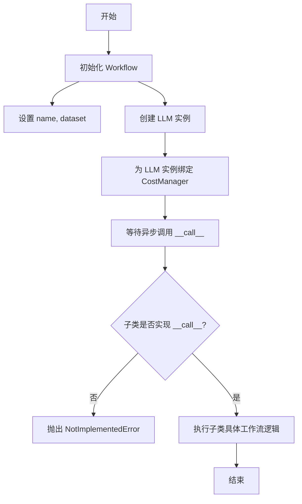
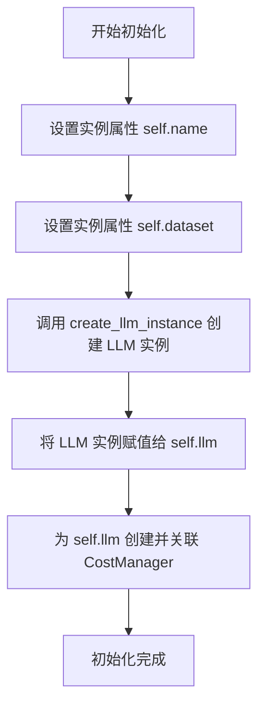
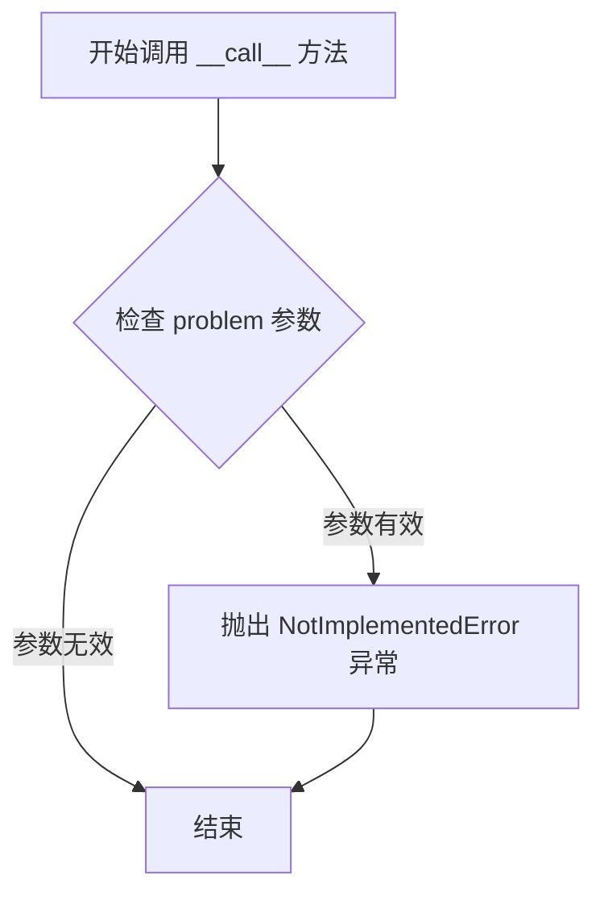

# `.\MetaGPT\metagpt\ext\aflow\scripts\workflow.py` 详细设计文档

该代码定义了一个名为 Workflow 的抽象基类，用于构建基于大语言模型（LLM）的工作流。它通过接收工作流名称、LLM配置和数据集进行初始化，并提供了一个异步调用接口，要求子类实现具体的问题处理逻辑。

## 整体流程



## 类结构

```
Workflow (工作流抽象基类)
└── (待子类继承和实现)
```

## 全局变量及字段


### `Workflow.name`
    
工作流的名称，用于标识不同的工作流实例。

类型：`str`
    


### `Workflow.dataset`
    
工作流处理的数据集，指定了数据的类型和来源。

类型：`DatasetType`
    


### `Workflow.llm`
    
工作流使用的语言模型实例，负责执行核心的AI推理任务。

类型：`LLM instance (from create_llm_instance)`
    
    

## 全局函数及方法

### `Workflow.__init__`

该方法用于初始化一个工作流实例，设置工作流名称、数据集，并基于给定的LLM配置创建LLM实例，同时为其关联一个成本管理器。

参数：

- `name`：`str`，工作流的名称
- `llm_config`：`Any`，用于创建LLM实例的配置对象
- `dataset`：`DatasetType`，工作流将要处理的数据集类型

返回值：`None`，此方法不返回任何值

#### 流程图



#### 带注释源码

```python
def __init__(
    self,
    name: str,           # 工作流的名称
    llm_config,          # 用于创建LLM实例的配置对象
    dataset: DatasetType, # 工作流将要处理的数据集类型
) -> None:
    # 将传入的名称赋值给实例变量 self.name
    self.name = name
    # 将传入的数据集类型赋值给实例变量 self.dataset
    self.dataset = dataset
    # 使用传入的 llm_config 创建 LLM 实例，并赋值给实例变量 self.llm
    self.llm = create_llm_instance(llm_config)
    # 为 self.llm 实例创建一个新的 CostManager 对象，用于管理成本
    self.llm.cost_manager = CostManager()
```

### `Workflow.__call__`

该方法定义了工作流类的可调用接口，用于执行具体的工作流逻辑。它是一个抽象方法，需要在子类中实现具体的业务逻辑。

参数：

- `problem`：`str`，需要处理的问题或任务描述字符串

返回值：`None`，该方法没有返回值（但实际实现可能返回异步结果）

#### 流程图



#### 带注释源码

```python
async def __call__(self, problem: str):
    """
    Implementation of the workflow
    """
    # 这是一个抽象方法，需要在子类中具体实现
    # 参数 problem 表示需要处理的问题描述
    # 子类需要重写此方法以实现具体的工作流逻辑
    raise NotImplementedError("This method should be implemented by the subclass")
```

## 关键组件

### Workflow基类

定义了工作流的基本结构，包含名称、数据集和LLM实例的初始化，并提供了异步调用接口的抽象定义。

### LLM实例创建与配置

通过`create_llm_instance`函数根据配置创建LLM实例，并为其关联成本管理器以进行使用成本跟踪。

### 异步执行接口

定义了`__call__`方法作为工作流的异步执行入口，要求子类必须实现具体的执行逻辑。

## 问题及建议


### 已知问题

-   **`__call__` 方法未实现**：基类 `Workflow` 中的 `__call__` 方法仅抛出了 `NotImplementedError`。这意味着任何直接实例化 `Workflow` 或未正确重写此方法的子类在调用时都会导致运行时错误，这违反了“基类应提供默认或可用的行为”的设计原则，增加了子类开发者的负担和出错风险。
-   **硬编码的成本管理器初始化**：在 `__init__` 方法中，`self.llm.cost_manager` 被直接赋值为一个新的 `CostManager()` 实例。这种做法缺乏灵活性，使得无法注入自定义的或经过配置的 `CostManager` 实例，例如用于测试的模拟对象或具有特定预算设置的管理器，这违反了依赖注入原则，不利于单元测试和运行时配置。
-   **缺乏类型注解和文档**：`llm_config` 参数缺少明确的类型注解，降低了代码的可读性和静态类型检查工具（如 mypy）的有效性。同时，类和方法级别的文档字符串（docstring）过于简略，没有详细说明参数、返回值、异常以及类的设计意图和职责，不利于团队协作和长期维护。

### 优化建议

-   **将 `__call__` 改为抽象方法或提供默认实现**：建议将 `Workflow` 类定义为抽象基类（ABC），并使用 `@abstractmethod` 装饰器明确声明 `__call__` 为抽象方法。这样可以在类定义层面强制子类实现该方法，提供更清晰的接口契约和更早的（导入时）错误提示。如果存在某种通用的默认流程，也可以提供一个基础实现供子类调用或重写。
-   **支持依赖注入以增强灵活性**：修改 `__init__` 方法，为 `cost_manager` 增加一个可选参数。可以提供一个默认值（如 `None`），当为 `None` 时再创建默认的 `CostManager` 实例。这样既保持了向后兼容性，又允许调用者传入自定义的 `CostManager` 实例，提高了代码的可测试性和可配置性。
-   **完善类型注解和文档**：为 `llm_config` 参数添加具体的类型注解（例如使用 `LLMConfig` 类型或 `dict`）。同时，为 `Workflow` 类编写详细的类文档字符串，说明其作为工作流基类的角色、核心职责以及子类化指南。为 `__init__` 和 `__call__` 方法补充完整的参数说明、返回值说明和可能抛出的异常。


## 其它


### 设计目标与约束

本代码旨在定义一个基础的工作流（Workflow）抽象类，为后续具体的工作流实现提供统一的框架和接口。其核心设计目标是实现一个可扩展、可配置的异步工作流基类，通过依赖注入的方式集成大语言模型（LLM）和数据集，并统一管理成本。主要约束包括：1）必须继承自`Workflow`类并实现`__call__`方法以定义具体流程；2）依赖于`metagpt`框架提供的LLM实例创建和成本管理模块；3）工作流执行必须是异步的。

### 错误处理与异常设计

当前代码中显式定义的错误处理是`__call__`方法抛出的`NotImplementedError`，用于强制子类实现具体的执行逻辑。对于`create_llm_instance`函数和`CostManager`的初始化，代码依赖于其内部或外部的错误处理机制（如参数验证、连接异常等）。整体上，错误处理策略较为基础，主要依赖上层调用者或框架的异常捕获和处理。

### 数据流与状态机

数据流始于`Workflow`对象的初始化，输入为工作流名称`name`、LLM配置`llm_config`和数据集`dataset`。初始化过程创建了LLM实例并关联成本管理器。执行时，通过调用`__call__`方法，输入`problem`字符串，触发具体的工作流逻辑。由于`__call__`是抽象方法，具体的数据处理、LLM调用、结果返回等流程由子类定义。该类本身不维护复杂的内部状态，主要状态由集成的`llm`对象和`cost_manager`管理。

### 外部依赖与接口契约

1.  **外部依赖**：
    *   `metagpt.ext.aflow.scripts.evaluator.DatasetType`：定义了数据集类型的接口或枚举，约束了`dataset`参数的形式。
    *   `metagpt.provider.llm_provider_registry.create_llm_instance`：工厂函数，根据`llm_config`创建具体的LLM提供者实例。依赖其返回的对象具有`cost_manager`属性。
    *   `metagpt.utils.cost_manager.CostManager`：成本管理类，用于跟踪和计算LLM调用的开销。
2.  **接口契约**：
    *   `__init__`方法：契约要求调用者提供`name`(str), `llm_config`, `dataset`(DatasetType)三个参数。
    *   `__call__`方法：契约要求子类必须实现此异步方法，接受一个`problem`(str)参数，并定义具体的工作流执行逻辑。这是整个工作流框架的核心调用接口。

### 安全与合规考虑

当前代码片段未直接涉及敏感数据处理、身份认证或网络通信安全。安全与合规性主要依赖于：
1.  所集成的`create_llm_instance`函数及其背后LLM服务提供商的安全协议（如API密钥管理、传输加密）。
2.  传入的`dataset`可能包含敏感信息，其安全处理责任在于`Workflow`子类的具体实现和调用方。
3.  `CostManager`可能涉及资源使用计费，需要确保其使用符合组织的财务合规政策。

### 测试策略建议

1.  **单元测试**：
    *   测试`__init__`方法能否正确初始化所有属性（`name`, `dataset`, `llm`, `llm.cost_manager`）。
    *   测试`__call__`方法在基类中是否确实抛出`NotImplementedError`。
    *   使用Mock对象模拟`create_llm_instance`和`CostManager`，测试初始化逻辑的健壮性。
2.  **集成测试**：
    *   针对具体的`Workflow`子类，测试其`__call__`方法与真实或模拟的LLM、数据集集成后的端到端功能。
    *   验证成本管理器在实际LLM调用过程中是否正确记录。
3.  **契约测试**：
    *   确保所有子类都实现了`__call__`方法，并且方法签名符合约定（异步、接受单个`str`参数）。

### 部署与运维考量

1.  **部署**：作为`metagpt`框架的一部分进行打包和版本管理。依赖项需在部署环境中正确安装。
2.  **配置**：`llm_config`的配置管理（如API密钥、模型选择、超时设置）是关键运维点，建议通过环境变量或配置中心管理，避免硬编码。
3.  **监控**：建议在子类的`__call__`方法中集成日志记录，特别是记录`problem`输入、关键步骤结果、LLM调用耗时和成本消耗，以便进行性能监控和故障排查。
4.  **可伸缩性**：`Workflow`实例本身是无状态的，可以并行创建多个实例处理不同任务。异步设计有利于在高并发I/O场景（如大量LLM调用）下提升资源利用率。

    