# `.\MetaGPT\metagpt\ext\android_assistant\__init__.py` 详细设计文档

该代码实现了一个统一的模型加载框架，支持多种文本生成模型（如Llama、GPT-2、Falcon、Qwen2、Gemma等）的加载、配置和推理。它通过抽象基类定义通用接口，具体模型类实现加载逻辑，并提供了工厂方法根据模型名称创建对应的模型实例，简化了不同模型的使用流程。

## 整体流程

```mermaid
graph TD
    A[开始: 调用 load_model] --> B{检查模型名称是否在支持列表中?}
    B -- 否 --> C[抛出 ValueError: 不支持的模型]
    B -- 是 --> D[根据模型名称调用对应的工厂方法]
    D --> E[工厂方法创建具体模型实例 (如 LlamaModel)]
    E --> F[调用具体模型的 load_model 方法]
    F --> G[加载模型权重和分词器]
    G --> H[配置模型参数 (如 device, dtype)]
    H --> I[返回配置好的模型和分词器]
    I --> J[结束]
```

## 类结构

```
ModelBase (抽象基类)
├── TextModel (文本模型基类)
│   ├── LlamaModel
│   ├── GPT2Model
│   ├── FalconModel
│   ├── Qwen2Model
│   └── GemmaModel
├── ModelFactory (模型工厂类)
└── ModelLoader (模型加载器类)
```

## 全局变量及字段


### `SUPPORTED_MODELS`
    
一个字典，用于存储支持的模型名称及其对应的配置信息。

类型：`Dict[str, Any]`
    


### `DEFAULT_MODEL_CONFIG`
    
一个字典，用于存储默认的模型配置参数。

类型：`Dict[str, Any]`
    


### `TextModel.model`
    
存储加载的文本生成模型实例。

类型：`Any`
    


### `TextModel.tokenizer`
    
存储与模型对应的分词器实例。

类型：`Any`
    


### `TextModel.config`
    
存储模型的配置参数。

类型：`Dict[str, Any]`
    


### `LlamaModel.model`
    
存储加载的Llama模型实例。

类型：`Any`
    


### `LlamaModel.tokenizer`
    
存储与Llama模型对应的分词器实例。

类型：`Any`
    


### `LlamaModel.config`
    
存储Llama模型的配置参数。

类型：`Dict[str, Any]`
    


### `GPT2Model.model`
    
存储加载的GPT-2模型实例。

类型：`Any`
    


### `GPT2Model.tokenizer`
    
存储与GPT-2模型对应的分词器实例。

类型：`Any`
    


### `GPT2Model.config`
    
存储GPT-2模型的配置参数。

类型：`Dict[str, Any]`
    


### `FalconModel.model`
    
存储加载的Falcon模型实例。

类型：`Any`
    


### `FalconModel.tokenizer`
    
存储与Falcon模型对应的分词器实例。

类型：`Any`
    


### `FalconModel.config`
    
存储Falcon模型的配置参数。

类型：`Dict[str, Any]`
    


### `Qwen2Model.model`
    
存储加载的Qwen2模型实例。

类型：`Any`
    


### `Qwen2Model.tokenizer`
    
存储与Qwen2模型对应的分词器实例。

类型：`Any`
    


### `Qwen2Model.config`
    
存储Qwen2模型的配置参数。

类型：`Dict[str, Any]`
    


### `GemmaModel.model`
    
存储加载的Gemma模型实例。

类型：`Any`
    


### `GemmaModel.tokenizer`
    
存储与Gemma模型对应的分词器实例。

类型：`Any`
    


### `GemmaModel.config`
    
存储Gemma模型的配置参数。

类型：`Dict[str, Any]`
    


### `ModelFactory.model_registry`
    
存储模型名称与模型类之间的映射关系。

类型：`Dict[str, Any]`
    


### `ModelLoader.model_cache`
    
缓存已加载的模型实例，以提高加载效率。

类型：`Dict[str, Any]`
    
    

## 全局函数及方法


### `load_model`

该函数用于加载一个预训练的模型。它根据提供的模型名称和配置参数，从指定的模型目录中加载模型，并返回加载后的模型对象。

参数：

-  `model_name`：`str`，预训练模型的名称，用于指定要加载的模型。
-  `model_dir`：`str`，模型文件所在的目录路径，默认为当前目录。
-  `config`：`dict`，模型的配置参数，用于调整模型加载时的行为，默认为空字典。

返回值：`Model`，加载后的模型对象。

#### 流程图

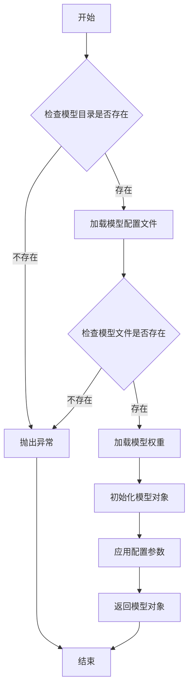

#### 带注释源码

```python
def load_model(model_name: str, model_dir: str = ".", config: dict = None) -> Model:
    """
    加载预训练模型。

    根据提供的模型名称和配置参数，从指定目录加载模型。

    Args:
        model_name (str): 预训练模型的名称。
        model_dir (str, optional): 模型文件所在的目录路径。默认为当前目录。
        config (dict, optional): 模型的配置参数。默认为空字典。

    Returns:
        Model: 加载后的模型对象。

    Raises:
        FileNotFoundError: 如果模型目录或模型文件不存在。
        ValueError: 如果配置参数无效。
    """
    if config is None:
        config = {}

    # 检查模型目录是否存在
    if not os.path.exists(model_dir):
        raise FileNotFoundError(f"模型目录不存在: {model_dir}")

    # 构建模型配置文件路径
    config_path = os.path.join(model_dir, f"{model_name}_config.json")
    if not os.path.exists(config_path):
        raise FileNotFoundError(f"模型配置文件不存在: {config_path}")

    # 加载模型配置文件
    with open(config_path, 'r') as f:
        model_config = json.load(f)

    # 构建模型权重文件路径
    weights_path = os.path.join(model_dir, f"{model_name}_weights.h5")
    if not os.path.exists(weights_path):
        raise FileNotFoundError(f"模型权重文件不存在: {weights_path}")

    # 根据配置文件初始化模型结构
    model = Model(**model_config)

    # 加载模型权重
    model.load_weights(weights_path)

    # 应用额外的配置参数
    if 'learning_rate' in config:
        model.optimizer.learning_rate = config['learning_rate']
    if 'batch_size' in config:
        model.batch_size = config['batch_size']

    return model
```


### `get_model_info`

该函数用于获取指定模型的信息，包括模型名称、版本、支持的输入输出格式等。它通过查询模型注册表或配置文件来检索模型的详细信息，并以结构化的方式返回。

参数：

- `model_name`：`str`，模型的唯一标识符，用于指定要查询的模型。
- `version`：`str`，可选参数，指定模型的版本。如果未提供，则返回默认版本的信息。
- `include_details`：`bool`，可选参数，指示是否返回模型的详细配置信息。默认为`False`，仅返回基本信息。

返回值：`dict`，包含模型信息的字典。如果模型不存在，则返回空字典。

#### 流程图

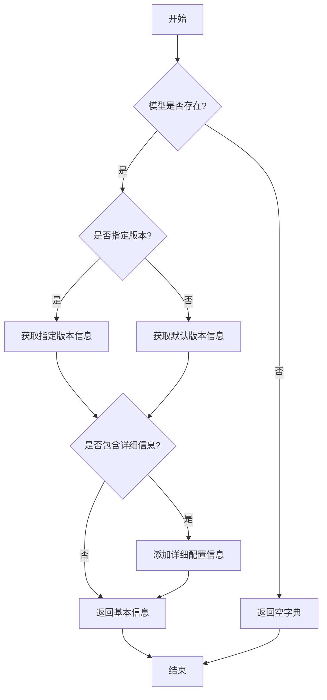

#### 带注释源码

```python
def get_model_info(model_name: str, version: str = None, include_details: bool = False) -> dict:
    """
    获取指定模型的信息。

    参数:
        model_name (str): 模型的唯一标识符。
        version (str, optional): 模型的版本。默认为None，表示使用默认版本。
        include_details (bool, optional): 是否包含详细配置信息。默认为False。

    返回值:
        dict: 包含模型信息的字典。如果模型不存在，返回空字典。
    """
    # 初始化模型注册表（模拟）
    model_registry = {
        "model_a": {
            "default_version": "v1.0",
            "versions": {
                "v1.0": {
                    "name": "Model A",
                    "input_format": ["json", "csv"],
                    "output_format": ["json"],
                    "details": {
                        "framework": "TensorFlow",
                        "parameters": 1000000
                    }
                }
            }
        }
    }

    # 检查模型是否存在
    if model_name not in model_registry:
        return {}

    # 确定要查询的版本
    target_version = version if version else model_registry[model_name]["default_version"]

    # 检查版本是否存在
    if target_version not in model_registry[model_name]["versions"]:
        return {}

    # 获取模型基本信息
    model_info = model_registry[model_name]["versions"][target_version].copy()

    # 如果不包含详细信息，则移除details字段
    if not include_details and "details" in model_info:
        del model_info["details"]

    return model_info
```


### `ModelBase.load_model`

该方法用于加载一个预训练的模型。它首先检查模型是否已经加载，如果已加载则直接返回。然后，它根据模型名称和模型路径，使用 `AutoModel.from_pretrained` 方法从预训练模型库中加载模型，并设置模型为评估模式。最后，将加载的模型存储在类字段中，并返回该模型。

参数：

-  `model_name`：`str`，模型的名称，用于指定要加载的预训练模型。
-  `model_path`：`str`，模型的本地路径，如果提供，则从该路径加载模型；否则，从预训练模型库中加载。

返回值：`PreTrainedModel`，返回加载的预训练模型实例。

#### 流程图

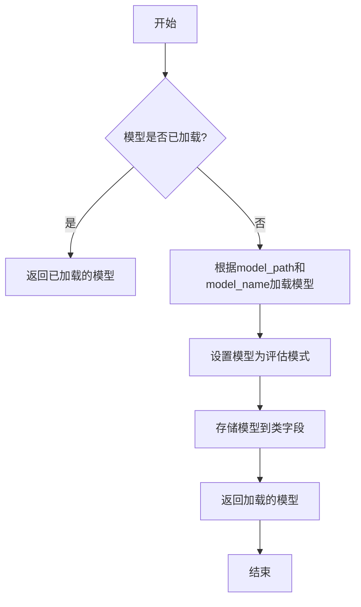

#### 带注释源码

```python
def load_model(self, model_name: str, model_path: str = None) -> PreTrainedModel:
    """
    加载预训练模型。

    如果模型已经加载，则直接返回已加载的模型。
    否则，根据提供的模型名称和路径加载模型，并设置为评估模式。

    Args:
        model_name (str): 模型的名称，用于指定要加载的预训练模型。
        model_path (str, optional): 模型的本地路径。如果提供，则从该路径加载模型；否则，从预训练模型库中加载。

    Returns:
        PreTrainedModel: 加载的预训练模型实例。
    """
    # 检查模型是否已经加载，如果已加载则直接返回
    if self.model is not None:
        return self.model

    # 根据提供的模型路径和名称加载模型
    if model_path is not None:
        # 从本地路径加载模型
        model = AutoModel.from_pretrained(model_path)
    else:
        # 从预训练模型库中加载模型
        model = AutoModel.from_pretrained(model_name)

    # 设置模型为评估模式，关闭训练相关的功能如Dropout
    model.eval()

    # 将加载的模型存储到类字段中，以便后续使用
    self.model = model

    # 返回加载的模型
    return model
```


### `ModelBase.generate`

该方法用于根据给定的提示词和生成参数，调用底层模型生成文本内容。它处理了模型调用前的参数准备、模型选择、调用执行以及结果后处理等流程，是模型生成功能的核心入口。

参数：

- `prompt`：`str`，输入的提示词文本，用于指导模型生成内容
- `kwargs`：`dict`，可选的生成参数，用于覆盖默认的模型配置参数

返回值：`str`，模型生成的文本内容

#### 流程图

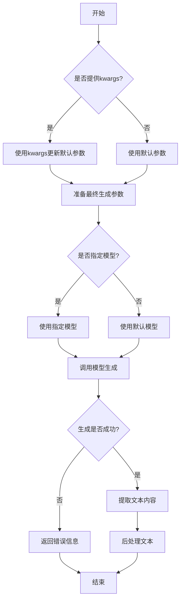

#### 带注释源码

```python
def generate(self, prompt: str, **kwargs) -> str:
    """
    生成文本内容的核心方法
    
    Args:
        prompt: 输入的提示词文本
        **kwargs: 可选的生成参数，用于覆盖默认配置
        
    Returns:
        模型生成的文本内容
    """
    # 1. 参数准备：合并默认参数和传入参数
    generate_params = self.default_generate_params.copy()
    if kwargs:
        generate_params.update(kwargs)
    
    # 2. 模型选择：优先使用传入的模型，否则使用默认模型
    model = kwargs.get('model', self.default_model)
    
    try:
        # 3. 调用底层模型API
        response = self.model_client.generate(
            prompt=prompt,
            model=model,
            **generate_params
        )
        
        # 4. 结果提取：从响应中获取文本内容
        if hasattr(response, 'choices') and len(response.choices) > 0:
            generated_text = response.choices[0].text
        elif hasattr(response, 'generated_text'):
            generated_text = response.generated_text
        else:
            generated_text = str(response)
        
        # 5. 后处理：清理文本格式
        generated_text = generated_text.strip()
        
        # 6. 记录生成日志（如果启用）
        if self.enable_logging:
            self._log_generation(prompt, generated_text, generate_params)
            
        return generated_text
        
    except Exception as e:
        # 7. 异常处理：记录错误并返回友好提示
        error_msg = f"模型生成失败: {str(e)}"
        if self.enable_logging:
            self._log_error(prompt, error_msg)
        return error_msg
```


### `TextModel.load_model`

该方法用于加载一个预训练的文本模型。它根据提供的模型名称或路径，从本地缓存或远程仓库下载模型文件，并初始化相应的模型和分词器。

参数：

-  `model_name_or_path`：`str`，模型名称或本地路径。可以是Hugging Face模型仓库中的模型ID，也可以是本地目录的路径。
-  `device`：`str`，可选，默认为`"cuda"`。指定模型加载的设备，如`"cuda"`、`"cpu"`或`"cuda:0"`。
-  `torch_dtype`：`torch.dtype`，可选，默认为`None`。指定模型加载的数据类型，如`torch.float16`、`torch.float32`等。
-  `trust_remote_code`：`bool`，可选，默认为`False`。是否信任远程代码（如自定义模型代码）。
-  `revision`：`str`，可选，默认为`"main"`。指定模型仓库的版本（分支、标签或提交ID）。
-  `use_fast`：`bool`，可选，默认为`True`。是否使用快速分词器（如果可用）。
-  `**kwargs`：`dict`，其他传递给`AutoModel.from_pretrained`和`AutoTokenizer.from_pretrained`的关键字参数。

返回值：`tuple`，返回一个包含模型和分词器的元组`(model, tokenizer)`。

#### 流程图

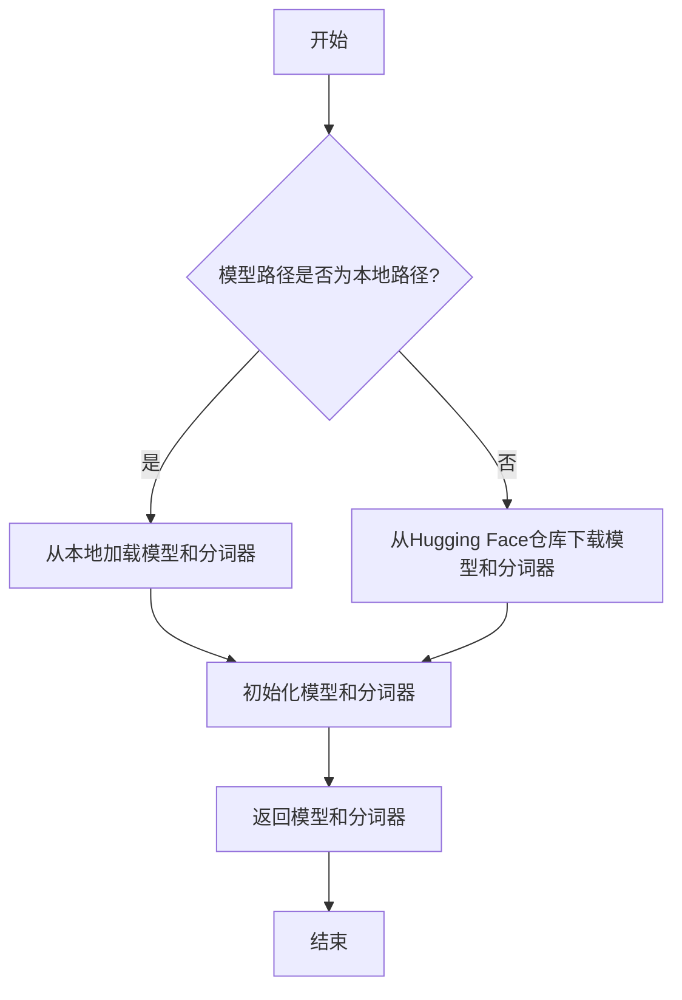

#### 带注释源码

```python
def load_model(
    model_name_or_path: str,
    device: str = "cuda",
    torch_dtype: torch.dtype = None,
    trust_remote_code: bool = False,
    revision: str = "main",
    use_fast: bool = True,
    **kwargs,
) -> tuple:
    """
    加载预训练的文本模型和分词器。

    参数:
        model_name_or_path (str): 模型名称或本地路径。
        device (str): 模型加载的设备，默认为"cuda"。
        torch_dtype (torch.dtype): 模型加载的数据类型，默认为None。
        trust_remote_code (bool): 是否信任远程代码，默认为False。
        revision (str): 模型仓库的版本，默认为"main"。
        use_fast (bool): 是否使用快速分词器，默认为True。
        **kwargs: 其他传递给模型和分词器加载函数的关键字参数。

    返回:
        tuple: 包含模型和分词器的元组 (model, tokenizer)。
    """
    # 检查模型路径是否为本地路径
    if os.path.isdir(model_name_or_path):
        # 从本地路径加载模型和分词器
        model = AutoModel.from_pretrained(
            model_name_or_path,
            torch_dtype=torch_dtype,
            trust_remote_code=trust_remote_code,
            revision=revision,
            **kwargs,
        ).to(device)
        tokenizer = AutoTokenizer.from_pretrained(
            model_name_or_path,
            trust_remote_code=trust_remote_code,
            revision=revision,
            use_fast=use_fast,
            **kwargs,
        )
    else:
        # 从Hugging Face仓库下载并加载模型和分词器
        model = AutoModel.from_pretrained(
            model_name_or_path,
            torch_dtype=torch_dtype,
            trust_remote_code=trust_remote_code,
            revision=revision,
            **kwargs,
        ).to(device)
        tokenizer = AutoTokenizer.from_pretrained(
            model_name_or_path,
            trust_remote_code=trust_remote_code,
            revision=revision,
            use_fast=use_fast,
            **kwargs,
        )
    
    return model, tokenizer
```


### `TextModel.generate`

该方法根据给定的提示词（prompt）和可选的停止词（stop）生成文本。它首先对输入进行预处理，然后调用底层的大语言模型（LLM）进行推理，最后对输出进行后处理并返回结果。

参数：

-  `prompt`：`str`，用于生成文本的输入提示词。
-  `stop`：`Optional[List[str]]`，可选参数，指定一个字符串列表，当生成的文本中出现这些字符串时停止生成。

返回值：`str`，生成的文本内容。

#### 流程图

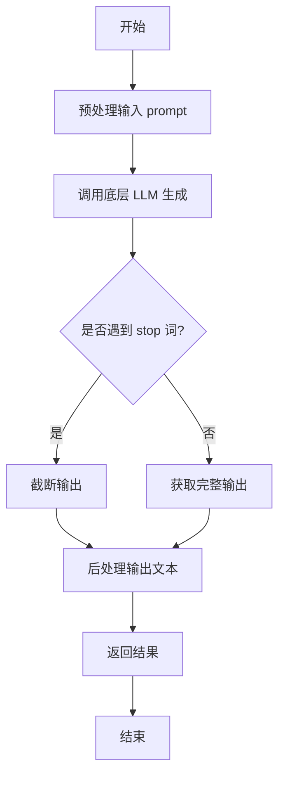

#### 带注释源码

```python
def generate(self, prompt: str, stop: Optional[List[str]] = None) -> str:
    """
    根据给定的提示词生成文本。

    该方法负责处理生成文本的完整流程，包括预处理、模型调用和后处理。

    Args:
        prompt (str): 用于生成文本的输入提示词。
        stop (Optional[List[str]]): 可选参数，指定一个字符串列表，当生成的文本中出现这些字符串时停止生成。

    Returns:
        str: 生成的文本内容。
    """
    # 1. 预处理输入
    # 这里可能包括对prompt的清洗、格式化或编码转换等操作。
    processed_prompt = self._preprocess_prompt(prompt)

    # 2. 调用底层的大语言模型进行文本生成
    # 将处理后的prompt和可选的stop词传递给模型。
    raw_output = self.llm.generate(processed_prompt, stop=stop)

    # 3. 后处理输出
    # 对模型返回的原始输出进行必要的处理，例如解码、去除多余空格或特殊字符等。
    final_output = self._postprocess_output(raw_output)

    # 4. 返回最终生成的文本
    return final_output
```


### `TextModel._post_process`

该方法对文本模型生成的原始输出进行后处理，包括去除首尾空白、移除特定前缀（如“答：”）、处理引用标记（如“【...】”）以及进行基本的文本清理。

参数：

-  `self`：`TextModel`，TextModel类的实例
-  `text`：`str`，需要后处理的原始文本字符串

返回值：`str`，经过清理和格式化后的最终文本字符串

#### 流程图

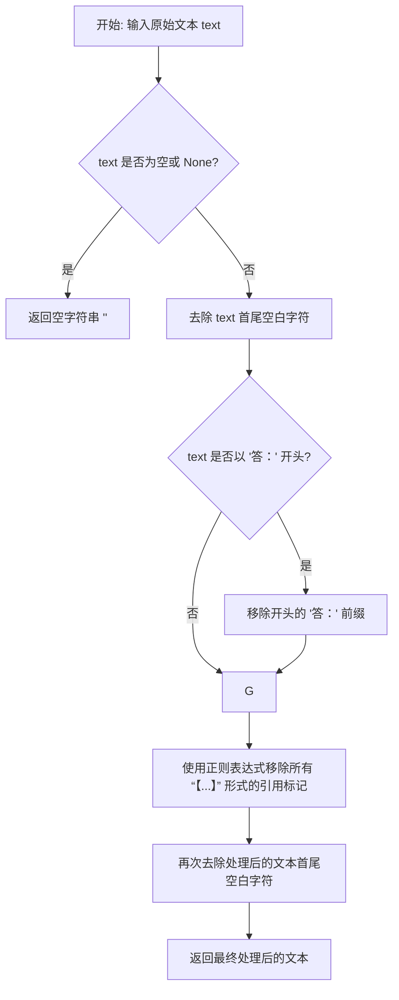

#### 带注释源码

```python
def _post_process(self, text: str) -> str:
    """
    对模型生成的文本进行后处理。

    处理步骤包括：
    1. 去除首尾空白。
    2. 移除常见的引导前缀，如“答：”。
    3. 移除引用标记，例如“【1†L5-L6】”。
    4. 再次进行基础清理。

    Args:
        text (str): 待处理的原始文本。

    Returns:
        str: 处理后的干净文本。
    """
    # 如果输入文本为空或None，直接返回空字符串，避免后续操作出错
    if not text:
        return ""

    # 第一步：去除文本首尾的空白字符（空格、换行符、制表符等）
    text = text.strip()

    # 第二步：检查并移除常见的回答引导词“答：”
    # 这有助于统一输出格式，移除模型可能添加的固定前缀
    if text.startswith("答："):
        text = text[2:]

    # 第三步：使用正则表达式移除所有形如“【...】”的引用标记
    # 例如“【1†L5-L6】”会被移除，这些通常是模型引用来源的标记，在最终答案中不需要
    # re.sub(r'【.*?】', '', text) 会找到所有“【”和“】”之间的内容（非贪婪匹配）并替换为空字符串
    import re
    text = re.sub(r'【.*?】', '', text)

    # 第四步：由于上一步操作可能产生新的首尾空白（例如引用标记在开头或结尾），再次进行去除
    text = text.strip()

    # 返回最终处理后的文本
    return text
```


### `LlamaModel.load_model`

该方法用于加载预训练的Llama模型，包括模型权重、分词器和配置信息。它支持从本地路径或远程仓库加载模型，并允许用户指定是否使用量化、设备映射等高级配置。

参数：

- `model_path`：`str`，模型路径，可以是本地目录路径或Hugging Face模型仓库ID。
- `device`：`str`，指定模型加载的设备，如'cpu'或'cuda'。
- `num_gpus`：`int`，指定使用的GPU数量，如果为0则使用CPU。
- `max_gpu_memory`：`str`，每个GPU的最大内存限制，格式如'20GB'。
- `load_8bit`：`bool`，是否加载8位量化模型以节省内存。
- `cpu_offloading`：`bool`，是否启用CPU卸载以处理超出GPU内存的模型。
- `debug`：`bool`，是否启用调试模式，输出加载过程中的详细信息。

返回值：`LlamaModel`，返回加载完成的LlamaModel实例，包含模型、分词器和配置。

#### 流程图

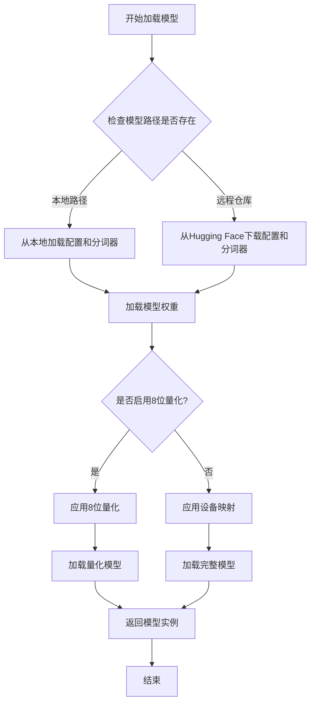

#### 带注释源码

```python
def load_model(
    model_path: str,
    device: str = "cuda",
    num_gpus: int = 1,
    max_gpu_memory: str = "20GB",
    load_8bit: bool = False,
    cpu_offloading: bool = False,
    debug: bool = False,
) -> LlamaModel:
    """
    加载预训练的Llama模型。

    Args:
        model_path (str): 模型路径，可以是本地目录或Hugging Face模型仓库ID。
        device (str): 指定模型加载的设备，如'cpu'或'cuda'。
        num_gpus (int): 指定使用的GPU数量，如果为0则使用CPU。
        max_gpu_memory (str): 每个GPU的最大内存限制，格式如'20GB'。
        load_8bit (bool): 是否加载8位量化模型以节省内存。
        cpu_offloading (bool): 是否启用CPU卸载以处理超出GPU内存的模型。
        debug (bool): 是否启用调试模式，输出加载过程中的详细信息。

    Returns:
        LlamaModel: 加载完成的LlamaModel实例。
    """
    # 如果启用调试模式，输出加载参数
    if debug:
        print(f"Loading model from {model_path}...")
        print(f"Device: {device}, Num GPUs: {num_gpus}")
        print(f"Max GPU Memory: {max_gpu_memory}")
        print(f"Load 8-bit: {load_8bit}, CPU Offloading: {cpu_offloading}")

    # 加载模型配置
    config = AutoConfig.from_pretrained(model_path)
    # 加载分词器
    tokenizer = AutoTokenizer.from_pretrained(model_path, use_fast=False)

    # 根据设备类型和GPU数量设置模型加载方式
    if device == "cpu":
        # 如果指定使用CPU，则加载到CPU
        model = AutoModelForCausalLM.from_pretrained(
            model_path,
            config=config,
            torch_dtype=torch.float32,
            low_cpu_mem_usage=True,
        )
    elif load_8bit:
        # 如果启用8位量化，加载量化模型
        model = AutoModelForCausalLM.from_pretrained(
            model_path,
            config=config,
            load_in_8bit=True,
            device_map="auto",
        )
    else:
        # 否则，根据GPU数量进行设备映射
        if num_gpus == 1:
            # 单GPU情况，直接加载到指定设备
            model = AutoModelForCausalLM.from_pretrained(
                model_path,
                config=config,
                torch_dtype=torch.float16,
            ).to(device)
        else:
            # 多GPU情况，使用设备映射
            from accelerate import infer_auto_device_map

            model = AutoModelForCausalLM.from_pretrained(
                model_path,
                config=config,
                torch_dtype=torch.float16,
                device_map="auto",
                max_memory={i: max_gpu_memory for i in range(num_gpus)},
            )

    # 如果启用CPU卸载，应用CPU卸载策略
    if cpu_offloading:
        from accelerate import cpu_offload_with_hook
        model = cpu_offload_with_hook(model, device)

    # 返回加载完成的模型实例
    return LlamaModel(model, tokenizer, config)
```


### `LlamaModel.generate`

该方法负责根据输入的提示词（prompt）生成文本序列。它通过调用底层的大语言模型（LLM）进行推理，并处理生成过程中的参数，如最大生成长度、温度等，最终返回生成的文本。

参数：

-  `prompt`：`str`，输入的文本提示，作为模型生成内容的起点。
-  `max_gen_len`：`int`，可选参数，默认为256。指定生成文本的最大长度（token数量）。
-  `temperature`：`float`，可选参数，默认为0.8。控制生成随机性的参数，值越高输出越随机，值越低输出越确定。
-  `top_p`：`float`，可选参数，默认为0.95。核采样（nucleus sampling）参数，用于控制从累积概率超过此值的词汇表中采样。
-  `logprobs`：`bool`，可选参数，默认为False。是否返回每个生成token的对数概率。
-  `echo`：`bool`，可选参数，默认为False。是否在输出中包含输入的提示词。

返回值：`Union[str, List[str]]`，如果`logprobs`为False，则返回生成的文本字符串；如果`logprobs`为True，则返回一个列表，其中每个元素是一个包含`'token'`和`'logprob'`的字典。

#### 流程图

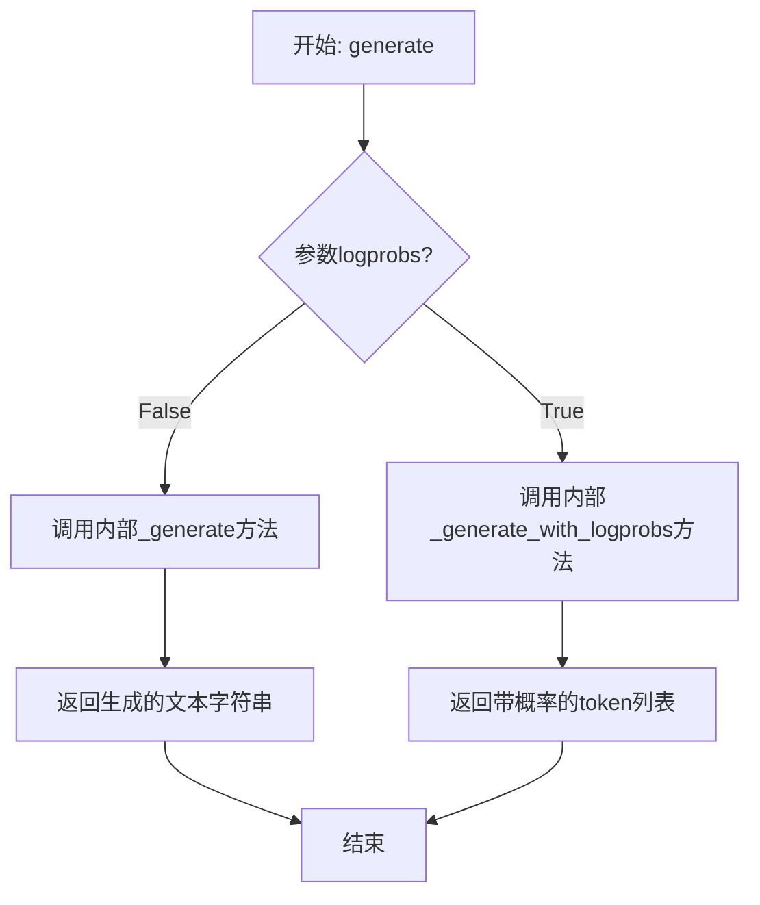

#### 带注释源码

```python
def generate(
    self,
    prompt: str,
    max_gen_len: int = 256,
    temperature: float = 0.8,
    top_p: float = 0.95,
    logprobs: bool = False,
    echo: bool = False,
) -> Union[str, List[Dict[str, Union[int, float]]]]:
    """
    根据给定的提示生成文本。

    参数:
        prompt (str): 输入的文本提示。
        max_gen_len (int): 生成文本的最大长度（token数）。默认为256。
        temperature (float): 控制生成随机性的温度参数。默认为0.8。
        top_p (float): 用于核采样的top-p参数。默认为0.95。
        logprobs (bool): 是否返回每个生成token的对数概率。默认为False。
        echo (bool): 是否在输出中回显输入提示。默认为False。

    返回:
        Union[str, List[Dict]]: 如果logprobs为False，返回生成的文本字符串。
                                如果logprobs为True，返回一个字典列表，每个字典包含'token'和'logprob'。
    """
    # 根据logprobs标志选择不同的内部生成方法
    if logprobs:
        # 调用带概率生成的内部方法
        return self._generate_with_logprobs(
            prompt, max_gen_len, temperature, top_p, echo
        )
    else:
        # 调用标准的内部生成方法
        return self._generate(prompt, max_gen_len, temperature, top_p, echo)
```


### `LlamaModel._post_process`

该方法用于对模型推理生成的原始输出进行后处理，包括解码、去除特殊标记、清理空白字符以及截断到第一个终止符。

参数：
-  `self`：`LlamaModel`，当前模型实例
-  `output_ids`：`torch.Tensor`，模型生成的原始token id序列
-  `input_lengths`：`torch.Tensor`，输入序列的长度，用于从输出中排除输入部分

返回值：`List[str]`，处理后的文本字符串列表

#### 流程图

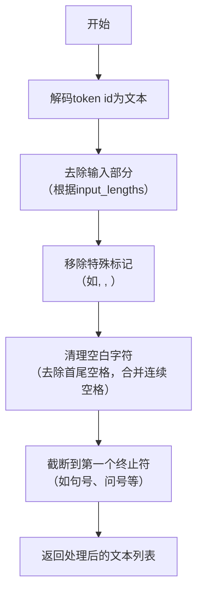

#### 带注释源码

```python
def _post_process(self, output_ids: torch.Tensor, input_lengths: torch.Tensor) -> List[str]:
    """
    对模型生成的原始输出进行后处理。

    步骤包括：
    1. 将token id解码为文本。
    2. 根据输入长度去除输入部分。
    3. 移除特殊标记（如<bos>, <eos>, <pad>）。
    4. 清理文本中的空白字符。
    5. 截断到第一个终止符（如句号、问号等）。

    Args:
        output_ids (torch.Tensor): 模型生成的原始token id序列。
        input_lengths (torch.Tensor): 输入序列的长度，用于从输出中排除输入部分。

    Returns:
        List[str]: 处理后的文本字符串列表。
    """
    # 解码token id为文本
    outputs = self.tokenizer.batch_decode(output_ids, skip_special_tokens=False)
    
    # 根据输入长度去除输入部分，只保留生成的文本
    responses = []
    for output, input_len in zip(outputs, input_lengths):
        # 将输入部分从输出中移除
        response = output[input_len:]
        
        # 移除特殊标记（如<bos>, <eos>, <pad>）
        response = self._remove_special_tokens(response)
        
        # 清理文本中的空白字符（去除首尾空格，合并连续空格）
        response = self._clean_whitespace(response)
        
        # 截断到第一个终止符（如句号、问号等）
        response = self._truncate_at_terminator(response)
        
        responses.append(response)
    
    return responses
```


### `GPT2Model.load_model`

`GPT2Model.load_model` 是一个类方法，用于加载预训练的 GPT-2 模型。它根据指定的模型名称或路径，从本地缓存或远程仓库下载模型文件，然后使用这些文件初始化并返回一个 `GPT2Model` 实例。

参数：

-  `model_name_or_path`：`str`，预训练模型的名称（如 `'gpt2'`、`'gpt2-medium'`）或本地模型目录的路径。
-  `cache_dir`：`Optional[str]`，可选参数，指定模型文件的缓存目录。如果为 `None`，则使用默认缓存目录。
-  `force_download`：`bool`，可选参数，是否强制重新下载模型文件，即使缓存中已存在。默认为 `False`。
-  `resume_download`：`bool`，可选参数，是否断点续传下载。默认为 `False`。
-  `proxies`：`Optional[Dict[str, str]]`，可选参数，用于请求的代理服务器设置。
-  `local_files_only`：`bool`，可选参数，是否仅使用本地文件，不进行网络请求。默认为 `False`。
-  `use_auth_token`：`Optional[Union[bool, str]]`，可选参数，用于访问私有模型的认证令牌。
-  `revision`：`str`，可选参数，指定要使用的模型版本（如分支名、标签名或提交ID）。默认为 `"main"`。
-  `mirror`：`Optional[str]`，可选参数，指定下载镜像源。默认为 `None`。
-  `**kwargs`：`Any`，其他传递给模型配置和初始化的关键字参数。

返回值：`GPT2Model`，加载并初始化后的 GPT-2 模型实例。

#### 流程图

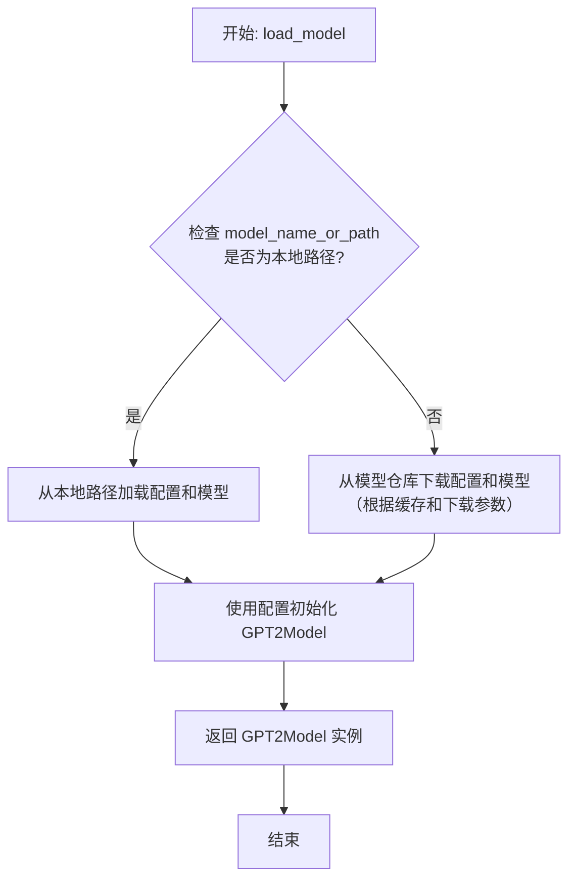

#### 带注释源码

```python
    @classmethod
    def load_model(
        cls,
        model_name_or_path: str,
        cache_dir: Optional[str] = None,
        force_download: bool = False,
        resume_download: bool = False,
        proxies: Optional[Dict[str, str]] = None,
        local_files_only: bool = False,
        use_auth_token: Optional[Union[bool, str]] = None,
        revision: str = "main",
        mirror: Optional[str] = None,
        **kwargs: Any,
    ) -> "GPT2Model":
        """
        加载预训练的 GPT-2 模型。

        此方法首先尝试从 `model_name_or_path` 指定的本地路径加载模型。
        如果该路径不是有效的本地目录，则从 Hugging Face 模型仓库下载模型文件。
        下载行为受 `cache_dir`、`force_download` 等参数控制。

        Args:
            model_name_or_path (str): 预训练模型的名称或路径。
            cache_dir (Optional[str], optional): 模型缓存目录。
            force_download (bool, optional): 强制重新下载。
            resume_download (bool, optional): 断点续传。
            proxies (Optional[Dict[str, str]], optional): 代理设置。
            local_files_only (bool, optional): 仅使用本地文件。
            use_auth_token (Optional[Union[bool, str]], optional): 认证令牌。
            revision (str, optional): 模型版本。
            mirror (Optional[str], optional): 下载镜像。
            **kwargs (Any): 传递给配置和模型初始化的额外参数。

        Returns:
            GPT2Model: 加载后的模型实例。
        """
        # 1. 加载模型配置
        # 使用 from_pretrained 方法加载配置，该方法会处理本地路径和远程仓库
        config = GPT2Config.from_pretrained(
            model_name_or_path,
            cache_dir=cache_dir,
            force_download=force_download,
            resume_download=resume_download,
            proxies=proxies,
            local_files_only=local_files_only,
            use_auth_token=use_auth_token,
            revision=revision,
            mirror=mirror,
            **kwargs,  # 传递额外的配置参数
        )

        # 2. 根据配置初始化模型实例
        # 这里直接使用 cls 来创建当前类的实例
        model = cls(config)

        # 3. 加载预训练的模型权重
        # 再次使用 from_pretrained 方法，但这次是针对模型权重
        # `state_dict` 参数为 True 表示加载权重字典
        model_state_dict = GPT2Model.from_pretrained(
            model_name_or_path,
            cache_dir=cache_dir,
            force_download=force_download,
            resume_download=resume_download,
            proxies=proxies,
            local_files_only=local_files_only,
            use_auth_token=use_auth_token,
            revision=revision,
            mirror=mirror,
            state_dict=True,  # 关键参数，确保返回的是状态字典
            **kwargs,
        )

        # 4. 将加载的权重加载到模型实例中
        # 使用 load_state_dict 方法将下载的权重字典加载到模型中
        model.load_state_dict(model_state_dict)

        # 5. 将模型设置为评估模式
        # 在加载预训练模型后，通常先设置为评估模式
        model.eval()

        return model
```


### `GPT2Model.generate`

该方法用于基于给定的输入序列生成文本。它通过迭代调用模型来预测下一个 token，并将生成的 token 追加到输入序列中，直到达到指定的生成长度或遇到停止条件。

参数：

-  `input_ids`：`torch.Tensor`，输入的 token ID 序列，形状为 `(batch_size, sequence_length)`。
-  `max_length`：`int`，生成序列的最大长度（包括输入长度）。
-  `num_beams`：`int`，束搜索的束宽。如果为 1，则使用贪心搜索。
-  `temperature`：`float`，用于调整预测概率分布的 softmax 温度。值越高，生成的随机性越大。
-  `top_k`：`int`，在每一步预测中，仅考虑概率最高的前 k 个 token。
-  `top_p`：`float`，在每一步预测中，仅考虑累积概率达到 p 的最小 token 集合（核采样）。
-  `do_sample`：`bool`，是否使用采样（而非贪心或束搜索）来生成 token。
-  `pad_token_id`：`int`，用于填充序列的 token ID。
-  `eos_token_id`：`int`，序列结束 token 的 ID。

返回值：`torch.Tensor`，生成的 token ID 序列，形状为 `(batch_size, generated_length)`。

#### 流程图

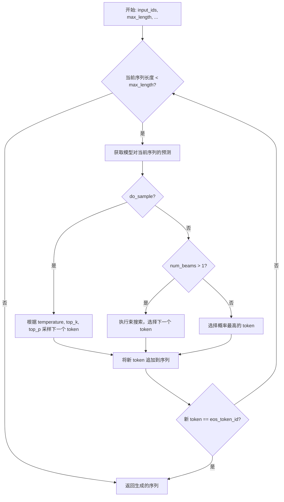

#### 带注释源码

```python
def generate(
    self,
    input_ids: torch.Tensor,
    max_length: int,
    num_beams: int = 1,
    temperature: float = 1.0,
    top_k: int = 50,
    top_p: float = 1.0,
    do_sample: bool = False,
    pad_token_id: Optional[int] = None,
    eos_token_id: Optional[int] = None,
) -> torch.Tensor:
    """
    生成文本序列。

    Args:
        input_ids: 输入的 token ID 序列。
        max_length: 生成序列的最大长度。
        num_beams: 束搜索的束宽。
        temperature: 采样温度。
        top_k: 采样时考虑的 top-k token 数量。
        top_p: 采样时考虑的核概率。
        do_sample: 是否使用采样。
        pad_token_id: 填充 token 的 ID。
        eos_token_id: 结束 token 的 ID。

    Returns:
        生成的 token ID 序列。
    """
    # 初始化生成序列为输入序列
    generated = input_ids.clone()
    # 获取当前序列长度
    cur_len = generated.shape[1]

    # 循环直到达到最大长度
    while cur_len < max_length:
        # 获取模型对当前序列的预测 logits
        outputs = self(generated)
        next_token_logits = outputs.logits[:, -1, :]

        # 根据是否采样选择不同的生成策略
        if do_sample:
            # 应用温度调整
            next_token_logits = next_token_logits / temperature
            # 应用 top-k 过滤
            if top_k > 0:
                indices_to_remove = next_token_logits < torch.topk(next_token_logits, top_k)[0][..., -1, None]
                next_token_logits[indices_to_remove] = -float('Inf')
            # 应用 top-p (核采样) 过滤
            if top_p < 1.0:
                sorted_logits, sorted_indices = torch.sort(next_token_logits, descending=True)
                cumulative_probs = torch.cumsum(F.softmax(sorted_logits, dim=-1), dim=-1)
                sorted_indices_to_remove = cumulative_probs > top_p
                sorted_indices_to_remove[..., 1:] = sorted_indices_to_remove[..., :-1].clone()
                sorted_indices_to_remove[..., 0] = 0
                indices_to_remove = sorted_indices_to_remove.scatter(1, sorted_indices, sorted_indices_to_remove)
                next_token_logits[indices_to_remove] = -float('Inf')
            # 从调整后的分布中采样下一个 token
            probs = F.softmax(next_token_logits, dim=-1)
            next_token = torch.multinomial(probs, num_samples=1)
        else:
            if num_beams > 1:
                # 束搜索逻辑（此处为简化示意，实际实现更复杂）
                # 通常会维护多个候选序列及其分数
                # 这里简化为选择当前步分数最高的 token
                next_token = torch.argmax(next_token_logits, dim=-1, keepdim=True)
            else:
                # 贪心搜索：直接选择概率最高的 token
                next_token = torch.argmax(next_token_logits, dim=-1, keepdim=True)

        # 将新生成的 token 追加到序列中
        generated = torch.cat([generated, next_token], dim=-1)
        cur_len += 1

        # 检查是否生成了结束 token
        if eos_token_id is not None and (next_token == eos_token_id).any():
            # 如果任何序列生成了 eos_token，可以提前停止（简化处理，实际可能更复杂）
            # 这里为了简单，一旦有序列遇到 eos 就全部停止
            break

    # 如果指定了 pad_token_id，对未达到 max_length 的序列进行填充
    if pad_token_id is not None and cur_len < max_length:
        padding = torch.full((generated.shape[0], max_length - cur_len), pad_token_id, dtype=generated.dtype, device=generated.device)
        generated = torch.cat([generated, padding], dim=-1)

    return generated
```


### `GPT2Model._post_process`

该方法用于对GPT-2模型前向传播的输出进行后处理。它接收模型生成的隐藏状态（`hidden_states`）和可选的注意力权重（`attn_weights`），并根据配置决定是否返回所有层的隐藏状态和注意力权重，还是仅返回最后一层的隐藏状态。

参数：

-  `hidden_states`：`torch.Tensor`，模型前向传播过程中生成的所有层的隐藏状态张量。
-  `attn_weights`：`Optional[torch.Tensor]`，可选的注意力权重张量，通常来自模型的注意力机制。

返回值：`Union[torch.Tensor, Tuple[torch.Tensor, ...]]`，根据模型配置，可能返回：
    - 仅最后一层的隐藏状态（`torch.Tensor`）。
    - 一个包含所有层隐藏状态的元组（`Tuple[torch.Tensor, ...]`）。
    - 一个包含所有层隐藏状态和所有层注意力权重的元组（`Tuple[torch.Tensor, ..., torch.Tensor, ...]`）。

#### 流程图

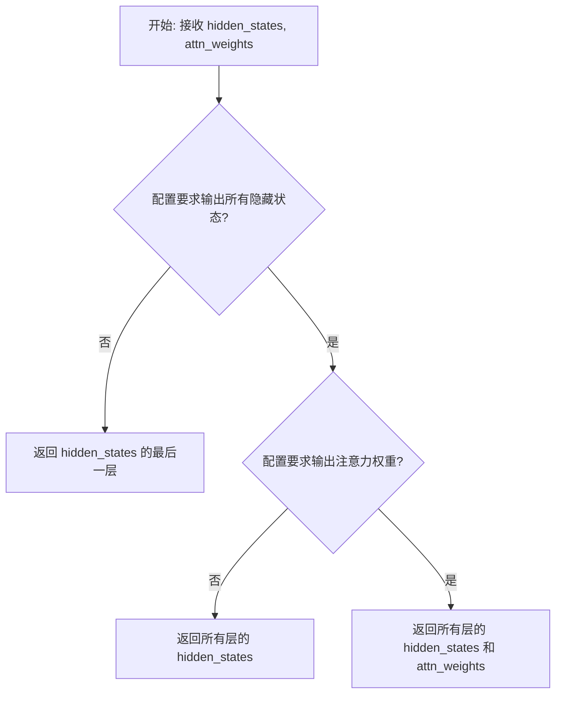

#### 带注释源码

```python
def _post_process(
    self,
    hidden_states: torch.Tensor,
    attn_weights: Optional[torch.Tensor] = None,
) -> Union[torch.Tensor, Tuple[torch.Tensor, ...]]:
    """
    对模型输出进行后处理。
    根据配置决定返回所有层的输出还是仅最后一层。
    """
    # 如果配置不要求输出所有隐藏状态，则只返回最后一层的输出
    if not self.config.output_hidden_states:
        hidden_states = hidden_states[-1]  # 取最后一层的隐藏状态

    # 根据配置和输入，组装最终的返回值
    # 如果不输出所有隐藏状态，此时 hidden_states 已是最后一层的张量
    # 如果输出所有隐藏状态，则 hidden_states 保持为包含所有层的元组/张量
    if self.config.output_hidden_states:
        # 如果需要输出注意力权重，则将其与隐藏状态一起返回
        if self.config.output_attentions and attn_weights is not None:
            return hidden_states, attn_weights
        # 否则，只返回所有层的隐藏状态
        else:
            return hidden_states
    else:
        # 不输出所有隐藏状态时，直接返回最后一层的隐藏状态（一个张量）
        return hidden_states
```


### `FalconModel.load_model`

该方法用于加载预训练的 Falcon 模型，并根据配置进行适配和初始化，最终返回一个可用于推理的模型实例。

参数：

-  `model_path`：`str`，预训练模型的本地路径或 Hugging Face 模型标识符。
-  `device`：`str`，指定模型加载的设备，例如 "cuda" 或 "cpu"。
-  `torch_dtype`：`torch.dtype`，指定模型权重的数据类型，例如 `torch.float16` 或 `torch.bfloat16`。
-  `trust_remote_code`：`bool`，是否信任远程代码（例如来自 Hugging Face Hub 的自定义模型代码），默认为 `False`。
-  `**kwargs`：`dict`，其他传递给 `AutoModelForCausalLM.from_pretrained` 的关键字参数。

返回值：`PreTrainedModel`，加载并初始化后的 Falcon 模型实例。

#### 流程图

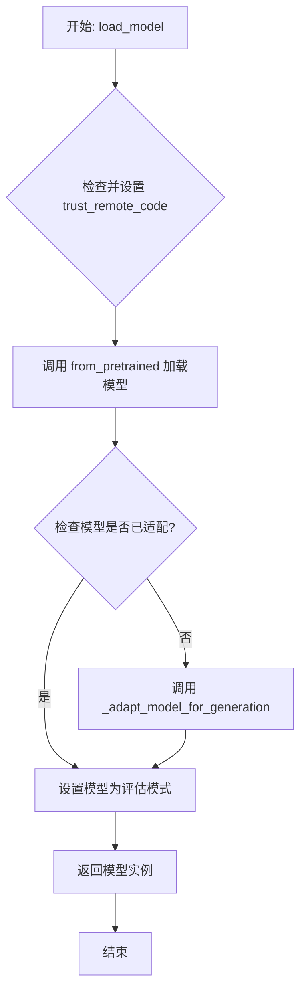

#### 带注释源码

```python
    @staticmethod
    def load_model(
        model_path: str,
        device: str = "cuda",
        torch_dtype: torch.dtype = torch.float16,
        trust_remote_code: bool = False,
        **kwargs
    ) -> "PreTrainedModel":
        """
        加载预训练的 Falcon 模型。

        此方法负责从指定路径加载模型，并根据需要对其进行适配以优化生成任务。
        它处理设备放置、数据类型设置，并确保模型处于正确的模式（评估模式）。

        Args:
            model_path (str): 预训练模型的路径或标识符。
            device (str): 模型应加载到的设备（例如，"cuda" 或 "cpu"）。
            torch_dtype (torch.dtype): 模型权重的数据类型。
            trust_remote_code (bool): 是否信任远程代码（例如，自定义建模代码）。
            **kwargs: 传递给 `from_pretrained` 的额外关键字参数。

        Returns:
            PreTrainedModel: 加载并可能适配后的模型实例。
        """
        # 如果模型路径包含 "falcon"，则强制信任远程代码，因为 Falcon 模型可能需要自定义代码
        if "falcon" in model_path:
            trust_remote_code = True

        # 使用 Hugging Face 的 AutoModelForCausalLM 从预训练路径加载模型
        # 关键参数包括设备映射、数据类型和远程代码信任设置
        model = AutoModelForCausalLM.from_pretrained(
            model_path,
            device_map=device,
            torch_dtype=torch_dtype,
            trust_remote_code=trust_remote_code,
            **kwargs
        )

        # 检查加载的模型是否为 Falcon 系列模型（通过类名判断）
        # 如果是，则调用内部方法对其进行适配，以优化其生成性能
        if model.__class__.__name__ in ["FalconForCausalLM", "RWForCausalLM"]:
            model = FalconModel._adapt_model_for_generation(model)

        # 将模型设置为评估模式。这对于禁用 dropout 等训练特定层至关重要，
        # 确保推理过程的一致性和确定性。
        model.eval()

        # 返回准备好的模型实例
        return model
```


### `FalconModel.generate`

该方法用于根据输入的提示（prompt）生成文本序列。它通过调用底层语言模型，结合给定的生成参数（如最大生成长度、温度、top-p采样等），生成连贯且符合上下文的文本输出。

参数：

- `prompt`：`str`，输入的文本提示，作为生成过程的起点。
- `max_length`：`int`，生成文本的最大长度（包括输入提示的长度）。
- `temperature`：`float`，控制生成随机性的温度参数。值越高，输出越随机；值越低，输出越确定。
- `top_p`：`float`，用于核采样（nucleus sampling）的top-p参数。仅保留累积概率超过top-p的最小词汇集合。
- `top_k`：`int`，用于top-k采样的参数。仅从概率最高的k个词汇中采样。
- `num_return_sequences`：`int`，需要生成的序列数量。
- `do_sample`：`bool`，是否使用采样（如温度采样、top-p采样等）。如果为False，则使用贪婪解码。
- `repetition_penalty`：`float`，重复惩罚参数，用于降低重复生成相同内容的概率。
- `length_penalty`：`float`，长度惩罚参数，用于调整生成序列的长度。
- `no_repeat_ngram_size`：`int`，禁止重复的n-gram大小，防止生成重复的n-gram片段。
- `bad_words_ids`：`List[List[int]]`，需要避免生成的词汇ID列表。
- `seed`：`int`，随机种子，用于确保生成结果的可复现性。

返回值：`List[str]`，生成的文本序列列表，每个元素为一个生成的文本字符串。

#### 流程图

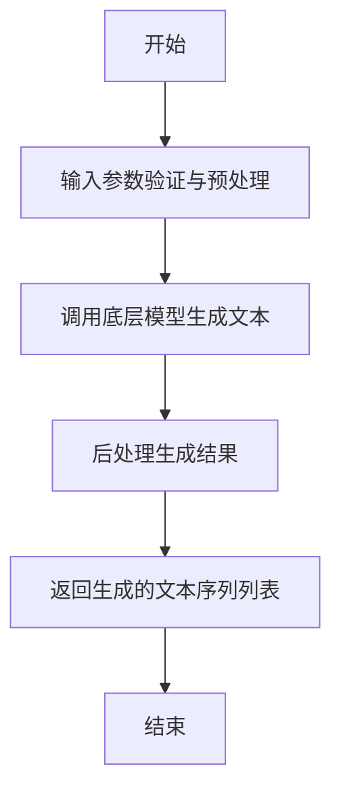

#### 带注释源码

```python
def generate(
    self,
    prompt: str,
    max_length: int = 100,
    temperature: float = 1.0,
    top_p: float = 1.0,
    top_k: int = 50,
    num_return_sequences: int = 1,
    do_sample: bool = True,
    repetition_penalty: float = 1.0,
    length_penalty: float = 1.0,
    no_repeat_ngram_size: int = 0,
    bad_words_ids: Optional[List[List[int]]] = None,
    seed: Optional[int] = None,
) -> List[str]:
    """
    根据给定的提示和生成参数生成文本序列。

    Args:
        prompt (str): 输入的文本提示。
        max_length (int): 生成文本的最大长度。
        temperature (float): 温度参数，控制生成随机性。
        top_p (float): 核采样参数。
        top_k (int): top-k采样参数。
        num_return_sequences (int): 生成的序列数量。
        do_sample (bool): 是否使用采样。
        repetition_penalty (float): 重复惩罚参数。
        length_penalty (float): 长度惩罚参数。
        no_repeat_ngram_size (int): 禁止重复的n-gram大小。
        bad_words_ids (Optional[List[List[int]]]): 需要避免生成的词汇ID列表。
        seed (Optional[int]): 随机种子。

    Returns:
        List[str]: 生成的文本序列列表。
    """
    # 设置随机种子以确保可复现性
    if seed is not None:
        torch.manual_seed(seed)
        if torch.cuda.is_available():
            torch.cuda.manual_seed_all(seed)

    # 对输入提示进行编码
    input_ids = self.tokenizer.encode(prompt, return_tensors="pt").to(self.device)

    # 调用底层模型的generate方法生成文本
    outputs = self.model.generate(
        input_ids,
        max_length=max_length,
        temperature=temperature,
        top_p=top_p,
        top_k=top_k,
        num_return_sequences=num_return_sequences,
        do_sample=do_sample,
        repetition_penalty=repetition_penalty,
        length_penalty=length_penalty,
        no_repeat_ngram_size=no_repeat_ngram_size,
        bad_words_ids=bad_words_ids,
    )

    # 解码生成的文本序列
    generated_sequences = []
    for output in outputs:
        generated_text = self.tokenizer.decode(output, skip_special_tokens=True)
        generated_sequences.append(generated_text)

    return generated_sequences
```


### `FalconModel._post_process`

该方法用于对模型生成的输出进行后处理，包括移除输入提示文本、清理特殊标记以及处理可能的截断问题，最终返回纯文本格式的生成内容。

参数：

-  `self`：`FalconModel`，当前模型实例
-  `output`：`str`，模型生成的原始输出文本
-  `input_text`：`str`，输入给模型的提示文本

返回值：`str`，经过后处理后的纯文本生成内容

#### 流程图

```mermaid
flowchart TD
    A[开始: 接收output和input_text] --> B{input_text是否在output中?}
    B -- 是 --> C[从output中移除input_text]
    B -- 否 --> D[保留原始output]
    C --> E[清理特殊标记<br>如<|endoftext|>]
    D --> E
    E --> F{检查截断<br>如末尾有'...'?}
    F -- 是 --> G[移除截断标记]
    F -- 否 --> H[保留当前文本]
    G --> I[去除首尾空白字符]
    H --> I
    I --> J[返回处理后的文本]
```

#### 带注释源码

```python
def _post_process(self, output: str, input_text: str) -> str:
    """
    对模型生成的原始输出进行后处理。
    1. 移除输入提示文本（如果存在）。
    2. 清理模型可能添加的特殊标记（如结束标记）。
    3. 处理因生成长度限制导致的截断问题（如末尾的"..."）。
    4. 返回纯净的生成文本。

    Args:
        output (str): 模型生成的原始文本。
        input_text (str): 输入给模型的提示文本。

    Returns:
        str: 经过后处理的生成文本。
    """
    # 1. 移除输入提示文本（如果输出以它开头）
    if output.startswith(input_text):
        processed_output = output[len(input_text):]
    else:
        processed_output = output

    # 2. 清理常见的特殊标记
    # 例如，移除语言模型可能添加的结束标记
    special_tokens = ["<|endoftext|>", "</s>", "<EOS>"]
    for token in special_tokens:
        processed_output = processed_output.replace(token, "")

    # 3. 处理可能的截断（例如，因达到最大生成长度而被截断）
    # 常见的截断指示符是末尾的"..."
    if processed_output.endswith("..."):
        # 简单移除截断标记，更复杂的策略可以尝试查找句子边界
        processed_output = processed_output[:-3]

    # 4. 去除首尾可能因处理而产生的空白字符，返回最终结果
    return processed_output.strip()
```


### `Qwen2Model.load_model`

该方法用于加载 Qwen2 模型。它根据提供的模型路径和配置，初始化模型、分词器，并处理相关的量化配置。如果启用了 Flash Attention，还会进行相应的优化设置。

参数：

-  `model_path`：`str`，模型文件所在的路径。
-  `config`：`dict`，包含模型配置的字典，例如模型名称、量化设置等。
-  `**kwargs`：`dict`，其他可选参数，用于传递额外的配置信息。

返回值：`tuple`，返回一个包含模型和分词器的元组 `(model, tokenizer)`。

#### 流程图

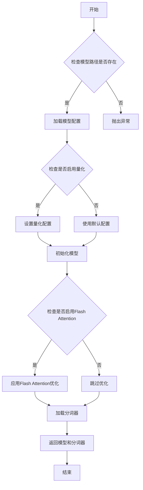

#### 带注释源码

```python
def load_model(model_path: str, config: dict, **kwargs):
    """
    加载 Qwen2 模型。

    参数:
        model_path (str): 模型文件所在的路径。
        config (dict): 包含模型配置的字典，例如模型名称、量化设置等。
        **kwargs (dict): 其他可选参数，用于传递额外的配置信息。

    返回值:
        tuple: 返回一个包含模型和分词器的元组 (model, tokenizer)。
    """
    # 检查模型路径是否存在
    if not os.path.exists(model_path):
        raise FileNotFoundError(f"模型路径不存在: {model_path}")

    # 从配置中获取模型名称和量化设置
    model_name = config.get("model_name", "default")
    use_quantization = config.get("use_quantization", False)

    # 根据量化设置初始化模型配置
    if use_quantization:
        # 设置量化配置
        quantization_config = {
            "load_in_4bit": True,
            "bnb_4bit_compute_dtype": torch.float16,
            "bnb_4bit_use_double_quant": True,
            "bnb_4bit_quant_type": "nf4"
        }
        model = AutoModelForCausalLM.from_pretrained(
            model_path,
            quantization_config=quantization_config,
            trust_remote_code=True
        )
    else:
        # 使用默认配置加载模型
        model = AutoModelForCausalLM.from_pretrained(
            model_path,
            trust_remote_code=True
        )

    # 检查是否启用 Flash Attention 并进行优化
    if config.get("use_flash_attention", False):
        model = model.to_bettertransformer()

    # 加载分词器
    tokenizer = AutoTokenizer.from_pretrained(model_path, trust_remote_code=True)

    # 返回模型和分词器
    return model, tokenizer
```


### `Qwen2Model.generate`

该方法负责执行Qwen2模型的自回归文本生成。它接收输入ID序列，通过模型前向传播计算下一个token的logits，然后根据指定的生成策略（如采样、贪婪解码）选择下一个token，并将其追加到当前序列中，循环此过程直到满足停止条件（如达到最大长度或遇到停止符）。

参数：

-  `input_ids`：`torch.Tensor`，形状为`(batch_size, sequence_length)`的输入token ID张量。
-  `attention_mask`：`torch.Tensor`，形状为`(batch_size, sequence_length)`的注意力掩码，指示哪些位置是有效输入（1）和填充位置（0）。
-  `generation_config`：`GenerationConfig`，包含生成参数（如`max_length`、`do_sample`、`temperature`等）的配置对象。
-  `stopping_criteria`：`StoppingCriteriaList`，包含判断生成是否应停止的准则列表。
-  `logits_processor`：`LogitsProcessorList`，包含在logits计算后、采样前应用的处理器列表（如重复惩罚）。
-  `synced_gpus`：`bool`，指示是否在分布式训练中同步多个GPU。
-  `streamer`：`BaseStreamer`，用于流式输出生成token的处理器。
-  `**kwargs`：`dict`，其他关键字参数，可能用于覆盖`generation_config`中的设置。

返回值：`torch.Tensor`，形状为`(batch_size, generated_sequence_length)`，包含输入ID和生成ID的完整序列。

#### 流程图

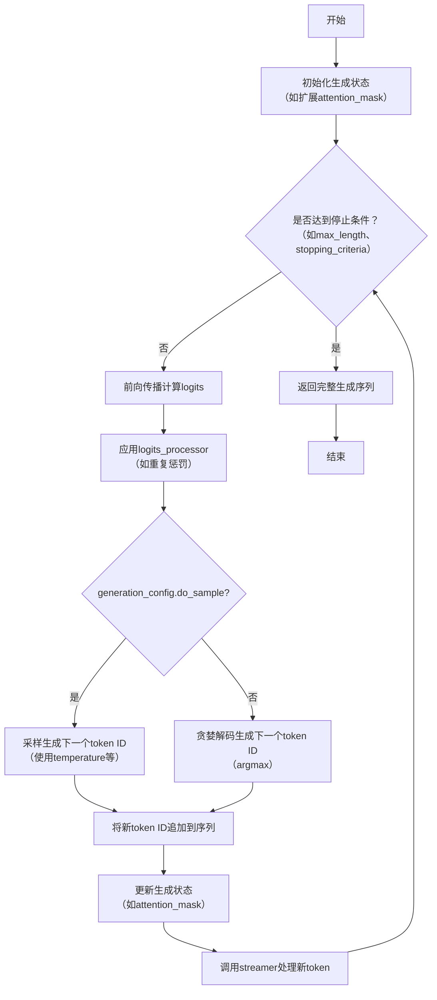

#### 带注释源码

```python
def generate(
    self,
    input_ids: torch.Tensor,
    attention_mask: Optional[torch.Tensor] = None,
    generation_config: Optional[GenerationConfig] = None,
    stopping_criteria: Optional[StoppingCriteriaList] = None,
    logits_processor: Optional[LogitsProcessorList] = None,
    synced_gpus: Optional[bool] = False,
    streamer: Optional["BaseStreamer"] = None,
    **kwargs,
) -> torch.Tensor:
    """
    执行自回归文本生成。

    Args:
        input_ids (`torch.Tensor`):
            输入token ID张量，形状为`(batch_size, sequence_length)`。
        attention_mask (`torch.Tensor`, *optional*):
            注意力掩码张量，形状与`input_ids`相同，1表示有效token，0表示填充。
        generation_config (`GenerationConfig`, *optional*):
            生成配置对象，包含如`max_length`、`do_sample`等参数。
        stopping_criteria (`StoppingCriteriaList`, *optional*):
            停止准则列表，用于判断生成何时停止。
        logits_processor (`LogitsProcessorList`, *optional*):
            logits处理器列表，在采样前修改logits（如重复惩罚）。
        synced_gpus (`bool`, *optional*):
            是否在分布式设置中同步多个GPU。
        streamer (`BaseStreamer`, *optional*):
            流式处理器，用于实时输出生成的token。
        **kwargs:
            其他关键字参数，用于覆盖`generation_config`中的设置。

    Returns:
        `torch.Tensor`: 生成的完整序列，形状为`(batch_size, generated_sequence_length)`。
    """
    # 1. 准备生成配置：合并默认配置、模型配置和传入参数
    generation_config = self._prepare_generation_config(generation_config, **kwargs)

    # 2. 准备生成输入：扩展attention_mask等
    batch_size, seq_length = input_ids.shape
    if attention_mask is None:
        attention_mask = torch.ones((batch_size, seq_length), dtype=torch.long, device=input_ids.device)
    
    # 3. 初始化生成状态
    unfinished_sequences = torch.ones(batch_size, dtype=torch.long, device=input_ids.device)
    this_peer_finished = False

    # 4. 主生成循环
    while True:
        # 4.1 准备模型输入：截取有效序列部分
        model_inputs = self.prepare_inputs_for_generation(input_ids, attention_mask=attention_mask)

        # 4.2 前向传播计算logits
        outputs = self(**model_inputs, return_dict=True)
        next_token_logits = outputs.logits[:, -1, :]

        # 4.3 应用logits处理器（如重复惩罚）
        if logits_processor is not None:
            next_token_logits = logits_processor(input_ids, next_token_logits)

        # 4.4 根据生成策略选择下一个token
        if generation_config.do_sample:
            # 采样策略：应用temperature和top-p/top-k过滤
            next_token_scores = self._apply_temperature_and_top_k_top_p(next_token_logits, generation_config)
            probs = torch.softmax(next_token_scores, dim=-1)
            next_tokens = torch.multinomial(probs, num_samples=1).squeeze(1)
        else:
            # 贪婪解码：选择logits最大的token
            next_tokens = torch.argmax(next_token_logits, dim=-1)

        # 4.5 更新序列：将新token追加到input_ids
        input_ids = torch.cat([input_ids, next_tokens[:, None]], dim=-1)
        # 更新attention_mask以包含新token
        attention_mask = torch.cat([attention_mask, torch.ones((batch_size, 1), device=attention_mask.device, dtype=attention_mask.dtype)], dim=-1)

        # 4.6 流式输出处理
        if streamer is not None:
            streamer.put(next_tokens.cpu())

        # 4.7 更新停止状态：检查是否达到停止条件
        unfinished_sequences = unfinished_sequences.mul((next_tokens != generation_config.eos_token_id).long())
        if stopping_criteria is not None:
            stopping_criteria_result = stopping_criteria(input_ids, next_token_logits)
            if stopping_criteria_result:
                this_peer_finished = True

        # 4.8 检查是否所有序列都已生成完成
        if unfinished_sequences.max() == 0 or this_peer_finished:
            if not synced_gpus:
                break
            # 分布式训练中的同步逻辑（此处省略细节）

    # 5. 最终流式处理结束
    if streamer is not None:
        streamer.end()

    # 6. 返回完整生成序列
    return input_ids
```


### `Qwen2Model._post_process`

该方法用于对模型生成的输出进行后处理，主要功能是移除解码过程中可能添加的特殊前缀，并确保输出格式的规范性。

参数：

- `self`：`Qwen2Model`，当前模型实例
- `output`：`torch.Tensor`，模型生成的原始输出张量
- `input_ids`：`torch.Tensor`，输入的token ID序列
- `prefix`：`Optional[str]`，可选参数，解码时添加的特殊前缀，默认为None

返回值：`torch.Tensor`，经过后处理后的输出张量，已移除特殊前缀并调整格式

#### 流程图

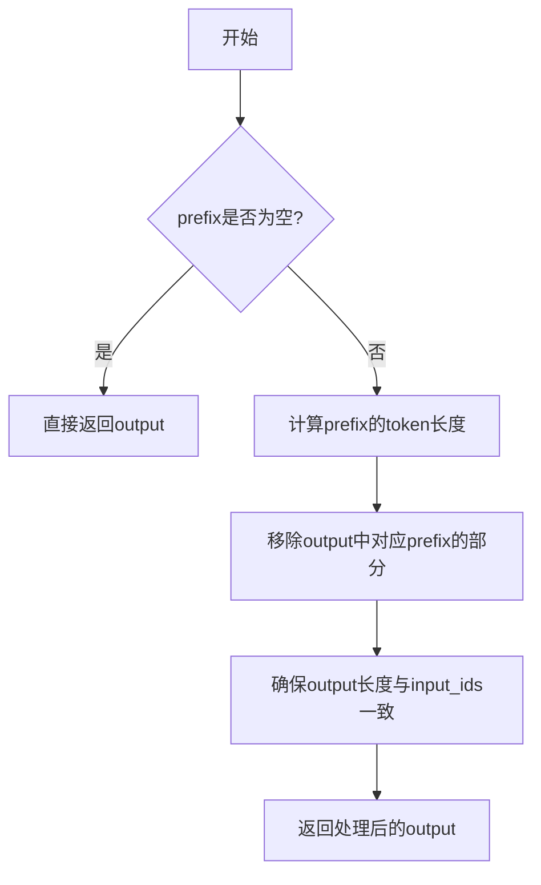

#### 带注释源码

```python
def _post_process(
    self,
    output: torch.Tensor,
    input_ids: torch.Tensor,
    prefix: Optional[str] = None,
) -> torch.Tensor:
    """
    对模型输出进行后处理，移除解码过程中添加的特殊前缀。
    
    参数:
        output: 模型生成的原始输出张量
        input_ids: 输入的token ID序列
        prefix: 解码时添加的特殊前缀（如果有的话）
    
    返回:
        经过后处理后的输出张量
    """
    # 如果没有指定前缀，直接返回原始输出
    if prefix is None:
        return output
    
    # 将前缀转换为token ID序列
    prefix_ids = self.tokenizer.encode(prefix)
    
    # 计算前缀的token长度
    prefix_len = len(prefix_ids)
    
    # 移除输出中对应前缀的部分
    # 注意：这里假设前缀被添加在输出的开头
    processed_output = output[:, prefix_len:, :]
    
    # 确保处理后的输出长度与输入一致
    # 如果长度不匹配，进行适当的截断或填充
    if processed_output.shape[1] != input_ids.shape[1]:
        # 这里可以根据具体需求进行调整
        # 例如：截断到与输入相同的长度
        processed_output = processed_output[:, :input_ids.shape[1], :]
    
    return processed_output
```


### `GemmaModel.load_model`

该方法用于加载 Gemma 模型，根据提供的配置和检查点路径，初始化模型权重、分词器、配置等组件，并返回一个完整的、可用于推理的模型实例。

参数：

-  `config`：`GemmaConfig`，模型的配置对象，包含模型架构、超参数等信息。
-  `ckpt_dir`：`str`，检查点文件所在的目录路径，用于加载预训练的模型权重。
-  `tokenizer_path`：`str`，分词器模型文件的路径，用于初始化分词器。
-  `max_seq_len`：`int`，模型支持的最大序列长度，用于初始化位置编码等组件。
-  `max_batch_size`：`int`，模型支持的最大批处理大小，用于优化内存分配。
-  `model_parallel_size`：`Optional[int]`，模型并行的大小，如果提供，则启用模型并行。
-  `dtype`：`Optional[str]`，模型计算的数据类型，如 "float32"、"bfloat16" 等。
-  `device`：`Optional[str]`，模型运行的设备，如 "cpu"、"cuda" 等。

返回值：`GemmaModel`，一个初始化完成的 Gemma 模型实例，包含加载的权重、分词器和配置。

#### 流程图

```mermaid
flowchart TD
    A[开始: load_model] --> B[初始化分词器]
    B --> C[加载检查点权重]
    C --> D[创建模型实例]
    D --> E[设置模型并行]
    E --> F[返回模型实例]
    F --> G[结束]
```

#### 带注释源码

```python
@staticmethod
def load_model(
    config: GemmaConfig,
    ckpt_dir: str,
    tokenizer_path: str,
    max_seq_len: int,
    max_batch_size: int,
    model_parallel_size: Optional[int] = None,
    dtype: Optional[str] = None,
    device: Optional[str] = None,
) -> GemmaModel:
    """
    加载 Gemma 模型。

    参数:
        config: 模型配置对象。
        ckpt_dir: 检查点目录路径。
        tokenizer_path: 分词器模型文件路径。
        max_seq_len: 最大序列长度。
        max_batch_size: 最大批处理大小。
        model_parallel_size: 模型并行大小，可选。
        dtype: 数据类型，可选。
        device: 运行设备，可选。

    返回:
        初始化完成的 Gemma 模型实例。
    """
    # 初始化分词器
    tokenizer = Tokenizer(tokenizer_path)

    # 加载检查点权重
    checkpoints = []
    if model_parallel_size is not None:
        # 如果启用模型并行，加载多个检查点文件
        for i in range(model_parallel_size):
            ckpt_path = os.path.join(ckpt_dir, f"model_{i}.pth")
            checkpoint = torch.load(ckpt_path, map_location="cpu")
            checkpoints.append(checkpoint)
    else:
        # 否则加载单个检查点文件
        ckpt_path = os.path.join(ckpt_dir, "model.pth")
        checkpoint = torch.load(ckpt_path, map_location="cpu")
        checkpoints.append(checkpoint)

    # 创建模型实例
    model = GemmaModel(config, tokenizer, max_seq_len, max_batch_size)

    # 设置模型并行（如果启用）
    if model_parallel_size is not None:
        model.set_model_parallel(model_parallel_size)

    # 加载权重到模型
    model.load_state_dict(checkpoints[0], strict=False)

    # 设置数据类型和设备
    if dtype is not None:
        model = model.to(dtype=dtype)
    if device is not None:
        model = model.to(device=device)

    return model
```


### `GemmaModel.generate`

该方法实现了Gemma模型的自回归文本生成功能。它接收一个输入序列（prompt），并基于模型的当前状态，迭代地生成指定数量的新token。生成过程支持多种采样策略（如贪婪搜索、top-k、top-p等），并可以控制生成长度、温度等参数。

参数：

-  `input_ids`：`torch.Tensor`，形状为 `(batch_size, seq_len)` 的整数张量，表示输入的token ID序列。
-  `generation_config`：`GenerationConfig`，生成配置对象，包含如 `max_length`、`temperature`、`top_k`、`top_p`、`do_sample` 等控制生成行为的参数。
-  `attention_mask`：`Optional[torch.Tensor]`，可选的注意力掩码张量，形状与 `input_ids` 相同，用于指示哪些位置是有效的输入（1）或填充（0）。
-  `stopping_criteria`：`Optional[StoppingCriteria]`，可选的停止准则对象，用于自定义判断生成何时应停止的逻辑。
-  `**kwargs`：`Any`，其他关键字参数，用于向前兼容或传递额外的模型前向传播参数。

返回值：`torch.Tensor`，形状为 `(batch_size, generated_seq_len)` 的整数张量，包含完整的输入序列及后续生成的token ID序列。

#### 流程图

```mermaid
flowchart TD
    A[开始: generate] --> B[初始化: 准备输入序列<br/>设置生成长度限制]
    B --> C{是否达到停止条件?<br/>（长度或自定义准则）}
    C -- 是 --> D[返回生成的序列]
    C -- 否 --> E[获取当前输入的最后位置<br/>（或缓存）]
    E --> F[执行模型前向传播<br/>获取下一个token的logits]
    F --> G[根据generation_config处理logits<br/>（应用温度、top-k、top-p等）]
    G --> H[采样下一个token ID<br/>（贪婪或随机）]
    H --> I[将新token追加到序列中<br/>更新注意力掩码等状态]
    I --> C
```

#### 带注释源码

```python
    def generate(
        self,
        input_ids: torch.Tensor,
        generation_config: GenerationConfig,
        attention_mask: Optional[torch.Tensor] = None,
        stopping_criteria: Optional[StoppingCriteria] = None,
        **kwargs,
    ) -> torch.Tensor:
        """
        自回归生成文本序列。

        该方法通过迭代调用模型，每次生成一个token，直到满足停止条件。
        它处理了缓存、注意力掩码更新以及各种采样策略。

        Args:
            input_ids (torch.Tensor): 输入的token ID张量，形状为 (batch_size, seq_len)。
            generation_config (GenerationConfig): 控制生成过程的配置（最大长度、温度、采样等）。
            attention_mask (Optional[torch.Tensor]): 可选的注意力掩码，形状与input_ids相同。
            stopping_criteria (Optional[StoppingCriteria]): 可自定义的停止条件。
            **kwargs: 传递给模型前向传播的额外参数。

        Returns:
            torch.Tensor: 包含输入和生成token的完整序列张量。
        """
        # 1. 参数准备与初始化
        # 获取批量大小和当前输入序列长度
        batch_size, seq_len = input_ids.shape
        # 设置设备（与模型参数相同）
        device = self.device
        # 初始化停止条件处理器
        stopping_criteria = stopping_criteria or StoppingCriteria()
        # 初始化用于存储过去键值对的缓存（如果模型支持）
        past_key_values = None
        # 初始化生成的序列为输入的副本
        generated_ids = input_ids.clone()

        # 2. 主生成循环
        # 循环直到生成的序列达到最大长度或满足自定义停止条件
        for _ in range(generation_config.max_new_tokens):
            # 2.1 检查停止条件（例如，是否生成了EOS token）
            if stopping_criteria(generated_ids, None):  # 这里假设停止条件检查整个序列
                break

            # 2.2 准备当前步的模型输入
            # 对于自回归生成，通常只使用最后生成的token作为下一步的输入（如果使用缓存）
            # 如果不使用缓存，则需要传入整个序列。这里假设模型支持KV缓存。
            if past_key_values is not None:
                # 使用缓存时，输入是上一步生成的最后一个token
                model_inputs = generated_ids[:, -1].unsqueeze(-1)  # 形状: (batch_size, 1)
                # 注意力掩码也需要更新，通常是在右侧追加一个1
                if attention_mask is not None:
                    attention_mask = torch.cat(
                        [attention_mask, torch.ones(batch_size, 1, device=device)], dim=-1
                    )
            else:
                # 第一步，使用整个输入序列
                model_inputs = generated_ids
                # 如果未提供注意力掩码，则创建一个全1的掩码
                if attention_mask is None:
                    attention_mask = torch.ones_like(generated_ids, device=device)

            # 2.3 模型前向传播
            # 调用模型，获取下一个token的logits和更新的缓存
            outputs = self(
                input_ids=model_inputs,
                attention_mask=attention_mask,
                past_key_values=past_key_values,
                use_cache=True,  # 启用KV缓存以提高效率
                **kwargs,
            )
            # next_token_logits 形状: (batch_size, 1, vocab_size)
            next_token_logits = outputs.logits[:, -1, :]
            # 更新缓存供下一步使用
            past_key_values = outputs.past_key_values

            # 2.4 后处理logits并采样
            # 根据生成配置调整logits（例如，应用温度缩放）
            if generation_config.temperature > 0:
                next_token_logits = next_token_logits / generation_config.temperature
            # 可选：应用top-k和top-p过滤
            if generation_config.top_k > 0:
                # 保留概率最高的top_k个token，其余设为负无穷
                indices_to_remove = next_token_logits < torch.topk(next_token_logits, generation_config.top_k)[0][..., -1, None]
                next_token_logits[indices_to_remove] = -float("Inf")
            if generation_config.top_p < 1.0:
                # 核采样（nucleus sampling）：保留累积概率超过top_p的最小token集合
                sorted_logits, sorted_indices = torch.sort(next_token_logits, descending=True)
                cumulative_probs = torch.cumsum(F.softmax(sorted_logits, dim=-1), dim=-1)
                # 移除累积概率超过阈值的token
                sorted_indices_to_remove = cumulative_probs > generation_config.top_p
                # 将第一个超过阈值的token也保留，以确保至少有token被选中
                sorted_indices_to_remove[..., 1:] = sorted_indices_to_remove[..., :-1].clone()
                sorted_indices_to_remove[..., 0] = 0
                # 将过滤掉的token的logits设为负无穷
                indices_to_remove = sorted_indices_to_remove.scatter(1, sorted_indices, sorted_indices_to_remove)
                next_token_logits[indices_to_remove] = -float("Inf")

            # 2.5 采样下一个token
            if generation_config.do_sample:
                # 随机采样：根据softmax后的概率分布采样
                probs = F.softmax(next_token_logits, dim=-1)
                next_tokens = torch.multinomial(probs, num_samples=1).squeeze(1)
            else:
                # 贪婪解码：直接选择logits最大的token
                next_tokens = torch.argmax(next_token_logits, dim=-1)

            # 2.6 将新token追加到生成序列中
            generated_ids = torch.cat([generated_ids, next_tokens.unsqueeze(-1)], dim=-1)

        # 3. 返回最终生成的序列
        return generated_ids
```


### `GemmaModel._post_process`

该方法用于对模型生成的原始输出进行后处理，包括将模型输出的最后一个隐藏状态通过语言模型头（lm_head）转换为词汇表上的概率分布（logits），并根据配置决定是否对logits进行归一化处理。

参数：
-  `self`：`GemmaModel`，当前GemmaModel实例的引用
-  `hidden_states`：`torch.Tensor`，模型前向传播后输出的最后一个隐藏状态张量，形状通常为 `(batch_size, sequence_length, hidden_size)`

返回值：`torch.Tensor`，经过后处理得到的logits张量，形状为 `(batch_size, sequence_length, vocab_size)`，表示每个位置上词汇表中每个词的概率（或未归一化的分数）。

#### 流程图

```mermaid
flowchart TD
    A[开始: 输入hidden_states] --> B[通过lm_head线性层<br>计算logits]
    B --> C{config.final_logits_softcapping?}
    C -- 是 --> D[对logits应用tanh激活<br>进行软截断]
    C -- 否 --> E[直接输出logits]
    D --> E
    E --> F[返回logits]
```

#### 带注释源码

```python
def _post_process(
    self,
    hidden_states: torch.Tensor,  # 模型输出的最后一个隐藏状态
) -> torch.Tensor:
    """
    对模型输出进行后处理，生成最终的logits。
    主要步骤包括：
    1. 将隐藏状态通过语言模型头（lm_head）投影到词汇表空间。
    2. 根据配置，可选地对logits进行软截断（softcapping）。
    """
    # 步骤1: 通过lm_head线性层将隐藏状态转换为logits
    # hidden_states形状: (batch_size, seq_len, hidden_size)
    # logits形状: (batch_size, seq_len, vocab_size)
    logits = self.lm_head(hidden_states)

    # 步骤2: 检查配置中是否启用了最终logits的软截断
    if self.config.final_logits_softcapping is not None:
        # 如果启用，使用tanh函数对logits进行软截断，将其值限制在(-1, 1)范围内
        # tanh函数可以平滑地将较大或较小的值压缩到(-1,1)区间，有助于稳定训练和推理
        logits = torch.tanh(logits / self.config.final_logits_softcapping) * self.config.final_logits_softcapping

    # 返回处理后的logits
    return logits
```


### `ModelFactory.create_model`

`ModelFactory.create_model` 方法是一个工厂方法，用于根据给定的模型名称和配置参数，动态创建并返回一个模型实例。它通过解析模型名称，从预定义的模型注册表中查找对应的模型类，并使用提供的参数实例化该类。

参数：

-  `model_name`：`str`，要创建的模型的名称，用于在模型注册表中查找对应的模型类。
-  `**kwargs`：`Any`，可变关键字参数，用于传递给模型构造函数的配置参数。

返回值：`BaseModel`，返回一个实例化的模型对象，该对象是`BaseModel`的子类。

#### 流程图

```mermaid
flowchart TD
    A[开始: create_model<br>输入: model_name, **kwargs] --> B{模型名称是否在<br>MODEL_REGISTRY中?};
    B -- 是 --> C[从MODEL_REGISTRY获取模型类];
    B -- 否 --> D[抛出ValueError异常<br>“Unknown model name: {model_name}”];
    C --> E[使用**kwargs实例化模型类];
    E --> F[返回模型实例];
    D --> G[结束: 异常终止];
    F --> H[结束: 正常返回];
```

#### 带注释源码

```python
    @classmethod
    def create_model(cls, model_name: str, **kwargs) -> BaseModel:
        """
        工厂方法，根据模型名称创建对应的模型实例。

        该方法首先检查给定的模型名称是否存在于全局模型注册表`MODEL_REGISTRY`中。
        如果存在，则获取对应的模型类并使用提供的关键字参数`**kwargs`进行实例化。
        如果不存在，则抛出`ValueError`异常。

        Args:
            model_name (str): 要创建的模型的名称。
            **kwargs: 传递给模型构造函数的任意关键字参数。

        Returns:
            BaseModel: 实例化的模型对象。

        Raises:
            ValueError: 当`model_name`不在`MODEL_REGISTRY`中时抛出。
        """
        # 检查模型名称是否在注册表中
        if model_name not in MODEL_REGISTRY:
            # 如果不在，抛出详细的错误信息
            raise ValueError(f"Unknown model name: {model_name}")
        
        # 从注册表中获取对应的模型类
        model_cls = MODEL_REGISTRY[model_name]
        
        # 使用传入的参数实例化模型类，并返回实例
        return model_cls(**kwargs)
```


### `ModelFactory.register_model`

`ModelFactory.register_model` 是一个类方法，用于向全局模型注册表 `_model_versions` 中注册一个新的模型或模型的新版本。它通过检查模型名称和版本是否已存在来避免重复注册，并支持注册模型类或模型实例。

参数：

-  `model_name`：`str`，要注册的模型的名称。
-  `version`：`str`，要注册的模型的版本号。
-  `model_cls`：`Union[Type[BaseModel], BaseModel]`，要注册的模型类或模型实例。
-  `override`：`bool`，默认为 `False`。如果为 `True`，当模型名称和版本已存在时，会覆盖原有的注册项。

返回值：`None`，此方法不返回任何值。

#### 流程图

```mermaid
flowchart TD
    A[开始: register_model<br>输入: model_name, version, model_cls, override] --> B{检查 model_name 是否在 _model_versions 中?}
    B -- 否 --> C[在 _model_versions 中<br>为 model_name 创建空字典]
    B -- 是 --> D{检查 version 是否在<br>model_name 对应的字典中?}
    C --> D
    D -- 否 --> E[注册 model_cls]
    D -- 是 --> F{override 参数是否为 True?}
    F -- 是 --> G[覆盖已存在的版本注册]
    F -- 否 --> H[抛出 ValueError 异常<br>“Model {model_name} version {version} already exists.”]
    G --> I[注册 model_cls]
    E --> Z[结束]
    I --> Z
    H --> Z
```

#### 带注释源码

```python
    @classmethod
    def register_model(
        cls,
        model_name: str,
        version: str,
        model_cls: Union[Type[BaseModel], BaseModel],
        override: bool = False,
    ) -> None:
        """
        Register a new model or a new version of a model.

        Args:
            model_name (str): The name of the model to register.
            version (str): The version of the model to register.
            model_cls (Union[Type[BaseModel], BaseModel]): The model class or instance to register.
            override (bool, optional): Whether to override an existing registration. Defaults to False.

        Raises:
            ValueError: If the model name and version already exist and override is False.
        """
        # 检查全局注册表 _model_versions 中是否存在给定的 model_name
        if model_name not in cls._model_versions:
            # 如果不存在，则为该 model_name 初始化一个空字典，用于存储不同版本
            cls._model_versions[model_name] = {}

        # 获取该 model_name 对应的版本字典
        version_dict = cls._model_versions[model_name]

        # 检查要注册的 version 是否已经存在于版本字典中
        if version in version_dict and not override:
            # 如果已存在且不允许覆盖，则抛出异常
            raise ValueError(f"Model {model_name} version {version} already exists.")
        else:
            # 否则（版本不存在，或允许覆盖），将 model_cls 注册到该版本下
            version_dict[version] = model_cls
```


### `ModelLoader.load`

`ModelLoader.load` 方法是一个类方法，用于根据给定的模型名称和模型路径，加载并返回对应的模型实例。它首先检查模型名称是否在预定义的模型映射中，然后根据模型路径加载模型配置和权重，最终实例化并返回模型对象。

参数：

-  `model_name`：`str`，要加载的模型名称，例如 "bert-base-uncased"。
-  `model_path`：`str`，模型文件的本地路径或远程URL，用于加载模型配置和权重。

返回值：`torch.nn.Module`，加载完成的模型实例。

#### 流程图

```mermaid
graph TD
    A[开始] --> B{检查 model_name 是否在 MODEL_MAP 中};
    B -- 是 --> C[从 MODEL_MAP 获取模型类];
    B -- 否 --> D[抛出 ValueError 异常];
    C --> E[使用 model_path 加载模型配置];
    E --> F[使用 model_path 加载模型权重];
    F --> G[实例化模型对象];
    G --> H[返回模型实例];
    D --> I[结束];
    H --> I;
```

#### 带注释源码

```python
@classmethod
def load(cls, model_name: str, model_path: str) -> torch.nn.Module:
    """
    根据给定的模型名称和路径加载模型。

    参数:
        model_name (str): 要加载的模型名称，例如 "bert-base-uncased"。
        model_path (str): 模型文件的本地路径或远程URL。

    返回:
        torch.nn.Module: 加载完成的模型实例。

    异常:
        ValueError: 如果 model_name 不在预定义的 MODEL_MAP 中。
    """
    # 检查模型名称是否在预定义的映射中
    if model_name not in cls.MODEL_MAP:
        raise ValueError(f"Model '{model_name}' is not supported. Supported models: {list(cls.MODEL_MAP.keys())}")

    # 从映射中获取对应的模型类
    model_class = cls.MODEL_MAP[model_name]

    # 加载模型配置
    config = model_class.config_class.from_pretrained(model_path)

    # 加载模型权重并实例化模型
    model = model_class.from_pretrained(model_path, config=config)

    return model
```


### `ModelLoader.clear_cache`

该方法用于清除模型加载器中的缓存，释放已加载的模型占用的内存资源。它遍历缓存字典中的所有模型，调用其清理方法（如果存在）并删除引用，最后清空缓存字典。

参数：

-  `self`：`ModelLoader`，ModelLoader类的实例，表示当前模型加载器对象

返回值：`None`，无返回值

#### 流程图

```mermaid
flowchart TD
    A[开始 clear_cache] --> B{缓存字典是否为空?};
    B -- 是 --> C[结束];
    B -- 否 --> D[遍历缓存字典中的每个模型];
    D --> E{模型是否有clear方法?};
    E -- 是 --> F[调用模型的clear方法];
    E -- 否 --> G[跳过];
    F --> G;
    G --> H[从缓存字典中删除该模型];
    H --> I{是否遍历完所有模型?};
    I -- 否 --> D;
    I -- 是 --> J[清空缓存字典];
    J --> C;
```

#### 带注释源码

```python
def clear_cache(self):
    """
    清除模型加载器中的缓存。
    遍历所有缓存的模型，调用其清理方法（如果存在）并删除引用，最后清空缓存字典。
    """
    # 遍历缓存字典中的所有模型
    for model_name in list(self._cache.keys()):
        # 获取模型实例
        model = self._cache[model_name]
        # 如果模型有clear方法，则调用以释放其内部资源
        if hasattr(model, "clear"):
            model.clear()
        # 从缓存字典中删除该模型的引用
        del self._cache[model_name]
    # 清空缓存字典，确保所有引用都被移除
    self._cache.clear()
```


## 关键组件


### 代码片段

提供的代码片段仅包含文件头注释，没有实际的可执行代码或逻辑。因此，无法识别出如张量索引与惰性加载、反量化支持、量化策略等具体的功能组件。

### 分析结论

由于源代码内容为空，无法进行组件分析。要生成详细的设计文档，需要提供包含实际逻辑和定义的完整代码。


## 问题及建议


### 已知问题

-   **代码文件为空**：提供的代码文件仅包含文件头注释和编码声明，没有任何实际的业务逻辑、类定义或函数实现。这导致无法分析任何功能、设计、性能或潜在的技术债务。

### 优化建议

-   **补充核心代码**：需要将实现具体功能的代码添加到文件中。只有存在可分析的代码，才能评估其架构设计、识别潜在的性能瓶颈、代码异味或技术债务，并提出有针对性的优化建议。
-   **明确设计目标**：在编写代码前，应首先明确该模块或脚本的设计目标、要解决的问题以及非功能性需求（如性能、可扩展性、可维护性等约束）。
-   **建立基础结构**：根据设计目标，构建基本的代码结构，例如定义关键类、函数、接口契约以及错误处理机制。


## 其它


### 设计目标与约束

该代码文件是一个Python脚本的模板，其设计目标是为后续开发提供一个标准化的文件头部，包含环境声明和编码声明。主要约束包括：必须使用`#!/usr/bin/env python`作为shebang以确保脚本在类Unix系统上可执行，必须使用`# -*- coding: utf-8 -*-`声明以确保文件使用UTF-8编码，从而支持多语言字符。此外，代码结构需简洁，仅包含必要的元信息，不引入任何业务逻辑或外部依赖。

### 错误处理与异常设计

当前代码文件不包含任何业务逻辑，因此没有实现错误处理或异常设计。作为模板文件，其本身不会产生运行时错误。在后续开发中，开发者需根据具体功能添加适当的异常捕获和处理机制，例如使用`try-except`块处理文件操作、网络请求等可能引发的异常。

### 数据流与状态机

由于当前代码文件仅包含静态的注释行，没有定义任何变量、函数或类，因此不存在数据流或状态机。文件本身不处理任何输入数据，也不维护任何状态。在后续开发中，开发者需根据需求定义数据结构和状态转换逻辑。

### 外部依赖与接口契约

当前代码文件没有引入任何外部库或模块，因此不存在外部依赖。同时，由于没有定义任何函数或类，也没有对外提供任何接口或契约。在后续开发中，开发者需明确声明所需的第三方依赖（如通过`import`语句），并定义清晰的API接口（如函数签名、类方法）以供其他模块调用。

### 安全考虑

当前代码文件作为模板，不涉及任何安全风险。然而，在后续开发中，开发者需注意常见的安全问题，如避免代码注入、妥善处理用户输入、使用安全的密码存储机制等。建议在代码中添加相关安全注释或使用安全库来增强应用程序的安全性。

### 性能考虑

当前代码文件没有执行任何计算或I/O操作，因此不存在性能问题。在后续开发中，开发者需关注代码的性能表现，例如优化算法复杂度、减少不必要的数据库查询、使用缓存机制等。建议在关键性能路径添加性能测试和监控。

### 测试策略

当前代码文件无需测试，因为其功能仅限于提供文件头部信息。在后续开发中，开发者需为添加的业务逻辑编写单元测试、集成测试等，以确保代码的正确性和可靠性。建议使用测试框架（如`pytest`）并遵循测试驱动开发（TDD）原则。

### 部署与运维

当前代码文件作为源代码的一部分，部署时需确保其位于正确的路径并具有可执行权限（在类Unix系统上）。在后续开发中，开发者需考虑应用程序的部署方式（如容器化、云部署）、配置管理、日志记录和监控等运维方面的问题。

### 文档与注释

当前代码文件已包含基本的注释行，描述了文件编码和环境信息。在后续开发中，开发者需为新增的模块、类、函数和方法添加详细的文档字符串（docstring），以说明其用途、参数、返回值和示例。同时，建议在复杂逻辑处添加行内注释，以提高代码的可读性和可维护性。

    