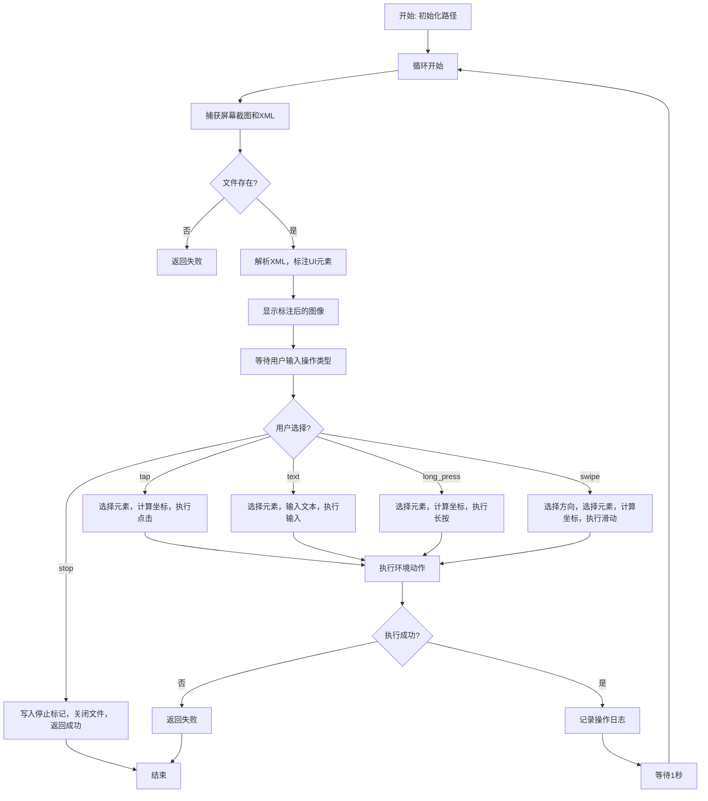
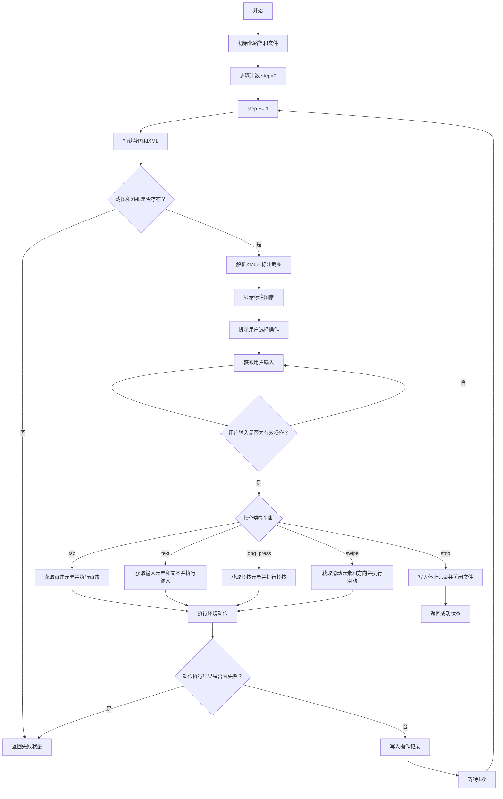

# `.\MetaGPT\metagpt\ext\android_assistant\actions\manual_record.py` 详细设计文档

该代码实现了一个名为ManualRecord的交互式Android操作录制器。它通过连接Android环境，循环执行以下流程：捕获屏幕截图和XML布局，解析并标注UI元素，通过图形界面展示给用户，然后等待用户选择操作类型（点击、输入文本、长按、滑动或停止），根据用户选择执行相应的Android操作，并将操作步骤记录到文件中。核心功能是辅助用户手动录制在Android设备上执行的任务步骤，用于后续的自动化脚本生成或学习。

## 整体流程



## 类结构

```
Action (MetaGPT基础动作类)
└── ManualRecord (手动录制动作)
```

## 全局变量及字段


### `ManualRecord.name`
    
动作的名称，固定为'ManualRecord'，用于标识该动作类型。

类型：`str`
    


### `ManualRecord.useless_list`
    
存储无用元素的唯一标识符列表，用于在解析XML时过滤掉这些元素。

类型：`list[str]`
    


### `ManualRecord.record_path`
    
记录文件路径，用于保存用户交互步骤的日志信息。

类型：`Path`
    


### `ManualRecord.task_desc_path`
    
任务描述文件路径，用于保存任务描述文本。

类型：`Path`
    


### `ManualRecord.screenshot_before_path`
    
原始截图保存路径，用于存储未标注的屏幕截图。

类型：`Path`
    


### `ManualRecord.screenshot_after_path`
    
标注后截图保存路径，用于存储带有元素边界框标注的屏幕截图。

类型：`Path`
    


### `ManualRecord.xml_path`
    
XML文件保存路径，用于存储屏幕的UI层次结构信息。

类型：`Path`
    
    

## 全局函数及方法

### `ManualRecord.run`

该方法用于在Android环境中手动记录用户交互操作。它通过循环捕获屏幕截图和XML布局，展示带标注的界面元素，并提示用户选择操作（如点击、输入文本、长按、滑动或停止）。根据用户选择，执行相应的Android环境动作，并将操作记录到文件中。整个过程持续进行，直到用户选择停止或发生错误。

参数：

- `task_desc`：`str`，任务描述，将被写入任务描述文件。
- `task_dir`：`Path`，任务目录路径，用于存储记录文件、截图和XML文件。
- `env`：`AndroidEnv`，Android环境实例，用于执行观察和动作。

返回值：`AndroidActionOutput`，包含动作执行状态（成功或失败）。

#### 流程图



#### 带注释源码

```python
async def run(self, task_desc: str, task_dir: Path, env: AndroidEnv):
    # 初始化记录文件、任务描述文件、截图和XML存储路径
    self.record_path = Path(task_dir) / "record.txt"
    self.task_desc_path = Path(task_dir) / "task_desc.txt"
    self.screenshot_before_path = Path(task_dir) / "raw_screenshots"
    self.screenshot_after_path = Path(task_dir) / "labeled_screenshots"
    self.xml_path = Path(task_dir) / "xml"
    # 创建必要的目录
    for path in [self.screenshot_before_path, self.screenshot_after_path, self.xml_path]:
        path.mkdir(parents=True, exist_ok=True)

    # 清空记录文件并写入任务描述
    self.record_path.write_text("")
    record_file = open(self.record_path, "w")
    self.task_desc_path.write_text(task_desc)

    step = 0
    extra_config = config.extra
    # 主循环：持续记录用户操作
    while True:
        step += 1
        # 捕获当前屏幕截图
        screenshot_path: Path = env.observe(
            EnvObsParams(
                obs_type=EnvObsType.GET_SCREENSHOT, ss_name=f"{step}", local_save_dir=self.screenshot_before_path
            )
        )
        # 捕获当前XML布局
        xml_path: Path = env.observe(
            EnvObsParams(obs_type=EnvObsType.GET_XML, xml_name=f"{step}", local_save_dir=self.xml_path)
        )
        # 检查截图和XML是否成功捕获
        if not screenshot_path.exists() or not xml_path.exists():
            return AndroidActionOutput(action_state=RunState.FAIL)

        # 解析XML，获取界面元素列表
        elem_list = elem_list_from_xml_tree(xml_path, self.useless_list, extra_config.get("min_dist", 30))

        # 在截图上标注元素边界框
        screenshot_labeled_path = Path(self.screenshot_after_path).joinpath(f"{step}_labeled.png")
        labeled_img = draw_bbox_multi(screenshot_path, screenshot_labeled_path, elem_list)

        # 显示标注后的图像
        cv2.namedWindow("image", cv2.WINDOW_NORMAL)
        cv2.imshow("image", labeled_img)
        cv2.waitKey(0)
        cv2.destroyAllWindows()

        user_input = "xxx"
        logger.info(
            "Choose one of the following actions you want to perform on the current screen:\n"
            "tap, text, long_press, swipe, stop"
        )

        # 获取用户输入，直到输入有效操作
        while (
            user_input.lower() != ActionOp.TAP.value
            and user_input.lower() != ActionOp.TEXT.value
            and user_input.lower() != ActionOp.LONG_PRESS.value
            and user_input.lower() != ActionOp.SWIPE.value
            and user_input.lower() != ActionOp.STOP.value
        ):
            user_input = input("user_input: ")

        # 根据用户输入执行相应操作
        if user_input.lower() == ActionOp.TAP.value:
            logger.info(f"Which element do you want to tap? Choose a numeric tag from 1 to {len(elem_list)}:")
            user_input = "xxx"
            while not user_input.isnumeric() or int(user_input) > len(elem_list) or int(user_input) < 1:
                user_input = input("user_input: ")
            tl, br = elem_list[int(user_input) - 1].bbox
            x, y = (tl[0] + br[0]) // 2, (tl[1] + br[1]) // 2
            action = EnvAction(action_type=EnvActionType.SYSTEM_TAP, coord=(x, y))
            log_str = f"tap({int(user_input)}):::{elem_list[int(user_input) - 1].uid}\n"
        elif user_input.lower() == ActionOp.TEXT.value:
            logger.info(
                f"Which element do you want to input the text string? Choose a numeric tag from 1 to "
                f"{len(elem_list)}:"
            )
            input_area = "xxx"
            while not input_area.isnumeric() or int(input_area) > len(elem_list) or int(input_area) < 1:
                input_area = input("user_input: ")
            logger.info("Enter your input text below:")
            user_input = ""
            while not user_input:
                user_input = input("user_input: ")
            action = EnvAction(action_type=EnvActionType.USER_INPUT, input_txt=user_input)
            log_str = f"text({input_area}:sep:'{user_input}'):::{elem_list[int(input_area) - 1].uid}\n"
        elif user_input.lower() == ActionOp.LONG_PRESS.value:
            logger.info(
                f"Which element do you want to long press? Choose a numeric tag from 1 to {len(elem_list)}:"
            )
            user_input = "xxx"
            while not user_input.isnumeric() or int(user_input) > len(elem_list) or int(user_input) < 1:
                user_input = input("user_input: ")
            tl, br = elem_list[int(user_input) - 1].bbox
            x, y = (tl[0] + br[0]) // 2, (tl[1] + br[1]) // 2
            action = EnvAction(action_type=EnvActionType.USER_LONGPRESS, coord=(x, y))
            log_str = f"long_press({int(user_input)}):::{elem_list[int(user_input) - 1].uid}\n"
        elif user_input.lower() == ActionOp.SWIPE.value:
            logger.info(
                "What is the direction of your swipe? Choose one from the following options:\n"
                "up, down, left, right"
            )
            user_input = ""
            while (
                user_input != SwipeOp.UP.value
                and user_input != SwipeOp.DOWN.value
                and user_input != SwipeOp.LEFT.value
                and user_input != SwipeOp.RIGHT.value
            ):
                user_input = input("user_input: ")
            swipe_dir = user_input
            logger.info(f"Which element do you want to swipe? Choose a numeric tag from 1 to {len(elem_list)}:")
            while not user_input.isnumeric() or int(user_input) > len(elem_list) or int(user_input) < 1:
                user_input = input("user_input: ")
            tl, br = elem_list[int(user_input) - 1].bbox
            x, y = (tl[0] + br[0]) // 2, (tl[1] + br[1]) // 2

            action = EnvAction(action_type=EnvActionType.USER_SWIPE, coord=(x, y), orient=swipe_dir)
            log_str = f"swipe({int(user_input)}:sep:{swipe_dir}):::{elem_list[int(user_input) - 1].uid}\n"
        elif user_input.lower() == ActionOp.STOP.value:
            # 用户选择停止，写入停止记录并关闭文件
            record_file.write("stop\n")
            record_file.close()
            break
        else:
            break

        # 执行环境动作
        obs, _, _, _, info = env.step(action)
        action_res = info["res"]
        # 检查动作执行结果
        if action_res == ADB_EXEC_FAIL:
            return AndroidActionOutput(action_state=RunState.FAIL)
        # 写入操作记录
        record_file.write(log_str)

        # 等待1秒，避免操作过快
        time.sleep(1)

    # 返回成功状态
    return AndroidActionOutput(action_state=RunState.SUCCESS)
```

## 关键组件


### 手动交互记录器 (ManualRecord)

一个用于在Android环境中手动记录用户交互步骤（如点击、输入、滑动等）的组件，它将屏幕截图、UI元素信息和用户操作序列化保存到指定目录，用于后续的学习或回放。

### Android环境接口 (AndroidEnv)

提供与Android设备交互的底层接口，包括获取屏幕截图、获取UI布局XML、执行点击/输入/滑动等操作，是手动记录功能所依赖的核心执行环境。

### UI元素解析与标注 (elem_list_from_xml_tree & draw_bbox_multi)

从Android UI布局XML文件中解析出可交互的UI元素列表，并根据配置过滤无用元素；将解析出的元素在屏幕截图上绘制边界框进行可视化标注，辅助用户选择操作目标。

### 操作序列化与日志记录

将用户选择的操作（如`tap(1):::element_uid`）以及对应的目标元素唯一标识符格式化后记录到日志文件中，形成可后续解析和重放的操作序列。

### 交互式命令行界面

通过命令行提示用户选择操作类型和目标元素，接收用户输入，并将输入转换为标准化的环境操作指令，驱动`AndroidEnv`执行相应动作。


## 问题及建议


### 已知问题

-   **硬编码的用户输入验证逻辑**：代码中通过多个`while`循环和硬编码的字符串比较（如`user_input.lower() != ActionOp.TAP.value`）来验证用户输入，逻辑冗长且重复，难以维护和扩展新的操作类型。
-   **资源管理不当**：`record_file`文件句柄在循环中打开，但在`STOP`操作或异常情况下才关闭。如果循环因异常提前退出（例如截图或XML获取失败），文件句柄可能不会正确关闭，导致资源泄漏。
-   **脆弱的错误处理**：当`screenshot_path`或`xml_path`不存在时，函数直接返回`RunState.FAIL`。然而，此时`record_file`可能已经打开但未关闭，且没有记录任何错误信息，不利于问题排查。
-   **阻塞式UI交互**：使用`cv2.waitKey(0)`和`input()`进行交互，会完全阻塞程序执行。在需要集成到更复杂的异步或非阻塞式系统中时，这可能成为瓶颈。
-   **代码重复**：对于`TAP`、`LONG_PRESS`和`SWIPE`操作，计算元素中心坐标（`x, y`）和生成`log_str`的逻辑结构高度相似，存在明显的代码重复。
-   **配置访问方式不一致**：`extra_config = config.extra`在循环外获取，但`extra_config.get("min_dist", 30)`在循环内的`elem_list_from_xml_tree`调用中使用。如果配置在运行时动态变化，此方式可能无法获取到最新值。
-   **循环控制变量`user_input`重用**：在`SWIPE`操作中，`user_input`变量先被用于存储方向，随后又被用于存储元素索引，这降低了代码的可读性，容易引发混淆。

### 优化建议

-   **重构输入验证逻辑**：创建一个将操作字符串映射到`ActionOp`枚举的字典或使用`ActionOp`枚举的成员列表来简化输入验证。例如，使用`if user_input.lower() in [op.value for op in ActionOp]`进行检查，并将公共的“选择元素”提示和验证逻辑抽取为独立函数。
-   **使用上下文管理器管理资源**：将`open(self.record_path, "w")`改为使用`with open(...) as record_file:`语句，确保在任何情况下文件都能被正确关闭。
-   **增强错误处理与日志记录**：在返回`RunState.FAIL`之前，应记录具体的错误原因（例如，哪个文件不存在）。考虑使用更精细的异常处理来区分不同类型的失败。
-   **解耦UI交互逻辑**：考虑将用户交互部分（显示图像、获取输入）抽象为一个独立的接口或类。这样可以将阻塞式的`cv2`/`input`实现替换为其他前端（如Web界面、异步IO），提高代码的模块化和可测试性。
-   **提取公共代码为函数**：将计算元素中心坐标和生成操作日志字符串的公共逻辑提取为独立的辅助函数，减少重复代码。
-   **统一配置访问**：考虑在类初始化或方法开始时，将所需的配置项（如`min_dist`）作为参数传入或存储在实例变量中，避免在循环中多次访问全局配置对象。
-   **使用更具描述性的变量名**：在`SWIPE`操作中，使用不同的变量来存储方向（如`swipe_direction`）和元素索引（如`element_index`），以提高代码清晰度。
-   **添加循环超时或退出确认**：当前循环仅通过`STOP`操作退出。考虑增加一个超时机制或额外的确认步骤，防止因用户误操作或无响应导致程序无限等待。


## 其它


### 设计目标与约束

本模块的核心设计目标是提供一个交互式工具，用于在Android应用的“学习”阶段，通过人工操作记录用户与应用的交互序列，生成可用于后续自动化回放的脚本。主要约束包括：1) 必须与现有的`AndroidEnv`环境无缝集成，复用其观察（截图、XML）和执行（点击、输入等）能力；2) 操作流程需直观，通过图形界面（标注元素的截图）和命令行提示引导用户；3) 生成的记录文件格式需与自动化回放组件兼容。

### 错误处理与异常设计

模块的错误处理主要围绕Android环境操作（ADB命令）的失败。当`env.observe`无法获取截图或XML文件，或`env.step`执行动作返回`ADB_EXEC_FAIL`时，方法将提前返回`AndroidActionOutput(action_state=RunState.FAIL)`状态，终止记录流程。对于用户输入验证（如选择无效的操作类型或元素编号），采用`while`循环进行持续提示，直至获得有效输入，属于交互式容错，不抛出异常。未处理文件I/O可能引发的异常（如路径权限问题）。

### 数据流与状态机

1.  **数据流**：
    *   **输入**：任务描述(`task_desc`)、任务目录(`task_dir`)、Android环境(`env`)。
    *   **处理**：循环执行“观察-标注-提示输入-执行-记录”流程。
    *   **输出**：在`task_dir`下生成`record.txt`（操作序列）、`task_desc.txt`、`raw_screenshots/`（原始截图）、`labeled_screenshots/`（带标注截图）、`xml/`（界面布局文件）。
    *   **状态**：返回`AndroidActionOutput`，包含`RunState.SUCCESS`或`RunState.FAIL`。

2.  **状态机** (记录过程)：
    *   **初始状态**：设置路径，打开记录文件。
    *   **循环状态**：
        *   `OBSERVE`: 获取屏幕截图和XML。
        *   `LABEL`: 解析XML，标注元素并显示给用户。
        *   `AWAIT_INPUT`: 等待用户选择操作类型及目标。
        *   `EXECUTE`: 通过`env.step`执行动作。
        *   `RECORD`: 将操作日志写入文件。
    *   **终止状态**：
        *   `SUCCESS`: 用户输入`stop`，正常结束。
        *   `FAIL`: 环境操作失败，异常结束。

### 外部依赖与接口契约

1.  **外部依赖**：
    *   **`AndroidEnv`**: 核心环境依赖，提供`observe`方法（获取屏幕状态）和`step`方法（执行动作）。
    *   **`cv2` (OpenCV)**: 用于显示标注后的屏幕图像给用户。
    *   **`metagpt.ext.android_assistant.utils`中的工具函数**：`elem_list_from_xml_tree`（解析XML）、`draw_bbox_multi`（绘制元素边框）。
    *   **`metagpt.config2.config`**: 用于获取额外配置（如`min_dist`）。

2.  **接口契约**：
    *   **`async def run(self, task_desc: str, task_dir: Path, env: AndroidEnv) -> AndroidActionOutput`**: 主执行接口。调用者需提供任务描述、存储目录和已初始化的Android环境实例。
    *   **`EnvObsParams` & `EnvAction`**: 必须按照`AndroidEnv`定义的参数结构调用其方法。
    *   **记录文件格式**: 生成的`record.txt`每行格式为`{操作类型}({参数}):::{元素uid}`，需与下游的脚本回放器约定一致。

### 安全与合规考虑

1.  **权限**：该模块依赖的`AndroidEnv`通常需要ADB调试权限，可能涉及对真实设备或模拟器的完全控制。需确保在授权和可控的环境下使用。
2.  **数据**：该模块会持续捕获设备屏幕截图和界面布局（XML），可能包含敏感信息（如个人数据、账户信息）。生成的记录文件应妥善保管，避免泄露。
3.  **输入验证**：对用户输入的元素索引进行了范围检查，防止索引越界。但对`env.step`执行的动作结果（`info["res"]`）仅检查了`ADB_EXEC_FAIL`，未处理其他潜在错误码或异常。

### 测试策略建议

1.  **单元测试**：模拟`AndroidEnv`对象，测试`run`方法在不同用户输入序列（包括正常操作和`stop`）下的逻辑分支、路径创建和文件写入内容。
2.  **集成测试**：连接一个测试用Android模拟器，执行完整的记录流程，验证生成的截图、XML和记录文件是否完整、正确，并能被对应的回放脚本使用。
3.  **错误处理测试**：模拟`env.observe`或`env.step`返回失败，验证模块是否能正确返回`FAIL`状态并终止。
4.  **用户交互测试**：由于涉及GUI(`cv2.imshow`)和命令行输入，需要进行人工测试以确保交互流程清晰、提示信息准确。


    