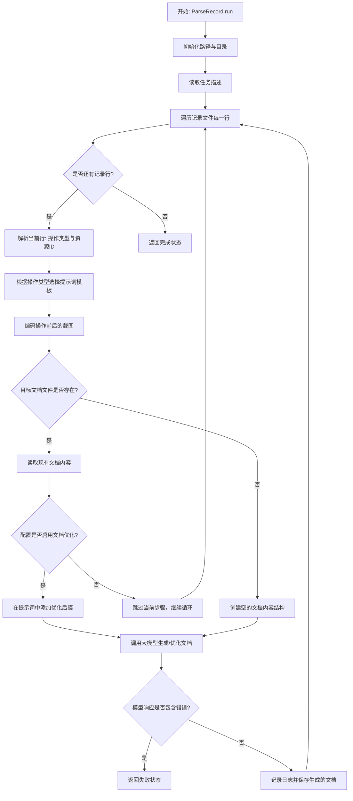
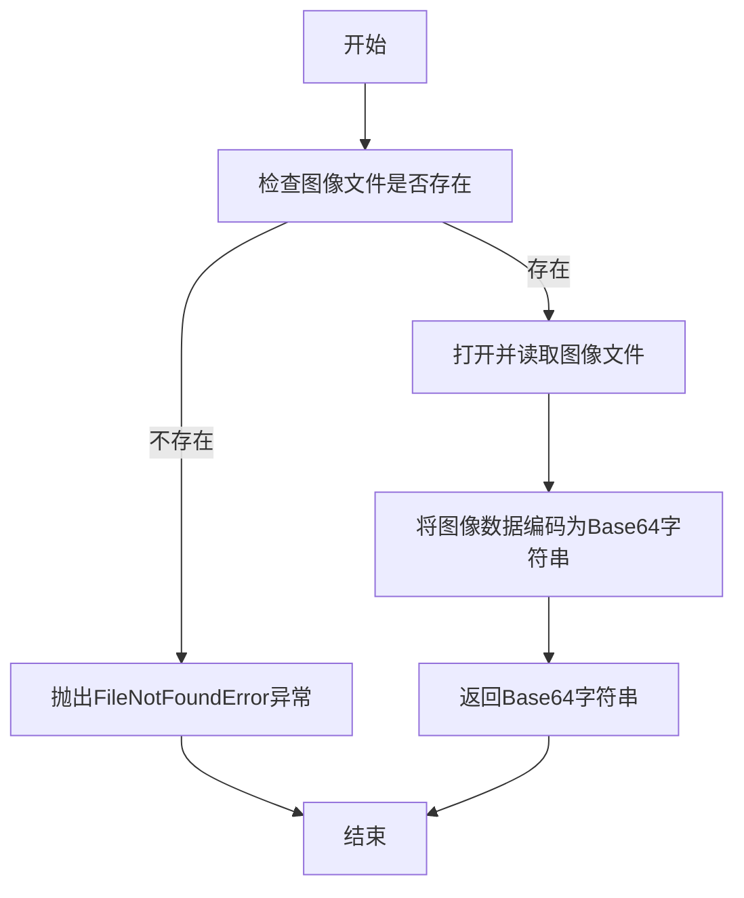
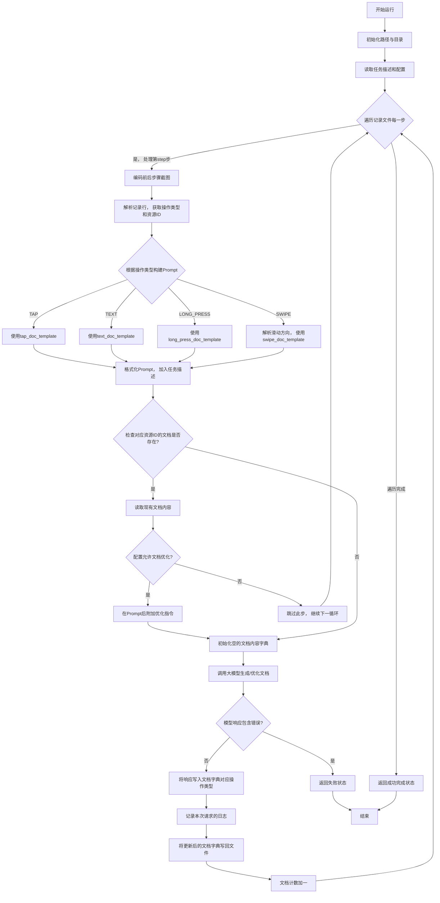

# `.\MetaGPT\metagpt\ext\android_assistant\actions\parse_record.py` 详细设计文档

该代码是一个用于解析Android操作记录并生成标准化操作文档的Action类。它读取手动操作记录文件，结合操作前后的屏幕截图，根据不同的操作类型（如点击、输入文本、滑动等）构建特定的提示词模板，调用大语言模型（GPT-4V）生成或优化描述UI元素操作方法的文档，并将结果保存到指定目录。

## 整体流程



## 类结构

```
Action (MetaGPT基础动作类)
└── ParseRecord (解析记录并生成文档)
```

## 全局变量及字段


### `RECORD_PARSE_NODE`
    
用于解析记录并生成文档的预配置动作节点，包含处理逻辑和提示模板。

类型：`ActionNode`
    


### `logger`
    
用于记录代码执行过程中的信息、警告和错误的日志记录器。

类型：`Logger`
    


### `ParseRecord.name`
    
动作的名称，标识该动作的类型，此处固定为'ParseRecord'。

类型：`str`
    


### `ParseRecord.record_path`
    
记录文件（record.txt）的路径，包含用户操作步骤的原始数据。

类型：`Path`
    


### `ParseRecord.task_desc_path`
    
任务描述文件（task_desc.txt）的路径，包含当前任务的文本描述。

类型：`Path`
    


### `ParseRecord.screenshot_before_path`
    
操作前截图（raw_screenshots）的存储目录路径。

类型：`Path`
    


### `ParseRecord.screenshot_after_path`
    
操作后截图（labeled_screenshots）的存储目录路径。

类型：`Path`
    
    

## 全局函数及方法

### `encode_image`

`encode_image` 是一个全局函数，用于将指定路径的图像文件读取并编码为 Base64 格式的字符串。该函数主要用于将图像数据转换为文本格式，以便于在需要文本输入的上下文中（如 API 调用）传输图像信息。

参数：

- `image_path`：`Path`，图像文件的路径，指向需要编码的图像文件。

返回值：`str`，返回图像文件经过 Base64 编码后的字符串表示。

#### 流程图



#### 带注释源码

```python
def encode_image(image_path: Path) -> str:
    """
    将指定路径的图像文件编码为 Base64 格式的字符串。

    参数:
        image_path (Path): 图像文件的路径。

    返回:
        str: 图像文件的 Base64 编码字符串。

    异常:
        FileNotFoundError: 如果指定的图像文件不存在。
    """
    # 检查图像文件是否存在
    if not image_path.exists():
        raise FileNotFoundError(f"图像文件不存在: {image_path}")

    # 以二进制模式打开图像文件
    with open(image_path, "rb") as image_file:
        # 读取图像文件的二进制数据
        image_data = image_file.read()
        # 将二进制数据编码为 Base64 字符串，并解码为 UTF-8 格式的字符串
        encoded_string = base64.b64encode(image_data).decode('utf-8')
    
    # 返回 Base64 编码的字符串
    return encoded_string
```

### `ParseRecord.run`

该方法用于解析Android操作记录，根据记录中的操作类型（如点击、输入、滑动等）和前后屏幕截图，调用大语言模型（如GPT-4V）生成或更新对应UI元素的操作文档。它会遍历记录文件中的每一步操作，为每个唯一的资源ID（`resource_id`）创建或更新一个文档文件，记录该元素支持的各种操作的标准描述。

参数：

- `task_dir`：`Path`，包含任务相关文件（如记录文件`record.txt`、任务描述`task_desc.txt`、原始和标注后的截图目录）的根目录路径。
- `docs_dir`：`Path`，用于存储生成的UI元素操作文档的目录路径。

返回值：`AndroidActionOutput`，包含一个`action_state`字段，指示整个解析和文档生成过程的最终状态（`RunState.FINISH`表示成功完成，`RunState.FAIL`表示过程中遇到错误）。

#### 流程图



#### 带注释源码

```python
async def run(self, task_dir: Path, docs_dir: Path):
    # 初始化文档计数器
    doc_count = 0
    # 根据传入的任务目录，设置记录文件、任务描述文件、前后截图目录的路径
    self.record_path = Path(task_dir) / "record.txt"
    self.task_desc_path = Path(task_dir) / "task_desc.txt"
    self.screenshot_before_path = Path(task_dir) / "raw_screenshots"
    self.screenshot_after_path = Path(task_dir) / "labeled_screenshots"
    # 确保截图目录存在
    for path in [self.screenshot_before_path, self.screenshot_after_path]:
        path.mkdir(parents=True, exist_ok=True)

    # 读取任务描述和额外配置
    task_desc = self.task_desc_path.read_text()
    extra_config = config.extra

    # 打开操作记录文件
    with open(self.record_path, "r") as record_file:
        # 计算记录的总步数（假设第一行是标题或空行）
        record_step_count = len(record_file.readlines()) - 1
        record_file.seek(0)  # 将文件指针移回开头
        # 遍历每一步操作
        for step in range(1, record_step_count + 1):
            # 对当前步骤操作前后的标注截图进行Base64编码
            img_before_base64 = encode_image(self.screenshot_after_path.joinpath(f"{step}_labeled.png"))
            img_after_base64 = encode_image(self.screenshot_after_path.joinpath(f"{step + 1}_labeled.png"))
            # 读取一行记录并解析
            rec = record_file.readline().strip()
            action, resource_id = rec.split(":::")  # 记录格式为 `action:::resource_id`
            action_type = action.split("(")[0]  # 提取操作类型，如 `tap`, `text`
            # 构建Prompt
            action_param = re.findall(r"\((.*?)\)", action)[0]  # 提取操作参数
            # 根据操作类型选择对应的Prompt模板并格式化
            if action_type == ActionOp.TAP.value:
                prompt_template = tap_doc_template
                context = prompt_template.format(ui_element=action_param)
            elif action_type == ActionOp.TEXT.value:
                input_area, input_text = action_param.split(":sep:")
                prompt_template = text_doc_template
                context = prompt_template.format(ui_element=input_area)
            elif action_type == ActionOp.LONG_PRESS.value:
                prompt_template = long_press_doc_template
                context = prompt_template.format(ui_element=action_param)
            elif action_type == ActionOp.SWIPE.value:
                swipe_area, swipe_dir = action_param.split(":sep:")
                # 根据滑动方向细化操作类型
                if swipe_dir == SwipeOp.UP.value or swipe_dir == SwipeOp.DOWN.value:
                    action_type = ActionOp.VERTICAL_SWIPE.value
                elif swipe_dir == SwipeOp.LEFT.value or swipe_dir == SwipeOp.RIGHT.value:
                    action_type = ActionOp.HORIZONTAL_SWIPE.value
                prompt_template = swipe_doc_template
                context = prompt_template.format(swipe_dir=swipe_dir, ui_element=swipe_area)
            else:
                break  # 遇到未知操作类型则终止循环
            # 在上下文中加入任务描述
            context = context.format(task_desc=task_desc)

            # 确定对应资源ID的文档文件路径
            doc_name = resource_id + ".txt"
            doc_path = docs_dir.joinpath(doc_name)

            # 检查文档是否已存在
            if doc_path.exists():
                try:
                    # 尝试读取并解析现有文档内容（期望是Python字典的字符串表示）
                    doc_content = ast.literal_eval(doc_path.read_text())
                except Exception as exp:
                    logger.error(f"ast parse doc: {doc_path} failed, exp: {exp}")
                    continue  # 解析失败则跳过此步

                # 如果当前操作类型的文档已存在
                if doc_content[action_type]:
                    if extra_config.get("doc_refine", False):  # 检查配置是否允许优化
                        # 在Prompt后附加优化指令
                        refine_context = refine_doc_suffix.format(old_doc=doc_content[action_type])
                        context += refine_context
                        logger.info(
                            f"Documentation for the element {resource_id} already exists. The doc will be "
                            f"refined based on the latest demo."
                        )
                    else:
                        # 配置不允许优化，则跳过此步，不生成新文档
                        logger.info(
                            f"Documentation for the element {resource_id} already exists. Turn on DOC_REFINE "
                            f"in the config file if needed."
                        )
                        continue
            else:
                # 文档不存在，初始化一个包含所有操作类型空值的字典
                doc_content = {"tap": "", "text": "", "v_swipe": "", "h_swipe": "", "long_press": ""}

            # 调用大语言模型生成或优化文档
            logger.info(f"Waiting for GPT-4V to generate documentation for the element {resource_id}")
            node = await RECORD_PARSE_NODE.fill(
                context=context, llm=self.llm, images=[img_before_base64, img_after_base64]
            )
            # 检查模型响应是否包含错误
            if "error" in node.content:
                return AndroidActionOutput(action_state=RunState.FAIL)
            # 记录本次请求的日志
            log_path = task_dir.joinpath("log_parse_record.txt")
            prompt = node.compile(context=context, schema="json", mode="auto")
            msg = node.content
            # 将模型响应更新到文档字典的对应操作类型
            doc_content[action_type] = msg

            # 将日志项写入日志文件
            with open(log_path, "a") as logfile:
                log_item = RecordLogItem(
                    step=step,
                    prompt=prompt,
                    image_before=img_before_base64,
                    image_after=img_after_base64,
                    response=node.content,
                )
                logfile.write(log_item.model_dump_json() + "\n")
            # 将更新后的文档字典写回文件
            with open(doc_path, "w") as outfile:
                outfile.write(str(doc_content))
            doc_count += 1
            logger.info(f"Documentation generated and saved to {doc_path}")

        # 所有步骤处理完成
        logger.info(f"Documentation generation phase completed. {doc_count} docs generated.")

    # 返回成功状态
    return AndroidActionOutput(action_state=RunState.FINISH)
```

## 关键组件


### 记录解析与处理

负责读取和解析用户操作记录文件（`record.txt`），根据操作类型（如点击、输入、滑动等）提取关键参数，并构建用于生成文档的上下文信息。

### 文档生成与精炼

基于解析出的操作上下文和对应的应用界面截图，调用大语言模型（GPT-4V）生成标准操作文档。支持对已存在文档的读取和基于新示例的精炼更新。

### 操作类型分类与适配

将原始记录中的基础操作（如`SWIPE`）根据滑动方向进一步分类为垂直滑动（`VERTICAL_SWIPE`）或水平滑动（`HORIZONTAL_SWIPE`），并为每种操作类型适配不同的文档生成模板。

### 任务上下文集成

将用户任务描述（`task_desc.txt`）整合到文档生成的提示词中，使生成的文档能结合具体任务目标，提高文档的相关性和实用性。

### 日志记录与状态管理

在文档生成过程中，详细记录每一步的提示词、前后截图以及模型响应，便于追踪和调试。同时管理整个解析过程的运行状态（成功、失败、完成）。


## 问题及建议


### 已知问题

-   **硬编码的文档内容结构**：`doc_content` 字典的键（如 `"tap"`, `"text"` 等）在代码中被硬编码。如果 `ActionOp` 枚举类型增加新的操作类型，此处的代码需要同步更新，否则会导致新类型的文档无法被正确存储或覆盖现有键，容易引发运行时错误或数据丢失。
-   **异常处理不充分**：在读取已存在的文档文件时（`ast.literal_eval(doc_path.read_text())`），仅捕获了通用的 `Exception`。如果文件内容格式错误（非有效的Python字面量），虽然会记录错误并跳过当前步骤，但整个生成流程会继续。这可能导致该步骤对应的UI元素文档生成失败，且没有明确的恢复或重试机制。
-   **资源ID与文件名的直接映射**：文档文件名直接使用 `resource_id + ".txt"` 生成。如果 `resource_id` 包含操作系统文件名中的非法字符（如 `/`, `\`, `:` 等），会导致文件创建失败。当前代码未对此进行清理或验证。
-   **潜在的图像编码失败**：`encode_image` 函数在图像文件不存在或无法读取时可能抛出异常。当前代码未处理这种异常，可能导致整个 `run` 方法提前终止。
-   **记录文件解析的脆弱性**：解析记录行 `rec` 时，假设其严格遵循 `action:::resource_id` 的格式，并使用 `split(":::")`。如果记录文件格式错误或包含额外的分隔符，解析将失败，可能导致程序崩溃或生成错误的文档。
-   **条件逻辑中的 `break` 使用**：在 `action_type` 不匹配任何已知类型时，代码使用 `break` 退出当前循环。这会导致当前步骤及后续所有步骤的文档生成被中止，而不是跳过无法识别的单个操作。这可能过于严格，尤其是在记录文件可能包含未知或测试操作时。

### 优化建议

-   **动态构建文档结构**：建议根据 `ActionOp` 枚举动态生成 `doc_content` 字典的初始结构。例如，可以遍历 `ActionOp` 的所有值或其映射关系来初始化键，确保代码与枚举定义同步，提高可维护性。
-   **细化异常处理与日志**：将 `ast.literal_eval` 的异常捕获范围缩小到 `ValueError`, `SyntaxError` 等具体异常。同时，考虑在解析失败时，初始化一个新的空文档结构，而不是直接跳过，以确保至少能尝试生成新文档。记录更详细的错误信息，便于调试。
-   **规范化资源ID用于文件名**：在将 `resource_id` 用作文件名前，应进行规范化处理，例如移除或替换掉文件名非法字符（可使用 `re.sub` 或 `pathlib` 的 `PurePath` 方法），防止文件系统错误。
-   **增强图像处理的健壮性**：在调用 `encode_image` 前，检查图像文件路径是否存在且可读。如果文件缺失，可以记录警告并跳过该步骤的文档生成，或者使用一个占位符（如 `None`），并在构建给LLM的上下文时说明图像不可用。
-   **改进记录解析的鲁棒性**：使用更健壮的解析方法，例如正则表达式，或者增加格式验证。在解析失败时，记录详细的错误信息并跳过当前步骤，而不是让整个流程崩溃。
-   **将未知操作视为可跳过的步骤**：将不匹配任何已知 `action_type` 的情况视为可跳过的步骤，使用 `continue` 而非 `break`，这样不会影响后续有效步骤的文档生成。同时记录一条警告日志。
-   **引入配置验证**：在方法开始时，验证 `task_dir` 下必要的文件（如 `record.txt`, `task_desc.txt`）是否存在，避免在运行中途因文件缺失而失败。
-   **考虑异步I/O优化**：当前代码在循环中同步执行文件读写和图像编码。如果处理大量步骤，这些I/O操作可能成为瓶颈。可以考虑使用异步文件操作（如 `aiofiles`）和将图像编码放入线程池来提升整体吞吐量。
-   **分离关注点**：`run` 方法目前承担了过多职责：路径设置、目录创建、文件读取、记录解析、提示词构建、LLM调用、日志记录和文件保存。可以考虑将其拆分为更小的、功能单一的内部方法或辅助函数，以提高可测试性和代码清晰度。


## 其它


### 设计目标与约束

本模块的核心设计目标是将Android UI操作记录（record.txt）解析并转化为结构化的、可读的文档化操作标准。它作为`stage=learn & mode=manual`阶段的关键组件，旨在通过分析用户手动演示的操作序列（如点击、输入、滑动）及其前后屏幕截图，利用大语言模型（GPT-4V）生成针对特定UI元素（由`resource_id`标识）的标准化操作描述。主要约束包括：1) 输入依赖严格的文件结构（`task_dir`下的特定文件）；2) 处理多种预定义的操作类型（TAP, TEXT, LONG_PRESS, SWIPE）；3) 需要与配置系统（`config.extra`）集成以支持文档精炼模式；4) 生成过程需具备容错性，避免因单步解析失败而中断整体流程；5) 输出需同时更新文档文件和记录日志，保证过程可追溯。

### 错误处理与异常设计

模块采用多层错误处理机制。在顶层，`run`方法通过`try-except`捕获并记录文档文件（`doc_path`）内容解析（`ast.literal_eval`）时的异常，允许跳过当前步骤继续处理后续记录，而非整体失败。在调用大模型（`RECORD_PARSE_NODE.fill`）后，会检查返回的`node.content`是否包含"error"关键字，若存在则立即返回`AndroidActionOutput(action_state=RunState.FAIL)`，标志本阶段任务失败。对于文件I/O操作（如`read_text`, `open`），依赖Python内置的异常机制，未在代码中显式捕获，意味着这些异常会向上传播，由调用方处理。日志系统（`logger`）用于记录非致命性警告和信息，如文档已存在或精炼模式未开启。

### 数据流与状态机

数据流始于输入目录`task_dir`，依次读取`task_desc.txt`、`record.txt`及按序号命名的截图文件。核心处理流程为对`record.txt`的每一行进行迭代：解析操作类型和参数 -> 根据类型选择提示词模板并构建上下文（`context`） -> 检查目标文档文件是否存在以决定新建或精炼 -> 调用大模型生成描述 -> 将结果写入文档文件并记录日志。状态由`RunState`枚举控制：正常流程结束时返回`FINISH`；若大模型返回错误则返回`FAIL`。模块内部维护一个计数器`doc_count`来跟踪成功生成的文档数量。`AndroidActionOutput`作为统一输出，封装了最终状态。

### 外部依赖与接口契约

**外部依赖：**
1.  **大语言模型服务 (LLM):** 通过`RECORD_PARSE_NODE`（一个`ActionNode`实例）调用，依赖`self.llm`属性提供的LLM实例。契约要求LLM能处理多模态输入（文本+图像）并返回结构化JSON。
2.  **配置文件系统:** 依赖`metagpt.config2.config`获取额外配置（`config.extra`），特别是`doc_refine`标志，用于控制是否对已存在文档进行精炼。
3.  **工具函数:** `encode_image`（来自`metagpt.utils.common`）用于将截图转换为Base64编码。
4.  **数据模型:** 依赖`metagpt.ext.android_assistant.utils.schema`中定义的`ActionOp`, `AndroidActionOutput`, `RecordLogItem`, `RunState`, `SwipeOp`等Pydantic模型，用于类型检查和序列化。
5.  **提示词模板:** 依赖`metagpt.ext.android_assistant.prompts.operation_prompt`中预定义的多个模板字符串（如`tap_doc_template`）。

**接口契约：**
-   **输入契约:** `run`方法要求`task_dir`是一个`Path`对象，指向包含`record.txt`、`task_desc.txt`及`screenshot_before/after`子目录的有效路径。`docs_dir`是用于输出文档的目录。
-   **输出契约:** 方法始终返回一个`AndroidActionOutput`对象，其`action_state`字段指示任务最终状态（`FINISH`或`FAIL`）。副作用包括在`docs_dir`下生成或更新`.txt`文档文件，以及在`task_dir`下追加`log_parse_record.txt`日志。

### 安全与合规考虑

1.  **数据安全:** 处理的截图可能包含敏感用户界面信息。代码将图像编码为Base64后传输给外部LLM服务，需确保LLM服务提供商有合规的数据处理协议。生成的文档文件（含操作描述）可能包含应用内部标识符（`resource_id`），存储时需考虑访问权限。
2.  **内容安全:** 依赖外部LLM生成文本内容，存在生成不当或有害内容的风险。当前代码未包含对生成内容的过滤或审核机制，这构成潜在风险。
3.  **资源消耗:** 循环中为每一步操作编码两张图片（Base64），对于长操作记录可能消耗大量内存。应考虑流式处理或懒加载优化。
4.  **错误信息泄露:** 日志文件（`log_parse_record.txt`）记录了完整的提示词、图像Base64和模型响应，若日志管理不当可能导致敏感数据泄露。

### 测试策略建议

1.  **单元测试:** 针对`run`方法中的逻辑分支进行测试，包括：不同操作类型（TAP, TEXT等）的解析路径；文档存在时的跳过与精炼逻辑；大模型返回错误时的处理；文件读写异常模拟。
2.  **集成测试:** 模拟完整的文件目录结构，使用Mock LLM返回预定义的响应，验证端到端的文档生成流程、输出文件格式及日志记录的正确性。
3.  **数据驱动测试:** 使用包含各种边界情况（如空输入、非法操作格式、缺失截图）的`record.txt`文件，验证系统的鲁棒性。
4.  **性能测试:** 针对包含大量步骤的记录文件，测试内存使用情况和执行时间，评估编码多张大图时的性能瓶颈。

    