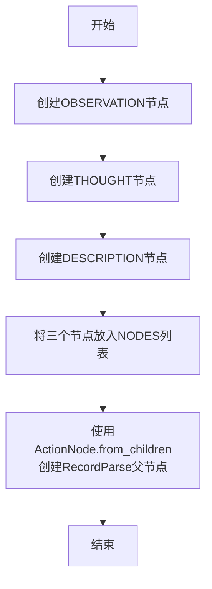

# `.\MetaGPT\metagpt\ext\android_assistant\actions\parse_record_an.py` 详细设计文档

该代码定义了一个用于解析记录的ActionNode结构，通过创建三个子节点（Observation、Thought、Description）来描述UI元素的观察、思考和功能描述，然后将这些子节点组合成一个名为RecordParse的父节点，用于结构化地记录和解析UI交互过程中的信息。

## 整体流程



## 类结构

```
ActionNode (外部类)
├── OBSERVATION (ActionNode实例)
├── THOUGHT (ActionNode实例)
├── DESCRIPTION (ActionNode实例)
└── RECORD_PARSE_NODE (ActionNode实例，父节点)
```

## 全局变量及字段


### `OBSERVATION`
    
用于描述对两张图像的观察结果并区分它们之间差异的ActionNode实例

类型：`ActionNode`
    


### `THOUGHT`
    
用于思考Action对UI元素影响的ActionNode实例

类型：`ActionNode`
    


### `DESCRIPTION`
    
用于简洁描述UI元素功能（不包含数字标签）的ActionNode实例

类型：`ActionNode`
    


### `NODES`
    
包含OBSERVATION、THOUGHT和DESCRIPTION三个ActionNode的列表

类型：`List[ActionNode]`
    


### `RECORD_PARSE_NODE`
    
通过组合NODES列表中的子节点创建的名为'RecordParse'的父ActionNode实例

类型：`ActionNode`
    


### `ActionNode.key`
    
ActionNode的唯一标识符，用于在解析过程中识别节点

类型：`str`
    


### `ActionNode.expected_type`
    
指定该ActionNode期望接收或输出的数据类型

类型：`type`
    


### `ActionNode.instruction`
    
提供关于如何填写或处理该ActionNode的详细指导说明

类型：`str`
    


### `ActionNode.example`
    
提供该ActionNode的示例值或用法，用于指导用户输入

类型：`str`
    
    

## 全局函数及方法

### `ActionNode.from_children`

这是一个类方法，用于根据一组子节点创建一个新的 `ActionNode` 实例。它通过整合所有子节点的信息来构建父节点的结构。

参数：
- `name`：`str`，要创建的新父节点的名称。
- `children`：`list[ActionNode]`，用于构建父节点的子节点列表。

返回值：`ActionNode`，返回一个整合了所有子节点信息的新 `ActionNode` 实例。

#### 流程图

```mermaid
flowchart TD
    A[开始: from_children(name, children)] --> B[初始化空字典 schema]
    B --> C{遍历 children 列表?}
    C -- 是 --> D[获取子节点 key 和子节点本身]
    D --> E[将子节点 key 和子节点结构<br/>添加到 schema 字典]
    E --> C
    C -- 否 --> F[创建并返回新的 ActionNode 实例<br/>key=name, schema=schema]
    F --> G[结束]
```

#### 带注释源码

```python
@classmethod
def from_children(cls, name: str, children: list["ActionNode"]) -> "ActionNode":
    """
    根据一组子节点创建一个新的 ActionNode。
    此方法通过整合所有子节点的信息来构建父节点的结构。

    Args:
        name (str): 要创建的新父节点的名称。
        children (list[ActionNode]): 用于构建父节点的子节点列表。

    Returns:
        ActionNode: 一个整合了所有子节点信息的新 ActionNode 实例。
    """
    # 初始化一个空字典，用于存储子节点的结构信息
    schema = {}
    # 遍历传入的子节点列表
    for child in children:
        # 将每个子节点的键（key）和其对应的结构（child）添加到 schema 字典中
        schema[child.key] = child
    # 使用类方法创建并返回一个新的 ActionNode 实例
    # 新节点的键（key）为传入的 name 参数，其结构（schema）为整合后的 schema 字典
    return cls(key=name, schema=schema)
```

## 关键组件


### ActionNode

ActionNode 是用于构建结构化解析逻辑的核心组件，它定义了数据解析的键（key）、期望类型（expected_type）、指令（instruction）和示例（example），支持通过组合子节点来构建复杂的解析树。

### RecordParse

RecordParse 是一个由多个子 ActionNode（Observation, Thought, Description）组合而成的复合解析节点，用于系统地解析包含观察、思考和UI元素描述信息的记录。


## 问题及建议


### 已知问题

-   **硬编码的节点定义**：`OBSERVATION`、`THOUGHT`、`DESCRIPTION` 三个 `ActionNode` 的定义直接硬编码在模块顶层。这降低了代码的灵活性和可维护性。如果需要修改节点的指令、示例或类型，必须直接修改源代码，而不是通过配置或参数化方式。
-   **缺乏输入验证**：在创建 `ActionNode` 或 `RECORD_PARSE_NODE` 时，代码没有对输入参数（如 `key`、`instruction` 的内容）进行有效性或完整性检查。如果传入无效数据（如空字符串、错误的类型），可能会在后续处理流程中引发难以追踪的错误。
-   **潜在的循环引用风险**：虽然当前代码结构简单，但 `ActionNode` 类可能支持更复杂的嵌套或引用关系。`from_children` 方法如果实现不当，在构建复杂节点树时可能存在循环引用的风险，导致序列化或遍历时出现问题。
-   **示例字段为空**：`OBSERVATION` 和 `THOUGHT` 节点的 `example` 字段为空字符串。这虽然可能符合当前逻辑，但作为示例引导功能的一部分，空的示例可能无法有效指导模型生成符合预期的输出，降低了提示工程的效果。

### 优化建议

-   **配置化节点定义**：建议将 `NODES` 列表中的节点定义（如 `key`、`instruction`、`example` 等）抽取到外部配置文件（如 YAML、JSON）或通过函数参数动态生成。这样可以实现不同场景下的快速切换和配置管理，无需修改代码。
-   **增加参数验证**：在 `ActionNode` 的初始化方法或 `from_children` 方法中，增加对关键参数的验证逻辑。例如，检查 `key` 是否为非空字符串，`expected_type` 是否为合法类型，`instruction` 是否提供等。验证失败时应抛出明确的异常。
-   **提供节点树循环检测**：如果 `ActionNode` 支持复杂的子节点嵌套，建议在 `from_children` 或相关构建方法中实现一个简单的循环引用检测机制（例如，使用已访问节点集合进行深度优先搜索），并在检测到循环时抛出异常，防止构建无效的节点结构。
-   **完善示例内容**：为 `OBSERVATION` 和 `THOUGHT` 节点提供有意义的 `example` 值。这些示例应清晰展示期望的输出格式和内容，能更好地引导语言模型生成结构化和高质量的结果，提升整个解析流程的可靠性。
-   **考虑使用枚举或常量定义 Key**：`OBSERVATION`、`THOUGHT`、`DESCRIPTION` 的 `key` 值目前是散落的字符串。建议将这些 `key` 定义为模块级别的常量或使用枚举（`Enum`），以避免在代码其他部分引用时出现拼写错误，提高代码的健壮性和可读性。


## 其它


### 设计目标与约束

本模块的设计目标是创建一个结构化的解析节点（`RecordParse`），用于在UI自动化测试或交互场景中，系统地记录和解析操作过程中的观察、思考和UI元素描述。它作为`ActionNode`体系的一部分，旨在提供一种可扩展、类型安全的方式来定义和组合不同的信息记录单元。核心约束包括：1) 必须基于现有的`ActionNode`基类进行构建，遵循其接口契约；2) 定义的子节点（`OBSERVATION`, `THOUGHT`, `DESCRIPTION`）需具备清晰的指令（`instruction`）和预期的数据类型（`expected_type`），以确保生成内容的格式和质量；3) 最终组合的`RECORD_PARSE_NODE`应能作为一个完整的、可序列化或可进一步处理的数据结构单元。

### 错误处理与异常设计

当前代码片段未显式包含错误处理逻辑。错误处理主要依赖于底层的`ActionNode`类及其`from_children`工厂方法。潜在的错误场景包括：1) 在创建子节点或组合节点时，如果传入的参数不符合`ActionNode`的构造要求（例如，`key`为空或类型错误），可能会引发`ValueError`或`TypeError`。2) 在使用`RECORD_PARSE_NODE`进行数据填充或验证时，如果提供的值与`expected_type`（当前均为`str`）不匹配，`ActionNode`的内部机制可能会抛出类型校验异常。模块本身没有定义自定义异常，错误处理策略是向上层调用者传播底层`ActionNode`引发的异常，由调用方根据上下文决定如何处理（如记录日志、重试或终止流程）。

### 数据流与状态机

本模块定义的是静态的数据结构模板，而非运行时状态机。其数据流是声明式的：1) **定义阶段**：代码执行时，依次创建三个独立的`ActionNode`实例（`OBSERVATION`, `THOUGHT`, `DESCRIPTION`），每个实例封装了键名、类型期望、指令和示例。2) **组合阶段**：通过`ActionNode.from_children`方法，将上述三个节点组合成一个名为`RecordParse`的父节点（`RECORD_PARSE_NODE`）。这个父节点内部管理着子节点的有序集合。3) **使用阶段**：在后续的业务逻辑中，`RECORD_PARSE_NODE`作为一个模板，指导如何收集和组织“观察”、“思考”、“描述”这三类字符串信息。数据填充通常发生在外部，填充后的节点对象可能被转换为字典、JSON或用于生成报告，构成一个从模板定义到数据实例化的单向数据流。

### 外部依赖与接口契约

1.  **外部依赖**：
    *   **内部依赖**：强依赖于`metagpt.actions.action_node`模块中的`ActionNode`类。这是构建所有节点的基类，提供了节点定义、组合（`from_children`）及后续操作（如数据验证、提取）的核心能力。
    *   **标准库**：无特殊第三方依赖，仅使用Python标准库。

2.  **接口契约**：
    *   **导出接口**：模块对外暴露了四个常量：`OBSERVATION`, `THOUGHT`, `DESCRIPTION` 和 `RECORD_PARSE_NODE`。它们都是`ActionNode`类型的实例。
    *   **使用契约**：调用者应通过`RECORD_PARSE_NODE`来获取完整的记录解析结构。`OBSERVATION`等子节点也可单独使用，但主要目的是作为`RECORD_PARSE_NODE`的组成部分。调用者需要遵循`ActionNode`类的公共API来操作这些节点，例如调用其`fill`或`to_dict`等方法。
    *   **预期行为**：`RECORD_PARSE_NODE`作为一个复合节点，当其方法被调用时，应能正确地将其逻辑传播到所有子节点（`OBSERVATION`, `THOUGHT`, `DESCRIPTION`）。

    