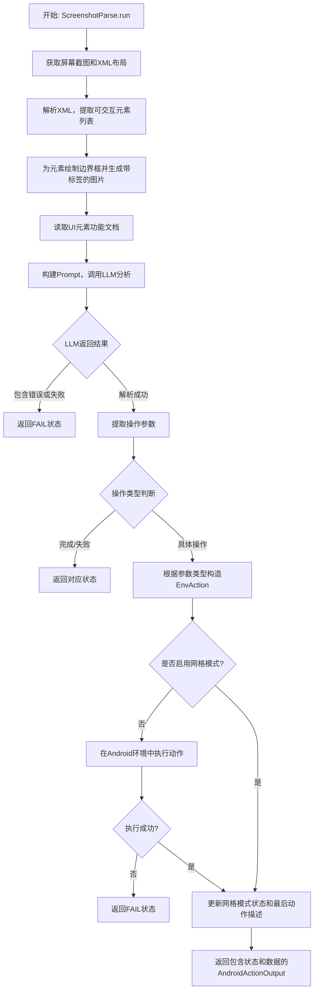
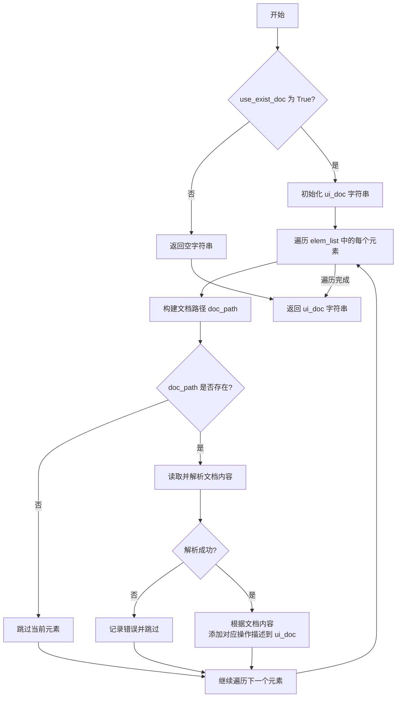

# `.\MetaGPT\metagpt\ext\android_assistant\actions\screenshot_parse.py` 详细设计文档

该代码实现了一个名为 `ScreenshotParse` 的动作（Action），其核心功能是解析Android设备的屏幕截图和UI布局XML文件，通过大语言模型（LLM）分析当前屏幕状态、任务描述和用户文档，生成下一步在Android环境中的具体操作指令（如点击、输入、滑动等），并执行该操作以驱动自动化任务。

## 整体流程



## 类结构

```
Action (来自 metagpt.actions.action)
└── ScreenshotParse
    ├── 字段: name
    ├── 方法: _makeup_ui_document
    └── 方法: run
```

## 全局变量及字段


### `ScreenshotParse.name`
    
动作的名称，标识该动作的类型，此处固定为'ScreenshotParse'。

类型：`str`
    
    

## 全局函数及方法

### `ScreenshotParse._makeup_ui_document`

该方法用于根据给定的UI元素列表和文档目录，生成一个描述UI元素功能的文档字符串。它读取每个元素对应的文档文件，解析其内容，并将不同操作类型（如点击、文本输入、长按、滑动）的文档描述整合到一个统一的字符串中，用于后续的AI提示或日志记录。

参数：

- `elem_list`：`list[AndroidElement]`，包含Android UI元素的列表，每个元素都有唯一的标识符（uid）。
- `docs_idr`：`Path`，文档目录的路径，其中存储了以元素uid命名的文档文件。
- `use_exist_doc`：`bool`，指示是否使用现有文档的标志。如果为False，则返回空字符串。

返回值：`str`，返回一个格式化的UI文档字符串，描述了每个UI元素的功能。如果`use_exist_doc`为False或没有找到有效的文档，则返回空字符串。

#### 流程图



#### 带注释源码

```python
def _makeup_ui_document(self, elem_list: list[AndroidElement], docs_idr: Path, use_exist_doc: bool = True) -> str:
    # 如果不需要使用现有文档，直接返回空字符串
    if not use_exist_doc:
        return ""

    # 初始化UI文档字符串的头部
    ui_doc = """
You also have access to the following documentations that describes the functionalities of UI 
elements you can interact on the screen. These docs are crucial for you to determine the target of your 
next action. You should always prioritize these documented elements for interaction: """
    
    # 遍历UI元素列表
    for i, elem in enumerate(elem_list):
        # 构建每个元素对应的文档文件路径
        doc_path = docs_idr.joinpath(f"{elem.uid}.txt")
        # 如果文档文件不存在，跳过当前元素
        if not doc_path.exists():
            continue
        try:
            # 尝试读取并解析文档文件内容（假设为Python字面量）
            doc_content = ast.literal_eval(doc_path.read_text())
        except Exception as exp:
            # 如果解析失败，记录错误并跳过当前元素
            logger.error(f"ast parse doc: {doc_path} failed, exp: {exp}")
            continue

        # 添加当前元素的文档标题，使用数字标签（i+1）
        ui_doc += f"Documentation of UI element labeled with the numeric tag '{i + 1}':\n"
        
        # 如果文档中包含'tap'（点击）描述，添加到UI文档
        if doc_content["tap"]:
            ui_doc += f"This UI element is clickable. {doc_content['tap']}\n\n"
        
        # 如果文档中包含'text'（文本输入）描述，添加到UI文档
        if doc_content["text"]:
            ui_doc += (
                f"This UI element can receive text input. The text input is used for the following "
                f"purposes: {doc_content['text']}\n\n"
            )
        
        # 如果文档中包含'long_press'（长按）描述，添加到UI文档
        if doc_content["long_press"]:
            ui_doc += f"This UI element is long clickable. {doc_content['long_press']}\n\n"
        
        # 如果文档中包含'v_swipe'（垂直滑动）描述，添加到UI文档
        if doc_content["v_swipe"]:
            ui_doc += (
                f"This element can be swiped directly without tapping. You can swipe vertically on "
                f"this UI element. {doc_content['v_swipe']}\n\n"
            )
        
        # 如果文档中包含'h_swipe'（水平滑动）描述，添加到UI文档
        if doc_content["h_swipe"]:
            ui_doc += (
                f"This element can be swiped directly without tapping. You can swipe horizontally on "
                f"this UI element. {doc_content['h_swipe']}\n\n"
            )
    
    # 返回构建好的UI文档字符串
    return ui_doc
```

### `ScreenshotParse.run`

该方法负责解析Android设备屏幕截图和UI布局XML，提取可交互元素，生成带标注的截图，并调用大语言模型（LLM）来理解当前屏幕状态和用户任务，最终将LLM的指令解析为具体的Android环境操作（如点击、输入、滑动等）或控制标志（如是否启用网格模式）。

参数：

- `round_count`：`int`，当前任务执行的轮次计数，用于生成唯一的截图和XML文件名。
- `task_desc`：`str`，用户任务的自然语言描述。
- `last_act`：`str`，上一轮执行的操作描述，用于提供上下文。
- `task_dir`：`Path`，用于存储本轮任务相关文件（如截图、XML）的目录路径。
- `docs_dir`：`Path`，存储UI元素功能文档的目录路径。
- `grid_on`：`bool`，指示是否启用网格交互模式的标志。
- `env`：`AndroidEnv`，Android环境实例，用于执行观察（获取截图/XML）和动作（点击、输入等）。

返回值：`AndroidActionOutput`，包含动作执行状态（成功、失败、完成）以及可能的数据（如是否保持网格模式、最后操作描述）。

#### 流程图

```mermaid
graph TD
    A[开始: ScreenshotParse.run] --> B[创建任务和文档目录]
    B --> C[通过env.observe获取截图和XML]
    C --> D{截图和XML文件是否存在？}
    D -- 否 --> E[返回 FAIL 状态]
    D -- 是 --> F[遍历XML，提取clickable和focusable元素]
    F --> G[合并元素列表，过滤过近的focusable元素]
    G --> H[在截图上绘制元素边界框，生成带标签的截图]
    H --> I[将带标签截图编码为Base64]
    I --> J[根据grid_on选择提示词模板]
    J --> K[调用_makeup_ui_document生成UI文档字符串]
    K --> L[组装上下文，调用LLM（SCREENSHOT_PARSE_NODE）进行解析]
    L --> M{LLM返回内容是否包含'error'？}
    M -- 是 --> N[返回 FAIL 状态]
    M -- 否 --> O[记录操作日志（OpLogItem）]
    O --> P[提取LLM指令内容为操作参数op_param]
    P --> Q{根据op_param.param_state判断}
    Q -- FINISH --> R[返回 FINISH 状态]
    Q -- FAIL --> S[返回 FAIL 状态]
    Q -- 其他 --> T[解析op_param类型，构造对应的EnvAction]
    T --> U{操作是否为GridOpParam（仅切换网格模式）？}
    U -- 是 --> V[设置grid_on=True]
    U -- 否 --> W[执行env.step(action)并检查结果]
    W --> X{动作执行结果是否为ADB_EXEC_FAIL？}
    X -- 是 --> Y[返回 FAIL 状态]
    X -- 否 --> Z[根据op_param.act_name更新grid_on标志]
    V --> Z
    Z --> AA[返回SUCCESS状态及数据 grid_on, last_act]
    E --> AB[结束]
    N --> AB
    R --> AB
    S --> AB
    Y --> AB
    AA --> AB
```

#### 带注释源码

```python
    async def run(
        self,
        round_count: int,          # 当前执行轮次，用于生成唯一文件名
        task_desc: str,            # 用户任务描述
        last_act: str,             # 上一轮执行的操作描述
        task_dir: Path,            # 任务文件存储目录
        docs_dir: Path,            # UI元素文档存储目录
        grid_on: bool,             # 是否启用网格模式的标志
        env: AndroidEnv,           # Android环境交互接口
    ):
        # 1. 确保必要的目录存在
        extra_config = config.extra
        for path in [task_dir, docs_dir]:
            path.mkdir(parents=True, exist_ok=True)

        # 2. 从Android环境获取当前屏幕的截图和UI布局XML
        screenshot_path: Path = env.observe(
            EnvObsParams(obs_type=EnvObsType.GET_SCREENSHOT, ss_name=f"{round_count}_before", local_save_dir=task_dir)
        )
        xml_path: Path = env.observe(
            EnvObsParams(obs_type=EnvObsType.GET_XML, xml_name=f"{round_count}", local_save_dir=task_dir)
        )
        # 如果获取文件失败，直接返回失败状态
        if not screenshot_path.exists() or not xml_path.exists():
            return AndroidActionOutput(action_state=RunState.FAIL)

        # 3. 解析XML，提取可交互的UI元素
        clickable_list = []
        focusable_list = []
        traverse_xml_tree(xml_path, clickable_list, "clickable", True)
        traverse_xml_tree(xml_path, focusable_list, "focusable", True)
        elem_list: list[AndroidElement] = clickable_list.copy()
        # 将focusable但未与clickable元素位置过近的元素加入列表
        for elem in focusable_list:
            bbox = elem.bbox
            center = (bbox[0][0] + bbox[1][0]) // 2, (bbox[0][1] + bbox[1][1]) // 2
            close = False
            for e in clickable_list:
                bbox = e.bbox
                center_ = (bbox[0][0] + bbox[1][0]) // 2, (bbox[0][1] + bbox[1][1]) // 2
                dist = (abs(center[0] - center_[0]) ** 2 + abs(center[1] - center_[1]) ** 2) ** 0.5
                if dist <= extra_config.get("min_dist", 30):
                    close = True
                    break
            if not close:
                elem_list.append(elem)

        # 4. 在原始截图上绘制所有可交互元素的边界框，生成带标签的截图
        screenshot_labeled_path = task_dir.joinpath(f"{round_count}_labeled.png")
        draw_bbox_multi(screenshot_path, screenshot_labeled_path, elem_list)
        # 将带标签的截图编码为Base64，供LLM处理
        img_base64 = encode_image(screenshot_labeled_path)

        # 5. 根据是否启用网格模式，选择对应的提示词模板
        parse_template = screenshot_parse_with_grid_template if grid_on else screenshot_parse_template

        # 如果启用网格模式，在截图上绘制网格并获取行列数
        if grid_on:
            env.rows, env.cols = draw_grid(screenshot_path, task_dir / f"{round_count}_grid.png")

        # 6. 从文档目录生成UI元素的补充说明文档字符串
        ui_doc = self._makeup_ui_document(elem_list, docs_dir)
        # 7. 组装完整的上下文信息（任务、历史、UI文档），调用LLM进行解析
        context = parse_template.format(ui_document=ui_doc, task_description=task_desc, last_act=last_act)
        node = await SCREENSHOT_PARSE_NODE.fill(context=context, llm=self.llm, images=[img_base64])

        # 8. 检查LLM返回是否包含错误
        if "error" in node.content:
            return AndroidActionOutput(action_state=RunState.FAIL)

        # 9. 记录本次操作的日志（用于调试和追踪）
        prompt = node.compile(context=context, schema="json", mode="auto")
        OpLogItem(step=round_count, prompt=prompt, image=str(screenshot_labeled_path), response=node.content)

        # 10. 从LLM的返回内容中提取结构化的操作参数
        op_param = screenshot_parse_extract(node.instruct_content.model_dump(), grid_on)
        # 11. 根据操作参数的状态进行判断
        if op_param.param_state == RunState.FINISH:
            logger.info(f"op_param: {op_param}")
            return AndroidActionOutput(action_state=RunState.FINISH)
        if op_param.param_state == RunState.FAIL:
            return AndroidActionOutput(action_state=RunState.FAIL)

        # 12. 更新`last_act`描述
        last_act = op_param.last_act
        # 13. 根据操作参数的具体类型，构造对应的Android环境动作(EnvAction)
        if isinstance(op_param, TapOpParam):
            # 点击操作：根据元素索引获取中心坐标
            x, y = elem_bbox_to_xy(elem_list[op_param.area - 1].bbox)
            action = EnvAction(action_type=EnvActionType.SYSTEM_TAP, coord=(x, y))
        elif isinstance(op_param, TextOpParam):
            # 文本输入操作
            action = EnvAction(action_type=EnvActionType.USER_INPUT, input_txt=op_param.input_str)
        elif isinstance(op_param, LongPressOpParam):
            # 长按操作
            x, y = elem_bbox_to_xy(elem_list[op_param.area - 1].bbox)
            action = EnvAction(action_type=EnvActionType.USER_LONGPRESS, coord=(x, y))
        elif isinstance(op_param, SwipeOpParam):
            # 滑动操作（基于元素）
            x, y = elem_bbox_to_xy(elem_list[op_param.area - 1].bbox)
            action = EnvAction(
                action_type=EnvActionType.USER_SWIPE, coord=(x, y), orient=op_param.swipe_orient, dist=op_param.dist
            )
        elif isinstance(op_param, GridOpParam):
            # 网格模式操作（仅切换模式，不执行具体动作）
            grid_on = True
        elif isinstance(op_param, TapGridOpParam) or isinstance(op_param, LongPressGridOpParam):
            # 网格模式下的点击或长按：根据网格区域计算坐标
            x, y = area_to_xy(op_param.area, op_param.subarea, env.width, env.height, env.rows, env.cols)
            if isinstance(op_param, TapGridOpParam):
                action = EnvAction(action_type=EnvActionType.SYSTEM_TAP, coord=(x, y))
            else:
                # LongPressGridOpParam
                action = EnvAction(action_type=EnvActionType.USER_LONGPRESS, coord=(x, y))
        elif isinstance(op_param, SwipeGridOpParam):
            # 网格模式下的滑动（从起点网格到终点网格）
            start_x, start_y = area_to_xy(
                op_param.start_area, op_param.start_subarea, env.width, env.height, env.rows, env.cols
            )
            end_x, end_y = area_to_xy(
                op_param.end_area, op_param.end_subarea, env.width, env.height, env.rows, env.cols
            )
            action = EnvAction(
                action_type=EnvActionType.USER_SWIPE_TO, coord=(start_x, start_y), tgt_coord=(end_x, end_y)
            )

        # 14. 如果当前不是网格模式，或者操作不是单纯的GridOpParam，则执行构造好的动作
        if not grid_on:
            obs, _, _, _, info = env.step(action)
            action_res = info["res"]
            # 检查动作执行结果（如ADB命令执行失败）
            if action_res == ADB_EXEC_FAIL:
                return AndroidActionOutput(action_state=RunState.FAIL)

        # 15. 根据操作名称决定下一轮是否保持网格模式（例如，操作名为'grid'则保持）
        if op_param.act_name != "grid":
            grid_on = False

        # 16. 返回成功状态，并携带网格模式标志和更新后的最后操作描述
        return AndroidActionOutput(data={"grid_on": grid_on, "last_act": last_act})
```

## 关键组件


### 屏幕截图与UI元素解析

该组件负责从Android环境中获取当前屏幕的截图和UI布局信息（XML），解析出可交互的UI元素（如可点击、可聚焦的元素），并为这些元素生成带标注的可视化图像，作为后续LLM推理的输入。

### 基于LLM的UI操作决策

该组件利用大型语言模型（LLM）分析标注后的屏幕截图、任务描述、历史操作以及可选的UI功能文档，生成下一步在Android界面上的具体操作指令（如点击、输入、滑动等）。

### UI元素功能文档集成

该组件支持读取并整合预定义的UI元素功能文档，为LLM提供关于特定UI元素的额外功能描述（如点击后效果、输入框用途等），以辅助其做出更准确的交互决策。

### 网格化交互支持

该组件支持将屏幕划分为网格，并允许LLM基于网格坐标（如`TapGridOpParam`）来指定操作位置，这为处理动态或难以精确定位的UI元素提供了另一种交互策略。

### 操作参数提取与转换

该组件负责从LLM的原始输出中提取结构化的操作参数（`OpParam`），并将其转换为Android环境（`AndroidEnv`）能够执行的标准动作指令（`EnvAction`）。

### 操作执行与状态反馈

该组件在决策出具体操作后，会调用Android环境执行该操作，并根据执行结果（成功或失败）更新任务执行状态，将结果封装返回给调用方。


## 问题及建议


### 已知问题

-   **硬编码的配置参数**：代码中使用了 `extra_config.get("min_dist", 30)` 来获取元素合并的距离阈值，但 `min_dist` 这个键名是硬编码的。如果配置结构变更或键名拼写错误，会导致使用默认值30，可能引发意料之外的行为。
-   **异常处理不完整**：在 `_makeup_ui_document` 方法中，读取文档文件时使用了 `ast.literal_eval` 并捕获了通用的 `Exception`。虽然记录了错误，但异常被吞没后，方法继续执行，可能导致后续逻辑基于不完整或错误的文档内容运行，且未向调用者明确返回错误状态。
-   **潜在的竞态条件**：代码先通过 `env.observe` 获取截图和XML文件路径，然后检查文件是否存在。在检查文件存在与后续读取文件之间，如果文件被其他进程删除或修改，可能导致读取失败或数据不一致，但当前逻辑未处理这种场景。
-   **条件逻辑分支遗漏**：在 `run` 方法的操作参数处理部分，对于 `GridOpParam` 类型，仅设置了 `grid_on = True`，但没有创建对应的 `EnvAction` 对象。虽然这可能符合某种设计（例如仅切换模式而不执行动作），但与其他操作分支（如Tap, Swipe等）相比，逻辑不统一，容易造成混淆，且如果后续步骤依赖 `action` 变量，可能引发错误。
-   **代码重复与魔法数字**：在计算元素中心点距离时，使用了硬编码的默认距离 `30`（在 `extra_config.get("min_dist", 30)` 中）。这个“魔法数字”分散在代码中，降低了可维护性。同时，中心点距离计算逻辑（判断 `focusable` 元素是否与 `clickable` 元素过近）的代码是内联的，如果该逻辑需要复用或修改，维护成本较高。

### 优化建议

-   **提取配置常量**：将 `"min_dist"` 这样的配置键名定义为模块级常量（如 `CONFIG_KEY_MIN_DIST`），提高代码可读性，并降低因拼写错误导致的问题风险。
-   **细化异常处理与状态返回**：在 `_makeup_ui_document` 方法中，应考虑更具体的异常类型（如 `SyntaxError`, `ValueError`, `FileNotFoundError`），并根据异常严重程度决定是跳过当前文档、记录警告，还是向上抛出异常或返回一个明确的错误标识。`run` 方法应能处理来自 `_makeup_ui_document` 的失败信号。
-   **增强文件操作健壮性**：在检查文件存在性后，可以考虑使用 `try-except` 块包装文件读取操作，以处理文件访问冲突或突然不可用的情况。或者，如果系统设计允许，可以增加重试机制。
-   **统一操作参数处理逻辑**：重新审视 `GridOpParam` 的处理逻辑。如果其目的确实是仅切换网格模式而不执行环境动作，应在该分支添加明确的注释说明意图，并确保后续代码不依赖未初始化的 `action` 变量。或者，考虑是否需要一个无操作（`EnvActionType.NOOP`）的动作类型来保持逻辑一致性。
-   **封装距离计算逻辑**：将判断两个元素是否“过近”的逻辑（包括中心点计算和距离比较）抽取为一个独立的工具函数（例如 `def are_elements_too_close(elem1, elem2, min_distance: float) -> bool`）。这可以提高代码复用性，并使 `run` 方法中的主逻辑更清晰。同时，将默认距离 `30` 定义为一个有名称的常量。
-   **引入类型注解与验证**：虽然已有类型提示，但对于复杂的数据结构（如从 `ast.literal_eval` 解析出的 `doc_content` 字典），可以引入Pydantic模型或使用TypedDict进行更严格的类型定义和验证，确保数据结构符合预期。
-   **优化日志信息**：当前日志在解析文档失败时记录了异常，但在其他关键步骤（如文件不存在、LLM返回错误、动作执行失败）仅返回状态而未记录详细上下文。建议在关键决策点、失败点增加更详细的日志（如记录文件路径、操作参数内容等），便于调试和监控。


## 其它


### 设计目标与约束

本模块（`ScreenshotParse`）是Android自动化任务执行流程中的核心动作（Action）。其主要设计目标是在给定任务描述、上一轮动作结果和当前设备屏幕状态（截图和UI布局XML）的基础上，通过大语言模型（LLM）分析，决策出下一步在Android设备上执行的具体操作（如点击、输入、滑动等），并驱动环境（`AndroidEnv`）执行该操作。核心约束包括：1) 必须与`AndroidEnv`环境紧密交互以获取观察（截图、XML）和执行动作；2) 需要处理LLM输出的不确定性，将其解析为结构化的操作参数；3) 需支持基于网格的精细化操作模式；4) 性能需满足交互式任务执行的实时性要求。

### 错误处理与异常设计

模块的错误处理主要围绕外部依赖操作（如环境观察、LLM调用、文件操作）的失败和LLM输出解析异常展开。关键设计包括：1) 当`env.observe`获取截图或XML失败（文件不存在）时，直接返回`RunState.FAIL`状态。2) 在调用LLM（`SCREENSHOT_PARSE_NODE.fill`）后，检查响应内容是否包含“error”关键字，若是则返回`RunState.FAIL`。3) 在解析LLM输出的结构化数据（`screenshot_parse_extract`）后，根据返回的操作参数状态（`param_state`）决定流程走向：`FINISH`表示任务完成，`FAIL`表示解析失败，否则继续执行。4) 当通过`env.step`执行动作后，检查返回信息中的`action_res`，若为`ADB_EXEC_FAIL`则返回`RunState.FAIL`。5) 在读取UI元素文档文件时使用`ast.literal_eval`并捕获异常，记录错误但允许流程继续。整体错误处理策略是“快速失败”，在关键步骤失败时中止当前轮次，向上层返回失败状态，由任务执行器决定重试或终止。

### 数据流与状态机

模块的数据流始于输入参数（轮次计数、任务描述、上一动作、路径、环境实例等）。核心流程为：1) **观察阶段**：通过`AndroidEnv`获取当前屏幕截图和UI层次结构XML。2) **预处理阶段**：解析XML，提取可点击（`clickable`）和可聚焦（`focusable`）的UI元素，合并去重，并在截图上绘制标注框。3) **决策阶段**：将标注后的截图、任务上下文、UI文档（如存在）组合成提示词（Prompt），调用LLM进行分析。LLM输出期望的下一步操作描述。4) **解析与执行阶段**：将LLM的自然语言输出解析为结构化的操作参数对象（如`TapOpParam`, `TextOpParam`等）。根据参数类型，将其转换为`AndroidEnv`可执行的`EnvAction`指令，并调用`env.step`执行。5) **状态输出阶段**：根据各阶段结果，组装并返回`AndroidActionOutput`对象，其中包含动作执行状态（`FINISH`, `FAIL`或继续）、以及是否启用网格模式、最新的动作描述等数据。状态机隐含在`RunState`枚举和`AndroidActionOutput.action_state`中，驱动上层循环的继续、完成或失败处理。

### 外部依赖与接口契约

1.  **`AndroidEnv` 环境**：是本模块最主要的外部依赖。契约包括：
    *   **观察接口**：`observe(params: EnvObsParams) -> Path`，必须返回截图或XML文件的本地路径。
    *   **执行接口**：`step(action: EnvAction) -> Tuple[obs, reward, done, truncated, info]`，执行动作并返回结果，其中`info`字典需包含`res`键表示ADB执行结果。
    *   **属性**：需提供`width`, `height`, `rows`, `cols`等屏幕和网格信息。
2.  **大语言模型 (LLM) 服务**：通过`SCREENSHOT_PARSE_NODE`（一个`ActionNode`实例）进行交互。契约是调用其`fill`方法并传入上下文和图像，返回一个包含`content`和`instruct_content`的节点对象。`instruct_content`需能解析为预定义的操作参数模式（Schema）。
3.  **配置文件**：依赖`config.extra`获取额外配置，例如元素去重的最小距离(`min_dist`)。
4.  **文件系统**：依赖指定的`task_dir`和`docs_dir`路径进行读写操作，包括保存截图、XML、标注图、网格图以及读取UI元素文档。
5.  **工具函数库**：重度依赖`metagpt.ext.android_assistant.utils.utils`和`metagpt.utils.common`中的一系列工具函数，如XML遍历、坐标转换、图像绘制、Base64编码等。这些函数的行为是隐式契约。

### 安全与合规性考虑

1.  **输入验证**：对从LLM解析出的操作参数（如`op_param.area`索引）在使用前应进行边界检查，确保其引用`elem_list`中的有效元素，防止索引越界。当前代码`elem_list[op_param.area - 1]`存在潜在风险。
2.  **敏感信息处理**：`TextOpParam`中包含用户输入文本（`input_str`），该文本可能来自LLM生成或任务描述。需注意避免将敏感信息（如密码）明文记录在日志或文件中。当前代码未显示有特殊处理。
3.  **资源管理**：模块会生成多个图像文件（原始截图、标注图、网格图）。在长时间运行的任务中，需要考虑定期清理或使用临时目录，避免磁盘空间耗尽。
4.  **外部命令执行**：通过`AndroidEnv`执行的ADB命令本质上是系统命令。需确保`AndroidEnv`的实现对命令参数进行了适当的消毒（Sanitization），防止命令注入攻击。本模块不直接构造ADB命令，但传递了坐标等参数。
5.  **依赖许可**：使用的LLM服务需遵守其API的使用条款。生成的图像标注可能涉及UI设计的知识产权，需在合规范围内使用。

    