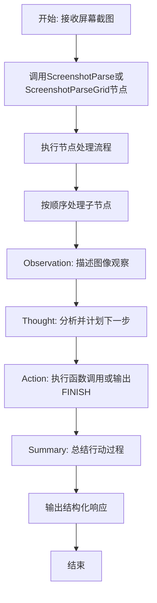
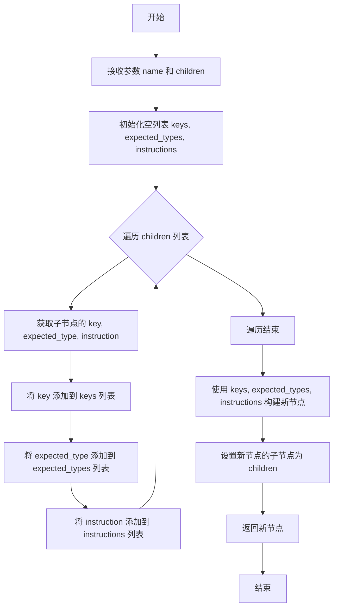

# `.\MetaGPT\metagpt\ext\android_assistant\actions\screenshot_parse_an.py` 详细设计文档

该代码文件定义了一个用于解析屏幕截图的结构化处理流程。它通过创建一组预定义的ActionNode（动作节点）来构建一个决策框架，该框架引导AI系统观察图像、思考下一步、执行动作并总结过程。核心功能是提供两种解析模式（标准模式和网格模式）的节点配置，用于在自动化任务中处理视觉信息并生成结构化的响应。

## 整体流程



## 类结构

```
ActionNode (来自metagpt.actions.action_node)
├── OBSERVATION (ActionNode实例)
├── THOUGHT (ActionNode实例)
├── ACTION (ActionNode实例)
├── SUMMARY (ActionNode实例)
├── SUMMARY_GRID (ActionNode实例)
├── SCREENSHOT_PARSE_NODE (组合节点)
└── SCREENSHOT_PARSE_GRID_NODE (组合节点)
```

## 全局变量及字段


### `OBSERVATION`
    
用于描述图像观察结果的ActionNode实例，包含观察指令和示例

类型：`ActionNode`
    


### `THOUGHT`
    
用于描述下一步思考的ActionNode实例，包含思考指令和示例

类型：`ActionNode`
    


### `ACTION`
    
用于描述执行动作的ActionNode实例，包含动作指令和示例，支持输出函数调用或FINISH

类型：`ActionNode`
    


### `SUMMARY`
    
用于总结过去动作的ActionNode实例，包含总结指令和示例，要求不包含数字标签

类型：`ActionNode`
    


### `SUMMARY_GRID`
    
用于总结过去动作的ActionNode实例，包含总结指令和示例，要求不包含网格区域编号

类型：`ActionNode`
    


### `NODES`
    
包含OBSERVATION、THOUGHT、ACTION、SUMMARY四个ActionNode的列表

类型：`List[ActionNode]`
    


### `NODES_GRID`
    
包含OBSERVATION、THOUGHT、ACTION、SUMMARY_GRID四个ActionNode的列表

类型：`List[ActionNode]`
    


### `SCREENSHOT_PARSE_NODE`
    
通过NODES列表创建的复合ActionNode，用于解析屏幕截图

类型：`ActionNode`
    


### `SCREENSHOT_PARSE_GRID_NODE`
    
通过NODES_GRID列表创建的复合ActionNode，用于解析网格化屏幕截图

类型：`ActionNode`
    


### `ActionNode.key`
    
ActionNode的键名，用于标识该节点的类型或名称

类型：`str`
    


### `ActionNode.expected_type`
    
ActionNode期望的输出数据类型，用于验证节点输出

类型：`type`
    


### `ActionNode.instruction`
    
ActionNode的指令描述，指导用户如何填写该节点的内容

类型：`str`
    


### `ActionNode.example`
    
ActionNode的示例内容，展示该节点的预期输出格式

类型：`str`
    
    

## 全局函数及方法

### `ActionNode.from_children`

该方法是一个类方法，用于根据提供的子节点列表创建一个新的 `ActionNode` 实例。它通过整合所有子节点的键、期望类型和指令来构建新节点的属性，并设置新节点的子节点列表。

参数：

- `name`：`str`，要创建的新 `ActionNode` 的名称。
- `children`：`List[ActionNode]`，用于构建新节点的子节点列表。

返回值：`ActionNode`，返回一个根据提供的子节点列表构建的新 `ActionNode` 实例。

#### 流程图



#### 带注释源码

```python
@classmethod
def from_children(cls, name: str, children: List["ActionNode"]) -> "ActionNode":
    """
    根据提供的子节点列表创建一个新的 ActionNode 实例。

    该方法通过整合所有子节点的键、期望类型和指令来构建新节点的属性，
    并设置新节点的子节点列表。

    Args:
        name (str): 要创建的新 ActionNode 的名称。
        children (List[ActionNode]): 用于构建新节点的子节点列表。

    Returns:
        ActionNode: 返回一个根据提供的子节点列表构建的新 ActionNode 实例。
    """
    # 初始化空列表，用于存储子节点的键、期望类型和指令
    keys = []
    expected_types = []
    instructions = []

    # 遍历子节点列表，提取每个子节点的属性
    for child in children:
        keys.append(child.key)  # 添加子节点的键
        expected_types.append(child.expected_type)  # 添加子节点的期望类型
        instructions.append(child.instruction)  # 添加子节点的指令

    # 使用提取的属性创建新的 ActionNode 实例
    # 新节点的键由所有子节点的键拼接而成，期望类型和指令也类似处理
    node = cls(
        key=", ".join(keys),  # 将子节点的键用逗号和空格拼接
        expected_type=expected_types,  # 期望类型为子节点期望类型的列表
        instruction="\n".join(instructions),  # 指令为子节点指令的拼接，每个指令占一行
        example="",  # 示例为空字符串
    )
    # 设置新节点的子节点列表为提供的 children
    node.children = children
    # 返回新创建的节点
    return node
```

## 关键组件


### ActionNode 类

用于定义和构建结构化动作节点的核心类，每个节点代表一个特定的数据字段（如观察、思考、行动、总结），并包含键名、期望类型、指令和示例等信息，支持通过组合子节点来构建更复杂的节点结构。

### 结构化节点定义（OBSERVATION, THOUGHT, ACTION, SUMMARY, SUMMARY_GRID）

预定义的、标准化的动作节点实例，分别对应智能体决策循环中的关键步骤：观察环境、进行思考、决定行动、生成总结。这些节点为解析屏幕截图等任务提供了标准化的输入/输出模板。

### 节点集合（NODES, NODES_GRID）

由预定义节点组成的列表，用于快速构建完整的动作解析流程。`NODES` 使用标准总结节点，而 `NODES_GRID` 使用针对网格区域场景调整了指令的总结节点。

### 复合动作节点（SCREENSHOT_PARSE_NODE, SCREENSHOT_PARSE_GRID_NODE）

通过 `ActionNode.from_children` 方法创建的复合节点，将多个基础节点（观察、思考、行动、总结）组合成一个逻辑单元。`SCREENSHOT_PARSE_NODE` 用于通用屏幕截图解析，`SCREENSHOT_PARSE_GRID_NODE` 专门用于处理带有网格区域的屏幕截图解析。


## 问题及建议


### 已知问题

-   **硬编码的节点定义**：`OBSERVATION`、`THOUGHT`、`ACTION`、`SUMMARY` 和 `SUMMARY_GRID` 等 `ActionNode` 实例的定义是硬编码在模块顶层的。这降低了代码的灵活性和可配置性。如果需要调整节点的指令（instruction）或增加新的节点类型，必须直接修改源代码，而不是通过配置或参数化方式实现。
-   **存在高度相似的重复代码**：`SUMMARY` 和 `SUMMARY_GRID` 两个节点的定义几乎完全相同，唯一的区别在于 `instruction` 字段中关于“不包含什么”的提示语（一个是不包含“numeric tag”，另一个是不包含“grid area number”）。这种细微差别通过创建两个几乎完全相同的对象来实现，违反了 DRY（Don't Repeat Yourself）原则，增加了维护成本。
-   **全局变量命名可能引起混淆**：`NODES` 和 `NODES_GRID` 这两个列表变量名虽然表达了用途，但未能清晰、直接地反映其核心差异（即包含的 `SUMMARY` 节点不同）。在更大的代码库中，仅凭变量名可能难以立即理解其确切内容。
-   **缺乏输入验证与错误处理**：代码在创建 `ActionNode` 和组合成 `SCREENSHOT_PARSE_NODE` 时，没有对输入参数（如 `key`, `instruction` 等）进行有效性验证。虽然当前是静态定义，但如果未来改为动态生成，缺少验证机制可能导致运行时错误。
-   **模块职责单一性有待加强**：当前模块的主要职责是定义用于解析截图的特定 `ActionNode` 结构。然而，它直接创建了全局可用的、具体的节点实例和组合节点。这在一定程度上将“定义结构”和“提供具体实例”的职责耦合在了一起。理想情况下，定义结构（类或工厂方法）和提供预设配置/实例可以是分离的。

### 优化建议

-   **引入配置化或工厂模式**：建议将 `ActionNode` 的创建参数（如 `key`, `instruction`, `example`）抽取到配置字典或数据类中。可以创建一个工厂函数（例如 `create_screenshot_parse_node`）来接收配置并动态构建 `ActionNode` 树。这将极大提高灵活性，允许在不修改代码的情况下调整节点行为，也便于进行单元测试。
-   **消除 `SUMMARY` 节点的重复代码**：可以定义一个基础的 `SUMMARY` 节点，然后通过复制并修改其 `instruction` 属性的方式来创建 `SUMMARY_GRID`，或者更优雅地，创建一个函数来生成 `SUMMARY` 节点，并将“不包含XXX”的提示语作为参数传入。例如：`def create_summary_node(exclude_hint: str) -> ActionNode:`。
-   **优化全局变量命名**：考虑将 `NODES` 和 `NODES_GRID` 重命名为更具描述性的名称，例如 `SCREENSHOT_PARSE_COMPONENTS` 和 `SCREENSHOT_PARSE_GRID_COMPONENTS`，以更清晰地表明它们是构成最终节点的组件列表。
-   **增加参数验证**：在 `ActionNode` 的构造函数或工厂方法中，增加对关键参数（如非空的 `key` 和 `instruction`）的验证。可以使用 `assert` 语句或抛出 `ValueError` 等异常，确保在开发阶段就能发现配置错误。
-   **重构以分离关注点**：考虑将“节点结构定义”与“实例提供”分离。可以保留本模块作为提供预设实例的“配置模块”或“资源模块”。同时，将创建逻辑（如 `from_children` 的调用）封装在更明确的工厂函数内，使模块的导出接口更加清晰（例如，只导出 `SCREENSHOT_PARSE_NODE` 和 `SCREENSHOT_PARSE_GRID_NODE`，而不导出中间的组件列表）。
-   **考虑使用枚举或常量定义 Key**：`ActionNode` 的 `key` 字段（如 "Observation", "Thought"）在系统中可能作为标识符被多处使用。建议将这些 `key` 值定义为模块级别的常量或枚举，以避免在代码中直接使用字符串字面量，从而提高代码的可维护性和类型安全性。


## 其它


### 设计目标与约束

本模块的设计目标是提供一个结构化的、可复用的组件，用于解析屏幕截图并生成标准化的观察、思考、行动和总结信息。其核心约束包括：必须与`ActionNode`基类兼容，支持两种不同的总结指令（普通模式和网格模式），输出格式必须严格遵循预定义的键值对结构，以确保下游系统能够正确解析和处理。

### 错误处理与异常设计

当前代码未显式定义错误处理逻辑。潜在的异常可能包括：在创建`ActionNode`或`ActionNode.from_children`时传入无效参数（如错误的类型），或在后续使用这些节点进行解析时，输入数据不符合预期格式。错误处理应依赖于`metagpt.actions.action_node`基类或调用方的异常处理机制。建议在调用这些节点的`fill`或类似方法时，进行输入验证和异常捕获。

### 数据流与状态机

数据流起始于外部调用者（如一个`Action`子类）传入的屏幕截图或相关上下文信息。调用`SCREENSHOT_PARSE_NODE`或`SCREENSHOT_PARSE_GRID_NODE`的`fill`方法后，数据流经其子节点（`OBSERVATION`, `THOUGHT`, `ACTION`, `SUMMARY`）。每个子节点根据其`instruction`处理输入，生成相应的输出字段。最终，所有子节点的输出被组装成一个结构化的字典（或类似数据结构）返回。本模块本身不维护状态，是一个无状态的处理器。

### 外部依赖与接口契约

1.  **内部依赖**：强依赖于`metagpt.actions.action_node.ActionNode`类。必须确保`ActionNode`类的`__init__`和`from_children`方法接口稳定。
2.  **对外接口**：模块对外暴露两个主要常量：`SCREENSHOT_PARSE_NODE`和`SCREENSHOT_PARSE_GRID_NODE`。它们是`ActionNode`实例，其接口契约由`ActionNode`类定义，通常包括`fill`、`to_dict`等方法。调用方需要按照`ActionNode`的约定来使用这些节点。
3.  **数据契约**：调用方在`fill`这些节点时，需要提供包含必要上下文信息（如图像描述、任务目标等）的字典。节点输出的字典必须包含`"Observation"`、`"Thought"`、`"Action"`、`"Summary"`这四个键，其值为字符串类型。

### 配置与可扩展性

当前配置通过硬编码的`ActionNode`实例和列表（`NODES`, `NODES_GRID`）实现。要扩展新的解析模式（例如增加一个`Reasoning`节点），需要：1) 定义新的`ActionNode`实例；2) 创建新的节点列表；3) 使用`ActionNode.from_children`创建新的根节点。这种设计提供了清晰的扩展点，但任何更改都需要修改源代码。可以考虑将节点定义和组合方式外部化（如通过配置文件）来提升可配置性。

### 性能考量

由于模块主要工作是定义数据结构（`ActionNode`）和简单的列表操作，在初始化阶段开销极低。运行时性能完全取决于`ActionNode.fill`方法的实现，该方法可能涉及与大语言模型（LLM）的交互，是性能瓶颈所在。本模块本身无需进行性能优化。

    