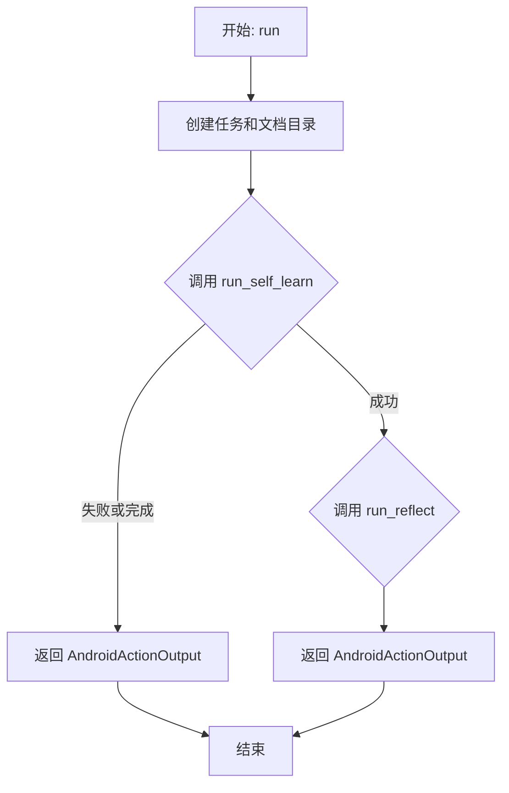
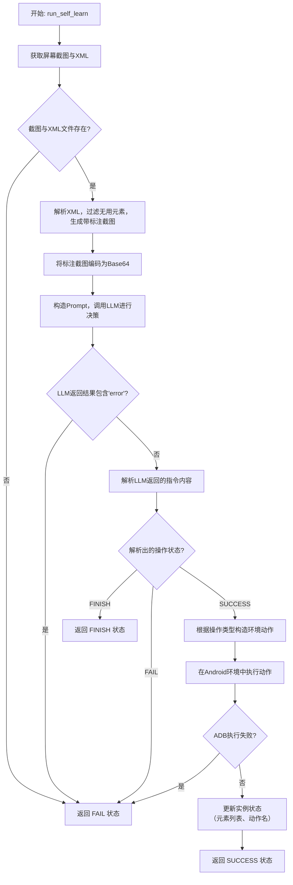
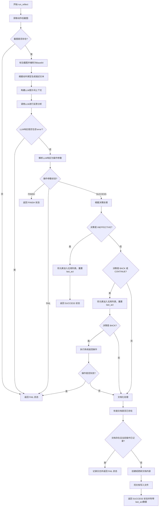

# `.\MetaGPT\metagpt\ext\android_assistant\actions\self_learn_and_reflect.py` 详细设计文档

该代码实现了一个Android应用自动化探索与学习的智能体动作。核心功能是通过与Android模拟器环境交互，自动执行点击、滑动、输入等操作来探索应用界面，并基于操作前后的屏幕截图对比进行反思学习，生成UI元素的操作文档，最终目标是完成指定的任务描述。

## 整体流程

```mermaid
graph TD
    A[开始: SelfLearnAndReflect.run] --> B[创建任务和文档目录]
    B --> C[调用 run_self_learn 进行探索]
    C --> D[获取屏幕截图和XML布局]
    D --> E{截图和XML存在?}
    E -- 否 --> F[返回 FAIL]
    E -- 是 --> G[解析XML，标注元素，生成带标注的截图]
    G --> H[调用LLM分析截图，决定下一步操作]
    H --> I{LLM返回有效操作?}
    I -- 否/错误 --> J[返回 FAIL/FINISH]
    I -- 是 --> K[根据操作类型(Tap/Text/Swipe/LongPress)执行ADB命令]
    K --> L{ADB执行成功?}
    L -- 否 --> M[返回 FAIL]
    L -- 是 --> N[保存操作上下文，返回 SUCCESS]
    N --> O[调用 run_reflect 进行反思]
    O --> P[获取操作后截图并标注]
    P --> Q[调用LLM对比操作前后截图，评估操作效果]
    Q --> R{LLM返回有效评估?}
    R -- 否/错误 --> S[返回 FAIL/FINISH]
    R -- 是 --> T[解析LLM的决策(INEFFECTIVE/BACK/CONTINUE/SUCCESS)]
    T --> U{决策类型?}
    U -- INEFFECTIVE --> V[将元素加入无用列表，重置last_act]
    U -- BACK --> W[执行返回操作，将元素加入无用列表，重置last_act]
    W --> X{ADB执行成功?}
    X -- 否 --> Y[返回 FAIL]
    U -- CONTINUE/SUCCESS --> Z[生成或更新元素操作文档]
    Z --> AA[返回 SUCCESS 并更新 last_act]
    V --> AA
    Y --> AA
    AA --> AB[结束]
    S --> AB
```

## 类结构

```
Action (来自 metagpt.actions.action)
└── SelfLearnAndReflect
    ├── 字段: name, useless_list, screenshot_before_path, screenshot_before_base64, elem_list, swipe_orient, act_name, ui_area
    ├── 方法: run, run_self_learn, run_reflect
```

## 全局变量及字段


### `SelfLearnAndReflect.name`
    
动作的名称，固定为'SelfLearnAndReflect'，用于标识该动作类。

类型：`str`
    


### `SelfLearnAndReflect.useless_list`
    
存储被判定为无效或无用的UI元素的唯一标识符（uid）列表，用于在后续操作中过滤这些元素。

类型：`list[str]`
    


### `SelfLearnAndReflect.screenshot_before_path`
    
执行操作前带标注的屏幕截图文件的本地存储路径，用于记录和后续分析。

类型：`str`
    


### `SelfLearnAndReflect.screenshot_before_base64`
    
执行操作前带标注的屏幕截图的Base64编码字符串，用于作为输入传递给大语言模型（LLM）。

类型：`str`
    


### `SelfLearnAndReflect.elem_list`
    
从当前UI界面XML解析得到的Android UI元素对象列表，包含每个元素的属性、边界框等信息。

类型：`list[AndroidElement]`
    


### `SelfLearnAndReflect.swipe_orient`
    
记录滑动操作的方向（如'up', 'down', 'left', 'right'），用于在反思阶段生成更精确的上下文描述。

类型：`str`
    


### `SelfLearnAndReflect.act_name`
    
记录当前执行的具体操作类型（如'tap', 'long_press', 'swipe'），用于在反思阶段匹配操作和生成文档。

类型：`str`
    


### `SelfLearnAndReflect.ui_area`
    
记录当前操作所针对的UI元素在`elem_list`中的索引（从1开始），用于在反思阶段定位和记录特定元素。

类型：`int`
    
    

## 全局函数及方法

### `SelfLearnAndReflect.run`

该方法执行一个完整的“自我学习与反思”循环。它首先调用 `run_self_learn` 方法，基于当前环境状态和任务描述，通过大语言模型（LLM）决策并执行一个动作（如点击、滑动）。如果动作执行成功，则接着调用 `run_reflect` 方法，对动作执行前后的屏幕状态进行对比分析，通过LLM反思该动作的有效性，并根据反思结果更新无用元素列表或生成操作文档。

参数：
- `round_count`：`int`，当前执行的轮次数，用于生成唯一的截图和XML文件名。
- `task_desc`：`str`，当前任务的自然语言描述。
- `last_act`：`str`，上一轮执行的动作描述。
- `task_dir`：`Path`，用于存储本轮任务相关文件（如截图、XML）的目录路径。
- `docs_dir`：`Path`，用于存储生成的元素操作文档的目录路径。
- `env`：`AndroidEnv`，Android模拟器环境实例，用于执行动作和获取观察结果。

返回值：`AndroidActionOutput`，包含动作执行状态（成功、失败、完成）以及可能的附加数据（如更新后的`last_act`）。

#### 流程图



#### 带注释源码

```python
async def run(
        self, round_count: int, task_desc: str, last_act: str, task_dir: Path, docs_dir: Path, env: AndroidEnv
    ) -> AndroidActionOutput:
        # 1. 确保任务目录和文档目录存在
        for path in [task_dir, docs_dir]:
            path.mkdir(parents=True, exist_ok=True)
        # 2. 执行自我学习阶段：决策并执行一个动作
        resp = await self.run_self_learn(round_count, task_desc, last_act, task_dir, env)
        # 3. 如果自我学习阶段失败或任务完成，直接返回结果
        if resp.action_state != RunState.SUCCESS:
            return resp
        # 4. 自我学习成功，执行反思阶段：分析动作效果并更新知识
        resp = await self.run_reflect(round_count, task_desc, last_act, task_dir, docs_dir, env)
        # 5. 返回反思阶段的结果
        return resp
```

### `SelfLearnAndReflect.run_self_learn`

该方法执行Android应用自我学习流程中的“探索”阶段。它首先获取当前屏幕截图和UI布局XML，解析出可交互元素并标注。然后，使用大语言模型（LLM）分析任务描述、上一步动作和当前屏幕状态，决策出下一步要执行的具体操作（如点击、输入、滑动等）。最后，在Android模拟器环境中执行该操作，并记录相关状态。

参数：

- `round_count`：`int`，当前学习轮次序号，用于生成唯一的截图和XML文件名。
- `task_desc`：`str`，当前需要学习的任务描述。
- `last_act`：`str`，上一轮执行的动作描述。
- `task_dir`：`Path`，用于存储本轮学习过程中产生的临时文件（如截图、XML）的目录路径。
- `env`：`AndroidEnv`，Android模拟器环境实例，用于执行观察（获取截图/XML）和动作（点击、输入等）。

返回值：`AndroidActionOutput`，包含动作执行状态（成功、失败、完成）和可能的附加数据。

#### 流程图



#### 带注释源码

```python
async def run_self_learn(
    self, round_count: int, task_desc: str, last_act: str, task_dir: Path, env: AndroidEnv
) -> AndroidActionOutput:
    # 从全局配置中获取额外参数，例如用于元素去重的最小距离
    extra_config = config.extra
    # 1. 观察环境：获取当前屏幕截图和UI布局XML文件路径
    screenshot_path: Path = env.observe(
        EnvObsParams(obs_type=EnvObsType.GET_SCREENSHOT, ss_name=f"{round_count}_before", local_save_dir=task_dir)
    )
    xml_path: Path = env.observe(
        EnvObsParams(obs_type=EnvObsType.GET_XML, xml_name=f"{round_count}", local_save_dir=task_dir)
    )
    # 2. 检查截图和XML文件是否成功生成
    if not screenshot_path.exists() or not xml_path.exists():
        return AndroidActionOutput(action_state=RunState.FAIL)

    # 3. 解析XML文件，获取UI元素列表，并过滤掉已知的无用元素
    elem_list = elem_list_from_xml_tree(xml_path, self.useless_list, extra_config.get("min_dist", 30))

    # 4. 在原始截图上绘制所有可交互元素的边界框，生成标注图
    screenshot_before_labeled_path = task_dir.joinpath(f"{round_count}_before_labeled.png")
    draw_bbox_multi(screenshot_path, screenshot_before_labeled_path, elem_list)
    # 5. 将标注后的截图编码为Base64字符串，供LLM处理
    img_base64 = encode_image(screenshot_before_labeled_path)
    self.screenshot_before_base64 = img_base64
    self.screenshot_before_path = screenshot_before_labeled_path

    # 6. 准备调用LLM的Prompt模板和上下文
    self_explore_template = screenshot_parse_self_explore_template
    context = self_explore_template.format(task_description=task_desc, last_act=last_act)

    # 7. 调用LLM节点，传入上下文和标注截图，让其决策下一步动作
    node = await SCREENSHOT_PARSE_NODE.fill(context=context, llm=self.llm, images=[img_base64])
    logger.debug(f"fill result:{node}")
    # 8. 检查LLM返回是否出错
    if "error" in node.content:
        return AndroidActionOutput(action_state=RunState.FAIL)
    # 9. 编译完整的Prompt（用于日志记录）
    prompt = node.compile(context=context, schema="json", mode="auto")
    # 记录操作日志
    OpLogItem(step=round_count, prompt=prompt, image=str(screenshot_before_labeled_path), response=node.content)
    # 10. 解析LLM返回的结构化指令内容，转换为操作参数对象
    op_param = screenshot_parse_extract(node.instruct_content.model_dump(), grid_on=False)
    # 11. 根据解析出的操作状态进行判断
    # TODO: 当操作状态为FINISH时，应如何与上层逻辑衔接？
    if op_param.param_state == RunState.FINISH:
        return AndroidActionOutput(action_state=RunState.FINISH)
    if op_param.param_state == RunState.FAIL:
        return AndroidActionOutput(action_state=RunState.FAIL)

    # 12. 根据操作参数的具体类型，构造对应的Android环境动作(EnvAction)
    if isinstance(op_param, TapOpParam):
        self.ui_area = op_param.area  # 记录操作区域（元素序号）
        # 将元素边界框转换为屏幕坐标
        x, y = elem_bbox_to_xy(elem_list[op_param.area - 1].bbox)
        action = EnvAction(action_type=EnvActionType.SYSTEM_TAP, coord=(x, y))
    elif isinstance(op_param, TextOpParam):
        action = EnvAction(action_type=EnvActionType.USER_INPUT, input_txt=op_param.input_str)
    elif isinstance(op_param, LongPressOpParam):
        self.ui_area = op_param.area
        x, y = elem_bbox_to_xy(elem_list[op_param.area - 1].bbox)
        action = EnvAction(action_type=EnvActionType.USER_LONGPRESS, coord=(x, y))
    elif isinstance(op_param, SwipeOpParam):
        self.ui_area = op_param.area
        self.swipe_orient = op_param.swipe_orient  # 记录滑动方向
        x, y = elem_bbox_to_xy(elem_list[op_param.area - 1].bbox)
        action = EnvAction(
            action_type=EnvActionType.USER_SWIPE, coord=(x, y), orient=op_param.swipe_orient, dist=op_param.dist
        )

    # 13. 在Android环境中执行构造好的动作
    obs, _, _, _, info = env.step(action)
    action_res = info["res"]
    # 14. 检查ADB命令执行是否失败
    if action_res == ADB_EXEC_FAIL:
        return AndroidActionOutput(action_state=RunState.FAIL)

    # 15. 执行成功，更新实例状态，供后续`run_reflect`方法使用
    self.elem_list = elem_list
    self.act_name = op_param.act_name
    # 16. 返回默认的成功状态（action_state为RunState.SUCCESS）
    return AndroidActionOutput()
```

### `SelfLearnAndReflect.run_reflect`

该方法执行自我探索任务中的“反思”阶段。它首先获取执行动作后的屏幕截图，然后结合动作前的截图，使用大语言模型（LLM）分析动作的有效性。根据LLM的决策，它会更新无用元素列表、执行可能的回退操作，并将有效的UI元素操作文档化保存到指定目录。

参数：

- `round_count`：`int`，当前探索的轮次数。
- `task_desc`：`str`，任务描述。
- `last_act`：`str`，上一轮执行的动作。
- `task_dir`：`Path`，用于存储临时文件（如截图）的任务目录。
- `docs_dir`：`Path`，用于存储UI元素操作文档的目录。
- `env`：`AndroidEnv`，Android模拟器环境实例，用于交互和观察。

返回值：`AndroidActionOutput`，包含动作执行状态（成功、失败、完成）以及可能的附加数据（如更新后的`last_act`）。

#### 流程图



#### 带注释源码

```python
async def run_reflect(
    self, round_count: int, task_desc: str, last_act: str, task_dir: Path, docs_dir: Path, env: AndroidEnv
) -> AndroidActionOutput:
    # 1. 观察环境，获取执行动作后的屏幕截图
    screenshot_path: Path = env.observe(
        EnvObsParams(obs_type=EnvObsType.GET_SCREENSHOT, ss_name=f"{round_count}_after", local_save_dir=task_dir)
    )
    # 检查截图文件是否成功生成
    if not screenshot_path.exists():
        return AndroidActionOutput(action_state=RunState.FAIL)

    # 2. 在动作后的截图上标注出之前识别出的UI元素边界框，并编码为Base64格式，供LLM分析
    screenshot_after_labeled_path = task_dir.joinpath(f"{round_count}_after_labeled.png")
    draw_bbox_multi(screenshot_path, screenshot_after_labeled_path, elem_list=self.elem_list)
    img_base64 = encode_image(screenshot_after_labeled_path)

    # 3. 根据在`run_self_learn`中记录的动作类型，生成用于LLM提示词的自然语言描述
    if self.act_name == ActionOp.TAP.value:
        action = "tapping"
    elif self.act_name == ActionOp.LONG_PRESS.value:
        action = "long pressing"
    elif self.act_name == ActionOp.SWIPE.value:
        action = "swiping"
        # 细化滑动方向描述
        if self.swipe_orient == SwipeOp.UP.value or self.swipe_orient == SwipeOp.DOWN.value:
            action = "v_swipe"
        elif self.swipe_orient == SwipeOp.LEFT.value or self.swipe_orient == SwipeOp.RIGHT.value:
            action = "h_swipe"
    else:
        # 处理未知动作类型
        logger.warning(f"Current action name parse failed, it's `{self.act_name}`")
        action = None

    # 4. 构建发送给LLM的提示词上下文，包含动作描述、UI区域、任务描述和上一动作
    context = reflect_template.format(
        action=action, ui_element=str(self.ui_area), task_desc=task_desc, last_act=last_act
    )

    # 5. 调用LLM节点进行分析，传入动作前和动作后的标注截图
    node = await SELF_LEARN_REFLECT_NODE.fill(
        context=context, llm=self.llm, images=[self.screenshot_before_base64, img_base64]
    )

    # 检查LLM响应是否出错
    if "error" in node.content:
        return AndroidActionOutput(action_state=RunState.FAIL)

    # 6. 记录反思日志（用于调试和追踪）
    prompt = node.compile(context=context, schema="json", mode="auto")
    ReflectLogItem(
        step=round_count,
        prompt=prompt,
        image_before=str(self.screenshot_before_path),
        image_after=str(screenshot_after_labeled_path),
        response=node.content,
    )

    # 7. 解析LLM的响应，提取出决策和文档内容
    op_param = reflect_parse_extarct(node.instruct_content.model_dump())

    # 处理LLM直接判断任务完成或失败的情况
    if op_param.param_state == RunState.FINISH:
        return AndroidActionOutput(action_state=RunState.FINISH)
    if op_param.param_state == RunState.FAIL:
        return AndroidActionOutput(action_state=RunState.FAIL)

    # 记录解析结果
    logger.info(
        f"reflect_parse_extarct decision: {op_param.decision}, "
        f"elem_list size: {len(self.elem_list)}, ui_area: {self.ui_area}"
    )

    # 8. 根据LLM的决策进行相应处理
    # 获取当前操作的UI元素的唯一标识符
    resource_id = self.elem_list[int(self.ui_area) - 1].uid

    if op_param.decision == Decision.INEFFECTIVE.value:
        # 决策为“无效”：将该元素加入无用列表，避免后续重复操作，并重置last_act
        self.useless_list.append(resource_id)
        last_act = "NONE"  # TODO: 此重置逻辑的影响范围需确认（是全局还是本轮）
    elif op_param.decision in [Decision.BACK.value, Decision.CONTINUE.value, Decision.SUCCESS.value]:
        # 决策为“返回”、“继续”或“成功”
        if op_param.decision in [Decision.BACK.value, Decision.CONTINUE.value]:
            # 对于“返回”和“继续”，也将元素标记为无用，并重置last_act
            self.useless_list.append(resource_id)
            last_act = "NONE"
            if op_param.decision == Decision.BACK.value:
                # 如果决策是“返回”，则向模拟器发送返回键指令
                action = EnvAction(action_type=EnvActionType.SYSTEM_BACK)
                obs, _, _, _, info = env.step(action)
                if info["res"] == ADB_EXEC_FAIL:
                    return AndroidActionOutput(action_state=RunState.FAIL)

        # 9. 文档化处理：将LLM生成的元素操作描述保存到文件
        doc = op_param.documentation
        doc_path = docs_dir.joinpath(f"{resource_id}.txt")

        if doc_path.exists():
            # 如果文档已存在，尝试读取现有内容
            try:
                doc_content = ast.literal_eval(doc_path.read_text())
            except Exception as exp:
                logger.error(f"ast parse doc: {doc_path} failed, exp: {exp}")
                return AndroidActionOutput(action_state=RunState.FAIL)

            # 检查当前操作类型（如tap, swipe）是否已有记录
            if doc_content[self.act_name]:
                logger.info(f"Documentation for the element {resource_id} already exists.")
                # 如果已存在，视为失败（避免覆盖），但此逻辑可能导致无法更新文档
                return AndroidActionOutput(action_state=RunState.FAIL)
        else:
            # 如果文档不存在，创建新的文档内容对象
            doc_content = DocContent()
            # 将LLM生成的文档描述赋值给对应的操作属性
            setattr(doc_content, self.act_name, doc)

        # 将文档内容对象转换为字符串并写入文件
        doc_path.write_text(str(doc_content))

    # 10. 返回成功状态，并携带可能更新后的last_act值
    return AndroidActionOutput(data={"last_act": last_act})
```

## 关键组件

### SelfLearnAndReflect 类

该类是 Android 自动化探索与学习任务的核心执行器，继承自 `Action`，负责在 Android 环境中执行“自我学习”和“反思”两个阶段。它通过截图、UI 元素解析、LLM 决策和 ADB 交互，自动化地探索应用界面，并根据探索结果进行反思以更新知识库。

### 截图与 UI 元素解析

该组件负责从 Android 设备获取当前屏幕的截图和 UI 层级信息（XML），并从中提取出可交互的 `AndroidElement` 列表。它通过 `draw_bbox_multi` 函数在截图上标注出这些元素，为后续的 LLM 决策提供视觉和结构化的上下文。

### LLM 驱动的决策节点 (SCREENSHOT_PARSE_NODE)

这是一个预定义的 LLM 调用节点，用于“自我学习”阶段。它接收包含任务描述、历史动作和标注后截图的上下文，由 LLM 分析并决策下一步的最佳操作（如点击、输入、滑动等），输出结构化的操作参数。

### 操作参数提取与转换

该组件将 LLM 节点输出的结构化内容（`instruct_content`）解析为具体的操作参数对象（如 `TapOpParam`, `TextOpParam` 等）。然后，根据参数类型将其转换为 Android 环境 (`AndroidEnv`) 能够执行的标准化动作 (`EnvAction`)。

### Android 环境交互 (AndroidEnv)

这是与真实或模拟 Android 设备交互的接口。它封装了 ADB 命令，能够执行 `EnvAction` 定义的动作（如点击、滑动、返回、输入），并获取执行后的屏幕状态（截图、XML）。它是自动化探索得以进行的物理基础。

### 反思学习节点 (SELF_LEARN_REFLECT_NODE)

这是用于“反思”阶段的另一个 LLM 调用节点。它接收动作执行前后的两张标注截图，由 LLM 评估该动作的有效性（如是否成功、是否无效、是否需要返回），并可能生成对该 UI 元素操作结果的文档描述。

### 知识库管理与持久化

该组件管理一个“无用元素列表”（`useless_list`）和一个本地文件知识库（`docs_dir`）。当反思认为某个元素上的操作无效时，其 ID 会被加入黑名单以避免后续误操作。当操作被认为有效并生成了文档时，该文档会以元素 ID 为文件名被保存，形成可复用的操作知识。

### 操作日志与反射日志

该组件在“学习”和“反思”阶段分别记录 `OpLogItem` 和 `ReflectLogItem`。这些日志条目包含了触发 LLM 的完整提示词（`prompt`）、使用的图片路径、LLM 的原始响应（`response`）等，用于调试、分析和后续的流程优化。

## 问题及建议


### 已知问题

-   **索引越界风险**：在 `run_reflect` 方法中，代码使用 `self.elem_list[int(self.ui_area) - 1]` 获取元素UID。如果 `self.ui_area` 的值无效（例如为-1或超出列表范围），将导致 `IndexError: list index out of range`。代码中的注释也提到了此问题。
-   **错误处理不完善**：当 `op_param.act_name` 无法匹配到 `ActionOp` 枚举值时，`action` 变量被设置为 `None`，这可能导致后续逻辑（如格式化 `context`）出错或产生不可预测的行为。
-   **硬编码与魔法值**：代码中存在多处硬编码的字符串（如 `"NONE"`）和数字（如 `min_dist=30`），降低了代码的可维护性和可配置性。
-   **状态管理混乱**：`last_act` 变量在 `run_reflect` 方法中被局部修改（`last_act = "NONE"`），但其影响范围不明确。注释 `# TODO global` 表明此处状态管理设计不清晰。
-   **路径处理不一致**：`OpLogItem` 和 `ReflectLogItem` 在记录路径时，将 `Path` 对象转换为字符串，而其他部分直接使用 `Path` 对象，存在不一致性。
-   **TODO 未完成**：代码中包含多个 `TODO` 注释，例如处理 `FINISH` 状态、测试赋值错误等，表明功能尚未完全实现或测试。

### 优化建议

-   **增强健壮性**：在访问 `self.elem_list` 前，应校验 `self.ui_area` 的值的有效性（例如，检查是否为大于0的整数且不超过列表长度）。对于 `act_name` 的匹配，应使用更安全的模式，如字典映射或提供默认值，避免 `action` 为 `None`。
-   **提取配置与常量**：将硬编码的字符串和数值（如 `"NONE"`、`min_dist`）提取到配置类或模块级常量中，便于统一管理和修改。
-   **明确状态流转**：重新设计 `last_act` 等状态变量的管理方式。考虑将其作为类属性、通过返回值传递，或使用专门的状态管理类，以明确其生命周期和修改点。
-   **统一接口与错误处理**：确保 `env.step(action)` 等外部调用有统一的异常捕获和错误处理机制，避免因外部依赖失败导致程序崩溃。`run_self_learn` 和 `run_reflect` 方法中的错误返回逻辑可以进一步抽象和标准化。
-   **完成待办事项**：优先处理代码中的 `TODO` 项，特别是处理 `FINISH` 状态和修复潜在的索引错误，完善核心逻辑。
-   **改进日志与监控**：增加更详细的日志记录，特别是在关键决策点（如反射解析结果）和异常分支，便于调试和监控系统运行状态。考虑对 `useless_list` 的增长进行监控，防止其无限膨胀。
-   **代码结构优化**：考虑将 `run_self_learn` 和 `run_reflect` 方法中一些较长的逻辑块（如根据 `op_param` 类型创建 `EnvAction` 的部分）提取为独立的辅助函数，以提高代码的可读性和可测试性。


## 其它


### 设计目标与约束

本模块的核心设计目标是实现一个在Android模拟器环境中进行自我探索与反思学习的自动化智能体。它通过结合屏幕截图解析、大语言模型（LLM）决策和ADB操作，旨在自动学习并记录特定UI元素的操作效果。主要约束包括：1）依赖外部Android模拟器环境（AndroidEnv）和ADB工具；2）需要与大语言模型（LLM）服务进行交互以生成决策；3）操作执行和状态观察存在延迟和失败的可能性；4）代码结构需遵循MetaGPT框架的Action基类规范。

### 错误处理与异常设计

模块的错误处理主要围绕`RunState`枚举（SUCCESS, FAIL, FINISH）展开，贯穿整个执行流程。关键错误点包括：1）环境观察失败（截图或XML获取失败）；2）LLM响应解析失败（返回内容包含“error”或解析异常）；3）ADB命令执行失败（`ADB_EXEC_FAIL`）；4）文件操作异常（如读取已有文档时解析失败）。当前设计将大多数错误统一转化为返回`AndroidActionOutput(action_state=RunState.FAIL)`，但异常传播和日志记录粒度有待细化，例如未捕获`IndexError`等运行时异常。

### 数据流与状态机

模块的数据流始于任务描述（`task_desc`）和上一轮动作（`last_act`）。核心状态由`RunState`（运行中、成功、失败、完成）和`Decision`（无效、返回、继续、成功）驱动。主要数据流路径为：`环境观察（截图/XML）` -> `元素提取与标注` -> `LLM决策生成（Self-Learn）` -> `执行动作` -> `环境再次观察` -> `LLM效果评估（Reflect）` -> `结果处理（更新无用列表/生成文档）`。`useless_list` 和 `last_act` 作为跨轮次的状态被维护，影响后续的元素提取和决策上下文。

### 外部依赖与接口契约

1.  **AndroidEnv环境**：依赖其`observe`方法获取屏幕截图和UI层次结构（XML），以及`step`方法执行点击、输入、滑动等ADB动作。契约要求返回有效的文件路径和执行结果。
2.  **大语言模型（LLM）服务**：通过`SCREENSHOT_PARSE_NODE`和`SELF_LEARN_REFLECT_NODE`两个结构化节点进行交互。契约要求LLM返回符合预定JSON schema的决策或评估内容。
3.  **配置文件（config）**：依赖`config.extra`获取额外配置，如`min_dist`（元素最小距离阈值）。
4.  **文件系统**：约定`task_dir`用于存储每轮次的截图、XML和标注图，`docs_dir`用于存储学习到的UI元素操作文档（`{resource_id}.txt`）。

### 并发与线程安全

当前代码实现为异步（`async`）方法，主要`run`、`run_self_learn`和`run_reflect`方法均定义为`async`，表明其设计用于异步事件循环中，以避免在等待IO（如LLM调用、ADB操作、文件读写）时阻塞。然而，类实例变量（如`useless_list`, `screenshot_before_path`等）在异步方法中被读写，如果存在多个任务并发操作同一个`SelfLearnAndReflect`实例，可能引发竞态条件。目前设计未显示加锁或使用线程安全数据结构，因此假定该Action实例在单任务序列中被使用。

### 配置管理与环境变量

模块的配置主要来源于全局的`config`对象（`from metagpt.config2 import config`），具体使用了`config.extra`字典来获取运行时参数（例如`min_dist`）。这提供了从中央配置源注入参数的灵活性。此外，`AndroidEnv`本身可能封装了ADB路径、设备序列号等环境相关的配置。模块没有显式处理环境变量，而是通过上层框架和`AndroidEnv`来抽象这些依赖。

### 日志与监控

模块使用`metagpt.logs.logger`进行日志记录，级别包括`debug`、`info`、`warning`、`error`。关键日志点包括：LLM填充结果、动作执行结果、反射解析决策、文件操作异常等。同时，通过`OpLogItem`和`ReflectLogItem`记录每轮次详细的提示词、图像和响应，用于后续分析和调试。监控方面主要依赖ADB执行结果（`info[“res”]`）和文件存在性检查来判定操作成功与否。

### 测试策略建议

1.  **单元测试**：Mock `AndroidEnv`的`observe`和`step`方法，Mock LLM节点（`SCREENSHOT_PARSE_NODE`, `SELF_LEARN_REFLECT_NODE`）的`fill`方法，测试`run_self_learn`和`run_reflect`在各种模拟响应（成功、失败、完成、异常解析）下的分支逻辑和状态返回。
2.  **集成测试**：在可控的测试Android模拟器或设备上，运行完整的`run`方法流程，验证从截图到文档生成的端到端功能，特别是ADB命令执行和文件系统操作。
3.  **数据验证测试**：针对`screenshot_parse_extract`和`reflect_parse_extract`工具函数，设计测试用例验证其能否正确解析LLM返回的各种合法与边界JSON结构。
4.  **错误恢复测试**：模拟ADB失败、文件读写权限错误、网络超时等异常，检查模块的错误处理是否健壮，是否避免了状态不一致。


    