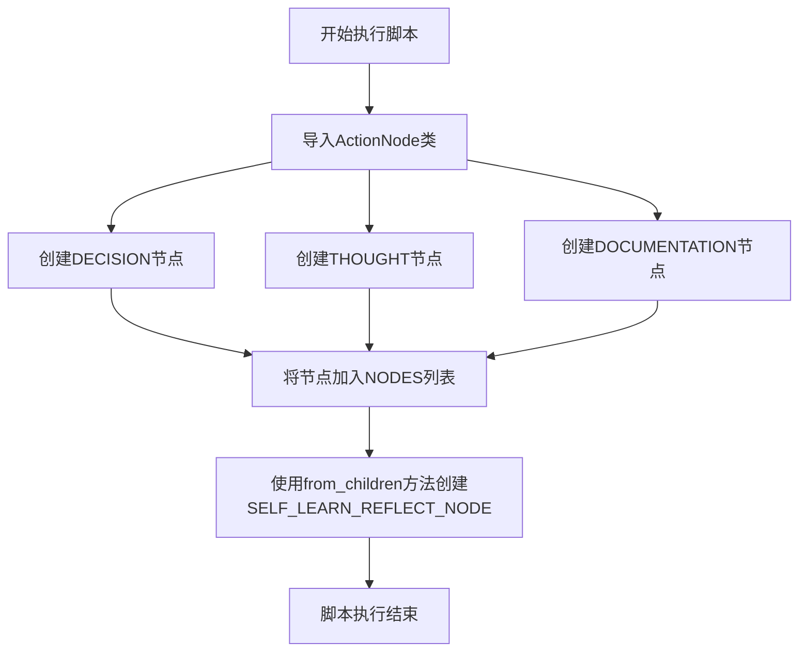

# `.\MetaGPT\metagpt\ext\android_assistant\actions\self_learn_reflect_an.py` 详细设计文档

该代码文件定义了一个用于解析“反思”或“自学习”过程的ActionNode结构。它创建了三个核心节点（Decision、Thought、Documentation），每个节点代表反思过程中的一个特定方面（决策原因、思考过程、UI元素功能描述），并将它们组合成一个名为SelfLearnReflect的父节点，形成一个结构化的反思数据模型。

## 整体流程



## 类结构

```
ActionNode (外部导入类)
├── DECISION (ActionNode实例)
├── THOUGHT (ActionNode实例)
├── DOCUMENTATION (ActionNode实例)
└── SELF_LEARN_REFLECT_NODE (ActionNode实例，由前三个节点组合而成)
```

## 全局变量及字段


### `DECISION`
    
表示决策节点的ActionNode实例，用于在反思过程中记录决策原因

类型：`ActionNode`
    


### `THOUGHT`
    
表示思考节点的ActionNode实例，用于在反思过程中记录思考过程

类型：`ActionNode`
    


### `DOCUMENTATION`
    
表示文档节点的ActionNode实例，用于描述UI元素的功能

类型：`ActionNode`
    


### `NODES`
    
包含DECISION、THOUGHT和DOCUMENTATION三个ActionNode的列表，用于构建复合节点

类型：`List[ActionNode]`
    


### `SELF_LEARN_REFLECT_NODE`
    
通过from_children方法创建的复合ActionNode，整合了决策、思考和文档三个子节点，用于自学习反思过程

类型：`ActionNode`
    


### `ActionNode.key`
    
ActionNode的唯一标识符，用于区分不同的节点

类型：`str`
    


### `ActionNode.expected_type`
    
指定ActionNode期望的数据类型，用于验证节点内容

类型：`type`
    


### `ActionNode.instruction`
    
提供节点操作的指导说明，帮助用户理解如何填写节点内容

类型：`str`
    


### `ActionNode.example`
    
提供节点内容的示例，作为填写节点内容的参考

类型：`str`
    
    

## 全局函数及方法

### `ActionNode.from_children`

该方法是一个类方法，用于根据给定的子节点列表创建一个新的 `ActionNode` 实例。它通过组合子节点的键、期望类型和指令来构建新节点的属性，并建立父子关系。

参数：

- `name`：`str`，要创建的新 `ActionNode` 的名称（键）。
- `children`：`List[ActionNode]`，子节点列表，这些子节点将被添加到新创建的节点中。

返回值：`ActionNode`，返回一个新创建的 `ActionNode` 实例，该实例包含了传入的子节点。

#### 流程图

```mermaid
flowchart TD
    A[开始: from_children(name, children)] --> B[初始化空列表 keys, types, instructions]
    B --> C[遍历 children 列表]
    C --> D{是否还有子节点?}
    D -- 是 --> E[获取子节点 child]
    E --> F[将 child.key 添加到 keys]
    F --> G[将 child.expected_type 添加到 types]
    G --> H[将 child.instruction 添加到 instructions]
    H --> C
    D -- 否 --> I[创建新的 ActionNode 实例]
    I --> J[设置新节点的 key 为 name]
    J --> K[设置新节点的 expected_type 为 types 列表]
    K --> L[设置新节点的 instruction 为 instructions 列表]
    L --> M[将 children 设置为新节点的子节点]
    M --> N[返回新创建的 ActionNode 实例]
    N --> O[结束]
```

#### 带注释源码

```python
@classmethod
def from_children(cls, name: str, children: List["ActionNode"]) -> "ActionNode":
    """
    根据子节点列表创建一个新的 ActionNode。

    该方法通过组合子节点的键、期望类型和指令来构建新节点的属性。
    新节点的键为给定的名称，期望类型为子节点期望类型的列表，指令为子节点指令的列表。
    同时，建立新节点与子节点之间的父子关系。

    Args:
        name (str): 新 ActionNode 的名称（键）。
        children (List[ActionNode]): 子节点列表。

    Returns:
        ActionNode: 新创建的 ActionNode 实例。
    """
    # 初始化空列表，用于收集子节点的键、期望类型和指令
    keys = []
    types = []
    instructions = []

    # 遍历子节点列表，收集每个子节点的相关信息
    for child in children:
        keys.append(child.key)           # 收集子节点的键
        types.append(child.expected_type) # 收集子节点的期望类型
        instructions.append(child.instruction) # 收集子节点的指令

    # 创建新的 ActionNode 实例
    # 设置新节点的键为给定的名称
    # 设置新节点的期望类型为收集到的类型列表
    # 设置新节点的指令为收集到的指令列表
    node = cls(key=name, expected_type=types, instruction=instructions)

    # 将传入的子节点列表设置为新节点的子节点，建立父子关系
    node.children = children

    # 返回新创建的 ActionNode 实例
    return node
```

## 关键组件


### ActionNode 类

用于定义和构建结构化动作节点的核心组件，支持类型检查、指令描述和示例，是构建复杂决策与反思逻辑的基础单元。

### 节点定义 (DECISION, THOUGHT, DOCUMENTATION)

预定义的三个具体动作节点，分别代表决策、思考和文档化功能，每个节点都封装了特定的预期类型、指令和示例。

### 节点集合 (NODES)

一个包含预定义节点（DECISION, THOUGHT, DOCUMENTATION）的列表，用于方便地管理和组合多个节点。

### 复合节点构建 (SELF_LEARN_REFLECT_NODE)

通过 `ActionNode.from_children` 方法将多个子节点（NODES）组合成一个名为 "SelfLearnReflect" 的复合动作节点，实现了对反思过程的模块化封装。


## 问题及建议


### 已知问题

-   **代码重复与硬编码**：`DECISION` 和 `THOUGHT` 两个 `ActionNode` 实例的 `instruction` 字段值完全相同（均为 `"explain why you made this decision"`），这可能是复制粘贴导致的错误，`THOUGHT` 的指令描述可能应为 `"explain your thought process"` 或类似内容。同时，`NODES` 列表是硬编码的，缺乏灵活性。
-   **示例值语义不清**：`DECISION` 节点的 `example` 值为 `"BACK"`，`THOUGHT` 和 `DOCUMENTATION` 节点的 `example` 值为空字符串 `""`。这些示例值过于简单或为空，未能有效指导模型生成符合预期的输出格式或内容。
-   **缺乏类型与结构验证**：虽然 `ActionNode` 定义了 `expected_type`，但当前代码片段没有展示如何利用这些类型信息对解析后的结果进行验证或强制类型转换，存在运行时类型错误的风险。
-   **节点关系与上下文缺失**：`SELF_LEARN_REFLECT_NODE` 通过 `from_children` 创建，但代码中没有体现这些子节点（`DECISION`, `THOUGHT`, `DOCUMENTATION`）之间的逻辑关系、执行顺序或数据依赖，这可能导致生成的文档或反思内容结构松散。

### 优化建议

-   **修正指令并参数化节点列表**：修正 `THOUGHT` 节点的 `instruction` 字段，使其准确反映“思考过程”的意图。考虑将 `NODES` 列表改为一个可配置的参数或函数返回值，以提高代码的复用性和可测试性。
-   **提供更有意义的示例**：为所有节点，特别是 `THOUGHT` 和 `DOCUMENTATION`，提供具体、有代表性的 `example` 值。这能显著提升大语言模型生成内容的质量和一致性。
-   **增强结果验证机制**：建议在 `ActionNode` 的解析或后续处理流程中，加入对 `expected_type` 的检查，例如将输出字符串转换为指定的类型（如 `str`, `int`, `dict` 等），并处理转换异常。
-   **明确定义节点结构与流程**：为 `SELF_LEARN_REFLECT_NODE` 或其使用场景补充设计说明，明确子节点之间的逻辑（如顺序执行、条件分支）和数据流。考虑使用更高级的节点类型（如选择节点、循环节点）或在外层封装流程控制逻辑来管理这些节点的执行。
-   **补充文档与契约**：在模块或类级别添加文档字符串，说明 `SelfLearnReflect` 节点的设计目的、输入输出规范以及各子节点的具体职责。这有助于其他开发者理解和使用此组件。


## 其它


### 设计目标与约束

本模块的设计目标是提供一个可扩展的、结构化的节点定义框架，用于在自学习反思（Self-Learn Reflection）过程中解析和生成特定格式的文本内容。其核心约束包括：
1.  **类型安全**：通过 `expected_type` 参数确保每个节点解析出的数据类型符合预期。
2.  **结构清晰**：使用 `ActionNode` 类封装单个节点的所有元数据（键、类型、指令、示例），并通过 `from_children` 方法组合成具有层级结构的复合节点。
3.  **可复用性**：将 `DECISION`、`THOUGHT`、`DOCUMENTATION` 定义为全局常量，便于在系统其他部分引用，确保节点定义的一致性。
4.  **简洁性**：代码通过预定义节点列表（`NODES`）和静态构造方法（`from_children`）来简化复杂节点（`SELF_LEARN_REFLECT_NODE`）的创建过程。

### 错误处理与异常设计

当前代码片段主要进行静态定义，不包含运行时逻辑，因此显式的错误处理机制较少。其错误处理策略是隐式的，依赖于底层 `ActionNode` 类的实现：
1.  **类型验证**：预计在 `ActionNode` 解析内容时，`expected_type` 会用于验证输入数据的类型，类型不匹配可能引发 `TypeError` 或自定义异常。
2.  **键名冲突**：在通过 `ActionNode.from_children` 创建复合节点时，预计底层逻辑会检查子节点列表中的 `key` 是否唯一，重复的键可能导致 `ValueError`。
3.  **输入格式**：`instruction` 和 `example` 字段为指导下游语言模型或解析器而设，格式错误可能导致解析失败，错误处理应由调用 `ActionNode` 的客户端代码负责。

### 数据流与状态机

本模块定义的是数据结构模板，而非动态执行流程。其“数据流”体现在节点定义的静态组合关系上：
1.  **数据定义流**：`DECISION`、`THOUGHT`、`DOCUMENTATION` 三个原子节点被独立定义 -> 它们被收集到 `NODES` 列表中 -> 列表传递给 `ActionNode.from_children` 方法 -> 生成一个名为 `"SelfLearnReflect"` 的复合节点 `SELF_LEARN_REFLECT_NODE`。
2.  **状态机**：不适用。这些节点定义是元数据，用于描述一个待填充或待解析的文档结构，本身不具备状态变迁。实际的状态机可能存在于使用这些节点进行推理、填充和验证的上层流程中。

### 外部依赖与接口契约

1.  **外部依赖**：
    *   **`metagpt.actions.action_node.ActionNode` 类**：这是本模块的核心依赖。模块假设该类已正确定义，并提供了 `__init__` 构造函数（接受 `key`, `expected_type`, `instruction`, `example` 参数）和 `from_children` 类方法（接受 `name` 和子节点列表，返回复合节点）。
2.  **接口契约**：
    *   **导出契约**：本模块向外部导出四个常量：`DECISION`、`THOUGHT`、`DOCUMENTATION` 和 `SELF_LEARN_REFLECT_NODE`。其他模块可以导入并使用这些预定义的节点来构建或解析符合“自学习反思”格式的内容。
    *   **导入契约**：本模块严格依赖 `ActionNode` 的接口。任何对 `ActionNode` 类构造函数或 `from_children` 方法签名的更改都可能破坏本模块的功能。

    