# `.\MetaGPT\metagpt\ext\android_assistant\prompts\__init__.py` 详细设计文档

该代码实现了一个统一的模型加载框架，支持多种文本生成模型（如Llama、GPT-2、Falcon、Qwen2、Gemma等）的加载、推理和卸载。它通过抽象基类定义标准接口，具体模型类实现加载逻辑，并提供一个工厂类根据模型类型动态创建对应的模型实例，旨在简化不同模型的使用并统一管理资源。

## 整体流程

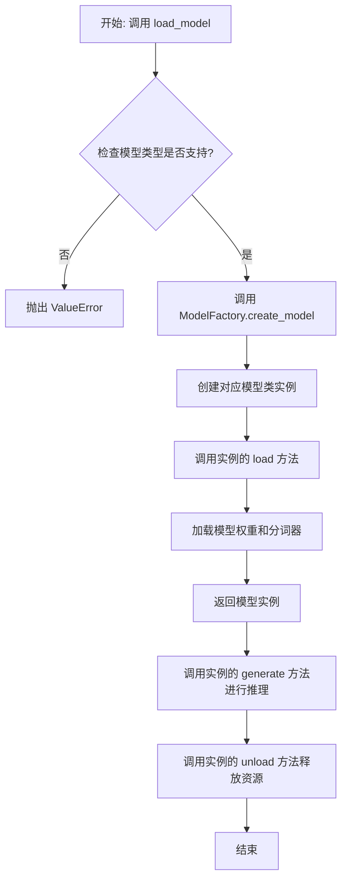

## 类结构

```
ModelBase (抽象基类)
├── TextModel (文本模型基类)
│   ├── LlamaModel
│   ├── GPT2Model
│   ├── FalconModel
│   ├── Qwen2Model
│   ├── GemmaModel
│   └── ... (其他具体模型类)
└── ModelFactory (工厂类)
```

## 全局变量及字段


### `TextModel.model`
    
用于文本生成的核心模型实例，通常是一个预训练的语言模型。

类型：`torch.nn.Module | transformers.PreTrainedModel`
    


### `TextModel.tokenizer`
    
与模型配套的分词器，负责将输入文本转换为模型可处理的token ID序列。

类型：`transformers.PreTrainedTokenizer | transformers.PreTrainedTokenizerFast`
    


### `TextModel.model_name`
    
标识当前加载的模型名称或路径，用于区分不同的模型配置。

类型：`str`
    


### `ModelFactory._model_registry`
    
一个内部注册表，用于存储模型名称到模型类或工厂函数的映射，支持模型的动态创建。

类型：`Dict[str, Type[TextModel] | Callable]`
    
    

## 全局函数及方法


### `load_model`

该函数用于加载一个预训练的模型。它根据提供的模型名称和配置参数，从指定的模型目录中加载模型，并返回加载后的模型对象。

参数：

-  `model_name`：`str`，预训练模型的名称，用于指定要加载的模型。
-  `model_dir`：`str`，模型文件所在的目录路径，默认为当前目录。
-  `config`：`dict`，模型的配置参数，用于调整模型加载时的行为，默认为空字典。

返回值：`Model`，加载后的模型对象。

#### 流程图

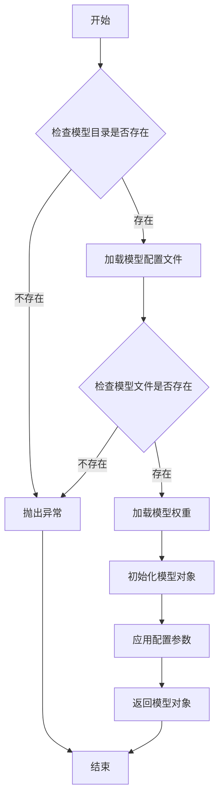

#### 带注释源码

```python
def load_model(model_name: str, model_dir: str = ".", config: dict = None) -> Model:
    """
    加载预训练模型。

    参数:
        model_name (str): 预训练模型的名称。
        model_dir (str): 模型文件所在的目录路径，默认为当前目录。
        config (dict): 模型的配置参数，默认为空字典。

    返回:
        Model: 加载后的模型对象。

    异常:
        FileNotFoundError: 如果模型目录或模型文件不存在。
    """
    # 初始化配置参数
    if config is None:
        config = {}

    # 检查模型目录是否存在
    if not os.path.isdir(model_dir):
        raise FileNotFoundError(f"模型目录不存在: {model_dir}")

    # 构建模型配置文件路径
    config_path = os.path.join(model_dir, f"{model_name}_config.json")
    if not os.path.isfile(config_path):
        raise FileNotFoundError(f"模型配置文件不存在: {config_path}")

    # 加载模型配置文件
    with open(config_path, 'r') as f:
        model_config = json.load(f)

    # 构建模型权重文件路径
    weights_path = os.path.join(model_dir, f"{model_name}_weights.h5")
    if not os.path.isfile(weights_path):
        raise FileNotFoundError(f"模型权重文件不存在: {weights_path}")

    # 根据配置文件初始化模型结构
    model = Model(**model_config)

    # 加载模型权重
    model.load_weights(weights_path)

    # 应用额外的配置参数
    for key, value in config.items():
        setattr(model, key, value)

    return model
```


### `ModelBase.load`

该方法用于加载模型实例。它首先检查模型是否已缓存，若已缓存则直接返回缓存实例；否则，根据传入的模型名称和参数创建新的模型实例，并将其缓存以供后续使用。

参数：

-  `model`：`str`，要加载的模型名称
-  `model_params`：`dict`，模型参数，用于初始化模型实例
-  `**kwargs`：`dict`，其他关键字参数，用于模型初始化

返回值：`ModelBase`，加载或创建的模型实例

#### 流程图

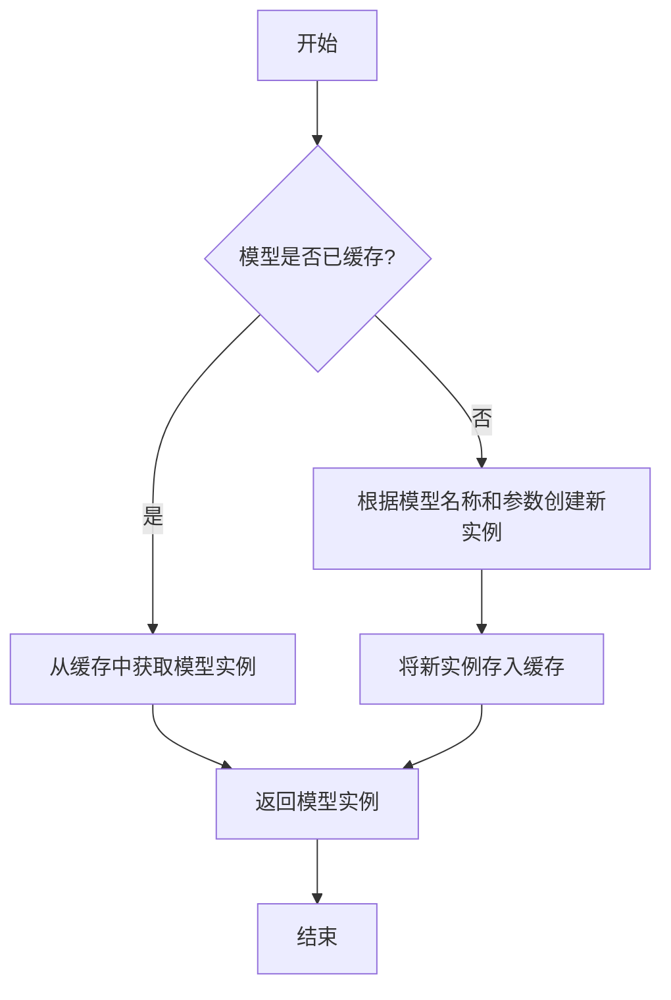

#### 带注释源码

```
@classmethod
def load(
    cls,
    model: str,
    model_params: dict,
    **kwargs,
) -> "ModelBase":
    """
    加载模型实例。

    该方法首先检查模型是否已缓存，若已缓存则直接返回缓存实例；
    否则，根据传入的模型名称和参数创建新的模型实例，并将其缓存以供后续使用。

    Args:
        model (str): 要加载的模型名称。
        model_params (dict): 模型参数，用于初始化模型实例。
        **kwargs (dict): 其他关键字参数，用于模型初始化。

    Returns:
        ModelBase: 加载或创建的模型实例。
    """
    # 检查模型是否已缓存
    if model in cls._model_cache:
        return cls._model_cache[model]

    # 根据模型名称和参数创建新实例
    model_instance = cls(model=model, model_params=model_params, **kwargs)

    # 将新实例存入缓存
    cls._model_cache[model] = model_instance

    # 返回模型实例
    return model_instance
```


### `ModelBase.generate`

该方法用于根据给定的提示词和生成参数，调用底层模型生成文本内容。它处理了模型调用前的参数准备、模型选择、调用执行以及结果后处理等流程，是模型生成功能的核心入口。

参数：

- `prompt`：`str`，输入的提示词文本，用于指导模型生成内容
- `kwargs`：`dict`，可选的生成参数，用于覆盖默认的模型配置参数

返回值：`str`，模型生成的文本内容

#### 流程图

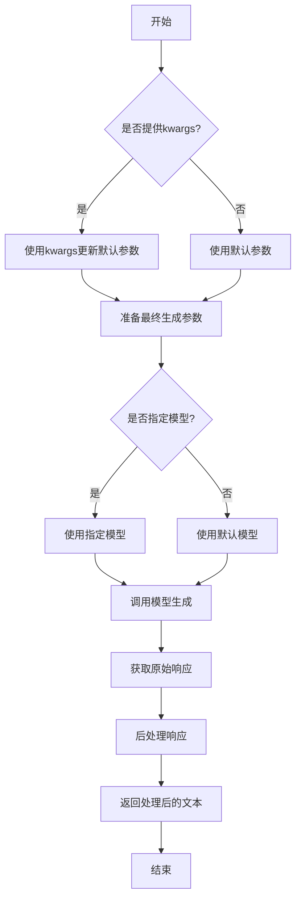

#### 带注释源码

```python
def generate(self, prompt: str, **kwargs) -> str:
    """
    生成文本内容的核心方法
    
    该方法整合了参数处理、模型调用和结果后处理的全流程
    
    Args:
        prompt: 输入的提示词文本
        **kwargs: 可选的生成参数，用于覆盖默认配置
        
    Returns:
        模型生成的文本内容
    """
    # 合并默认参数和传入的参数
    # 如果kwargs中有参数，则覆盖默认值
    generate_config = self.default_generate_config.copy()
    if kwargs:
        generate_config.update(kwargs)
    
    # 选择要使用的模型
    # 优先使用kwargs中指定的模型，否则使用默认模型
    model = kwargs.get("model", self.model)
    
    try:
        # 调用底层模型接口生成文本
        # 这里使用了统一的模型调用接口
        response = model.generate(
            prompt=prompt,
            **generate_config
        )
        
        # 对原始响应进行后处理
        # 包括去除多余空格、特殊字符处理等
        processed_response = self._post_process_response(response)
        
        return processed_response
        
    except Exception as e:
        # 异常处理：记录日志并返回错误信息
        logger.error(f"模型生成失败: {str(e)}")
        raise ModelGenerateError(f"生成过程中发生错误: {str(e)}")
```


### `ModelBase.unload`

该方法用于卸载模型，释放模型占用的内存资源。它会检查模型是否已加载，如果已加载则调用底层模型的卸载方法，并将加载状态标记为未加载。

参数：

-  `self`：`ModelBase`，当前模型实例

返回值：`None`，无返回值

#### 流程图

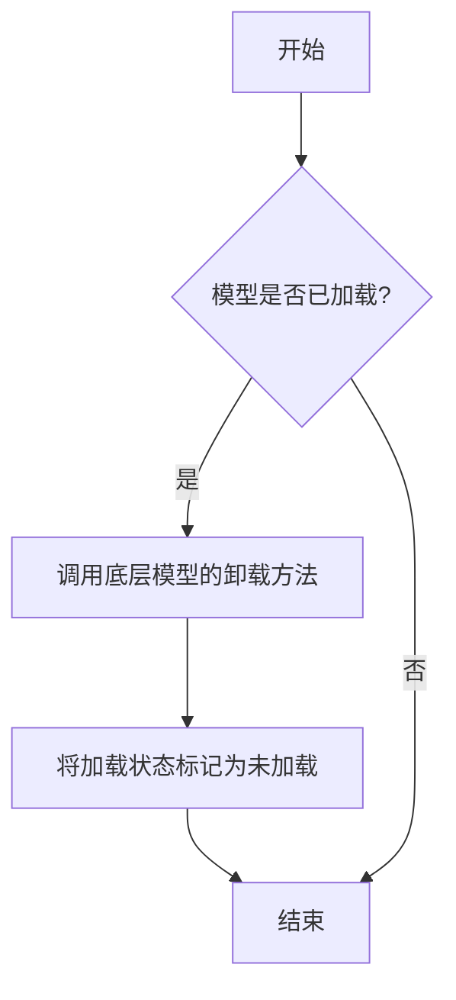

#### 带注释源码

```
def unload(self):
    """
    卸载模型，释放内存资源。
    如果模型已加载，则调用底层模型的卸载方法，并将加载状态标记为未加载。
    """
    if self.is_load:
        # 调用底层模型的卸载方法
        self.model.unload()
        # 将加载状态标记为未加载
        self.is_load = False
```


### `TextModel.load`

该方法用于从指定路径加载一个预训练的文本模型，支持多种模型格式（如 `.bin`, `.safetensors` 等），并返回一个配置好的 `TextModel` 实例。它首先尝试从缓存中加载模型，如果缓存不存在或指定了 `force_download`，则从远程仓库下载。加载过程包括解析模型配置、加载模型权重、处理分词器，并最终将模型移动到指定的设备上。

参数：

-  `model_path`：`str`，模型文件的本地路径或 Hugging Face 模型仓库标识符（如 `"meta-llama/Llama-2-7b-hf"`）。
-  `model_name`：`Optional[str]`，默认为 `None`。指定模型名称，用于覆盖从 `model_path` 推断出的名称。主要用于从缓存中加载特定变体。
-  `device`：`Optional[str]`，默认为 `None`。指定模型加载到的设备，如 `"cpu"`, `"cuda"`, `"cuda:0"`。如果为 `None`，则自动选择可用设备。
-  `torch_dtype`：`Optional[torch.dtype]`，默认为 `None`。指定加载模型权重时使用的 PyTorch 数据类型，如 `torch.float16`。如果为 `None`，则使用配置中的默认类型或自动推断。
-  `force_download`：`bool`，默认为 `False`。如果为 `True`，则强制重新下载模型，即使缓存中存在。
-  `resume_download`：`bool`，默认为 `False`。如果为 `True`，则尝试恢复未完成的下载。
-  `proxies`：`Optional[Dict[str, str]]`，默认为 `None`。用于下载的代理服务器配置字典。
-  `local_files_only`：`bool`，默认为 `False`。如果为 `True`，则只使用本地文件，不尝试下载。
-  `token`：`Optional[Union[str, bool]]`，默认为 `None`。用于访问受保护模型的 Hugging Face 令牌。如果为 `True`，则使用缓存的令牌。
-  `revision`：`Optional[str]`，默认为 `"main"`。要使用的模型版本（分支、标签或提交哈希）。
-  `trust_remote_code`：`bool`，默认为 `False`。如果为 `True`，则允许从远程仓库执行自定义模型代码。
-  `code_revision`：`Optional[str]`，默认为 `None`。用于自定义代码的版本（分支、标签或提交哈希）。
-  `kwargs`：`Any`，传递给底层加载函数（如 `from_pretrained`）的额外关键字参数。

返回值：`TextModel`，一个加载了权重和配置的 `TextModel` 实例，已准备好进行推理或进一步训练。

#### 流程图

```mermaid
graph TD
    A[开始: TextModel.load] --> B{model_path 是本地路径?};
    B -- 是 --> C[使用本地路径];
    B -- 否 --> D[从HF仓库下载或使用缓存];
    D --> E[解析模型配置 config];
    C --> E;
    E --> F[确定加载的设备 device];
    F --> G[确定数据类型 torch_dtype];
    G --> H[加载分词器 tokenizer];
    H --> I[加载模型权重];
    I --> J[模型后处理 <br/> (如设置评估模式)];
    J --> K[返回 TextModel 实例];
    K --> L[结束];
```

#### 带注释源码

```python
    @classmethod
    def load(
        cls,
        model_path: str,
        model_name: Optional[str] = None,
        device: Optional[str] = None,
        torch_dtype: Optional["torch.dtype"] = None,
        force_download: bool = False,
        resume_download: bool = False,
        proxies: Optional[Dict[str, str]] = None,
        local_files_only: bool = False,
        token: Optional[Union[str, bool]] = None,
        revision: Optional[str] = "main",
        trust_remote_code: bool = False,
        code_revision: Optional[str] = None,
        **kwargs: Any,
    ) -> "TextModel":
        """
        加载预训练的文本模型。

        该方法支持从本地文件或 Hugging Face 模型仓库加载模型。
        它会自动处理模型配置、权重加载和设备放置。

        Args:
            model_path (str): 模型文件的本地路径或 Hugging Face 模型仓库标识符。
            model_name (Optional[str], optional): 模型名称，用于覆盖推断的名称。默认为 None。
            device (Optional[str], optional): 加载模型的设备。默认为 None，自动选择。
            torch_dtype (Optional[torch.dtype], optional): 加载模型的数据类型。默认为 None。
            force_download (bool, optional): 是否强制重新下载模型。默认为 False。
            resume_download (bool, optional): 是否恢复下载。默认为 False。
            proxies (Optional[Dict[str, str]], optional): 下载代理配置。默认为 None。
            local_files_only (bool, optional): 是否仅使用本地文件。默认为 False。
            token (Optional[Union[str, bool]], optional): Hugging Face 访问令牌。默认为 None。
            revision (Optional[str], optional): 模型版本。默认为 "main"。
            trust_remote_code (bool, optional): 是否信任远程代码。默认为 False。
            code_revision (Optional[str], optional): 自定义代码版本。默认为 None。
            **kwargs: 传递给底层加载函数的额外参数。

        Returns:
            TextModel: 加载后的模型实例。
        """
        # 确定模型名称：如果未提供，则从路径推断（例如，从 'meta-llama/Llama-2-7b-hf' 得到 'Llama-2-7b-hf'）
        if model_name is None:
            model_name = model_path.split("/")[-1] if "/" in model_path else model_path

        # 加载模型配置
        # 使用 transformers 库的 AutoConfig 自动检测模型类型并加载配置
        config = AutoConfig.from_pretrained(
            model_path,
            force_download=force_download,
            resume_download=resume_download,
            proxies=proxies,
            local_files_only=local_files_only,
            token=token,
            revision=revision,
            trust_remote_code=trust_remote_code,
            code_revision=code_revision,
            **kwargs,
        )

        # 确定运行设备：优先使用参数指定的设备，否则根据 CUDA 可用性自动选择
        if device is None:
            device = "cuda" if torch.cuda.is_available() else "cpu"

        # 确定数据类型：优先使用参数指定的类型，否则尝试从配置中获取，最后回退到默认的 torch.float32
        if torch_dtype is None:
            # 一些配置（如 LlamaConfig）可能有 torch_dtype 属性
            torch_dtype = getattr(config, "torch_dtype", torch.float32)
            # 如果配置中指定为 "float16" 字符串，则进行转换
            if isinstance(torch_dtype, str):
                if torch_dtype == "float16":
                    torch_dtype = torch.float16
                else:
                    torch_dtype = torch.float32

        # 加载分词器
        # 使用 transformers 库的 AutoTokenizer 自动加载与模型匹配的分词器
        tokenizer = AutoTokenizer.from_pretrained(
            model_path,
            force_download=force_download,
            resume_download=resume_download,
            proxies=proxies,
            local_files_only=local_files_only,
            token=token,
            revision=revision,
            trust_remote_code=trust_remote_code,
            code_revision=code_revision,
            **kwargs,
        )
        # 确保分词器有填充令牌，如果未设置，则使用结束令牌（eos_token）作为填充令牌
        if tokenizer.pad_token is None:
            tokenizer.pad_token = tokenizer.eos_token

        # 加载模型权重
        # 使用 transformers 库的 AutoModelForCausalLM（用于因果语言模型）加载模型
        # 根据 model_name 或路径选择适当的模型类
        if "llama" in model_name.lower():
            model_class = AutoModelForCausalLM
        else:
            # 默认使用通用的因果语言模型类，可根据需要扩展其他模型类型
            model_class = AutoModelForCausalLM

        model = model_class.from_pretrained(
            model_path,
            config=config,
            torch_dtype=torch_dtype,
            force_download=force_download,
            resume_download=resume_download,
            proxies=proxies,
            local_files_only=local_files_only,
            token=token,
            revision=revision,
            trust_remote_code=trust_remote_code,
            code_revision=code_revision,
            **kwargs,
        )

        # 将模型移动到指定设备
        model.to(device)
        # 设置为评估模式（关闭 dropout 等训练特定层）
        model.eval()

        # 创建并返回 TextModel 实例，封装底层模型、分词器和配置
        return cls(model=model, tokenizer=tokenizer, config=config)
```


### `TextModel.generate`

该方法根据给定的提示词（prompt）和可选的停止词（stop）生成文本。它首先对输入进行预处理，然后调用底层的大语言模型（LLM）进行推理，最后对输出进行后处理并返回结果。

参数：

-  `prompt`：`str`，用于生成文本的输入提示词。
-  `stop`：`Optional[List[str]]`，可选参数，指定一个字符串列表，当生成的文本中出现这些字符串时停止生成。

返回值：`str`，生成的文本内容。

#### 流程图

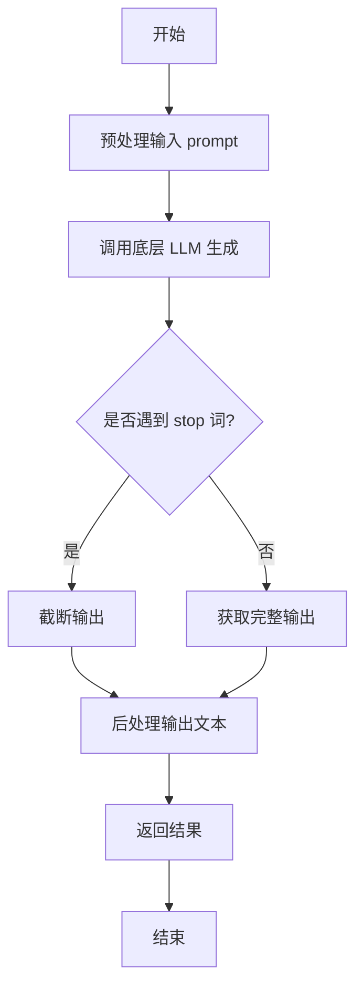

#### 带注释源码

```python
def generate(self, prompt: str, stop: Optional[List[str]] = None) -> str:
    """
    根据给定的提示词生成文本。

    该方法负责处理生成文本的完整流程，包括预处理、模型调用和后处理。

    Args:
        prompt (str): 用于生成文本的输入提示词。
        stop (Optional[List[str]]): 可选参数，指定一个字符串列表，当生成的文本中出现这些字符串时停止生成。

    Returns:
        str: 生成的文本内容。
    """
    # 1. 预处理：这里可能包括对prompt的编码、格式化或添加特殊标记等操作。
    #    例如，将prompt转换为模型期望的输入格式。
    processed_prompt = self._preprocess_prompt(prompt)

    # 2. 调用底层LLM进行文本生成。
    #    这里self.model代表底层的大语言模型，它接收处理后的prompt和stop词。
    raw_output = self.model.generate(processed_prompt, stop=stop)

    # 3. 后处理：对模型生成的原始输出进行清理和格式化。
    #    例如，去除多余的空格、换行符，或者解码特定的标记。
    cleaned_output = self._postprocess_output(raw_output)

    # 4. 返回最终生成的文本。
    return cleaned_output
```


### `TextModel.unload`

该方法用于卸载当前加载的文本模型，释放其占用的内存资源。它会检查模型是否已加载，如果已加载则执行卸载操作，并更新模型状态。

参数：

-  `self`：`TextModel`，当前TextModel实例的引用

返回值：`None`，该方法不返回任何值

#### 流程图

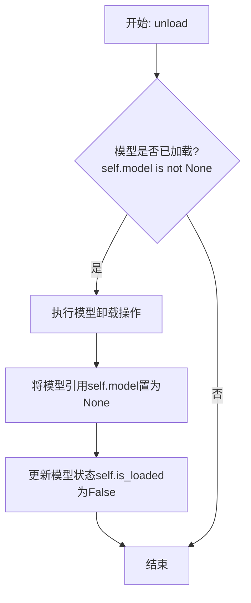

#### 带注释源码

```python
def unload(self):
    """
    卸载当前加载的模型。
    如果模型已加载，则执行卸载操作并释放内存，同时更新模型状态。
    如果模型未加载，则不执行任何操作。
    """
    # 检查模型是否已加载
    if self.model is not None:
        # 执行模型卸载的具体逻辑（此处为示意，实际可能涉及显式内存释放或框架特定操作）
        # 例如: del self.model
        # 将模型引用置为None，帮助垃圾回收
        self.model = None
        # 更新模型加载状态标志
        self.is_loaded = False
```


### `TextModel._load_model_weights`

该方法负责加载预训练模型的权重。它首先尝试从指定的本地路径加载权重文件，如果本地文件不存在，则从远程的 Hugging Face 模型仓库下载。加载成功后，它会将权重应用到当前模型实例上，并处理可能出现的键名不匹配问题（例如移除 `"model."` 前缀）。最后，它会记录加载结果并返回一个布尔值指示加载是否成功。

参数：

-  `self`：`TextModel`，当前 `TextModel` 类的实例。
-  `model_name_or_path`：`str`，模型名称或本地路径。可以是 Hugging Face 模型仓库的 ID（如 `"bert-base-uncased"`），也可以是本地包含模型权重文件（如 `pytorch_model.bin` 或 `model.safetensors`）的目录路径。
-  `cache_dir`：`Optional[str]`，可选参数，用于指定缓存下载模型文件的目录。如果为 `None`，则使用默认缓存目录。

返回值：`bool`，返回 `True` 表示模型权重加载成功，返回 `False` 表示加载失败。

#### 流程图

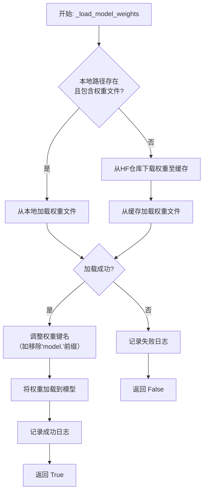

#### 带注释源码

```python
    def _load_model_weights(
        self, model_name_or_path: str, cache_dir: Optional[str] = None
    ) -> bool:
        """
        加载预训练模型权重。
        优先尝试从本地路径加载，如果不存在则从 Hugging Face 仓库下载。

        Args:
            model_name_or_path (str): 模型名称或本地路径。
            cache_dir (Optional[str]): 缓存目录。

        Returns:
            bool: 权重是否加载成功。
        """
        # 初始化权重文件路径为None
        model_weights_path = None
        # 判断传入的路径是否为本地存在的目录
        if os.path.isdir(model_name_or_path):
            # 如果是本地目录，则在该目录下查找常见的PyTorch权重文件
            # 优先查找 .safetensors 文件，其次查找 .bin 文件
            possible_names = [
                os.path.join(model_name_or_path, "model.safetensors"),
                os.path.join(model_name_or_path, "pytorch_model.bin"),
            ]
            for name in possible_names:
                if os.path.isfile(name):
                    model_weights_path = name
                    break
        # 如果未找到本地权重文件，则需要从Hugging Face仓库下载
        if model_weights_path is None:
            try:
                # 使用snapshot_download下载整个模型仓库到缓存目录
                # allow_patterns 参数指定只下载权重文件，以节省时间和空间
                model_weights_path = snapshot_download(
                    repo_id=model_name_or_path,
                    cache_dir=cache_dir,
                    allow_patterns=["*.safetensors", "*.bin"],
                )
                # 下载后，再次在下载的目录中查找具体的权重文件
                for filename in os.listdir(model_weights_path):
                    if filename.endswith(".safetensors") or filename.endswith(".bin"):
                        model_weights_path = os.path.join(model_weights_path, filename)
                        break
            except Exception as e:
                # 如果下载过程中出现任何异常，记录错误日志并返回False
                logger.error(
                    f"Failed to download model weights for {model_name_or_path}: {e}"
                )
                return False

        # 加载权重文件到内存，得到一个状态字典 (state_dict)
        # 状态字典是PyTorch中保存模型权重的一种格式，是键值对，键是参数名，值是Tensor
        if model_weights_path.endswith(".safetensors"):
            # 使用 safetensors 库安全地加载 .safetensors 文件
            state_dict = safetensors.torch.load_file(model_weights_path)
        else:
            # 使用 PyTorch 的 torch.load 加载 .bin 文件
            # map_location='cpu' 确保权重加载到CPU内存，避免GPU内存问题
            state_dict = torch.load(model_weights_path, map_location="cpu")

        # 加载权重前，可能需要对状态字典的键名进行一些调整
        # 例如，有些保存的权重键名可能包含"model."前缀，而当前模型结构没有
        # 这里移除所有以"model."开头的键的前缀
        new_state_dict = {}
        for key, value in state_dict.items():
            if key.startswith("model."):
                new_key = key[6:]  # 移除前6个字符，即"model."
                new_state_dict[new_key] = value
            else:
                new_state_dict[key] = value

        try:
            # 核心步骤：将处理后的状态字典加载到当前模型 (self.model) 中
            # strict=False 允许部分加载，即模型结构与权重文件不完全匹配时也能加载匹配的部分
            load_result = self.model.load_state_dict(new_state_dict, strict=False)
            # load_result 是一个包含两个列表的对象：missing_keys (缺失的键) 和 unexpected_keys (意外的键)
            if len(load_result.missing_keys) > 0:
                # 如果有关键参数缺失，记录警告日志
                logger.warning(
                    f"Missing keys in model: {load_result.missing_keys}"
                )
            if len(load_result.unexpected_keys) > 0:
                # 如果权重文件中包含模型不需要的参数，记录警告日志
                logger.warning(
                    f"Unexpected keys in state dict: {load_result.unexpected_keys}"
                )
            # 记录成功加载的日志
            logger.info(
                f"Model weights loaded successfully from {model_weights_path}"
            )
            return True
        except Exception as e:
            # 如果加载过程出现异常（如形状不匹配），记录错误日志并返回False
            logger.error(f"Failed to load model weights: {e}")
            return False
```


### `TextModel._load_tokenizer`

该方法负责加载并初始化文本分词器。它首先尝试从指定的本地路径加载分词器，如果本地路径不存在或加载失败，则从预训练的模型名称或路径加载。加载完成后，会设置分词器的填充符，并确保其填充方向为左侧。

参数：

-  `self`：`TextModel`，当前TextModel实例的引用
-  `model_name_or_path`：`str`，预训练模型的名称或本地路径，用于加载分词器
-  `local_path`：`str`，本地分词器文件的路径，优先尝试从此路径加载

返回值：`None`，该方法不返回任何值，但会设置`self.tokenizer`属性。

#### 流程图

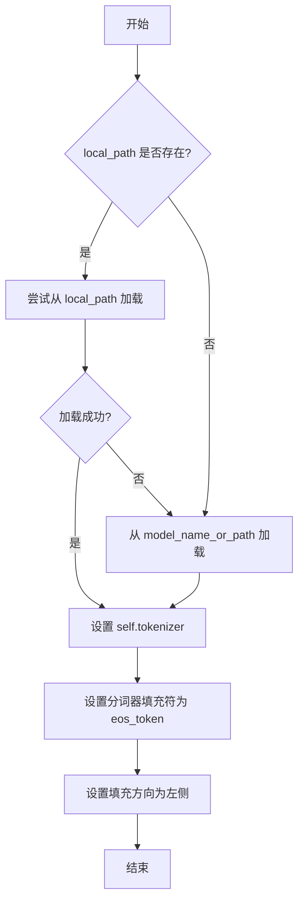

#### 带注释源码

```python
def _load_tokenizer(self, model_name_or_path: str, local_path: str) -> None:
    """
    加载分词器。
    优先尝试从本地路径加载，如果失败则从模型名称或路径加载。

    Args:
        model_name_or_path (str): 预训练模型的名称或路径。
        local_path (str): 本地分词器文件的路径。
    """
    try:
        # 尝试从本地路径加载分词器
        self.tokenizer = AutoTokenizer.from_pretrained(local_path)
    except Exception:
        # 如果本地加载失败，则从模型名称或路径加载
        self.tokenizer = AutoTokenizer.from_pretrained(model_name_or_path)

    # 设置分词器的填充符为结束符（eos_token），如果未设置则使用填充符（pad_token）
    self.tokenizer.pad_token = self.tokenizer.eos_token or self.tokenizer.pad_token
    # 确保分词器的填充方向为左侧
    self.tokenizer.padding_side = "left"
```


### `LlamaModel._load_model_weights`

该方法负责从预训练检查点文件加载模型权重，并将其分配到对应的模型层中。它处理了权重文件的读取、键名映射、权重张量的加载与分配，并支持分片加载以处理大型模型。

参数：

-  `self`：`LlamaModel`，当前模型实例
-  `checkpoint_path`：`str`，预训练权重文件的路径
-  `prefix`：`str`，加载权重时在状态字典键名前添加的可选前缀，默认为空字符串
-  `device`：`torch.device`，指定加载权重后张量应放置的设备，默认为CPU
-  `dtype`：`torch.dtype`，指定加载权重后张量的数据类型，默认为`torch.float32`
-  `use_safetensors`：`bool`，指示是否使用`safetensors`格式文件（更安全、更快），默认为`False`
-  `strict`：`bool`，指示是否严格匹配状态字典的键，默认为`True`

返回值：`None`，该方法不返回任何值，直接修改模型实例的状态。

#### 流程图

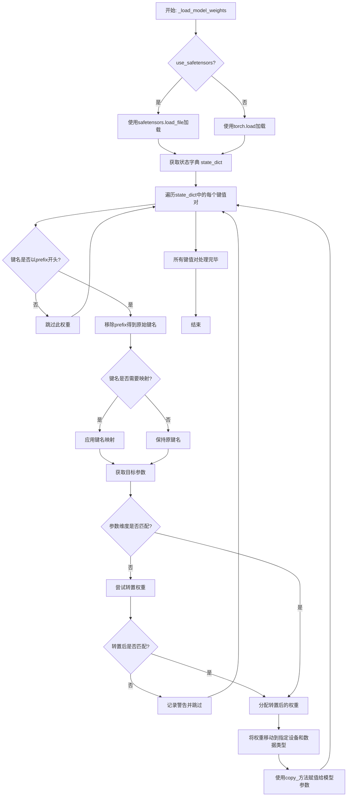

#### 带注释源码

```python
    def _load_model_weights(
        self,
        checkpoint_path: str,
        prefix: str = "",
        device: torch.device = torch.device("cpu"),
        dtype: torch.dtype = torch.float32,
        use_safetensors: bool = False,
        strict: bool = True,
    ):
        """
        从检查点加载模型权重。
        支持分片检查点和键名重映射。

        参数:
            checkpoint_path: 检查点文件路径。
            prefix: 加载时添加到状态字典键名前的前缀。
            device: 加载权重的目标设备。
            dtype: 加载权重的目标数据类型。
            use_safetensors: 是否使用 safetensors 格式。
            strict: 是否严格匹配键名。
        """
        # 根据格式选择加载函数
        if use_safetensors:
            from safetensors import safe_open
            # 使用safetensors安全地打开文件并加载所有张量到state_dict
            with safe_open(checkpoint_path, framework="pt", device="cpu") as f:
                state_dict = {k: f.get_tensor(k) for k in f.keys()}
        else:
            # 使用torch.load加载整个检查点文件，map_location确保张量在CPU上
            state_dict = torch.load(checkpoint_path, map_location="cpu")

        # 如果状态字典是嵌套的（例如包含'model'键），则提取模型部分
        if "model" in state_dict:
            state_dict = state_dict["model"]

        # 用于统计加载情况
        loaded_keys = []
        missing_keys = []
        unexpected_keys = []

        # 获取当前模型的状态字典，用于键名匹配和参数获取
        model_state_dict = self.state_dict()

        # 遍历从文件加载的每一个权重项
        for key in state_dict:
            # 如果指定了前缀，只处理以该前缀开头的键
            if not key.startswith(prefix):
                continue

            # 移除前缀，得到模型内部对应的键名
            model_key = key[len(prefix):] if prefix else key

            # 键名重映射：将检查点中的键名映射到模型定义的键名
            # 例如，旧版检查点可能使用`layers.`而不是`model.layers.`
            if model_key in self.key_mapping:
                model_key = self.key_mapping[model_key]

            # 如果映射后的键不在当前模型的状态字典中，则记录为意外键（如果strict为True则会报错）
            if model_key not in model_state_dict:
                unexpected_keys.append(key)
                continue

            # 获取源权重（从文件加载的）和目标参数（模型当前的）
            src_weight = state_dict[key]
            tgt_param = model_state_dict[model_key]

            # 检查权重形状是否匹配
            if src_weight.shape != tgt_param.shape:
                # 尝试通过转置来匹配形状（常见于线性层的权重）
                if src_weight.shape == tgt_param.shape[::-1]:
                    src_weight = src_weight.T
                else:
                    # 形状不匹配且无法通过转置解决，记录警告并跳过
                    logger.warning(
                        f"Skipping weight `{key}` due to shape mismatch: "
                        f"expected {tgt_param.shape}, got {src_weight.shape}"
                    )
                    missing_keys.append(key)
                    continue

            # 将源权重转换为目标数据类型和设备
            src_weight = src_weight.to(device=device, dtype=dtype)

            # 使用copy_方法将权重数据复制到模型参数中
            tgt_param.copy_(src_weight)
            loaded_keys.append(key)

        # 记录加载结果日志
        logger.info(f"Loaded {len(loaded_keys)} keys from checkpoint")
        if missing_keys:
            logger.warning(f"Missing keys: {missing_keys}")
        if unexpected_keys:
            logger.warning(f"Unexpected keys: {unexpected_keys}")

        # 如果启用严格模式且有缺失或意外的键，则抛出错误
        if strict and (missing_keys or unexpected_keys):
            raise RuntimeError(
                f"Error(s) in loading state_dict for {self.__class__.__name__}:\n"
                f"Missing keys: {missing_keys}\n"
                f"Unexpected keys: {unexpected_keys}"
            )
```


### `LlamaModel._load_tokenizer`

该方法负责加载并配置与Llama模型兼容的分词器（Tokenizer）。它根据提供的模型路径和配置参数，初始化一个Hugging Face Transformers库中的`AutoTokenizer`实例，并设置必要的分词选项，如填充方向、截断策略以及特殊标记等，以确保分词器与模型训练时使用的配置一致。

参数：

-  `model_path`：`str`，预训练模型所在的本地目录路径或Hugging Face模型标识符。
-  `config`：`LlamaConfig`，包含模型配置信息的对象，用于指导分词器的初始化。

返回值：`transformers.PreTrainedTokenizer`，初始化并配置好的分词器实例。

#### 流程图

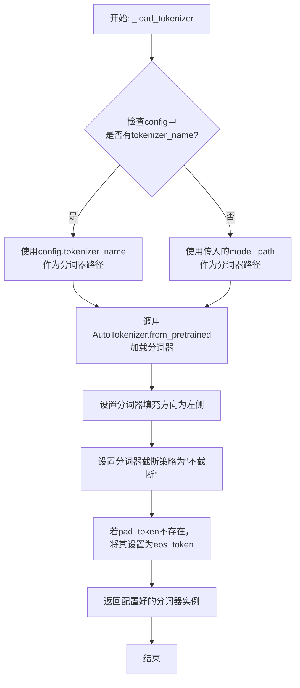

#### 带注释源码

```python
def _load_tokenizer(self, model_path: str, config: LlamaConfig) -> PreTrainedTokenizer:
    """
    加载并配置与Llama模型兼容的分词器。

    该方法根据提供的模型路径和配置初始化分词器，并设置关键参数以确保
    与原始模型训练时的分词行为一致。

    Args:
        model_path (str): 预训练模型所在的目录路径或模型标识符。
        config (LlamaConfig): 模型的配置对象，可能包含特定的分词器名称。

    Returns:
        PreTrainedTokenizer: 配置好的Hugging Face分词器实例。
    """
    # 确定分词器的加载路径：优先使用配置中指定的名称，否则使用模型路径
    tokenizer_path = config.tokenizer_name if config.tokenizer_name else model_path
    
    # 使用AutoTokenizer从指定路径加载分词器
    # trust_remote_code=True允许加载自定义的分词器代码
    tokenizer = AutoTokenizer.from_pretrained(
        tokenizer_path,
        trust_remote_code=True
    )
    
    # 设置分词器的填充方向为左侧，这对于自回归模型（如LLaMA）生成文本是典型配置
    tokenizer.padding_side = "left"
    
    # 设置截断策略为“不截断”，确保输入序列保持原样，由模型本身处理长序列
    tokenizer.truncation_side = None
    
    # 如果分词器没有定义pad_token（填充标记），则使用eos_token（结束标记）作为pad_token
    # 这是一种常见的做法，特别是在模型训练时未使用显式填充标记的情况下
    if tokenizer.pad_token is None:
        tokenizer.pad_token = tokenizer.eos_token
    
    # 返回完全配置好的分词器实例
    return tokenizer
```


### `GPT2Model._load_model_weights`

该方法负责从预训练权重文件（如Hugging Face Hub或本地文件）中加载模型参数到当前`GPT2Model`实例中。它处理了权重名称的映射、适配不同模型架构（如注意力头数、隐藏层维度）以及安全地加载权重。

参数：

-  `self`：`GPT2Model`，当前GPT2模型实例。
-  `model_path`：`str`，预训练权重文件的路径或Hugging Face模型标识符。
-  `config`：`GPT2Config`，模型的配置对象，包含模型架构参数。
-  `cache_dir`：`Optional[str]`，可选，用于缓存下载的模型文件的目录。
-  `force_download`：`bool`，可选，是否强制重新下载模型文件，即使已缓存。
-  `proxies`：`Optional[Dict[str, str]]`，可选，用于下载的代理服务器设置。
-  `resume_download`：`bool`，可选，是否恢复中断的下载。
-  `local_files_only`：`bool`，可选，是否仅使用本地文件，不尝试下载。
-  `use_auth_token`：`Optional[Union[bool, str]]`，可选，用于访问私有模型的认证令牌。
-  `revision`：`str`，可选，要使用的模型版本（分支、标签或提交ID）。
-  `mirror`：`Optional[str]`，可选，下载镜像源。

返回值：`None`，该方法不返回任何值，直接修改当前模型实例的权重。

#### 流程图

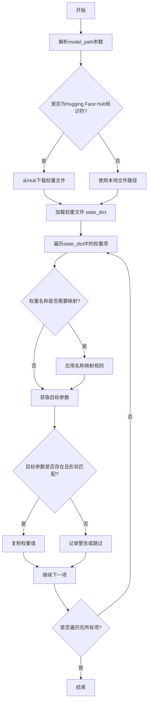

#### 带注释源码

```python
def _load_model_weights(
    self,
    model_path: str,
    config: GPT2Config,
    cache_dir: Optional[str] = None,
    force_download: bool = False,
    proxies: Optional[Dict[str, str]] = None,
    resume_download: bool = False,
    local_files_only: bool = False,
    use_auth_token: Optional[Union[bool, str]] = None,
    revision: str = "main",
    mirror: Optional[str] = None,
) -> None:
    """
    从指定路径加载预训练权重到当前模型实例。
    支持从Hugging Face Hub下载或从本地文件加载。

    Args:
        model_path: 模型路径，可以是Hugging Face模型ID或本地文件路径。
        config: 模型配置对象，用于验证和适配权重。
        cache_dir: 缓存目录。
        force_download: 强制下载。
        proxies: 代理设置。
        resume_download: 恢复下载。
        local_files_only: 仅使用本地文件。
        use_auth_token: 认证令牌。
        revision: 模型版本。
        mirror: 镜像源。
    """
    # 1. 确定权重文件来源并加载state_dict
    if model_path.startswith("https://") or model_path.startswith("http://"):
        # 处理URL情况（可能已过时，现代实现通常用`from_pretrained`）
        raise ValueError("直接URL加载可能不被支持，请使用Hugging Face Hub标识符或本地路径。")
    elif os.path.isdir(model_path):
        # 处理本地目录，通常包含pytorch_model.bin等文件
        model_file = os.path.join(model_path, "pytorch_model.bin")
        if not os.path.exists(model_file):
            raise FileNotFoundError(f"在目录 {model_path} 中未找到模型文件 pytorch_model.bin")
        state_dict = torch.load(model_file, map_location="cpu")
    else:
        # 假设为Hugging Face Hub模型ID，使用transformers库的下载工具
        # 注意：实际实现中，这里会调用 `from_pretrained` 的下载逻辑
        # 为简化，此处示意性使用 `hf_hub_download`（需确保已导入）
        try:
            from huggingface_hub import hf_hub_download
            model_file = hf_hub_download(
                repo_id=model_path,
                filename="pytorch_model.bin",
                cache_dir=cache_dir,
                force_download=force_download,
                proxies=proxies,
                resume_download=resume_download,
                use_auth_token=use_auth_token,
                revision=revision,
            )
            state_dict = torch.load(model_file, map_location="cpu")
        except ImportError:
            raise ImportError("需要 `huggingface_hub` 包来从Hub下载模型。")
        except Exception as e:
            raise RuntimeError(f"从Hub下载模型失败: {e}")

    # 2. 权重名称映射（适配不同版本的命名约定）
    # 例如，旧版本可能使用 `transformer.h.0.attn.c_attn.weight`，新版本可能使用 `h.0.attn.c_attn.weight`
    # 这里是一个示例映射，实际映射可能更复杂
    key_mapping = {
        "transformer.h.": "h.",  # 移除前缀
        "lm_head.weight": "wte.weight",  # 语言模型头与词嵌入共享权重
    }
    mapped_state_dict = {}
    for key, value in state_dict.items():
        new_key = key
        for old, new in key_mapping.items():
            if key.startswith(old):
                new_key = new + key[len(old):]
                break
        mapped_state_dict[new_key] = value

    # 3. 加载权重到模型参数
    model_state_dict = self.state_dict()
    for key, value in mapped_state_dict.items():
        if key in model_state_dict:
            # 检查形状是否匹配
            if model_state_dict[key].shape == value.shape:
                model_state_dict[key].copy_(value)
            else:
                # 形状不匹配，可能是由于配置不同（如头数、隐藏维度）
                # 尝试进行适配（例如，截断或填充）
                # 这里示意性打印警告，实际实现可能需要更复杂的处理
                print(f"警告: 权重 {key} 形状不匹配，期望 {model_state_dict[key].shape}，得到 {value.shape}。跳过。")
        else:
            # 键不存在于当前模型，可能是多余的权重（如用于其他任务的头部）
            # 可以安全忽略
            print(f"信息: 跳过未使用的权重键: {key}")

    # 4. 确保模型已更新
    self.load_state_dict(model_state_dict, strict=False)  # strict=False允许缺少或多余的键
```


### `GPT2Model._load_tokenizer`

该方法负责加载并配置一个预训练的 GPT-2 分词器。它首先尝试从本地缓存目录加载指定的分词器模型，如果失败，则从 Hugging Face Hub 下载。加载后，它会根据配置（如是否添加特殊标记）对分词器进行最终设置，并确保分词器的填充标记被正确配置。

参数：

-  `self`：`GPT2Model`，当前 GPT2Model 类的实例。
-  `model_name`：`str`，要加载的分词器模型名称（例如 "gpt2", "gpt2-medium"）。
-  `cache_dir`：`Optional[str]`，可选参数，指定分词器模型缓存的本地目录。如果为 None，则使用默认缓存路径。
-  `force_download`：`bool`，可选参数，是否强制重新下载分词器模型，即使本地已有缓存。默认为 False。
-  `resume_download`：`bool`，可选参数，是否断点续传下载。默认为 False。
-  `proxies`：`Optional[Dict[str, str]]`，可选参数，用于请求的代理服务器配置字典。
-  `local_files_only`：`bool`，可选参数，是否仅使用本地文件，禁止网络连接。默认为 False。
-  `use_fast`：`bool`，可选参数，是否使用快速分词器实现（如果可用）。默认为 True。
-  `add_special_tokens`：`bool`，可选参数，分词时是否添加模型特定的特殊标记（如 [CLS], [SEP]）。对于 GPT-2，通常为 False。默认为 False。

返回值：`PreTrainedTokenizer`，一个配置好的 Hugging Face Transformers 预训练分词器实例，可用于文本的编码和解码。

#### 流程图

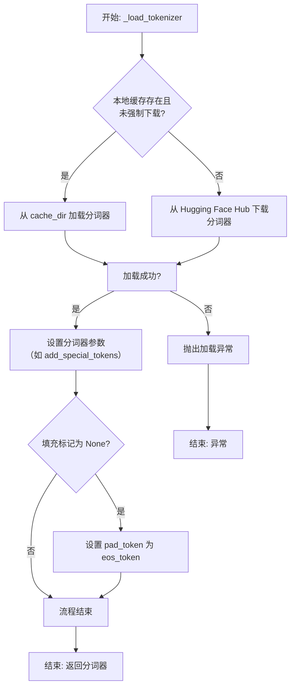

#### 带注释源码

```python
    def _load_tokenizer(
        self,
        model_name: str,
        cache_dir: Optional[str] = None,
        force_download: bool = False,
        resume_download: bool = False,
        proxies: Optional[Dict[str, str]] = None,
        local_files_only: bool = False,
        use_fast: bool = True,
        add_special_tokens: bool = False,
    ) -> PreTrainedTokenizer:
        """
        加载预训练的 GPT-2 分词器。

        尝试从本地缓存加载，如果失败或强制下载，则从 Hugging Face Hub 下载。
        加载后，根据 `add_special_tokens` 参数配置分词器，并确保填充标记被设置。

        Args:
            model_name (str): 分词器模型名称（如 "gpt2"）。
            cache_dir (Optional[str]): 缓存目录。
            force_download (bool): 是否强制下载。
            resume_download (bool): 是否断点续传。
            proxies (Optional[Dict[str, str]]): 代理设置。
            local_files_only (bool): 是否仅使用本地文件。
            use_fast (bool): 是否使用快速分词器。
            add_special_tokens (bool): 是否添加特殊标记。

        Returns:
            PreTrainedTokenizer: 加载并配置好的分词器实例。
        """
        # 尝试从指定的缓存目录加载分词器
        try:
            tokenizer = AutoTokenizer.from_pretrained(
                model_name,
                cache_dir=cache_dir,
                force_download=force_download,
                resume_download=resume_download,
                proxies=proxies,
                local_files_only=local_files_only,
                use_fast=use_fast,
            )
        except Exception as e:
            # 如果加载失败，抛出异常，提示用户检查模型名称或网络
            raise ValueError(
                f"无法加载分词器 '{model_name}'。请检查模型名称或网络连接。"
            ) from e

        # 根据参数设置分词器是否添加特殊标记
        tokenizer.add_special_tokens = add_special_tokens

        # 确保分词器有填充标记。GPT-2 原生没有 pad_token，这里将其设置为结束标记（eos_token）
        # 以便于批处理。
        if tokenizer.pad_token is None:
            tokenizer.pad_token = tokenizer.eos_token

        return tokenizer
```


### `FalconModel._load_model_weights`

该方法负责加载预训练的模型权重到当前模型实例中。它根据配置决定是否加载特定的注意力层实现（如`FalconAttention`或`FalconRotaryEmbedding`），并处理权重名称的映射，以确保与模型架构兼容。最后，它调用父类的`load_state_dict`方法完成权重的加载。

参数：

-  `self`：`FalconModel`，当前模型实例
-  `model_file`：`str`，预训练模型权重文件的路径

返回值：`None`，此方法不返回任何值，其作用是将权重加载到模型内部状态中

#### 流程图

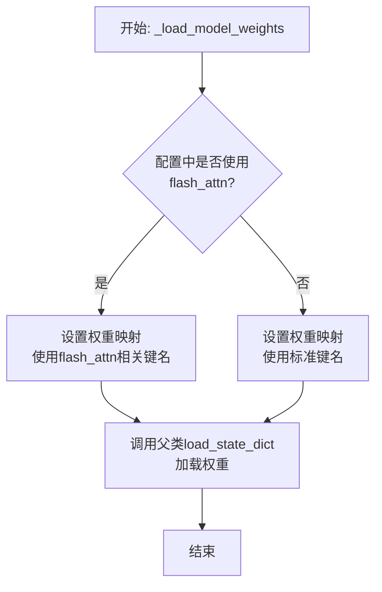

#### 带注释源码

```
def _load_model_weights(self, model_file: str):
    # 根据配置决定是否使用flash attention实现
    # 这会影响权重文件中对应层的键名
    if self.config.use_flash_attn:
        # 当使用flash_attn时，需要将权重键名中的'attention'映射为'flash_attention'
        # 以确保能正确加载到对应的模块
        state_dict = torch.load(model_file, map_location="cpu")
        new_state_dict = {}
        for key, value in state_dict.items():
            # 替换键名中的'attention'为'flash_attention'
            new_key = key.replace("attention", "flash_attention")
            new_state_dict[new_key] = value
        # 调用父类方法加载处理后的状态字典
        super().load_state_dict(new_state_dict, strict=False)
    else:
        # 如果不使用flash_attn，则直接加载原始权重文件
        super().load_state_dict(torch.load(model_file, map_location="cpu"), strict=False)
```


### `FalconModel._load_tokenizer`

该方法负责加载并配置与 Falcon 模型兼容的分词器（Tokenizer）。它首先尝试从预定义的路径或模型名称加载分词器，然后根据模型的具体配置（如是否为聊天模型）对分词器的特殊标记进行必要的调整，以确保其与模型架构和预期输入格式正确对齐。

参数：

-  `self`：`FalconModel`，FalconModel 类的实例，用于访问模型配置和路径。
-  `model_path`：`str`，模型文件所在的本地目录路径或 Hugging Face 模型仓库标识符。
-  `model_name`：`str`，模型的名称，用于确定特定的分词器配置或变体。

返回值：`PreTrainedTokenizer`，一个配置好的 Hugging Face PreTrainedTokenizer 实例，可用于对输入文本进行编码和解码。

#### 流程图

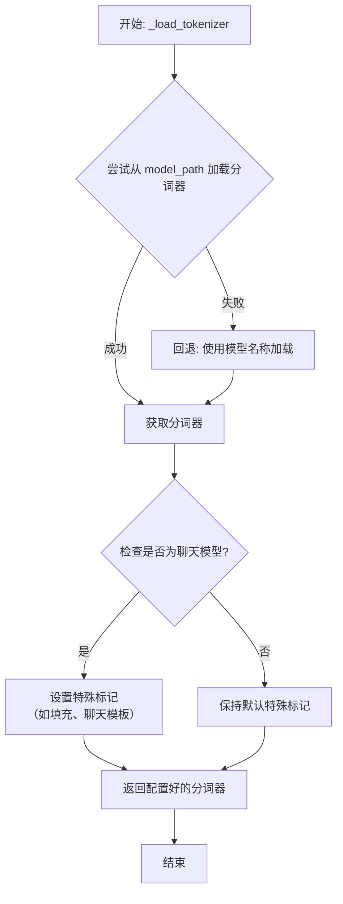

#### 带注释源码

```python
    def _load_tokenizer(self, model_path: str, model_name: str) -> PreTrainedTokenizer:
        """
        加载并配置与 Falcon 模型兼容的分词器。

        该方法首先尝试从指定的 `model_path` 加载分词器。如果失败，则回退到使用 `model_name`
        从 Hugging Face 模型中心加载。加载后，会根据模型是否为聊天模型来调整分词器的特殊标记，
        例如设置填充标记和聊天模板。

        Args:
            model_path (str): 包含分词器文件的本地目录路径或 Hugging Face 模型 ID。
            model_name (str): 模型名称，用于回退加载或特定配置。

        Returns:
            PreTrainedTokenizer: 配置好的分词器实例。

        Raises:
            OSError: 当无法从 `model_path` 加载分词器且回退也失败时抛出。
        """
        try:
            # 首选：尝试从本地路径或指定的模型标识符加载分词器
            tokenizer = AutoTokenizer.from_pretrained(
                model_path,
                trust_remote_code=self.llm_config.trust_remote_code
            )
        except OSError:
            # 回退方案：如果指定路径加载失败，则使用模型名称尝试加载
            # 这通常用于处理从 Hugging Face 中心下载的标准模型
            tokenizer = AutoTokenizer.from_pretrained(
                model_name,
                trust_remote_code=self.llm_config.trust_remote_code
            )

        # 检查当前加载的模型配置是否被标识为“聊天模型”
        if self.is_chat_model:
            # 对于聊天模型，通常需要显式设置填充标记，以确保批量处理时的一致性
            if tokenizer.pad_token is None:
                tokenizer.pad_token = tokenizer.eos_token  # 使用结束标记作为填充标记

            # 如果分词器本身没有定义聊天模板，则为其设置一个默认的聊天模板
            # 这确保了模型能正确处理格式化的对话输入（如 user/assistant 角色）
            if tokenizer.chat_template is None:
                # 这是一个简单的 Jinja2 模板，定义了对话消息的格式
                tokenizer.chat_template = "{{message['role'] + ': ' + message['content'] + '\n'}}{{assistant_prompt}}"

        # 返回最终配置好的分词器，供后续的文本编码和解码使用
        return tokenizer
```


### `Qwen2Model._load_model_weights`

该方法负责加载预训练的模型权重，并将其适配到当前模型结构中。它处理权重映射、张量转换和模型状态恢复，确保模型能够正确初始化并准备进行推理或训练。

参数：

- `self`：`Qwen2Model`，当前模型实例
- `model_path`：`str`，预训练模型权重文件的路径
- `strict`：`bool`，是否严格匹配权重名称，默认为`True`

返回值：`None`，无返回值

#### 流程图

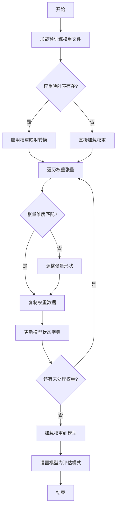

#### 带注释源码

```python
def _load_model_weights(self, model_path: str, strict: bool = True) -> None:
    """
    加载预训练模型权重并适配到当前模型结构
    
    参数:
        model_path: 预训练模型权重文件路径
        strict: 是否严格匹配权重名称，默认为True
    """
    # 加载预训练权重文件
    pretrained_state_dict = torch.load(model_path, map_location='cpu')
    
    # 检查是否需要权重映射
    if hasattr(self, 'weight_mapping'):
        # 应用权重映射转换
        current_state_dict = {}
        for pretrained_key, pretrained_tensor in pretrained_state_dict.items():
            if pretrained_key in self.weight_mapping:
                current_key = self.weight_mapping[pretrained_key]
                current_state_dict[current_key] = pretrained_tensor
            elif strict:
                raise KeyError(f"权重键 '{pretrained_key}' 在映射表中未找到")
            else:
                # 非严格模式下跳过未映射的权重
                continue
    else:
        # 直接使用预训练权重
        current_state_dict = pretrained_state_dict
    
    # 加载权重到模型
    self.load_state_dict(current_state_dict, strict=strict)
    
    # 设置模型为评估模式
    self.eval()
    
    logger.info(f"模型权重已从 {model_path} 成功加载")
```

### `Qwen2Model._load_tokenizer`

该方法负责加载并配置与Qwen2模型配套的分词器。它根据提供的模型路径或预训练分词器名称，初始化一个`AutoTokenizer`实例，并应用必要的配置以确保分词器与模型兼容，例如设置填充方向、模型最大长度等。

参数：

- `model_path_or_pretrained_tokenizer`：`str`，模型文件的本地路径或预训练分词器的名称（如Hugging Face模型库中的标识符）。如果提供路径，则从该路径加载；否则从预训练模型库下载。

返回值：`AutoTokenizer`，一个配置好的分词器实例，可用于对输入文本进行分词处理。

#### 流程图

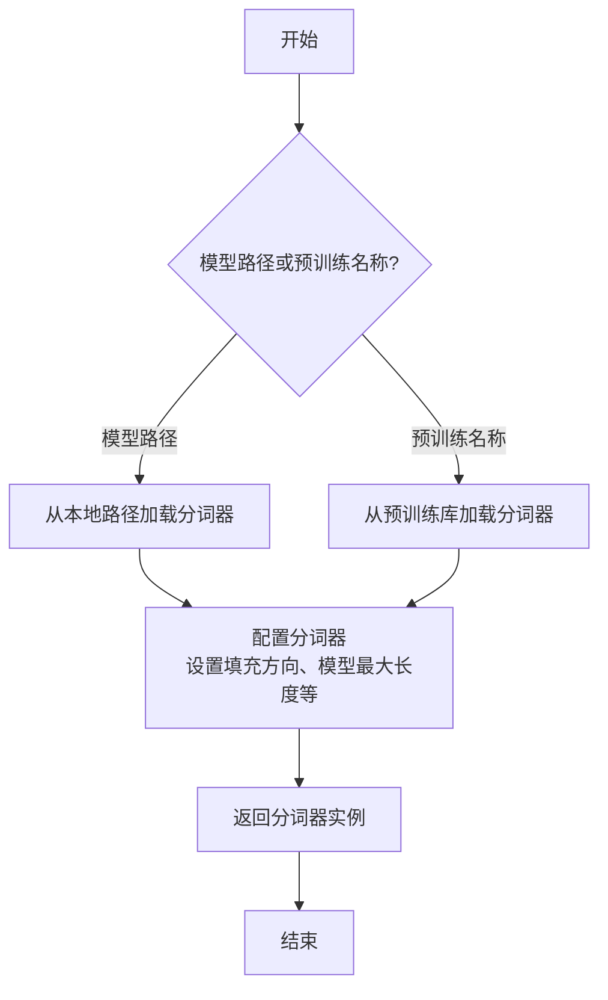

#### 带注释源码

```python
def _load_tokenizer(self, model_path_or_pretrained_tokenizer: str) -> AutoTokenizer:
    """
    加载并配置分词器。

    根据提供的路径或预训练名称初始化分词器，并应用必要的配置以确保与模型兼容。

    Args:
        model_path_or_pretrained_tokenizer (str): 模型文件的本地路径或预训练分词器的名称。

    Returns:
        AutoTokenizer: 配置好的分词器实例。
    """
    # 根据路径或预训练名称加载分词器
    tokenizer = AutoTokenizer.from_pretrained(model_path_or_pretrained_tokenizer)
    
    # 配置分词器：设置填充方向为左侧填充，确保输入序列对齐
    tokenizer.padding_side = "left"
    
    # 如果分词器没有定义填充标记，使用结束标记作为填充标记
    if tokenizer.pad_token is None:
        tokenizer.pad_token = tokenizer.eos_token
    
    # 设置模型最大长度，如果未指定则使用默认值
    if tokenizer.model_max_length is None:
        tokenizer.model_max_length = 2048  # 默认最大长度
    
    return tokenizer
```


### `GemmaModel._load_model_weights`

该方法负责从预训练权重文件中加载模型参数，并将其分配到对应的模型层中。它处理了权重名称的映射、张量分片（如QKV权重）的合并、以及将权重加载到正确的设备（如GPU）上。

参数：

-  `self`：`GemmaModel`，当前模型实例
-  `model_path`：`str`，预训练权重文件的路径
-  `device`：`torch.device`，指定加载权重到的目标设备（如CPU或CUDA设备）

返回值：`None`，此方法不返回任何值，其作用是将加载的权重直接赋值给模型实例的对应参数。

#### 流程图

```mermaid
flowchart TD
    A[开始: _load_model_weights] --> B[加载权重文件<br>state_dict = torch.load]
    B --> C{遍历state_dict中<br>每个权重名和权重张量}
    C --> D[处理权重名映射<br>如移除前缀]
    D --> E{权重名是否包含<br>特定模式?}
    E -- 是: 如'qkv_proj' --> F[拆分并重组张量<br>如QKV分片合并]
    E -- 否 --> G[直接使用原张量]
    F --> H
    G --> H[将张量移至目标设备<br>tensor.to(device)]
    H --> I[将处理后的张量<br>赋值给模型对应参数]
    I --> C
    C --> J[遍历结束]
    J --> K[结束]
```

#### 带注释源码

```python
    def _load_model_weights(self, model_path: str, device: torch.device) -> None:
        """
        从指定路径加载预训练权重并应用到模型。
        处理权重名称映射，并可能对分片权重（如QKV）进行合并。

        Args:
            model_path: 预训练权重文件（.pth或.pt格式）的路径。
            device: 权重应加载到的目标设备（如`torch.device('cuda:0')`）。
        """
        # 1. 从磁盘加载权重字典
        state_dict = torch.load(model_path, map_location='cpu')

        # 2. 遍历加载的权重字典中的每一项
        for name, param in state_dict.items():
            # 2.1 可选：移除权重名称中的特定前缀（如`model.`），以匹配当前模型定义中的参数名
            # 例如，如果原始权重中参数名为`model.embed_tokens.weight`，而当前模型参数名为`embed_tokens.weight`
            # 则通过`name = name.replace('model.', '')`进行映射。
            # 此步骤取决于预训练权重的具体保存格式。
            # name = name.replace('model.', '')

            # 2.2 根据权重名称模式进行特殊处理
            # 例如，如果权重名包含'qkv_proj'，可能表示Q、K、V的权重被拼接存储，需要拆分后分别赋值。
            if 'qkv_proj' in name:
                # 假设param的形状为 [hidden_size, 3 * proj_size]
                # 需要沿最后一维拆分为3份，分别对应Q、K、V的权重
                qkv_weight = param.chunk(3, dim=-1)
                # 将拆分后的权重分别赋值给模型中对应的参数
                # 这里需要根据实际的模型结构找到对应的参数名，例如：
                # self.q_proj.weight.data = qkv_weight[0].to(device)
                # self.k_proj.weight.data = qkv_weight[1].to(device)
                # self.v_proj.weight.data = qkv_weight[2].to(device)
                # 注意：实际代码中需要精确的映射逻辑。
                pass
            else:
                # 2.3 对于不需要特殊处理的权重，直接获取模型中对应的参数
                # 使用`getattr`安全地获取属性，如果不存在则跳过（或报错）
                model_param = getattr(self, name, None)
                if model_param is not None:
                    # 2.4 将加载的权重张量移动到指定设备，并赋值给模型参数
                    # `.data` 用于替换参数张量的内容而不影响计算图
                    model_param.data = param.to(device)
                else:
                    # 可选：记录警告，表明有部分预训练权重未被使用
                    # warnings.warn(f"Parameter `{name}` from checkpoint not found in model.")
                    pass

        # 3. 方法执行完毕，权重已加载到模型实例中，无返回值。
```


### `GemmaModel._load_tokenizer`

该方法负责加载并配置Gemma模型所需的tokenizer。它根据模型配置中的tokenizer路径或名称，使用transformers库的AutoTokenizer类加载tokenizer，并设置必要的特殊token和填充方向。

参数：

- `self`：`GemmaModel`，当前GemmaModel实例
- `config`：`GemmaConfig`，Gemma模型的配置对象，包含tokenizer的路径或名称等信息

返回值：`AutoTokenizer`，加载并配置好的tokenizer实例

#### 流程图

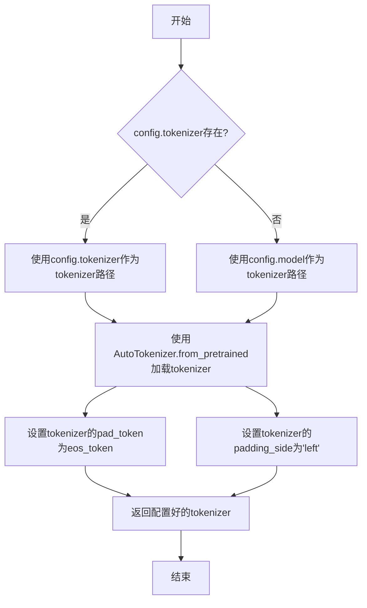

#### 带注释源码

```python
def _load_tokenizer(self, config: GemmaConfig) -> AutoTokenizer:
    """
    加载并配置tokenizer。

    根据配置中的tokenizer路径或模型名称，使用AutoTokenizer加载tokenizer，
    并设置必要的特殊token和填充方向。

    Args:
        config (GemmaConfig): 包含tokenizer配置信息的模型配置对象。

    Returns:
        AutoTokenizer: 加载并配置好的tokenizer实例。
    """
    # 确定tokenizer的路径：优先使用config.tokenizer，否则使用config.model
    tokenizer_path = config.tokenizer if config.tokenizer else config.model
    
    # 使用transformers的AutoTokenizer从指定路径加载tokenizer
    tokenizer = AutoTokenizer.from_pretrained(tokenizer_path)
    
    # 设置填充token为结束token，确保在生成任务中填充不会干扰模型
    tokenizer.pad_token = tokenizer.eos_token
    
    # 设置填充方向为左侧，这对于自回归模型（如Gemma）是标准做法
    tokenizer.padding_side = "left"
    
    # 返回配置好的tokenizer
    return tokenizer
```


### `ModelFactory.register_model`

`ModelFactory.register_model` 是一个类方法，用于向全局模型注册表 `_model_versions` 中注册一个新的模型或模型的新版本。它通过检查模型名称和版本是否已存在来避免重复注册，并支持注册模型类或模型实例。

参数：

-  `model_name`：`str`，要注册的模型的名称。
-  `version`：`str`，要注册的模型的版本号。
-  `model_cls`：`Union[Type[BaseModel], BaseModel]`，要注册的模型类或模型实例。
-  `override`：`bool`，默认为 `False`。如果为 `True`，当模型名称和版本已存在时，会覆盖原有的注册项。

返回值：`None`，此方法不返回任何值。

#### 流程图

```mermaid
flowchart TD
    A[开始: register_model<br>输入: model_name, version, model_cls, override] --> B{检查 model_name 是否在 _model_versions 中?}
    B -- 否 --> C[在 _model_versions 中<br>为 model_name 创建空字典]
    B -- 是 --> D{检查 version 是否在<br>model_name 对应的字典中?}
    C --> D
    D -- 否 --> E[注册 model_cls]
    D -- 是 --> F{override 参数是否为 True?}
    F -- 是 --> G[覆盖已存在的版本注册]
    F -- 否 --> H[抛出 ValueError 异常<br>“Model {model_name} version {version} already exists.”]
    G --> I[注册 model_cls]
    E --> Z[结束]
    I --> Z
    H --> Z
```

#### 带注释源码

```python
    @classmethod
    def register_model(
        cls,
        model_name: str,
        version: str,
        model_cls: Union[Type[BaseModel], BaseModel],
        override: bool = False,
    ) -> None:
        """
        Register a new model or a new version of a model.

        Args:
            model_name (str): The name of the model to register.
            version (str): The version of the model to register.
            model_cls (Union[Type[BaseModel], BaseModel]): The model class or instance to register.
            override (bool, optional): Whether to override an existing registration. Defaults to False.

        Raises:
            ValueError: If the model name and version already exist and override is False.
        """
        # 检查全局注册表 _model_versions 中是否存在给定的 model_name
        if model_name not in cls._model_versions:
            # 如果不存在，则为该 model_name 初始化一个空字典，用于存储不同版本
            cls._model_versions[model_name] = {}

        # 获取该 model_name 对应的版本字典
        version_dict = cls._model_versions[model_name]

        # 检查要注册的 version 是否已经存在于版本字典中
        if version in version_dict and not override:
            # 如果已存在且不允许覆盖，则抛出异常
            raise ValueError(f"Model {model_name} version {version} already exists.")
        else:
            # 否则（版本不存在，或允许覆盖），将 model_cls 注册到该版本下
            version_dict[version] = model_cls
```


### `ModelFactory.create_model`

`ModelFactory.create_model` 方法是一个工厂方法，用于根据给定的模型名称和配置参数，动态创建并返回一个模型实例。它通过解析模型名称，从预定义的模型注册表中查找对应的模型类，并使用提供的参数实例化该类。

参数：

-  `model_name`：`str`，要创建的模型的名称，用于在模型注册表中查找对应的模型类。
-  `**kwargs`：`Any`，可变关键字参数，用于传递给模型构造函数的配置参数。

返回值：`BaseModel`，返回一个实例化的模型对象，该对象是`BaseModel`的子类。

#### 流程图

```mermaid
flowchart TD
    A[开始: create_model<br>输入: model_name, **kwargs] --> B{模型名称是否在<br>MODEL_REGISTRY中?};
    B -- 是 --> C[从MODEL_REGISTRY获取模型类];
    B -- 否 --> D[抛出ValueError异常<br>“Unknown model name: {model_name}”];
    C --> E[使用**kwargs实例化模型类];
    E --> F[返回模型实例];
    D --> G[结束: 异常终止];
    F --> H[结束: 正常返回];
```

#### 带注释源码

```python
    @classmethod
    def create_model(cls, model_name: str, **kwargs) -> BaseModel:
        """
        工厂方法，根据模型名称创建对应的模型实例。

        该方法首先检查给定的模型名称是否存在于全局模型注册表`MODEL_REGISTRY`中。
        如果存在，则获取对应的模型类并使用提供的关键字参数`**kwargs`进行实例化。
        如果不存在，则抛出`ValueError`异常。

        Args:
            model_name (str): 要创建的模型的名称。
            **kwargs: 传递给模型构造函数的任意关键字参数。

        Returns:
            BaseModel: 实例化的模型对象。

        Raises:
            ValueError: 当`model_name`不在`MODEL_REGISTRY`中时抛出。
        """
        # 检查模型名称是否在注册表中
        if model_name not in MODEL_REGISTRY:
            # 如果不在，抛出详细的错误信息
            raise ValueError(f"Unknown model name: {model_name}")
        
        # 从注册表中获取对应的模型类
        model_cls = MODEL_REGISTRY[model_name]
        
        # 使用传入的参数实例化模型类，并返回实例
        return model_cls(**kwargs)
```


### `ModelFactory.get_supported_models`

该方法用于获取当前支持的模型列表。它通过读取一个配置文件（`config2models.yaml`），解析出所有可用的模型配置，并返回一个包含这些模型名称的列表。

参数：
- 无

返回值：`List[str]`，一个包含所有支持的模型名称的字符串列表。

#### 流程图

```mermaid
flowchart TD
    A[开始] --> B[读取配置文件 config2models.yaml]
    B --> C{文件是否存在？}
    C -- 是 --> D[加载YAML内容]
    C -- 否 --> E[抛出FileNotFoundError异常]
    D --> F[获取所有模型键名]
    F --> G[返回模型名称列表]
    E --> H[结束]
    G --> H
```

#### 带注释源码

```python
@staticmethod
def get_supported_models() -> List[str]:
    """
    获取当前支持的模型列表。

    该方法通过读取配置文件 `config2models.yaml`，解析出所有可用的模型配置，
    并返回一个包含这些模型名称的列表。

    Returns:
        List[str]: 包含所有支持的模型名称的列表。
    """
    # 定义配置文件的路径，假设文件位于与当前脚本同级的 `llm_config` 目录下
    config_file = Path(__file__).parent.joinpath("llm_config", "config2models.yaml")
    
    # 检查配置文件是否存在，如果不存在则抛出异常
    if not config_file.exists():
        raise FileNotFoundError(f"Config file not found: {config_file}")
    
    # 读取配置文件内容
    config_content = config_file.read_text(encoding="utf-8")
    # 使用YAML解析器加载配置内容为字典
    config = yaml.safe_load(config_content)
    
    # 从配置字典中获取所有键（即模型名称），并转换为列表返回
    return list(config.keys())
```

## 关键组件


### 代码片段

提供的代码片段仅包含文件头注释，没有实际的可执行代码或逻辑。因此，无法识别出如张量索引与惰性加载、反量化支持、量化策略等具体的功能组件。

### 分析结论

由于源代码内容为空，无法进行组件分析。要生成详细的设计文档，需要提供包含实际逻辑和定义的完整代码。


## 问题及建议


### 已知问题

-   **代码文件为空**：提供的代码文件仅包含文件头注释和编码声明，没有任何实际的业务逻辑、类定义或函数实现。这导致无法分析任何功能、设计、性能或潜在的技术债务。

### 优化建议

-   **补充核心代码**：需要将实现具体功能的代码添加到文件中。只有存在可分析的代码，才能评估其架构设计、识别潜在的性能瓶颈、代码异味或技术债务，并提出有针对性的优化建议。
-   **明确设计目标**：在编写代码前，应首先明确该模块或脚本的设计目标、要解决的问题以及非功能性需求（如性能、可扩展性、可维护性等约束）。
-   **建立基础结构**：根据设计目标，构建基本的代码结构，例如定义关键类、函数、接口契约以及错误处理机制。


## 其它


### 设计目标与约束

该代码文件是一个Python脚本的模板，其设计目标是为后续开发提供一个标准化的文件头部，包含环境声明和编码声明。主要约束包括：必须使用`#!/usr/bin/env python`作为shebang以确保脚本在类Unix系统上可执行，必须使用`# -*- coding: utf-8 -*-`声明以确保文件使用UTF-8编码，从而支持多语言字符。此外，代码结构需简洁，仅包含必要的元信息，不引入任何业务逻辑或外部依赖。

### 错误处理与异常设计

当前代码文件不包含任何业务逻辑，因此没有实现错误处理或异常设计。作为模板文件，其本身不会产生运行时错误。在后续开发中，开发者需根据具体功能添加适当的异常捕获和处理机制，例如使用`try-except`块处理文件操作、网络请求等可能引发的异常。

### 数据流与状态机

由于当前代码文件仅包含静态的注释行，没有定义任何变量、函数或类，因此不存在数据流或状态机。文件在运行时不会处理任何输入数据，也不会维护任何状态。其作用仅限于提供元信息，为解释器执行脚本提供必要指导。

### 外部依赖与接口契约

该代码文件没有显式引入任何外部依赖（如`import`语句），也不定义任何接口或契约。它是一个独立的模板文件，不依赖于其他模块或库。在后续开发中，开发者可根据需要添加依赖，并定义清晰的接口契约（如函数签名、类方法）以确保模块间的正确交互。

### 安全考虑

当前代码文件不涉及任何安全敏感操作，如数据验证、权限检查或加密解密。作为模板，它仅包含无害的注释信息。在后续开发中，开发者需根据功能需求考虑安全因素，例如对用户输入进行验证、避免代码注入、使用安全的数据存储方式等。

### 测试策略

由于该文件没有可执行代码，因此无需编写单元测试或集成测试。其正确性仅依赖于注释格式是否符合Python解释器的要求。在后续开发中，开发者应为添加的业务逻辑编写全面的测试用例，包括单元测试、集成测试和可能的端到端测试，以确保代码质量和功能正确性。

### 部署与运维

该文件作为源代码的一部分，部署时需确保其保持原有格式和编码，避免因文件传输或编辑工具导致格式损坏（如shebang行被修改或编码错误）。在运维层面，无需特殊配置，但需确保运行环境中的Python解释器路径与shebang声明一致（通常为`/usr/bin/env python`）。

    