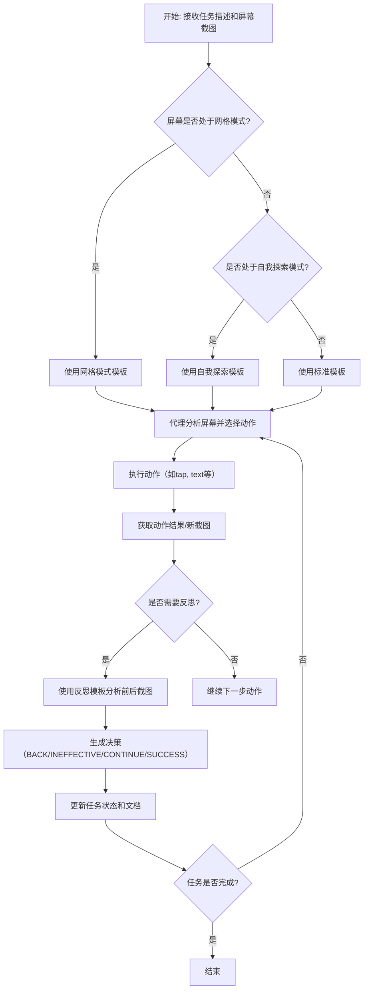

# `.\MetaGPT\metagpt\ext\android_assistant\prompts\assistant_prompt.py` 详细设计文档

该文件定义了多个用于指导AI代理在智能手机屏幕上执行任务的提示词模板。这些模板为代理提供了交互指令（如点击、输入文本、长按、滑动等），并规定了在不同场景（如普通模式、网格模式、自我探索模式）下的输出格式和决策逻辑。核心功能是构建一个结构化的指令系统，使AI能够理解屏幕元素并执行特定任务。

## 整体流程



## 类结构

```
Prompt Templates (全局字符串变量)
├── screenshot_parse_template (标准交互模板)
├── screenshot_parse_with_grid_template (网格交互模板)
├── screenshot_parse_self_explore_template (自我探索模板)
└── screenshot_parse_self_explore_reflect_template (自我探索反思模板)
```

## 全局变量及字段


### `screenshot_parse_template`
    
用于指导智能体在带有数字标签的UI元素截图上执行任务的提示模板，包含可用的操作函数（如点击、输入文本、长按、滑动）和任务上下文。

类型：`str`
    


### `screenshot_parse_with_grid_template`
    
用于指导智能体在带有网格覆盖的截图上执行任务的提示模板，操作函数基于网格区域和子区域（如点击网格中心、滑动网格间）进行定义。

类型：`str`
    


### `screenshot_parse_self_explore_template`
    
用于指导智能体在带有数字标签的UI元素截图上自主探索并执行任务的提示模板，包含基本的交互操作函数（点击、输入、长按、滑动）。

类型：`str`
    


### `screenshot_parse_self_explore_reflect_template`
    
用于指导智能体分析动作前后截图差异的反思提示模板，根据动作效果（如导航错误、无效、部分成功、成功）生成决策和UI元素功能文档。

类型：`str`
    


    

## 全局函数及方法


## 关键组件


### 提示词模板 (Prompt Templates)

定义了用于指导AI智能体在智能手机模拟环境中执行任务、解释界面和评估动作效果的结构化文本模板。这些模板是系统与大型语言模型（LLI）交互的核心接口，包含了任务上下文、可用操作指令和输出格式规范。

### 智能手机控制函数 (Smartphone Control Functions)

定义了智能体与智能手机UI交互的底层原子操作，包括`tap`（点击）、`text`（文本输入）、`long_press`（长按）、`swipe`（滑动）和`grid`（启用网格覆盖）。这些函数是智能体执行所有任务的基础动作单元。

### UI元素标注与定位 (UI Element Annotation and Localization)

描述了在屏幕截图中对可交互UI元素进行标注（使用数字标签）以及在网格模式下对屏幕区域进行划分（使用整数和子区域字符串）的机制。这是智能体“看到”并定位屏幕目标的核心方法。

### 动作决策与评估框架 (Action Decision and Evaluation Framework)

提供了一个多分支的决策评估逻辑（BACK, INEFFECTIVE, CONTINUE, SUCCESS），用于分析智能体单次动作后的屏幕变化，判断动作的有效性、是否符合描述，并据此决定后续策略（如回退、继续尝试）。该框架支持智能体的自我探索与反思学习。


## 问题及建议


### 已知问题

-   **模板字符串硬编码与维护困难**：所有提示词模板都以硬编码字符串形式存在于代码中。当需要修改、扩展或国际化时，需要在源代码中直接修改这些长字符串，容易出错且难以维护。模板中的占位符（如 `{task_description}`）与上下文逻辑紧密耦合，缺乏结构化定义。
-   **功能描述重复与不一致**：多个模板（如 `screenshot_parse_template` 和 `screenshot_parse_self_explore_template`）中关于 `tap`, `text`, `long_press`, `swipe` 等基础功能的描述几乎完全重复。这违反了DRY原则，任何对基础功能描述的修改都需要在多个地方同步更新，极易导致不一致。
-   **缺乏输入验证与模板完整性检查**：代码仅定义了模板字符串，未提供任何机制来验证调用时传入的上下文变量（如 `task_description`, `last_act`, `ui_document`）是否齐全、格式是否正确。如果调用方遗漏了某个变量，会导致生成的提示词不完整，可能影响大语言模型的理解。
-   **潜在的提示词注入风险**：模板直接使用字符串格式化（如 `f-string` 或 `.format`）插入用户提供的 `task_description` 和 `last_act`。如果这些输入包含特殊标记或指令，可能被用于操纵大语言模型的输出，存在安全风险。
-   **可扩展性差**：当前架构通过复制整个模板字符串来创建新变体（如带网格的 `screenshot_parse_with_grid_template`）。添加新的交互模式或修改现有模式的某一部分（如只修改指令部分）需要创建近乎完整的新模板，导致代码膨胀。

### 优化建议

-   **将模板外部化与结构化**：将提示词模板移出代码，存储到配置文件（如 YAML、JSON）或数据库中。为每个模板定义唯一的键（Key），并结构化其组成部分（如 `system_prompt`, `function_descriptions`, `task_context`, `output_format`）。这样可以实现集中管理、动态加载和版本控制。
-   **抽象基础功能库**：创建一个共享的“基础功能描述”模块或字典，统一描述 `tap`, `text`, `long_press`, `swipe`, `grid` 等操作。各个模板通过引用这些基础描述来组合生成完整的提示词，消除重复，确保一致性。
-   **实现模板渲染器与验证层**：创建一个专门的 `PromptRenderer` 类。该类负责：
    1.  加载外部化模板。
    2.  验证传入的上下文数据是否满足模板所需的所有变量。
    3.  安全地渲染模板（例如，对用户输入进行适当的转义或清理，防止提示词注入）。
    4.  提供钩子（hooks）以便在渲染前后进行自定义处理。
-   **采用模板继承或组合模式**：设计模板系统，使得通用部分（如系统角色定义、基础功能描述）可以被多个具体任务模板继承或引用。例如，可以有一个“基础智能手机控制模板”，然后派生出“标准模式模板”、“网格模式模板”和“自探索模式模板”，它们只覆盖差异部分。
-   **引入模板版本与测试**：为模板定义版本号，便于追踪变更。建立一套针对渲染后提示词的测试机制，例如，使用样例输入确保输出格式符合预期，或者使用轻量级模型进行基础语法和逻辑的校验。


## 其它


### 设计目标与约束

本模块的核心设计目标是提供一套结构化的提示词模板，用于指导一个基于大语言模型的智能体在智能手机模拟环境中执行任务。主要约束包括：1) 模板必须清晰定义智能体可用的操作函数及其参数；2) 模板需要适应不同的交互模式（如标准标签模式、网格覆盖模式、自我探索模式）；3) 模板必须引导智能体进行单步决策，并遵循严格的输出格式；4) 模板需要整合任务描述、历史动作和界面文档等上下文信息，以支持连续决策。

### 错误处理与异常设计

当前代码为纯模板定义，不包含运行时逻辑，因此无显式的程序化错误处理机制。其错误处理与异常设计主要体现在模板内容的引导上：
1.  **输入验证引导**：在函数描述中明确参数类型和格式（如`text_input`必须用双引号包裹，`direction`必须是特定字符串），引导模型生成合规调用。
2.  **操作约束**：通过“You can only take one action at a time”等语句，约束模型输出，避免生成多步或非法序列。
3.  **状态恢复引导**：在`screenshot_parse_self_explore_reflect_template`中，定义了`BACK`、`INEFFECTIVE`、`CONTINUE`、`SUCCESS`四种决策状态及对应的处理流程，为智能体在动作未达到预期效果时提供了明确的恢复和重试策略框架。
4.  **异常情况预定义**：`INEFFECTIVE`状态专门处理动作无任何界面反馈的情况，`CONTINUE`状态处理动作有反馈但与描述不符或未推动任务的情况，这实质上是对潜在“异常”或“非预期结果”的分类处理预案。

### 数据流与状态机

**数据流**：
1.  **输入**：任务描述 (`task_description`)、历史动作摘要 (`last_act`)、可选界面文档 (`ui_document`)、以及由外部系统提供的带标签的屏幕截图。
2.  **处理**：根据当前模式（标准/网格/自探索），将输入数据填充到对应的提示词模板中，形成完整的提示词。
3.  **输出**：大语言模型根据提示词生成下一步动作指令（如`tap(5)`）或决策与文档（如`Decision: SUCCESS`）。

**状态机（体现在自探索反思模板中）**：
该模板定义了一个简单的决策状态机，其状态转移基于对“动作前后屏幕截图差异”的分析：
*   **当前状态**：执行了某个动作。
*   **事件/评估**：分析动作结果与预期的匹配度。
*   **状态转移**：
    *   若导致无法继续 (`BACK`) -> 应回退到上一界面。
    *   若无效 (`INEFFECTIVE`) -> 停留在当前界面，尝试其他元素。
    *   若无效但可继续 (`CONTINUE`) -> 停留在当前界面，尝试其他元素。
    *   若有效 (`SUCCESS`) -> 停留在新界面，继续后续任务。
*   **输出**：每个状态都对应特定的输出格式（Decision, Thought, Documentation）。

### 外部依赖与接口契约

1.  **大语言模型 (LLM) 服务**：核心外部依赖。模块输出的提示词完全依赖于LLM的理解和执行能力。契约假设LLM能够：a) 理解自然语言任务和函数描述；b) 解析视觉信息（通过标签或网格描述）；c) 遵循输出格式要求。
2.  **屏幕标注系统**：依赖外部系统为截图中的UI元素生成并叠加数字标签（如`1`, `2`, ...）或网格标签。契约要求标签信息准确对应可交互元素，并作为输入的一部分传递给提示词。
3.  **环境执行器**：假设存在一个后端系统能接收模型生成的函数调用字符串（如`tap(5)`），并在智能手机模拟器或真机上执行相应的操作。模板中定义的函数签名（如`tap(element: int)`）即是与此执行器的接口契约。
4.  **任务与历史上下文提供者**：依赖外部系统提供`task_description`和`last_act`。契约要求`last_act`是清晰、准确的动作历史摘要。
5.  **UI文档提供者（仅限`screenshot_parse_template`）**：可选依赖。用于注入额外的应用界面知识 (`{ui_document}`)，契约要求其内容与当前屏幕上下文相关。

    