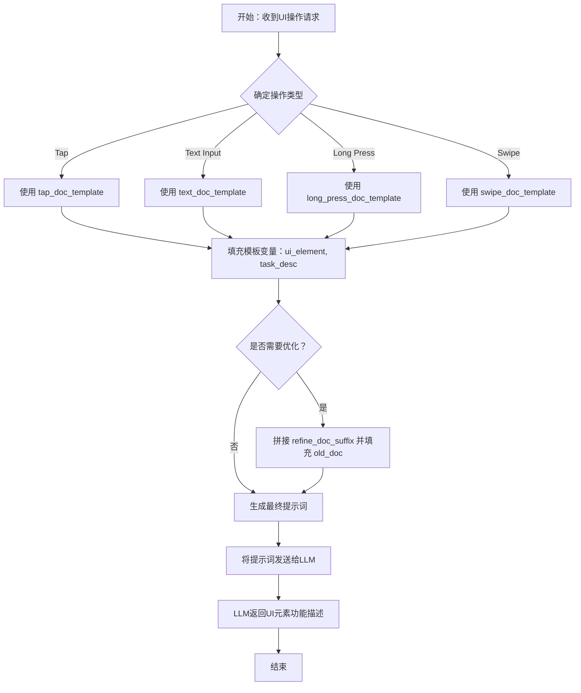

# `.\MetaGPT\metagpt\ext\android_assistant\prompts\operation_prompt.py` 详细设计文档

该文件定义了一系列用于生成移动应用UI元素功能描述的提示词模板。这些模板针对不同的用户交互操作（如点击、输入文本、长按、滑动），为大型语言模型（LLM）提供结构化的指令，以根据操作前后的屏幕截图，生成通用、简洁的UI元素功能描述。

## 整体流程



## 类结构

```
phone_operation_prompts.py (模板集合文件)
├── 全局模板变量 (4个)
└── 全局模板后缀变量 (1个)
```

## 全局变量及字段


### `tap_doc_template`
    
用于描述点击（tap）操作后UI元素功能的提示词模板，包含任务描述和UI元素编号占位符。

类型：`str`
    


### `text_doc_template`
    
用于描述文本输入（typing）操作后UI元素功能的提示词模板，包含任务描述和UI元素编号占位符。

类型：`str`
    


### `long_press_doc_template`
    
用于描述长按（long press）操作后UI元素功能的提示词模板，包含任务描述和UI元素编号占位符。

类型：`str`
    


### `swipe_doc_template`
    
用于描述滑动（swipe）操作后UI元素功能的提示词模板，包含滑动方向、任务描述和UI元素编号占位符。

类型：`str`
    


### `refine_doc_suffix`
    
用于优化现有UI元素文档的提示词后缀模板，包含旧文档占位符，指导结合新旧信息生成描述。

类型：`str`
    


    

## 全局函数及方法


## 关键组件


### 点击操作提示模板 (`tap_doc_template`)

用于生成描述点击特定UI元素功能的提示词模板，要求描述通用功能，避免提及具体标签或特定上下文。

### 文本输入操作提示模板 (`text_doc_template`)

用于生成描述在特定输入区域输入文本功能的提示词模板，要求描述通用功能，避免提及输入的具体内容。

### 长按操作提示模板 (`long_press_doc_template`)

用于生成描述长按特定UI元素功能的提示词模板，要求描述通用功能，避免提及具体标签或特定上下文。

### 滑动操作提示模板 (`swipe_doc_template`)

用于生成描述向特定方向滑动特定UI元素功能的提示词模板，要求描述尽可能通用的功能。

### 文档优化后缀 (`refine_doc_suffix`)

用于在已有旧文档的基础上优化生成新描述的提示词后缀，指导模型在可能冲突的情况下结合新旧信息进行综合描述。


## 问题及建议


### 已知问题

-   **模板字符串硬编码与维护困难**：所有提示词模板都以硬编码字符串形式存在于代码中。当需要修改模板内容、添加新的操作类型或支持多语言时，必须直接修改源代码，这增加了维护成本和出错风险。
-   **模板内容重复度高，存在冗余**：`tap_doc_template`、`text_doc_template`、`long_press_doc_template` 和 `swipe_doc_template` 这四个模板的结构高度相似，大部分内容重复（如任务上下文描述、标签位置说明、通用性要求等）。这种重复违反了DRY（Don‘t Repeat Yourself）原则，导致代码臃肿，且任何对通用部分的修改都需要在多个地方同步更新。
-   **缺乏输入验证与模板完整性检查**：模板字符串中包含占位符（如 `{ui_element}`, `<task_desc>`, `<swipe_dir>`, `{old_doc}`），但代码中没有机制来确保在使用模板前这些占位符都被正确替换。如果遗漏替换，生成的提示词将包含未解析的占位符，可能导致下游任务（如大语言模型调用）失败或产生不可预测的结果。
-   **`refine_doc_suffix` 模板逻辑表述可能引起混淆**：该模板要求在新旧文档冲突时“结合两者”（`combine both`）。这个指令比较模糊，没有明确结合的策略（例如，是以新观察为主，还是创建更通用的描述），可能导致生成文档的一致性不佳。
-   **代码结构单一，职责不清晰**：当前文件仅包含一系列全局字符串变量，没有封装成任何结构（如类或函数）。这不利于组织、测试和复用。例如，无法方便地注入不同的模板集或动态生成模板。

### 优化建议

-   **将模板外部化**：将提示词模板移出代码，存储到配置文件（如JSON、YAML）或专门的模板文件中。这样可以实现内容与逻辑分离，便于非开发人员（如产品经理、标注人员）修改和审阅，也支持热更新和多环境配置。
-   **抽象基础模板，消除重复**：识别并提取所有模板中的公共部分，创建一个基础模板。然后通过继承、组合或参数化的方式为每种操作类型（tap, text, long_press, swipe）生成具体模板。这能显著减少代码量，提高可维护性。
-   **实现模板渲染与验证机制**：创建一个模板渲染器（例如一个函数或类方法），它接收模板名称和参数字典，负责替换所有占位符。在渲染前后，可以添加验证步骤，检查是否有未替换的占位符或必填参数缺失。
-   **明确 `refine_doc_suffix` 的合并策略**：重写该模板的说明部分，提供更清晰、可操作的指导。例如，可以指定：“若新旧文档冲突，优先依据新截图证据生成描述，但可借鉴旧文档的表述方式或补充其未涵盖的通用功能点。”
-   **重构为类或模块，提升内聚性**：将相关模板和操作封装在一个类中（例如 `PromptTemplates`）。该类可以管理模板的加载（从外部文件）、渲染和验证。这样可以提供更清晰的接口，便于单元测试，并为未来扩展（如添加模板版本管理、操作类型枚举）打下基础。


## 其它


### 设计目标与约束

本模块的核心设计目标是提供一组可复用的、参数化的提示词模板，用于指导大语言模型（LLI）根据移动应用操作前后的屏幕截图，生成对特定UI元素功能的通用性描述。其核心约束包括：
1.  **功能通用性**：生成的描述必须抽象化，避免提及具体的任务内容、用户输入文本或特定对象（如人名），而应聚焦于UI元素的通用功能（例如，“导航到聊天窗口”而非“导航到与John的聊天窗口”）。
2.  **格式一致性**：所有模板要求输出“一两句话”的简洁描述，并禁止在描述中包含UI元素的数字标签。
3.  **上下文感知**：模板设计需融入更大的任务背景（`<task_desc>`），使LLM的理解不脱离用户操作流。
4.  **可进化性**：通过 `refine_doc_suffix` 模板支持基于历史文档的优化与合并，允许UI元素功能描述随更多演示样例而迭代完善，处理新旧理解可能存在的冲突。

### 错误处理与异常设计

当前代码作为静态模板定义，不包含运行时逻辑，因此无传统的程序错误处理机制。其“异常”或“错误”主要体现在模板使用不当或输入数据不符合预期时，可能导致LLM生成不符合要求的描述。设计上通过以下方式规避：
1.  **输入验证（隐式）**：模板通过明确的自然语言指令（如“Never include the numeric tag...”）对LLM的输出进行约束，这是一种基于提示工程的“软性”输入/输出规范。
2.  **参数完整性**：模板中的占位符（如 `{ui_element}`, `<task_desc>`, `{old_doc}`）在使用时必须由调用方正确填充，否则会导致生成无意义或错误上下文的内容。这要求调用模块具备严格的参数检查逻辑。
3.  **冲突解决策略**：在 `refine_doc_suffix` 中明确规定了当截图证据与历史文档冲突时的处理原则——“结合两者”（combine both），这为功能描述的不确定性提供了一种明确的处理指引，避免了简单的覆盖或忽略。

### 数据流与状态机

本模块自身无状态，也不管理数据流。它定义的是数据转换的“蓝图”。典型的数据流如下：
1.  **输入**：外部调用者提供参数（`ui_element` 编号, `task_desc` 任务描述, `swipe_dir` 滑动方向, `old_doc` 旧文档）和操作前后的截图（作为LLM的视觉输入，非代码直接处理）。
2.  **处理**：调用者选择合适的模板（如 `tap_doc_template`），将参数填充至模板占位符，形成完整的提示词（Prompt）。
3.  **输出**：完整的提示词被发送给LLM。LLM结合提示词和提供的截图，生成一段符合要求的UI元素功能描述文本。
4.  **迭代**：当进行文档优化时，数据流会纳入 `{old_doc}` 参数，形成包含 `refine_doc_suffix` 的提示词，引导LLM基于新旧信息生成修订后的描述。

模块本身是静态的，不存在状态变迁。其“状态”体现在外部维护的 `{old_doc}` 的版本演进上。

### 外部依赖与接口契约

1.  **外部依赖**：
    *   **大语言模型（LLM）服务**：核心依赖，负责接收模板填充后生成的提示词以及关联的截图，并返回文本描述。模型需具备强大的多模态理解（视觉+语言）和指令跟随能力。
    *   **上游调用模块**：负责提供正确的参数（`ui_element`, `task_desc` 等）、识别操作类型以选择对应模板、获取并关联操作前后的截图，以及可能管理 `{old_doc}` 的历史存储。

2.  **接口契约**：
    *   **模板变量契约**：每个模板字符串定义了其所需的参数集。调用者必须保证提供所有非可选参数。例如：
        *   `tap_doc_template`, `text_doc_template`, `long_press_doc_template` 需要 `{ui_element}` 和 `<task_desc>`。
        *   `swipe_doc_template` 额外需要 `<swipe_dir>`。
        *   当使用优化流程时，必须提供 `{old_doc}` 并通过拼接 `refine_doc_suffix` 来构建最终提示。
    *   **输出格式契约**：虽然不由代码强制约束，但模板文本明确规定了输出给LLM的指令，构成了与LLM之间的“软契约”，期望LLM返回一个简洁、通用、不包含标签的一两句话描述。
    *   **无运行时接口**：本模块不暴露任何函数或类方法，仅提供字符串常量。接口表现为对这些常量的引用和字符串格式化操作。

    