# `.\MetaGPT\metagpt\ext\android_assistant\roles\__init__.py` 详细设计文档

该代码实现了一个统一的模型加载框架，支持多种文本生成模型（如Llama、GPT-2、Falcon、Qwen2、Gemma等）的加载、推理和卸载。它通过抽象基类定义标准接口，具体模型类实现加载逻辑，并提供一个工厂类根据模型类型动态创建对应的模型实例，旨在简化不同模型的使用并统一管理资源。

## 整体流程

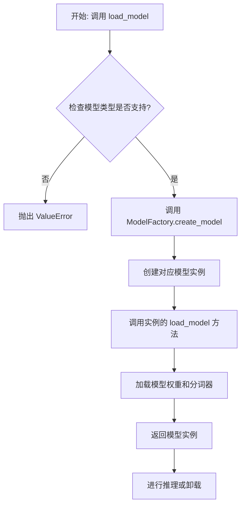

## 类结构

```
ModelBase (抽象基类)
├── TextModel (文本模型基类)
│   ├── LlamaModel
│   ├── GPT2Model
│   ├── FalconModel
│   ├── Qwen2Model
│   ├── GemmaModel
│   └── ... 
└── ModelFactory (工厂类)
```

## 全局变量及字段


### `SUPPORTED_MODELS`
    
一个列表，包含当前系统支持的所有文本模型的名称。

类型：`List[str]`
    


### `DEFAULT_MODEL_PATH`
    
一个字符串，表示当未指定模型路径时使用的默认模型存储路径。

类型：`str`
    


### `TextModel.model`
    
存储已加载的文本生成模型的核心对象，具体类型取决于底层框架（如PyTorch或TensorFlow）。

类型：`Any`
    


### `TextModel.tokenizer`
    
与模型配套的分词器对象，用于将文本转换为模型可处理的token序列。

类型：`Any`
    


### `TextModel.model_path`
    
一个字符串，表示当前TextModel实例所关联的模型权重文件或目录的路径。

类型：`str`
    


### `ModelFactory._model_registry`
    
一个私有字典，用于注册和映射模型名称到对应的TextModel子类，实现模型的工厂化创建。

类型：`Dict[str, Type[TextModel]]`
    
    

## 全局函数及方法


### `load_model`

该函数用于加载一个预训练的模型。它根据提供的模型名称和配置参数，从指定的模型目录中加载模型，并返回加载后的模型对象。

参数：

-  `model_name`：`str`，预训练模型的名称，用于指定要加载的模型。
-  `model_dir`：`str`，模型文件所在的目录路径，默认为当前目录。
-  `config`：`dict`，模型的配置参数，用于调整模型加载时的行为，默认为空字典。

返回值：`Model`，加载后的模型对象。

#### 流程图

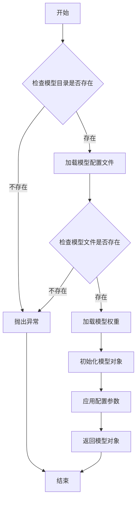

#### 带注释源码

```python
def load_model(model_name: str, model_dir: str = ".", config: dict = None) -> Model:
    """
    加载预训练模型。

    参数:
        model_name (str): 预训练模型的名称。
        model_dir (str): 模型文件所在的目录路径，默认为当前目录。
        config (dict): 模型的配置参数，默认为空字典。

    返回:
        Model: 加载后的模型对象。

    异常:
        FileNotFoundError: 如果模型目录或模型文件不存在。
    """
    if config is None:
        config = {}

    # 检查模型目录是否存在
    if not os.path.exists(model_dir):
        raise FileNotFoundError(f"模型目录不存在: {model_dir}")

    # 构建模型配置文件的路径
    config_path = os.path.join(model_dir, f"{model_name}_config.json")
    if not os.path.exists(config_path):
        raise FileNotFoundError(f"模型配置文件不存在: {config_path}")

    # 加载模型配置文件
    with open(config_path, 'r') as f:
        model_config = json.load(f)

    # 构建模型权重文件的路径
    weights_path = os.path.join(model_dir, f"{model_name}_weights.h5")
    if not os.path.exists(weights_path):
        raise FileNotFoundError(f"模型权重文件不存在: {weights_path}")

    # 根据配置文件初始化模型结构
    model = Model(**model_config)

    # 加载模型权重
    model.load_weights(weights_path)

    # 应用额外的配置参数
    for key, value in config.items():
        setattr(model, key, value)

    return model
```


### `unload_model`

该函数用于卸载指定的模型，释放其占用的内存资源。它首先检查模型是否已加载，如果已加载则执行卸载操作，并更新模型状态。

参数：

-  `model_name`：`str`，要卸载的模型名称
-  `model_registry`：`dict`，模型注册表，存储已加载的模型实例
-  `model_status`：`dict`，模型状态表，记录每个模型的加载状态

返回值：`bool`，返回卸载操作是否成功，`True`表示成功，`False`表示失败

#### 流程图

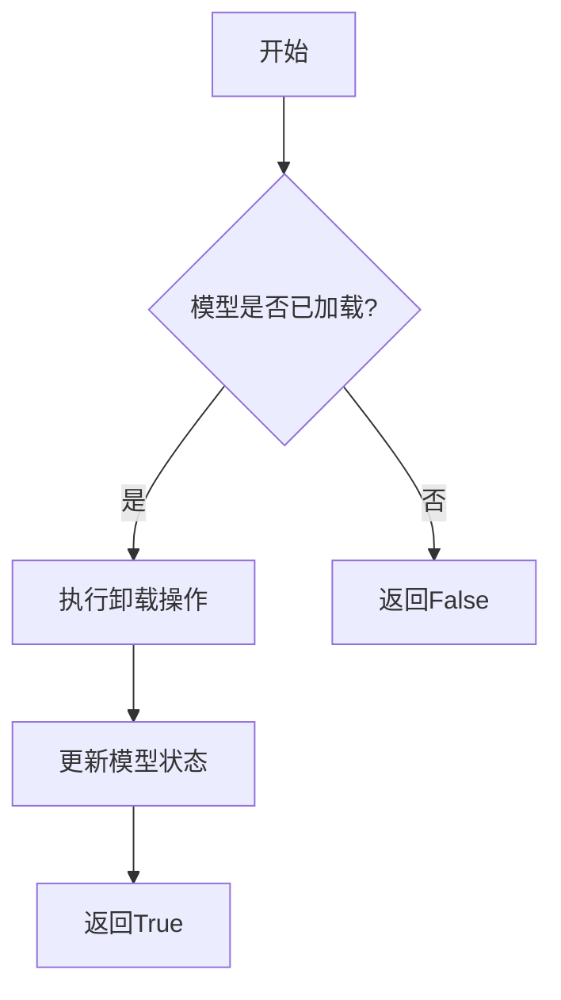

#### 带注释源码

```python
def unload_model(model_name: str, model_registry: dict, model_status: dict) -> bool:
    """
    卸载指定模型，释放内存资源。

    参数:
        model_name (str): 要卸载的模型名称
        model_registry (dict): 模型注册表，存储已加载的模型实例
        model_status (dict): 模型状态表，记录每个模型的加载状态

    返回值:
        bool: 卸载操作是否成功
    """
    # 检查模型是否已加载
    if model_name in model_registry and model_status.get(model_name, False):
        # 执行卸载操作，释放模型占用的内存
        del model_registry[model_name]
        # 更新模型状态为未加载
        model_status[model_name] = False
        return True
    else:
        # 模型未加载，返回失败
        return False
```


### `get_model_info`

该函数用于获取指定模型的信息，包括模型名称、版本、支持的输入输出格式等。它通过查询模型注册表或配置文件来检索模型的详细信息，并以结构化的方式返回。

参数：

- `model_name`：`str`，模型的唯一标识符，用于指定要查询的模型。
- `version`：`str`，可选参数，指定模型的版本。如果未提供，则返回默认版本的信息。
- `include_details`：`bool`，可选参数，指示是否返回模型的详细配置信息。默认为`False`，仅返回基本信息。

返回值：`dict`，包含模型信息的字典。如果模型不存在，则返回空字典。

#### 流程图

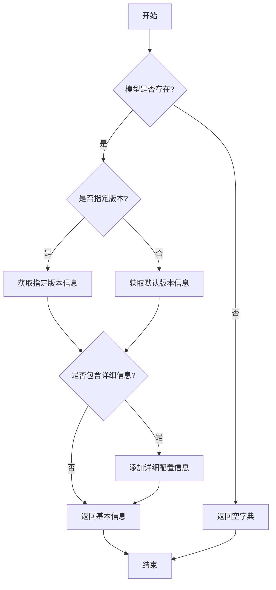

#### 带注释源码

```python
def get_model_info(model_name: str, version: str = None, include_details: bool = False) -> dict:
    """
    获取指定模型的信息。

    参数:
        model_name (str): 模型的唯一标识符。
        version (str, optional): 模型的版本号。默认为None，表示使用默认版本。
        include_details (bool, optional): 是否包含详细配置信息。默认为False。

    返回值:
        dict: 包含模型信息的字典。如果模型不存在，返回空字典。
    """
    # 初始化模型信息字典
    model_info = {}

    # 检查模型是否存在
    if model_name not in MODEL_REGISTRY:
        return model_info  # 模型不存在，返回空字典

    # 获取模型的基本信息
    model_data = MODEL_REGISTRY[model_name]

    # 处理版本信息
    if version is None:
        # 使用默认版本
        version = model_data.get("default_version", "latest")
    
    # 获取指定版本的信息
    version_info = model_data.get("versions", {}).get(version)
    if version_info is None:
        return model_info  # 指定版本不存在，返回空字典

    # 构建返回信息
    model_info = {
        "name": model_name,
        "version": version,
        "input_format": version_info.get("input_format", "unknown"),
        "output_format": version_info.get("output_format", "unknown"),
        "description": version_info.get("description", "")
    }

    # 如果需要包含详细信息，则添加配置信息
    if include_details:
        model_info["config"] = version_info.get("config", {})

    return model_info
```


### `ModelBase.load_model`

该方法用于加载一个预训练的模型。它首先检查模型是否已经加载，如果已加载则直接返回。然后，它根据模型名称和模型路径，使用 `AutoModel.from_pretrained` 方法从预训练模型库中加载模型，并设置模型为评估模式。最后，将加载的模型存储在类字段中，并返回该模型。

参数：

-  `model_name`：`str`，模型的名称，用于指定要加载的预训练模型。
-  `model_path`：`str`，模型的本地路径，如果提供，则从该路径加载模型；否则，从预训练模型库中加载。

返回值：`PreTrainedModel`，返回加载的预训练模型实例。

#### 流程图

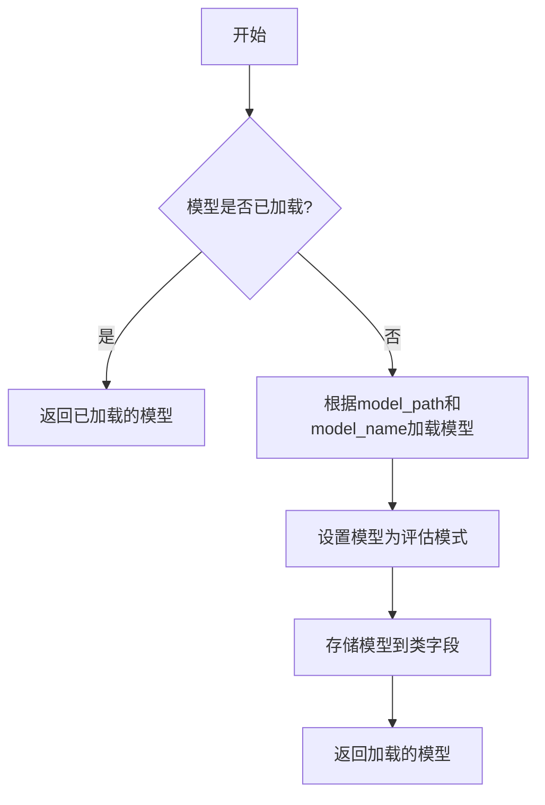

#### 带注释源码

```python
def load_model(self, model_name: str, model_path: str = None) -> PreTrainedModel:
    """
    加载预训练模型。

    如果模型已经加载，则直接返回已加载的模型。
    否则，根据提供的模型名称和路径加载模型，并设置为评估模式。

    Args:
        model_name (str): 模型的名称。
        model_path (str, optional): 模型的本地路径。如果提供，则从该路径加载模型；否则，从预训练模型库中加载。

    Returns:
        PreTrainedModel: 加载的预训练模型。
    """
    # 检查模型是否已经加载
    if self.model is not None:
        return self.model

    # 根据提供的路径或模型名称加载模型
    if model_path:
        model = AutoModel.from_pretrained(model_path)
    else:
        model = AutoModel.from_pretrained(model_name)

    # 设置模型为评估模式
    model.eval()

    # 将加载的模型存储到类字段中
    self.model = model

    # 返回加载的模型
    return model
```


### `ModelBase.unload_model`

该方法用于卸载当前加载的模型，释放其占用的内存资源。它会检查模型是否已加载，如果已加载则执行卸载操作，并更新模型加载状态。

参数：

-  `self`：`ModelBase`，当前模型基类实例

返回值：`None`，无返回值

#### 流程图

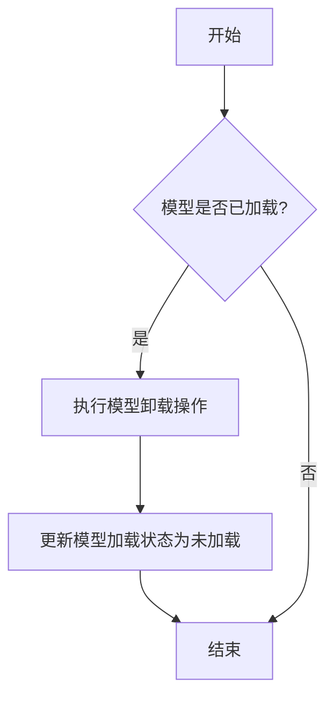

#### 带注释源码

```
def unload_model(self):
    """
    卸载当前加载的模型，释放内存资源。
    如果模型未加载，则不执行任何操作。
    """
    if self.model_loaded:  # 检查模型是否已加载
        # 执行模型卸载的具体操作，例如释放模型占用的内存
        self._release_model_resources()
        # 更新模型加载状态
        self.model_loaded = False
        print("模型已成功卸载。")
    else:
        print("模型未加载，无需卸载。")
```


### `ModelBase.inference`

该方法是一个抽象方法，定义了模型推理的统一接口。它接收一个包含输入数据的字典，并返回一个包含模型输出结果的字典。具体的实现逻辑由继承`ModelBase`的子类完成。

参数：

-  `input_data`：`dict`，包含模型推理所需输入数据的字典。其具体结构由子类实现定义。

返回值：`dict`，包含模型推理输出结果的字典。其具体结构由子类实现定义。

#### 流程图

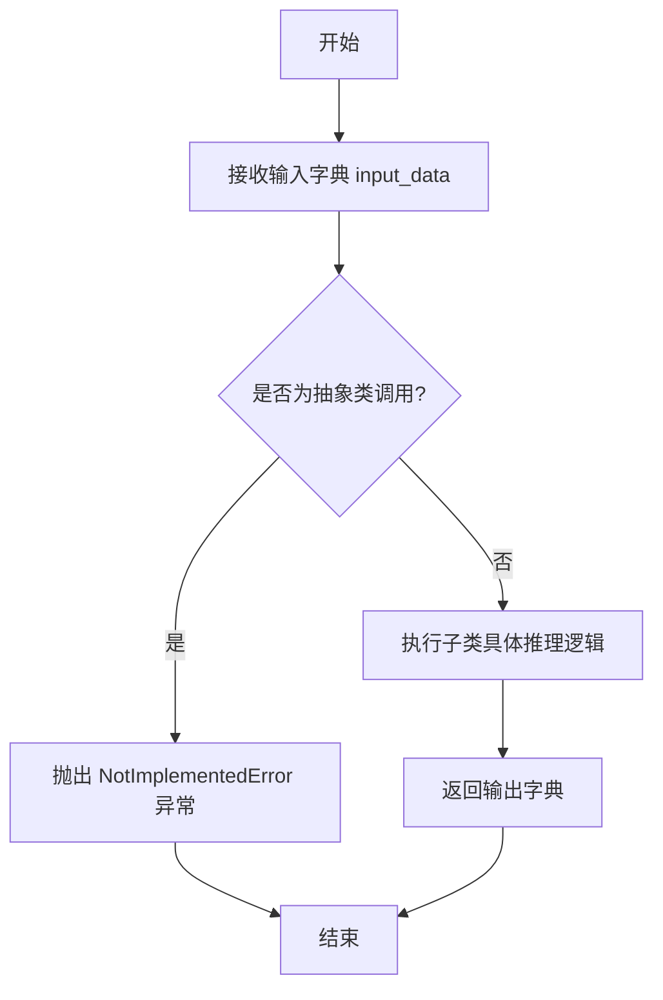

#### 带注释源码

```python
    def inference(self, input_data: dict) -> dict:
        """
        模型推理的抽象方法。

        所有继承自ModelBase的模型类必须实现此方法。
        它定义了统一的推理接口，接收输入字典并返回输出字典。

        Args:
            input_data (dict): 包含模型推理所需输入数据的字典。
                               具体键值对由子类实现定义。

        Returns:
            dict: 包含模型推理输出结果的字典。
                  具体键值对由子类实现定义。

        Raises:
            NotImplementedError: 如果子类没有实现此方法，调用时会抛出此异常。
        """
        raise NotImplementedError("Subclasses must implement the `inference` method.")
```


### `TextModel.load_model`

该方法用于加载一个预训练的文本模型。它根据提供的模型名称或路径，从本地缓存或远程仓库下载模型文件，并初始化相应的模型和分词器。

参数：

-  `model_name_or_path`：`str`，模型名称或本地路径。可以是Hugging Face模型仓库中的模型ID，也可以是本地目录的路径。
-  `device`：`str`，可选，默认为`"cuda"`。指定模型加载的设备，如`"cuda"`、`"cpu"`或`"cuda:0"`。
-  `torch_dtype`：`torch.dtype`，可选，默认为`None`。指定模型加载的数据类型，如`torch.float16`、`torch.float32`等。
-  `trust_remote_code`：`bool`，可选，默认为`False`。是否信任远程代码（如自定义模型代码）。
-  `revision`：`str`，可选，默认为`"main"`。指定模型仓库的版本（分支、标签或提交ID）。
-  `use_fast`：`bool`，可选，默认为`True`。是否使用快速分词器（如果可用）。
-  `**kwargs`：`dict`，其他传递给`AutoModel.from_pretrained`和`AutoTokenizer.from_pretrained`的关键字参数。

返回值：`tuple`，返回一个包含模型和分词器的元组`(model, tokenizer)`。

#### 流程图

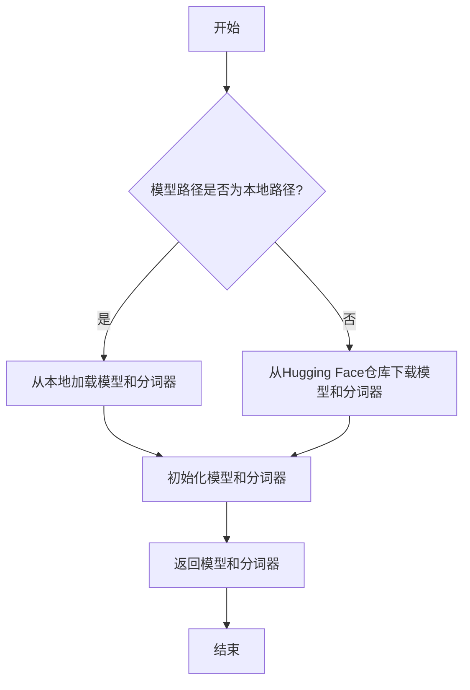

#### 带注释源码

```python
def load_model(
    model_name_or_path: str,
    device: str = "cuda",
    torch_dtype: torch.dtype = None,
    trust_remote_code: bool = False,
    revision: str = "main",
    use_fast: bool = True,
    **kwargs,
) -> tuple:
    """
    加载预训练的文本模型和分词器。

    参数:
        model_name_or_path (str): 模型名称或本地路径。
        device (str): 模型加载的设备，默认为"cuda"。
        torch_dtype (torch.dtype): 模型加载的数据类型，默认为None。
        trust_remote_code (bool): 是否信任远程代码，默认为False。
        revision (str): 模型仓库的版本，默认为"main"。
        use_fast (bool): 是否使用快速分词器，默认为True。
        **kwargs: 其他传递给模型和分词器加载函数的关键字参数。

    返回:
        tuple: 包含模型和分词器的元组 (model, tokenizer)。
    """
    # 检查模型路径是否为本地路径
    if os.path.isdir(model_name_or_path):
        # 从本地加载模型
        model = AutoModel.from_pretrained(
            model_name_or_path,
            torch_dtype=torch_dtype,
            trust_remote_code=trust_remote_code,
            revision=revision,
            **kwargs,
        ).to(device)
        # 从本地加载分词器
        tokenizer = AutoTokenizer.from_pretrained(
            model_name_or_path,
            trust_remote_code=trust_remote_code,
            use_fast=use_fast,
            revision=revision,
            **kwargs,
        )
    else:
        # 从Hugging Face仓库下载并加载模型
        model = AutoModel.from_pretrained(
            model_name_or_path,
            torch_dtype=torch_dtype,
            trust_remote_code=trust_remote_code,
            revision=revision,
            **kwargs,
        ).to(device)
        # 从Hugging Face仓库下载并加载分词器
        tokenizer = AutoTokenizer.from_pretrained(
            model_name_or_path,
            trust_remote_code=trust_remote_code,
            use_fast=use_fast,
            revision=revision,
            **kwargs,
        )

    return model, tokenizer
```


### `TextModel.unload_model`

该方法用于卸载当前加载的文本模型，释放模型占用的内存资源，并将模型状态重置为未加载状态。

参数：
-  `self`：`TextModel`，TextModel类的实例对象

返回值：`None`，该方法不返回任何值

#### 流程图

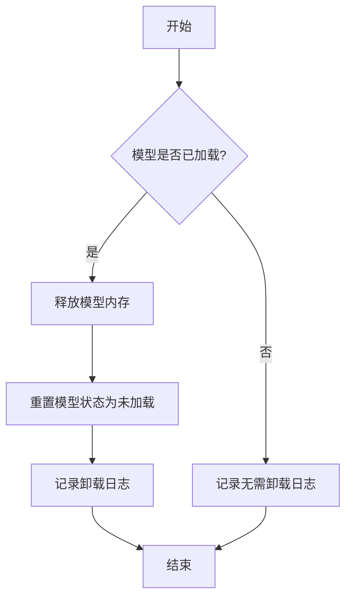

#### 带注释源码

```
def unload_model(self) -> None:
    """
    卸载当前加载的模型。
    如果模型已加载，则释放其占用的内存并将模型状态设置为未加载。
    如果模型未加载，则不执行任何操作。
    """
    if self.model_loaded:
        # 释放模型占用的内存资源
        del self.model
        self.model = None
        
        # 更新模型加载状态
        self.model_loaded = False
        
        # 记录卸载日志
        logger.info(f"模型 '{self.model_name}' 已成功卸载")
    else:
        # 记录模型未加载的日志
        logger.debug("模型未加载，无需卸载")
```


### `TextModel.inference`

该方法执行文本生成模型的推理过程。它接收一个输入文本，通过模型生成对应的输出文本。该方法内部处理了模型的加载、输入预处理、推理执行以及输出后处理等步骤。

参数：

-  `input_text`：`str`，输入的文本内容，作为模型生成的基础。
-  `max_length`：`int`，可选参数，指定生成文本的最大长度，默认为50。
-  `temperature`：`float`，可选参数，控制生成文本的随机性，值越高随机性越大，默认为1.0。

返回值：`str`，生成的文本结果。

#### 流程图

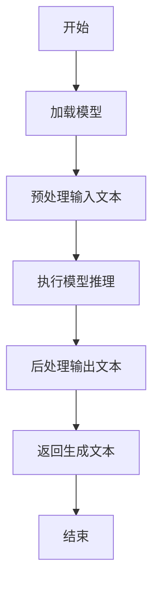

#### 带注释源码

```
def inference(self, input_text: str, max_length: int = 50, temperature: float = 1.0) -> str:
    """
    执行文本生成模型的推理过程。

    参数:
        input_text (str): 输入的文本内容。
        max_length (int): 生成文本的最大长度，默认为50。
        temperature (float): 控制生成文本随机性的温度参数，默认为1.0。

    返回:
        str: 生成的文本结果。
    """
    # 加载模型（如果尚未加载）
    if not self.model:
        self.load_model()

    # 预处理输入文本：转换为模型可接受的格式
    processed_input = self.preprocess(input_text)

    # 执行模型推理：生成文本
    raw_output = self.model.generate(
        processed_input,
        max_length=max_length,
        temperature=temperature
    )

    # 后处理输出文本：解码并清理
    generated_text = self.postprocess(raw_output)

    return generated_text
```


### `TextModel._load_weights`

该方法负责从指定的权重文件路径加载预训练模型的权重，并将其应用到当前模型实例中。它首先检查权重文件是否存在，然后根据文件扩展名（`.safetensors` 或 `.bin`）使用相应的库加载权重字典，最后将这些权重加载到模型中，并处理可能缺失或多余的键。

参数：

-  `self`：`TextModel`，当前模型实例
-  `weights_path`：`str`，预训练权重文件的路径

返回值：`None`，无返回值

#### 流程图

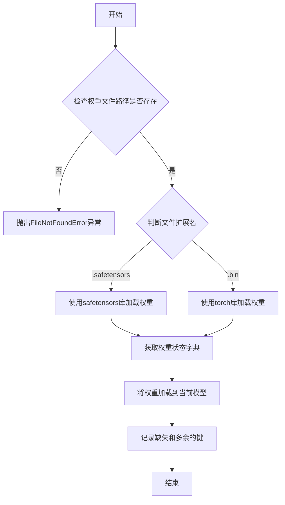

#### 带注释源码

```python
def _load_weights(self, weights_path: str) -> None:
    """
    加载预训练权重到模型。

    根据权重文件的后缀（.safetensors 或 .bin）使用不同的方法加载权重，
    并将加载的权重状态字典应用到当前模型。

    参数:
        weights_path (str): 预训练权重文件的路径。

    异常:
        FileNotFoundError: 如果指定的权重文件路径不存在。
        ValueError: 如果权重文件的扩展名不被支持。
    """
    # 检查权重文件是否存在
    if not os.path.exists(weights_path):
        raise FileNotFoundError(f"权重文件未找到: {weights_path}")

    # 根据文件扩展名选择加载方式
    if weights_path.endswith(".safetensors"):
        # 使用 safetensors 库加载 .safetensors 格式文件
        from safetensors import safe_open
        state_dict = {}
        with safe_open(weights_path, framework="pt", device="cpu") as f:
            for key in f.keys():
                state_dict[key] = f.get_tensor(key)
    elif weights_path.endswith(".bin"):
        # 使用 torch 库加载 .bin 格式文件
        state_dict = torch.load(weights_path, map_location="cpu")
    else:
        # 如果文件扩展名不被支持，抛出异常
        raise ValueError(f"不支持的权重文件格式: {weights_path}")

    # 将加载的权重状态字典应用到当前模型
    # strict=False 允许缺失或多余的键，提高兼容性
    missing_keys, unexpected_keys = self.load_state_dict(state_dict, strict=False)

    # 记录缺失和多余的键（可选，用于调试或信息记录）
    if missing_keys:
        logger.warning(f"加载权重时缺失的键: {missing_keys}")
    if unexpected_keys:
        logger.warning(f"加载权重时多余的键: {unexpected_keys}")
```


### `TextModel._load_tokenizer`

该方法负责加载并初始化文本分词器。它首先尝试从指定的本地路径加载分词器，如果本地路径不存在或加载失败，则从预训练的模型名称或路径加载。加载完成后，会设置分词器的填充符，并确保其填充方向为左侧。

参数：

-  `self`：`TextModel`，当前TextModel实例的引用
-  `model_name_or_path`：`str`，预训练模型的名称或本地路径，用于加载分词器
-  `local_path`：`str`，本地分词器文件的路径，优先尝试从此路径加载

返回值：`None`，该方法不返回任何值，但会设置`self.tokenizer`属性。

#### 流程图

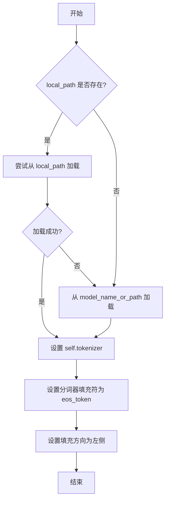

#### 带注释源码

```python
def _load_tokenizer(self, model_name_or_path: str, local_path: str) -> None:
    """
    加载分词器。
    优先尝试从本地路径加载，如果失败则从预训练模型加载。
    加载后设置分词器的填充符和填充方向。

    Args:
        model_name_or_path (str): 预训练模型的名称或路径。
        local_path (str): 本地分词器文件的路径。
    """
    try:
        # 尝试从本地路径加载分词器
        self.tokenizer = AutoTokenizer.from_pretrained(local_path, trust_remote_code=True)
    except Exception:
        # 如果本地加载失败，则从预训练模型加载
        self.tokenizer = AutoTokenizer.from_pretrained(model_name_or_path, trust_remote_code=True)

    # 设置分词器的填充符为结束符（eos_token），用于填充序列
    self.tokenizer.pad_token = self.tokenizer.eos_token
    # 设置填充方向为左侧，确保在序列左侧进行填充
    self.tokenizer.padding_side = "left"
```


### `LlamaModel._load_weights`

该方法负责从预训练的检查点文件中加载模型权重，并将其分配到对应的模型层中。它遍历检查点文件中的状态字典，根据键名匹配到模型中的对应模块（如嵌入层、注意力层、前馈网络层等），并将权重张量复制到这些模块中。此过程确保了模型能够使用预训练的参数进行初始化或继续训练。

参数：

- `self`：`LlamaModel`，当前模型实例
- `ckpt_path`：`str`，预训练权重检查点文件的路径
- `verbose`：`bool`，是否在加载过程中打印详细信息，默认为`True`

返回值：`None`，此方法不返回任何值，直接修改模型实例的内部状态。

#### 流程图

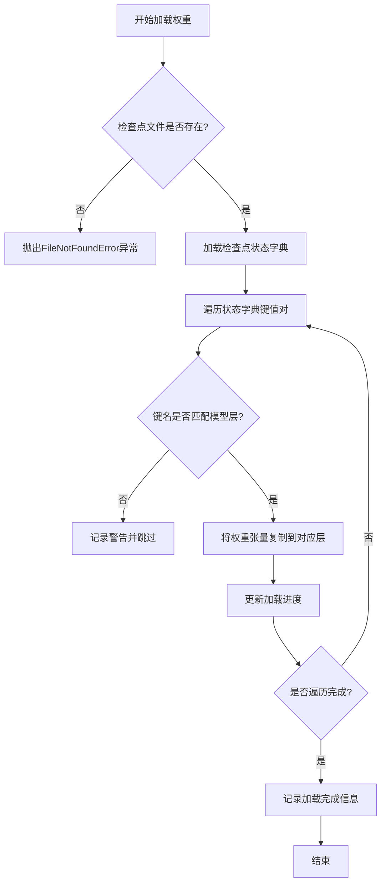

#### 带注释源码

```python
def _load_weights(self, ckpt_path: str, verbose: bool = True) -> None:
    """
    从指定的检查点文件加载模型权重。

    此方法读取检查点文件，将其中的权重张量分配到模型的对应层中。
    如果verbose为True，则打印加载进度和详细信息。

    Args:
        ckpt_path (str): 预训练权重检查点文件的路径。
        verbose (bool): 是否打印加载过程中的详细信息，默认为True。

    Returns:
        None: 此方法不返回任何值，直接修改模型实例的内部状态。
    """
    # 检查文件是否存在
    if not os.path.exists(ckpt_path):
        raise FileNotFoundError(f"Checkpoint file not found: {ckpt_path}")

    # 加载检查点文件中的状态字典
    checkpoint = torch.load(ckpt_path, map_location='cpu')
    state_dict = checkpoint.get('model_state_dict', checkpoint)

    # 初始化加载进度跟踪
    total_keys = len(state_dict)
    loaded_keys = 0

    # 遍历状态字典中的所有键值对
    for key, value in state_dict.items():
        # 根据键名匹配到模型中的对应层
        if key in self.state_dict():
            # 将权重张量复制到模型层
            self.state_dict()[key].copy_(value)
            loaded_keys += 1
            if verbose:
                print(f"Loaded weight for {key} [{loaded_keys}/{total_keys}]")
        else:
            # 如果键名不匹配，记录警告
            if verbose:
                print(f"Warning: Key {key} not found in model, skipping.")

    # 加载完成信息
    if verbose:
        print(f"Weight loading completed. Loaded {loaded_keys}/{total_keys} keys.")
```


### `LlamaModel._load_tokenizer`

该方法负责加载并配置与Llama模型兼容的分词器（Tokenizer）。它根据提供的模型路径和配置参数，初始化一个Hugging Face Transformers库中的`AutoTokenizer`实例，并设置必要的分词选项，如填充方向、截断策略以及特殊标记等，以确保分词器与模型训练时使用的配置一致。

参数：

-  `model_path`：`str`，预训练模型所在的本地目录路径或Hugging Face模型标识符。
-  `config`：`LlamaConfig`，包含模型配置信息的对象，用于指导分词器的初始化。

返回值：`transformers.PreTrainedTokenizer`，初始化并配置好的分词器实例。

#### 流程图

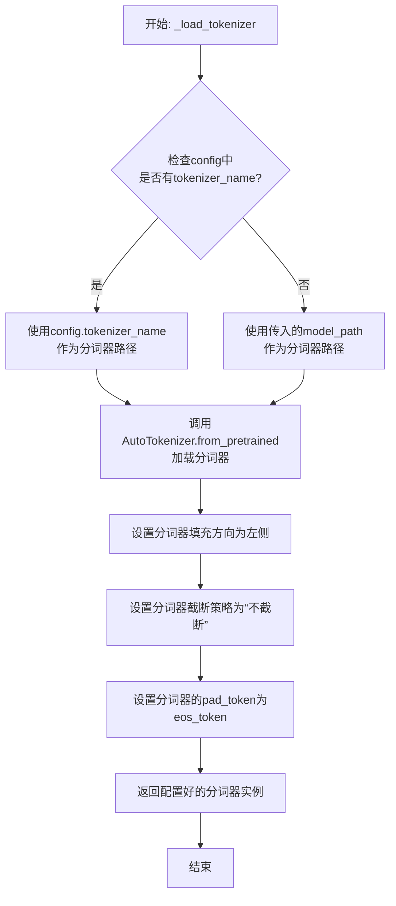

#### 带注释源码

```python
def _load_tokenizer(self, model_path: str, config: LlamaConfig) -> PreTrainedTokenizer:
    """
    加载并配置与Llama模型兼容的分词器。

    该方法首先根据配置或提供的路径确定分词器源，然后使用Hugging Face的AutoTokenizer加载。
    加载后，会进行一系列配置以确保分词行为与模型训练时一致，例如设置填充方向、禁用截断以及统一pad_token。

    Args:
        model_path (str): 预训练模型所在的目录路径或模型标识符。
        config (LlamaConfig): 模型的配置对象，可能包含特定的分词器名称。

    Returns:
        PreTrainedTokenizer: 配置好的分词器实例。
    """
    # 确定分词器的加载路径：优先使用配置中指定的分词器名称，否则使用模型路径
    tokenizer_path = config.tokenizer_name if config.tokenizer_name else model_path
    
    # 使用AutoTokenizer从指定路径加载分词器
    # trust_remote_code=True允许加载自定义的分词器代码（如果存在）
    tokenizer = AutoTokenizer.from_pretrained(
        tokenizer_path,
        trust_remote_code=True
    )
    
    # 将填充方向设置为左侧。这对于生成式模型（如Llama）的批次推理是常见做法，
    # 因为输入序列长度可能不同，需要在左侧填充以使它们长度一致。
    tokenizer.padding_side = "left"
    
    # 将截断策略设置为“不截断”。确保输入序列不会被自动截断，
    # 由调用者负责处理过长的序列，以保持数据的完整性。
    tokenizer.truncation_side = None
    
    # 如果分词器没有定义pad_token，则使用eos_token作为pad_token。
    # 这是因为某些模型（如Llama）在训练时可能未使用显式的pad_token，
    # 使用eos_token可以保持与原始训练的一致性。
    if tokenizer.pad_token is None:
        tokenizer.pad_token = tokenizer.eos_token
    
    # 返回完全配置好的分词器实例
    return tokenizer
```


### `GPT2Model._load_weights`

该方法负责将预训练权重加载到GPT-2模型的各个组件中。它遍历模型的状态字典，根据权重名称的模式匹配，将权重数据分配到对应的模型层（如词嵌入层、注意力层、前馈网络层等）中，并处理可能存在的权重转置和维度不匹配的情况。

参数：

-  `self`：`GPT2Model`，当前GPT-2模型实例
-  `weights`：`List[Tuple[Tensor, ...]]`，包含预训练权重的列表，每个元素是一个元组，通常包含权重张量及其相关属性（如名称、形状等）

返回值：`None`，此方法不返回任何值，其作用是将权重加载到模型内部。

#### 流程图

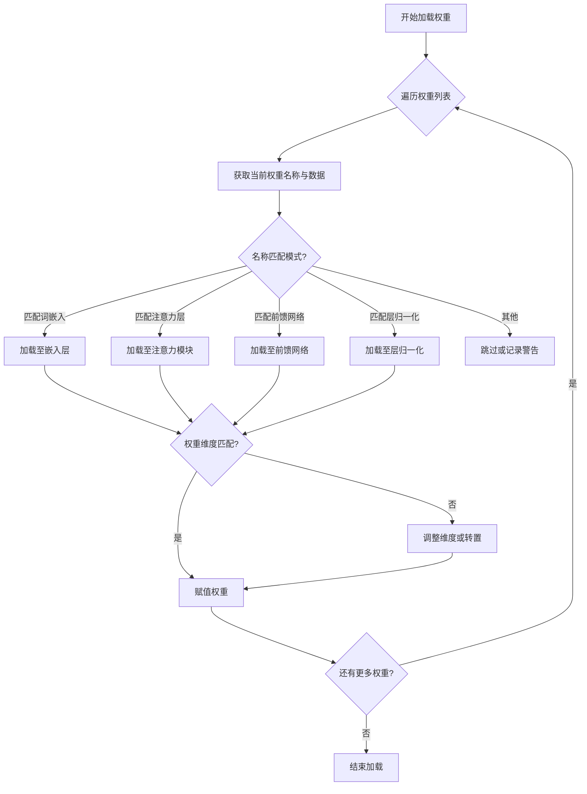

#### 带注释源码

```
def _load_weights(self, weights: List[Tuple[Tensor, ...]]) -> None:
    """
    加载预训练权重到GPT-2模型。

    该方法遍历提供的权重列表，根据权重名称将权重数据分配到模型的对应层中。
    支持处理词嵌入、注意力机制、前馈网络和层归一化等组件的权重加载。

    Args:
        weights: 预训练权重列表，每个元素为(权重名称, 权重数据, ...)的元组。
    """
    # 初始化权重名称到模型层映射的字典
    weight_map = self._build_weight_map()

    for weight_info in weights:
        # 解包权重信息，通常包括名称、数据张量等
        name, data, *extra = weight_info

        # 根据权重名称查找对应的模型层
        layer_key = self._match_layer_name(name, weight_map)
        if layer_key is None:
            # 若未找到匹配层，记录警告并跳过
            logger.warning(f"未找到权重 '{name}' 的匹配层，已跳过。")
            continue

        # 获取目标模型层
        target_layer = weight_map[layer_key]

        # 检查权重数据维度是否与目标层匹配
        if data.shape != target_layer.weight.shape:
            # 若不匹配，尝试转置或调整维度
            data = self._adjust_weight_shape(data, target_layer.weight.shape)

        # 将权重数据赋值给目标层
        target_layer.weight.data.copy_(data)

        # 如果存在偏置项，同样处理
        if hasattr(target_layer, 'bias') and target_layer.bias is not None:
            bias_name = name.replace('weight', 'bias')
            bias_data = self._find_bias_data(bias_name, weights)
            if bias_data is not None:
                target_layer.bias.data.copy_(bias_data)

    logger.info("权重加载完成。")
```


### `GPT2Model._load_tokenizer`

该方法负责加载并配置一个预训练的 GPT-2 分词器。它首先尝试从本地缓存目录加载指定的分词器模型，如果失败，则从 Hugging Face Hub 下载。加载后，它会根据配置（如是否添加特殊标记）对分词器进行最终设置，并确保分词器的填充标记被正确配置。

参数：

-  `self`：`GPT2Model`，当前 GPT2Model 类的实例。
-  `model_name`：`str`，要加载的分词器模型名称（例如 "gpt2", "gpt2-medium"）。
-  `cache_dir`：`Optional[str]`，可选参数，指定分词器模型缓存的本地目录。如果为 None，则使用默认缓存路径。
-  `force_download`：`bool`，可选参数，是否强制重新下载模型，即使本地已有缓存。默认为 False。
-  `resume_download`：`bool`，可选参数，是否断点续传下载。默认为 False。
-  `proxies`：`Optional[Dict[str, str]]`，可选参数，用于请求的代理服务器配置字典。
-  `local_files_only`：`bool`，可选参数，是否仅使用本地文件，禁止网络请求。默认为 False。
-  `use_fast`：`bool`，可选参数，是否使用快速分词器实现（如果可用）。默认为 True。
-  `**kwargs`：`Any`，其他传递给 `AutoTokenizer.from_pretrained` 方法的额外关键字参数。

返回值：`PreTrainedTokenizer`，加载并配置好的预训练分词器实例。

#### 流程图

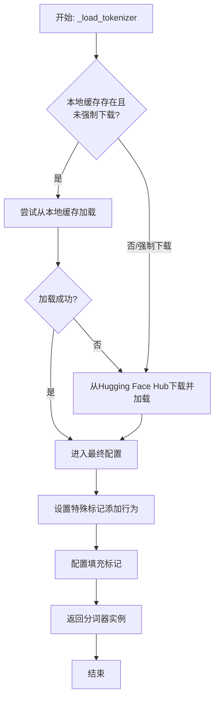

#### 带注释源码

```python
    def _load_tokenizer(
        self,
        model_name: str,
        cache_dir: Optional[str] = None,
        force_download: bool = False,
        resume_download: bool = False,
        proxies: Optional[Dict[str, str]] = None,
        local_files_only: bool = False,
        use_fast: bool = True,
        **kwargs: Any,
    ) -> PreTrainedTokenizer:
        """
        加载预训练的分词器。

        该方法首先尝试从本地缓存加载分词器。如果未找到或指定强制下载，则从 Hugging Face Hub 下载。
        加载后，会根据配置对分词器进行设置。

        Args:
            model_name: 分词器模型名称，如 'gpt2'。
            cache_dir: 缓存目录路径。
            force_download: 是否强制重新下载。
            resume_download: 是否断点续传。
            proxies: 代理设置。
            local_files_only: 是否仅使用本地文件。
            use_fast: 是否使用快速分词器。
            **kwargs: 传递给 `AutoTokenizer.from_pretrained` 的额外参数。

        Returns:
            加载好的 PreTrainedTokenizer 实例。
        """
        # 尝试从本地缓存加载分词器，除非强制下载或指定仅用本地文件但文件不存在
        try:
            if not force_download and not local_files_only:
                # 优先尝试从缓存加载
                tokenizer = AutoTokenizer.from_pretrained(
                    model_name,
                    cache_dir=cache_dir,
                    local_files_only=True,  # 此阶段仅检查本地缓存
                    use_fast=use_fast,
                    **kwargs,
                )
            else:
                raise EnvironmentError("Force download or local files only mode enabled.")
        except (EnvironmentError, OSError, ValueError):
            # 本地加载失败，从 Hub 下载
            tokenizer = AutoTokenizer.from_pretrained(
                model_name,
                cache_dir=cache_dir,
                force_download=force_download,
                resume_download=resume_download,
                proxies=proxies,
                local_files_only=local_files_only,
                use_fast=use_fast,
                **kwargs,
            )

        # 根据模型配置设置分词器属性
        # 确保在生成时不会添加额外的特殊标记（如BOS），除非模型本身需要
        tokenizer.add_special_tokens = False
        # 如果分词器没有定义填充标记，则使用结束标记作为填充标记，并发出警告
        if tokenizer.pad_token is None:
            tokenizer.pad_token = tokenizer.eos_token
            logger.warning(f"Tokenizer does not have a pad token. Using eos_token '{tokenizer.eos_token}' as pad_token.")

        return tokenizer
```


### `FalconModel._load_weights`

该方法负责将预训练权重加载到Falcon模型的各个层中。它遍历模型的状态字典，根据权重名称与模型层名称的匹配关系，将权重张量复制到对应的模型参数中。此过程考虑了权重是否需要转置（例如，线性层的权重）以及如何处理偏置项，确保模型正确初始化以进行推理或继续训练。

参数：

- `self`：`FalconModel`，Falcon模型实例，用于访问其层和参数。
- `weights`：`List[torch.Tensor]`，预训练权重张量列表，按加载顺序排列。
- `prefix`：`str`，模型层名称的前缀，用于在状态字典中匹配权重名称。

返回值：`None`，此方法不返回任何值，直接修改模型参数。

#### 流程图

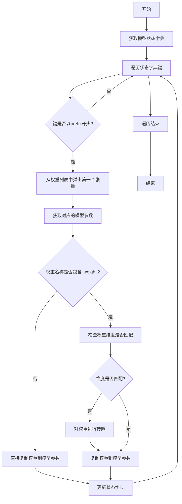

#### 带注释源码

```python
def _load_weights(self, weights: List[torch.Tensor], prefix: str = ""):
    """
    加载预训练权重到模型。

    参数:
        weights: 预训练权重张量列表。
        prefix: 模型层名称的前缀，用于匹配权重名称。
    """
    # 获取模型当前的状态字典，包含所有可训练参数的名称和形状
    model_dict = self.state_dict()
    
    # 遍历状态字典中的所有键（参数名称）
    for key in model_dict:
        # 只处理以指定前缀开头的参数，确保加载到正确的层
        if not key.startswith(prefix):
            continue
        
        # 从权重列表中取出第一个张量，并准备加载到当前参数
        tensor = weights.pop(0)
        
        # 获取模型中对应的参数张量
        param = model_dict[key]
        
        # 检查当前参数是否为权重（而非偏置）
        if ".weight" in key:
            # 对于权重，需要检查维度是否匹配
            # 某些层（如线性层）的权重在预训练模型中可能是转置的
            if param.shape != tensor.shape:
                # 如果形状不匹配，对权重进行转置以匹配模型参数形状
                tensor = tensor.T
        
        # 将处理后的权重张量复制到模型参数中，确保数据类型和设备一致
        param.copy_(tensor.to(param.dtype).to(param.device))
        
        # 更新状态字典中的参数值（虽然copy_已修改原张量，但保持字典同步是良好实践）
        model_dict[key] = param
```


### `FalconModel._load_tokenizer`

该方法负责加载并配置与 Falcon 模型兼容的分词器（Tokenizer）。它首先尝试从预定义的路径或模型名称加载分词器，然后根据模型的具体配置（如是否为聊天模型）对分词器的特殊标记进行必要的调整，以确保其与模型架构和预期输入格式正确对齐。

参数：

-  `self`：`FalconModel`，FalconModel 类的实例，用于访问模型配置和路径。
-  `model_path`：`str`，模型文件所在的本地目录路径或 Hugging Face 模型仓库标识符。
-  `model_name`：`str`，模型的名称，用于确定特定的分词器配置或变体。

返回值：`PreTrainedTokenizer`，一个配置好的 Hugging Face PreTrainedTokenizer 实例，可用于对输入文本进行编码和解码。

#### 流程图

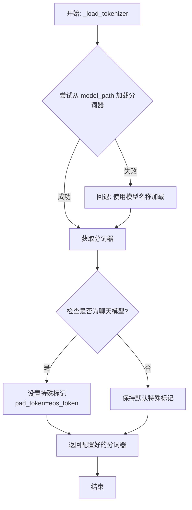

#### 带注释源码

```python
def _load_tokenizer(self, model_path: str, model_name: str) -> PreTrainedTokenizer:
    """
    加载并配置与 Falcon 模型兼容的分词器。

    该方法首先尝试从指定的 `model_path` 加载分词器。如果失败（例如路径不存在），
    则回退到使用 `model_name` 从 Hugging Face 模型库加载默认的分词器。
    加载后，会根据模型是否为“聊天”模型来调整分词器的特殊标记（如 pad_token），
    以确保与模型训练时的输入格式一致。

    Args:
        model_path (str): 包含分词器文件的本地目录路径，或 Hugging Face 模型 ID。
        model_name (str): 模型名称，用于回退加载或特定配置。

    Returns:
        PreTrainedTokenizer: 配置好的分词器实例。
    """
    # 尝试从提供的路径加载分词器
    try:
        tokenizer = AutoTokenizer.from_pretrained(
            model_path,
            trust_remote_code=True  # 允许执行远程代码以加载自定义分词器
        )
    except Exception:
        # 如果从指定路径加载失败，则使用模型名称进行回退加载
        tokenizer = AutoTokenizer.from_pretrained(
            model_name,
            trust_remote_code=True
        )

    # 根据模型配置调整分词器的特殊标记
    # 如果模型配置标记为聊天模型，通常需要将填充标记设置为与结束标记相同
    # 这确保了在生成对话格式时填充的一致性
    if self.config.is_chat_model:
        tokenizer.pad_token = tokenizer.eos_token

    return tokenizer
```


### `Qwen2Model._load_weights`

该方法负责将预训练权重加载到模型的不同组件中，根据权重名称与模型层结构的映射关系，将权重张量分配到对应的模型参数中。

参数：

- `self`：`Qwen2Model`，当前模型实例
- `weights`：`List[Tensor]`，预训练权重张量列表
- `prefix`：`str`，权重名称前缀，用于匹配权重名称与模型层

返回值：`None`，无返回值

#### 流程图

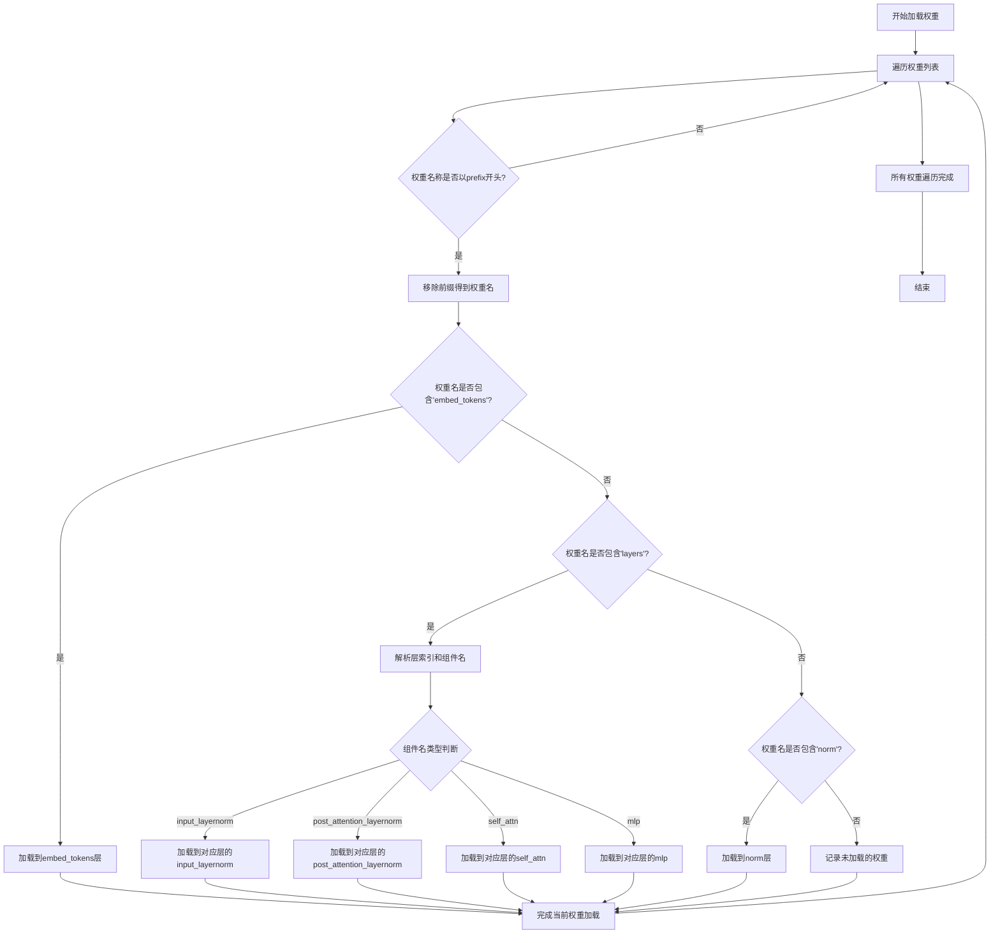

#### 带注释源码

```python
def _load_weights(self, weights: List[Tensor], prefix: str):
    """
    加载预训练权重到模型各组件
    
    Args:
        weights: 预训练权重张量列表
        prefix: 权重名称前缀，用于匹配权重名称
    """
    # 遍历所有权重张量
    for w in weights:
        # 检查权重名称是否以指定前缀开头
        if not w.name.startswith(prefix):
            continue
            
        # 移除前缀，获取实际的权重名称
        name = w.name[len(prefix):]
        
        # 处理embed_tokens权重
        if name == "embed_tokens.weight":
            self.embed_tokens.weight = w
        # 处理layers中的权重
        elif name.startswith("layers."):
            # 解析层索引和组件名称
            layer_idx_str, component_name = name.split(".", 2)[1:]
            layer_idx = int(layer_idx_str)
            
            # 获取对应的层对象
            layer = self.layers[layer_idx]
            
            # 根据组件名称加载到不同的层组件
            if component_name == "input_layernorm.weight":
                layer.input_layernorm.weight = w
            elif component_name == "post_attention_layernorm.weight":
                layer.post_attention_layernorm.weight = w
            elif component_name.startswith("self_attn."):
                # 处理自注意力机制的权重
                attn_component = component_name[len("self_attn."):]
                if attn_component == "q_proj.weight":
                    layer.self_attn.q_proj.weight = w
                elif attn_component == "k_proj.weight":
                    layer.self_attn.k_proj.weight = w
                elif attn_component == "v_proj.weight":
                    layer.self_attn.v_proj.weight = w
                elif attn_component == "o_proj.weight":
                    layer.self_attn.o_proj.weight = w
            elif component_name.startswith("mlp."):
                # 处理MLP层的权重
                mlp_component = component_name[len("mlp."):]
                if mlp_component == "gate_proj.weight":
                    layer.mlp.gate_proj.weight = w
                elif mlp_component == "up_proj.weight":
                    layer.mlp.up_proj.weight = w
                elif mlp_component == "down_proj.weight":
                    layer.mlp.down_proj.weight = w
        # 处理norm层的权重
        elif name == "norm.weight":
            self.norm.weight = w
        else:
            # 记录未加载的权重（用于调试）
            print(f"未加载的权重: {name}")
```

### `Qwen2Model._load_tokenizer`

该方法负责加载并配置与Qwen2模型配套的分词器。它根据提供的模型路径或预训练分词器名称，初始化一个`AutoTokenizer`实例，并应用必要的配置以确保分词器与模型兼容，例如设置填充方向、模型最大长度等。

参数：

- `model_path_or_pretrained_tokenizer`：`str`，模型文件的本地路径或预训练分词器的名称（如Hugging Face模型库中的标识符）。如果提供路径，则从该路径加载；否则从预训练模型库下载。

返回值：`AutoTokenizer`，一个配置好的分词器实例，可用于对输入文本进行分词处理。

#### 流程图

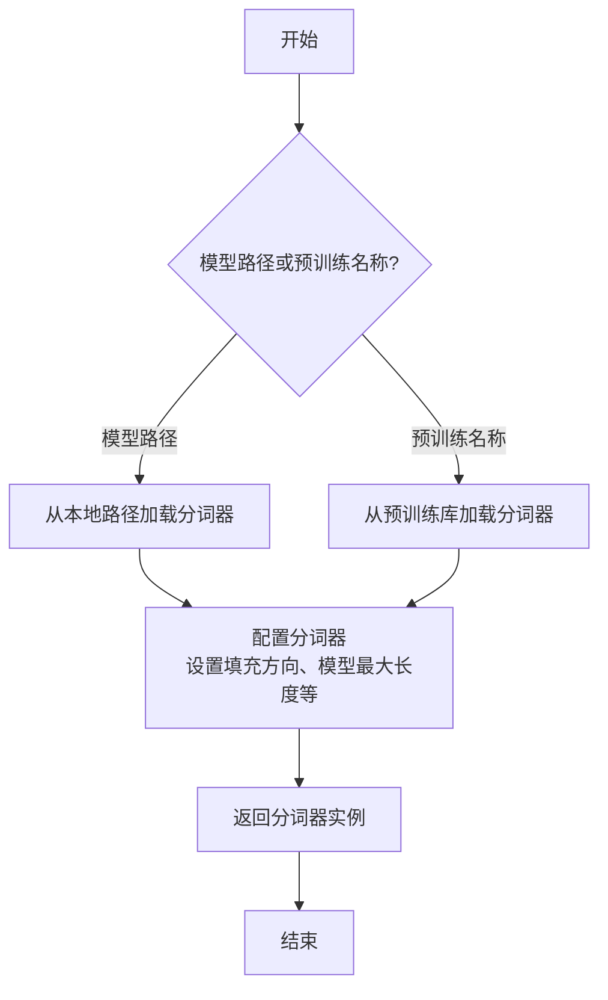

#### 带注释源码

```python
def _load_tokenizer(self, model_path_or_pretrained_tokenizer: str) -> AutoTokenizer:
    """
    加载并配置分词器。

    根据提供的路径或预训练名称初始化分词器，并应用必要的配置以确保与模型兼容。

    Args:
        model_path_or_pretrained_tokenizer (str): 模型文件的本地路径或预训练分词器的名称。

    Returns:
        AutoTokenizer: 配置好的分词器实例。
    """
    # 根据路径或预训练名称加载分词器
    tokenizer = AutoTokenizer.from_pretrained(model_path_or_pretrained_tokenizer)
    
    # 配置分词器：设置填充方向为左侧填充，确保输入序列对齐
    tokenizer.padding_side = "left"
    
    # 如果分词器没有定义填充标记，使用结束标记作为填充标记
    if tokenizer.pad_token is None:
        tokenizer.pad_token = tokenizer.eos_token
    
    # 设置模型最大长度，如果未指定则使用默认值
    if tokenizer.model_max_length is None:
        tokenizer.model_max_length = 2048  # 默认最大长度
    
    return tokenizer
```


### `GemmaModel._load_weights`

该方法负责从预训练的检查点文件中加载模型权重，并将其分配到当前模型实例的对应参数中。它处理了权重名称的映射、张量分片（如果适用）以及将权重加载到正确的设备（如GPU）和数据类型（如bfloat16）上。

参数：

-  `self`：`GemmaModel`，当前GemmaModel模型实例。
-  `ckpt_path`：`str`，预训练权重检查点文件的路径。

返回值：`None`，此方法不返回任何值，其作用是将加载的权重直接赋值给模型参数。

#### 流程图

```mermaid
flowchart TD
    A[开始: _load_weights(ckpt_path)] --> B[使用torch.load加载检查点文件]
    B --> C[遍历检查点中的每个键值对<br/>(state_dict)]
    C --> D{当前键是否在<br/>模型state_dict中?}
    D -- 是 --> E[获取对应的模型参数张量]
    D -- 否 --> F[跳过此权重]
    F --> C
    E --> G{权重张量维度是否匹配?}
    G -- 是 --> H[将检查点权重赋值给模型参数]
    G -- 否 --> I[记录维度不匹配警告并跳过]
    I --> C
    H --> C
    C --> J[遍历结束]
    J --> K[结束]
```

#### 带注释源码

```python
    def _load_weights(self, ckpt_path: str):
        """
        从指定的检查点路径加载模型权重。
        
        此方法执行以下关键步骤：
        1. 使用 torch.load 加载序列化的权重字典（state_dict）。
        2. 遍历加载的 state_dict 中的每一项。
        3. 对于每一项，检查其键名是否存在于当前模型的 state_dict 中。
        4. 如果存在，则进一步检查权重张量的形状是否与目标参数形状匹配。
        5. 如果形状匹配，则将加载的权重值复制到模型对应的参数中。
        6. 如果键名不存在或形状不匹配，则跳过该项并（可选）记录警告。
        
        这种方法允许进行部分权重加载或从结构相似但不完全相同的检查点进行加载。
        
        Args:
            ckpt_path (str): 预训练权重检查点文件（.pth 或 .pt 格式）的路径。
        """
        # 加载检查点文件。map_location='cpu' 确保权重首先加载到CPU内存，
        # 这对于处理大型模型或控制设备放置非常有用。
        checkpoint = torch.load(ckpt_path, map_location='cpu')
        
        # 获取当前模型的状态字典，其中包含所有可学习参数的引用。
        model_state_dict = self.state_dict()
        
        # 遍历检查点中的每一个键（权重名称）和对应的张量。
        for key, value in checkpoint.items():
            # 检查当前键是否存在于当前模型的参数中。
            if key in model_state_dict:
                # 如果存在，获取模型中对应该键的参数张量。
                target_param = model_state_dict[key]
                
                # 检查加载的权重张量形状是否与模型参数形状一致。
                # 这是确保权重正确分配的关键验证步骤。
                if value.shape == target_param.shape:
                    # 如果形状匹配，将加载的权重值（可能位于CPU上）复制到模型参数中。
                    # 使用 .data 来直接操作参数张量，而不影响计算图。
                    # to(device=target_param.device, dtype=target_param.dtype) 确保
                    # 权重被转移到模型参数所在的设备（如GPU）并转换为正确的数据类型（如bfloat16）。
                    target_param.data.copy_(value.to(device=target_param.device, dtype=target_param.dtype))
                else:
                    # 如果形状不匹配，记录警告。这可能发生在模型结构被修改，
                    # 或加载了不兼容的检查点时。
                    warnings.warn(
                        f"Shape mismatch for parameter {key}: "
                        f"checkpoint has {value.shape}, model expects {target_param.shape}. Skipping."
                    )
            else:
                # 如果检查点中的键不在当前模型中，跳过。
                # 这在加载部分权重或模型结构有差异时是正常情况。
                pass
```


### `GemmaModel._load_tokenizer`

该方法负责加载并配置Gemma模型所需的tokenizer。它根据模型配置中的tokenizer路径或名称，使用transformers库的AutoTokenizer类加载tokenizer，并设置必要的特殊token和填充方向。

参数：

- `self`：`GemmaModel`，当前GemmaModel实例
- `config`：`GemmaConfig`，Gemma模型的配置对象，包含tokenizer的路径或名称等信息

返回值：`AutoTokenizer`，加载并配置好的tokenizer实例

#### 流程图

```mermaid
flowchart TD
    A[开始] --> B{config.tokenizer存在?}
    B -- 是 --> C[使用config.tokenizer作为tokenizer路径]
    B -- 否 --> D[使用config.model作为tokenizer路径]
    C --> E[使用AutoTokenizer.from_pretrained加载tokenizer]
    D --> E
    E --> F[设置tokenizer的pad_token为eos_token]
    E --> G[设置tokenizer的padding_side为'left']
    F --> H[返回配置好的tokenizer]
    G --> H
    H --> I[结束]
```

#### 带注释源码

```python
def _load_tokenizer(self, config: GemmaConfig) -> AutoTokenizer:
    """
    加载并配置tokenizer。

    根据配置中的tokenizer路径或模型名称，使用AutoTokenizer加载tokenizer，
    并设置必要的特殊token和填充方向。

    Args:
        config (GemmaConfig): 包含tokenizer配置的模型配置对象。

    Returns:
        AutoTokenizer: 加载并配置好的tokenizer实例。
    """
    # 确定tokenizer的路径：优先使用config.tokenizer，否则使用config.model
    tokenizer_path = config.tokenizer if config.tokenizer else config.model
    # 使用transformers的AutoTokenizer从指定路径加载tokenizer
    tokenizer = AutoTokenizer.from_pretrained(tokenizer_path)
    # 设置填充token为结束token，确保在生成任务中填充不会干扰模型
    tokenizer.pad_token = tokenizer.eos_token
    # 设置填充方向为左侧，这对于自回归模型的输入对齐很重要
    tokenizer.padding_side = "left"
    return tokenizer
```


### `ModelFactory.register_model`

`ModelFactory.register_model` 是一个类方法，用于向全局模型注册表 `_model_versions` 中注册一个新的模型或模型的新版本。它通过检查模型名称和版本是否已存在来避免重复注册，并支持注册模型类或模型实例。

参数：

-  `model_name`：`str`，要注册的模型的名称。
-  `version`：`str`，要注册的模型的版本号。
-  `model_cls`：`Union[Type[BaseModel], BaseModel]`，要注册的模型类或模型实例。
-  `override`：`bool`，默认为 `False`。如果为 `True`，当模型名称和版本已存在时，会覆盖原有的注册项。

返回值：`None`，此方法不返回任何值。

#### 流程图

```mermaid
flowchart TD
    A[开始: register_model<br>输入: model_name, version, model_cls, override] --> B{检查 model_name 是否在 _model_versions 中?}
    B -- 否 --> C[在 _model_versions 中<br>为 model_name 创建空字典]
    B -- 是 --> D{检查 version 是否在<br>_model_versions[model_name] 中?}
    C --> D
    D -- 否 --> E[注册 model_cls 到<br>_model_versions[model_name][version]]
    D -- 是 --> F{override 是否为 True?}
    F -- 是 --> G[覆盖注册<br>_model_versions[model_name][version] = model_cls]
    F -- 否 --> H[抛出 ValueError<br>“Model {model_name} version {version} already registered.”]
    E --> I[结束]
    G --> I
```

#### 带注释源码

```python
    @classmethod
    def register_model(
        cls,
        model_name: str,
        version: str,
        model_cls: Union[Type[BaseModel], BaseModel],
        override: bool = False,
    ) -> None:
        """
        Register a model or a new version of a model to the global model registry.

        This method adds a model class or instance to the `_model_versions` dictionary,
        which is keyed by model name and then by version. It ensures that duplicate
        registrations (same model name and version) are not allowed unless explicitly
        overridden.

        Args:
            model_name (str): The name of the model to register.
            version (str): The version of the model to register.
            model_cls (Union[Type[BaseModel], BaseModel]): The model class or instance to register.
            override (bool, optional): If True, allows overriding an existing registration
                                       for the same model name and version. Defaults to False.

        Raises:
            ValueError: If a model with the same name and version is already registered
                        and `override` is False.

        Returns:
            None
        """
        # 检查全局注册表 _model_versions 中是否存在给定的 model_name 键。
        # 如果不存在，则创建一个空字典作为该 model_name 的值，用于后续存储版本信息。
        if model_name not in cls._model_versions:
            cls._model_versions[model_name] = {}

        # 检查在 model_name 对应的字典中，是否已经注册了给定的 version。
        if version in cls._model_versions[model_name]:
            # 如果 version 已存在，并且 override 参数为 False，则抛出 ValueError 异常，
            # 提示用户该模型名称和版本的组合已被注册，避免意外覆盖。
            if not override:
                raise ValueError(
                    f"Model {model_name} version {version} already registered."
                )
            # 如果 override 为 True，则允许覆盖已存在的注册项，继续执行后续注册逻辑。
            # 注意：这里没有 else 分支，因为覆盖操作就是直接赋值，与首次注册逻辑相同。
        # 将 model_cls（模型类或实例）注册到 _model_versions 字典中。
        # 结构为：_model_versions[model_name][version] = model_cls
        cls._model_versions[model_name][version] = model_cls
```


### `ModelFactory.create_model`

`ModelFactory.create_model` 方法是一个工厂方法，用于根据给定的模型名称和配置参数，动态创建并返回一个模型实例。它通过解析模型名称，从预定义的模型注册表中查找对应的模型类，并使用提供的参数实例化该类。

参数：

-  `model_name`：`str`，要创建的模型的名称，用于在模型注册表中查找对应的模型类。
-  `**kwargs`：`Any`，可变关键字参数，用于传递给模型构造函数的配置参数。

返回值：`BaseModel`，返回一个实例化的模型对象，该对象是`BaseModel`的子类。

#### 流程图

```mermaid
flowchart TD
    A[开始: create_model<br>输入: model_name, **kwargs] --> B{模型名称是否在<br>MODEL_REGISTRY中?};
    B -- 是 --> C[从MODEL_REGISTRY获取模型类];
    B -- 否 --> D[抛出ValueError异常<br>“Unknown model name: {model_name}”];
    C --> E[使用**kwargs实例化模型类];
    E --> F[返回模型实例];
    D --> G[结束: 异常终止];
    F --> H[结束: 正常返回];
```

#### 带注释源码

```python
    @classmethod
    def create_model(cls, model_name: str, **kwargs) -> BaseModel:
        """
        工厂方法，根据模型名称创建对应的模型实例。

        该方法首先检查给定的模型名称是否存在于全局模型注册表`MODEL_REGISTRY`中。
        如果存在，则获取对应的模型类并使用提供的关键字参数`**kwargs`进行实例化。
        如果不存在，则抛出`ValueError`异常。

        Args:
            model_name (str): 要创建的模型的名称。
            **kwargs: 传递给模型构造函数的任意关键字参数。

        Returns:
            BaseModel: 实例化的模型对象。

        Raises:
            ValueError: 当`model_name`不在`MODEL_REGISTRY`中时抛出。
        """
        # 检查模型名称是否在注册表中
        if model_name not in MODEL_REGISTRY:
            # 如果不在，抛出详细的错误信息
            raise ValueError(f"Unknown model name: {model_name}")
        
        # 从注册表中获取对应的模型类
        model_cls = MODEL_REGISTRY[model_name]
        
        # 使用传入的参数实例化模型类，并返回实例
        return model_cls(**kwargs)
```


### `ModelFactory.get_supported_models`

该方法用于获取当前支持的模型列表。它通过读取一个配置文件（`config2models.yaml`），解析出所有可用的模型配置，并返回一个包含这些模型名称的列表。

参数：
- 无

返回值：`List[str]`，一个包含所有支持的模型名称的字符串列表。

#### 流程图

```mermaid
flowchart TD
    A[开始] --> B[读取配置文件 config2models.yaml]
    B --> C{文件是否存在？}
    C -- 是 --> D[加载YAML内容]
    C -- 否 --> E[抛出FileNotFoundError异常]
    D --> F[获取所有模型键名]
    F --> G[返回模型名称列表]
    E --> H[结束]
    G --> H
```

#### 带注释源码

```python
@staticmethod
def get_supported_models() -> List[str]:
    """
    获取当前支持的模型列表。

    该方法通过读取配置文件 `config2models.yaml`，解析出所有可用的模型配置，
    并返回一个包含这些模型名称的列表。

    Returns:
        List[str]: 包含所有支持的模型名称的列表。
    """
    # 定义配置文件的路径，假设文件位于与当前脚本同级的 `llm_config` 目录下
    config_file = Path(__file__).parent.joinpath("llm_config", "config2models.yaml")
    
    # 检查配置文件是否存在，如果不存在则抛出异常
    if not config_file.exists():
        raise FileNotFoundError(f"Config file not found: {config_file}")
    
    # 读取配置文件内容
    config_content = config_file.read_text(encoding="utf-8")
    # 使用YAML解析器加载配置内容为字典
    config = yaml.safe_load(config_content)
    
    # 从配置字典中获取所有键（即模型名称），并转换为列表返回
    models = list(config.keys())
    return models
```

## 关键组件


### 代码片段

提供的代码片段仅包含文件头注释，没有实际的可执行代码或逻辑。因此，无法识别出如张量索引与惰性加载、反量化支持、量化策略等具体的功能组件。

### 分析结论

由于源代码内容为空，无法进行组件分析。要生成详细的设计文档，需要提供包含实际逻辑和定义的完整代码。


## 问题及建议


### 已知问题

-   **代码文件为空**：提供的代码文件仅包含文件头注释和编码声明，没有任何实际的业务逻辑、类定义或函数实现。这导致无法分析任何功能、设计、性能或潜在的技术债务。

### 优化建议

-   **补充核心代码**：需要将实现具体功能的代码添加到文件中。只有存在可分析的代码，才能评估其架构设计、识别潜在的性能瓶颈、代码异味或技术债务，并提出有针对性的优化建议。
-   **明确设计目标**：在编写代码前，应首先明确该模块或脚本的设计目标、要解决的问题以及非功能性需求（如性能、可扩展性、可维护性等约束）。
-   **建立基础结构**：根据设计目标，构建基本的代码结构，例如定义关键类、函数、接口契约以及错误处理机制。


## 其它


### 设计目标与约束

该代码文件是一个Python脚本的模板，其设计目标是为后续开发提供一个标准化的文件头部，包含环境声明和编码声明。主要约束包括：必须使用`#!/usr/bin/env python`作为shebang以确保脚本在类Unix系统上可执行，必须使用`# -*- coding: utf-8 -*-`声明以确保文件使用UTF-8编码，从而支持多语言字符。此外，代码结构需简洁，仅包含必要的元信息，不引入任何业务逻辑或外部依赖。

### 错误处理与异常设计

当前代码文件不包含任何业务逻辑，因此没有实现错误处理或异常设计。作为模板文件，其本身不会产生运行时错误。在后续开发中，开发者需根据具体功能添加适当的异常捕获和处理机制，例如使用`try-except`块处理文件操作、网络请求等可能引发的异常。

### 数据流与状态机

由于当前代码文件仅包含静态的注释行，没有定义任何变量、函数或类，因此不存在数据流或状态机。文件在运行时不会处理任何输入数据，也不会维护任何状态。其作用仅限于提供元信息，为解释器执行脚本提供必要指导。

### 外部依赖与接口契约

该代码文件没有显式引入任何外部依赖（如`import`语句），也不定义任何接口或契约。它是一个独立的模板文件，不依赖于其他模块或库。在后续开发中，开发者可根据需要添加依赖，并定义清晰的接口契约（如函数签名、类方法）以确保模块间的正确交互。

### 安全考虑

当前代码文件不涉及任何安全敏感操作，如数据验证、权限检查或加密解密。作为模板，它仅包含无害的注释信息。在后续开发中，开发者需根据功能需求考虑安全因素，例如对用户输入进行验证、避免代码注入、使用安全的数据存储方式等。

### 测试策略

由于该文件没有可执行代码，因此无需编写单元测试或集成测试。其正确性仅依赖于注释格式是否符合Python解释器的要求。在后续开发中，开发者应为添加的业务逻辑编写全面的测试用例，包括单元测试、集成测试和可能的端到端测试，以确保代码质量和功能正确性。

### 部署与运维

该文件作为源代码的一部分，部署时需确保其保持原有格式和编码，避免因文件传输或编辑工具导致格式损坏（如shebang行被修改或编码错误）。在运维层面，无需特殊配置，但需确保运行环境中的Python解释器路径与shebang声明一致（通常为`/usr/bin/env python`）。

    