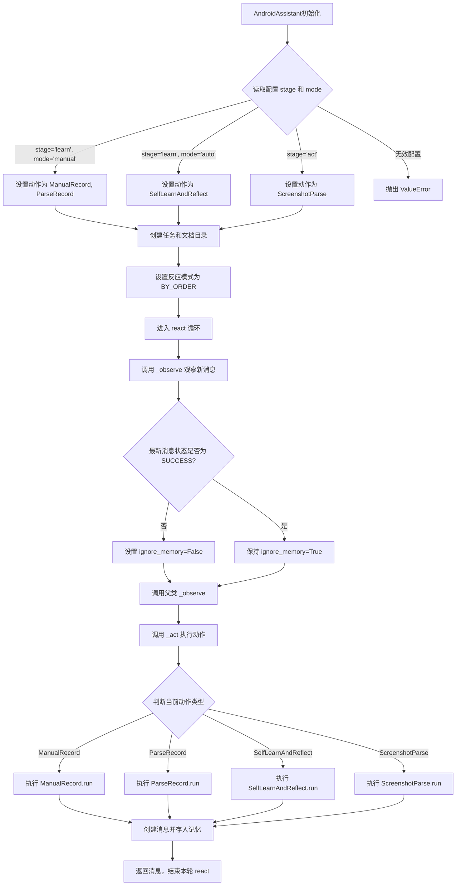
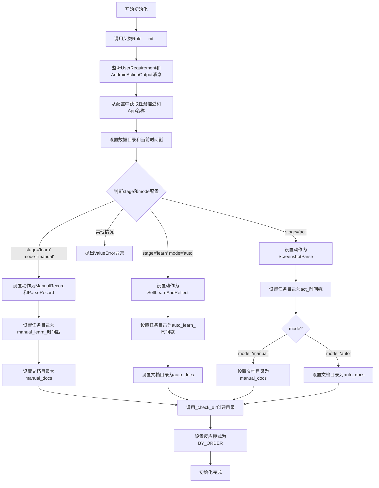
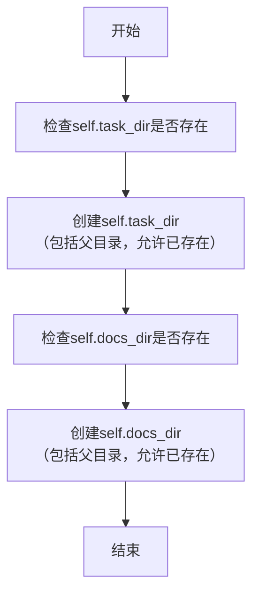
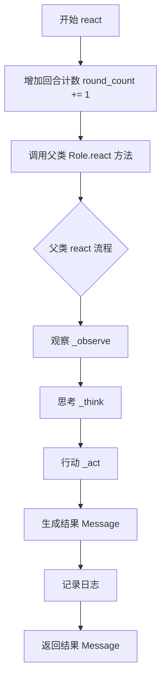
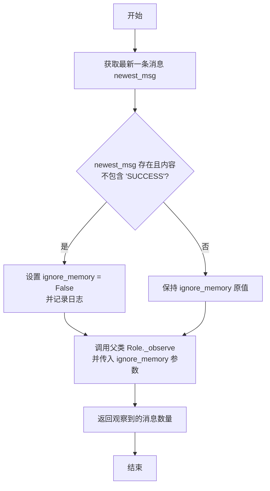
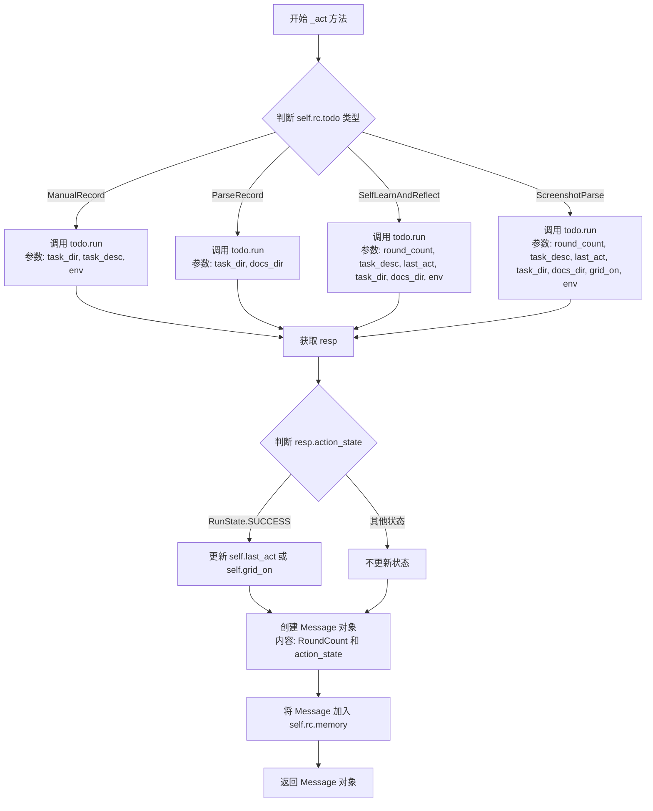

# `.\MetaGPT\metagpt\ext\android_assistant\roles\android_assistant.py` 详细设计文档

该代码实现了一个Android智能助手角色，能够根据配置的学习模式（手动或自动）和阶段（学习或执行）来操作手机应用。它通过监听用户需求和应用操作输出，选择并执行相应的动作（如手动记录、解析记录、自动学习与反思、截图解析），以完成应用探索和操作任务，并管理任务相关的目录和状态。

## 整体流程



## 类结构

```
Role (元角色基类)
└── AndroidAssistant (Android智能助手)
    ├── 字段: name, profile, goal, task_desc, round_count, last_act, output_root_dir, task_dir, docs_dir, grid_on
    ├── 方法: __init__, _check_dir, react, _observe, _act
    └── 观察: [UserRequirement, AndroidActionOutput]
```

## 全局变量及字段


### `AndroidAssistant.name`
    
角色的名称，默认为'Nick'，用于标识Android助手实例。

类型：`str`
    


### `AndroidAssistant.profile`
    
角色的配置文件标识，默认为'AndroidAssistant'，用于描述角色的类型或职责。

类型：`str`
    


### `AndroidAssistant.goal`
    
角色的目标描述，默认为'operate the mobile phone's apps with self-learn'，定义了助手的主要任务。

类型：`str`
    


### `AndroidAssistant.task_desc`
    
任务描述字符串，用于存储当前执行的具体任务说明，通常从配置中加载。

类型：`str`
    


### `AndroidAssistant.round_count`
    
执行轮次计数器，用于跟踪当前任务执行的轮数，初始化为0。

类型：`int`
    


### `AndroidAssistant.last_act`
    
上一次执行的动作记录，用于在连续操作中保持状态或上下文，初始化为'None'。

类型：`str`
    


### `AndroidAssistant.output_root_dir`
    
输出文件的根目录路径，用于存储任务执行过程中生成的所有文件和数据。

类型：`Optional[Path]`
    


### `AndroidAssistant.task_dir`
    
当前任务的工作目录路径，用于存储与当前任务相关的临时文件或日志。

类型：`Optional[Path]`
    


### `AndroidAssistant.docs_dir`
    
文档存储目录路径，用于保存学习或操作过程中生成的文档或配置文件。

类型：`Optional[Path]`
    


### `AndroidAssistant.grid_on`
    
网格模式开关标志，用于控制是否在操作中启用网格辅助功能，默认为False。

类型：`bool`
    
    

## 全局函数及方法

### `AndroidAssistant.__init__`

该方法用于初始化AndroidAssistant角色实例，根据配置参数设置任务阶段（学习或执行）和模式（手动或自动），并相应地配置动作、任务目录和文档目录。

参数：

- `data`：`dict`，包含初始化角色的数据字典，通过`**data`解包传递给父类构造函数。

返回值：`None`，构造函数无返回值。

#### 流程图



#### 带注释源码

```python
def __init__(self, **data):
    # 调用父类Role的构造函数，传入所有关键字参数
    super().__init__(**data)
    # 设置角色监听的消息类型：UserRequirement和AndroidActionOutput
    self._watch([UserRequirement, AndroidActionOutput])
    # 从全局配置中获取额外配置项
    extra_config = config.extra
    # 从配置中获取任务描述，默认为"Just explore any app in this phone!"
    self.task_desc = extra_config.get("task_desc", "Just explore any app in this phone!")
    # 从配置中获取应用名称，默认为"demo"
    app_name = extra_config.get("app_name", "demo")
    # 确定数据目录：优先使用output_root_dir，否则使用默认的EXAMPLE_PATH下的路径
    data_dir = self.output_root_dir.absolute().joinpath("output") or EXAMPLE_PATH.joinpath(
        "android_assistant/output"
    )
    # 生成当前时间戳，格式化为"年-月-日_时-分-秒"
    cur_datetime = datetime.fromtimestamp(int(time.time())).strftime("%Y-%m-%d_%H-%M-%S")

    """首先，我们根据用户配置决定状态，未来可以自动化处理，例如如果是新应用，
    先运行学习阶段再执行操作阶段，或在操作过程中学习。
    """
    # 从配置中获取阶段（learn或act）和模式（manual或auto）
    stage = extra_config.get("stage")
    mode = extra_config.get("mode")
    # 根据阶段和模式的不同组合，设置不同的动作和目录
    if stage == "learn" and mode == "manual":
        # 选择ManualRecord和ParseRecord动作
        # 注意：每个动作只运行一次，无需多轮运行
        self.set_actions([ManualRecord, ParseRecord])
        # 设置任务目录为手动学习目录，包含时间戳
        self.task_dir = data_dir.joinpath(app_name, f"manual_learn_{cur_datetime}")
        # 设置文档目录为手动文档目录
        self.docs_dir = data_dir.joinpath(app_name, "manual_docs")
    elif stage == "learn" and mode == "auto":
        # 选择SelfLearnAndReflect动作
        self.set_actions([SelfLearnAndReflect])
        # 设置任务目录为自动学习目录，包含时间戳
        self.task_dir = data_dir.joinpath(app_name, f"auto_learn_{cur_datetime}")
        # 设置文档目录为自动文档目录
        self.docs_dir = data_dir.joinpath(app_name, "auto_docs")
    elif stage == "act":
        # 选择ScreenshotParse动作
        self.set_actions([ScreenshotParse])
        # 设置任务目录为执行目录，包含时间戳
        self.task_dir = data_dir.joinpath(app_name, f"act_{cur_datetime}")
        # 根据模式设置文档目录
        if mode == "manual":
            self.docs_dir = data_dir.joinpath(app_name, "manual_docs")
        else:
            self.docs_dir = data_dir.joinpath(app_name, "auto_docs")
    else:
        # 如果阶段或模式无效，抛出异常
        raise ValueError(f"invalid stage: {stage}, mode: {mode}")

    # 检查并创建任务目录和文档目录
    self._check_dir()

    # 设置角色的反应模式为按顺序执行（BY_ORDER）
    self._set_react_mode(RoleReactMode.BY_ORDER)
```

### `AndroidAssistant._check_dir`

该方法用于检查并创建任务目录和文档目录，确保它们在后续操作中可用。

参数：无

返回值：`None`，无返回值

#### 流程图



#### 带注释源码

```python
def _check_dir(self):
    # 创建任务目录，如果目录已存在则不会报错
    self.task_dir.mkdir(parents=True, exist_ok=True)
    # 创建文档目录，如果目录已存在则不会报错
    self.docs_dir.mkdir(parents=True, exist_ok=True)
```

### `AndroidAssistant.react`

`AndroidAssistant.react` 方法是 `AndroidAssistant` 角色的核心反应循环方法。它继承自父类 `Role` 的 `react` 方法，并在执行前增加回合计数。该方法负责驱动角色根据观察到的消息（如用户需求或上一个动作的输出）来执行当前设定的动作（`self.rc.todo`），完成一轮“观察-思考-行动”的循环，并返回一个包含执行结果状态的消息。

参数：
-  `self`：`AndroidAssistant`，`AndroidAssistant` 类的实例。

返回值：`Message`，返回一个 `Message` 对象，其内容包含当前回合计数（`RoundCount`）和动作执行状态（`action_state`），用于记录本轮反应循环的结果。

#### 流程图



#### 带注释源码

```python
async def react(self) -> Message:
    # 增加回合计数器，用于跟踪当前是第几轮操作
    self.round_count += 1
    # 调用父类 Role 的 react 方法，执行标准的“观察-思考-行动”循环
    # 父类方法会依次调用 _observe, _think, _act
    result = await super().react()
    # 记录本轮反应循环的最终结果消息，用于调试
    logger.debug(f"react result {result}")
    # 返回最终的结果消息
    return result
```

### `AndroidAssistant._observe`

该方法重写了父类的 `_observe` 方法，用于控制角色在观察环境时是否忽略历史记忆。其核心逻辑是：检查最新的一条消息内容，如果其中不包含表示成功的状态（`RunState.SUCCESS`），则强制将 `ignore_memory` 参数设置为 `False`，以确保角色在后续的“反应-行动”循环中不会忽略这条未完成的消息，从而继续执行剩余轮次的任务。

参数：
- `ignore_memory`：`bool`，指示是否忽略历史记忆。默认值为 `True`。

返回值：`int`，返回从环境中观察到的消息数量。

#### 流程图



#### 带注释源码

```python
async def _observe(self, ignore_memory=True) -> int:
    """ignore old memory to make it run multi rounds inside a role"""
    # 1. 从内存中获取最新的一条消息
    newest_msgs = self.rc.memory.get(k=1)
    newest_msg = newest_msgs[0] if newest_msgs else None

    # 2. 核心逻辑：如果最新消息存在，并且其内容不包含成功的状态标识
    if newest_msg and (RunState.SUCCESS.value.upper() not in newest_msg.content):
        # 2.1 强制设置 ignore_memory 为 False，确保后续轮次能“看到”这条未完成的消息
        ignore_memory = False
        # 2.2 从消息内容中提取状态值用于日志记录
        state_val = newest_msg.content.split(".")[-1]  # RoundCount: 1, action_state: RunState.SUCCESS
        logger.warning(f"Latest action_state is {state_val}, will run in the remainder rounds without `react`")

    # 3. 调用父类 Role 的 _observe 方法，传入处理后的 ignore_memory 参数
    return await super()._observe(ignore_memory)
```

### `AndroidAssistant._act`

`AndroidAssistant._act` 方法是 `AndroidAssistant` 角色的核心执行方法。它根据当前待执行的动作（`self.rc.todo`）的类型，调用相应的动作类（如 `ManualRecord`, `ParseRecord`, `SelfLearnAndReflect`, `ScreenshotParse`）的 `run` 方法，并传入不同的参数。执行完成后，它会根据动作的响应更新角色的内部状态（如 `last_act`, `grid_on`），并将执行结果封装成一个 `Message` 对象存入记忆（`memory`）中，最后返回该消息。

参数：

- `self`：`AndroidAssistant` 实例，表示当前角色对象。

返回值：`Message`，返回一个包含当前轮次计数（`RoundCount`）和动作执行状态（`action_state`）的消息对象，用于记录和传递执行结果。

#### 流程图



#### 带注释源码

```python
async def _act(self) -> Message:
    # 记录日志，显示当前角色设置和待执行的动作
    logger.info(f"{self._setting}: to do {self.rc.todo}({self.rc.todo.name})")
    todo = self.rc.todo  # 获取当前待执行的动作对象

    # 根据动作类型调用相应的 run 方法，并传入不同的参数集
    if isinstance(todo, ManualRecord):
        resp = await todo.run(task_dir=self.task_dir, task_desc=self.task_desc, env=self.rc.env)
    elif isinstance(todo, ParseRecord):
        resp = await todo.run(
            task_dir=self.task_dir,
            docs_dir=self.docs_dir,
        )
    elif isinstance(todo, SelfLearnAndReflect):
        resp = await todo.run(
            round_count=self.round_count,
            task_desc=self.task_desc,
            last_act=self.last_act,
            task_dir=self.task_dir,
            docs_dir=self.docs_dir,
            env=self.rc.env,
        )
        # 如果动作成功完成，更新 last_act 字段为响应中的数据
        if resp.action_state == RunState.SUCCESS:
            self.last_act = resp.data.get("last_act")
    elif isinstance(todo, ScreenshotParse):
        resp = await todo.run(
            round_count=self.round_count,
            task_desc=self.task_desc,
            last_act=self.last_act,
            task_dir=self.task_dir,
            docs_dir=self.docs_dir,
            grid_on=self.grid_on,
            env=self.rc.env,
        )
        # 如果动作成功完成，更新 grid_on 和 last_act 字段为响应中的数据
        if resp.action_state == RunState.SUCCESS:
            logger.info(f"grid_on:  {resp.data.get('grid_on')}")
            self.grid_on = resp.data.get("grid_on", False)
            self.last_act = resp.data.get("last_act", "None")

    # 创建一个 Message 对象，封装执行轮次和动作状态
    msg = Message(
        content=f"RoundCount: {self.round_count}, action_state: {resp.action_state}",
        role=self.profile,
        cause_by=type(resp),  # 消息的触发原因是动作的响应类型
        send_from=self.name,
        send_to=self.name,
    )

    # 将消息添加到角色的记忆（memory）中
    self.rc.memory.add(msg)
    return msg  # 返回创建的消息对象
```

## 关键组件

### AndroidAssistant 角色类

作为整个Android助手功能的核心协调者，它根据配置（阶段和模式）决定执行流程，管理任务状态，并调度不同的具体行动（Action）来完成学习或操作手机应用的目标。

### 行动（Action）组件

一系列具体的执行单元，每个组件负责一个明确的子任务，由`AndroidAssistant`角色根据当前模式进行调度和执行。

### ManualRecord 行动

在手动学习模式下运行，负责引导用户手动操作并记录屏幕截图和操作步骤，为后续解析生成文档做准备。

### ParseRecord 行动

在手动学习模式下，接在`ManualRecord`之后运行，负责解析`ManualRecord`生成的记录文件，提取操作步骤和界面信息，并生成结构化的学习文档。

### SelfLearnAndReflect 行动

在自动学习模式下运行，通过分析屏幕截图、自主决策并执行操作来探索应用，同时进行反思以优化后续行为，实现自我学习。

### ScreenshotParse 行动

在执行（act）阶段运行，负责解析当前屏幕截图，结合已有的学习文档（来自手动或自动学习），生成下一步的操作指令来完成任务目标。

### 配置与状态管理

通过`config.extra`读取外部配置（如`stage`, `mode`, `task_desc`, `app_name`），并管理`round_count`, `last_act`, `grid_on`等运行时状态，以控制不同阶段的行为逻辑和数据流向。

### 文件与目录管理

根据任务类型（学习/执行）和模式（手动/自动）动态创建和管理任务目录（`task_dir`）与文档目录（`docs_dir`），用于存储截图、记录文件、解析后的文档等中间数据和最终产出。

## 问题及建议


### 已知问题

-   **初始化逻辑与字段默认值存在潜在冲突**：`__init__` 方法中直接使用了 `self.output_root_dir.absolute()`，但 `output_root_dir` 字段的默认值为 `None`。如果实例化时未传入 `output_root_dir`，此操作将导致 `AttributeError`。
-   **状态管理逻辑复杂且脆弱**：`_observe` 方法通过解析最新消息的 `content` 字符串来判断是否忽略内存，逻辑依赖于消息内容的特定格式（如 `"RunState.SUCCESS.value.upper()"` 和 `"RoundCount: 1, action_state: RunState.SUCCESS"`）。这种字符串解析方式容易因消息格式的微小变动而失效，且可读性差。
-   **职责边界不清晰**：`AndroidAssistant` 类（一个 `Role`）承担了过多的职责，包括根据配置决定运行阶段和模式、管理任务目录结构、解析运行状态等。这违反了单一职责原则，使得类变得臃肿且难以维护。
-   **配置解析与路径构建逻辑耦合**：在 `__init__` 方法中，从 `config.extra` 读取配置、构建数据目录路径、决定运行阶段和模式等逻辑全部交织在一起。这使得初始化方法冗长，且难以独立测试或修改其中某一部分逻辑。
-   **字段类型注解与实际使用不完全匹配**：`task_dir` 和 `docs_dir` 字段的类型注解为 `Optional[Path]`，但在 `_check_dir` 和 `_act` 方法中，它们被当作非 `None` 值直接使用（如 `self.task_dir.mkdir`）。虽然初始化逻辑确保了它们不为 `None`，但这种设计在类型安全上存在隐患。
-   **硬编码的字符串比较**：在 `_observe` 方法中，通过 `RunState.SUCCESS.value.upper() not in newest_msg.content` 来判断状态，这种方式容易出错，且将状态比较逻辑分散在字符串操作中。

### 优化建议

-   **增强初始化方法的健壮性**：在 `__init__` 方法开始处，应检查 `self.output_root_dir` 是否为 `None`，如果是，则提供一个合理的默认值（如 `EXAMPLE_PATH`），而不是直接调用 `.absolute()` 方法。
-   **重构状态管理逻辑**：建议将运行状态（如是否继续执行、当前轮次状态）封装为明确的类属性或内部状态机，而不是依赖于对消息内容的字符串解析。`Message` 对象可以携带结构化的状态数据。
-   **进行职责分离**：
    -   将配置解析、路径构建和运行模式决策的逻辑抽取到一个独立的配置管理类或工厂方法中。
    -   将目录创建和管理的逻辑进一步封装。
    -   使 `AndroidAssistant` 类更专注于其核心角色行为：观察、思考和行动。
-   **解耦配置与初始化逻辑**：考虑将 `stage`, `mode`, `app_name`, `task_desc` 等配置项作为构造参数显式传入，或在初始化后通过一个独立的 `configure` 方法进行设置，而不是直接从全局 `config.extra` 中读取。这提高了可测试性和模块化。
-   **明确字段的非空性**：如果 `task_dir` 和 `docs_dir` 在实例的生命周期内不可能为 `None`，应考虑将它们的类型注解改为 `Path` 并移除 `Optional`，同时在初始化逻辑中确保它们被正确赋值。如果必须保留 `Optional`，则在使用前应添加空值检查。
-   **使用枚举值进行状态比较**：在 `_observe` 和 `_act` 方法中，直接使用 `RunState.SUCCESS` 等枚举成员与 `resp.action_state` 进行比较，而不是进行字符串包含性检查。这更安全、更清晰。
-   **考虑引入更清晰的生命周期钩子**：`MetaGPT` 框架可能提供了 `_init_actions` 之类的钩子方法，可以将动作设置逻辑移到其中，使 `__init__` 方法更简洁。同时，可以探索使用框架提供的更高级状态管理机制。


## 其它


### 设计目标与约束

该代码旨在实现一个Android助手角色，能够通过手动或自动学习来理解和操作手机应用。设计目标包括：支持多种学习模式（手动记录、自动学习）和执行模式（学习阶段、执行阶段）；通过角色反应模式（RoleReactMode.BY_ORDER）按顺序执行动作；能够根据配置动态选择不同的动作序列；具备状态管理能力，能够跟踪轮次计数、上次操作和网格开关状态。主要约束包括：依赖外部配置（config.extra）来决定运行阶段和模式；输出目录结构依赖于配置的app_name和当前时间戳；需要与特定的动作类（如ManualRecord, ParseRecord等）紧密集成；假设环境（self.rc.env）提供了必要的操作接口。

### 错误处理与异常设计

代码中显式错误处理有限。主要错误处理包括：在初始化时，如果提供的stage和mode组合无效，会抛出ValueError异常。目录创建通过_check_dir方法使用mkdir(parents=True, exist_ok=True)处理，如果目录已存在则静默继续，但父目录创建失败或权限问题可能导致异常。在_act方法中，各个动作类（如ManualRecord.run）的执行可能抛出异常，这些异常会向上传播，导致当前轮的react过程失败。在_observe方法中，对最新消息内容的解析（如split操作）如果消息格式不符合预期，可能导致运行时错误或逻辑错误。缺乏更广泛的异常捕获和恢复机制，例如网络超时、外部服务不可用或环境交互失败等情况。

### 数据流与状态机

核心数据流始于配置（config.extra），它决定了stage（learn/act）和mode（manual/auto），进而初始化时选择不同的动作序列并设置task_dir和docs_dir。角色运行后，通过_observe方法观察内存中的最新消息，判断前一个动作是否成功（通过检查消息内容是否包含"RunState.SUCCESS"），以此决定是否忽略旧内存（控制是否进入新的一轮）。在_act方法中，根据当前待执行动作（self.rc.todo）的类型，调用相应的run方法，传入参数如round_count, task_desc, last_act, task_dir等，并接收一个AndroidActionOutput类型的响应（resp）。响应中的action_state和data字段用于更新内部状态（如last_act, grid_on）。每次动作执行后，会生成一个Message记录到内存中，其内容包含轮次和动作状态。整体状态由round_count、last_act、grid_on、task_dir、docs_dir等字段以及当前选择的动作序列共同维护，构成了一个隐式的多阶段状态机（学习阶段 -> 可能的手动解析 -> 执行阶段）。

### 外部依赖与接口契约

代码严重依赖多个外部模块和类：1. **metagpt框架**：继承自Role基类，使用RoleReactMode、Message、config、logger等。2. **动作类**：ManualRecord、ParseRecord、SelfLearnAndReflect、ScreenshotParse，它们的run方法有特定的参数签名和返回值类型（应返回AndroidActionOutput或兼容对象）。3. **配置系统**：通过config.extra获取task_desc、app_name、stage、mode等配置项，假设这些配置项存在且格式正确。4. **环境接口**：self.rc.env被传递给多个动作的run方法，假设它提供了与Android设备交互的能力（如截图、点击）。5. **工具类/常量**：使用EXAMPLE_PATH、AndroidActionOutput、RunState等。接口契约包括：Role基类要求的_set_react_mode、_watch、react、_observe、_act等方法；动作类run方法的具体参数和返回值约定；config.extra中特定键的约定；Message对象在内存中用于通信的格式约定（特别是content字段用于传递状态）。

### 安全与权限考虑

代码本身不直接处理敏感数据或网络通信。然而，其功能是操作Android设备，这可能涉及：1. **设备访问权限**：需要ADB调试权限或类似权限来控制设备。2. **应用数据**：在学习过程中可能记录应用界面、操作步骤，这些数据可能包含用户隐私信息（取决于被学习的应用）。3. **文件系统**：在指定目录（output_root_dir, task_dir, docs_dir）下创建文件和目录，需要确保有适当的写入权限，并且目录路径不会导致安全风险（如路径遍历）。4. **配置注入**：config.extra的内容来自外部配置，需要防范恶意配置导致意外行为（虽然当前风险较低）。代码未显式处理这些安全问题，依赖部署环境和调用方保证。

### 测试策略建议

建议采用分层测试策略：1. **单元测试**：测试AndroidAssistant类的初始化逻辑，验证不同stage和mode配置下动作序列、目录路径的正确设置；测试_check_dir方法；测试_observe方法对不同消息内容的处理逻辑；模拟测试_act方法中对不同动作类的分发调用。2. **集成测试**：将AndroidAssistant与一个或多个模拟的动作类（Mock）集成，测试完整的react流程，包括状态更新和消息传递。3. **契约测试**：验证与各个动作类（ManualRecord等）的接口契约，确保传递的参数和处理的返回值符合预期。4. **配置测试**：测试各种有效和无效的config.extra输入对初始化的影响。5. **端到端测试**：在可控的测试环境（如模拟器）中运行完整的学习和执行流程。由于依赖外部设备环境，测试可能需要模拟或使用测试双板（如Mock for self.rc.env）。

### 部署与运行要求

运行此代码需要：1. **Python环境**：安装必要的依赖（如pydantic, metagpt框架及其扩展）。2. **MetaGPT配置**：正确的config配置，特别是extra部分必须包含task_desc、app_name、stage、mode等键。3. **Android设备连接**：需要通过ADB或其他方式连接的Android设备，并且环境（self.rc.env）能够与之交互。4. **文件系统权限**：对output_root_dir（或默认的EXAMPLE_PATH）指向的目录有写入权限。5. **运行模式**：作为MetaGPT角色运行，需要嵌入到更大的Agent流程中，由框架驱动其react循环。部署时应确保配置管理安全，设备连接稳定，并且有足够的磁盘空间存储学习产生的文档和截图。

### 可维护性扩展点

代码结构提供了几个清晰的扩展点：1. **新的学习或执行模式**：可以通过在初始化逻辑的if-elif-else链中添加新的stage和mode组合，并引入新的动作类。2. **新的动作类型**：可以创建新的Action类，并在_act方法中添加相应的处理分支。3. **状态管理**：当前状态（last_act, grid_on）的管理逻辑集中在_act方法中，可以抽象为独立的状态管理模块。4. **配置驱动**：所有行为均由config.extra驱动，便于通过外部配置改变行为，无需修改代码。5. **目录结构**：task_dir和docs_dir的生成逻辑固定，可以根据需要修改命名规则或结构。6. **观察逻辑**：_observe方法可以根据更复杂的记忆查询策略进行扩展。7. **错误处理**：可以增加更全面的异常处理和数据验证来提升健壮性。

    