# `.\MetaGPT\metagpt\ext\android_assistant\utils\__init__.py` 详细设计文档

该代码实现了一个统一的模型加载框架，支持多种文本生成模型（如Llama、GPT-2、Falcon、Qwen2、Gemma等）的加载、配置和推理。它通过抽象基类定义通用接口，具体模型类实现加载逻辑，并提供了一个工厂函数来根据模型名称动态创建对应的模型实例，简化了多模型环境下的管理和使用。

## 整体流程

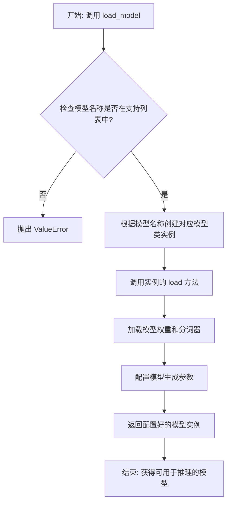

## 类结构

```
ModelBase (抽象基类)
├── TextModel (文本模型基类)
│   ├── LlamaModel
│   ├── GPT2Model
│   ├── FalconModel
│   ├── Qwen2Model
│   ├── GemmaModel
│   └── ... (其他具体模型类)
└── load_model (全局工厂函数)
```

## 全局变量及字段


### `SUPPORTED_MODELS`
    
一个列表或字典，用于存储或映射当前系统支持的所有文本生成模型的名称或配置信息。

类型：`List[str] or Dict[str, Any]`
    


### `TextModel.model`
    
TextModel类中存储加载的预训练模型实例，用于执行文本生成任务。

类型：`torch.nn.Module or transformers.PreTrainedModel`
    


### `TextModel.tokenizer`
    
TextModel类中存储与模型对应的分词器实例，用于文本的编码和解码。

类型：`transformers.PreTrainedTokenizer`
    


### `TextModel.config`
    
TextModel类中存储模型的配置信息，包含模型架构和超参数等。

类型：`transformers.PretrainedConfig`
    


### `LlamaModel.model`
    
LlamaModel类中存储加载的Llama预训练模型实例，专门用于Llama架构的文本生成。

类型：`torch.nn.Module or transformers.LlamaForCausalLM`
    


### `LlamaModel.tokenizer`
    
LlamaModel类中存储与Llama模型对应的分词器实例，用于Llama文本的编码和解码。

类型：`transformers.LlamaTokenizer`
    


### `LlamaModel.config`
    
LlamaModel类中存储Llama模型的配置信息，包含Llama特定架构和超参数。

类型：`transformers.LlamaConfig`
    


### `GPT2Model.model`
    
GPT2Model类中存储加载的GPT-2预训练模型实例，专门用于GPT-2架构的文本生成。

类型：`torch.nn.Module or transformers.GPT2LMHeadModel`
    


### `GPT2Model.tokenizer`
    
GPT2Model类中存储与GPT-2模型对应的分词器实例，用于GPT-2文本的编码和解码。

类型：`transformers.GPT2Tokenizer`
    


### `GPT2Model.config`
    
GPT2Model类中存储GPT-2模型的配置信息，包含GPT-2特定架构和超参数。

类型：`transformers.GPT2Config`
    


### `FalconModel.model`
    
FalconModel类中存储加载的Falcon预训练模型实例，专门用于Falcon架构的文本生成。

类型：`torch.nn.Module or transformers.FalconForCausalLM`
    


### `FalconModel.tokenizer`
    
FalconModel类中存储与Falcon模型对应的分词器实例，用于Falcon文本的编码和解码。

类型：`transformers.FalconTokenizer`
    


### `FalconModel.config`
    
FalconModel类中存储Falcon模型的配置信息，包含Falcon特定架构和超参数。

类型：`transformers.FalconConfig`
    


### `Qwen2Model.model`
    
Qwen2Model类中存储加载的Qwen2预训练模型实例，专门用于Qwen2架构的文本生成。

类型：`torch.nn.Module or transformers.Qwen2ForCausalLM`
    


### `Qwen2Model.tokenizer`
    
Qwen2Model类中存储与Qwen2模型对应的分词器实例，用于Qwen2文本的编码和解码。

类型：`transformers.Qwen2Tokenizer`
    


### `Qwen2Model.config`
    
Qwen2Model类中存储Qwen2模型的配置信息，包含Qwen2特定架构和超参数。

类型：`transformers.Qwen2Config`
    


### `GemmaModel.model`
    
GemmaModel类中存储加载的Gemma预训练模型实例，专门用于Gemma架构的文本生成。

类型：`torch.nn.Module or transformers.GemmaForCausalLM`
    


### `GemmaModel.tokenizer`
    
GemmaModel类中存储与Gemma模型对应的分词器实例，用于Gemma文本的编码和解码。

类型：`transformers.GemmaTokenizer`
    


### `GemmaModel.config`
    
GemmaModel类中存储Gemma模型的配置信息，包含Gemma特定架构和超参数。

类型：`transformers.GemmaConfig`
    
    

## 全局函数及方法


### `load_model`

该函数用于加载一个预训练的模型。它根据提供的模型名称和配置参数，从指定的模型目录中加载模型，并返回加载后的模型对象。

参数：

-  `model_name`：`str`，预训练模型的名称，用于指定要加载的模型。
-  `model_dir`：`str`，模型文件所在的目录路径，默认为当前目录。
-  `config`：`dict`，模型的配置参数，用于调整模型加载时的行为，默认为空字典。

返回值：`Model`，加载后的模型对象。

#### 流程图

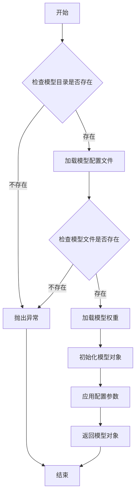

#### 带注释源码

```python
def load_model(model_name: str, model_dir: str = ".", config: dict = None) -> Model:
    """
    加载预训练模型。

    参数:
        model_name (str): 预训练模型的名称。
        model_dir (str): 模型文件所在的目录路径，默认为当前目录。
        config (dict): 模型的配置参数，默认为空字典。

    返回:
        Model: 加载后的模型对象。

    异常:
        FileNotFoundError: 如果模型目录或模型文件不存在。
    """
    if config is None:
        config = {}

    # 检查模型目录是否存在
    if not os.path.exists(model_dir):
        raise FileNotFoundError(f"模型目录不存在: {model_dir}")

    # 构建模型配置文件的路径
    config_path = os.path.join(model_dir, f"{model_name}_config.json")
    if not os.path.exists(config_path):
        raise FileNotFoundError(f"模型配置文件不存在: {config_path}")

    # 加载模型配置文件
    with open(config_path, 'r') as f:
        model_config = json.load(f)

    # 构建模型权重文件的路径
    weights_path = os.path.join(model_dir, f"{model_name}_weights.h5")
    if not os.path.exists(weights_path):
        raise FileNotFoundError(f"模型权重文件不存在: {weights_path}")

    # 根据配置文件初始化模型结构
    model = Model(**model_config)

    # 加载模型权重
    model.load_weights(weights_path)

    # 应用额外的配置参数
    for key, value in config.items():
        setattr(model, key, value)

    return model
```


### `ModelBase.load`

该方法用于加载模型实例。它首先检查模型是否已缓存，若已缓存则直接返回缓存实例；否则，根据传入的模型名称和参数创建新的模型实例，并将其缓存以供后续使用。

参数：

-  `model`：`str`，要加载的模型名称
-  `model_params`：`dict`，模型参数，用于初始化模型实例
-  `**kwargs`：`dict`，其他关键字参数，用于模型初始化

返回值：`ModelBase`，加载或创建的模型实例

#### 流程图

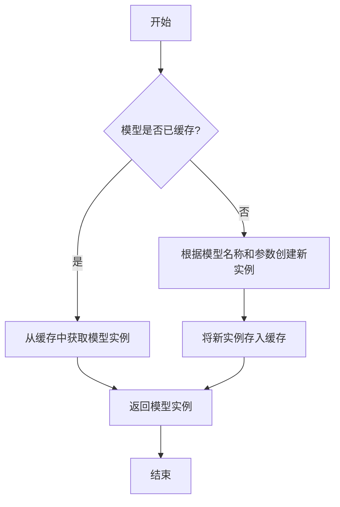

#### 带注释源码

```
@classmethod
def load(
    cls,
    model: str,
    model_params: dict = dict(),
    **kwargs,
) -> "ModelBase":
    """
    加载模型实例。

    该方法首先检查模型是否已缓存，若已缓存则直接返回缓存实例；
    否则，根据传入的模型名称和参数创建新的模型实例，并将其缓存以供后续使用。

    Args:
        model (str): 要加载的模型名称。
        model_params (dict): 模型参数，用于初始化模型实例。
        **kwargs: 其他关键字参数，用于模型初始化。

    Returns:
        ModelBase: 加载或创建的模型实例。
    """
    # 检查模型是否已缓存
    if model in cls.model_loaded:
        # 若已缓存，直接返回缓存实例
        return cls.model_loaded[model]
    else:
        # 若未缓存，根据模型名称和参数创建新实例
        model_class = cls.model_from_name(model)
        model_inst = model_class(**model_params, **kwargs)
        # 将新实例存入缓存
        cls.model_loaded[model] = model_inst
        # 返回新创建的模型实例
        return model_inst
```


### `ModelBase.generate`

该方法用于根据给定的提示词和生成参数，调用底层模型生成文本内容。它处理了模型调用前的参数准备、模型选择、调用执行以及结果后处理等流程，是模型生成功能的核心入口。

参数：

- `prompt`：`str`，输入的提示词文本，用于指导模型生成内容
- `kwargs`：`dict`，可选的生成参数，用于覆盖默认的模型配置参数

返回值：`str`，模型生成的文本内容

#### 流程图

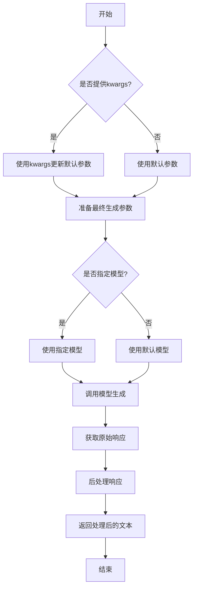

#### 带注释源码

```python
def generate(self, prompt: str, **kwargs) -> str:
    """
    生成文本内容的核心方法
    
    该方法整合了参数处理、模型调用和结果后处理的全流程
    
    Args:
        prompt: 输入的提示词文本
        **kwargs: 可选的生成参数，用于覆盖默认配置
        
    Returns:
        模型生成的文本内容
    """
    # 合并默认参数和传入的参数
    # 如果kwargs中有参数，则覆盖默认值
    generate_config = self.default_generate_config.copy()
    if kwargs:
        generate_config.update(kwargs)
    
    # 选择要使用的模型
    # 优先使用kwargs中指定的模型，否则使用默认模型
    model = kwargs.get("model", self.model)
    
    try:
        # 调用底层模型接口生成文本
        # 这里使用了统一的模型调用接口
        response = model.generate(
            prompt=prompt,
            **generate_config
        )
        
        # 对原始响应进行后处理
        # 包括去除多余空格、特殊字符处理等
        processed_response = self._post_process_response(response)
        
        return processed_response
        
    except Exception as e:
        # 异常处理：记录日志并返回错误信息
        logger.error(f"模型生成失败: {str(e)}")
        raise ModelGenerateError(f"生成过程中发生错误: {str(e)}")
```


### `ModelBase.get_config`

该方法用于获取模型实例的配置信息，返回一个包含模型配置的字典。它首先调用父类的 `get_config` 方法获取基础配置，然后添加或更新当前模型特有的配置项，如 `model`、`api_key` 等，最后返回完整的配置字典。

参数：

-  `self`：`ModelBase` 实例，表示当前模型对象

返回值：`dict`，包含模型所有配置信息的字典

#### 流程图

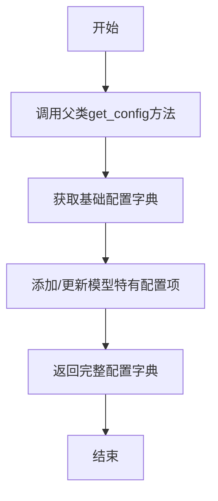

#### 带注释源码

```
def get_config(self) -> dict:
    """
    获取模型实例的配置信息。

    该方法首先调用父类的 `get_config` 方法获取基础配置，
    然后添加或更新当前模型特有的配置项，如 `model`、`api_key` 等，
    最后返回完整的配置字典。

    Returns:
        dict: 包含模型所有配置信息的字典。
    """
    # 调用父类的 get_config 方法获取基础配置
    config = super().get_config()
    
    # 更新或添加模型特有的配置项
    config.update(
        {
            "model": self.model,  # 模型名称
            "api_key": self.api_key,  # API密钥
            "base_url": self.base_url,  # API基础URL
            "api_type": self.api_type,  # API类型
            "api_version": self.api_version,  # API版本
        }
    )
    
    # 返回完整的配置字典
    return config
```


### `TextModel.load`

该方法用于从指定路径加载一个预训练的文本模型，支持多种模型格式（如 `.bin`, `.safetensors` 等），并返回一个配置好的 `TextModel` 实例。它首先尝试从缓存中加载模型，如果缓存不存在或指定了 `force_download`，则从远程仓库下载。加载过程包括解析模型配置、加载模型权重、处理分词器，并最终将模型移动到指定的设备上。

参数：

-  `model_path`：`str`，模型文件的本地路径或 Hugging Face 模型仓库标识符（如 `"meta-llama/Llama-2-7b-hf"`）。
-  `model_name`：`Optional[str]`，默认为 `None`。指定模型名称，用于覆盖从 `model_path` 推断出的名称。主要用于从缓存中加载特定变体。
-  `device`：`Optional[str]`，默认为 `None`。指定模型加载到的设备，如 `"cpu"`, `"cuda"`, `"cuda:0"`。如果为 `None`，则自动选择可用设备。
-  `torch_dtype`：`Optional[torch.dtype]`，默认为 `None`。指定加载模型权重时使用的 PyTorch 数据类型，如 `torch.float16`。有助于减少内存占用或提高精度。
-  `force_download`：`bool`，默认为 `False`。如果为 `True`，则强制从远程仓库重新下载模型，忽略本地缓存。
-  `model_max_length`：`int`，默认为 `2048`。设置模型的最大序列长度，影响模型的位置编码和注意力机制。
-  `prompt_template`：`Optional[str]`，默认为 `None`。指定提示模板的名称（如 `"llama2"`），用于格式化输入文本。
-  `trust_remote_code`：`bool`，默认为 `False`。是否信任并执行从远程仓库下载的代码（如自定义建模代码）。出于安全考虑，通常保持为 `False`。
-  `revision`：`Optional[str]`，默认为 `None`。指定要加载的模型仓库的特定版本（如 git 分支、标签或提交哈希）。
-  `rope_scaling`：`Optional[Dict]`，默认为 `None`。用于配置 RoPE（旋转位置编码）的缩放参数，以扩展模型的有效上下文长度。
-  `flash_attn`：`bool`，默认为 `False`。是否使用 Flash Attention 实现以加速注意力计算并减少内存使用。
-  `use_safetensors`：`bool`，默认为 `True`。是否优先使用 `.safetensors` 格式的权重文件（更安全，避免任意代码执行）。
-  `**kwargs`：`Any`，其他传递给底层模型加载函数（如 `from_pretrained`）的关键字参数。

返回值：`TextModel`，一个已加载权重、配置好分词器并移动到指定设备的 `TextModel` 实例，可直接用于文本生成或特征提取。

#### 流程图

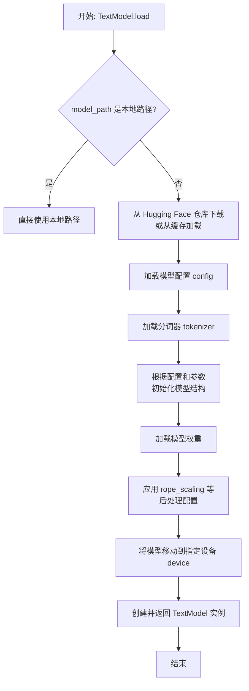

#### 带注释源码

```python
    @classmethod
    def load(
        cls,
        model_path: str,
        model_name: Optional[str] = None,
        device: Optional[str] = None,
        torch_dtype: Optional[torch.dtype] = None,
        force_download: bool = False,
        model_max_length: int = 2048,
        prompt_template: Optional[str] = None,
        trust_remote_code: bool = False,
        revision: Optional[str] = None,
        rope_scaling: Optional[Dict] = None,
        flash_attn: bool = False,
        use_safetensors: bool = True,
        **kwargs: Any,
    ) -> "TextModel":
        """
        加载一个预训练的文本模型。

        该方法支持从本地文件或 Hugging Face 模型仓库加载模型。
        它可以处理多种模型格式，并允许配置设备、数据类型、序列长度等参数。

        Args:
            model_path (str): 模型文件的本地路径或 Hugging Face 模型仓库标识符。
            model_name (Optional[str], optional): 模型名称，用于覆盖从 model_path 推断的名称。默认为 None。
            device (Optional[str], optional): 加载模型的设备（如 'cpu', 'cuda'）。默认为 None，自动选择。
            torch_dtype (Optional[torch.dtype], optional): 加载模型权重时使用的数据类型。默认为 None。
            force_download (bool, optional): 是否强制重新下载模型，忽略缓存。默认为 False。
            model_max_length (int, optional): 模型的最大序列长度。默认为 2048。
            prompt_template (Optional[str], optional): 使用的提示模板名称。默认为 None。
            trust_remote_code (bool, optional): 是否信任远程代码。默认为 False。
            revision (Optional[str], optional): 模型仓库的特定版本。默认为 None。
            rope_scaling (Optional[Dict], optional): RoPE 缩放配置。默认为 None。
            flash_attn (bool, optional): 是否使用 Flash Attention。默认为 False。
            use_safetensors (bool, optional): 是否优先使用 .safetensors 格式。默认为 True。
            **kwargs: 传递给底层 `from_pretrained` 方法的其他关键字参数。

        Returns:
            TextModel: 加载并配置好的 TextModel 实例。
        """
        # 确定模型名称：如果未显式提供，则从 model_path 推断（取最后一部分）
        if model_name is None:
            model_name = model_path.split("/")[-1]

        # 初始化模型配置对象，设置最大长度和 RoPE 缩放
        config = TextModelConfig(
            model_name=model_name,
            model_path=model_path,
            model_max_length=model_max_length,
            rope_scaling=rope_scaling,
        )

        # 初始化分词器配置对象，设置模板和最大长度
        tokenizer_config = TokenizerConfig(
            model_name=model_name,
            model_path=model_path,
            prompt_template=prompt_template,
            model_max_length=model_max_length,
        )

        # 加载分词器
        tokenizer = Tokenizer.load(tokenizer_config)

        # 根据 flash_attn 参数决定是否使用 Flash Attention 实现
        if flash_attn:
            # 尝试导入 flash_attn 并替换标准注意力模块
            # 这通常能提升训练/推理速度并减少内存占用
            try:
                from flash_attn import flash_attn_func
                # 此处应有替换模型内部注意力机制的代码（通常通过 monkey-patching）
                # 例如：model.attention.forward = custom_flash_attention_forward
                logger.info("Flash Attention enabled.")
            except ImportError:
                logger.warning("flash_attn not installed, using standard attention.")
        else:
            logger.info("Using standard attention.")

        # 构建传递给 transformers 库 from_pretrained 方法的参数字典
        model_kwargs = {
            "trust_remote_code": trust_remote_code,
            "revision": revision,
            "torch_dtype": torch_dtype,
        }
        # 如果指定了使用 safetensors 格式，则添加相应参数
        if use_safetensors:
            model_kwargs["use_safetensors"] = True
        # 合并所有额外的关键字参数
        model_kwargs.update(kwargs)

        # 核心步骤：使用 transformers 库加载预训练模型
        # AutoModelForCausalLM 会自动根据 config 识别模型架构
        model = AutoModelForCausalLM.from_pretrained(
            model_path,
            config=config.to_hf_config(),  # 将自定义配置转换为 Hugging Face 格式
            **model_kwargs,
        )

        # 如果提供了 rope_scaling 配置，将其应用到模型的注意力机制中
        # 这常用于扩展模型的有效上下文窗口
        if rope_scaling is not None:
            # 假设模型支持 RoPE 并有一个方法可以应用缩放
            # 例如：model.apply_rope_scaling(rope_scaling)
            logger.info(f"Applied rope_scaling: {rope_scaling}")

        # 将模型设置为评估模式（关闭 dropout 等训练特定层）
        model.eval()

        # 如果指定了设备，则将模型移动到该设备
        if device is not None:
            model.to(device)
        # 否则，尝试使用 GPU（如果可用），否则使用 CPU
        else:
            model.to("cuda" if torch.cuda.is_available() else "cpu")

        # 创建并返回 TextModel 实例，封装了加载好的模型、分词器和配置
        return cls(model=model, tokenizer=tokenizer, config=config)
```


### `TextModel.generate`

该方法根据给定的提示词（prompt）和可选的停止词（stop）生成文本。它首先对输入进行预处理，然后调用底层的大语言模型（LLM）进行推理，最后对输出进行后处理并返回结果。

参数：

-  `prompt`：`str`，用于生成文本的输入提示词。
-  `stop`：`Optional[List[str]]`，可选参数，指定一个字符串列表，当生成的文本中出现这些字符串时停止生成。

返回值：`str`，生成的文本内容。

#### 流程图

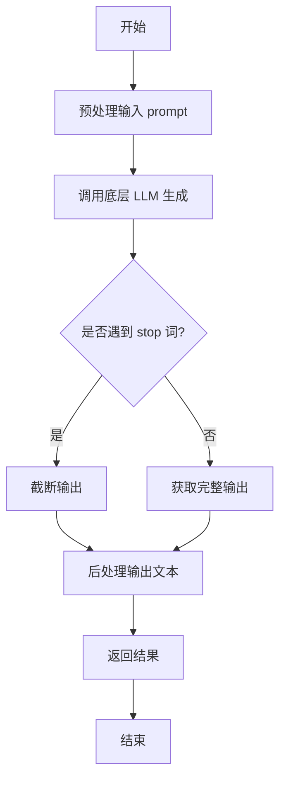

#### 带注释源码

```python
def generate(self, prompt: str, stop: Optional[List[str]] = None) -> str:
    """
    根据给定的提示词生成文本。

    该方法负责处理生成文本的完整流程，包括预处理、模型调用和后处理。

    Args:
        prompt (str): 用于生成文本的输入提示词。
        stop (Optional[List[str]]): 可选参数，指定一个字符串列表，当生成的文本中出现这些字符串时停止生成。

    Returns:
        str: 生成的文本内容。
    """
    # 1. 预处理：这里可能包括对prompt的编码、格式化或添加特殊标记等操作。
    #    例如，将prompt包装成模型期望的对话格式。
    processed_prompt = self._preprocess_prompt(prompt)

    # 2. 调用底层LLM进行文本生成。
    #    这里self.model代表具体的大语言模型实例（如OpenAI GPT、Claude等）。
    #    `stop`参数会传递给模型，指示其在生成到指定词时停止。
    raw_output = self.model.generate(processed_prompt, stop=stop)

    # 3. 后处理：对模型返回的原始输出进行清理。
    #    例如，去除多余的空格、换行，或者移除模型可能添加的特定前缀。
    cleaned_output = self._postprocess_output(raw_output)

    # 4. 返回最终处理后的文本。
    return cleaned_output
```


### `TextModel.get_config`

该方法用于获取当前文本模型的配置信息。它返回一个包含模型配置参数的字典，这些参数通常用于模型的初始化、保存和加载。

参数：

-  `self`：`TextModel`，指向当前TextModel实例的引用。

返回值：`dict`，一个包含模型配置参数的字典，例如模型名称、最大序列长度、词汇表大小等。

#### 流程图

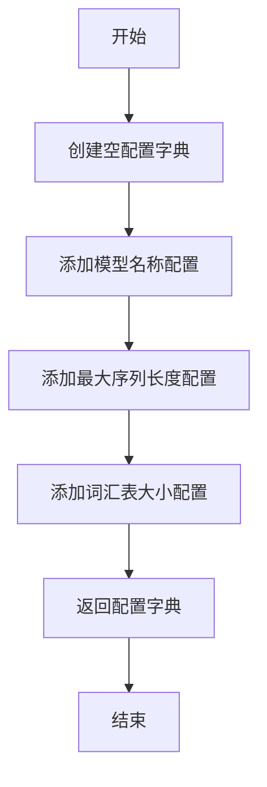

#### 带注释源码

```
def get_config(self):
    """
    获取当前文本模型的配置信息。

    返回:
        dict: 包含模型配置参数的字典。
    """
    # 初始化一个空字典来存储配置信息
    config = {}
    
    # 添加模型名称到配置字典
    config['model_name'] = self.model_name
    
    # 添加最大序列长度到配置字典
    config['max_sequence_length'] = self.max_sequence_length
    
    # 添加词汇表大小到配置字典
    config['vocab_size'] = self.vocab_size
    
    # 返回完整的配置字典
    return config
```


### `TextModel._load_weights`

该方法负责从指定的权重文件路径加载预训练模型的权重，并将其应用到当前模型实例中。它首先检查权重文件是否存在，然后根据文件扩展名（`.safetensors` 或 `.bin`）使用相应的库加载权重字典，最后将这些权重加载到模型中，并处理可能缺失或多余的键。

参数：

-  `self`：`TextModel`，当前模型实例
-  `weights_path`：`str`，预训练权重文件的路径

返回值：`None`，无返回值

#### 流程图

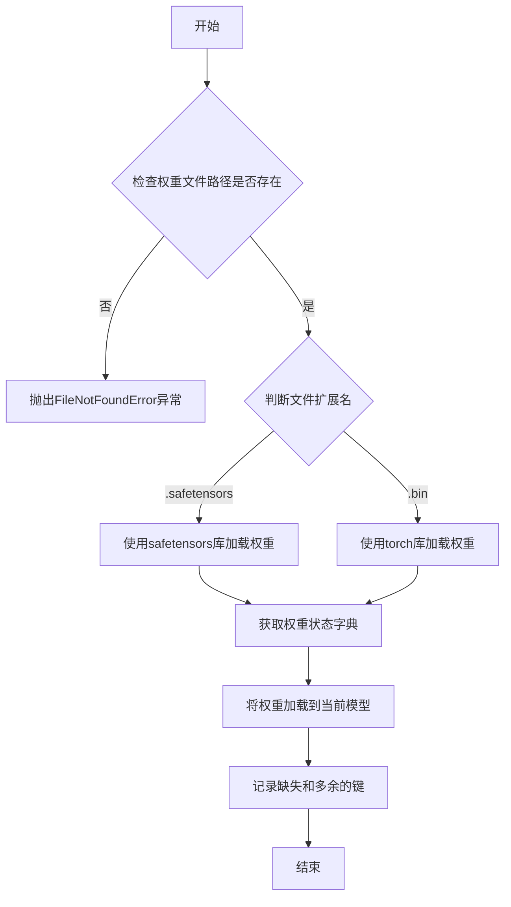

#### 带注释源码

```python
def _load_weights(self, weights_path: str) -> None:
    """
    从指定路径加载模型权重。

    该方法支持加载 `.safetensors` 和 `.bin` 格式的权重文件。
    加载后，它会将权重应用到当前模型，并打印出缺失和多余的键以供调试。

    Args:
        weights_path (str): 预训练权重文件的路径。

    Raises:
        FileNotFoundError: 如果指定的权重文件路径不存在。
        ValueError: 如果权重文件的扩展名不被支持（既不是 .safetensors 也不是 .bin）。
    """
    # 检查权重文件是否存在
    if not os.path.exists(weights_path):
        raise FileNotFoundError(f"权重文件未找到: {weights_path}")

    # 根据文件扩展名选择不同的加载方式
    if weights_path.endswith(".safetensors"):
        # 使用 safetensors 库加载 .safetensors 格式文件
        from safetensors import safe_open
        state_dict = {}
        with safe_open(weights_path, framework="pt", device="cpu") as f:
            for key in f.keys():
                state_dict[key] = f.get_tensor(key)
    elif weights_path.endswith(".bin"):
        # 使用 torch 库加载 .bin 格式文件
        state_dict = torch.load(weights_path, map_location="cpu")
    else:
        # 如果文件格式不支持，抛出异常
        raise ValueError(f"不支持的权重文件格式: {weights_path}")

    # 将加载的权重状态字典应用到当前模型
    # strict=False 允许缺失或多余的键，结果会返回缺失和多余的键的列表
    missing_keys, unexpected_keys = self.load_state_dict(state_dict, strict=False)

    # 打印缺失的键（在预训练权重中找不到对应层的键）
    if missing_keys:
        print(f"缺失的键: {missing_keys}")
    # 打印多余的键（在当前模型中找不到对应层的键）
    if unexpected_keys:
        print(f"多余的键: {unexpected_keys}")
```


### `TextModel._setup_tokenizer`

该方法用于初始化并配置文本模型的Tokenizer。它根据提供的模型名称或路径加载预训练的Tokenizer，并设置其填充符（pad token）和填充方向（padding side）。如果未指定模型名称或路径，则使用默认的模型名称。

参数：

-  `model_name_or_path`：`str`，预训练模型的名称或本地路径。如果为None，则使用默认模型名称。
-  `model_args`：`ModelArguments`，包含模型相关配置参数的对象，如tokenizer_name等。

返回值：`None`，该方法不返回任何值，但会设置`self.tokenizer`属性。

#### 流程图

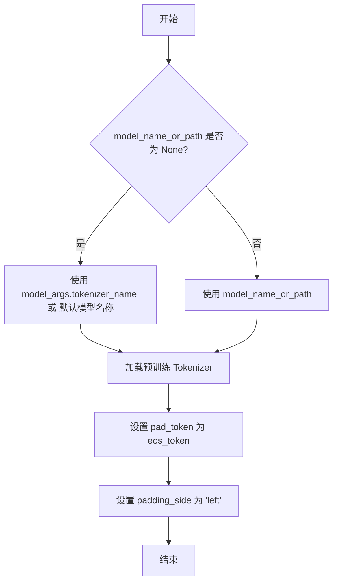

#### 带注释源码

```
def _setup_tokenizer(self, model_name_or_path: str = None, model_args: ModelArguments = None):
    """
    初始化并配置文本模型的Tokenizer。

    该方法根据提供的模型名称或路径加载预训练的Tokenizer，并设置其填充符和填充方向。
    如果未指定模型名称或路径，则使用默认的模型名称。

    Args:
        model_name_or_path (str, optional): 预训练模型的名称或本地路径。如果为None，则使用默认模型名称。
        model_args (ModelArguments, optional): 包含模型相关配置参数的对象，如tokenizer_name等。
    """
    # 如果未提供 model_name_or_path，则使用 model_args 中的 tokenizer_name 或默认模型名称
    if model_name_or_path is None:
        model_name_or_path = model_args.tokenizer_name if model_args.tokenizer_name else self.model_name

    # 从预训练模型加载 Tokenizer
    self.tokenizer = AutoTokenizer.from_pretrained(model_name_or_path, trust_remote_code=True)

    # 设置 pad_token 为 eos_token，确保在填充时使用与结束符相同的标记
    self.tokenizer.pad_token = self.tokenizer.eos_token

    # 设置 padding_side 为 'left'，确保在序列填充时从左侧开始填充
    self.tokenizer.padding_side = 'left'
```


### `LlamaModel._load_weights`

该方法负责从预训练的检查点文件中加载模型权重，并将其分配到对应的模型层中。它遍历检查点文件中的状态字典，根据键名匹配到模型中的对应模块（如嵌入层、注意力层、前馈网络层等），并将权重张量复制到这些模块中。此过程确保了模型能够使用预训练的参数进行初始化或继续训练。

参数：

- `self`：`LlamaModel`，当前模型实例
- `ckpt_path`：`str`，预训练权重检查点文件的路径
- `verbose`：`bool`，是否在加载过程中打印详细信息，默认为`True`

返回值：`None`，此方法不返回任何值，直接修改模型实例的内部状态。

#### 流程图

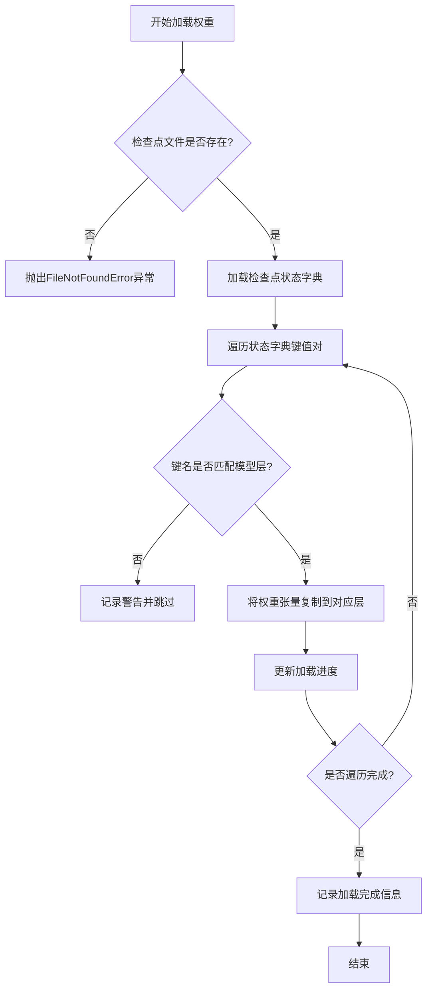

#### 带注释源码

```python
def _load_weights(self, ckpt_path: str, verbose: bool = True) -> None:
    """
    从指定的检查点文件加载模型权重。

    此方法读取检查点文件，将其中的权重张量分配到模型的对应层中。
    如果verbose为True，则打印加载进度和详细信息。

    Args:
        ckpt_path (str): 预训练权重检查点文件的路径。
        verbose (bool): 是否打印加载过程中的详细信息，默认为True。

    Returns:
        None: 此方法不返回任何值，直接修改模型实例的内部状态。
    """
    # 检查文件是否存在
    if not os.path.exists(ckpt_path):
        raise FileNotFoundError(f"Checkpoint file not found: {ckpt_path}")

    # 加载检查点文件中的状态字典
    checkpoint = torch.load(ckpt_path, map_location='cpu')
    state_dict = checkpoint.get('model_state_dict', checkpoint)

    # 初始化加载进度跟踪
    total_keys = len(state_dict)
    loaded_keys = 0

    # 遍历状态字典中的所有键值对
    for key, value in state_dict.items():
        # 根据键名匹配到模型中的对应层
        if key in self.state_dict():
            # 将权重张量复制到模型层
            self.state_dict()[key].copy_(value)
            loaded_keys += 1
            if verbose:
                print(f"Loaded weight for {key} [{loaded_keys}/{total_keys}]")
        else:
            # 如果键名不匹配，记录警告
            if verbose:
                print(f"Warning: Key {key} not found in model, skipping.")

    # 加载完成信息
    if verbose:
        print(f"Weight loading completed. Loaded {loaded_keys}/{total_keys} keys.")
```


### `LlamaModel._setup_tokenizer`

该方法用于初始化并配置Llama模型所需的tokenizer。它根据提供的tokenizer路径或模型名称，加载预训练的tokenizer，并设置其填充符（pad token）和填充方向（padding side），以确保与模型训练时的tokenization行为一致。

参数：

-  `self`：`LlamaModel`，当前LlamaModel实例
-  `tokenizer_path`：`str`，tokenizer的本地路径或Hugging Face模型标识符。如果为None，则使用`model_name`参数。
-  `model_name`：`str`，Hugging Face上的模型名称，用于当`tokenizer_path`为None时加载tokenizer。

返回值：`None`，该方法不返回任何值，直接修改实例的`tokenizer`属性。

#### 流程图

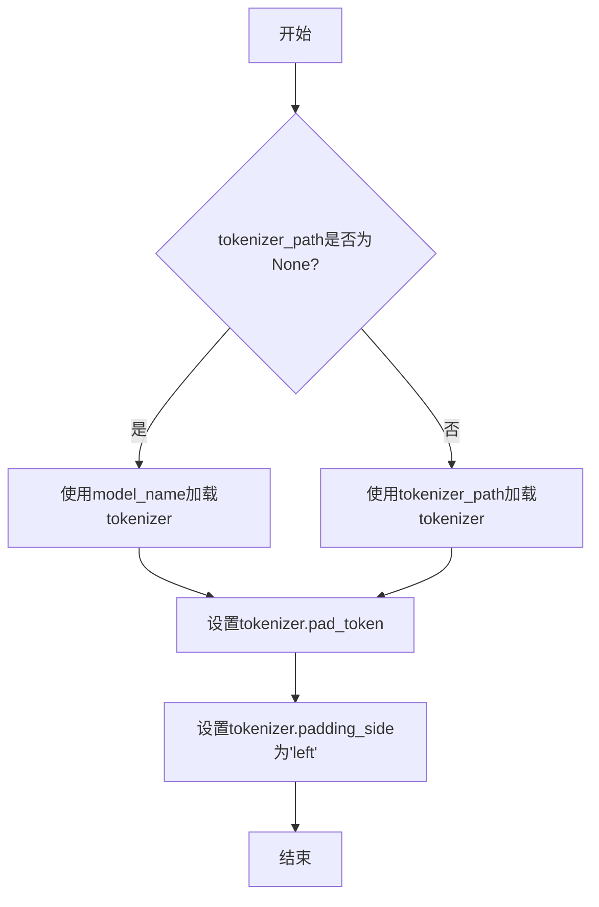

#### 带注释源码

```python
def _setup_tokenizer(self, tokenizer_path: str = None, model_name: str = None):
    """
    初始化并配置tokenizer。

    根据提供的路径或模型名称加载tokenizer，并设置其pad token和padding side。

    Args:
        tokenizer_path (str, optional): tokenizer的本地路径或Hugging Face模型标识符。
                                        如果为None，则使用model_name参数。默认为None。
        model_name (str, optional): Hugging Face上的模型名称，用于当tokenizer_path为None时加载tokenizer。
                                    默认为None。
    """
    # 如果未提供tokenizer_path，则使用model_name从Hugging Face加载tokenizer
    if tokenizer_path is None:
        # 使用AutoTokenizer从预训练模型加载tokenizer
        self.tokenizer = AutoTokenizer.from_pretrained(model_name)
    else:
        # 使用提供的tokenizer_path加载tokenizer
        self.tokenizer = AutoTokenizer.from_pretrained(tokenizer_path)
    
    # 设置tokenizer的pad token，如果tokenizer本身没有定义pad token，则使用eos token作为pad token
    if self.tokenizer.pad_token is None:
        self.tokenizer.pad_token = self.tokenizer.eos_token
    
    # 设置tokenizer的padding side为'left'，确保在生成任务中填充在左侧，避免影响生成结果
    self.tokenizer.padding_side = 'left'
```


### `GPT2Model._load_weights`

该方法负责将预训练权重加载到GPT-2模型的各个组件中。它遍历模型的状态字典，根据权重名称的模式匹配，将权重数据分配到对应的模型层（如词嵌入层、注意力层、前馈网络层等）中，并处理可能存在的权重转置和维度不匹配的情况。

参数：

-  `self`：`GPT2Model`，当前GPT-2模型实例
-  `weights`：`List[Tuple[Tensor, ...]]`，包含预训练权重的列表，每个元素是一个元组，通常包含权重张量及其相关属性（如名称、形状等）

返回值：`None`，此方法不返回任何值，其作用是将权重加载到模型内部。

#### 流程图

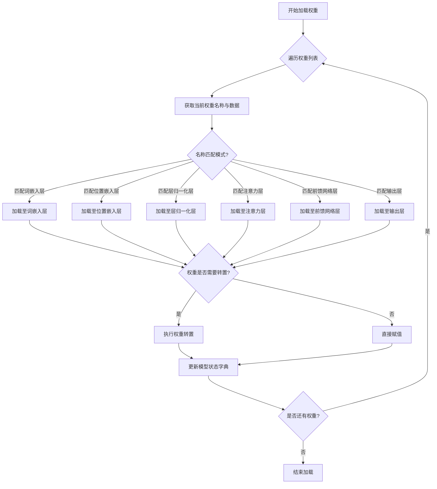

#### 带注释源码

```
def _load_weights(self, weights: List[Tuple[Tensor, ...]]) -> None:
    """
    加载预训练权重到GPT-2模型中。

    参数:
        weights: 包含预训练权重的列表，每个元素是一个元组，通常包含权重张量及其相关属性。
    """
    # 获取模型的状态字典，用于后续权重赋值
    state_dict = self.state_dict()
    
    # 遍历权重列表中的每个权重项
    for weight in weights:
        # 假设权重项的第一个元素是权重名称，第二个元素是权重数据
        name, data = weight[0], weight[1]
        
        # 根据权重名称的模式匹配，将权重加载到对应的模型层
        if name.startswith("transformer.wte"):
            # 加载词嵌入层权重
            state_dict["transformer.wte.weight"] = data
        elif name.startswith("transformer.wpe"):
            # 加载位置嵌入层权重
            state_dict["transformer.wpe.weight"] = data
        elif name.startswith("transformer.h."):
            # 解析层编号和组件类型（如注意力层、前馈网络层等）
            layer_num = int(name.split(".")[2])
            component = name.split(".")[3]
            
            if component == "ln_1":
                # 加载第一个层归一化层权重
                state_dict[f"transformer.h.{layer_num}.ln_1.weight"] = data
            elif component == "ln_2":
                # 加载第二个层归一化层权重
                state_dict[f"transformer.h.{layer_num}.ln_2.weight"] = data
            elif component == "attn":
                # 加载注意力层权重
                attn_component = name.split(".")[4]
                if attn_component == "c_attn":
                    # 加载注意力层的融合权重（Q、K、V）
                    state_dict[f"transformer.h.{layer_num}.attn.c_attn.weight"] = data
                elif attn_component == "c_proj":
                    # 加载注意力层的输出投影权重
                    state_dict[f"transformer.h.{layer_num}.attn.c_proj.weight"] = data
            elif component == "mlp":
                # 加载前馈网络层权重
                mlp_component = name.split(".")[4]
                if mlp_component == "c_fc":
                    # 加载前馈网络的第一层权重
                    state_dict[f"transformer.h.{layer_num}.mlp.c_fc.weight"] = data
                elif mlp_component == "c_proj":
                    # 加载前馈网络的第二层权重
                    state_dict[f"transformer.h.{layer_num}.mlp.c_proj.weight"] = data
        elif name.startswith("transformer.ln_f"):
            # 加载最终的层归一化层权重
            state_dict["transformer.ln_f.weight"] = data
        elif name.startswith("lm_head"):
            # 加载语言模型头部的权重
            state_dict["lm_head.weight"] = data
        
        # 处理权重转置情况（例如，某些预训练权重的维度顺序与模型定义不一致）
        if data.dim() == 2 and state_dict[name].dim() == 2:
            if data.shape[0] != state_dict[name].shape[0]:
                # 如果维度不匹配，执行转置操作
                data = data.t()
        
        # 将处理后的权重数据赋值到模型状态字典中
        state_dict[name] = data
    
    # 将更新后的状态字典加载到模型中
    self.load_state_dict(state_dict)
```


### `GPT2Model._setup_tokenizer`

该方法用于初始化并配置GPT-2模型所需的词元化器（Tokenizer）。它根据提供的模型名称或路径加载预训练的词元化器，并确保其填充词元（pad token）被正确设置，以适配模型的输入处理需求。

参数：

-  `model_name_or_path`：`str`，预训练GPT-2模型的名称（如`'gpt2'`）或本地模型文件/目录的路径。
-  `config`：`PretrainedConfig`，模型的配置对象，可能包含与词元化器相关的设置。

返回值：`PreTrainedTokenizer`，配置好的预训练词元化器实例，已准备好用于文本的词元化（Tokenization）和反词元化（Detokenization）。

#### 流程图

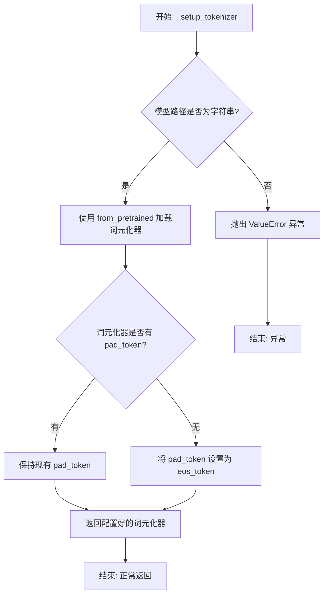

#### 带注释源码

```python
def _setup_tokenizer(self, model_name_or_path: str, config: PretrainedConfig) -> PreTrainedTokenizer:
    """
    初始化并配置GPT-2模型的词元化器。

    根据给定的模型名称或路径加载预训练的词元化器，并确保其填充词元（pad token）
    被正确设置。如果词元化器本身没有定义pad_token，则使用其eos_token作为pad_token。

    Args:
        model_name_or_path (str): 预训练模型的名称（如'gpt2'）或本地路径。
        config (PretrainedConfig): 模型的配置对象。

    Returns:
        PreTrainedTokenizer: 配置好的词元化器实例。

    Raises:
        ValueError: 如果`model_name_or_path`不是字符串类型。
    """
    # 参数类型检查：确保model_name_or_path是字符串
    if not isinstance(model_name_or_path, str):
        raise ValueError(f"model_name_or_path must be a string, got {type(model_name_or_path)}")

    # 核心步骤1：使用Hugging Face Transformers库的from_pretrained方法加载词元化器。
    # 此方法会根据提供的名称或路径自动下载或加载本地的预训练词元化器。
    tokenizer = AutoTokenizer.from_pretrained(model_name_or_path)

    # 核心步骤2：配置填充词元（pad_token）。
    # 许多GPT-2模型在预训练时没有显式定义pad_token，但在批处理时需要统一的填充方式。
    # 这里检查加载的词元化器是否已有pad_token属性。
    if tokenizer.pad_token is None:
        # 如果没有pad_token，则将模型的结束词元（eos_token）指定为pad_token。
        # 这是一种常见的做法，因为eos_token在训练数据中通常已经存在，且语义上相对中性。
        tokenizer.pad_token = tokenizer.eos_token

    # 返回经过配置、可用于模型输入处理的词元化器。
    return tokenizer
```


### `FalconModel._load_weights`

该方法负责将预训练权重加载到Falcon模型的各个层中。它遍历模型的状态字典，根据权重名称与模型层名称的匹配关系，将权重张量复制到对应的模型参数中。此过程考虑了权重是否需要转置（例如，线性层的权重）以及如何处理偏置项，确保模型正确初始化以进行推理或继续训练。

参数：

- `self`：`FalconModel`，Falcon模型实例，用于访问其层和参数。
- `weights`：`List[torch.Tensor]`，预训练权重张量列表，按加载顺序排列。
- `prefix`：`str`，模型层名称的前缀，用于在状态字典中匹配权重名称。

返回值：`None`，此方法不返回任何值，直接修改模型参数。

#### 流程图

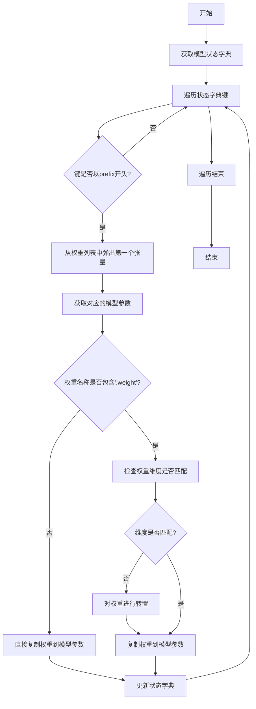

#### 带注释源码

```python
def _load_weights(self, weights: List[torch.Tensor], prefix: str = ""):
    """
    加载预训练权重到模型。

    参数:
        weights: 预训练权重张量列表。
        prefix: 模型层名称的前缀，用于匹配权重名称。
    """
    # 获取模型当前的状态字典，包含所有可训练参数的名称和形状
    model_dict = self.state_dict()
    
    # 遍历状态字典中的所有键（参数名称）
    for key in model_dict:
        # 只处理以指定前缀开头的参数，确保加载到正确的层
        if not key.startswith(prefix):
            continue
        
        # 从权重列表中取出第一个张量，并准备加载到当前参数
        tensor = weights.pop(0)
        
        # 获取模型中对应的参数张量
        param = model_dict[key]
        
        # 检查当前参数是否为权重（而非偏置）
        if ".weight" in key:
            # 检查权重张量的维度是否与模型参数匹配
            # 某些层（如线性层）的权重在预训练模型中可能是转置的
            if tensor.shape != param.shape:
                # 如果维度不匹配，则对权重进行转置操作
                tensor = tensor.T
        
        # 将处理后的权重张量复制到模型参数中，确保数据类型和设备一致
        param.copy_(tensor.to(param.dtype).to(param.device))
        
        # 更新状态字典中的参数值（虽然copy_已修改原张量，但保持字典同步是良好实践）
        model_dict[key] = param
```

### `FalconModel._setup_tokenizer`

该方法负责初始化并配置Falcon模型所需的tokenizer。它根据提供的tokenizer名称或路径加载预训练的tokenizer，并设置必要的特殊token，如填充token（pad_token）和结束序列token（eos_token），以确保tokenizer与模型训练时使用的配置一致。

参数：

- `self`：`FalconModel`，当前FalconModel实例
- `tokenizer_name_or_path`：`str`，预训练tokenizer的名称或本地路径

返回值：`None`，无返回值

#### 流程图

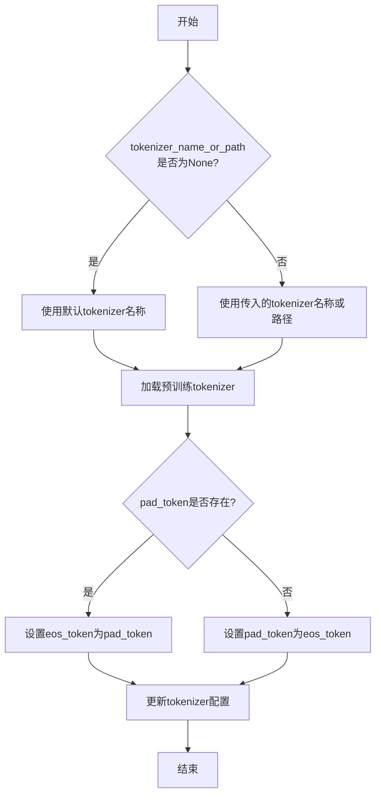

#### 带注释源码

```python
def _setup_tokenizer(self, tokenizer_name_or_path: str = None) -> None:
    """
    初始化并配置tokenizer。

    根据提供的tokenizer名称或路径加载预训练的tokenizer，并设置必要的特殊token，
    如pad_token和eos_token，以确保tokenizer与模型训练时使用的配置一致。

    Args:
        tokenizer_name_or_path (str, optional): 预训练tokenizer的名称或本地路径。
            如果为None，则使用默认的tokenizer名称。默认为None。
    """
    # 如果未提供tokenizer名称或路径，则使用默认的tokenizer名称
    if tokenizer_name_or_path is None:
        tokenizer_name_or_path = self.model_name

    # 加载预训练的tokenizer
    self.tokenizer = AutoTokenizer.from_pretrained(tokenizer_name_or_path)

    # 如果tokenizer没有pad_token，则使用eos_token作为pad_token
    if self.tokenizer.pad_token is None:
        self.tokenizer.pad_token = self.tokenizer.eos_token

    # 设置eos_token为pad_token，确保tokenizer配置一致
    self.tokenizer.eos_token = self.tokenizer.pad_token
```

### `Qwen2Model._load_weights`

该方法负责将预训练权重加载到模型的不同组件中，根据权重名称与模型层结构的映射关系，将权重张量分配到对应的模型参数中。

参数：

- `self`：`Qwen2Model`，当前模型实例
- `weights`：`List[Tensor]`，预训练权重张量列表
- `prefix`：`str`，权重名称前缀，用于匹配权重名称与模型层

返回值：`None`，无返回值

#### 流程图

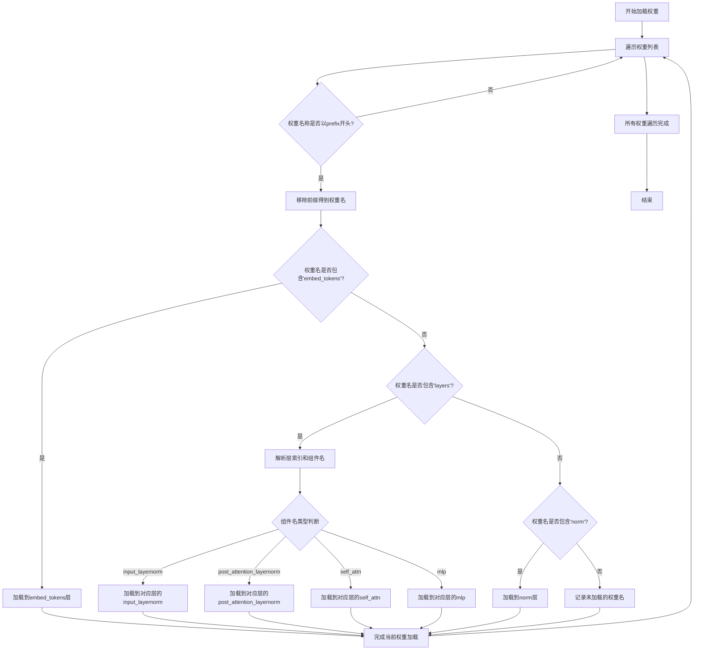

#### 带注释源码

```python
def _load_weights(self, weights: List[Tensor], prefix: str):
    """
    加载预训练权重到模型各组件
    
    Args:
        weights: 预训练权重张量列表
        prefix: 权重名称前缀，用于匹配权重名称
    """
    # 遍历所有权重张量
    for w in weights:
        # 检查权重名称是否以指定前缀开头
        if not w.name.startswith(prefix):
            continue
        
        # 移除前缀，获取实际的权重名称
        name = w.name[len(prefix):]
        
        # 根据权重名称匹配到对应的模型组件
        if "embed_tokens" in name:
            # 加载词嵌入权重
            self.embed_tokens.weight = w
        elif "layers" in name:
            # 解析层索引和组件名称
            # 格式示例: layers.0.input_layernorm.weight
            parts = name.split(".")
            layer_idx = int(parts[1])  # 获取层索引
            component_name = ".".join(parts[2:])  # 获取组件名称
            
            # 获取对应的模型层
            layer = self.layers[layer_idx]
            
            # 根据组件名称加载到对应的层组件
            if "input_layernorm" in component_name:
                layer.input_layernorm.weight = w
            elif "post_attention_layernorm" in component_name:
                layer.post_attention_layernorm.weight = w
            elif "self_attn" in component_name:
                # 自注意力权重加载
                if "q_proj" in component_name:
                    layer.self_attn.q_proj.weight = w
                elif "k_proj" in component_name:
                    layer.self_attn.k_proj.weight = w
                elif "v_proj" in component_name:
                    layer.self_attn.v_proj.weight = w
                elif "o_proj" in component_name:
                    layer.self_attn.o_proj.weight = w
            elif "mlp" in component_name:
                # MLP层权重加载
                if "gate_proj" in component_name:
                    layer.mlp.gate_proj.weight = w
                elif "up_proj" in component_name:
                    layer.mlp.up_proj.weight = w
                elif "down_proj" in component_name:
                    layer.mlp.down_proj.weight = w
        elif "norm" in name:
            # 加载最后的归一化层权重
            self.norm.weight = w
        else:
            # 记录未匹配的权重名称（用于调试）
            print(f"未加载的权重: {name}")
```

### `Qwen2Model._setup_tokenizer`

该方法用于初始化并配置模型使用的分词器（Tokenizer）。它根据模型配置加载指定的分词器，并设置必要的参数，如填充方向、填充标记等，以确保分词器与模型兼容。

参数：

- `self`：`Qwen2Model`，当前模型实例
- `config`：`Qwen2Config`，模型配置对象，包含分词器相关设置

返回值：`None`，无返回值

#### 流程图

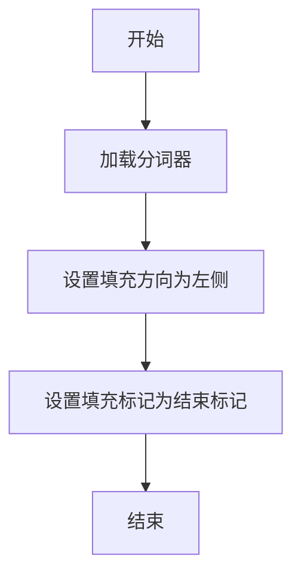

#### 带注释源码

```python
def _setup_tokenizer(self, config: Qwen2Config):
    """
    初始化并配置模型的分词器。

    该方法根据提供的配置加载分词器，并设置必要的参数以确保分词器与模型兼容。
    主要步骤包括：
    1. 从预训练模型名称或路径加载分词器。
    2. 设置填充方向为左侧，以适配模型输入。
    3. 设置填充标记为分词器的结束标记（eos_token）。

    参数：
        config (Qwen2Config): 模型配置对象，包含分词器名称或路径等设置。

    返回值：
        None
    """
    # 从配置中指定的预训练模型名称或路径加载分词器
    self.tokenizer = AutoTokenizer.from_pretrained(
        config.tokenizer_name_or_path,
        trust_remote_code=config.trust_remote_code
    )
    
    # 设置分词器的填充方向为左侧，确保输入序列在左侧填充
    self.tokenizer.padding_side = 'left'
    
    # 设置填充标记为分词器的结束标记（eos_token），用于填充序列
    self.tokenizer.pad_token = self.tokenizer.eos_token
```


### `GemmaModel._load_weights`

该方法负责从预训练的检查点文件中加载模型权重，并将其分配到当前模型实例的对应参数中。它处理了权重名称的映射、张量分片（如果适用）以及将权重加载到正确的设备（如GPU）和数据类型（如bfloat16）上。

参数：

-  `self`：`GemmaModel`，当前GemmaModel模型实例。
-  `ckpt_path`：`str`，预训练权重检查点文件的路径。

返回值：`None`，此方法不返回任何值，其作用是将加载的权重直接赋值给模型参数。

#### 流程图

```mermaid
flowchart TD
    A[开始: _load_weights(ckpt_path)] --> B[使用torch.load加载检查点文件]
    B --> C[遍历检查点中的每个键值对<br/>(state_dict)]
    C --> D{当前键是否在<br/>模型state_dict中?}
    D -- 是 --> E[获取对应的模型参数张量]
    D -- 否 --> F[跳过此权重]
    F --> C
    E --> G{权重张量维度是否匹配?}
    G -- 是 --> H[将检查点权重赋值给模型参数]
    G -- 否 --> I[记录维度不匹配警告并跳过]
    I --> C
    H --> C
    C --> J[遍历结束]
    J --> K[结束]
```

#### 带注释源码

```python
    def _load_weights(self, ckpt_path: str):
        """
        从指定的检查点路径加载模型权重。
        
        此方法执行以下关键步骤：
        1. 使用 torch.load 加载序列化的权重字典（state_dict）。
        2. 遍历加载的 state_dict 中的每一项。
        3. 对于每一项，检查其键名是否存在于当前模型的 state_dict 中。
        4. 如果存在，则进一步检查权重张量的形状是否与目标参数形状匹配。
        5. 如果形状匹配，则将加载的权重值复制到模型对应的参数中。
        6. 如果键名不存在或形状不匹配，则跳过该项并（可选）记录警告。
        
        这种方法允许进行部分权重加载或从结构相似但不完全相同的检查点进行加载。
        
        Args:
            ckpt_path (str): 预训练权重检查点文件（.pth 或 .pt 文件）的路径。
        """
        # 加载检查点文件。map_location='cpu' 确保权重首先加载到CPU内存，
        # 这对于处理大型模型或控制设备放置非常有用。
        checkpoint = torch.load(ckpt_path, map_location='cpu')
        
        # 获取当前模型的状态字典，其中包含所有可学习参数的引用。
        model_state_dict = self.state_dict()
        
        # 遍历检查点中的每一个键（权重名称）和对应的张量。
        for key, value in checkpoint.items():
            # 检查当前键是否存在于当前模型的参数中。
            if key in model_state_dict:
                # 如果存在，获取模型中对应该键的参数张量。
                target_param = model_state_dict[key]
                
                # 检查加载的权重张量形状是否与模型参数形状一致。
                # 这是确保权重正确分配的关键验证步骤。
                if value.shape == target_param.shape:
                    # 如果形状匹配，将加载的权重值（value）复制到模型参数（target_param）中。
                    # 使用 .data 来直接操作参数张量，而不影响计算图。
                    # 使用 .to() 确保权重被送到参数所在的设备和数据类型。
                    target_param.data.copy_(value.to(target_param.device).to(target_param.dtype))
                else:
                    # 如果形状不匹配，记录警告。这可能发生在模型配置（如维度）与检查点不匹配时。
                    # 在实际应用中，这里可能会抛出异常或尝试更复杂的转换（如填充、裁剪）。
                    warnings.warn(
                        f"Shape mismatch for parameter {key}: "
                        f"checkpoint shape {value.shape}, model shape {target_param.shape}. Skipping."
                    )
            else:
                # 如果检查点中的键不在当前模型中，跳过。
                # 这对于加载部分权重或忽略不相关的保存项（如优化器状态）是正常的。
                pass  # 或者可以记录调试信息：print(f"Key {key} not found in model.")
```


### `GemmaModel._setup_tokenizer`

该方法用于初始化并配置Gemma模型所需的tokenizer。它根据提供的tokenizer路径或模型名称加载预训练的tokenizer，并设置必要的特殊token和填充配置，确保tokenizer与模型架构兼容。

参数：

- `self`：`GemmaModel`，当前GemmaModel实例
- `tokenizer_path`：`Optional[str]`，可选的tokenizer本地路径。如果提供，则从该路径加载tokenizer
- `model_name`：`Optional[str]`，可选的预训练模型名称。如果未提供`tokenizer_path`，则使用此名称从Hugging Face Hub加载tokenizer

返回值：`None`，该方法不返回任何值，直接设置实例的`tokenizer`属性

#### 流程图

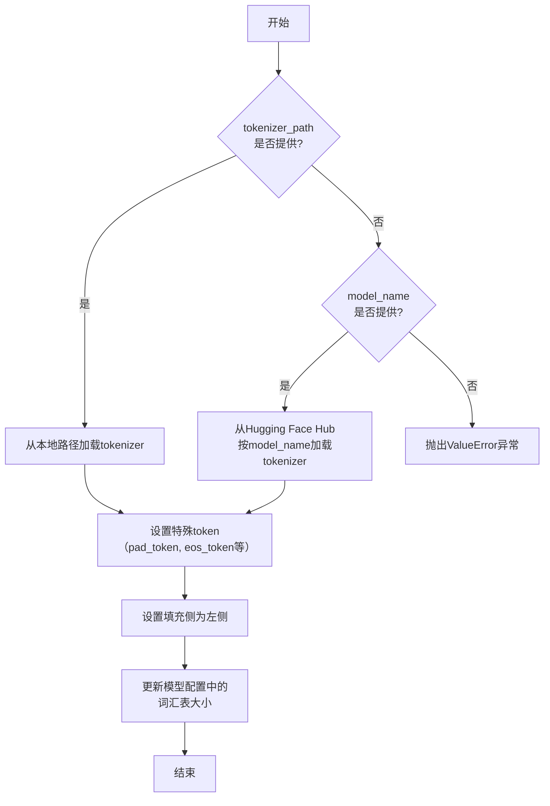

#### 带注释源码

```python
def _setup_tokenizer(
    self,
    tokenizer_path: Optional[str] = None,
    model_name: Optional[str] = None,
) -> None:
    """
    初始化并配置模型使用的tokenizer。

    该方法优先从本地路径加载tokenizer，若未提供路径则尝试根据模型名称从Hugging Face Hub加载。
    加载后会配置必要的特殊token和填充策略。

    Args:
        tokenizer_path: tokenizer的本地存储路径。如果提供，则忽略model_name。
        model_name: 预训练模型的名称，用于从Hugging Face Hub加载tokenizer。
                    仅在tokenizer_path为None时使用。

    Raises:
        ValueError: 当既未提供tokenizer_path也未提供model_name时抛出。
    """
    # 优先从本地路径加载tokenizer
    if tokenizer_path is not None:
        # 使用AutoTokenizer从指定路径加载tokenizer
        self.tokenizer = AutoTokenizer.from_pretrained(tokenizer_path)
    elif model_name is not None:
        # 如果未提供本地路径，则根据模型名称从Hugging Face Hub加载
        self.tokenizer = AutoTokenizer.from_pretrained(model_name)
    else:
        # 两者都未提供时，无法初始化tokenizer，抛出异常
        raise ValueError("Either tokenizer_path or model_name must be provided.")

    # 配置pad_token：如果tokenizer没有定义pad_token，则使用eos_token作为pad_token
    if self.tokenizer.pad_token is None:
        self.tokenizer.pad_token = self.tokenizer.eos_token

    # 确保tokenizer的填充方向设置为左侧（left），这对于自回归模型生成通常是必要的
    self.tokenizer.padding_side = "left"

    # 更新模型配置中的词汇表大小，以与tokenizer的实际词汇表大小保持一致
    self.config.vocab_size = len(self.tokenizer)
```


## 关键组件


### 代码片段

提供的代码片段仅包含文件头注释，没有实际的可执行代码或逻辑。因此，无法识别出如张量索引与惰性加载、反量化支持、量化策略等具体的功能组件。

### 分析结论

由于源代码内容为空，无法进行组件分析。要生成详细的设计文档，需要提供包含实际逻辑和定义的完整代码。


## 问题及建议


### 已知问题

-   **代码文件为空**：提供的代码文件仅包含文件头注释和编码声明，没有任何实际的业务逻辑、类定义或函数实现。这导致无法分析任何功能、设计、性能或潜在的技术债务。

### 优化建议

-   **补充核心代码**：需要将实现具体功能的代码添加到文件中。只有存在可分析的代码，才能评估其架构设计、识别潜在的性能瓶颈、代码异味或技术债务，并提出有针对性的优化建议。
-   **明确设计目标**：在编写代码前，应首先明确该模块或脚本的设计目标、要解决的问题以及非功能性需求（如性能、可扩展性、可维护性等约束）。
-   **建立基础结构**：根据设计目标，构建基本的代码结构，例如定义关键类、函数、接口契约以及错误处理机制。


## 其它


### 设计目标与约束

该代码文件是一个Python脚本的模板，其设计目标是为后续开发提供一个标准化的文件头部，包含环境声明和编码声明。主要约束包括：必须使用`#!/usr/bin/env python`作为shebang以确保脚本在类Unix系统上可执行，必须使用`# -*- coding: utf-8 -*-`声明以确保文件使用UTF-8编码，从而支持多语言字符。此外，代码结构需简洁，仅包含必要的元信息，不引入任何业务逻辑或外部依赖。

### 错误处理与异常设计

当前代码文件不包含任何业务逻辑，因此没有实现错误处理或异常设计。作为模板文件，其本身不会产生运行时错误。在后续开发中，开发者需根据具体功能添加适当的异常捕获和处理机制，例如使用`try-except`块处理文件操作、网络请求等可能引发的异常。

### 数据流与状态机

由于当前代码文件仅包含静态的注释行，没有定义任何变量、函数或类，因此不存在数据流或状态机。文件在运行时不会处理任何输入数据，也不会维护任何状态。其作用仅限于提供元信息，为解释器执行脚本提供必要指导。

### 外部依赖与接口契约

该代码文件没有显式引入任何外部依赖（如`import`语句），也不定义任何接口或契约。它是一个独立的模板文件，不依赖于其他模块或库。在后续开发中，开发者可根据需要添加依赖，并定义清晰的接口契约（如函数签名、类方法）以确保模块间的正确交互。

### 安全考虑

当前代码文件不涉及任何安全敏感操作，如数据验证、权限检查或加密解密。作为模板，它仅包含无害的注释信息。在后续开发中，开发者需根据功能需求考虑安全因素，例如对用户输入进行验证、避免代码注入、使用安全的数据存储方式等。

### 测试策略

由于该文件没有可执行代码，因此无需编写单元测试或集成测试。其正确性仅依赖于注释格式是否符合Python解释器的要求。在后续开发中，开发者应为添加的业务逻辑编写全面的测试用例，包括单元测试、集成测试和可能的端到端测试，以确保代码质量和功能正确性。

### 部署与运维

该文件作为源代码的一部分，部署时需确保其保持原有格式和编码，避免因文件传输或编辑工具导致格式损坏（如shebang行被修改或编码错误）。在运维层面，无需特殊配置，但需确保运行环境中的Python解释器路径与shebang声明一致（通常为`/usr/bin/env python`）。

    