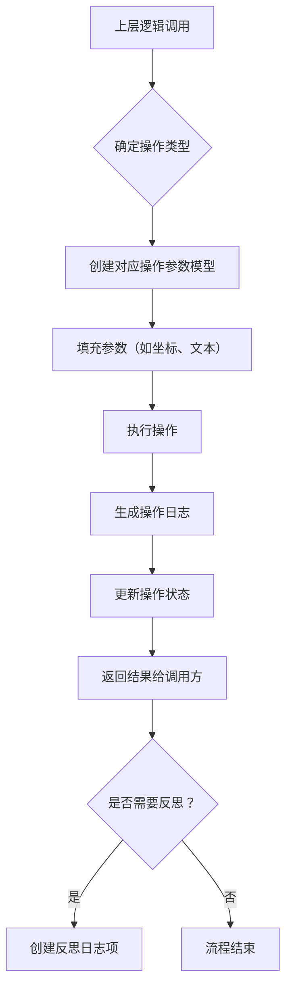
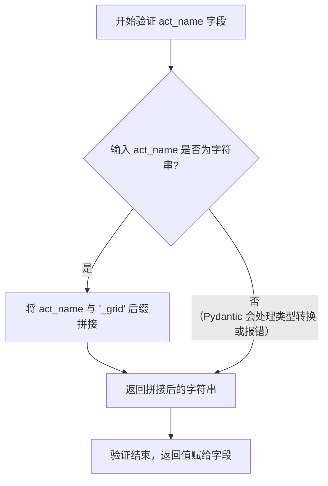

# `.\MetaGPT\metagpt\ext\android_assistant\utils\schema.py` 详细设计文档

该代码定义了一个用于移动端（Android）UI自动化测试或交互任务的核心数据模型和枚举。它通过Pydantic模型定义了UI元素、各种操作（如点击、滑动、输入文本）及其参数、操作日志记录项以及任务执行状态。代码的核心是提供一套类型安全、结构化的数据契约，用于描述UI交互动作、记录执行过程并反馈结果状态，为上层自动化逻辑提供数据基础。

## 整体流程



## 类结构

```
Enum 类型
├── ActionOp (操作类型枚举)
├── SwipeOp (滑动方向枚举)
├── Decision (决策结果枚举)
└── RunState (运行状态枚举)

Pydantic BaseModel 类型
├── AndroidElement (UI元素)
├── OpLogItem (操作日志项)
├── ReflectLogItem (反思日志项)
├── RecordLogItem (记录日志项)
├── DocContent (文档内容)
├── BaseOpParam (操作参数基类)
│   ├── TapOpParam (点击操作参数)
│   ├── TextOpParam (文本输入操作参数)
│   ├── LongPressOpParam (长按操作参数)
│   ├── SwipeOpParam (滑动操作参数)
│   ├── GridOpParam (网格操作参数)
│   └── BaseGridOpParam (网格操作参数基类)
│       ├── TapGridOpParam (网格点击参数)
│       ├── LongPressGridOpParam (网格长按参数)
│       └── SwipeGridOpParam (网格滑动参数)
├── ReflectOp (反思操作结果)
└── AndroidActionOutput (动作执行输出)
```

## 全局变量及字段


### `AndroidElement.uid`
    
UI元素的唯一标识符

类型：`str`
    


### `AndroidElement.bbox`
    
UI元素的边界框坐标，格式为((左上x, 左上y), (右下x, 右下y))

类型：`tuple[tuple[int, int], tuple[int, int]]`
    


### `AndroidElement.attrib`
    
UI元素的属性描述字符串

类型：`str`
    


### `OpLogItem.step`
    
操作步骤的序号

类型：`int`
    


### `OpLogItem.prompt`
    
触发操作的提示文本

类型：`str`
    


### `OpLogItem.image`
    
操作执行前的屏幕截图路径或标识

类型：`str`
    


### `OpLogItem.response`
    
操作执行后的响应文本

类型：`str`
    


### `ReflectLogItem.step`
    
反思步骤的序号

类型：`int`
    


### `ReflectLogItem.prompt`
    
触发反思的提示文本

类型：`str`
    


### `ReflectLogItem.image_before`
    
反思操作执行前的屏幕截图路径或标识

类型：`str`
    


### `ReflectLogItem.image_after`
    
反思操作执行后的屏幕截图路径或标识

类型：`str`
    


### `ReflectLogItem.response`
    
反思操作执行后的响应文本

类型：`str`
    


### `RecordLogItem.step`
    
记录解析步骤的序号

类型：`int`
    


### `RecordLogItem.prompt`
    
触发记录解析的提示文本

类型：`str`
    


### `RecordLogItem.image_before`
    
记录解析操作执行前的屏幕截图路径或标识

类型：`str`
    


### `RecordLogItem.image_after`
    
记录解析操作执行后的屏幕截图路径或标识

类型：`str`
    


### `RecordLogItem.response`
    
记录解析操作执行后的响应文本

类型：`str`
    


### `DocContent.tap`
    
点击操作的文档内容

类型：`str`
    


### `DocContent.text`
    
文本输入操作的文档内容

类型：`str`
    


### `DocContent.v_swipe`
    
垂直滑动操作的文档内容

类型：`str`
    


### `DocContent.h_swipe`
    
水平滑动操作的文档内容

类型：`str`
    


### `DocContent.long_press`
    
长按操作的文档内容

类型：`str`
    


### `BaseOpParam.act_name`
    
操作名称

类型：`str`
    


### `BaseOpParam.last_act`
    
上一个操作名称

类型：`str`
    


### `BaseOpParam.param_state`
    
参数提取的状态

类型：`RunState`
    


### `TapOpParam.area`
    
点击操作的目标区域标识

类型：`int`
    


### `TextOpParam.input_str`
    
文本输入操作要输入的字符串

类型：`str`
    


### `LongPressOpParam.area`
    
长按操作的目标区域标识

类型：`int`
    


### `SwipeOpParam.area`
    
滑动操作的起始区域标识

类型：`int`
    


### `SwipeOpParam.swipe_orient`
    
滑动操作的方向

类型：`str`
    


### `SwipeOpParam.dist`
    
滑动操作的距离描述

类型：`str`
    


### `GridOpParam.act_name`
    
网格操作的操作名称

类型：`str`
    


### `BaseGridOpParam.act_name`
    
网格操作的操作名称，通过验证器自动添加'_grid'后缀

类型：`str`
    


### `TapGridOpParam.area`
    
网格点击操作的目标区域标识

类型：`int`
    


### `TapGridOpParam.subarea`
    
网格点击操作的目标子区域标识

类型：`str`
    


### `LongPressGridOpParam.area`
    
网格长按操作的目标区域标识

类型：`int`
    


### `LongPressGridOpParam.subarea`
    
网格长按操作的目标子区域标识

类型：`str`
    


### `SwipeGridOpParam.start_area`
    
网格滑动操作的起始区域标识

类型：`int`
    


### `SwipeGridOpParam.start_subarea`
    
网格滑动操作的起始子区域标识

类型：`str`
    


### `SwipeGridOpParam.end_area`
    
网格滑动操作的结束区域标识

类型：`int`
    


### `SwipeGridOpParam.end_subarea`
    
网格滑动操作的结束子区域标识

类型：`str`
    


### `ReflectOp.decision`
    
反思操作的决定

类型：`str`
    


### `ReflectOp.thought`
    
反思操作的思考过程

类型：`str`
    


### `ReflectOp.documentation`
    
反思操作的文档记录

类型：`str`
    


### `ReflectOp.param_state`
    
反思操作的参数提取状态

类型：`RunState`
    


### `AndroidActionOutput.data`
    
Android操作输出的数据字典

类型：`dict`
    


### `AndroidActionOutput.action_state`
    
Android操作的整体执行状态

类型：`RunState`
    
    

## 全局函数及方法


### `BaseGridOpParam.check_act_name`

这是一个Pydantic模型字段验证器，用于在数据赋值给`act_name`字段之前对其进行预处理。它的核心功能是确保所有继承自`BaseGridOpParam`的操作参数类，其`act_name`字段的值都带有“_grid”后缀，从而在语义上标识这是一个基于网格（Grid）的操作。

参数：

-  `cls`：`type[BaseGridOpParam]`，验证器所属的类（`BaseGridOpParam`或其子类）
-  `act_name`：`str`，待验证和处理的原始动作名称字符串

返回值：`str`，处理后的动作名称字符串，即在原始名称后附加了“_grid”后缀

#### 流程图



#### 带注释源码

```python
    @field_validator("act_name", mode="before")  # 装饰器：声明这是一个针对“act_name”字段的验证器，`mode="before"`表示在校验（如类型检查）之前运行
    @classmethod                                # 装饰器：声明这是一个类方法，第一个参数是类本身（cls）
    def check_act_name(cls, act_name: str) -> str:  # 方法定义：接收原始值`act_name`，返回处理后的字符串
        return f"{act_name}_grid"               # 核心逻辑：在输入的`act_name`字符串后添加“_grid”后缀并返回
```


## 关键组件


### ActionOp 枚举

定义了移动设备UI自动化操作的基本动作类型，如点击、长按、输入文本、滑动等。

### SwipeOp 枚举

定义了滑动操作的具体方向，如上、下、左、右。

### Decision 枚举

定义了任务执行过程中的决策状态，如返回、无效、继续、成功。

### AndroidElement 数据模型

定义了从移动设备UI中提取出的单个UI元素的数据结构，包含唯一标识符、边界框和属性。

### 操作日志数据模型 (OpLogItem, ReflectLogItem, RecordLogItem)

定义了用于记录任务执行、自我学习反思等不同场景下的日志条目数据结构。

### DocContent 数据模型

定义了用于记录不同操作类型（如点击、输入、滑动）的文档内容的数据结构。

### RunState 枚举

定义了操作或参数提取过程的执行结果状态，如成功、完成、失败。

### 操作参数基类与派生类 (BaseOpParam 及其子类)

定义了执行各类UI操作（如Tap, Text, LongPress, Swipe, Grid）所需的参数数据结构，并支持参数提取状态跟踪。

### ReflectOp 数据模型

定义了自我学习反思环节的输出数据结构，包含决策、思考、文档记录和参数状态。

### AndroidActionOutput 数据模型

定义了Android自动化操作的最终输出数据结构，包含操作数据和整体动作执行状态。


## 问题及建议


### 已知问题

-   **`SwipeOp` 枚举类命名与 `SwipeOpParam` 类名冲突**：`SwipeOp` 枚举定义了滑动方向（如 UP, DOWN），而 `SwipeOpParam` 类用于表示滑动操作的参数。两者名称相似但用途不同，容易在代码中引起混淆。
-   **`AndroidElement.bbox` 字段的默认值类型不匹配**：`bbox` 字段被声明为 `tuple[tuple[int, int], tuple[int, int]]` 类型，但其默认值被设置为空字典 `{}`。这违反了类型注解，可能导致运行时错误或类型检查工具（如 mypy）报错。
-   **`BaseGridOpParam` 类的 `check_act_name` 验证器逻辑可能不完整**：该验证器旨在为 `act_name` 添加 `"_grid"` 后缀。然而，如果 `act_name` 本身已经以 `"_grid"` 结尾，或者传入的值不是字符串类型，该逻辑可能导致重复后缀或异常。
-   **`ReflectOp` 类的字段缺少类型注解和默认值定义**：`decision`、`thought`、`documentation` 字段仅用空字符串初始化，未使用 Pydantic 的 `Field` 进行类型和默认值的正式声明，这削弱了 Pydantic 模型的类型检查和序列化/反序列化能力。
-   **`AndroidActionOutput.data` 字段类型过于宽泛**：`data` 字段被定义为 `dict` 类型，未指定键和值的具体类型。这使得数据结构不明确，降低了代码的可读性和可维护性，并可能隐藏潜在的类型错误。

### 优化建议

-   **重命名 `SwipeOp` 枚举**：建议将 `SwipeOp` 枚举重命名为更具描述性的名称，如 `SwipeDirection`，以明确其表示滑动方向，避免与 `SwipeOpParam` 类名冲突。
-   **修正 `AndroidElement.bbox` 的默认值**：将 `bbox` 字段的默认值改为一个合法的空元组结构，例如 `((0, 0), (0, 0))` 或使用 `Field(default_factory=lambda: ((0,0),(0,0)))`，以确保类型一致性。
-   **增强 `BaseGridOpParam.check_act_name` 验证器的健壮性**：在验证器中添加逻辑，检查 `act_name` 是否已以 `"_grid"` 结尾，避免重复添加。同时，确保对输入进行适当的类型检查和异常处理。
-   **为 `ReflectOp` 类字段添加正式的类型注解**：使用 `Field` 为 `decision`、`thought`、`documentation` 等字段明确定义类型（如 `str`）和默认值（如 `""`），以充分利用 Pydantic 的特性。
-   **为 `AndroidActionOutput.data` 字段指定更具体的类型**：根据实际使用场景，使用 `TypedDict` 或 Pydantic 的模型来定义 `data` 字段的结构，例如 `data: Dict[str, Any]` 或创建一个具体的 `ActionData` 模型。这能提高代码的清晰度和类型安全性。
-   **考虑使用 `Literal` 类型替代部分字符串枚举**：对于 `ReflectOp.decision` 这类字段，如果其取值来源于一个固定的集合（如 `Decision` 枚举的值），可以考虑使用 `typing.Literal` 进行更精确的类型约束。
-   **统一日志模型**：`OpLogItem`、`ReflectLogItem` 和 `RecordLogItem` 结构高度相似，`ReflectLogItem` 和 `RecordLogItem` 完全相同。可以考虑创建一个基类 `BaseLogItem` 包含公共字段，然后通过继承来定义特定日志类型，以减少代码重复。


## 其它


### 设计目标与约束

本模块旨在为Android UI自动化任务提供一个结构化的动作定义与参数管理框架。其核心设计目标包括：
1.  **类型安全与数据验证**：利用Pydantic模型定义所有动作参数，确保输入数据的类型正确性，并通过字段验证器进行业务逻辑校验。
2.  **可扩展性**：通过基类（如`BaseOpParam`）和继承体系（如`TapOpParam`、`SwipeOpParam`）设计，支持未来轻松添加新的动作类型及其专属参数。
3.  **状态追踪**：通过`RunState`枚举和`param_state`字段，标准化地追踪动作参数提取及后续执行的成败状态。
4.  **日志结构化**：定义`OpLogItem`、`ReflectLogItem`等日志模型，为任务执行、自我学习、反思等不同场景提供标准化的日志记录格式，便于后续分析与调试。
5.  **代码清晰与自描述**：使用枚举（如`ActionOp`, `SwipeOp`, `Decision`）明确限定操作和决策的范围，增强代码可读性并减少错误。

主要约束包括：
1.  依赖Pydantic库进行数据建模与验证。
2.  动作参数模型主要服务于参数解析与传递，不包含具体的UI交互逻辑实现。
3.  日志模型中的`image`、`image_before`等字段预期存储为Base64字符串或文件路径，具体存储方式由使用方决定。

### 错误处理与异常设计

本模块未显式定义自定义异常类，其错误处理机制主要内建于Pydantic模型和枚举中：
1.  **数据验证错误**：当传入的数据不符合`BaseModel`字段类型定义或`field_validator`的校验规则时，Pydantic会抛出`ValidationError`异常。例如，为`SwipeOpParam.swipe_orient`字段传入非`SwipeOp`枚举值的字符串。
2.  **状态标识**：通过`RunState`枚举和`BaseOpParam.param_state`字段，以返回状态值（`SUCCESS`, `FAIL`）而非抛出异常的方式来标识参数提取过程的成功与失败。这是一种更适用于流程控制的错误处理方式。
3.  **枚举值安全**：使用`Enum`类定义`ActionOp`、`Decision`等，确保相关变量只能取预定义的值，避免了无效字符串的使用，从源头减少了错误。
4.  **默认值**：模型字段大多设置了合理的默认值（如空字符串、-1、空字典），这有助于避免因字段缺失导致的处理错误，但使用方需注意区分默认值与有效值。

### 数据流与状态机

本模块定义了多个数据模型，它们在不同场景下构成特定的数据流：
1.  **动作执行流**：
    *   **输入**：原始指令或LLM响应（字符串）。
    *   **解析**：根据`ActionOp`类型，选择对应的`*OpParam`模型（如`TapOpParam`）进行参数解析与填充。`param_state`记录解析状态。
    *   **输出**：填充好的参数模型实例，传递给具体的执行器（代码中未体现）来操作Android UI。
    *   **反馈**：执行结果（成功/失败）可能通过`AndroidActionOutput.action_state`或更新`RunState`来反馈。
2.  **学习与反思流**：
    *   **记录**：任务执行过程中，使用`OpLogItem`记录每一步的提示词、屏幕截图、LLM响应。
    *   **分析**：在反思阶段，使用`ReflectLogItem`记录动作前后的屏幕状态、反思提示及LLM的决策与分析。
    *   **文档化**：反思结果中的`documentation`字段可被提取并结构化到`DocContent`模型中，用于积累知识。
3.  **状态转换**：`RunState`构成了一个简单的状态机，用于标识单次操作（如参数提取）的结果。`Decision`枚举则用于更高层次的流程控制决策（如继续、回退、成功）。它们共同支撑起任务执行引擎的状态管理。

### 外部依赖与接口契约

1.  **外部依赖**：
    *   **Pydantic (>=2.0)**：核心依赖，用于所有数据模型的定义、序列化、反序列化及数据验证。
    *   **Python 标准库 (enum)**：用于定义枚举类型。
2.  **接口契约（导出模型）**：
    *   **动作定义**：`ActionOp`, `SwipeOp` 枚举。调用方需根据这些枚举值来指定操作类型。
    *   **参数模型**：所有继承自`BaseOpParam`的类（如`TapOpParam`, `SwipeGridOpParam`）。它们是调用方向执行器传递参数的标准数据结构。
    *   **决策与状态**：`Decision`, `RunState` 枚举。用于模块间传递控制决策和状态信息。
    *   **UI元素**：`AndroidElement` 模型。定义了与UI自动化框架交互时，UI元素的标准化表示格式。
    *   **日志模型**：`OpLogItem`, `ReflectLogItem`, `RecordLogItem`。规定了不同日志场景下应记录的数据格式。
    *   **输出容器**：`AndroidActionOutput`。作为动作执行结果的标准化容器。
    *   **反思结果**：`ReflectOp`。标准化了反思步骤的输出格式。
    *   **文档内容**：`DocContent`。提供了存储累积的操作文档的结构。
    *   使用方应通过实例化这些模型类并填充相应字段来与本模块交互，并遵守其字段类型和验证规则。


    