# `.\MetaGPT\metagpt\ext\android_assistant\utils\utils.py` 详细设计文档

该代码是MetaGPT项目中Android助手模块的UI解析工具，主要功能包括：1) 从Android UI XML布局文件中解析可交互元素（clickable/focusable），生成元素列表；2) 在屏幕截图上绘制元素边界框或网格，用于可视化标注；3) 解析自然语言指令（如'tap(1)'），将其转换为结构化操作参数（如TapOpParam），支持网格和非网格两种交互模式。

## 整体流程

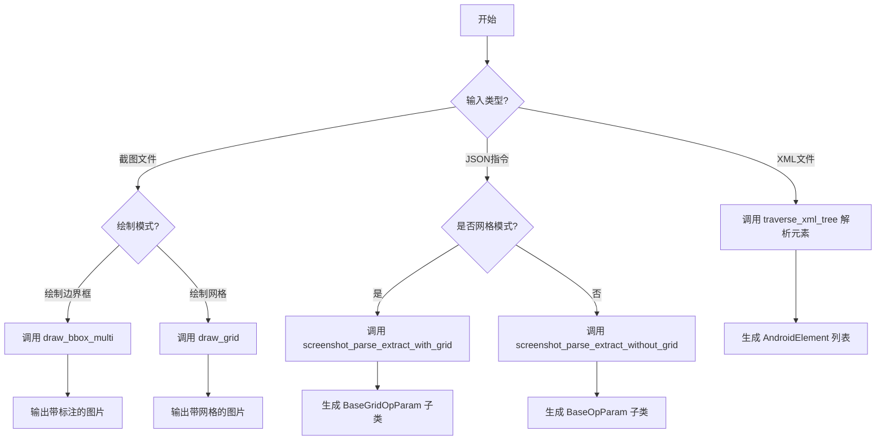

## 类结构

```
AndroidElement (数据类)
BaseOpParam (操作参数基类)
├── TapOpParam
├── TextOpParam
├── LongPressOpParam
├── SwipeOpParam
└── GridOpParam
BaseGridOpParam (网格操作参数基类)
├── TapGridOpParam
├── LongPressGridOpParam
└── SwipeGridOpParam
ReflectOp (反思操作)
ActionOp (枚举: 操作类型)
Decision (枚举: 决策类型)
RunState (枚举: 运行状态)
```

## 全局变量及字段


### `logger`
    
用于记录日志的日志记录器实例，提供不同级别的日志输出功能。

类型：`metagpt.logs.logger`
    


### `config`
    
全局配置对象，包含应用程序的配置信息，如额外参数设置。

类型：`metagpt.config2.config`
    


### `AndroidElement.uid`
    
Android元素的唯一标识符，由资源ID、类名、尺寸和内容描述等组合生成。

类型：`str`
    


### `AndroidElement.bbox`
    
元素的边界框坐标，表示为((左上角x, 左上角y), (右下角x, 右下角y))。

类型：`tuple[tuple[int, int], tuple[int, int]]`
    


### `AndroidElement.attrib`
    
元素的属性类型，如'clickable'或'focusable'，表示元素的可交互特性。

类型：`str`
    


### `BaseOpParam.act_name`
    
操作名称，表示要执行的动作类型，如'tap'、'text'等。

类型：`str`
    


### `BaseOpParam.last_act`
    
上一个操作的摘要描述，用于上下文记录和追踪。

类型：`str`
    


### `BaseOpParam.param_state`
    
操作参数的状态，表示操作执行的成功、失败或完成等状态。

类型：`RunState`
    


### `TapOpParam.area`
    
点击操作的目标区域编号，用于在非网格模式下定位点击位置。

类型：`int`
    


### `TextOpParam.input_str`
    
文本输入操作中要输入的字符串内容。

类型：`str`
    


### `LongPressOpParam.area`
    
长按操作的目标区域编号，用于在非网格模式下定位长按位置。

类型：`int`
    


### `SwipeOpParam.area`
    
滑动操作的起始区域编号，用于在非网格模式下定位滑动起点。

类型：`int`
    


### `SwipeOpParam.swipe_orient`
    
滑动方向，如'up'、'down'、'left'、'right'，表示滑动的目标方向。

类型：`str`
    


### `SwipeOpParam.dist`
    
滑动距离，表示滑动操作的像素距离或相对距离。

类型：`int`
    


### `BaseGridOpParam.act_name`
    
网格模式下的操作名称，表示要执行的动作类型。

类型：`str`
    


### `BaseGridOpParam.last_act`
    
网格模式下上一个操作的摘要描述，用于上下文记录。

类型：`str`
    


### `BaseGridOpParam.param_state`
    
网格模式下操作参数的状态，表示操作执行的成功、失败或完成等状态。

类型：`RunState`
    


### `TapGridOpParam.area`
    
网格模式下点击操作的目标区域编号，用于定位点击的网格区域。

类型：`int`
    


### `TapGridOpParam.subarea`
    
网格区域内点击的子区域位置，如'top-left'、'center'等，用于精确定位。

类型：`str`
    


### `LongPressGridOpParam.area`
    
网格模式下长按操作的目标区域编号，用于定位长按的网格区域。

类型：`int`
    


### `LongPressGridOpParam.subarea`
    
网格区域内长按的子区域位置，用于精确定位长按点。

类型：`str`
    


### `SwipeGridOpParam.start_area`
    
网格模式下滑动操作的起始区域编号，表示滑动起点的网格区域。

类型：`int`
    


### `SwipeGridOpParam.start_subarea`
    
起始网格区域内滑动的子区域位置，用于精确定位滑动起点。

类型：`str`
    


### `SwipeGridOpParam.end_area`
    
网格模式下滑动操作的结束区域编号，表示滑动终点的网格区域。

类型：`int`
    


### `SwipeGridOpParam.end_subarea`
    
结束网格区域内滑动的子区域位置，用于精确定位滑动终点。

类型：`str`
    


### `ReflectOp.decision`
    
反思操作的决策结果，表示对当前状态的判断或下一步行动的决定。

类型：`str`
    


### `ReflectOp.thought`
    
反思过程中的思考内容，记录分析逻辑和推理过程。

类型：`str`
    


### `ReflectOp.documentation`
    
反思操作的文档记录，用于保存关键信息和上下文。

类型：`str`
    


### `ReflectOp.param_state`
    
反思操作参数的状态，表示反思过程的成功或失败状态。

类型：`RunState`
    
    

## 全局函数及方法


### `get_id_from_element`

该函数从Android UI布局的XML元素中提取并构造一个唯一的标识符（ID）。它首先从元素的`bounds`属性中计算其尺寸，然后优先使用`resource-id`（如果存在）作为ID的基础，否则使用元素的`class`属性和尺寸组合。如果元素有简短（长度小于20）的`content-desc`属性，也会将其附加到ID中，以增加唯一性和可读性。最终生成的ID用于在后续流程中唯一地标识和引用该UI元素。

参数：

-  `elem`：`Element`，一个代表Android UI布局XML中单个元素的`xml.etree.ElementTree.Element`对象。

返回值：`str`，一个表示该UI元素唯一标识符的字符串。

#### 流程图

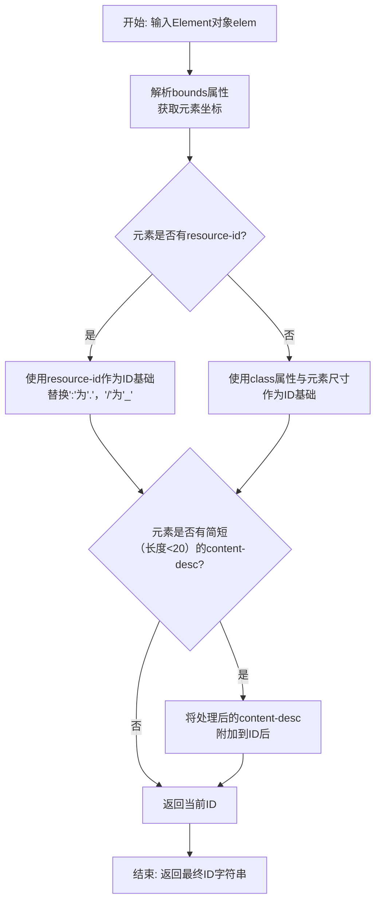

#### 带注释源码

```python
def get_id_from_element(elem: Element) -> str:
    # 1. 从元素的`bounds`属性中解析出坐标，并计算元素的宽度和高度。
    bounds = elem.attrib["bounds"][1:-1].split("][")
    x1, y1 = map(int, bounds[0].split(","))
    x2, y2 = map(int, bounds[1].split(","))
    elem_w, elem_h = x2 - x1, y2 - y1

    # 2. 确定ID的基础部分。
    #    优先使用`resource-id`属性，并进行字符替换以符合命名规范。
    #    如果没有`resource-id`，则使用元素的`class`属性加上其尺寸来构造基础ID。
    if "resource-id" in elem.attrib and elem.attrib["resource-id"]:
        elem_id = elem.attrib["resource-id"].replace(":", ".").replace("/", "_")
    else:
        elem_id = f"{elem.attrib['class']}_{elem_w}_{elem_h}"

    # 3. 如果元素有`content-desc`属性且其长度小于20个字符，
    #    则将其处理（替换特定字符）后附加到基础ID之后，以增加ID的唯一性。
    if "content-desc" in elem.attrib and elem.attrib["content-desc"] and len(elem.attrib["content-desc"]) < 20:
        content_desc = elem.attrib["content-desc"].replace("/", "_").replace(" ", "").replace(":", "_")
        elem_id += f"_{content_desc}"

    # 4. 返回最终构造的唯一标识符字符串。
    return elem_id
```


### `traverse_xml_tree`

该函数用于遍历给定的Android UI布局XML文件，根据指定的属性（如`clickable`或`focusable`）筛选出符合条件的UI元素，并将它们转换为`AndroidElement`对象列表。在遍历过程中，它会计算元素的唯一标识符（UID）和边界框（bbox），并基于元素中心点的距离进行去重，避免添加位置过于接近的重复元素。

参数：

-  `xml_path`：`Path`，Android UI布局XML文件的路径。
-  `elem_list`：`list[AndroidElement]`，用于存储筛选出的`AndroidElement`对象的列表。
-  `attrib`：`str`，要筛选的XML元素属性名称（例如`"clickable"`或`"focusable"`）。
-  `add_index`：`bool`，是否在元素UID后附加索引以增强唯一性。

返回值：`None`，该函数不返回任何值，结果直接修改传入的`elem_list`参数。

#### 流程图

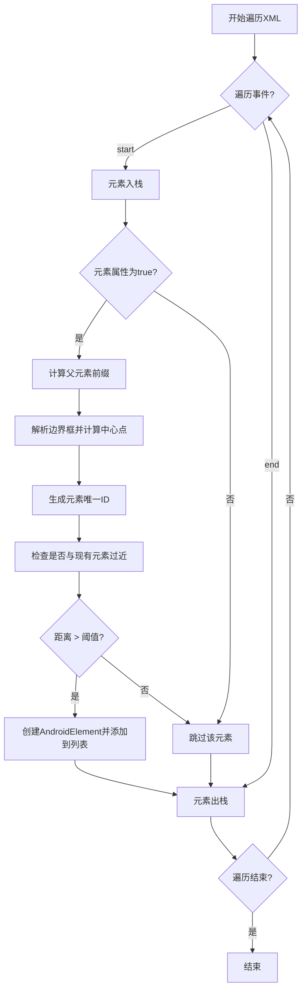

#### 带注释源码

```python
def traverse_xml_tree(xml_path: Path, elem_list: list[AndroidElement], attrib: str, add_index=False):
    # 初始化路径栈，用于跟踪当前遍历的XML元素层级
    path = []
    # 从全局配置中获取额外配置参数，例如最小距离阈值
    extra_config = config.extra
    # 使用iterparse流式解析XML文件，处理'start'和'end'事件
    for event, elem in iterparse(str(xml_path), ["start", "end"]):
        # 当遇到元素开始标签时
        if event == "start":
            # 将当前元素压入路径栈
            path.append(elem)
            # 检查当前元素是否具有指定的属性，并且该属性的值为"true"
            if attrib in elem.attrib and elem.attrib[attrib] == "true":
                # 初始化父元素前缀为空字符串
                parent_prefix = ""
                # 如果路径栈中有父元素（当前元素不是根元素），则获取父元素的唯一ID作为前缀
                if len(path) > 1:
                    parent_prefix = get_id_from_element(path[-2])
                # 解析元素的边界框字符串，格式为"[x1,y1][x2,y2]"，并转换为整数坐标
                bounds = elem.attrib["bounds"][1:-1].split("][")
                x1, y1 = map(int, bounds[0].split(","))
                x2, y2 = map(int, bounds[1].split(","))
                # 计算元素的中心点坐标
                center = (x1 + x2) // 2, (y1 + y2) // 2
                # 调用get_id_from_element函数生成当前元素的唯一标识符
                elem_id = get_id_from_element(elem)
                # 如果存在父元素前缀，则将其与当前元素ID拼接
                if parent_prefix:
                    elem_id = parent_prefix + "_" + elem_id
                # 如果add_index为True，则在元素ID后附加索引属性以增强唯一性
                if add_index:
                    elem_id += f"_{elem.attrib['index']}"
                # 初始化标志位，用于判断当前元素是否与列表中已有元素位置过近
                close = False
                # 遍历已存在的元素列表，检查距离
                for e in elem_list:
                    bbox = e.bbox
                    # 计算已有元素的中心点
                    center_ = (bbox[0][0] + bbox[1][0]) // 2, (bbox[0][1] + bbox[1][1]) // 2
                    # 计算两个中心点之间的欧几里得距离
                    dist = (abs(center[0] - center_[0]) ** 2 + abs(center[1] - center_[1]) ** 2) ** 0.5
                    # 如果距离小于等于配置的最小距离阈值，则标记为过近并跳出循环
                    if dist <= extra_config.get("min_dist", 30):
                        close = True
                        break
                # 如果当前元素不与任何已有元素过近，则创建AndroidElement对象并添加到列表
                if not close:
                    elem_list.append(AndroidElement(uid=elem_id, bbox=((x1, y1), (x2, y2)), attrib=attrib))

        # 当遇到元素结束标签时
        if event == "end":
            # 将当前元素从路径栈中弹出，表示该元素及其子元素已处理完毕
            path.pop()
```


### `elem_list_from_xml_tree`

该函数从给定的Android UI XML布局文件中，提取具有`clickable`或`focusable`属性的UI元素，并返回一个`AndroidElement`对象列表。它会过滤掉指定的无用元素，并确保`focusable`元素不与`clickable`元素在位置上过于接近，以避免重复。

参数：

- `xml_path`：`Path`，Android UI布局XML文件的路径。
- `useless_list`：`list[str]`，需要过滤掉的UI元素ID列表。
- `min_dist`：`int`，用于判断`focusable`元素是否与`clickable`元素过于接近的最小距离阈值。

返回值：`list[AndroidElement]`，处理后的UI元素列表。

#### 流程图

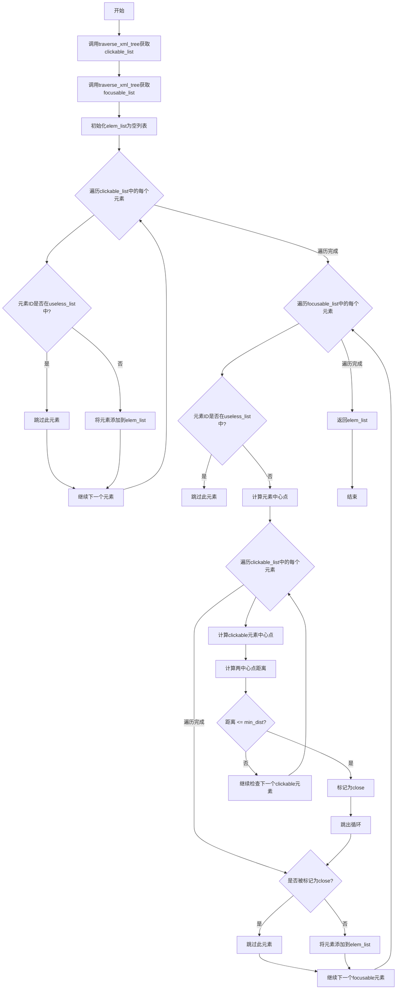

#### 带注释源码

```python
def elem_list_from_xml_tree(xml_path: Path, useless_list: list[str], min_dist: int) -> list[AndroidElement]:
    # 步骤1: 从XML树中提取所有可点击的元素
    clickable_list = []
    # 调用辅助函数traverse_xml_tree，传入clickable属性，并启用索引添加
    traverse_xml_tree(xml_path, clickable_list, "clickable", True)

    # 步骤2: 从XML树中提取所有可获得焦点的元素
    focusable_list = []
    # 调用辅助函数traverse_xml_tree，传入focusable属性，并启用索引添加
    traverse_xml_tree(xml_path, focusable_list, "focusable", True)

    # 步骤3: 初始化最终的元素列表
    elem_list = []

    # 步骤4: 处理可点击元素列表
    for elem in clickable_list:
        # 如果元素ID在无用列表中，则跳过
        if elem.uid in useless_list:
            continue
        # 否则，将元素添加到最终列表
        elem_list.append(elem)

    # 步骤5: 处理可获得焦点的元素列表
    for elem in focusable_list:
        # 如果元素ID在无用列表中，则跳过
        if elem.uid in useless_list:
            continue
        # 计算当前可获得焦点元素的中心点坐标
        bbox = elem.bbox
        center = (bbox[0][0] + bbox[1][0]) // 2, (bbox[0][1] + bbox[1][1]) // 2

        # 初始化标志位，用于判断是否与可点击元素过于接近
        close = False
        # 遍历所有可点击元素
        for e in clickable_list:
            # 计算可点击元素的中心点坐标
            bbox = e.bbox
            center_ = (bbox[0][0] + bbox[1][0]) // 2, (bbox[0][1] + bbox[1][1]) // 2
            # 计算两中心点之间的欧几里得距离
            dist = (abs(center[0] - center_[0]) ** 2 + abs(center[1] - center_[1]) ** 2) ** 0.5
            # 如果距离小于等于最小距离阈值，则标记为过于接近
            if dist <= min_dist:
                close = True
                break
        # 如果当前可获得焦点元素不与任何可点击元素过于接近，则将其添加到最终列表
        if not close:
            elem_list.append(elem)

    # 步骤6: 返回处理后的元素列表
    return elem_list
```

### `draw_bbox_multi`

该函数用于在给定的图像上绘制多个边界框（Bounding Boxes），每个边界框对应一个Android界面元素（`AndroidElement`）。函数会根据元素的属性（如`clickable`或`focusable`）或指定的模式（记录模式或暗色模式）选择不同的颜色和样式来绘制标签。最终，带有边界框和标签的图像会被保存到指定的输出路径，并返回绘制后的图像对象。

参数：

- `img_path`：`Path`，输入图像文件的路径。
- `output_path`：`Path`，输出图像文件的路径。
- `elem_list`：`list[AndroidElement]`，Android元素列表，每个元素包含边界框信息和属性。
- `record_mode`：`bool`，默认为`False`。如果为`True`，则根据元素的属性（`clickable`或`focusable`）选择颜色；否则，根据`dark_mode`参数选择颜色。
- `dark_mode`：`bool`，默认为`False`。如果为`True`，则使用暗色模式的颜色方案（深色背景、浅色文字）；否则，使用亮色模式的颜色方案（浅色背景、深色文字）。

返回值：`numpy.ndarray`（通过`cv2.imread`和`cv2.imwrite`处理的图像对象），返回绘制了边界框和标签的图像对象。

#### 流程图

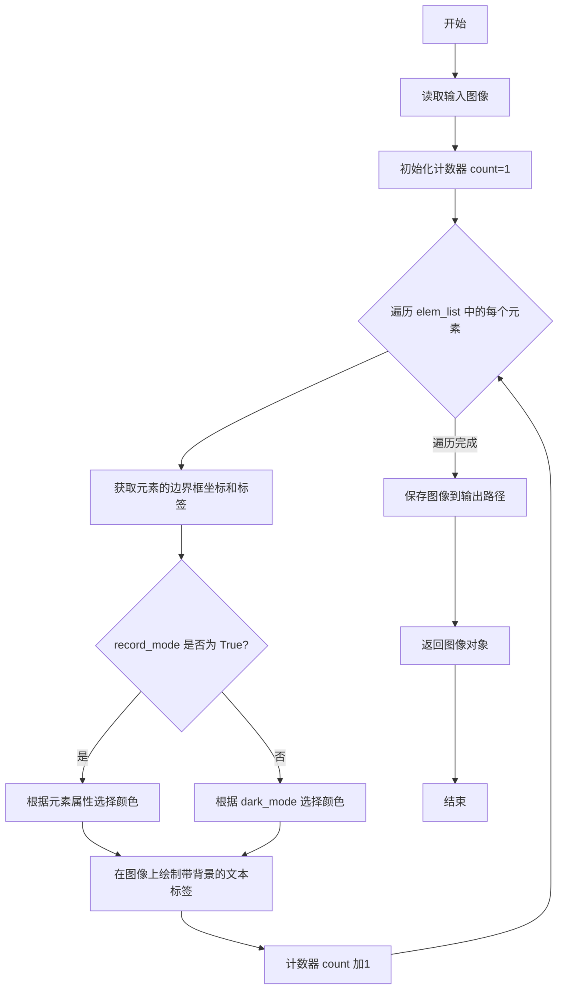

#### 带注释源码

```python
def draw_bbox_multi(
    img_path: Path,
    output_path: Path,
    elem_list: list[AndroidElement],
    record_mode: bool = False,
    dark_mode: bool = False,
):
    # 读取输入图像
    imgcv = cv2.imread(str(img_path))
    count = 1  # 初始化计数器，用于生成标签编号
    for elem in elem_list:
        try:
            # 获取元素的边界框坐标
            top_left = elem.bbox[0]
            bottom_right = elem.bbox[1]
            left, top = top_left[0], top_left[1]
            right, bottom = bottom_right[0], bottom_right[1]
            label = str(count)  # 生成标签文本（数字编号）

            if record_mode:
                # 记录模式：根据元素属性选择颜色
                if elem.attrib == "clickable":
                    color = (250, 0, 0)  # 蓝色（BGR格式）
                elif elem.attrib == "focusable":
                    color = (0, 0, 250)  # 红色（BGR格式）
                else:
                    color = (0, 250, 0)  # 绿色（BGR格式）
                # 在图像上绘制带背景的文本标签
                imgcv = ps.putBText(
                    imgcv,
                    label,
                    text_offset_x=(left + right) // 2 + 10,  # 文本水平位置（中心点偏移）
                    text_offset_y=(top + bottom) // 2 + 10,  # 文本垂直位置（中心点偏移）
                    vspace=10,  # 垂直间距
                    hspace=10,  # 水平间距
                    font_scale=1,  # 字体缩放比例
                    thickness=2,  # 文本厚度
                    background_RGB=color,  # 背景颜色
                    text_RGB=(255, 250, 250),  # 文本颜色（浅色）
                    alpha=0.5,  # 背景透明度
                )
            else:
                # 非记录模式：根据 dark_mode 选择颜色方案
                text_color = (10, 10, 10) if dark_mode else (255, 250, 250)  # 暗色模式：深色文字；亮色模式：浅色文字
                bg_color = (255, 250, 250) if dark_mode else (10, 10, 10)  # 暗色模式：浅色背景；亮色模式：深色背景
                imgcv = ps.putBText(
                    imgcv,
                    label,
                    text_offset_x=(left + right) // 2 + 10,
                    text_offset_y=(top + bottom) // 2 + 10,
                    vspace=10,
                    hspace=10,
                    font_scale=1,
                    thickness=2,
                    background_RGB=bg_color,
                    text_RGB=text_color,
                    alpha=0.5,
                )
        except Exception as e:
            # 异常处理：记录错误日志
            logger.error(f"ERROR: An exception occurs while labeling the image\n{e}")
        count += 1  # 更新计数器
    # 保存绘制后的图像到输出路径
    cv2.imwrite(str(output_path), imgcv)
    return imgcv  # 返回图像对象
```

### `draw_grid`

该函数用于在给定的图像上绘制网格，并将结果保存到输出路径。网格的单元大小根据图像尺寸自动计算，确保每个单元在120到180像素之间。每个网格单元会被标记一个唯一的编号，并绘制在图像上。

参数：

- `img_path`：`Path`，输入图像的路径。
- `output_path`：`Path`，输出图像的保存路径。

返回值：`tuple[int, int]`，返回网格的行数和列数。

#### 流程图

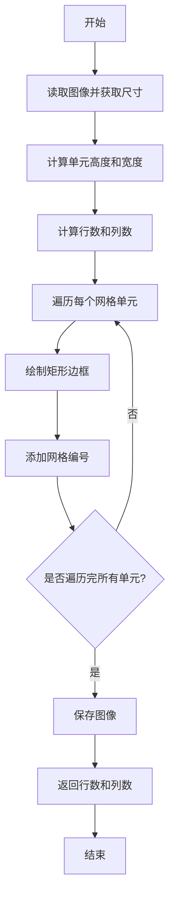

#### 带注释源码

```python
def draw_grid(img_path: Path, output_path: Path) -> tuple[int, int]:
    # 辅助函数：计算合适的单元长度，确保在120到180像素之间
    def get_unit_len(n):
        for i in range(1, n + 1):
            if n % i == 0 and 120 <= i <= 180:
                return i
        return -1

    # 读取图像并获取尺寸
    image = cv2.imread(str(img_path))
    height, width, _ = image.shape
    color = (255, 116, 113)  # 网格颜色

    # 计算单元高度和宽度
    unit_height = get_unit_len(height)
    if unit_height < 0:
        unit_height = 120  # 默认值
    unit_width = get_unit_len(width)
    if unit_width < 0:
        unit_width = 120  # 默认值

    # 计算网格的行数和列数
    thick = int(unit_width // 50)  # 边框厚度
    rows = height // unit_height
    cols = width // unit_width

    # 遍历每个网格单元并绘制
    for i in range(rows):
        for j in range(cols):
            label = i * cols + j + 1  # 网格编号
            left = int(j * unit_width)
            top = int(i * unit_height)
            right = int((j + 1) * unit_width)
            bottom = int((i + 1) * unit_height)

            # 绘制矩形边框
            cv2.rectangle(image, (left, top), (right, bottom), color, thick // 2)

            # 添加网格编号（带阴影效果）
            cv2.putText(
                image,
                str(label),
                (left + int(unit_width * 0.05) + 3, top + int(unit_height * 0.3) + 3),
                0,
                int(0.01 * unit_width),
                (0, 0, 0),  # 阴影颜色
                thick,
            )
            cv2.putText(
                image,
                str(label),
                (left + int(unit_width * 0.05), top + int(unit_height * 0.3)),
                0,
                int(0.01 * unit_width),
                color,  # 文本颜色
                thick,
            )

    # 保存图像并返回行数和列数
    cv2.imwrite(str(output_path), image)
    return rows, cols
```

### `area_to_xy`

该函数用于将屏幕网格区域编号和子区域描述转换为具体的屏幕坐标。它首先根据网格的行列数将区域编号转换为网格的行列索引，然后根据子区域描述（如"top-left"、"center"等）计算该子区域在网格单元内的相对坐标，最终返回屏幕上的绝对坐标。

参数：

- `area`：`int`，网格区域编号，从1开始计数
- `subarea`：`str`，子区域描述，如"top-left"、"center"、"bottom-right"等
- `width`：`int`，屏幕的宽度（像素）
- `height`：`int`，屏幕的高度（像素）
- `rows`：`int`，网格的行数
- `cols`：`int`，网格的列数

返回值：`tuple[int, int]`，返回计算得到的屏幕坐标`(x, y)`

#### 流程图

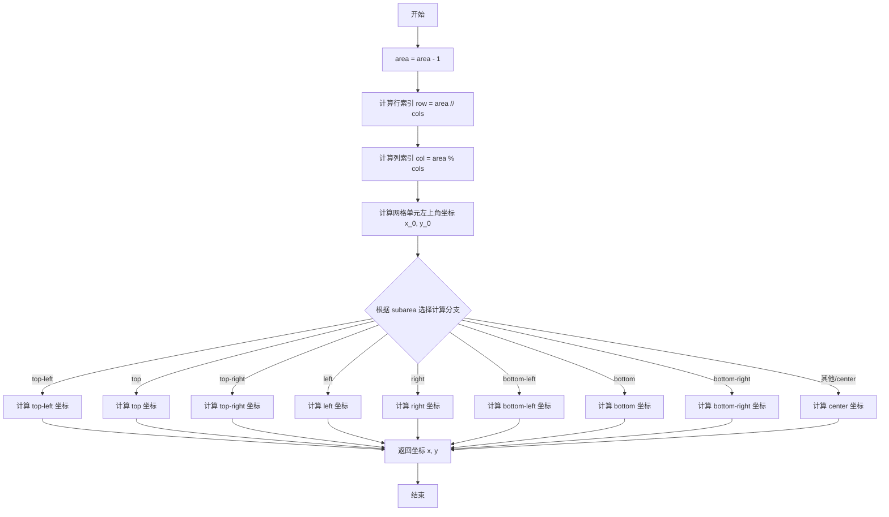

#### 带注释源码

```python
def area_to_xy(area: int, subarea: str, width: int, height: int, rows: int, cols: int) -> tuple[int, int]:
    # 将区域编号转换为从0开始的索引
    area -= 1
    # 计算区域对应的行和列索引
    row, col = area // cols, area % cols
    # 计算该网格单元左上角的屏幕坐标
    x_0, y_0 = col * (width // cols), row * (height // rows)
    # 根据子区域描述，计算该子区域在网格单元内的相对坐标，并转换为绝对坐标
    if subarea == "top-left":
        x, y = x_0 + (width // cols) // 4, y_0 + (height // rows) // 4
    elif subarea == "top":
        x, y = x_0 + (width // cols) // 2, y_0 + (height // rows) // 4
    elif subarea == "top-right":
        x, y = x_0 + (width // cols) * 3 // 4, y_0 + (height // rows) // 4
    elif subarea == "left":
        x, y = x_0 + (width // cols) // 4, y_0 + (height // rows) // 2
    elif subarea == "right":
        x, y = x_0 + (width // cols) * 3 // 4, y_0 + (height // rows) // 2
    elif subarea == "bottom-left":
        x, y = x_0 + (width // cols) // 4, y_0 + (height // rows) * 3 // 4
    elif subarea == "bottom":
        x, y = x_0 + (width // cols) // 2, y_0 + (height // rows) * 3 // 4
    elif subarea == "bottom-right":
        x, y = x_0 + (width // cols) * 3 // 4, y_0 + (height // rows) * 3 // 4
    else: # 默认为中心点 "center"
        x, y = x_0 + (width // cols) // 2, y_0 + (height // rows) // 2
    return x, y
```

### `elem_bbox_to_xy`

该函数接收一个表示UI元素边界框的元组，计算并返回该边界框的中心点坐标。它通过取左上角和右下角坐标的平均值来实现，是处理屏幕坐标转换的基础工具函数。

参数：

- `bbox`：`tuple[tuple[int, int], tuple[int, int]]`，一个包含两个元组的元组，分别代表边界框的左上角 `(x1, y1)` 和右下角 `(x2, y2)` 坐标。

返回值：`tuple[int, int]`，返回计算出的边界框中心点的 `(x, y)` 坐标。

#### 流程图

```mermaid
flowchart TD
    A[开始] --> B[接收边界框 bbox]
    B --> C[解构 bbox 为 tl, br]
    C --> D[计算中心点 x = (tl.x + br.x) // 2]
    D --> E[计算中心点 y = (tl.y + br.y) // 2]
    E --> F[返回坐标 (x, y)]
    F --> G[结束]
```

#### 带注释源码

```python
def elem_bbox_to_xy(bbox: tuple[tuple[int, int], tuple[int, int]]) -> tuple[int, int]:
    # 解构边界框元组，获取左上角(tl)和右下角(br)坐标
    tl, br = bbox
    # 计算中心点的x坐标：取左上角和右下角x坐标的平均值
    x = (tl[0] + br[0]) // 2
    # 计算中心点的y坐标：取左上角和右下角y坐标的平均值
    y = (tl[1] + br[1]) // 2
    # 返回计算出的中心点坐标
    return x, y
```

### `reflect_parse_extract`

该函数用于解析一个包含决策信息的JSON字典，并将其转换为一个`ReflectOp`对象。它首先检查JSON中的`Decision`字段是否有效，如果无效则返回一个状态为`FAIL`的`ReflectOp`对象；如果有效，则提取`Decision`、`Thought`和`Documentation`字段，并构造一个包含这些信息的`ReflectOp`对象。

参数：

- `parsed_json`：`dict`，包含决策信息的JSON字典。

返回值：`ReflectOp`，一个表示解析结果的反射操作对象。

#### 流程图

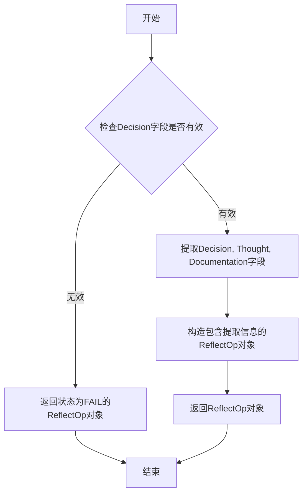

#### 带注释源码

```python
def reflect_parse_extarct(parsed_json: dict) -> ReflectOp:
    # 从输入的JSON字典中获取'Decision'字段的值
    decision = parsed_json.get("Decision")
    
    # 检查获取的decision值是否在预定义的Decision枚举值中
    if decision not in Decision.values():
        # 如果不在，则创建一个状态为FAIL的ReflectOp对象
        op = ReflectOp(param_state=RunState.FAIL)
    else:
        # 如果在，则创建一个包含Decision、Thought和Documentation字段的ReflectOp对象
        op = ReflectOp(
            decision=parsed_json.get("Decision"),
            thought=parsed_json.get("Thought"),
            documentation=parsed_json.get("Documentation"),
        )
    # 返回构造的ReflectOp对象
    return op
```

### `screenshot_parse_extract`

`screenshot_parse_extract` 函数是 Android 自动化测试框架中的一个核心解析器，负责将自然语言或结构化 JSON 描述的用户操作意图，解析为具体的、可执行的 Android UI 操作参数对象。它根据操作类型（如点击、长按、滑动、输入文本）和是否启用网格模式，将输入的 JSON 数据转换为对应的 `BaseOpParam` 或其子类的实例，为后续的 UI 自动化执行提供精确的指令。

参数：

- `parsed_json`：`dict`，包含从 LLM 或其它解析器输出的结构化操作指令的字典。通常包含 `"Action"` 和 `"Summary"` 等键。
- `grid_on`：`bool`，默认为 `False`。一个标志位，指示是否在网格模式下解析操作。网格模式将屏幕划分为多个区域，操作基于区域和子区域进行定位，而非基于具体的 UI 元素。

返回值：`Union[BaseOpParam, BaseGridOpParam, GridOpParam]`，返回一个操作参数对象。该对象的具体类型取决于解析出的操作类型和 `grid_on` 标志。例如，可能返回 `TapOpParam`、`SwipeGridOpParam` 或表示失败/完成的 `BaseOpParam`。

#### 流程图

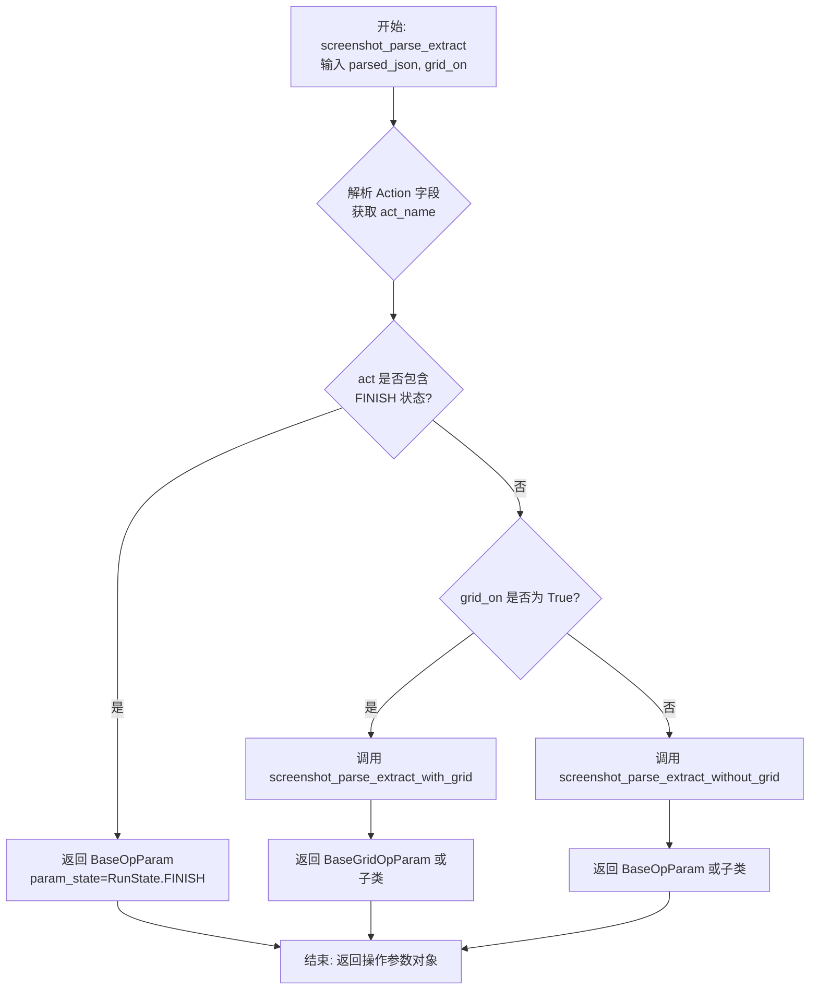

#### 带注释源码

```python
def screenshot_parse_extract(
    parsed_json: dict, grid_on: bool = False
) -> Union[BaseOpParam, BaseGridOpParam, GridOpParam]:
    """
    从解析后的JSON数据中提取操作参数。
    根据操作类型和是否启用网格模式，分派到不同的解析函数。

    Args:
        parsed_json (dict): 包含操作指令的字典，应有 'Action' 和 'Summary' 键。
        grid_on (bool, optional): 是否启用网格模式进行解析。默认为 False。

    Returns:
        Union[BaseOpParam, BaseGridOpParam, GridOpParam]: 对应的操作参数对象。
    """
    # 1. 从输入字典中获取关键字段
    act = parsed_json.get("Action")      # 操作字符串，如 "tap(12)" 或 "swipe(1, 'left', 2)"
    last_act = parsed_json.get("Summary") # 上一次操作的摘要（上下文）
    act_name = act.split("(")[0]         # 提取操作名称，如 "tap", "swipe"

    # 2. 检查是否为结束操作
    if RunState.FINISH.value.upper() in act:
        return BaseOpParam(param_state=RunState.FINISH)

    # 3. 根据是否启用网格模式，调用不同的解析逻辑
    if grid_on:
        return screenshot_parse_extract_with_grid(act_name, act, last_act)
    else:
        return screenshot_parse_extract_without_grid(act_name, act, last_act)
```

### `op_params_clean`

该函数用于清理和转换从字符串中提取的操作参数列表。它将字符串参数中的引号去除，并将数字字符串转换为整数类型，最终返回一个包含整数和字符串的混合列表。

参数：

- `params`：`list[str]`，包含原始参数字符串的列表，例如 `['1', '"top"', '3']`。

返回值：`list[Union[int, str]]`，清理和转换后的参数列表，例如 `[1, 'top', 3]`。

#### 流程图

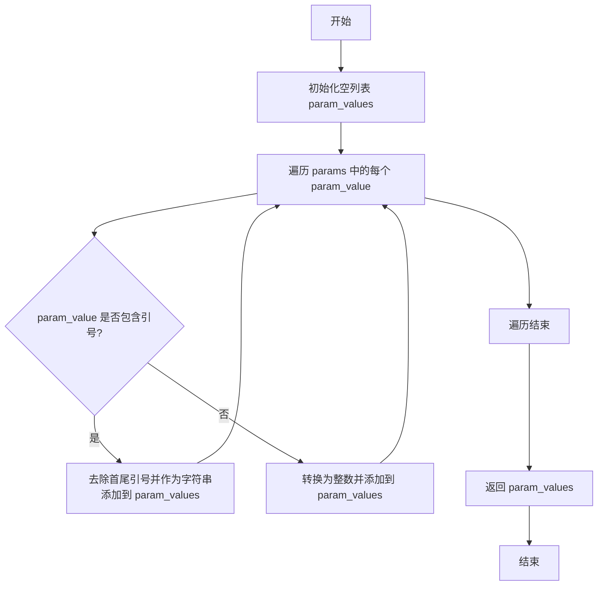

#### 带注释源码

```python
def op_params_clean(params: list[str]) -> list[Union[int, str]]:
    """
    清理和转换参数字符串列表。
    将带引号的字符串去除引号，将数字字符串转换为整数。

    Args:
        params (list[str]): 原始参数字符串列表，例如 ['1', '"top"', '3']。

    Returns:
        list[Union[int, str]]: 清理后的参数列表，例如 [1, 'top', 3]。
    """
    param_values = []  # 初始化一个空列表，用于存储清理后的参数值
    for param_value in params:  # 遍历输入的每个参数字符串
        if '"' in param_value or "'" in param_value:  # 检查字符串是否包含单引号或双引号
            # 如果是带引号的字符串，去除首尾的引号并作为字符串添加到结果列表
            param_values.append(param_value.strip()[1:-1])
        else:
            # 如果不包含引号，则假定为数字字符串，转换为整数并添加到结果列表
            param_values.append(int(param_value))
    return param_values  # 返回清理后的参数列表
```

### `screenshot_parse_extract_without_grid`

该函数用于解析非网格模式下的屏幕截图操作指令，根据操作类型（如点击、长按、滑动、文本输入等）提取相应的参数，并返回对应的操作参数对象。

参数：

- `act_name`：`str`，操作名称，如 "tap"、"text"、"long_press"、"swipe" 或 "grid"。
- `act`：`str`，完整的操作字符串，如 "tap(1)"、"text('hello')" 等。
- `last_act`：`str`，上一次操作的摘要，用于记录操作历史。

返回值：`Union[BaseOpParam, GridOpParam]`，返回解析后的操作参数对象，具体类型取决于操作类型。如果操作类型无法识别，则返回一个状态为 `RunState.FAIL` 的 `BaseOpParam` 对象。

#### 流程图

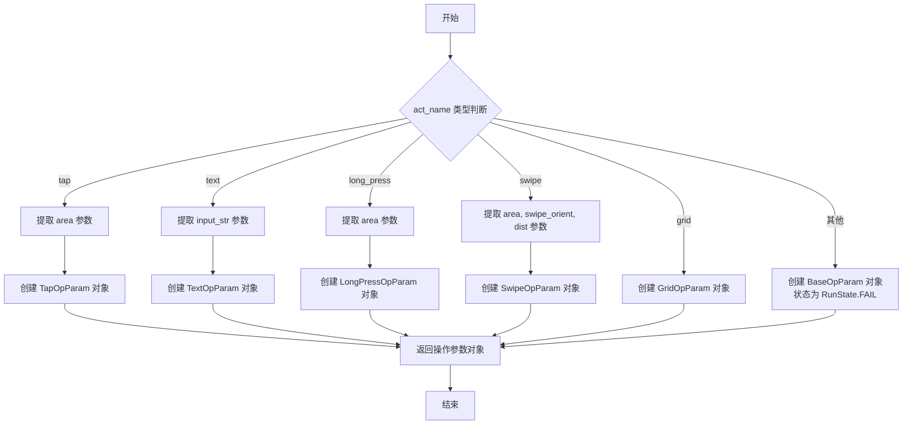

#### 带注释源码

```python
def screenshot_parse_extract_without_grid(act_name: str, act: str, last_act: str) -> Union[BaseOpParam, GridOpParam]:
    # 处理点击操作
    if act_name == ActionOp.TAP.value:
        # 使用正则表达式提取 tap 操作中的 area 参数
        area = int(re.findall(r"tap\((.*?)\)", act)[0])
        # 创建 TapOpParam 对象，包含操作名称、区域和上一次操作摘要
        op = TapOpParam(act_name=act_name, area=area, last_act=last_act)
    # 处理文本输入操作
    elif act_name == ActionOp.TEXT.value:
        # 使用正则表达式提取 text 操作中的输入字符串，并去除引号
        input_str = re.findall(r"text\((.*?)\)", act)[0][1:-1]
        # 创建 TextOpParam 对象，包含操作名称、输入字符串和上一次操作摘要
        op = TextOpParam(act_name=act_name, input_str=input_str, last_act=last_act)
    # 处理长按操作
    elif act_name == ActionOp.LONG_PRESS.value:
        # 使用正则表达式提取 long_press 操作中的 area 参数
        area = int(re.findall(r"long_press\((.*?)\)", act)[0])
        # 创建 LongPressOpParam 对象，包含操作名称、区域和上一次操作摘要
        op = LongPressOpParam(act_name=act_name, area=area, last_act=last_act)
    # 处理滑动操作
    elif act_name == ActionOp.SWIPE.value:
        # 使用正则表达式提取 swipe 操作中的参数，并按逗号分割
        params = re.findall(r"swipe\((.*?)\)", act)[0].split(",")
        # 清理参数，将字符串类型的参数转换为整数或保留字符串
        params = op_params_clean(params)  # area, swipe_orient, dist
        # 创建 SwipeOpParam 对象，包含操作名称、起始区域、滑动方向、滑动距离和上一次操作摘要
        op = SwipeOpParam(act_name=act_name, area=params[0], swipe_orient=params[1], dist=params[2], last_act=last_act)
    # 处理网格操作
    elif act_name == ActionOp.GRID.value:
        # 创建 GridOpParam 对象，仅包含操作名称
        op = GridOpParam(act_name=act_name)
    # 处理未知操作
    else:
        # 创建 BaseOpParam 对象，状态设置为失败
        op = BaseOpParam(param_state=RunState.FAIL)
    # 返回解析后的操作参数对象
    return op
```

### `screenshot_parse_extract_with_grid`

该函数用于解析包含网格坐标信息的用户操作指令（如点击、长按、滑动），并将其转换为对应的网格操作参数对象。它从动作字符串中提取网格区域和子区域信息，根据动作类型创建相应的参数对象。

参数：

- `act_name`：`str`，动作名称，如 "tap"、"long_press"、"swipe" 或 "grid"
- `act`：`str`，完整的动作字符串，例如 "tap(5, 'top-left')"
- `last_act`：`str`，上一个动作的摘要描述

返回值：`Union[BaseGridOpParam, GridOpParam]`，返回一个网格操作参数对象，具体类型取决于动作名称。如果动作无法识别，则返回一个状态为 `FAIL` 的 `BaseGridOpParam`。

#### 流程图

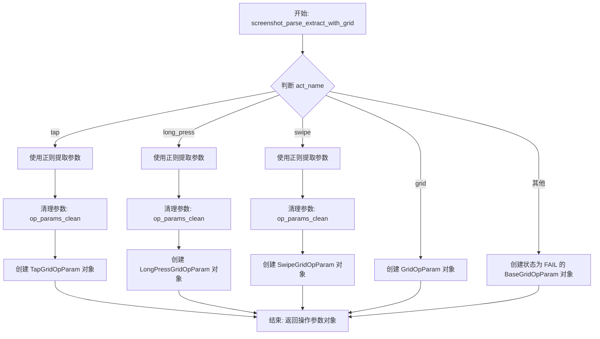

#### 带注释源码

```python
def screenshot_parse_extract_with_grid(act_name: str, act: str, last_act: str) -> Union[BaseGridOpParam, GridOpParam]:
    # 处理点击操作
    if act_name == ActionOp.TAP.value:
        # 使用正则表达式从动作字符串中提取参数，参数格式如 "5, 'top-left'"
        params = re.findall(r"tap\((.*?)\)", act)[0].split(",")
        # 清理参数，将字符串类型的参数去除引号，数字转换为整数
        params = op_params_clean(params)
        # 创建点击网格操作参数对象，参数包括区域和子区域
        op = TapGridOpParam(act_name=act_name, area=params[0], subarea=params[1], last_act=last_act)
    # 处理长按操作
    elif act_name == ActionOp.LONG_PRESS.value:
        # 使用正则表达式从动作字符串中提取参数
        params = re.findall(r"long_press\((.*?)\)", act)[0].split(",")
        # 清理参数
        params = op_params_clean(params)
        # 创建长按网格操作参数对象
        op = LongPressGridOpParam(act_name=act_name, area=params[0], subarea=params[1], last_act=last_act)
    # 处理滑动操作
    elif act_name == ActionOp.SWIPE.value:
        # 使用正则表达式从动作字符串中提取参数，参数格式如 "1, 'center', 9, 'center'"
        params = re.findall(r"swipe\((.*?)\)", act)[0].split(",")
        # 清理参数
        params = op_params_clean(params)
        # 创建滑动网格操作参数对象，参数包括起始区域、起始子区域、结束区域、结束子区域
        op = SwipeGridOpParam(
            act_name=act_name, start_area=params[0], start_subarea=params[1], end_area=params[2], end_subarea=params[3]
        )
    # 处理网格操作（可能用于切换网格模式）
    elif act_name == ActionOp.GRID.value:
        op = GridOpParam(act_name=act_name)
    # 如果动作名称无法识别，则创建一个失败状态的基础网格操作参数对象
    else:
        op = BaseGridOpParam(param_state=RunState.FAIL)
    return op
```

## 关键组件


### XML 树解析与元素提取

通过解析 Android UI 的 XML 布局文件，提取具有特定属性（如 `clickable`、`focusable`）的 UI 元素，并生成 `AndroidElement` 对象列表，用于后续的界面分析和操作。

### 元素唯一标识符生成

根据 UI 元素的属性（如 `resource-id`、`class`、`bounds`、`content-desc`）生成一个唯一的字符串标识符（`uid`），用于在列表中区分不同的元素。

### 图像标注与边界框绘制

在 Android 屏幕截图上，为识别出的 UI 元素绘制带有序号的边界框，并根据元素的属性（`clickable`、`focusable`）或显示模式（记录模式、暗色模式）使用不同的颜色方案进行可视化标注。

### 网格系统生成与坐标映射

将屏幕截图划分为均匀的网格，并为每个网格单元编号。提供将网格区域编号和子区域描述（如 `top-left`）转换为屏幕绝对坐标的功能，用于支持基于网格的交互操作。

### 操作指令解析

解析来自 LLM 或其他来源的、描述用户操作的 JSON 或字符串指令（如 `tap(1)`、`swipe(1, 'left', 2)`），并将其转换为内部可执行的操作参数对象（如 `TapOpParam`, `SwipeOpParam`），支持网格模式和非网格模式。


## 问题及建议


### 已知问题

-   **硬编码的配置值**：`draw_grid` 函数中，网格单元大小的默认值（120）和范围（120-180）是硬编码的，缺乏灵活性，难以适应不同分辨率的设备或调整网格密度。
-   **脆弱的正则表达式解析**：`screenshot_parse_extract_without_grid` 和 `screenshot_parse_extract_with_grid` 函数严重依赖正则表达式来解析动作字符串（如 `tap(1)`）。如果输入格式稍有偏差（例如，多余的空格、不同的引号），解析就会失败，导致 `RunState.FAIL`。
-   **重复的代码逻辑**：`traverse_xml_tree` 函数和 `elem_list_from_xml_tree` 函数中都存在计算元素中心点距离以判断是否“接近”的逻辑，这部分代码可以抽象为独立的函数以提高可维护性。
-   **异常处理不足**：`draw_bbox_multi` 函数虽然捕获了异常并记录日志，但异常被捕获后，循环继续处理下一个元素。这可能导致部分边界框绘制失败而用户无感知，且原始图像 (`imgcv`) 可能已被部分修改，状态不一致。
-   **`op_params_clean` 函数类型处理不严谨**：该函数仅通过检查引号来区分字符串和整数，对于其他类型（如浮点数、布尔值）或格式错误的数字字符串处理不当，可能引发 `ValueError`。
-   **`get_id_from_element` 函数ID生成可能冲突**：当多个元素具有相同的类名、尺寸和可选的描述时，生成的 `elem_id` 可能重复，导致在 `elem_list` 中无法唯一标识元素。
-   **`area_to_xy` 函数缺乏参数验证**：函数未对输入的 `area`、`subarea` 等参数进行有效性检查（例如 `area` 是否在有效网格编号范围内，`subarea` 是否为预设值），可能导致计算出的坐标超出图像范围。

### 优化建议

-   **将网格配置参数化**：将 `draw_grid` 函数中的单元大小、范围、颜色、厚度等参数提取到配置（如 `config.extra`）中，或作为函数参数传入，提高灵活性。
-   **使用更健壮的解析方法**：考虑使用更结构化的方法解析动作字符串，例如定义明确的语法并使用解析库（如 `pyparsing`），或者要求输入更结构化的数据（如 JSON），以替代脆弱的正则表达式。
-   **提取公共计算函数**：将计算两个边界框中心点距离的逻辑提取为一个独立的工具函数（如 `calculate_center_distance`），并在 `traverse_xml_tree` 和 `elem_list_from_xml_tree` 中复用，减少代码重复。
-   **增强异常处理与状态回滚**：在 `draw_bbox_multi` 中，考虑在异常发生时提供更详细的错误信息（如元素ID），或者实现“要么全做，要么不做”的语义，在发生错误时中断处理并清理或恢复图像状态。
-   **改进 `op_params_clean` 的类型推断**：实现更健壮的类型转换逻辑，例如尝试转换为 `int`，失败后再尝试 `float`，最后作为字符串处理。或者明确约定参数类型，并在文档中说明。
-   **增强元素ID的唯一性**：在 `get_id_from_element` 中，可以引入更多属性（如 `index`）或生成一个哈希值来确保ID的唯一性，特别是在 `add_index` 为 `False` 时。
-   **为关键函数添加参数验证**：在 `area_to_xy`、`elem_bbox_to_xy` 等函数入口处添加参数验证（使用 `assert` 或抛出明确的异常），确保输入在有效范围内，提高代码的健壮性。
-   **考虑性能优化**：`elem_list_from_xml_tree` 函数中存在嵌套循环（O(n²)复杂度）来检查元素是否“接近”，对于大型UI布局文件可能成为性能瓶颈。可以考虑使用空间索引数据结构（如四叉树或网格索引）进行优化。


## 其它


### 设计目标与约束

本模块是 Android 自动化测试框架 `metagpt.ext.android_assistant` 的一部分，核心目标是从 Android UI 的 XML 布局文件和屏幕截图中，解析出可交互的 UI 元素，并将高层级的自然语言或结构化指令（如 `tap(1)`）转换为具体的、可执行的 UI 操作参数。其设计遵循以下目标和约束：
1.  **目标**：
    *   **元素提取**：准确识别并定位 Android 屏幕中的 `clickable` 和 `focusable` 元素，为自动化操作提供目标。
    *   **指令解析**：将来自 LLM 或其他决策模块的文本指令，可靠地解析为结构化的操作参数对象。
    *   **可视化辅助**：生成带标注的截图（显示元素边界框和序号）和网格图，辅助人工理解或模型决策。
    *   **坐标转换**：提供从抽象区域编号到具体屏幕坐标的转换能力。
2.  **约束**：
    *   **输入格式依赖**：严重依赖 Android `uiautomator` 导出的特定格式的 XML 文件（包含 `bounds`、`clickable`、`resource-id` 等属性）。
    *   **操作语义有限**：当前主要支持 `tap`（点击）、`long_press`（长按）、`swipe`（滑动）、`text`（输入文本）等基础操作。
    *   **性能考虑**：XML 解析和图像处理（画框、画网格）需处理可能的高分辨率截图，应避免成为性能瓶颈。
    *   **配置化**：部分参数（如元素去重的最小距离 `min_dist`）通过外部配置 (`config.extra`) 管理，增加了灵活性但也引入了配置依赖。

### 错误处理与异常设计

模块中的错误处理相对基础，主要采用以下策略：
1.  **防御性编程与默认值**：在 `get_id_from_element` 函数中，当 `resource-id` 不存在时，使用 `class` 和元素尺寸构造备用 ID。在 `draw_grid` 函数中，当无法计算合适的网格单元大小时，回退到默认值 120。
2.  **异常捕获与日志记录**：在 `draw_bbox_multi` 函数中，对每个元素的标注操作使用 `try-except` 块包裹，捕获可能发生的异常（如坐标越界），并使用 `logger.error` 记录错误，避免因单个元素标注失败导致整个流程中断。
3.  **状态码返回**：在操作参数解析函数（`screenshot_parse_extract`, `reflect_parse_extract`）中，当解析失败或遇到特殊指令（如 `FINISH`）时，返回一个 `param_state` 被设置为 `RunState.FAIL` 或 `RunState.FINISH` 的 `BaseOpParam` 或 `ReflectOp` 对象。调用者通过检查 `param_state` 来判断操作是否有效或流程是否应结束，这是一种通过数据状态而非异常来控制流程的方式。
4.  **潜在不足**：
    *   缺少输入文件（XML、图片）存在性、格式有效性的校验。
    *   正则表达式解析指令 (`re.findall`) 若匹配失败可能导致索引错误，目前逻辑隐含了匹配成功的假设。
    *   错误信息不够具体，不利于快速定位问题根源。

### 数据流与状态机

本模块处理两条主要数据流，并隐含一个简单的状态机：
1.  **UI 元素提取流**：
    *   **输入**：Android UI XML 文件路径、无用元素 ID 列表 (`useless_list`)、最小距离配置 (`min_dist`)。
    *   **处理**：`traverse_xml_tree` 遍历 XML 树，提取 `clickable` 和 `focusable` 元素，生成 `AndroidElement` 列表。`elem_list_from_xml_tree` 对两者进行合并与去重。
    *   **输出**：`AndroidElement` 对象列表，每个对象包含唯一 ID (`uid`)、边界框 (`bbox`) 和属性 (`attrib`)。
    *   **可视化分支**：`draw_bbox_multi` 接收元素列表和截图，输出标注后的图片。`draw_grid` 接收截图，输出带网格编号的图片，并返回网格行列数。
2.  **操作指令解析流**：
    *   **输入**：包含 `Action` 和 `Summary` 等键的 JSON 字典 (`parsed_json`)。
    *   **处理**：`screenshot_parse_extract` 作为总入口，根据 `grid_on` 标志位，分派到 `screenshot_parse_extract_with_grid` 或 `screenshot_parse_extract_without_grid` 进行解析。`op_params_clean` 辅助清理参数格式。
    *   **输出**：继承自 `BaseOpParam` 的特定操作参数对象（如 `TapOpParam`, `SwipeGridOpParam`）或 `ReflectOp` 对象。
3.  **坐标转换流**：
    *   `area_to_xy` 将网格区域和子区域编号转换为屏幕坐标。
    *   `elem_bbox_to_xy` 将元素边界框转换为其中心点坐标。
4.  **隐含状态机**：
    *   状态由 `RunState` 枚举定义，主要包括 `NORMAL`、`FAIL`、`FINISH`。
    *   状态转移由解析结果触发：解析到 `FINISH` 指令 -> 状态变为 `FINISH`；解析失败 -> 状态变为 `FAIL`；否则为 `NORMAL`。
    *   状态存储在输出对象 (`BaseOpParam.param_state`, `ReflectOp.param_state`) 中，由上游调用者检查并决定后续流程。

### 外部依赖与接口契约

1.  **外部库依赖**：
    *   **`xml.etree.ElementTree`**：用于解析 Android UI XML 文件。**契约**：期望 XML 符合特定格式（包含 `bounds`、`clickable`、`resource-id` 等属性）。
    *   **`cv2` (OpenCV)**：用于读取、处理和保存图像文件（画矩形、文字、网格）。**契约**：支持常见图片格式（如 PNG, JPEG）。
    *   **`pyshine`**：用于在图像上添加带背景色的文字（标注元素序号）。是 OpenCV 功能的封装。
    *   **`re`**：用于使用正则表达式从指令字符串中提取参数。
2.  **项目内部依赖**：
    *   **`metagpt.config2.config`**：提供运行时配置，特别是 `extra` 字段中的 `min_dist` 等参数。
    *   **`metagpt.ext.android_assistant.utils.schema`**：定义了所有核心数据结构（`AndroidElement`、各种 `*OpParam`、`ReflectOp`、`ActionOp`、`Decision`、`RunState`）。本模块的函数输入输出严重依赖此模块定义的类。
    *   **`metagpt.logs.logger`**：用于记录错误信息。
3.  **接口契约（函数级别）**：
    *   `elem_list_from_xml_tree(xml_path: Path, useless_list: list[str], min_dist: int) -> list[AndroidElement]`：契约是调用者提供有效的 XML 路径和配置，函数返回去重后的可操作元素列表。
    *   `screenshot_parse_extract(parsed_json: dict, grid_on: bool = False) -> Union[BaseOpParam, BaseGridOpParam, GridOpParam]`：契约是调用者提供包含特定键 (`Action`, `Summary`) 的字典，函数返回对应的操作参数对象或状态对象。`grid_on` 标志必须与指令的实际格式匹配。
    *   `draw_bbox_multi` 和 `draw_grid`：契约是调用者提供有效的图片路径，函数在指定输出路径生成处理后的图片。
4.  **数据契约**：
    *   `AndroidElement` 的 `uid` 在本次屏幕解析中应保持唯一。
    *   操作参数对象（如 `TapOpParam.area`）中的区域编号，需要与 `draw_grid` 生成的网格编号或 `draw_bbox_multi` 标注的元素序号保持一致。

    