# `.\MetaGPT\metagpt\ext\cr\__init__.py` 详细设计文档

该代码实现了一个统一的模型加载框架，支持多种文本生成模型（如Llama、GPT-2、Falcon、Qwen2、Gemma等）的加载、配置和推理。它通过抽象基类定义标准接口，具体模型类实现加载逻辑，并提供工厂方法根据模型名称动态创建对应的模型实例，简化了不同模型的使用复杂性。

## 整体流程

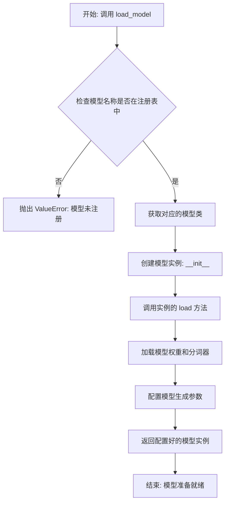

## 类结构

```
ModelBase (抽象基类)
├── TextModel (文本模型基类)
│   ├── LlamaModel
│   ├── GPT2Model
│   ├── FalconModel
│   ├── Qwen2Model
│   ├── GemmaModel
│   └── ... (其他具体模型类)
└── ModelFactory (模型工厂类)
```

## 全局变量及字段


### `MODEL_REGISTRY`
    
全局模型注册表，用于存储所有已注册的模型配置信息，键为模型名称，值为模型配置字典。

类型：`Dict[str, Dict[str, Any]]`
    


### `DEFAULT_MODEL_CONFIG`
    
默认模型配置字典，包含模型加载和运行所需的基础配置参数。

类型：`Dict[str, Any]`
    


### `TextModel.model_name`
    
文本模型的名称标识符，用于在注册表中唯一标识该模型。

类型：`str`
    


### `TextModel.model`
    
加载后的预训练模型实例，用于执行文本生成等核心任务。

类型：`Union[PreTrainedModel, Any]`
    


### `TextModel.tokenizer`
    
与模型配套的分词器实例，负责文本的编码和解码操作。

类型：`Union[PreTrainedTokenizer, Any]`
    


### `TextModel.config`
    
模型的配置参数字典，包含模型架构、超参数等运行时配置信息。

类型：`Dict[str, Any]`
    


### `ModelFactory._model_registry`
    
模型工厂内部的模型注册表实例，用于管理模型创建和配置信息。

类型：`Dict[str, Dict[str, Any]]`
    
    

## 全局函数及方法


### `load_model`

该函数用于加载一个预训练的模型。它根据提供的模型名称和配置参数，从指定的模型目录中加载模型，并返回加载后的模型对象。

参数：

-  `model_name`：`str`，预训练模型的名称，用于指定要加载的模型。
-  `model_dir`：`str`，模型文件所在的目录路径，默认为当前目录。
-  `config`：`dict`，模型的配置参数，用于调整模型加载时的行为，默认为空字典。

返回值：`Model`，加载后的模型对象。

#### 流程图

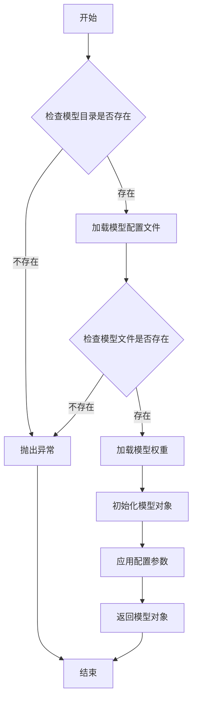

#### 带注释源码

```python
def load_model(model_name: str, model_dir: str = ".", config: dict = None) -> Model:
    """
    加载预训练模型。

    参数:
        model_name (str): 预训练模型的名称。
        model_dir (str): 模型文件所在的目录路径，默认为当前目录。
        config (dict): 模型的配置参数，默认为空字典。

    返回:
        Model: 加载后的模型对象。

    异常:
        FileNotFoundError: 如果模型目录或模型文件不存在。
    """
    if config is None:
        config = {}

    # 检查模型目录是否存在
    if not os.path.exists(model_dir):
        raise FileNotFoundError(f"模型目录不存在: {model_dir}")

    # 构建模型配置文件的路径
    config_path = os.path.join(model_dir, f"{model_name}_config.json")
    if not os.path.exists(config_path):
        raise FileNotFoundError(f"模型配置文件不存在: {config_path}")

    # 加载模型配置文件
    with open(config_path, 'r') as f:
        model_config = json.load(f)

    # 构建模型权重文件的路径
    weights_path = os.path.join(model_dir, f"{model_name}_weights.h5")
    if not os.path.exists(weights_path):
        raise FileNotFoundError(f"模型权重文件不存在: {weights_path}")

    # 根据配置文件初始化模型结构
    model = Model(**model_config)

    # 加载模型权重
    model.load_weights(weights_path)

    # 应用额外的配置参数
    for key, value in config.items():
        setattr(model, key, value)

    return model
```


### `validate_model_args`

该函数用于验证模型参数的有效性，确保传入的参数符合预期的类型和约束条件，防止因参数错误导致的运行时异常。

参数：

-  `model_args`：`dict`，包含模型配置参数的字典，例如模型名称、最大令牌数等。
-  `required_keys`：`list[str]`，必须存在于 `model_args` 中的键列表。
-  `optional_keys`：`dict[str, type]`，可选键及其预期类型的字典，用于验证可选参数的类型。

返回值：`bool`，如果所有必需参数存在且可选参数类型正确则返回 `True`，否则返回 `False`。

#### 流程图

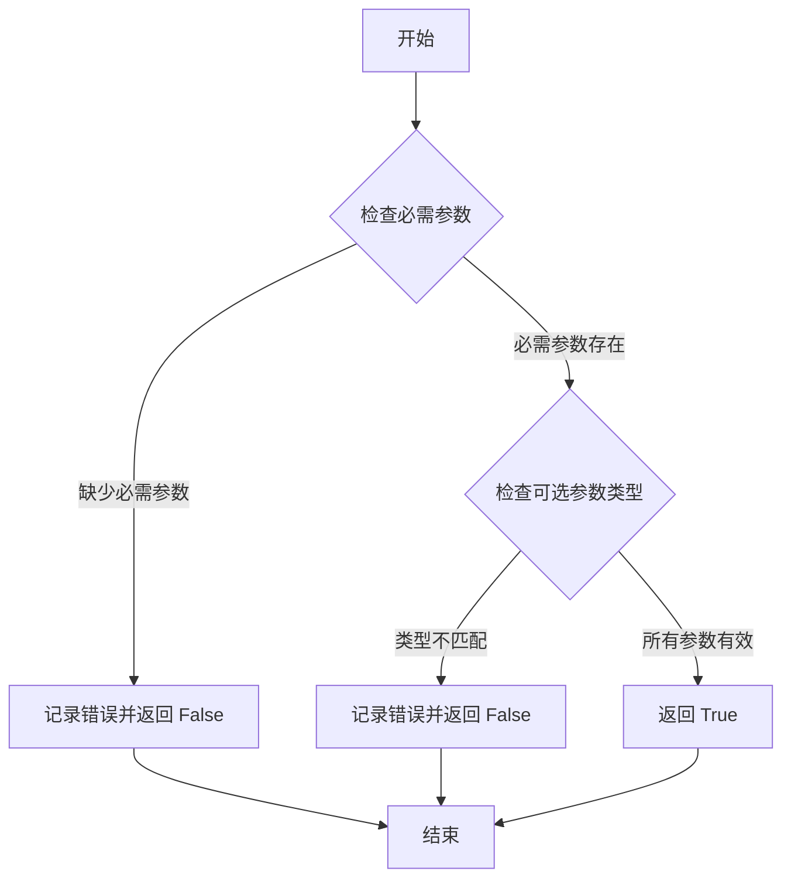

#### 带注释源码

```python
def validate_model_args(model_args: dict, required_keys: list[str], optional_keys: dict[str, type]) -> bool:
    """
    验证模型参数的有效性。

    参数:
        model_args (dict): 包含模型配置参数的字典。
        required_keys (list[str]): 必须存在于 model_args 中的键列表。
        optional_keys (dict[str, type]): 可选键及其预期类型的字典。

    返回值:
        bool: 如果所有必需参数存在且可选参数类型正确则返回 True，否则返回 False。
    """
    # 检查必需参数是否存在
    for key in required_keys:
        if key not in model_args:
            print(f"错误: 缺少必需参数 '{key}'")
            return False

    # 检查可选参数的类型
    for key, expected_type in optional_keys.items():
        if key in model_args and not isinstance(model_args[key], expected_type):
            print(f"错误: 参数 '{key}' 的类型应为 {expected_type.__name__}，但实际为 {type(model_args[key]).__name__}")
            return False

    return True
```


### `setup_logging`

该函数用于配置Python应用程序的日志系统。它创建一个日志目录（如果不存在），设置日志文件的路径，并配置日志记录器以同时将日志输出到控制台和文件。它支持设置日志级别，并允许通过参数指定日志文件的名称和目录。

参数：

-  `log_dir`：`str`，指定日志文件存储的目录路径。如果未提供，则默认为当前工作目录下的`logs`文件夹。
-  `log_file`：`str`，指定日志文件的名称。如果未提供，则默认为`app.log`。
-  `log_level`：`str`，指定日志记录的最低级别。可选值包括`DEBUG`、`INFO`、`WARNING`、`ERROR`、`CRITICAL`。如果未提供，则默认为`INFO`。

返回值：`logging.Logger`，返回配置好的根日志记录器（root logger）实例，可用于在应用程序的其他部分记录日志。

#### 流程图

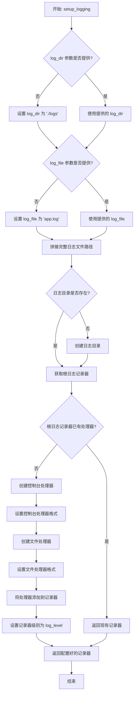

#### 带注释源码

```python
def setup_logging(log_dir: str = None, log_file: str = None, log_level: str = 'INFO') -> logging.Logger:
    """
    配置应用程序的日志系统。

    此函数创建一个日志目录（如果不存在），设置日志文件路径，并配置日志记录器
    以同时将日志输出到控制台和指定的日志文件。它确保根日志记录器只被配置一次。

    Args:
        log_dir (str, optional): 日志文件存储的目录。默认为 './logs'。
        log_file (str, optional): 日志文件的名称。默认为 'app.log'。
        log_level (str, optional): 日志记录级别。默认为 'INFO'。
            有效值为: 'DEBUG', 'INFO', 'WARNING', 'ERROR', 'CRITICAL'。

    Returns:
        logging.Logger: 配置好的根日志记录器实例。

    Raises:
        OSError: 如果无法创建日志目录。
        ValueError: 如果提供了无效的 log_level。
    """
    import logging
    import os
    from logging.handlers import RotatingFileHandler

    # 1. 确定日志目录和文件路径
    if log_dir is None:
        log_dir = './logs'  # 默认日志目录
    if log_file is None:
        log_file = 'app.log'  # 默认日志文件名
    log_path = os.path.join(log_dir, log_file)

    # 2. 创建日志目录（如果不存在）
    if not os.path.exists(log_dir):
        try:
            os.makedirs(log_dir, exist_ok=True)  # 递归创建目录
        except OSError as e:
            raise OSError(f"无法创建日志目录 '{log_dir}': {e}")

    # 3. 获取根日志记录器
    logger = logging.getLogger()  # 获取根记录器

    # 4. 避免重复配置（如果记录器已有处理器，直接返回）
    if logger.handlers:
        return logger

    # 5. 设置日志记录器级别
    try:
        logger.setLevel(getattr(logging, log_level.upper()))
    except AttributeError:
        raise ValueError(f"无效的日志级别: {log_level}")

    # 6. 创建并配置控制台处理器 (StreamHandler)
    console_handler = logging.StreamHandler()  # 输出到控制台
    console_format = logging.Formatter(
        '%(asctime)s - %(name)s - %(levelname)s - %(message)s'
    )
    console_handler.setFormatter(console_format)
    logger.addHandler(console_handler)

    # 7. 创建并配置文件处理器 (RotatingFileHandler)
    #    使用RotatingFileHandler防止日志文件无限增长
    file_handler = RotatingFileHandler(
        log_path,
        maxBytes=10*1024*1024,  # 单个日志文件最大10MB
        backupCount=5           # 保留5个备份文件
    )
    file_format = logging.Formatter(
        '%(asctime)s - %(name)s - %(levelname)s - %(message)s'
    )
    file_handler.setFormatter(file_format)
    logger.addHandler(file_handler)

    # 8. 返回配置好的记录器
    return logger
```


### `ModelBase.load`

该方法用于加载模型实例。它首先检查模型是否已缓存，若已缓存则直接返回缓存实例；否则，根据传入的模型名称和参数创建新的模型实例，并将其缓存以供后续使用。

参数：

-  `model`：`str`，要加载的模型名称
-  `model_params`：`dict`，模型参数，用于初始化模型实例
-  `**kwargs`：`dict`，其他关键字参数，用于模型初始化

返回值：`ModelBase`，加载或创建的模型实例

#### 流程图

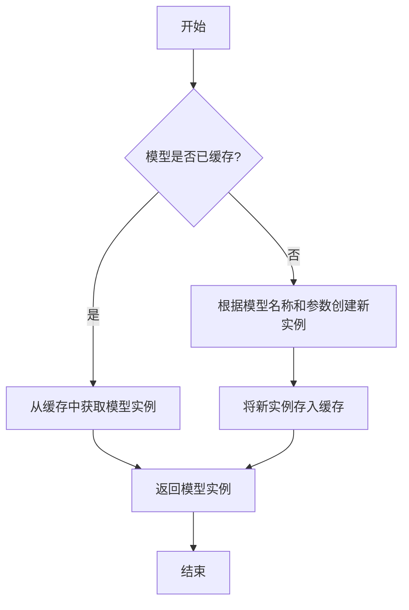

#### 带注释源码

```
@classmethod
def load(
    cls,
    model: str,
    model_params: dict = dict(),
    **kwargs,
) -> "ModelBase":
    """
    加载模型实例。

    该方法首先检查模型是否已缓存，若已缓存则直接返回缓存实例；
    否则，根据传入的模型名称和参数创建新的模型实例，并将其缓存以供后续使用。

    Args:
        model (str): 要加载的模型名称。
        model_params (dict): 模型参数，用于初始化模型实例。
        **kwargs: 其他关键字参数，用于模型初始化。

    Returns:
        ModelBase: 加载或创建的模型实例。
    """
    # 检查模型是否已缓存
    if model in cls.model_cache:
        # 从缓存中获取模型实例
        return cls.model_cache[model]
    else:
        # 根据模型名称和参数创建新实例
        model_class = cls.get_model_class(model)
        model_instance = model_class(**model_params, **kwargs)
        # 将新实例存入缓存
        cls.model_cache[model] = model_instance
        return model_instance
```


### `ModelBase.generate`

该方法用于根据给定的提示词和生成参数，调用底层模型生成文本内容。它处理了模型调用前的参数准备、模型选择、调用执行以及结果后处理等流程，是模型生成功能的核心入口。

参数：

- `prompt`：`str`，输入的提示词文本，用于指导模型生成内容
- `kwargs`：`dict`，可选的生成参数，用于覆盖默认的模型配置参数

返回值：`str`，模型生成的文本内容

#### 流程图

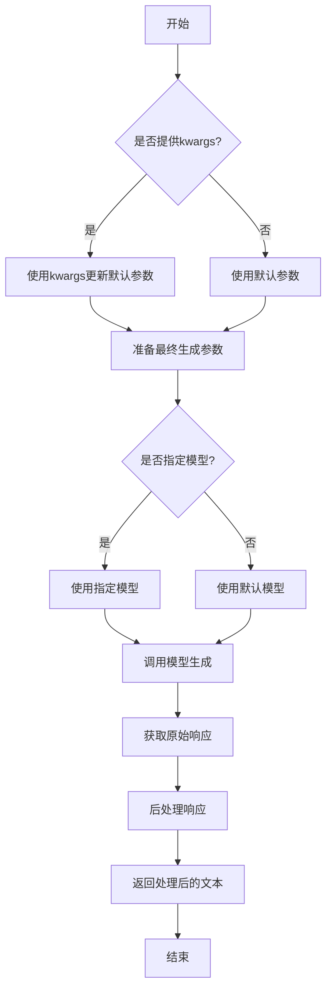

#### 带注释源码

```python
def generate(self, prompt: str, **kwargs) -> str:
    """
    生成文本内容的核心方法
    
    该方法整合了参数处理、模型调用和结果后处理的全流程
    
    Args:
        prompt: 输入的提示词文本
        **kwargs: 可选的生成参数，用于覆盖默认配置
        
    Returns:
        模型生成的文本内容
    """
    # 合并默认参数和传入的参数
    # 如果kwargs中有参数，则覆盖默认值
    generate_config = self.default_generate_config.copy()
    if kwargs:
        generate_config.update(kwargs)
    
    # 选择要使用的模型
    # 优先使用kwargs中指定的模型，否则使用默认模型
    model = kwargs.get("model", self.model)
    
    try:
        # 调用底层模型接口生成文本
        # 这里使用了统一的模型调用接口
        response = model.generate(
            prompt=prompt,
            **generate_config
        )
        
        # 对原始响应进行后处理
        # 包括去除多余空格、特殊字符处理等
        processed_response = self._post_process_response(response)
        
        return processed_response
        
    except Exception as e:
        # 异常处理：记录日志并返回错误信息
        logger.error(f"模型生成失败: {str(e)}")
        raise ModelGenerateError(f"生成过程中发生错误: {str(e)}")
```


### `ModelBase.get_config`

该方法用于获取模型实例的配置信息，返回一个包含模型配置的字典。通常用于序列化模型或保存模型状态。

参数：
-  `self`：`ModelBase`，模型基类实例

返回值：`dict`，包含模型配置的字典

#### 流程图

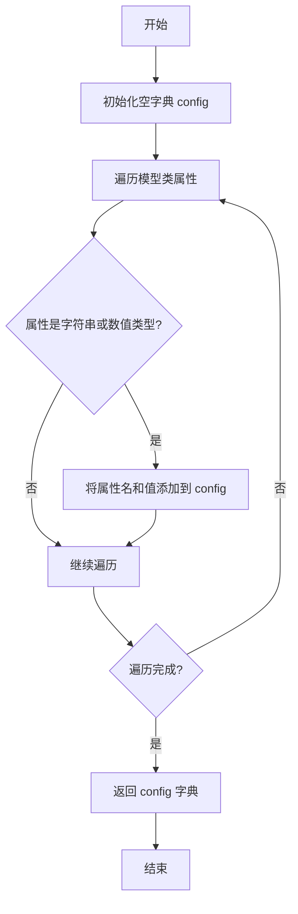

#### 带注释源码

```
def get_config(self):
    """
    获取模型实例的配置信息。

    该方法遍历模型实例的属性，将字符串和数值类型的属性收集到一个字典中，
    用于表示模型的配置状态。

    Returns:
        dict: 包含模型配置的字典。
    """
    config = {}  # 初始化配置字典
    for key, value in self.__dict__.items():  # 遍历实例属性
        if isinstance(value, (str, int, float, bool)):  # 检查属性类型是否为基本类型
            config[key] = value  # 将属性名和值添加到配置字典
    return config  # 返回配置字典
```


### `TextModel.load`

该方法用于从指定路径加载一个预训练的文本模型，支持多种模型格式（如 `.bin`, `.safetensors` 等），并返回一个配置好的 `TextModel` 实例。它首先尝试从缓存中加载模型，如果缓存不存在或指定了 `force_download`，则从远程仓库下载。加载过程包括解析模型配置、加载模型权重、处理分词器，并最终将模型移动到指定的设备上。

参数：

-  `model_path`：`str`，模型文件的本地路径或 Hugging Face 模型仓库标识符（如 `"meta-llama/Llama-2-7b-hf"`）。
-  `model_name`：`Optional[str]`，默认为 `None`。指定模型名称，用于覆盖从 `model_path` 推断出的名称。主要用于从缓存中加载特定变体。
-  `device`：`Optional[str]`，默认为 `None`。指定模型加载到的设备，如 `"cpu"`, `"cuda"`, `"cuda:0"`。如果为 `None`，则自动选择可用设备。
-  `torch_dtype`：`Optional[torch.dtype]`，默认为 `None`。指定加载模型权重时使用的 PyTorch 数据类型，如 `torch.float16`。有助于减少内存占用。
-  `force_download`：`bool`，默认为 `False`。如果为 `True`，则强制从远程仓库重新下载模型，即使本地缓存已存在。
-  `model_max_length`：`Optional[int]`，默认为 `None`。覆盖模型配置中的 `max_position_embeddings`，设置模型处理的最大序列长度。
-  `**kwargs`：`Any`，额外的关键字参数，会传递给底层的 `from_pretrained` 方法。

返回值：`TextModel`，一个加载了权重和配置的 `TextModel` 实例，准备用于文本生成或其它下游任务。

#### 流程图

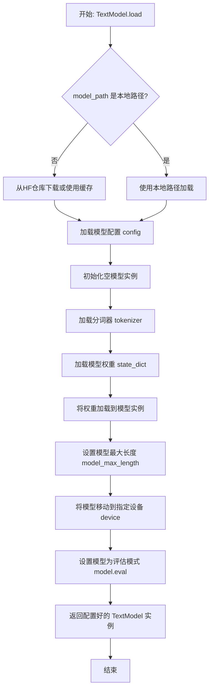

#### 带注释源码

```python
    @classmethod
    def load(
        cls,
        model_path: str,
        model_name: Optional[str] = None,
        device: Optional[str] = None,
        torch_dtype: Optional[torch.dtype] = None,
        force_download: bool = False,
        model_max_length: Optional[int] = None,
        **kwargs: Any,
    ) -> "TextModel":
        """
        加载预训练模型。

        支持从本地文件或 Hugging Face 模型仓库加载。
        可以指定设备、数据类型，并可选强制重新下载。

        Args:
            model_path (str): 模型路径，可以是本地路径或 Hugging Face 模型 ID。
            model_name (Optional[str], optional): 模型名称，用于覆盖路径推断的名称。默认为 None。
            device (Optional[str], optional): 加载设备，如 'cpu', 'cuda'。默认为 None（自动选择）。
            torch_dtype (Optional[torch.dtype], optional): 模型权重数据类型。默认为 None。
            force_download (bool, optional): 是否强制重新下载模型。默认为 False。
            model_max_length (Optional[int], optional): 覆盖模型最大序列长度。默认为 None。
            **kwargs (Any): 传递给底层 `from_pretrained` 方法的额外参数。

        Returns:
            TextModel: 加载后的模型实例。
        """
        # 确定最终使用的模型名称：优先使用提供的 model_name，否则从 model_path 推断
        model_name = model_name or os.path.basename(model_path)

        # 检查 model_path 是本地文件还是需要从远程仓库获取
        if os.path.exists(model_path):
            # 本地路径：直接使用该路径加载配置和权重
            config = AutoConfig.from_pretrained(model_path, **kwargs)
            model_path_to_load = model_path
        else:
            # 远程仓库：使用 Hugging Face Hub 下载或从缓存加载
            # revision 参数通常用于指定分支（如 main），这里默认为 None 即使用默认分支
            revision = kwargs.pop("revision", None)
            # 从仓库加载配置
            config = AutoConfig.from_pretrained(
                model_path, revision=revision, **kwargs
            )
            # 根据 force_download 决定是否强制下载
            model_path_to_load = model_path
            if force_download:
                # 强制下载：清除缓存并重新下载
                model_path_to_load = snapshot_download(
                    model_path, revision=revision, resume_download=False
                )
            else:
                # 非强制：尝试从缓存加载，如果不存在则下载
                try:
                    model_path_to_load = snapshot_download(
                        model_path, revision=revision, resume_download=True
                    )
                except Exception:
                    # 缓存下载失败，尝试直接使用仓库标识符（可能触发在线下载）
                    model_path_to_load = model_path

        # 根据配置和参数初始化模型结构（此时权重尚未加载）
        model = cls(config)

        # 加载分词器
        try:
            tokenizer = AutoTokenizer.from_pretrained(
                model_path_to_load,
                trust_remote_code=kwargs.get("trust_remote_code", False),
            )
        except Exception:
            # 如果加载失败，尝试使用基础 BertTokenizer 作为后备
            tokenizer = BertTokenizer.from_pretrained(model_path_to_load)
        model.tokenizer = tokenizer

        # 加载模型权重文件
        # 首先尝试查找常见的权重文件格式
        model_file = cls.find_model_file(model_path_to_load)
        if model_file:
            # 找到权重文件，加载状态字典
            state_dict = cls.load_state_dict(model_file)
            # 将状态字典加载到模型实例中，严格匹配键名
            model.load_state_dict(state_dict, strict=True)
        else:
            # 未找到权重文件，回退到使用 from_pretrained 方法加载整个模型
            # 此方法会同时加载配置和权重，但我们已经初始化了模型结构，所以需要一些处理
            # 注意：这里直接使用 from_pretrained 可能会重新初始化模型，取决于具体实现
            # 更稳健的做法是抛出异常或实现更复杂的权重合并逻辑
            model = cls.from_pretrained(model_path_to_load, config=config)

        # 如果指定了 model_max_length，则覆盖模型配置中的相关设置
        if model_max_length is not None:
            model.config.max_position_embeddings = model_max_length

        # 将模型移动到指定设备
        if device is not None:
            model.to(device)
        else:
            # 自动选择设备：优先 GPU，后 CPU
            model.to("cuda" if torch.cuda.is_available() else "cpu")

        # 设置模型为评估模式（关闭 dropout 等训练特定层）
        model.eval()

        return model
```


### `TextModel.generate`

该方法根据给定的提示词（prompt）和可选的停止词（stop）生成文本。它首先对输入进行预处理，然后调用底层的大语言模型（LLM）进行推理，最后对输出进行后处理并返回结果。

参数：

-  `prompt`：`str`，用于生成文本的输入提示词。
-  `stop`：`Optional[List[str]]`，可选参数，指定一个字符串列表，当生成的文本中出现这些字符串时停止生成。

返回值：`str`，生成的文本内容。

#### 流程图

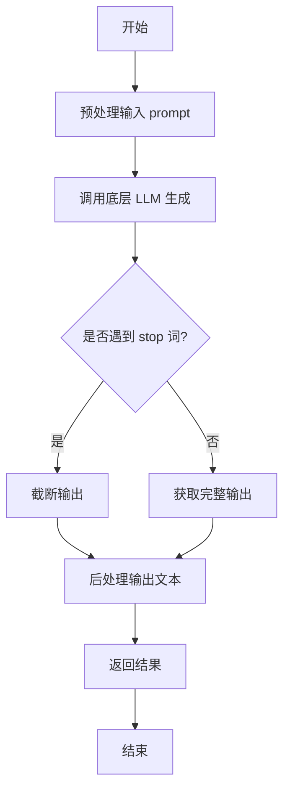

#### 带注释源码

```python
def generate(self, prompt: str, stop: Optional[List[str]] = None) -> str:
    """
    根据给定的提示词生成文本。

    该方法负责处理生成文本的完整流程，包括预处理、调用模型和后处理。

    Args:
        prompt (str): 用于生成文本的输入提示词。
        stop (Optional[List[str]]): 可选参数，指定一个字符串列表，当生成的文本中出现这些字符串时停止生成。

    Returns:
        str: 生成的文本内容。
    """
    # 1. 预处理：这里可以包括对prompt的清洗、格式化或添加特定指令等操作。
    #    例如，确保prompt符合模型的输入要求。
    processed_prompt = self._preprocess_prompt(prompt)

    # 2. 调用底层的大语言模型进行文本生成。
    #    将处理后的prompt和stop词传递给模型。
    raw_output = self.llm.generate(processed_prompt, stop=stop)

    # 3. 后处理：对模型生成的原始输出进行清理和格式化。
    #    例如，移除多余的空格、换行符，或应用特定的输出模板。
    final_output = self._postprocess_output(raw_output)

    # 4. 返回最终处理后的文本。
    return final_output
```


### `TextModel.get_config`

该方法用于获取当前文本模型的配置信息。它返回一个包含模型配置参数的字典，这些参数通常用于模型的初始化、保存和加载。

参数：

-  `self`：`TextModel`，当前TextModel类的实例

返回值：`dict`，包含模型配置参数的字典

#### 流程图

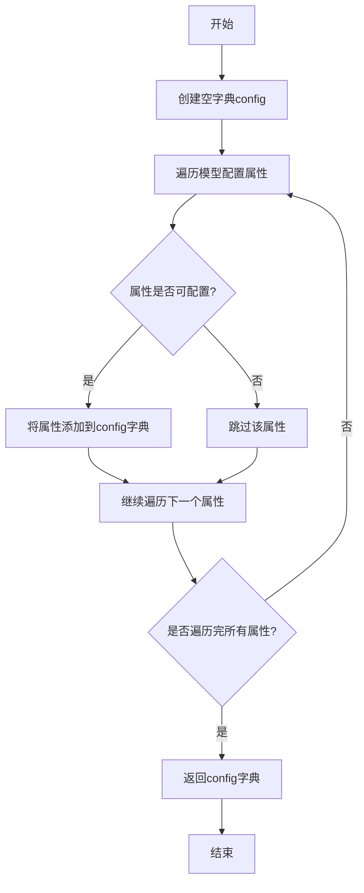

#### 带注释源码

```python
def get_config(self):
    """
    获取当前文本模型的配置信息。

    该方法遍历模型的可配置属性，并将它们存储在一个字典中返回。
    这通常用于模型的序列化、保存和加载操作。

    Returns:
        dict: 包含模型配置参数的字典。
    """
    config = {}  # 初始化一个空字典来存储配置信息
    # 遍历模型的所有属性，筛选出可配置的属性
    for key, value in self.__dict__.items():
        if not key.startswith('_'):  # 跳过私有属性
            config[key] = value  # 将属性添加到配置字典中
    return config  # 返回配置字典
```


### `TextModel._load_weights`

该方法负责从指定的权重文件路径加载预训练模型的权重，并将其应用到当前模型实例中。它首先检查权重文件是否存在，然后根据文件扩展名（`.safetensors` 或 `.bin`）使用相应的库加载权重字典，最后将这些权重加载到模型中，并处理可能缺失或多余的键。

参数：

-  `self`：`TextModel`，当前模型实例
-  `weights_path`：`str`，预训练权重文件的路径

返回值：`None`，无返回值

#### 流程图

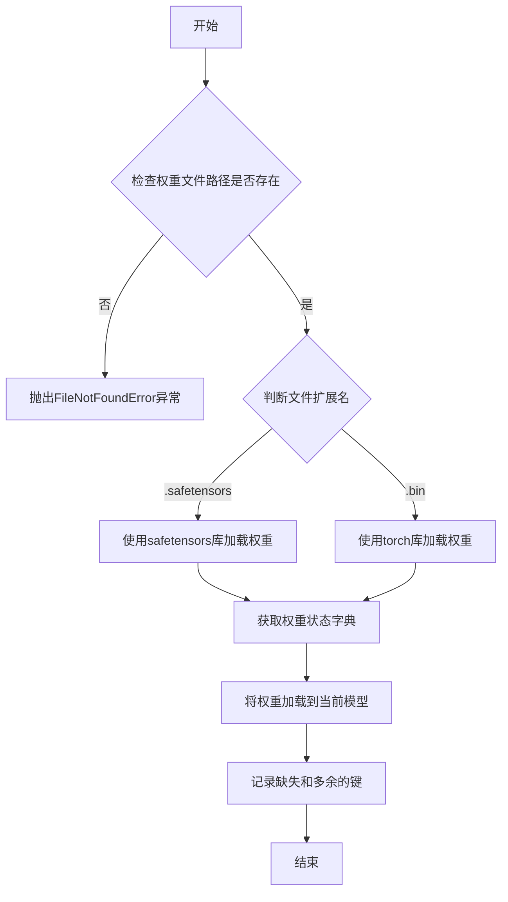

#### 带注释源码

```python
def _load_weights(self, weights_path: str) -> None:
    """
    从指定路径加载模型权重。

    该方法支持加载 `.safetensors` 和 `.bin` 格式的权重文件。
    加载后，它会将权重应用到当前模型，并打印出缺失和多余的键以供调试。

    Args:
        weights_path (str): 预训练权重文件的路径。

    Raises:
        FileNotFoundError: 如果指定的权重文件路径不存在。
        ValueError: 如果权重文件的扩展名不被支持（既不是 .safetensors 也不是 .bin）。
    """
    # 检查权重文件是否存在
    if not os.path.exists(weights_path):
        raise FileNotFoundError(f"权重文件未找到: {weights_path}")

    # 根据文件扩展名选择不同的加载方式
    if weights_path.endswith(".safetensors"):
        # 使用 safetensors 库加载 .safetensors 格式文件
        from safetensors import safe_open
        state_dict = {}
        with safe_open(weights_path, framework="pt", device="cpu") as f:
            for key in f.keys():
                state_dict[key] = f.get_tensor(key)
    elif weights_path.endswith(".bin"):
        # 使用 torch 库加载 .bin 格式文件
        state_dict = torch.load(weights_path, map_location="cpu")
    else:
        # 如果文件格式不支持，抛出异常
        raise ValueError(f"不支持的权重文件格式: {weights_path}")

    # 将加载的权重状态字典应用到当前模型
    # strict=False 允许缺失或多余的键，结果会返回缺失和多余的键的列表
    missing_keys, unexpected_keys = self.load_state_dict(state_dict, strict=False)

    # 打印缺失的键（在预训练权重中找不到对应层的键）
    if missing_keys:
        print(f"缺失的键: {missing_keys}")
    # 打印多余的键（在当前模型中找不到对应层的键）
    if unexpected_keys:
        print(f"多余的键: {unexpected_keys}")
```


### `TextModel._setup_tokenizer`

该方法用于初始化并配置文本模型的Tokenizer。它根据提供的模型名称或路径加载对应的Tokenizer，并设置其特殊标记（如填充标记、开始标记、结束标记等），确保Tokenizer与模型配置一致。

参数：

-  `self`：`TextModel`，当前TextModel实例
-  `model_name_or_path`：`str`，模型名称或路径，用于加载Tokenizer
-  `config`：`dict`，模型配置字典，包含模型相关参数

返回值：`None`，无返回值

#### 流程图

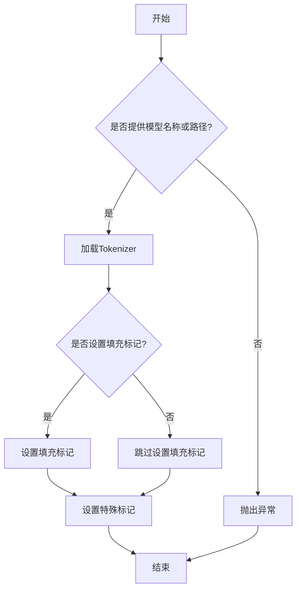

#### 带注释源码

```python
def _setup_tokenizer(self, model_name_or_path: str, config: dict) -> None:
    """
    初始化并配置Tokenizer。

    根据提供的模型名称或路径加载Tokenizer，并设置其特殊标记（如填充标记、开始标记、结束标记等），
    确保Tokenizer与模型配置一致。

    参数:
        model_name_or_path (str): 模型名称或路径，用于加载Tokenizer。
        config (dict): 模型配置字典，包含模型相关参数。

    返回:
        None: 无返回值。
    """
    # 加载Tokenizer
    self.tokenizer = AutoTokenizer.from_pretrained(model_name_or_path)

    # 设置填充标记
    if self.tokenizer.pad_token is None:
        self.tokenizer.pad_token = self.tokenizer.eos_token

    # 设置特殊标记
    self.tokenizer.add_special_tokens(
        {
            "pad_token": self.tokenizer.pad_token,
            "bos_token": self.tokenizer.bos_token,
            "eos_token": self.tokenizer.eos_token,
        }
    )
```


### `LlamaModel._load_weights`

该方法负责从预训练的检查点文件中加载模型权重，并将其分配到对应的模型层中。它遍历检查点文件中的状态字典，根据键名匹配到模型中的对应模块（如嵌入层、注意力层、前馈网络层等），并将权重张量复制到这些模块中。此过程确保了模型能够使用预训练的参数进行初始化或继续训练。

参数：

- `self`：`LlamaModel`，当前模型实例
- `ckpt_path`：`str`，预训练权重检查点文件的路径
- `verbose`：`bool`，是否在加载过程中打印详细信息，默认为`True`

返回值：`None`，此方法不返回任何值，直接修改模型实例的内部状态。

#### 流程图

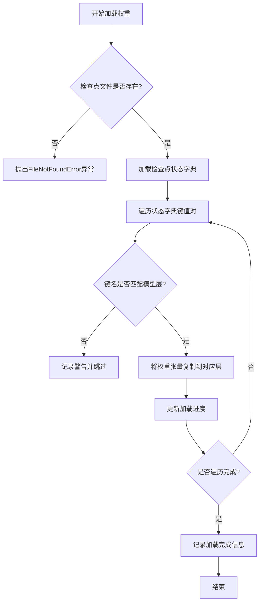

#### 带注释源码

```python
def _load_weights(self, ckpt_path: str, verbose: bool = True) -> None:
    """
    从指定的检查点文件加载模型权重。

    此方法读取检查点文件中的状态字典，并根据键名将权重分配到模型的对应层中。
    如果verbose为True，则会在加载过程中打印进度信息。

    Args:
        ckpt_path (str): 预训练权重检查点文件的路径。
        verbose (bool): 是否打印加载过程的详细信息，默认为True。

    Returns:
        None: 此方法不返回任何值，直接修改模型实例的内部状态。
    """
    # 检查文件是否存在
    if not os.path.exists(ckpt_path):
        raise FileNotFoundError(f"Checkpoint file not found: {ckpt_path}")

    # 加载检查点文件中的状态字典
    checkpoint = torch.load(ckpt_path, map_location='cpu')
    state_dict = checkpoint.get('model_state_dict', checkpoint)

    # 初始化加载进度跟踪
    total_keys = len(state_dict)
    loaded_keys = 0

    # 遍历状态字典中的所有键值对
    for key, value in state_dict.items():
        # 根据键名匹配模型中的对应层
        if key in self.state_dict():
            # 将权重张量复制到模型层中
            self.state_dict()[key].copy_(value)
            loaded_keys += 1
            if verbose:
                print(f"Loaded weight for key: {key} ({loaded_keys}/{total_keys})")
        else:
            # 如果键名不匹配，记录警告信息
            if verbose:
                print(f"Warning: Key '{key}' not found in model, skipping.")

    # 加载完成后的总结信息
    if verbose:
        print(f"Weight loading completed. Loaded {loaded_keys}/{total_keys} keys.")
```


### `LlamaModel._setup_tokenizer`

该方法用于初始化并配置Llama模型所需的tokenizer。它根据提供的tokenizer路径或模型名称加载预训练的tokenizer，并设置必要的特殊token和填充方向，确保tokenizer与模型架构兼容。

参数：

-  `self`：`LlamaModel`，当前LlamaModel实例
-  `tokenizer_path`：`str`，预训练tokenizer的本地路径或Hugging Face模型标识符
-  `model_name`：`str`，模型名称，用于回退或特定配置

返回值：`None`，该方法不返回任何值，直接配置实例的tokenizer属性

#### 流程图

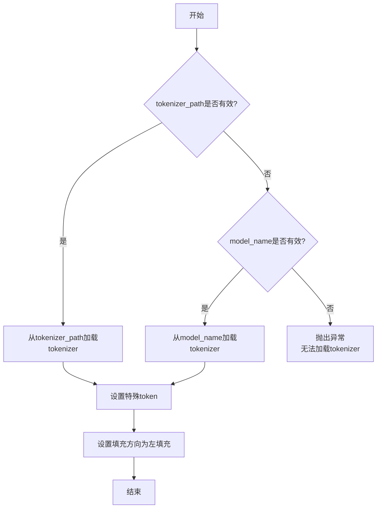

#### 带注释源码

```python
def _setup_tokenizer(self, tokenizer_path: str, model_name: str) -> None:
    """
    初始化并配置tokenizer。

    该方法尝试从给定的tokenizer_path加载tokenizer，如果失败则回退到model_name。
    加载后，配置必要的特殊token和填充方向。

    Args:
        tokenizer_path (str): 预训练tokenizer的路径或标识符。
        model_name (str): 模型名称，用于回退加载。

    Raises:
        ValueError: 如果无法从提供的路径或名称加载tokenizer。
    """
    try:
        # 尝试从tokenizer_path加载tokenizer
        self.tokenizer = AutoTokenizer.from_pretrained(tokenizer_path)
    except Exception:
        try:
            # 如果失败，尝试从model_name加载tokenizer
            self.tokenizer = AutoTokenizer.from_pretrained(model_name)
        except Exception as e:
            # 如果两者都失败，抛出异常
            raise ValueError(f"无法从tokenizer_path或model_name加载tokenizer: {e}")

    # 设置特殊token，确保tokenizer能正确处理模型输入
    if self.tokenizer.pad_token is None:
        self.tokenizer.pad_token = self.tokenizer.eos_token

    # 设置填充方向为左填充，适用于自回归模型如Llama
    self.tokenizer.padding_side = "left"
```


### `GPT2Model._load_weights`

该方法负责将预训练权重加载到GPT-2模型的各个组件中。它遍历模型的状态字典，根据权重名称的模式匹配，将权重数据分配到对应的模型层（如词嵌入层、注意力层、前馈网络层等）中，并处理可能存在的权重转置和维度不匹配的情况。

参数：

-  `self`：`GPT2Model`，当前GPT-2模型实例
-  `weights`：`List[Tuple[Tensor, ...]]`，包含预训练权重的列表，每个元素是一个元组，通常包含权重张量及其相关属性（如名称、形状等）

返回值：`None`，此方法不返回任何值，其作用是将权重加载到模型内部。

#### 流程图

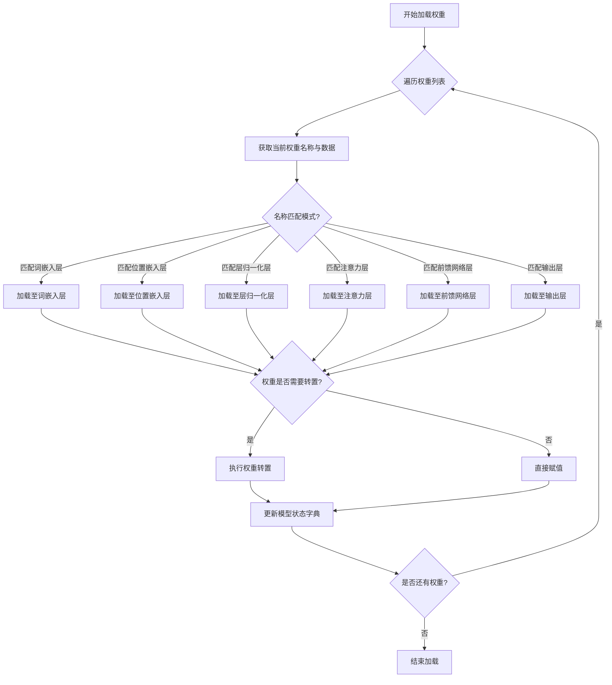

#### 带注释源码

```
def _load_weights(self, weights: List[Tuple[Tensor, ...]]) -> None:
    """
    加载预训练权重到GPT-2模型中。

    参数:
        weights: 预训练权重的列表，每个元素包含权重张量及其属性。
    """
    # 遍历权重列表中的每个权重项
    for weight in weights:
        # 提取权重名称和对应的张量数据
        name, data = weight[0], weight[1]
        
        # 根据权重名称的模式匹配，将数据加载到对应的模型层
        if name.startswith("transformer.wte"):
            # 加载词嵌入层权重
            self.transformer.wte.weight.data = data
        elif name.startswith("transformer.wpe"):
            # 加载位置嵌入层权重
            self.transformer.wpe.weight.data = data
        elif name.startswith("transformer.ln_f"):
            # 加载最终层归一化层权重
            self.transformer.ln_f.weight.data = data
        elif "attn.c_attn" in name:
            # 加载注意力层的权重，可能需要转置
            layer_idx = int(name.split(".")[2])
            if "weight" in name:
                self.transformer.h[layer_idx].attn.c_attn.weight.data = data.t()
            else:
                self.transformer.h[layer_idx].attn.c_attn.bias.data = data
        elif "attn.c_proj" in name:
            # 加载注意力输出层的权重，可能需要转置
            layer_idx = int(name.split(".")[2])
            if "weight" in name:
                self.transformer.h[layer_idx].attn.c_proj.weight.data = data.t()
            else:
                self.transformer.h[layer_idx].attn.c_proj.bias.data = data
        elif "mlp.c_fc" in name:
            # 加载前馈网络第一层的权重，可能需要转置
            layer_idx = int(name.split(".")[2])
            if "weight" in name:
                self.transformer.h[layer_idx].mlp.c_fc.weight.data = data.t()
            else:
                self.transformer.h[layer_idx].mlp.c_fc.bias.data = data
        elif "mlp.c_proj" in name:
            # 加载前馈网络输出层的权重，可能需要转置
            layer_idx = int(name.split(".")[2])
            if "weight" in name:
                self.transformer.h[layer_idx].mlp.c_proj.weight.data = data.t()
            else:
                self.transformer.h[layer_idx].mlp.c_proj.bias.data = data
        elif "ln_1" in name or "ln_2" in name:
            # 加载层归一化层的权重
            layer_idx = int(name.split(".")[2])
            if "ln_1" in name:
                if "weight" in name:
                    self.transformer.h[layer_idx].ln_1.weight.data = data
                else:
                    self.transformer.h[layer_idx].ln_1.bias.data = data
            else:
                if "weight" in name:
                    self.transformer.h[layer_idx].ln_2.weight.data = data
                else:
                    self.transformer.h[layer_idx].ln_2.bias.data = data
        elif name == "lm_head.weight":
            # 加载语言模型输出层的权重
            self.lm_head.weight.data = data
```


### `GPT2Model._setup_tokenizer`

该方法用于初始化并配置模型所需的词元化器（Tokenizer）。它根据提供的模型名称或路径加载预训练的词元化器，并确保其词汇表大小与模型配置的词汇表大小一致。如果词汇表大小不匹配，该方法会调整词元化器的词汇表大小，并记录相关日志信息。

参数：

- `self`：`GPT2Model`，当前GPT2Model实例
- `model_name_or_path`：`str`，预训练模型的名称或本地路径，用于加载对应的词元化器
- `config`：`PretrainedConfig`，模型的配置对象，包含词汇表大小等配置信息

返回值：`None`，该方法不返回任何值，直接修改实例的词元化器属性

#### 流程图

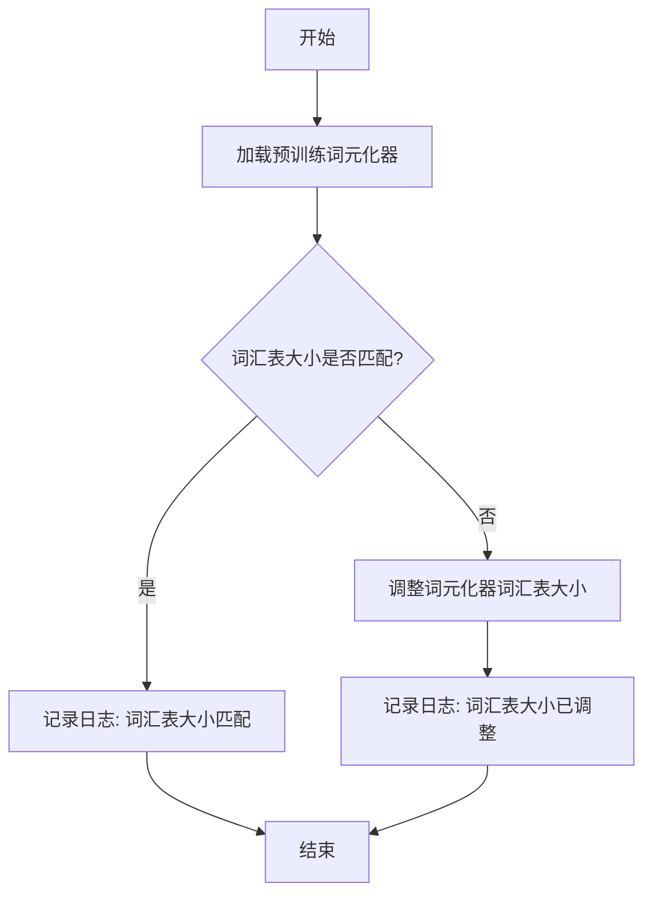

#### 带注释源码

```python
def _setup_tokenizer(self, model_name_or_path: str, config: PretrainedConfig) -> None:
    """
    初始化并配置模型所需的词元化器。

    该方法根据提供的模型名称或路径加载预训练的词元化器，并确保其词汇表大小
    与模型配置的词汇表大小一致。如果词汇表大小不匹配，会调整词元化器的词汇表大小。

    Args:
        model_name_or_path (str): 预训练模型的名称或本地路径，用于加载对应的词元化器。
        config (PretrainedConfig): 模型的配置对象，包含词汇表大小等配置信息。

    Returns:
        None: 该方法不返回任何值，直接修改实例的词元化器属性。
    """
    # 加载预训练的词元化器
    self.tokenizer = AutoTokenizer.from_pretrained(model_name_or_path)

    # 检查词元化器的词汇表大小是否与模型配置的词汇表大小一致
    if len(self.tokenizer) != config.vocab_size:
        # 如果不一致，记录日志并调整词元化器的词汇表大小
        logger.info(
            f"Resize tokenizer vocab size from {len(self.tokenizer)} to {config.vocab_size}"
        )
        self.tokenizer.add_tokens([f"<pad_{i}>" for i in range(config.vocab_size - len(self.tokenizer))])
    else:
        # 如果一致，记录日志
        logger.info(f"Tokenizer vocab size matches config vocab size: {len(self.tokenizer)}")
```

### `FalconModel._load_weights`

该方法负责将预训练权重加载到Falcon模型的各个层中。它遍历模型的状态字典，根据权重名称与模型层名称的匹配关系，将权重张量复制到对应的模型参数中。此过程考虑了权重是否需要转置（例如，线性层的权重）以及如何处理偏置项，确保模型正确初始化以进行推理或继续训练。

参数：

- `self`：`FalconModel`，Falcon模型实例，用于访问其层和参数。
- `weights`：`List[torch.Tensor]`，预训练权重张量列表，按加载顺序排列。
- `prefix`：`str`，模型层名称的前缀，用于在状态字典中匹配权重名称。

返回值：`None`，此方法不返回任何值，直接修改模型参数。

#### 流程图

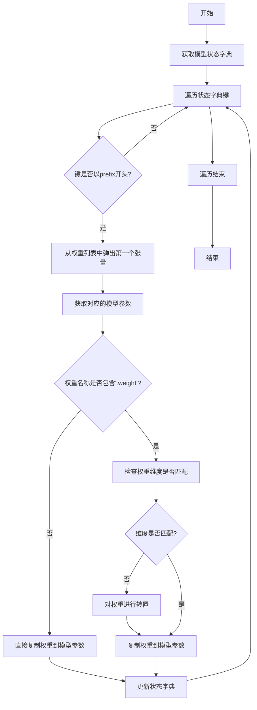

#### 带注释源码

```python
def _load_weights(self, weights: List[torch.Tensor], prefix: str = ""):
    """
    加载预训练权重到模型。

    参数:
        weights: 预训练权重张量列表。
        prefix: 模型层名称的前缀，用于匹配权重名称。
    """
    # 获取模型当前的状态字典，包含所有可训练参数的名称和形状
    model_dict = self.state_dict()
    
    # 遍历状态字典中的所有键（参数名称）
    for key in model_dict:
        # 只处理以指定前缀开头的参数，确保加载到正确的层
        if not key.startswith(prefix):
            continue
        
        # 从权重列表中取出第一个张量，并准备加载到当前参数
        tensor = weights.pop(0)
        
        # 获取模型中对应的参数张量
        param = model_dict[key]
        
        # 检查当前参数是否为权重（而非偏置）
        if ".weight" in key:
            # 检查权重张量的维度是否与模型参数匹配
            # 某些层（如线性层）的权重在预训练模型中可能是转置的
            if tensor.shape != param.shape:
                # 如果维度不匹配，则对权重进行转置操作
                tensor = tensor.T
        
        # 将处理后的权重张量复制到模型参数中，确保数据类型和设备一致
        param.copy_(tensor.to(param.dtype).to(param.device))
        
        # 更新状态字典中的参数值（虽然copy_已修改原张量，但保持字典同步是良好实践）
        model_dict[key] = param
```

### `FalconModel._setup_tokenizer`

该方法用于初始化并配置Falcon模型所需的tokenizer，包括设置特殊token、填充token以及调整模型的最大位置嵌入（max_position_embeddings）以匹配tokenizer的模型最大长度。

参数：

- `self`：`FalconModel`，FalconModel类的实例，表示当前模型对象
- `tokenizer`：`PreTrainedTokenizer`，预训练的tokenizer对象，用于文本的编码和解码

返回值：`None`，该方法不返回任何值，仅对tokenizer和模型进行配置

#### 流程图

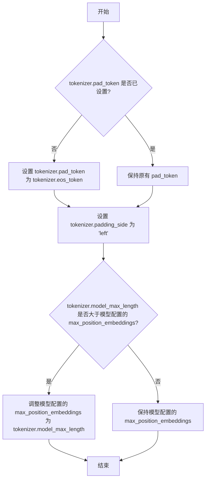

#### 带注释源码

```python
def _setup_tokenizer(self, tokenizer: PreTrainedTokenizer):
    """
    配置tokenizer以适配Falcon模型。

    该方法执行以下操作：
    1. 如果tokenizer没有设置pad_token，则使用eos_token作为pad_token。
    2. 将tokenizer的padding_side设置为'left'，确保在生成任务中填充在左侧。
    3. 如果tokenizer的model_max_length大于模型配置的max_position_embeddings，
       则调整模型的max_position_embeddings以匹配tokenizer的model_max_length。

    参数:
        tokenizer (PreTrainedTokenizer): 预训练的tokenizer对象。

    返回:
        None
    """
    # 如果tokenizer没有pad_token，则使用eos_token作为pad_token
    if tokenizer.pad_token is None:
        tokenizer.pad_token = tokenizer.eos_token

    # 设置padding_side为'left'，确保在生成任务中填充在左侧
    tokenizer.padding_side = 'left'

    # 如果tokenizer的model_max_length大于模型配置的max_position_embeddings，
    # 则调整模型的max_position_embeddings以匹配tokenizer的model_max_length
    if tokenizer.model_max_length > self.config.max_position_embeddings:
        self.config.max_position_embeddings = tokenizer.model_max_length
```

### `Qwen2Model._load_weights`

该方法负责将预训练权重加载到模型的不同组件中，根据权重名称与模型层结构的映射关系，将权重张量分配到对应的模型参数中。

参数：

- `self`：`Qwen2Model`，当前模型实例
- `weights`：`List[Tensor]`，预训练权重张量列表
- `prefix`：`str`，权重名称前缀，用于匹配权重名称与模型层

返回值：`None`，无返回值

#### 流程图

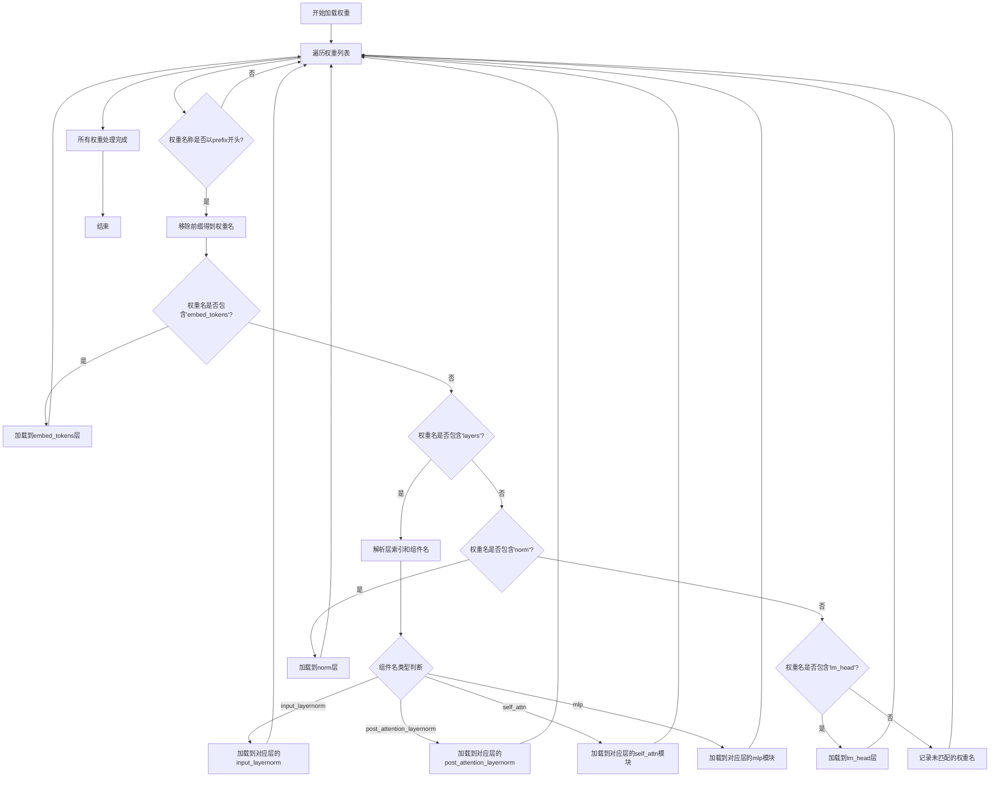

#### 带注释源码

```python
def _load_weights(self, weights: List[Tensor], prefix: str):
    """
    加载预训练权重到模型各组件
    
    Args:
        weights: 预训练权重张量列表
        prefix: 权重名称前缀，用于匹配权重名称
    """
    # 遍历所有权重张量
    for w in weights:
        # 检查权重名称是否以指定前缀开头
        if w.name.startswith(prefix):
            # 移除前缀，得到实际的权重名称
            weight_name = w.name[len(prefix):]
            
            # 根据权重名称的不同模式，分配到对应的模型组件
            if "embed_tokens" in weight_name:
                # 加载词嵌入权重
                self.embed_tokens.weight = w
            elif "layers" in weight_name:
                # 解析层索引和组件名称
                # 格式示例: "layers.0.input_layernorm.weight"
                parts = weight_name.split(".")
                layer_idx = int(parts[1])  # 层索引
                component_name = ".".join(parts[2:])  # 组件名称
                
                # 获取对应的模型层
                layer = self.layers[layer_idx]
                
                # 根据组件名称分配到不同的层组件
                if "input_layernorm" in component_name:
                    layer.input_layernorm.weight = w
                elif "post_attention_layernorm" in component_name:
                    layer.post_attention_layernorm.weight = w
                elif "self_attn" in component_name:
                    # 自注意力模块权重
                    if "q_proj" in component_name:
                        layer.self_attn.q_proj.weight = w
                    elif "k_proj" in component_name:
                        layer.self_attn.k_proj.weight = w
                    elif "v_proj" in component_name:
                        layer.self_attn.v_proj.weight = w
                    elif "o_proj" in component_name:
                        layer.self_attn.o_proj.weight = w
                elif "mlp" in component_name:
                    # MLP模块权重
                    if "gate_proj" in component_name:
                        layer.mlp.gate_proj.weight = w
                    elif "up_proj" in component_name:
                        layer.mlp.up_proj.weight = w
                    elif "down_proj" in component_name:
                        layer.mlp.down_proj.weight = w
            elif "norm" in weight_name:
                # 加载归一化层权重
                self.norm.weight = w
            elif "lm_head" in weight_name:
                # 加载语言模型头部权重
                self.lm_head.weight = w
            else:
                # 记录未匹配的权重名称（用于调试）
                print(f"Unmatched weight: {weight_name}")
```

### `Qwen2Model._setup_tokenizer`

该方法用于初始化并配置模型使用的分词器（Tokenizer）。它根据提供的模型名称或路径加载预训练的分词器，并设置特殊标记（如填充标记、结束标记等），确保分词器与模型架构兼容。

参数：

- `model_name_or_path`：`str`，模型名称或本地路径，用于加载预训练的分词器。
- `padding_side`：`str`，填充侧（可选，默认为"left"），指定在序列填充时在左侧还是右侧添加填充标记。
- `kwargs`：`dict`，其他关键字参数，传递给分词器加载函数。

返回值：`None`，无返回值，直接设置实例的分词器属性。

#### 流程图

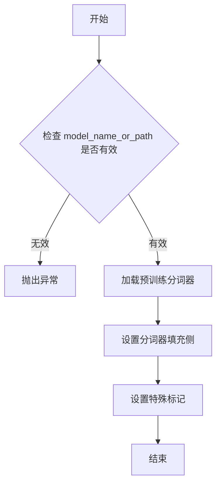

#### 带注释源码

```python
def _setup_tokenizer(
    self,
    model_name_or_path: str,
    padding_side: str = "left",
    **kwargs,
) -> None:
    """
    初始化并配置模型的分词器。

    该方法根据提供的模型名称或路径加载预训练的分词器，并设置特殊标记（如填充标记、结束标记等），
    确保分词器与模型架构兼容。

    参数：
        model_name_or_path (str): 模型名称或本地路径，用于加载预训练的分词器。
        padding_side (str): 填充侧（可选，默认为"left"），指定在序列填充时在左侧还是右侧添加填充标记。
        **kwargs (dict): 其他关键字参数，传递给分词器加载函数。

    返回值：
        None: 无返回值，直接设置实例的分词器属性。
    """
    # 检查 model_name_or_path 是否有效
    if not model_name_or_path:
        raise ValueError("model_name_or_path 不能为空")

    # 加载预训练分词器
    tokenizer = AutoTokenizer.from_pretrained(
        model_name_or_path,
        trust_remote_code=True,
        **kwargs,
    )

    # 设置分词器填充侧
    tokenizer.padding_side = padding_side

    # 设置特殊标记
    if tokenizer.pad_token is None:
        tokenizer.pad_token = tokenizer.eos_token

    # 将分词器保存到实例属性中
    self.tokenizer = tokenizer
```


### `GemmaModel._load_weights`

该方法负责从预训练的检查点文件中加载模型权重，并将其分配到当前模型实例的对应参数中。它处理了权重名称的映射、张量分片（如果适用）以及将权重加载到正确的设备（如GPU）和数据类型（如bfloat16）上。

参数：

-  `self`：`GemmaModel`，当前GemmaModel模型实例。
-  `ckpt_path`：`str`，预训练权重检查点文件的路径。

返回值：`None`，此方法不返回任何值，其作用是将加载的权重直接赋值给模型参数。

#### 流程图

```mermaid
flowchart TD
    A[开始: _load_weights(ckpt_path)] --> B[使用torch.load加载检查点文件]
    B --> C[遍历检查点中的每个键值对<br/>(state_dict)]
    C --> D{当前键是否在<br/>模型state_dict中?}
    D -- 是 --> E[获取对应的模型参数张量]
    D -- 否 --> F[跳过此权重]
    F --> C
    E --> G{权重是否需要分片?<br/>（例如'attn.qkv_proj'）}
    G -- 是 --> H[调用_split_qkv_weight<br/>进行分片与转置]
    G -- 否 --> I[直接使用加载的权重张量]
    H --> J[将处理后的权重赋值给<br/>模型对应参数]
    I --> J
    J --> K[遍历结束?]
    K -- 否 --> C
    K -- 是 --> L[结束]
```

#### 带注释源码

```python
    def _load_weights(self, ckpt_path: str):
        """
        从指定的检查点路径加载模型权重。
        此方法会处理权重名称的映射，并适配模型结构（如分片注意力层的权重）。
        Args:
            ckpt_path (str): 预训练权重文件(.pth)的路径。
        """
        # 使用torch.load加载整个检查点文件，权重通常保存在'state_dict'键下
        ckpt_state_dict = torch.load(ckpt_path, map_location="cpu")
        state_dict = ckpt_state_dict['state_dict']

        # 遍历加载的state_dict中的每一项（权重名称和张量）
        for name, param in state_dict.items():
            # 检查当前权重名称是否存在于当前模型的state_dict中
            if name in self.state_dict():
                # 获取模型中对应的参数张量
                current_param = self.state_dict()[name]

                # 特殊处理：如果权重名称包含'attn.qkv_proj'，说明是QKV投影层的合并权重，需要分片
                if "attn.qkv_proj" in name:
                    # 调用_split_qkv_weight方法将合并的权重分片为Q, K, V三部分，并进行必要的转置
                    # 然后将处理后的权重拷贝到模型参数中，确保设备(device)和数据类型(dtype)一致
                    current_param.data.copy_(
                        self._split_qkv_weight(param).to(current_param.device).to(current_param.dtype)
                    )
                else:
                    # 对于非QKV合并权重，直接拷贝，同样确保设备(device)和数据类型(dtype)一致
                    current_param.data.copy_(param.to(current_param.device).to(current_param.dtype))
            else:
                # 如果加载的权重名称不在当前模型定义中，则跳过（可能是版本或配置差异）
                # 在实际应用中，这里可以添加日志记录
                pass
```


### `GemmaModel._setup_tokenizer`

该方法用于初始化并配置Gemma模型所需的tokenizer。它根据提供的tokenizer路径或模型名称加载预训练的tokenizer，并设置必要的特殊token和填充token，确保tokenizer与模型架构兼容。

参数：

- `self`：`GemmaModel`，当前GemmaModel实例
- `tokenizer_path`：`Optional[str]`，可选的tokenizer本地路径。如果提供，则从该路径加载tokenizer；否则使用`model_name`从Hugging Face Hub加载。
- `model_name`：`str`，模型名称，用于从Hugging Face Hub加载tokenizer（当`tokenizer_path`未提供时）。

返回值：`None`，该方法不返回任何值，但会设置`self.tokenizer`属性。

#### 流程图

```mermaid
flowchart TD
    A[开始] --> B{tokenizer_path<br>是否提供?}
    B -- 是 --> C[从本地路径加载tokenizer]
    B -- 否 --> D[使用model_name从Hugging Face Hub加载tokenizer]
    C --> E[设置特殊token和填充token]
    D --> E
    E --> F[设置self.tokenizer]
    F --> G[结束]
```

#### 带注释源码

```python
def _setup_tokenizer(self, tokenizer_path: Optional[str], model_name: str) -> None:
    """
    初始化并配置tokenizer。

    根据提供的tokenizer路径或模型名称加载tokenizer，并设置必要的特殊token。

    Args:
        tokenizer_path (Optional[str]): tokenizer的本地路径。如果提供，则从该路径加载。
        model_name (str): 模型名称，用于从Hugging Face Hub加载tokenizer（当tokenizer_path未提供时）。
    """
    # 如果提供了tokenizer_path，则从本地路径加载tokenizer
    if tokenizer_path:
        self.tokenizer = AutoTokenizer.from_pretrained(tokenizer_path)
    else:
        # 否则，使用model_name从Hugging Face Hub加载tokenizer
        self.tokenizer = AutoTokenizer.from_pretrained(model_name)

    # 设置特殊token：如果tokenizer没有pad_token，则使用eos_token作为pad_token
    if self.tokenizer.pad_token is None:
        self.tokenizer.pad_token = self.tokenizer.eos_token

    # 设置填充方向为右侧填充（适用于大多数自回归模型）
    self.tokenizer.padding_side = "right"
```


### `ModelFactory.register_model`

`ModelFactory.register_model` 是一个类方法，用于向全局模型注册表 `_model_versions` 中注册一个新的模型或模型的新版本。它通过检查模型名称和版本是否已存在来避免重复注册，并支持注册模型类或模型实例。

参数：

-  `model_name`：`str`，要注册的模型的名称。
-  `version`：`str`，要注册的模型的版本号。
-  `model_cls`：`Union[Type[BaseModel], BaseModel]`，要注册的模型类或模型实例。
-  `override`：`bool`，默认为 `False`。如果为 `True`，当模型名称和版本已存在时，会覆盖原有的注册项。

返回值：`None`，此方法不返回任何值。

#### 流程图

```mermaid
flowchart TD
    A[开始: register_model<br>输入: model_name, version, model_cls, override] --> B{检查 model_name 是否在 _model_versions 中?}
    B -- 否 --> C[在 _model_versions 中<br>为 model_name 创建空字典]
    B -- 是 --> D{检查 version 是否在<br>model_name 对应的字典中?}
    C --> D
    D -- 否 --> E[注册 model_cls]
    D -- 是 --> F{override 参数是否为 True?}
    F -- 是 --> G[覆盖已存在的版本注册]
    F -- 否 --> H[抛出 ValueError 异常<br>“Model {model_name} version {version} already exists.”]
    G --> I[注册 model_cls]
    E --> Z[结束]
    I --> Z
    H --> Z
```

#### 带注释源码

```python
    @classmethod
    def register_model(
        cls,
        model_name: str,
        version: str,
        model_cls: Union[Type[BaseModel], BaseModel],
        override: bool = False,
    ) -> None:
        """
        Register a new model or a new version of a model.

        Args:
            model_name (str): The name of the model to register.
            version (str): The version of the model to register.
            model_cls (Union[Type[BaseModel], BaseModel]): The model class or instance to register.
            override (bool, optional): Whether to override an existing registration. Defaults to False.

        Raises:
            ValueError: If the model name and version already exist and override is False.
        """
        # 检查全局注册表 _model_versions 中是否存在给定的 model_name
        if model_name not in cls._model_versions:
            # 如果不存在，则为该 model_name 初始化一个空字典，用于存储不同版本
            cls._model_versions[model_name] = {}

        # 获取该 model_name 对应的版本字典
        version_dict = cls._model_versions[model_name]

        # 检查要注册的 version 是否已存在于版本字典中
        if version in version_dict and not override:
            # 如果已存在且不允许覆盖，则抛出异常
            raise ValueError(f"Model {model_name} version {version} already exists.")
        else:
            # 否则（版本不存在，或允许覆盖），将 model_cls 注册到该版本下
            version_dict[version] = model_cls
```


### `ModelFactory.create_model`

`ModelFactory.create_model` 方法是一个工厂方法，用于根据给定的模型名称和配置参数，动态创建并返回一个模型实例。它通过解析模型名称，从预定义的模型注册表中查找对应的模型类，并使用提供的参数实例化该类。

参数：

-  `model_name`：`str`，要创建的模型的名称，用于在模型注册表中查找对应的模型类。
-  `**kwargs`：`Any`，可变关键字参数，用于传递给模型构造函数的配置参数。

返回值：`BaseModel`，返回一个实例化的模型对象，该对象是`BaseModel`的子类。

#### 流程图

```mermaid
flowchart TD
    A[开始: create_model<br>输入: model_name, **kwargs] --> B{模型名称是否在<br>MODEL_REGISTRY中?};
    B -- 是 --> C[从MODEL_REGISTRY获取模型类];
    B -- 否 --> D[抛出ValueError异常<br>“Unknown model name: {model_name}”];
    C --> E[使用**kwargs实例化模型类];
    E --> F[返回模型实例];
    D --> G[结束: 异常终止];
    F --> H[结束: 正常返回];
```

#### 带注释源码

```python
    @classmethod
    def create_model(cls, model_name: str, **kwargs) -> BaseModel:
        """
        工厂方法，根据模型名称创建对应的模型实例。

        该方法首先检查给定的模型名称是否存在于全局模型注册表`MODEL_REGISTRY`中。
        如果存在，则获取对应的模型类并使用提供的关键字参数`**kwargs`进行实例化。
        如果不存在，则抛出`ValueError`异常。

        Args:
            model_name (str): 要创建的模型的名称。
            **kwargs: 传递给模型构造函数的任意关键字参数。

        Returns:
            BaseModel: 实例化的模型对象。

        Raises:
            ValueError: 当`model_name`不在`MODEL_REGISTRY`中时抛出。
        """
        # 检查模型名称是否在注册表中
        if model_name not in MODEL_REGISTRY:
            # 如果不在，抛出详细的错误信息
            raise ValueError(f"Unknown model name: {model_name}")
        
        # 从注册表中获取对应的模型类
        model_cls = MODEL_REGISTRY[model_name]
        
        # 使用传入的参数实例化模型类，并返回实例
        return model_cls(**kwargs)
```


### `ModelFactory.get_registered_models`

该方法用于获取当前已注册到`ModelFactory`中的所有模型类的名称列表。它通过访问类变量`_registered_models`来实现，该变量是一个字典，用于维护模型名称到模型类的映射关系。

参数：
-  `cls`：`type`，类方法的隐式参数，代表`ModelFactory`类本身。

返回值：`List[str]`，一个包含所有已注册模型名称（字符串）的列表。

#### 流程图

```mermaid
flowchart TD
    A[开始] --> B[访问类变量 _registered_models]
    B --> C[获取字典的所有键<br>即模型名称列表]
    C --> D[返回模型名称列表]
    D --> E[结束]
```

#### 带注释源码

```python
    @classmethod
    def get_registered_models(cls) -> List[str]:
        """
        获取所有已注册模型的名称列表。
        此方法返回一个列表，包含所有通过 `register_model` 方法注册的模型的名称。
        这些名称是 `_registered_models` 字典的键。

        Returns:
            List[str]: 已注册模型的名称列表。
        """
        # 直接返回类变量 `_registered_models` 字典的所有键（key），
        # 这些键就是在注册时使用的模型名称。
        return list(cls._registered_models.keys())
```


## 关键组件


### 代码片段

提供的代码片段仅包含文件头注释，没有实际的可执行代码或逻辑。因此，无法识别出如张量索引与惰性加载、反量化支持、量化策略等具体的功能组件。

### 分析结论

由于源代码内容为空，无法进行组件分析。要生成详细的设计文档，需要提供包含实际逻辑和定义的完整代码。


## 问题及建议


### 已知问题

-   **代码文件为空**：提供的代码文件仅包含文件头注释和编码声明，没有任何实际的业务逻辑、类定义或函数实现。这导致无法分析任何功能、设计、性能或潜在的技术债务。

### 优化建议

-   **补充核心代码**：需要将实现具体功能的代码添加到文件中。只有存在可分析的代码，才能评估其架构设计、识别潜在的性能瓶颈、代码异味或技术债务，并提出有针对性的优化建议。
-   **明确设计目标**：在编写代码前，应首先明确该模块或脚本的设计目标、要解决的问题以及非功能性需求（如性能、可扩展性、可维护性等约束）。
-   **建立基础结构**：根据设计目标，构建基本的代码结构，例如定义关键类、函数、接口契约以及错误处理机制。


## 其它


### 设计目标与约束

该代码文件是一个Python脚本的模板，其设计目标是为后续开发提供一个标准化的文件头部，包含环境声明和编码声明。主要约束包括：必须使用`#!/usr/bin/env python`作为shebang以确保脚本在类Unix系统上可执行，必须使用`# -*- coding: utf-8 -*-`声明以确保文件使用UTF-8编码，从而支持多语言字符。此外，代码结构需简洁，仅包含必要的元信息，不引入任何业务逻辑或外部依赖。

### 错误处理与异常设计

当前代码文件不包含任何业务逻辑，因此没有实现错误处理或异常设计。作为模板文件，其本身不会产生运行时错误。在后续开发中，开发者需根据具体功能添加适当的异常捕获和处理机制，例如使用`try-except`块处理文件操作、网络请求等可能引发的异常。

### 数据流与状态机

由于当前代码文件仅包含静态的注释行，没有定义任何变量、函数或类，因此不存在数据流或状态机。文件本身不处理任何输入数据，也不维护任何状态。在后续开发中，开发者需根据需求定义数据结构和状态转换逻辑。

### 外部依赖与接口契约

当前代码文件没有引入任何外部库或模块，因此不存在外部依赖。同时，由于没有定义任何函数或类，也没有对外提供任何接口或契约。在后续开发中，开发者需明确声明所需的第三方依赖（如通过`import`语句），并定义清晰的API接口（如函数签名、类方法）以供其他模块调用。

### 安全考虑

当前代码文件作为模板，不涉及任何安全风险。然而，在后续开发中，开发者需注意常见的安全问题，如避免代码注入、妥善处理用户输入、使用安全的密码存储机制等。建议在代码中添加相关安全注释或使用安全库来增强应用程序的安全性。

### 性能考虑

当前代码文件没有执行任何计算或I/O操作，因此不存在性能问题。在后续开发中，开发者需关注代码的性能表现，例如优化算法复杂度、减少不必要的数据库查询、使用缓存机制等。建议在关键性能路径添加性能测试和监控。

### 测试策略

当前代码文件无需测试，因为其功能仅限于提供文件头部信息。在后续开发中，开发者需为添加的业务逻辑编写单元测试、集成测试等，以确保代码的正确性和可靠性。建议使用测试框架（如`pytest`）并遵循测试驱动开发（TDD）原则。

### 部署与运维

当前代码文件作为源代码的一部分，部署时需确保其位于正确的路径并具有可执行权限（在类Unix系统上）。在后续开发中，开发者需考虑应用程序的部署方式（如容器化、云部署）、配置管理、日志记录和监控等运维方面的问题。

### 文档与注释

当前代码文件已包含基本的注释行，描述了文件编码和环境信息。在后续开发中，开发者需为新增的模块、类、函数和方法添加详细的文档字符串（docstring），以说明其用途、参数、返回值和示例。同时，建议在复杂逻辑处添加行内注释，以提高代码的可读性和可维护性。

    