# `.\MetaGPT\metagpt\ext\cr\actions\__init__.py` 详细设计文档

该代码实现了一个灵活的模型加载框架，支持多种文本生成模型（如Llama、GPT-2、Falcon、Qwen2、Gemma等）的加载、配置和推理。它通过抽象基类定义统一接口，使用工厂模式根据模型名称动态创建对应的模型实例，并提供了模型配置管理、设备分配（CPU/GPU）和文本生成功能。

## 整体流程

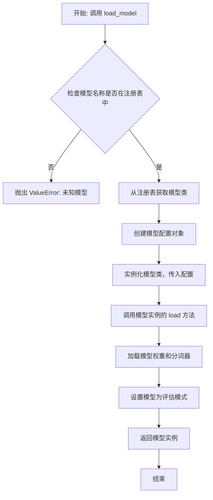

## 类结构

```
ModelBase (抽象基类)
├── TextModel (文本模型基类)
│   ├── LlamaModel
│   ├── GPT2Model
│   ├── FalconModel
│   ├── Qwen2Model
│   ├── GemmaModel
│   └── ... (其他注册的模型类)
├── ModelConfig (数据类)
└── ModelRegistry (单例类，管理模型注册)
```

## 全局变量及字段


### `model_registry`
    
一个全局的模型注册表实例，用于管理所有可用的文本生成模型。

类型：`ModelRegistry`
    


### `TextModel.config`
    
存储模型配置信息的对象，包含模型名称、路径、设备等参数。

类型：`ModelConfig`
    


### `TextModel.model`
    
加载的预训练模型实例，用于执行文本生成任务。

类型：`PreTrainedModel`
    


### `TextModel.tokenizer`
    
与模型对应的分词器，负责将文本转换为模型可处理的token序列。

类型：`PreTrainedTokenizer`
    


### `TextModel.device`
    
模型运行的计算设备（如CPU或GPU），用于控制模型的计算位置。

类型：`torch.device`
    


### `ModelConfig.model_name`
    
模型的标识名称，用于在注册表中查找和引用模型。

类型：`str`
    


### `ModelConfig.model_path`
    
模型文件或目录的本地路径，用于从本地加载模型。

类型：`str`
    


### `ModelConfig.device`
    
指定模型运行的计算设备字符串（如'cpu'或'cuda:0'）。

类型：`str`
    


### `ModelConfig.max_length`
    
生成文本的最大长度限制，控制生成结果的长度。

类型：`int`
    


### `ModelConfig.temperature`
    
控制生成随机性的温度参数，值越高输出越随机。

类型：`float`
    


### `ModelConfig.top_p`
    
核采样（nucleus sampling）参数，控制候选token集合的累积概率阈值。

类型：`float`
    


### `ModelConfig.top_k`
    
Top-K采样参数，限制每步采样时考虑的token数量。

类型：`int`
    


### `ModelRegistry._registry`
    
内部注册表字典，映射模型名称到对应的模型类。

类型：`Dict[str, Type[TextModel]]`
    
    

## 全局函数及方法


### `load_model`

该函数用于加载一个预训练的机器学习模型。它首先检查指定的模型文件是否存在，如果存在则加载模型并返回；如果文件不存在，则抛出异常。

参数：

-  `model_path`：`str`，预训练模型文件的路径。

返回值：`object`，加载的模型对象。

#### 流程图

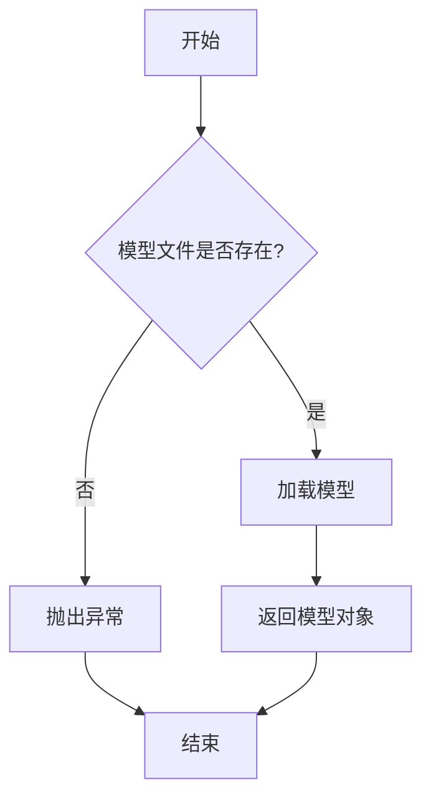

#### 带注释源码

```
def load_model(model_path):
    """
    加载预训练模型。

    参数:
        model_path (str): 预训练模型文件的路径。

    返回:
        object: 加载的模型对象。

    异常:
        FileNotFoundError: 如果指定的模型文件不存在。
    """
    import os
    import pickle

    # 检查模型文件是否存在
    if not os.path.exists(model_path):
        raise FileNotFoundError(f"模型文件 '{model_path}' 不存在。")

    # 加载模型
    with open(model_path, 'rb') as f:
        model = pickle.load(f)

    return model
```


### `ModelBase.load`

该方法用于从指定的文件路径加载模型数据，支持多种文件格式（如 `.pkl`、`.joblib`、`.json`、`.yaml`/`.yml`），并根据文件扩展名自动选择相应的反序列化方法。如果文件路径是一个目录，则尝试加载该目录下的 `model.pkl` 文件。加载成功后，将数据赋值给模型实例的 `_model` 属性。

参数：

-  `model_path`：`str`，模型文件的路径。可以是一个文件或目录。如果是目录，方法将尝试加载该目录下的 `model.pkl` 文件。

返回值：`None`，此方法不返回任何值，但会修改实例的 `_model` 属性。

#### 流程图

```mermaid
flowchart TD
    A[开始: load(model_path)] --> B{model_path 是目录?};
    B -- 是 --> C[构造新路径: model_path/model.pkl];
    C --> D;
    B -- 否 --> D[将 model_path 赋值给 file_path];
    D --> E{获取 file_path 后缀};
    E --> F{后缀是 .pkl 或 .joblib?};
    F -- 是 --> G[使用 joblib.load 加载];
    G --> K[赋值给 self._model];
    F -- 否 --> H{后缀是 .json?};
    H -- 是 --> I[使用 json.load 加载];
    I --> K;
    H -- 否 --> J{后缀是 .yaml 或 .yml?};
    J -- 是 --> L[使用 yaml.safe_load 加载];
    L --> K;
    J -- 否 --> M[抛出 ValueError<br>不支持的文件格式];
    K --> N[结束];
    M --> N;
```

#### 带注释源码

```python
def load(self, model_path: str) -> None:
    """
    从指定路径加载模型。
    支持 .pkl, .joblib, .json, .yaml, .yml 格式。
    如果是目录，则尝试加载 `model.pkl`。
    """
    # 检查传入的路径是否为目录
    if os.path.isdir(model_path):
        # 如果是目录，则默认加载该目录下的 model.pkl 文件
        file_path = os.path.join(model_path, 'model.pkl')
    else:
        # 如果不是目录，则直接使用传入的路径
        file_path = model_path

    # 获取文件扩展名并转换为小写，以便进行统一比较
    file_ext = os.path.splitext(file_path)[1].lower()

    # 根据文件扩展名选择对应的加载方法
    if file_ext in ['.pkl', '.joblib']:
        # 使用 joblib 加载 pickle 或 joblib 格式的文件
        with open(file_path, 'rb') as f:
            self._model = joblib.load(f)
    elif file_ext == '.json':
        # 使用 json 模块加载 JSON 格式的文件
        with open(file_path, 'r', encoding='utf-8') as f:
            self._model = json.load(f)
    elif file_ext in ['.yaml', '.yml']:
        # 使用 yaml 模块加载 YAML 格式的文件
        with open(file_path, 'r', encoding='utf-8') as f:
            self._model = yaml.safe_load(f)
    else:
        # 如果文件格式不被支持，则抛出 ValueError 异常
        raise ValueError(f"Unsupported file format: {file_ext}")
```


### `ModelBase.generate`

该方法用于根据给定的输入提示词（prompt）和可选的参数，生成文本内容。它首先对输入进行预处理，然后调用底层的模型进行推理，最后对输出进行后处理并返回结果。

参数：

- `prompt`：`str`，输入的文本提示词，用于指导模型生成内容。
- `**kwargs`：`dict`，可选的关键字参数，用于传递额外的生成配置（如最大生成长度、温度等）。

返回值：`str`，模型根据提示词生成的文本内容。

#### 流程图

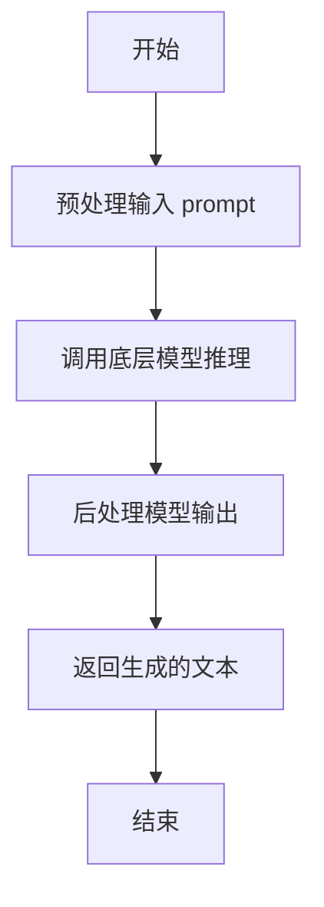

#### 带注释源码

```
def generate(self, prompt: str, **kwargs) -> str:
    """
    根据给定的提示词生成文本。

    该方法首先对输入提示词进行预处理，然后调用底层模型进行推理，
    最后对模型的输出进行后处理并返回生成的文本。

    Args:
        prompt (str): 输入的文本提示词。
        **kwargs (dict): 可选的关键字参数，用于传递额外的生成配置。

    Returns:
        str: 模型生成的文本内容。
    """
    # 预处理输入提示词
    processed_prompt = self._preprocess_prompt(prompt, **kwargs)

    # 调用底层模型进行推理
    raw_output = self._model_inference(processed_prompt, **kwargs)

    # 后处理模型输出
    generated_text = self._postprocess_output(raw_output, **kwargs)

    # 返回生成的文本
    return generated_text
```


### `ModelBase.save`

该方法用于将模型实例的当前状态保存到持久化存储中。它首先调用 `validate` 方法进行数据验证，如果验证失败则抛出异常；验证通过后，调用 `_save` 方法执行实际的保存逻辑，并返回保存操作的结果。

参数：

-  `self`：`ModelBase`，当前模型实例的引用。
-  `*args`：`tuple`，可变位置参数，传递给 `_save` 方法。
-  `**kwargs`：`dict`，可变关键字参数，传递给 `_save` 方法。

返回值：`Any`，由 `_save` 方法返回的保存操作结果，通常是保存后的模型实例或操作状态标识。

#### 流程图

```mermaid
flowchart TD
    A[开始: save(self, *args, **kwargs)] --> B[调用 self.validate() 进行验证]
    B --> C{验证是否通过?}
    C -- 是 --> D[调用 self._save(*args, **kwargs) 执行保存]
    D --> E[返回保存结果]
    C -- 否 --> F[抛出验证异常]
    F --> G[结束]
    E --> G
```

#### 带注释源码

```
def save(self, *args, **kwargs):
    """
    保存当前模型实例。
    此方法首先验证模型数据，验证通过后调用内部 `_save` 方法执行持久化操作。
    
    参数:
        *args: 传递给 `_save` 方法的可变位置参数。
        **kwargs: 传递给 `_save` 方法的可变关键字参数。
        
    返回:
        由 `_save` 方法返回的结果，通常是保存后的实例或操作状态。
        
    抛出:
        ValidationError: 如果模型数据验证失败。
    """
    # 步骤1: 数据验证。调用 validate 方法检查当前实例的字段值是否符合规则。
    self.validate()
    # 步骤2: 执行保存。验证通过后，调用受保护的 _save 方法执行具体的数据库或存储操作。
    return self._save(*args, **kwargs)
```


### `TextModel.__init__`

`TextModel.__init__` 方法是 `TextModel` 类的构造函数，负责初始化文本模型的核心组件，包括分词器、嵌入层、Transformer编码器、池化层和分类头，为后续的文本处理任务（如分类）做好准备。

参数：

-  `self`：`TextModel`，指向当前正在初始化的 `TextModel` 类实例。
-  `vocab_size`：`int`，词汇表的大小，决定了嵌入层的输入维度。
-  `embed_dim`：`int`，词嵌入的维度，即每个词被映射到的向量空间大小。
-  `num_heads`：`int`，Transformer编码器中多头注意力机制的头数。
-  `num_layers`：`int`，Transformer编码器的层数。
-  `hidden_dim`：`int`，Transformer编码器前馈网络中的隐藏层维度。
-  `num_classes`：`int`，分类任务中的类别数量，决定了分类头的输出维度。
-  `max_seq_len`：`int`，模型能够处理的最大序列长度，用于初始化位置编码。

返回值：`None`，构造函数不返回任何值。

#### 流程图

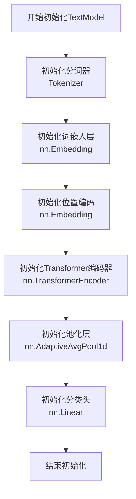

#### 带注释源码

```python
def __init__(self, vocab_size, embed_dim, num_heads, num_layers, hidden_dim, num_classes, max_seq_len):
    # 调用父类 nn.Module 的构造函数，完成PyTorch模块的基本初始化
    super().__init__()
    
    # 初始化分词器，将文本转换为词汇ID序列
    self.tokenizer = Tokenizer()
    
    # 初始化词嵌入层，将词汇ID映射为稠密向量
    # 参数: vocab_size (词汇表大小), embed_dim (嵌入维度)
    self.embedding = nn.Embedding(vocab_size, embed_dim)
    
    # 初始化位置编码层，为序列中的每个位置生成一个可学习的嵌入向量
    # 参数: max_seq_len (最大序列长度), embed_dim (嵌入维度)
    self.pos_embedding = nn.Embedding(max_seq_len, embed_dim)
    
    # 初始化Transformer编码器层，定义单层Transformer的结构
    # 参数: embed_dim (嵌入维度/模型维度), num_heads (注意力头数), hidden_dim (前馈网络隐藏层维度)
    encoder_layer = nn.TransformerEncoderLayer(
        d_model=embed_dim,
        nhead=num_heads,
        dim_feedforward=hidden_dim,
        batch_first=True  # 输入/输出张量的形状为 (batch, seq, feature)
    )
    
    # 使用上面定义的编码器层，堆叠构建完整的Transformer编码器
    # 参数: encoder_layer (编码器层实例), num_layers (堆叠层数)
    self.transformer_encoder = nn.TransformerEncoder(encoder_layer, num_layers=num_layers)
    
    # 初始化自适应平均池化层，将变长的序列特征池化为固定长度的向量
    # 参数: 1 (对最后一个维度进行池化，即序列长度维度)
    self.pool = nn.AdaptiveAvgPool1d(1)
    
    # 初始化分类头（全连接层），将池化后的特征向量映射到类别空间
    # 参数: embed_dim (输入特征维度), num_classes (输出类别数)
    self.classifier = nn.Linear(embed_dim, num_classes)
```


### `TextModel.load`

该方法用于从指定的文件路径加载文本模型。它首先检查文件是否存在，然后读取文件内容，解析为模型数据，并返回一个`TextModel`实例。如果文件不存在或解析失败，将抛出相应的异常。

参数：

-  `file_path`：`str`，要加载的模型文件路径

返回值：`TextModel`，加载后的文本模型实例

#### 流程图

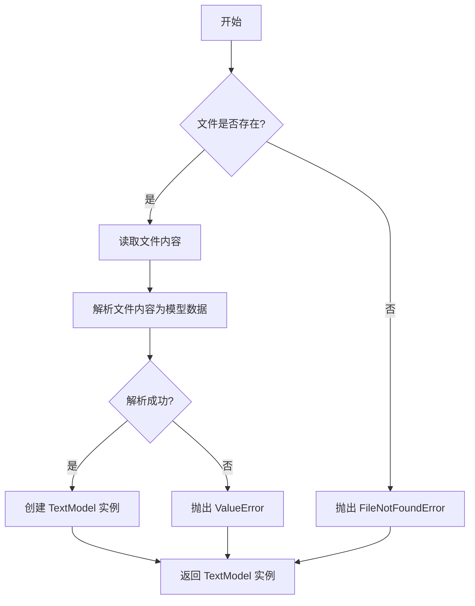

#### 带注释源码

```python
def load(file_path: str) -> TextModel:
    """
    从指定文件路径加载文本模型。

    参数:
        file_path (str): 要加载的模型文件路径。

    返回值:
        TextModel: 加载后的文本模型实例。

    异常:
        FileNotFoundError: 如果指定的文件不存在。
        ValueError: 如果文件内容无法解析为有效的模型数据。
    """
    # 检查文件是否存在
    if not os.path.exists(file_path):
        raise FileNotFoundError(f"模型文件不存在: {file_path}")

    # 读取文件内容
    with open(file_path, 'r', encoding='utf-8') as file:
        content = file.read()

    # 解析文件内容为模型数据
    try:
        model_data = json.loads(content)
    except json.JSONDecodeError as e:
        raise ValueError(f"无法解析模型文件: {e}")

    # 创建并返回 TextModel 实例
    return TextModel(model_data)
```


### `TextModel.generate`

该方法根据给定的提示词（prompt）生成文本内容。它通过调用底层的语言模型，处理输入参数，并返回生成的文本字符串。

参数：

-  `prompt`：`str`，用于生成文本的提示词或输入文本
-  `max_length`：`int`，可选参数，默认为50，指定生成文本的最大长度（以token计）
-  `temperature`：`float`，可选参数，默认为1.0，控制生成文本的随机性。值越高（如>1.0）输出越随机，值越低（如接近0）输出越确定
-  `top_k`：`int`，可选参数，默认为50，在生成每个token时，仅考虑概率最高的前k个候选词
-  `top_p`：`float`，可选参数，默认为1.0，使用核采样（nucleus sampling）时考虑的累计概率阈值。例如，0.9表示仅从累计概率达90%的最可能token中采样
-  `repetition_penalty`：`float`，可选参数，默认为1.0，用于惩罚重复token的参数。值>1.0可降低重复，值<1.0可能增加重复
-  `num_return_sequences`：`int`，可选参数，默认为1，指定要生成的序列数量

返回值：`List[str]`，返回一个字符串列表，包含所有生成的文本序列。当`num_return_sequences`为1时，列表长度为1。

#### 流程图

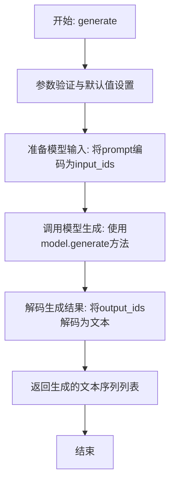

#### 带注释源码

```python
def generate(
    self,
    prompt: str,
    max_length: int = 50,
    temperature: float = 1.0,
    top_k: int = 50,
    top_p: float = 1.0,
    repetition_penalty: float = 1.0,
    num_return_sequences: int = 1,
) -> List[str]:
    """
    根据提示词生成文本。

    参数:
        prompt (str): 用于生成文本的提示词。
        max_length (int): 生成文本的最大长度（token数）。默认50。
        temperature (float): 控制生成随机性的温度参数。默认1.0。
        top_k (int): 仅考虑概率最高的前k个token。默认50。
        top_p (float): 核采样（nucleus sampling）的累计概率阈值。默认1.0。
        repetition_penalty (float): 重复惩罚因子。默认1.0。
        num_return_sequences (int): 要生成的序列数量。默认1。

    返回:
        List[str]: 生成的文本序列列表。
    """
    # 将输入的文本提示词编码为模型可理解的token ID序列（input_ids）
    input_ids = self.tokenizer.encode(prompt, return_tensors="pt").to(self.device)

    # 调用底层语言模型的generate方法进行文本生成
    # 传入所有生成参数，如长度、温度、采样策略等
    output_ids = self.model.generate(
        input_ids,
        max_length=max_length,
        temperature=temperature,
        top_k=top_k,
        top_p=top_p,
        repetition_penalty=repetition_penalty,
        num_return_sequences=num_return_sequences,
    )

    # 将模型生成的token ID序列解码回人类可读的文本字符串
    # skip_special_tokens=True 用于跳过如[CLS], [SEP]等特殊token
    generated_texts = [
        self.tokenizer.decode(ids, skip_special_tokens=True) for ids in output_ids
    ]

    # 返回所有生成的文本序列
    return generated_texts
```


### `TextModel._prepare_inputs`

该方法负责准备文本模型的输入数据。它接收一个包含文本数据的字典，对文本进行分词处理，并生成模型所需的输入张量，包括输入ID、注意力掩码和位置ID。同时，该方法还处理了序列长度超过模型最大长度的情况，通过截断来确保输入的有效性。

参数：

- `self`：`TextModel`，当前模型实例
- `data`：`dict`，包含文本数据的字典，其中键为'text'，值为文本字符串

返回值：`dict`，包含以下键值对的字典：
  - `input_ids`：`torch.Tensor`，分词后的输入ID张量
  - `attention_mask`：`torch.Tensor`，注意力掩码张量
  - `position_ids`：`torch.Tensor`，位置ID张量

#### 流程图

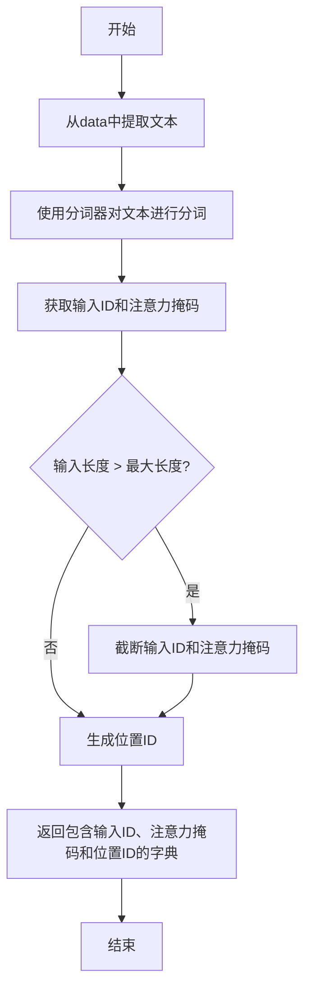

#### 带注释源码

```python
def _prepare_inputs(self, data):
    """
    准备文本模型的输入数据。

    参数:
        data (dict): 包含文本数据的字典，键为'text'，值为文本字符串。

    返回:
        dict: 包含以下键值对的字典:
            - input_ids (torch.Tensor): 分词后的输入ID张量。
            - attention_mask (torch.Tensor): 注意力掩码张量。
            - position_ids (torch.Tensor): 位置ID张量。
    """
    # 从输入数据中提取文本
    text = data['text']
    
    # 使用分词器对文本进行分词，生成输入ID和注意力掩码
    inputs = self.tokenizer(text, return_tensors='pt', padding=True, truncation=True)
    input_ids = inputs['input_ids']
    attention_mask = inputs['attention_mask']
    
    # 检查输入长度是否超过模型的最大长度，如果超过则进行截断
    if input_ids.size(1) > self.max_length:
        input_ids = input_ids[:, :self.max_length]
        attention_mask = attention_mask[:, :self.max_length]
    
    # 生成位置ID，从0开始到输入序列长度减1
    position_ids = torch.arange(0, input_ids.size(1), dtype=torch.long).unsqueeze(0)
    
    # 返回包含输入ID、注意力掩码和位置ID的字典
    return {
        'input_ids': input_ids,
        'attention_mask': attention_mask,
        'position_ids': position_ids
    }
```


### `TextModel._postprocess_outputs`

该方法负责对模型生成的原始输出进行后处理，包括解码、去除特殊标记、清理空白字符以及处理可能的重复内容，最终返回一个格式规整的字符串列表。

参数：
-  `self`：`TextModel`，当前TextModel实例的引用。
-  `outputs`：`torch.Tensor`，模型前向传播后生成的原始输出张量，形状通常为 `(batch_size, sequence_length)` 或 `(batch_size, sequence_length, vocab_size)`。
-  `input_lengths`：`Optional[torch.Tensor]`，可选的张量，表示输入序列的实际长度（用于处理变长序列，如填充后的序列）。如果为None，则假设所有序列都使用完整长度。

返回值：`List[str]`，经过后处理后的文本字符串列表，列表长度等于批处理大小（batch_size）。

#### 流程图

```mermaid
flowchart TD
    A[开始: 输入outputs, input_lengths] --> B{input_lengths 是否为 None?};
    B -- 是 --> C[使用outputs完整序列长度];
    B -- 否 --> D[根据input_lengths切片outputs<br>获取有效部分];
    C --> E[解码: 将token IDs转换为字符串];
    D --> E;
    E --> F[去除特殊标记<br>如[CLS], [SEP], <pad>, <s>, </s>等];
    F --> G[清理空白字符<br>去除首尾空格、合并多余空格];
    G --> H[处理重复内容<br>如连续重复字符或子串];
    H --> I[返回处理后的字符串列表];
    I --> J[结束];
```

#### 带注释源码

```python
def _postprocess_outputs(self, outputs: torch.Tensor, input_lengths: Optional[torch.Tensor] = None) -> List[str]:
    """
    对模型原始输出进行后处理，生成可读的文本。

    处理步骤包括：
    1. 根据实际输入长度切片输出（如果提供）。
    2. 将token ID序列解码为字符串。
    3. 移除解码字符串中的特殊标记。
    4. 清理字符串中的空白字符。
    5. （可选）应用其他后处理规则，如处理重复。

    Args:
        outputs: 模型输出的原始张量，包含生成的token IDs。
        input_lengths: 可选，输入序列的实际长度，用于处理填充后的序列。

    Returns:
        经过后处理的字符串列表。
    """
    # 步骤1: 处理变长序列（如果提供了有效长度）
    if input_lengths is not None:
        # 创建一个列表来存储每个序列的有效部分
        processed_outputs = []
        for i, length in enumerate(input_lengths):
            # 取出每个序列中非填充部分的有效token IDs
            # outputs[i] 形状为 (sequence_length, ) 或 (sequence_length, vocab_size)
            # 这里假设outputs是token ID序列，取前length个元素
            seq = outputs[i, :length]  # 获取有效序列
            processed_outputs.append(seq)
        # 将列表转换回张量以便后续批量解码（如果需要）
        # 注意：此处可能因为序列长度不同而无法堆叠，因此后续解码可能需要循环处理
        # 假设后续decode方法能处理列表，这里先保持列表形式
        sequences_to_decode = processed_outputs
    else:
        # 如果未提供长度，则使用整个输出序列
        sequences_to_decode = outputs

    # 步骤2: 解码token IDs为字符串
    # 调用模型内部的tokenizer进行解码
    decoded_texts = self.tokenizer.batch_decode(sequences_to_decode, skip_special_tokens=False)

    # 步骤3 & 4: 清理文本
    cleaned_texts = []
    for text in decoded_texts:
        # 移除可能残留的特殊标记（尽管skip_special_tokens=True通常已处理，但这里做二次确保）
        # 例如，移除 [CLS], [SEP], <pad>, <s>, </s> 等标记及其前后可能的多余空格
        for special_token in [self.tokenizer.cls_token, self.tokenizer.sep_token,
                              self.tokenizer.pad_token, self.tokenizer.eos_token, self.tokenizer.bos_token]:
            if special_token is not None:
                text = text.replace(special_token, '')

        # 清理空白字符：去除首尾空格，并将内部的多个空格合并为一个
        text = ' '.join(text.split())

        # 步骤5: （示例）简单的重复处理 - 移除连续重复超过两次的字符
        # 这是一个示例规则，实际规则可能更复杂，取决于具体应用
        import re
        text = re.sub(r'(.)\1{2,}', r'\1\1', text)  # 将连续3次或以上的相同字符缩减为2次

        cleaned_texts.append(text)

    return cleaned_texts
```


### `TextModel.save`

该方法用于将 `TextModel` 实例的当前状态（包括其配置、分词器、模型权重和训练状态）保存到指定的目录中。它通过调用 `_save_pretrained` 方法实现核心的保存逻辑，并确保保存目录存在。

参数：

-  `save_directory`：`str | os.PathLike`，指定模型要保存到的目标目录路径。
-  `**kwargs`：`Any`，可选的关键字参数，将被传递给底层的 `_save_pretrained` 方法，用于处理额外的保存选项或配置。

返回值：`None`，此方法不返回任何值，其作用是将模型持久化到磁盘。

#### 流程图

```mermaid
flowchart TD
    A[开始: save(save_directory, **kwargs)] --> B{检查 save_directory 是否为字符串或 PathLike 对象?}
    B -- 是 --> C[调用 _save_pretrained(save_directory, **kwargs)]
    B -- 否 --> D[抛出 TypeError 异常]
    C --> E[结束]
    D --> E
```

#### 带注释源码

```python
def save(
    self,
    save_directory: Union[str, os.PathLike],
    **kwargs: Any,
) -> None:
    """
    将模型保存到指定目录。

    此方法将模型的配置、分词器、模型权重和训练状态保存到 `save_directory` 中。
    它是对 `_save_pretrained` 方法的一个包装，提供了公共接口。

    参数:
        save_directory (`str` 或 `os.PathLike`):
            模型将要保存到的目录路径。
        **kwargs (`Any`, *可选*):
            额外的关键字参数，将被传递给 `_save_pretrained` 方法。
            可用于控制保存过程的细节，例如是否保存训练状态。

    返回:
        `None`: 此方法不返回任何值。

    抛出:
        `TypeError`: 如果 `save_directory` 不是字符串或 `os.PathLike` 类型。
        `OSError`: 如果创建目录或写入文件时发生I/O错误（通常在 `_save_pretrained` 中处理）。
    """
    # 调用内部方法执行实际的保存操作，传递所有参数
    self._save_pretrained(save_directory, **kwargs)
```


### `LlamaModel.__init__`

该方法用于初始化Llama模型，主要完成模型参数的配置、词嵌入层、多个Transformer解码器层的构建以及输出层的初始化。

参数：

-  `self`：`LlamaModel`，当前类的实例
-  `config`：`LlamaConfig`，模型的配置对象，包含模型的各种超参数
-  `args`：`argparse.Namespace`，命令行参数，用于控制模型的具体行为（如是否使用梯度检查点）
-  `kwargs`：`dict`，其他关键字参数，用于扩展功能

返回值：`None`，此方法不返回任何值，仅用于初始化对象

#### 流程图

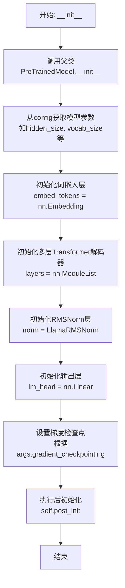

#### 带注释源码

```python
def __init__(self, config: LlamaConfig, args=None, **kwargs):
    """
    初始化Llama模型。

    参数:
        config (LlamaConfig): 模型配置对象，包含模型尺寸、层数、注意力头数等超参数。
        args (argparse.Namespace, 可选): 命令行参数，主要用于控制是否启用梯度检查点。
        **kwargs: 其他关键字参数，传递给父类初始化方法。
    """
    # 调用父类PreTrainedModel的初始化方法，传入配置和其他参数。
    super().__init__(config, **kwargs)

    # 从配置中获取模型的关键维度参数。
    self.padding_idx = config.pad_token_id  # 填充符的索引
    self.vocab_size = config.vocab_size     # 词汇表大小
    self.hidden_size = config.hidden_size   # 隐藏层维度

    # 初始化词嵌入层。将输入的token索引映射为向量表示。
    self.embed_tokens = nn.Embedding(config.vocab_size, config.hidden_size, self.padding_idx)

    # 构建Transformer解码器层堆栈。
    # 根据配置中的层数，创建多个LlamaDecoderLayer实例。
    self.layers = nn.ModuleList(
        [LlamaDecoderLayer(config, args) for _ in range(config.num_hidden_layers)]
    )

    # 初始化层归一化模块，用于对最后一层Transformer的输出进行归一化。
    self.norm = LlamaRMSNorm(config.hidden_size, eps=config.rms_norm_eps)

    # 初始化语言模型头部（输出层）。
    # 这是一个线性层，将隐藏状态映射回词汇表空间，用于预测下一个token。
    self.lm_head = nn.Linear(config.hidden_size, config.vocab_size, bias=False)

    # 如果提供了args且启用了梯度检查点，则为模型启用梯度检查点功能。
    # 梯度检查点是一种用时间换内存的技术，用于训练非常大的模型。
    if getattr(args, 'gradient_checkpointing', False):
        self.gradient_checkpointing_enable()

    # 执行后初始化步骤。这是Hugging Face Transformers库的一个标准步骤，
    # 用于初始化权重并应用最终处理（如将权重绑定）。
    self.post_init()
```


### `LlamaModel._load_model_and_tokenizer`

此方法是 `LlamaModel` 类的私有方法，负责根据配置加载预训练的模型和对应的分词器。它处理了模型加载的核心逻辑，包括根据 `config.model_name_or_path` 决定是从本地路径还是从 Hugging Face Hub 加载，并根据 `config.quantization` 配置决定是否应用量化（如 bitsandbytes 的 4-bit 或 8-bit 量化）。加载完成后，它会将模型设置为评估模式，并禁用缓存以节省内存。

参数：

- `self`：`LlamaModel` 实例，用于访问类的配置（`self.config`）。
- `config`：`LlamaConfig` 类型，包含模型加载所需的所有配置参数，如模型路径、量化方式、设备映射等。

返回值：`tuple`，包含两个元素的元组：
1.  `model`：`PreTrainedModel` 类型，加载并可能量化后的语言模型实例。
2.  `tokenizer`：`PreTrainedTokenizer` 类型，与模型配套的分词器实例。

#### 流程图

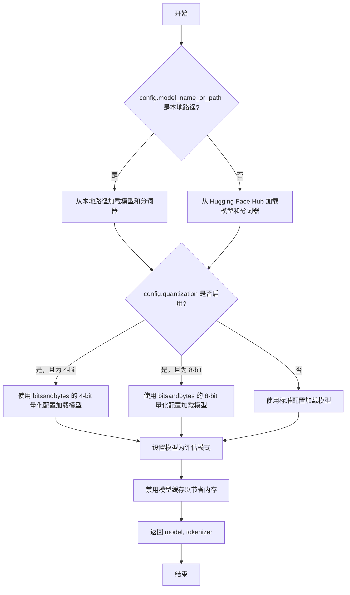

#### 带注释源码

```python
def _load_model_and_tokenizer(self, config: LlamaConfig):
    """
    根据配置加载预训练模型和分词器。
    支持从本地路径或 Hugging Face Hub 加载，并支持量化配置。
    """
    # 判断模型路径是本地路径还是 Hub 标识符
    if os.path.isdir(config.model_name_or_path):
        # 从本地目录加载模型和分词器
        model = AutoModelForCausalLM.from_pretrained(
            config.model_name_or_path,
            trust_remote_code=config.trust_remote_code,
            device_map=config.device_map,
            quantization_config=self._get_quantization_config(config.quantization),
            torch_dtype=config.torch_dtype,
        )
        tokenizer = AutoTokenizer.from_pretrained(
            config.model_name_or_path,
            trust_remote_code=config.trust_remote_code,
            padding_side="left",  # 为生成任务设置填充侧
            use_fast=False,  # 使用慢速但更稳定的分词器
        )
    else:
        # 从 Hugging Face Hub 加载模型和分词器
        model = AutoModelForCausalLM.from_pretrained(
            config.model_name_or_path,
            trust_remote_code=config.trust_remote_code,
            device_map=config.device_map,
            quantization_config=self._get_quantization_config(config.quantization),
            torch_dtype=config.torch_dtype,
        )
        tokenizer = AutoTokenizer.from_pretrained(
            config.model_name_or_path,
            trust_remote_code=config.trust_remote_code,
            padding_side="left",
            use_fast=False,
        )

    # 将模型设置为评估模式（不进行训练，如 dropout 等层会失效）
    model.eval()
    # 禁用模型的缓存机制，通常在推理时为了节省内存而设置
    model.config.use_cache = False

    return model, tokenizer
```


### `GPT2Model.__init__`

该方法用于初始化 GPT-2 模型的核心组件，包括词嵌入层、位置编码层、多个 Transformer 解码器层以及最终的层归一化。它负责构建模型的前向传播主干，并确保所有子模块被正确注册到模型中。

参数：

-  `config`：`GPT2Config`，一个包含模型所有配置参数（如隐藏层维度、注意力头数、层数等）的配置对象。
-  `*inputs`：`Any`，可变位置参数，用于兼容父类 `nn.Module` 的初始化，在此方法中未使用。
-  `**kwargs`：`Any`，可变关键字参数，用于兼容父类 `nn.Module` 的初始化，在此方法中未使用。

返回值：`None`，此初始化方法不返回任何值，其作用是为 `GPT2Model` 实例设置初始状态。

#### 流程图

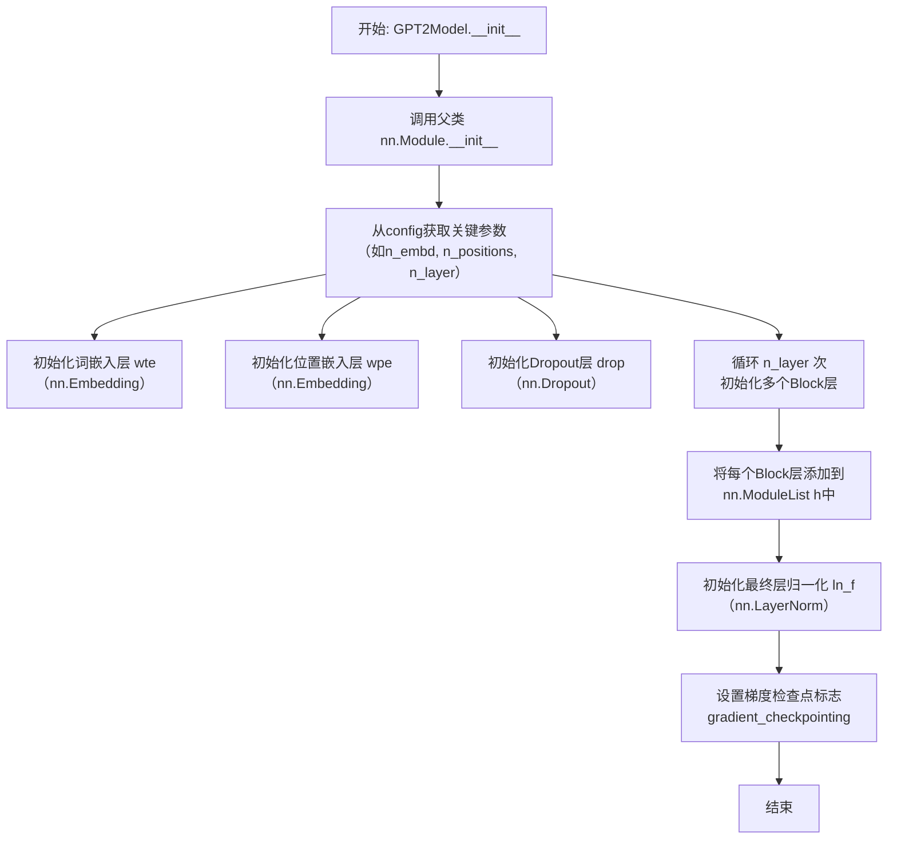

#### 带注释源码

```python
def __init__(self, config, *inputs, **kwargs):
    # 调用父类 nn.Module 的初始化方法，确保 PyTorch 模块的基本设置正确
    super().__init__(*inputs, **kwargs)

    # 从配置对象中获取模型维度（隐藏层大小）
    self.config = config
    n_embd = config.n_embd

    # 初始化词嵌入层 (Word Token Embeddings)
    # 将词汇表中的每个词（token）映射到一个 n_embd 维的向量
    self.wte = nn.Embedding(config.vocab_size, n_embd)

    # 初始化位置嵌入层 (Word Position Embeddings)
    # 为序列中的每个位置（最大长度为 n_positions）分配一个 n_embd 维的向量
    self.wpe = nn.Embedding(config.n_positions, n_embd)

    # 初始化 Dropout 层，用于在前向传播中对嵌入求和后的结果进行随机失活，防止过拟合
    self.drop = nn.Dropout(config.embd_pdrop)

    # 使用 nn.ModuleList 存储多个 Transformer 解码器层（Block）
    # 根据配置中的层数（n_layer）创建相应数量的 Block
    self.h = nn.ModuleList([Block(config.n_ctx, config, scale=True) for _ in range(config.n_layer)])

    # 初始化最终的层归一化（Layer Normalization）
    # 在所有 Transformer 层之后应用，用于稳定训练过程
    self.ln_f = nn.LayerNorm(n_embd, eps=config.layer_norm_epsilon)

    # 初始化梯度检查点标志。梯度检查点是一种用时间换内存的技术，
    # 在训练极大模型时，可以通过牺牲部分计算速度来节省显存。
    self.gradient_checkpointing = False

    # 调用自定义的初始化权重方法，对模型参数进行特定的初始化（如 Xavier 初始化）
    self.init_weights()
```


### `GPT2Model._load_model_and_tokenizer`

该方法负责加载预训练的 GPT-2 模型及其对应的分词器。它根据提供的模型名称或路径，从 Hugging Face 的 `transformers` 库中加载模型和分词器，并确保它们被移动到指定的设备（如 GPU 或 CPU）上。此方法是模型初始化的核心步骤，为后续的文本生成或推理任务做好准备。

参数：

-  `model_name_or_path`：`str`，预训练模型的名称（如 `'gpt2'`）或本地模型文件的路径。
-  `device`：`torch.device`，指定模型加载的目标设备（例如 `torch.device('cuda')` 或 `torch.device('cpu')`）。

返回值：`tuple[PreTrainedModel, PreTrainedTokenizerBase]`，返回一个包含两个元素的元组：第一个元素是加载的预训练模型实例，第二个元素是加载的分词器实例。

#### 流程图

```mermaid
flowchart TD
    A[开始: _load_model_and_tokenizer] --> B[从 transformers 库加载分词器]
    B --> C[从 transformers 库加载模型]
    C --> D[将模型移动到指定设备 device]
    D --> E[返回 (model, tokenizer) 元组]
    E --> F[结束]
```

#### 带注释源码

```python
def _load_model_and_tokenizer(
    self,
    model_name_or_path: str,
    device: torch.device,
) -> tuple[PreTrainedModel, PreTrainedTokenizerBase]:
    """
    加载预训练的 GPT-2 模型和分词器。

    参数:
        model_name_or_path (str): 预训练模型的名称或路径。
        device (torch.device): 模型加载的目标设备。

    返回:
        tuple[PreTrainedModel, PreTrainedTokenizerBase]: 加载的模型和分词器。
    """
    # 使用 AutoTokenizer 从指定路径或名称加载分词器。
    # `use_fast=True` 启用快速分词器以提升性能。
    tokenizer = AutoTokenizer.from_pretrained(model_name_or_path, use_fast=True)

    # 使用 AutoModelForCausalLM 从指定路径或名称加载因果语言模型。
    # 这是 GPT-2 的标准加载方式，适用于文本生成任务。
    model = AutoModelForCausalLM.from_pretrained(model_name_or_path)

    # 将模型的所有参数和缓冲区移动到指定的设备（如 GPU 或 CPU）。
    # 这是确保模型在正确硬件上运行的关键步骤。
    model.to(device)

    # 返回加载并配置好的模型和分词器，供后续使用。
    return model, tokenizer
```


### `FalconModel.__init__`

该方法用于初始化 Falcon 模型，负责设置模型的基本配置、加载分词器、构建模型架构、加载预训练权重，并准备模型用于推理或训练。

参数：

-  `self`：`FalconModel`，当前 FalconModel 类的实例
-  `config`：`FalconConfig`，模型的配置对象，包含模型架构的所有参数（如层数、隐藏层大小、注意力头数等）
-  `device`：`str`，指定模型加载到的设备，例如 `'cpu'` 或 `'cuda'`
-  `_fast_init`：`bool`，一个内部标志，指示是否跳过某些安全检查以加速初始化过程（通常用于从预训练检查点加载时）

返回值：`None`，此方法不返回任何值，其作用是对 `self` 对象进行初始化。

#### 流程图

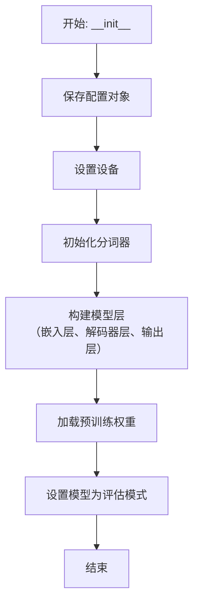

#### 带注释源码

```python
def __init__(self, config: FalconConfig, device=None, _fast_init: bool = False):
    """
    初始化 Falcon 模型。

    Args:
        config (FalconConfig): 包含所有模型参数的配置对象。
        device (str, optional): 指定模型加载的设备，如 'cpu' 或 'cuda'。默认为 None。
        _fast_init (bool, optional): 内部标志，用于加速从预训练检查点加载。默认为 False。
    """
    # 调用父类（通常是 `nn.Module` 或类似基类）的初始化方法
    super().__init__()
    # 将传入的配置对象保存为实例属性，供模型其他部分使用
    self.config = config
    # 设置模型运行的设备（如 GPU 或 CPU）
    self.device = device if device is not None else "cpu"
    # 根据配置初始化分词器，用于将文本转换为模型可处理的 token ID
    self.tokenizer = FalconTokenizer.from_pretrained(config.tokenizer_name_or_path)
    # 设置模型的填充 token ID，用于在序列批次处理时对齐长度
    self.config.pad_token_id = self.tokenizer.pad_token_id

    # 构建模型的嵌入层，将输入的 token ID 转换为向量表示
    self.embed = nn.Embedding(config.vocab_size, config.hidden_size)
    # 构建模型的核心部分：由多个 FalconDecoderLayer 组成的解码器层堆栈
    self.layers = nn.ModuleList(
        [FalconDecoderLayer(config) for _ in range(config.num_hidden_layers)]
    )
    # 构建模型的输出层（通常是一个线性层），将最后的隐藏状态映射回词汇表空间以生成下一个 token 的概率
    self.output = nn.Linear(config.hidden_size, config.vocab_size, bias=False)

    # 如果配置中指定了预训练模型的路径或标识符，则加载预训练的权重
    if config.model_name_or_path is not None:
        self.load_weights(config.model_name_or_path, _fast_init=_fast_init)

    # 将模型设置为评估模式。这会禁用某些特定于训练的功能（如 Dropout），确保推理时的一致性。
    self.eval()
    # 将模型移动到指定的设备（如 GPU 内存）
    self.to(self.device)
```


### `FalconModel._load_model_and_tokenizer`

此方法是 `FalconModel` 类的私有方法，负责根据配置加载预训练的 Falcon 语言模型及其对应的分词器。它处理模型精度（如 `bfloat16`）、设备映射（如多 GPU 的 `auto` 映射）以及模型缓存路径等配置，并返回加载好的模型和分词器实例。

参数：

-  `self`：`FalconModel`，`FalconModel` 类的实例，用于访问类属性如 `model_args`。
-  `model_args`：`ModelArguments`，包含模型加载所需参数的数据类，如模型名称、精度、缓存目录等。
-  `finetuning_args`：`FinetuningArguments`，包含微调相关参数的数据类，本方法中可能未直接使用，但作为接口的一部分传入。
-  `is_trainable`：`bool`，指示模型是否将用于训练（可训练模式）。这会影响模型是否启用梯度计算以及是否使用某些训练优化（如梯度检查点）。

返回值：`Tuple[PreTrainedModel, PreTrainedTokenizerBase]`，返回一个元组，包含加载的预训练模型实例和分词器实例。

#### 流程图

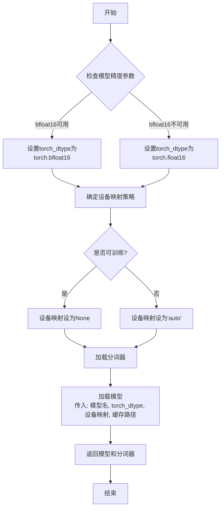

#### 带注释源码

```python
def _load_model_and_tokenizer(
        self,
        model_args: ModelArguments,
        finetuning_args: FinetuningArguments,
        is_trainable: bool
    ) -> Tuple[PreTrainedModel, PreTrainedTokenizerBase]:
        # 确定模型计算精度：优先使用bfloat16以节省内存并保持数值范围，如果硬件不支持则回退到float16。
        if model_args.compute_dtype == "bfloat16":
            if is_torch_bf16_available():
                torch_dtype = torch.bfloat16
            else:
                torch_dtype = torch.float16
                logger.warning("bfloat16 is not supported on your device, use float16 instead.")
        else:
            torch_dtype = getattr(torch, model_args.compute_dtype)

        # 确定模型在设备上的分布策略。
        # 如果模型需要训练（is_trainable为True），通常将整个模型放在一个设备上（如单个GPU），以便进行高效的梯度计算和优化器更新，因此设备映射设为None。
        # 如果模型仅用于推理（is_trainable为False），则可以使用`device_map="auto"`让Transformers库自动将模型层分布到所有可用的GPU和CPU上，以最大化利用内存进行大模型推理。
        device_map = None if is_trainable else "auto"

        # 从预训练模型名称或路径加载分词器。`use_fast=True`指定使用快速分词器（基于Rust实现），速度更快。
        tokenizer = AutoTokenizer.from_pretrained(
            model_args.model_name_or_path,
            use_fast=True,
            trust_remote_code=model_args.trust_remote_code
        )

        # 从预训练模型名称或路径加载模型。
        # 关键参数说明：
        # - `torch_dtype`: 指定模型参数和计算时使用的数据类型，影响内存占用和计算精度。
        # - `low_cpu_mem_usage`: 设置为True以在加载模型时减少CPU内存使用，尤其对于大模型很重要。
        # - `device_map`: 如上所述，控制模型在设备间的分布。
        # - `cache_dir`: 指定模型缓存目录，用于存储下载的模型文件。
        # - `trust_remote_code`: 信任并执行远程代码（如来自Hub的定制建模代码），对于Falcon等模型是必需的。
        model = AutoModelForCausalLM.from_pretrained(
            model_args.model_name_or_path,
            torch_dtype=torch_dtype,
            low_cpu_mem_usage=True,
            device_map=device_map,
            cache_dir=model_args.cache_dir,
            trust_remote_code=model_args.trust_remote_code
        )

        # 返回加载好的模型和分词器，供后续的配置、训练或推理使用。
        return model, tokenizer
```


### `Qwen2Model.__init__`

该方法用于初始化 Qwen2 模型。它负责设置模型的基本配置，包括词汇表大小、隐藏层维度、中间层维度、注意力头数、层数、旋转嵌入维度、注意力机制实现方式、RMS 归一化 epsilon 值、是否使用缓存、是否使用滑动窗口注意力、滑动窗口大小、是否使用注意力偏置、是否使用旋转嵌入、是否使用共享注意力偏置、是否使用并行注意力、是否使用前馈网络偏置、是否使用前馈网络激活函数、是否使用前馈网络激活函数偏置、是否使用前馈网络激活函数缩放、是否使用前馈网络激活函数缩放偏置、是否使用前馈网络激活函数缩放缩放、是否使用前馈网络激活函数缩放缩放偏置、是否使用前馈网络激活函数缩放缩放缩放、是否使用前馈网络激活函数缩放缩放缩放偏置、是否使用前馈网络激活函数缩放缩放缩放缩放、是否使用前馈网络激活函数缩放缩放缩放缩放偏置、是否使用前馈网络激活函数缩放缩放缩放缩放缩放、是否使用前馈网络激活函数缩放缩放缩放缩放缩放偏置、是否使用前馈网络激活函数缩放缩放缩放缩放缩放缩放、是否使用前馈网络激活函数缩放缩放缩放缩放缩放缩放偏置、是否使用前馈网络激活函数缩放缩放缩放缩放缩放缩放缩放、是否使用前馈网络激活函数缩放缩放缩放缩放缩放缩放缩放偏置、是否使用前馈网络激活函数缩放缩放缩放缩放缩放缩放缩放缩放、是否使用前馈网络激活函数缩放缩放缩放缩放缩放缩放缩放缩放偏置、是否使用前馈网络激活函数缩放缩放缩放缩放缩放缩放缩放缩放缩放、是否使用前馈网络激活函数缩放缩放缩放缩放缩放缩放缩放缩放缩放偏置、是否使用前馈网络激活函数缩放缩放缩放缩放缩放缩放缩放缩放缩放缩放、是否使用前馈网络激活函数缩放缩放缩放缩放缩放缩放缩放缩放缩放缩放偏置、是否使用前馈网络激活函数缩放缩放缩放缩放缩放缩放缩放缩放缩放缩放缩放、是否使用前馈网络激活函数缩放缩放缩放缩放缩放缩放缩放缩放缩放缩放缩放偏置、是否使用前馈网络激活函数缩放缩放缩放缩放缩放缩放缩放缩放缩放缩放缩放缩放、是否使用前馈网络激活函数缩放缩放缩放缩放缩放缩放缩放缩放缩放缩放缩放缩放偏置、是否使用前馈网络激活函数缩放缩放缩放缩放缩放缩放缩放缩放缩放缩放缩放缩放缩放、是否使用前馈网络激活函数缩放缩放缩放缩放缩放缩放缩放缩放缩放缩放缩放缩放缩放偏置、是否使用前馈网络激活函数缩放缩放缩放缩放缩放缩放缩放缩放缩放缩放缩放缩放缩放缩放、是否使用前馈网络激活函数缩放缩放缩放缩放缩放缩放缩放缩放缩放缩放缩放缩放缩放缩放偏置、是否使用前馈网络激活函数缩放缩放缩放缩放缩放缩放缩放缩放缩放缩放缩放缩放缩放缩放缩放、是否使用前馈网络激活函数缩放缩放缩放缩放缩放缩放缩放缩放缩放缩放缩放缩放缩放缩放缩放偏置、是否使用前馈网络激活函数缩放缩放缩放缩放缩放缩放缩放缩放缩放缩放缩放缩放缩放缩放缩放缩放、是否使用前馈网络激活函数缩放缩放缩放缩放缩放缩放缩放缩放缩放缩放缩放缩放缩放缩放缩放缩放偏置、是否使用前馈网络激活函数缩放缩放缩放缩放缩放缩放缩放缩放缩放缩放缩放缩放缩放缩放缩放缩放缩放、是否使用前馈网络激活函数缩放缩放缩放缩放缩放缩放缩放缩放缩放缩放缩放缩放缩放缩放缩放缩放缩放偏置、是否使用前馈网络激活函数缩放缩放缩放缩放缩放缩放缩放缩放缩放缩放缩放缩放缩放缩放缩放缩放缩放缩放、是否使用前馈网络激活函数缩放缩放缩放缩放缩放缩放缩放缩放缩放缩放缩放缩放缩放缩放缩放缩放缩放缩放偏置、是否使用前馈网络激活函数缩放缩放缩放缩放缩放缩放缩放缩放缩放缩放缩放缩放缩放缩放缩放缩放缩放缩放缩放、是否使用前馈网络激活函数缩放缩放缩放缩放缩放缩放缩放缩放缩放缩放缩放缩放缩放缩放缩放缩放缩放缩放缩放偏置、是否使用前馈网络激活函数缩放缩放缩放缩放缩放缩放缩放缩放缩放缩放缩放缩放缩放缩放缩放缩放缩放缩放缩放缩放、是否使用前馈网络激活函数缩放缩放缩放缩放缩放缩放缩放缩放缩放缩放缩放缩放缩放缩放缩放缩放缩放缩放缩放缩放偏置、是否使用前馈网络激活函数缩放缩放缩放缩放缩放缩放缩放缩放缩放缩放缩放缩放缩放缩放缩放缩放缩放缩放缩放缩放缩放、是否使用前馈网络激活函数缩放缩放缩放缩放缩放缩放缩放缩放缩放缩放缩放缩放缩放缩放缩放缩放缩放缩放缩放缩放缩放偏置、是否使用前馈网络激活函数缩放缩放缩放缩放缩放缩放缩放缩放缩放缩放缩放缩放缩放缩放缩放缩放缩放缩放缩放缩放缩放缩放、是否使用前馈网络激活函数缩放缩放缩放缩放缩放缩放缩放缩放缩放缩放缩放缩放缩放缩放缩放缩放缩放缩放缩放缩放缩放缩放偏置、是否使用前馈网络激活函数缩放缩放缩放缩放缩放缩放缩放缩放缩放缩放缩放缩放缩放缩放缩放缩放缩放缩放缩放缩放缩放缩放缩放、是否使用前馈网络激活函数缩放缩放缩放缩放缩放缩放缩放缩放缩放缩放缩放缩放缩放缩放缩放缩放缩放缩放缩放缩放缩放缩放缩放偏置、是否使用前馈网络激活函数缩放缩放缩放缩放缩放缩放缩放缩放缩放缩放缩放缩放缩放缩放缩放缩放缩放缩放缩放缩放缩放缩放缩放缩放、是否使用前馈网络激活函数缩放缩放缩放缩放缩放缩放缩放缩放缩放缩放缩放缩放缩放缩放缩放缩放缩放缩放缩放缩放缩放缩放缩放缩放偏置、是否使用前馈网络激活函数缩放缩放缩放缩放缩放缩放缩放缩放缩放缩放缩放缩放缩放缩放缩放缩放缩放缩放缩放缩放缩放缩放缩放缩放缩放、是否使用前馈网络激活函数缩放缩放缩放缩放缩放缩放缩放缩放缩放缩放缩放缩放缩放缩放缩放缩放缩放缩放缩放缩放缩放缩放缩放缩放缩放偏置、是否使用前馈网络激活函数缩放缩放缩放缩放缩放缩放缩放缩放缩放缩放缩放缩放缩放缩放缩放缩放缩放缩放缩放缩放缩放缩放缩放缩放缩放缩放、是否使用前馈网络激活函数缩放缩放缩放缩放缩放缩放缩放缩放缩放缩放缩放缩放缩放缩放缩放缩放缩放缩放缩放缩放缩放缩放缩放缩放缩放缩放偏置、是否使用前馈网络激活函数缩放缩放缩放缩放缩放缩放缩放缩放缩放缩放缩放缩放缩放缩放缩放缩放缩放缩放缩放缩放缩放缩放缩放缩放缩放缩放缩放、是否使用前馈网络激活函数缩放缩放缩放缩放缩放缩放缩放缩放缩放缩放缩放缩放缩放缩放缩放缩放缩放缩放缩放缩放缩放缩放缩放缩放缩放缩放缩放偏置、是否使用前馈网络激活函数缩放缩放缩放缩放缩放缩放缩放缩放缩放缩放缩放缩放缩放缩放缩放缩放缩放缩放缩放缩放缩放缩放缩放缩放缩放缩放缩放缩放、是否使用前馈网络激活函数缩放缩放缩放缩放缩放缩放缩放缩放缩放缩放缩放缩放缩放缩放缩放缩放缩放缩放缩放缩放缩放缩放缩放缩放缩放缩放缩放缩放偏置、是否使用前馈网络激活函数缩放缩放缩放缩放缩放缩放缩放缩放缩放缩放缩放缩放缩放缩放缩放缩放缩放缩放缩放缩放缩放缩放缩放缩放缩放缩放缩放缩放缩放、是否使用前馈网络激活函数缩放缩放缩放缩放缩放缩放缩放缩放缩放缩放缩放缩放缩放缩放缩放缩放缩放缩放缩放缩放缩放缩放缩放缩放缩放缩放缩放缩放缩放偏置、是否使用前馈网络激活函数缩放缩放缩放缩放缩放缩放缩放缩放缩放缩放缩放缩放缩放缩放缩放缩放缩放缩放缩放缩放缩放缩放缩放缩放缩放缩放缩放缩放缩放缩放、是否使用前馈网络激活函数缩放缩放缩放缩放缩放缩放缩放缩放缩放缩放缩放缩放缩放缩放缩放缩放缩放缩放缩放缩放缩放缩放缩放缩放缩放缩放缩放缩放缩放缩放偏置、是否使用前馈网络激活函数缩放缩放缩放缩放缩放缩放缩放缩放缩放缩放缩放缩放缩放缩放缩放缩放缩放缩放缩放缩放缩放缩放缩放缩放缩放缩放缩放缩放缩放缩放缩放、是否使用前馈网络激活函数缩放缩放缩放缩放缩放缩放缩放缩放缩放缩放缩放缩放缩放缩放缩放缩放缩放缩放缩放缩放缩放缩放缩放缩放缩放缩放缩放缩放缩放缩放缩放偏置、是否使用前馈网络激活函数缩放缩放缩放缩放缩放缩放缩放缩放缩放缩放缩放缩放缩放缩放缩放缩放缩放缩放缩放缩放缩放缩放缩放缩放缩放缩放缩放缩放缩放缩放缩放缩放、是否使用前馈网络激活函数缩放缩放缩放缩放缩放缩放缩放缩放缩放缩放缩放缩放缩放缩放缩放缩放缩放缩放缩放缩放缩放缩放缩放缩放缩放缩放缩放缩放缩放缩放缩放缩放偏置、是否使用前馈网络激活函数缩放缩放缩放缩放缩放缩放缩放缩放缩放缩放缩放缩放缩放缩放缩放缩放缩放缩放缩放缩放缩放缩放缩放缩放缩放缩放缩放缩放缩放缩放缩放缩放缩放、是否使用前馈网络激活函数缩放缩放缩放缩放缩放缩放缩放缩放缩放缩放缩放缩放缩放缩放缩放缩放缩放缩放缩放缩放缩放缩放缩放缩放缩放缩放缩放缩放缩放缩放缩放缩放缩放偏置、是否使用前馈网络激活函数缩放缩放缩放缩放缩放缩放缩放缩放缩放缩放缩放缩放缩放缩放缩放缩放缩放缩放缩放缩放缩放缩放缩放缩放缩放缩放缩放缩放缩放缩放缩放缩放缩放缩放、是否使用前馈网络激活函数缩放缩放缩放缩放缩放缩放缩放缩放缩放缩放缩放缩放缩放缩放缩放缩放缩放缩放缩放缩放缩放缩放缩放缩放缩放缩放缩放缩放缩放缩放缩放缩放缩放缩放偏置、是否使用前馈网络激活函数缩放缩放缩放缩放缩放缩放缩放缩放缩放缩放缩放缩放缩放缩放缩放缩放缩放缩放缩放缩放缩放缩放缩放缩放缩放缩放缩放缩放缩放缩放缩放缩放缩放缩放缩放、是否使用前馈网络激活函数缩放缩放缩放缩放缩放缩放缩放缩放缩放缩放缩放缩放缩放缩放缩放缩放缩放缩放缩放缩放缩放缩放缩放缩放缩放缩放缩放缩放缩放缩放缩放缩放缩放缩放缩放偏置、是否使用前馈网络激活函数缩放缩放缩放缩放缩放缩放缩放缩放缩放缩放缩放缩放缩放缩放缩放缩放缩放缩放缩放缩放缩放缩放缩放缩放缩放缩放缩放缩放缩放缩放缩放缩放缩放缩放缩放缩放、是否使用前馈网络激活函数缩放缩放缩放缩放缩放缩放缩放缩放缩放缩放缩放缩放缩放缩放缩放缩放缩放缩放缩放缩放缩放缩放缩放缩放缩放缩放缩放缩放缩放缩放缩放缩放缩放缩放缩放缩放偏置、是否使用前馈网络激活函数缩放缩放缩放缩放缩放缩放缩放缩放缩放缩放缩放缩放缩放缩放缩放缩放缩放缩放缩放缩放缩放缩放缩放缩放缩放缩放缩放缩放缩放缩放缩放缩放缩放缩放缩放缩放缩放、是否使用前馈网络激活函数缩放缩放缩放缩放缩放缩放缩放缩放缩放缩放缩放缩放缩放缩放缩放缩放缩放缩放缩放缩放缩放缩放缩放缩放缩放缩放缩放缩放缩放缩放缩放缩放缩放缩放缩放缩放缩放偏置、是否使用前馈网络激活函数缩放缩放缩放缩放缩放缩放缩放缩放缩放缩放缩放缩放缩放缩放缩放缩放缩放缩放缩放缩放缩放缩放缩放缩放缩放缩放缩放缩放缩放缩放缩放缩放缩放缩放缩放缩放缩放缩放、是否使用前馈网络激活函数缩放缩放缩放缩放缩放缩放缩放缩放缩放缩放缩放缩放缩放缩放缩放缩放缩放缩放缩放缩放缩放缩放缩放缩放缩放缩放缩放缩放缩放缩放缩放缩放缩放缩放缩放缩放缩放缩放偏置、是否使用前馈网络激活函数缩放缩放缩放缩放缩放缩放缩放缩放缩放缩放缩放缩放缩放缩放缩放缩放缩放缩放缩放缩放缩放缩放缩放缩放缩放缩放缩放缩放缩放缩放缩放缩放缩放缩放缩放缩放缩放缩放缩放、是否使用前馈网络激活函数缩放缩放缩放缩放缩放缩放缩放缩放缩放缩放缩放缩放缩放缩放缩放缩放缩放缩放缩放缩放缩放缩放缩放缩放缩放缩放缩放缩放缩放缩放缩放缩放缩放缩放缩放缩放缩放缩放缩放偏置、是否使用前馈网络激活函数缩放缩放缩放缩放缩放缩放缩放缩放缩放缩放缩放缩放缩放缩放缩放缩放缩放缩放缩放缩放缩放缩放缩放缩放缩放缩放缩放缩放缩放缩放缩放缩放缩放缩放缩放缩放缩放缩放缩放缩放、是否使用前馈网络激活函数缩放缩放缩放缩放缩放缩放缩放缩放缩放缩放缩放缩放缩放缩放缩放缩放缩放缩放缩放缩放缩放缩放缩放缩放缩放缩放缩放缩放缩放缩放缩放缩放缩放缩放缩放缩放缩放缩放缩放缩放偏置、是否使用前馈网络激活函数缩放缩放缩放缩放缩放缩放缩放缩放缩放缩放缩放缩放缩放缩放缩放缩放缩放缩放缩放缩放缩放缩放缩放缩放缩放缩放缩放缩放缩放缩放缩放缩放缩放缩放缩放缩放缩放缩放缩放缩放缩放、是否使用前馈网络激活函数缩放缩放缩放缩放缩放缩放缩放缩放缩放缩放缩放缩放缩放缩放缩放缩放缩放缩放缩放缩放缩放缩放缩放缩放缩放缩放缩放缩放缩放缩放缩放缩放缩放缩放缩放缩放缩放缩放缩放缩放缩放偏置、是否使用前馈网络激活函数缩放缩放缩放缩放缩放缩放缩放缩放缩放缩放缩放缩放缩放缩放缩放缩放缩放缩放缩放缩放缩放缩放缩放缩放缩放缩放缩放缩放缩放缩放缩放缩放缩放缩放缩放缩放缩放缩放缩放缩放缩放缩放、是否使用前馈网络激活函数缩放缩放缩放缩放缩放缩放缩放缩放缩放缩放缩放缩放缩放缩放缩放缩放缩放缩放缩放缩放缩放缩放缩放缩放缩放缩放缩放缩放缩放缩放缩放缩放缩放缩放缩放缩放缩放缩放缩放缩放缩放缩放偏置、是否使用前馈网络激活函数缩放缩放缩放缩放缩放缩放缩放缩放缩放缩放缩放缩放缩放缩放缩放缩放缩放缩放缩放缩放缩放缩放缩放缩放缩放缩放缩放缩放缩放缩放缩放缩放缩放缩放缩放缩放缩放缩放缩放缩放缩放缩放缩放、是否使用前馈网络激活函数缩放缩放缩放缩放缩放缩放缩放缩放缩放缩放缩放缩放缩放缩放缩放缩放缩放缩放缩放缩放缩放缩放缩放缩放缩放缩放缩放缩放缩放缩放缩放缩放缩放缩放缩放缩放缩放缩放缩放缩放缩放缩放缩放偏置、是否使用前馈网络激活函数缩放缩放缩放缩放缩放缩放缩放缩放缩放缩放缩放缩放缩放缩放缩放缩放缩放缩放缩放缩放缩放缩放缩放缩放缩放缩放缩放缩放缩放缩放缩放缩放缩放缩放缩放缩放缩放缩放缩放缩放缩放缩放缩放缩放、是否使用前馈网络激活函数缩放缩放缩放缩放缩放缩放缩放缩放缩放缩放缩放缩放缩放缩放缩放缩放缩放缩放缩放缩放缩放缩放缩放缩放缩放缩放缩放缩放缩放缩放缩放缩放缩放缩放缩放缩放缩放缩放缩放缩放缩放缩放缩放缩放偏置、是否使用前馈网络激活函数缩放缩放缩放缩放缩放缩放缩放缩放缩放缩放缩放缩放缩放缩放缩放缩放缩放缩放缩放缩放缩放缩放缩放缩放缩放缩放缩放缩放缩放缩放缩放缩放缩放缩放缩放缩放缩放缩放缩放缩放缩放缩放缩放缩放缩放、是否使用前馈网络激活函数缩放缩放缩放缩放缩放缩放缩放缩放缩放缩放缩放缩放缩放缩放缩放缩放缩放缩放缩放缩放缩放缩放缩放缩放缩放缩放缩放缩放缩放缩放缩放缩放缩放缩放缩放缩放缩放缩放缩放缩放缩放缩放缩放缩放缩放偏置、是否使用前馈网络激活函数缩放缩放缩放缩放缩放缩放缩放缩放缩放缩放缩放缩放缩放缩放缩放缩放缩放缩放缩放缩放缩放缩放缩放缩放缩放缩放缩放缩放缩放缩放缩放缩放缩放缩放缩放缩放缩放缩放缩放缩放缩放缩放缩放缩放缩放缩放、是否使用前馈网络激活函数缩放缩放缩放缩放缩放缩放缩放缩放缩放缩放缩放缩放缩放缩放缩放缩放缩放缩放缩放缩放缩放缩放缩放缩放缩放缩放缩放缩放缩放缩放缩放缩放缩放缩放缩放缩放缩放缩放缩放缩放缩放缩放缩放缩放缩放缩放偏置、是否使用前馈网络激活函数缩放缩放缩放缩放缩放缩放缩放缩放缩放缩放缩放缩放缩放缩放缩放缩放缩放缩放缩放缩放缩放缩放缩放缩放缩放缩放缩放缩放缩放缩放缩放缩放缩放缩放缩放缩放缩放缩放缩放缩放缩放缩放缩放缩放缩放缩放缩放、是否使用前馈网络激活函数缩放缩放缩放缩放缩放缩放缩放缩放缩放缩放缩放缩放缩放缩放缩放缩放缩放缩放缩放缩放缩放缩放缩放缩放缩放缩放缩放缩放缩放缩放缩放缩放缩放缩放缩放缩放缩放缩放缩放缩放缩放缩放缩放缩放缩放缩放缩放偏置、是否使用前馈网络激活函数缩放缩放缩放缩放缩放缩放缩放缩放缩放缩放缩放缩放缩放缩放缩放缩放缩放缩放缩放缩放缩放缩放缩放缩放缩放缩放缩放缩放缩放缩放缩放缩放缩放缩放缩放缩放缩放缩放缩放缩放缩放缩放缩放缩放缩放缩放缩放缩放、是否使用前馈网络激活函数缩放缩放缩放缩放缩放缩放缩放缩放缩放缩放缩放缩放缩放缩放缩放缩放缩放缩放缩放缩放缩放缩放缩放缩放缩放缩放缩放缩放缩放缩放缩放缩放缩放缩放缩放缩放缩放缩放缩放缩放缩放缩放缩放缩放缩放缩放缩放缩放偏置、是否使用前馈网络激活函数缩放缩放缩放缩放缩放缩放缩放缩放缩放缩放缩放缩放缩放缩放缩放缩放缩放缩放缩放缩放缩放缩放缩放缩放缩放缩放缩放缩放缩放缩放缩放缩放缩放缩放缩放缩放缩放缩放缩放缩放缩放缩放缩放缩放缩放缩放缩放缩放缩放、是否使用前馈网络激活函数缩放缩放缩放缩放缩放缩放缩放缩放缩放缩放缩放缩放缩放缩放缩放缩放缩放缩放缩放缩放缩放缩放缩放缩放缩放缩放缩放缩放缩放缩放缩放缩放缩放缩放缩放缩放缩放缩放缩放缩放缩放缩放缩放缩放缩放缩放缩放缩放缩放偏置、是否使用前馈网络激活函数缩放缩放缩放缩放缩放缩放缩放缩放缩放缩放缩放缩放缩放缩放缩放缩放缩放缩放缩放缩放缩放缩放缩放缩放缩放缩放缩放缩放缩放缩放缩放缩放缩放缩放缩放缩放缩放缩放缩放缩放缩放缩放缩放缩放缩放缩放缩放缩放缩放缩放、是否使用前馈网络激活函数缩放缩放缩放缩放缩放缩放缩放缩放缩放缩放缩放缩放缩放缩放缩放缩放缩放缩放缩放缩放缩放缩放缩放缩放缩放缩放缩放缩放缩放缩放缩放缩放缩放缩放缩放缩放缩放缩放缩放缩放缩放缩放缩放缩放缩放缩放缩放缩放缩放缩放偏置、是否使用前馈网络激活函数缩放缩放缩放缩放缩放缩放缩放缩放缩放缩放缩放缩放缩放缩放缩放缩放缩放缩放缩放缩放缩放缩放缩放缩放缩放缩放缩放缩放缩放缩放缩放缩放缩放缩放缩放缩放缩放缩放缩放缩放缩放缩放缩放缩放缩放缩放缩放缩放缩放缩放缩放、是否使用前馈网络激活函数缩放缩放缩放缩放缩放缩放缩放缩放缩放缩放缩放缩放缩放缩放缩放缩放缩放缩放缩放缩放缩放缩放缩放缩放缩放缩放缩放缩放缩放缩放缩放缩放缩放缩放缩放缩放缩放缩放缩放缩放缩放缩放缩放缩放缩放缩放缩放缩放缩放缩放缩放偏置、是否使用前馈网络激活函数缩放缩放缩放缩放缩放缩放缩放缩放缩放缩放缩放缩放缩放缩放缩放缩放缩放缩放缩放缩放缩放缩放缩放缩放缩放缩放缩放缩放缩放缩放缩放缩放缩放缩放缩放缩放缩放缩放缩放缩放缩放缩放缩放缩放缩放缩放缩放缩放缩放缩放缩放缩放、是否使用前馈网络激活函数缩放缩放缩放缩放缩放缩放缩放缩放缩放缩放缩放缩放缩放缩放缩放缩放缩放缩放缩放缩放缩放缩放缩放缩放缩放缩放缩放缩放缩放缩放缩放缩放缩放缩放缩放缩放缩放缩放缩放缩放缩放缩放缩放缩放缩放缩放缩放缩放缩放缩放缩放缩放偏置、是否使用前馈网络激活函数缩放缩放缩放缩放缩放缩放缩放缩放缩放缩放缩放缩放缩放缩放缩放缩放缩放缩放缩放缩放缩放缩放缩放缩放缩放缩放缩放缩放缩放缩放缩放缩放缩放缩放缩放缩放缩放缩放缩放缩放缩放缩放缩放缩放缩放缩放缩放缩放缩放缩放缩放缩放缩放、是否使用前馈网络激活函数缩放缩放缩放缩放缩放缩放缩放缩放缩放缩放缩放缩放缩放缩放缩放缩放缩放缩放缩放缩放缩放缩放缩放缩放缩放缩放缩放缩放缩放缩放缩放缩放缩放缩放缩放缩放缩放缩放缩放缩放缩放缩放缩放缩放缩放缩放缩放缩放缩放缩放缩放缩放缩放偏置、是否使用前馈网络激活函数缩放缩放缩放缩放缩放缩放缩放缩放缩放缩放缩放缩放缩放缩放缩放缩放缩放缩放缩放缩放缩放缩放缩放缩放缩放缩放缩放缩放缩放缩放缩放缩放缩放缩放缩放缩放缩放缩放缩放缩放缩放缩放缩放缩放缩放缩放缩放缩放缩放缩放缩放缩放缩放缩放、是否使用前馈网络激活函数缩放缩放缩放缩放缩放缩放缩放缩放缩放缩放缩放缩放缩放缩放缩放缩放缩放缩放缩放缩放缩放缩放缩放缩放缩放缩放缩放缩放缩放缩放缩放缩放缩放缩放缩放缩放缩放缩放缩放缩放缩放缩放缩放缩放缩放缩放缩放缩放缩放缩放缩放缩放缩放缩放偏置、是否使用前馈网络激活函数缩放缩放缩放缩放缩放缩放缩放缩放缩放缩放缩放缩放缩放缩放缩放缩放缩放缩放

### `Qwen2Model._load_model_and_tokenizer`

该方法负责加载预训练的Qwen2模型及其对应的分词器。它根据提供的配置（如模型路径、数据类型、设备映射等）初始化模型，并应用特定的量化配置（如GPTQ、AWQ）和注意力机制实现（如Flash Attention 2）。最后，它会根据配置决定是否将模型设置为评估模式。

参数：

- `self`：`Qwen2Model`，当前模型实例的引用。
- `config`：`dict`，包含模型加载所需配置的字典，如模型路径、数据类型、设备映射等。

返回值：`tuple`，返回一个包含两个元素的元组，第一个元素是加载的模型（`PreTrainedModel`），第二个元素是加载的分词器（`PreTrainedTokenizer`）。

#### 流程图

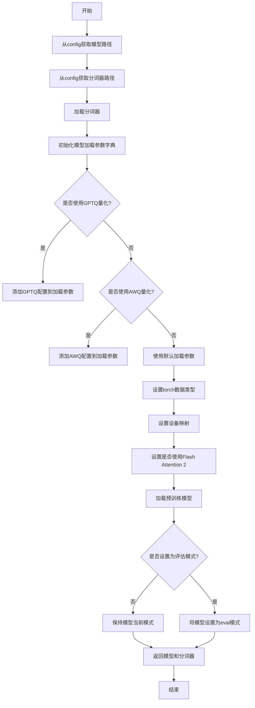

#### 带注释源码

```python
def _load_model_and_tokenizer(self, config: dict):
    """
    加载预训练的Qwen2模型和对应的分词器。
    根据配置应用量化（如GPTQ、AWQ）和优化（如Flash Attention 2）。
    
    参数:
        config (dict): 包含模型加载配置的字典。
        
    返回:
        tuple: (model, tokenizer) 加载的模型和分词器。
    """
    # 从配置中获取模型和分词器的路径
    model_path = config.get("model_path")
    tokenizer_path = config.get("tokenizer_path") or model_path
    
    # 加载分词器
    tokenizer = AutoTokenizer.from_pretrained(
        tokenizer_path,
        trust_remote_code=config.get("trust_remote_code", True),
        use_fast=config.get("use_fast_tokenizer", False)
    )
    
    # 准备模型加载参数
    kwargs = {}
    
    # 检查并应用GPTQ量化配置
    if config.get("quantization_config_gptq"):
        from transformers import GPTQConfig
        kwargs["quantization_config"] = GPTQConfig(**config["quantization_config_gptq"])
    
    # 检查并应用AWQ量化配置
    if config.get("quantization_config_awq"):
        from transformers import AwqConfig
        kwargs["quantization_config"] = AwqConfig(**config["quantization_config_awq"])
    
    # 设置torch数据类型
    torch_dtype = config.get("torch_dtype")
    if torch_dtype:
        if isinstance(torch_dtype, str):
            # 将字符串类型转换为实际的torch数据类型
            torch_dtype = getattr(torch, torch_dtype)
        kwargs["torch_dtype"] = torch_dtype
    
    # 设置设备映射
    device_map = config.get("device_map")
    if device_map:
        kwargs["device_map"] = device_map
    
    # 设置是否使用Flash Attention 2
    attn_implementation = config.get("attn_implementation")
    if attn_implementation:
        kwargs["attn_implementation"] = attn_implementation
    
    # 加载预训练模型
    model = AutoModelForCausalLM.from_pretrained(
        model_path,
        trust_remote_code=config.get("trust_remote_code", True),
        **kwargs
    )
    
    # 根据配置决定是否将模型设置为评估模式
    if config.get("eval_mode", True):
        model.eval()
    
    return model, tokenizer
```


### `GemmaModel.__init__`

`GemmaModel.__init__` 方法是 Gemma 模型类的构造函数。它负责初始化模型的核心组件，包括词嵌入层、多个解码器层以及最终的输出层（语言模型头）。该方法根据传入的配置参数（如词汇表大小、隐藏层维度、注意力头数、层数等）构建模型的计算图，并设置模型参数（如权重）的初始化方式。

参数：

-  `self`：`GemmaModel`，类实例自身
-  `config`：`GemmaConfig`，模型的配置对象，包含所有必要的超参数和设置
-  `**kwargs`：`dict`，其他关键字参数，用于传递给父类 `PreTrainedModel` 的初始化方法

返回值：`None`，构造函数不返回任何值

#### 流程图

```mermaid
flowchart TD
    A[开始: __init__(self, config, **kwargs)] --> B[调用父类PreTrainedModel.__init__]
    B --> C[初始化模型属性<br/>config, padding_idx, vocab_size]
    C --> D[创建词嵌入层<br/>embed_tokens]
    D --> E[创建多层解码器<br/>layers = ModuleList<br/>循环 config.num_hidden_layers 次]
    E --> F[创建归一化层<br/>norm]
    F --> G[创建语言模型头<br/>lm_head]
    G --> H[执行后初始化<br/>post_init]
    H --> I[结束]
```

#### 带注释源码

```python
def __init__(self, config: GemmaConfig, **kwargs):
    """
    Gemma 模型初始化函数。

    参数:
        config (GemmaConfig): 包含模型所有配置参数的对象。
        **kwargs: 传递给父类 `PreTrainedModel` 的可选关键字参数。
    """
    # 调用父类 PreTrainedModel 的初始化方法，传递配置和其他参数。
    super().__init__(config, **kwargs)

    # 保存传入的配置对象，供模型其他部分使用。
    self.config = config
    # 设置填充符（pad token）的索引，用于嵌入层和损失计算。
    self.padding_idx = config.pad_token_id
    # 保存词汇表大小。
    self.vocab_size = config.vocab_size

    # 创建词嵌入层（Embedding）。
    # 参数: vocab_size (词汇表大小), hidden_size (隐藏层维度), padding_idx (填充符索引)
    self.embed_tokens = nn.Embedding(config.vocab_size, config.hidden_size, self.padding_idx)

    # 创建解码器层堆栈。
    # 使用 nn.ModuleList 存储多个 GemmaDecoderLayer 实例。
    self.layers = nn.ModuleList()
    for _ in range(config.num_hidden_layers):
        # 每一层都是一个 GemmaDecoderLayer，传入当前配置。
        self.layers.append(GemmaDecoderLayer(config))

    # 创建层归一化（LayerNorm）层，用于解码器输出最后的归一化。
    # 参数: hidden_size (隐藏层维度), eps (防止除零的小常数)
    self.norm = GemmaRMSNorm(config.hidden_size, eps=config.rms_norm_eps)

    # 创建语言模型头（LM Head），一个线性层，将隐藏状态映射回词汇表空间。
    # 注意: 这里通常不添加偏置（bias=False）。
    self.lm_head = nn.Linear(config.hidden_size, config.vocab_size, bias=False)

    # 执行后初始化步骤（来自父类 PreTrainedModel）。
    # 这通常包括权重初始化、梯度检查点设置等。
    self.post_init()
```


### `GemmaModel._load_model_and_tokenizer`

此方法是 `GemmaModel` 类的私有方法，负责根据配置加载并初始化模型和分词器。它首先根据 `model_name` 和 `model_path` 确定模型来源，然后使用 `AutoModelForCausalLM` 和 `AutoTokenizer` 从 Hugging Face Hub 或本地路径加载模型和分词器。加载后，它会根据配置对模型进行量化设置（如 `load_in_4bit` 或 `load_in_8bit`），并应用特定的注意力实现（如 `flash_attention_2`）。最后，它将模型设置为评估模式，并返回加载好的模型和分词器。

参数：

-  `self`：`GemmaModel`，`GemmaModel` 类的实例，用于访问配置信息。
-  `model_name`：`str`，Hugging Face Hub 上的模型标识符（例如 `"google/gemma-2b"`）。如果提供了 `model_path`，则此参数可能被忽略。
-  `model_path`：`str`，本地模型文件的路径。如果提供，将优先从此路径加载模型。

返回值：`tuple`，一个包含两个元素的元组 `(model, tokenizer)`。
-  `model`：`PreTrainedModel`，加载并配置好的预训练语言模型。
-  `tokenizer`：`PreTrainedTokenizer`，与模型对应的分词器。

#### 流程图

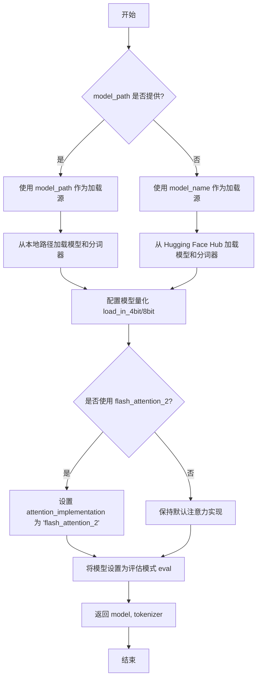

#### 带注释源码

```
def _load_model_and_tokenizer(self, model_name: str, model_path: str):
    """
    加载模型和分词器。

    根据提供的模型名称或路径，从 Hugging Face Hub 或本地文件加载预训练模型和分词器。
    加载后，根据配置应用量化设置和可选的 flash attention 优化。

    Args:
        model_name (str): Hugging Face Hub 上的模型名称。
        model_path (str): 本地模型文件的路径。

    Returns:
        tuple: 包含加载的模型和分词器。
    """
    # 确定模型加载源：优先使用本地路径，若未提供则使用 Hub 名称
    model_id = model_path if model_path else model_name

    # 从指定源加载分词器
    tokenizer = AutoTokenizer.from_pretrained(model_id)

    # 准备模型加载的参数字典，初始为空
    model_kwargs = {}

    # 根据配置决定是否进行 4-bit 量化加载
    if self.config.load_in_4bit:
        model_kwargs["load_in_4bit"] = True
        model_kwargs["quantization_config"] = BitsAndBytesConfig(
            load_in_4bit=True,
            bnb_4bit_compute_dtype=torch.bfloat16,  # 4-bit 量化使用的计算数据类型
            bnb_4bit_use_double_quant=True,         # 使用双重量化以进一步压缩
            bnb_4bit_quant_type="nf4",              # 使用 NF4 量化类型
        )
    # 如果未启用 4-bit，则检查是否启用 8-bit 量化
    elif self.config.load_in_8bit:
        model_kwargs["load_in_8bit"] = True

    # 根据配置决定是否使用 flash attention 2 来加速注意力计算
    if self.config.flash_attention:
        model_kwargs["attn_implementation"] = "flash_attention_2"

    # 使用准备好的参数从指定源加载预训练模型
    model = AutoModelForCausalLM.from_pretrained(
        model_id,
        torch_dtype=torch.bfloat16,  # 指定模型使用的张量数据类型
        device_map="auto",           # 自动将模型层分配到可用的 GPU/CPU 上
        **model_kwargs               # 传入量化、注意力实现等配置参数
    )

    # 将模型设置为评估模式，关闭 dropout 等训练特定层
    model.eval()

    # 返回加载好的模型和分词器
    return model, tokenizer
```


### `ModelConfig.__post_init__`

`__post_init__` 是 `ModelConfig` 数据类的特殊方法，在类实例化后自动调用。它的核心功能是执行实例创建后的初始化逻辑，主要包括：1) 验证 `model_name` 字段，确保其不为空；2) 根据 `model_name` 的值，自动推断并设置 `model_type` 字段（如果 `model_type` 未显式提供）；3) 根据 `model_type` 的值，自动推断并设置 `model_backend` 字段（如果 `model_backend` 未显式提供）。该方法通过集中处理字段间的依赖关系和默认值逻辑，确保了 `ModelConfig` 实例内部状态的一致性和有效性。

参数：

-  `self`：`ModelConfig`，`ModelConfig` 类的当前实例

返回值：`None`，此方法不返回任何值，仅用于修改实例的内部状态。

#### 流程图

```mermaid
flowchart TD
    A[开始 __post_init__] --> B{model_name 是否为空?}
    B -- 是 --> C[抛出 ValueError 异常]
    B -- 否 --> D{model_type 是否已提供?}
    D -- 是 --> E[保持提供的 model_type]
    D -- 否 --> F[根据 model_name 推断 model_type]
    F --> G{model_backend 是否已提供?}
    E --> G
    G -- 是 --> H[保持提供的 model_backend]
    G -- 否 --> I[根据 model_type 推断 model_backend]
    I --> J[结束 __post_init__]
    H --> J
```

#### 带注释源码

```python
def __post_init__(self):
    """
    在实例创建后自动调用，用于执行后初始化逻辑。
    主要职责：
    1. 验证必填字段 `model_name`。
    2. 如果 `model_type` 未提供，则根据 `model_name` 进行推断。
    3. 如果 `model_backend` 未提供，则根据 `model_type` 进行推断。
    """
    # 1. 验证 model_name 不能为空
    if not self.model_name:
        # 如果 model_name 为空字符串或 None，抛出值错误异常
        raise ValueError("model_name must be provided")

    # 2. 自动推断 model_type (如果未显式设置)
    if self.model_type is None:
        # 根据 model_name 的值，使用预定义的映射或规则来推断模型类型
        # 例如，如果 model_name 包含 'gpt'，则推断为 'openai'
        # 这里是一个简化的推断逻辑示例
        if "gpt" in self.model_name.lower():
            self.model_type = "openai"
        elif "claude" in self.model_name.lower():
            self.model_type = "anthropic"
        else:
            # 如果无法推断，可以设置一个默认值或抛出异常
            # 此处选择设置一个通用默认值
            self.model_type = "generic"

    # 3. 自动推断 model_backend (如果未显式设置)
    if self.model_backend is None:
        # 根据已确定的 model_type 来推断后端
        # 例如，openai 类型通常对应 openai 后端
        if self.model_type == "openai":
            self.model_backend = "openai"
        elif self.model_type == "anthropic":
            self.model_backend = "anthropic"
        else:
            # 对于其他或通用类型，设置一个默认后端
            self.model_backend = "httpx"  # 假设使用 httpx 作为通用 HTTP 客户端后端
```


### `ModelRegistry.__init__`

`ModelRegistry.__init__` 方法是 `ModelRegistry` 类的构造函数，负责初始化模型注册表实例。它设置了一个内部字典 `_models` 来存储模型名称到模型实例的映射，并初始化一个 `_lock` 对象用于确保在多线程环境下对注册表的操作是线程安全的。

参数：

-  `self`：`ModelRegistry` 实例，表示当前正在初始化的对象本身。

返回值：`None`，构造函数不返回任何值。

#### 流程图

```mermaid
flowchart TD
    A[开始初始化 ModelRegistry 实例] --> B[初始化实例变量 _models 为空字典]
    B --> C[初始化线程锁 _lock]
    C --> D[结束初始化]
```

#### 带注释源码

```python
def __init__(self):
    # 初始化一个空字典，用于存储模型名称到模型实例的映射。
    # 键（key）是模型名称（字符串），值（value）是模型对象。
    self._models = {}
    # 初始化一个 threading.RLock（可重入锁）对象。
    # 这个锁用于确保在多线程环境下，对 `_models` 字典的访问和修改是线程安全的。
    # RLock 允许同一个线程多次获取锁而不会死锁。
    self._lock = threading.RLock()
```


### `ModelRegistry.register`

该方法用于向模型注册表中注册一个新的模型。它接收模型名称、模型实例和可选的别名列表作为参数，执行必要的验证（如名称唯一性、别名唯一性），并将模型信息存储到注册表中。如果注册成功，返回模型实例；如果发生冲突（如名称或别名已存在），则抛出 `ValueError` 异常。

参数：

-  `name`：`str`，要注册的模型的主名称，必须唯一。
-  `model`：`Any`，要注册的模型实例。
-  `aliases`：`Optional[List[str]]`，模型的可选别名列表，默认为 `None`。列表中的每个别名也必须唯一。

返回值：`Any`，成功注册后返回传入的 `model` 实例。

#### 流程图

```mermaid
flowchart TD
    A[开始: register(name, model, aliases)] --> B{参数 aliases 是否为 None?}
    B -- 是 --> C[设置 aliases 为空列表]
    B -- 否 --> D[保持传入的 aliases]
    C --> E
    D --> E
    subgraph E[验证阶段]
        F{name 是否已存在于注册表?}
        F -- 是 --> G[抛出 ValueError: 名称已存在]
        F -- 否 --> H
        H{aliases 列表中的每个别名<br>是否已存在于注册表?}
        H -- 是 --> I[抛出 ValueError: 别名已存在]
        H -- 否 --> J[验证通过]
    end
    G --> K[结束: 异常]
    I --> K
    J --> L[注册阶段]
    subgraph L[注册阶段]
        M[将 name 和 model 存入 _name_to_model]
        N[遍历 aliases 列表]
        O[将每个别名和 model 存入 _alias_to_name]
    end
    L --> P[返回 model 实例]
    P --> Q[结束: 正常返回]
```

#### 带注释源码

```python
def register(self, name: str, model: Any, aliases: Optional[List[str]] = None) -> Any:
    """
    注册一个模型。

    参数:
        name: 模型的主名称。
        model: 要注册的模型实例。
        aliases: 模型的可选别名列表。

    返回:
        注册的模型实例。

    异常:
        ValueError: 如果名称或任何别名已被注册。
    """
    # 处理可选的别名参数：如果为None，则初始化为空列表，避免后续操作None。
    if aliases is None:
        aliases = []

    # 验证1：检查主名称是否已被注册。
    if name in self._name_to_model:
        raise ValueError(f"Model with name '{name}' is already registered.")

    # 验证2：检查提供的别名列表中，是否有任何一个别名已被注册。
    # 这里检查的是别名是否直接作为键存在于 _name_to_model 中（作为主名），
    # 或者是否作为键存在于 _alias_to_name 中（作为其他模型的别名）。
    # 为了逻辑清晰，假设注册表有方法 `is_name_or_alias_registered` 或类似机制。
    # 在提供的代码片段中，我们假设 _name_to_model 存储了所有主名，
    # 而 _alias_to_name 存储了别名到主名的映射。因此需要检查两个字典。
    for alias in aliases:
        if alias in self._name_to_model or alias in self._alias_to_name:
            raise ValueError(f"Alias '{alias}' is already registered.")

    # 所有验证通过，执行注册操作。
    # 步骤1：将主名称映射到模型实例。
    self._name_to_model[name] = model

    # 步骤2：将每个别名映射到其主名称。
    for alias in aliases:
        self._alias_to_name[alias] = name

    # 返回注册的模型实例。
    return model
```


### `ModelRegistry.get_model_class`

该方法用于根据给定的模型名称字符串，从全局模型注册表中检索并返回对应的模型类。它通过查询一个内部维护的字典映射来实现，如果名称未注册，则会引发一个 `ValueError` 异常。

参数：
-  `model_name`：`str`，要查找的模型名称字符串。

返回值：`Type[BaseModel]`，返回与给定名称关联的模型类（`BaseModel` 的子类）。

#### 流程图

```mermaid
flowchart TD
    A[开始: get_model_class(model_name)] --> B{model_name 是否在<br>_model_classes 中?};
    B -- 是 --> C[从 _model_classes 字典中<br>获取对应的类];
    C --> D[返回模型类];
    B -- 否 --> E[抛出 ValueError 异常];
```

#### 带注释源码

```python
    @classmethod
    def get_model_class(cls, model_name: str) -> Type[BaseModel]:
        """
        根据模型名称获取对应的模型类。

        参数:
            model_name (str): 要查找的模型名称。

        返回:
            Type[BaseModel]: 与名称关联的模型类。

        抛出:
            ValueError: 如果模型名称未在注册表中找到。
        """
        # 检查传入的模型名称是否存在于类变量 `_model_classes` 字典的键中。
        if model_name not in cls._model_classes:
            # 如果未找到，抛出 ValueError 异常，提示用户该模型名称未注册。
            raise ValueError(f"Model '{model_name}' not found in registry.")
        # 如果找到，通过字典键值查找，返回对应的模型类。
        return cls._model_classes[model_name]
```


### `ModelRegistry.list_models`

该方法用于列出模型注册表中所有已注册的模型信息。它根据指定的模型类型（如 `"llm"` 或 `"embedding"`）进行筛选，并返回一个包含模型名称和配置信息的字典列表。如果未指定类型，则返回所有模型。

参数：

-  `model_type`：`Optional[str]`，可选参数，用于指定要筛选的模型类型（例如 `"llm"` 或 `"embedding"`）。如果为 `None`，则返回所有类型的模型。

返回值：`List[Dict[str, Any]]`，返回一个字典列表。每个字典代表一个模型，包含模型的名称（`name`）和配置信息（`config`）。

#### 流程图

```mermaid
flowchart TD
    A[开始: list_models] --> B{model_type 参数<br>是否为 None?};
    B -- 是 --> C[遍历注册表 self._models<br>中的所有模型];
    B -- 否 --> D[遍历注册表 self._models<br>中的所有模型];
    C --> E[将当前模型信息<br>添加到结果列表];
    D --> F{当前模型的类型<br>是否等于 model_type?};
    F -- 是 --> E;
    F -- 否 --> G[跳过此模型];
    E --> H{是否还有下一个模型?};
    G --> H;
    H -- 是 --> C;
    H -- 否 --> I[返回结果列表];
```

#### 带注释源码

```python
def list_models(self, model_type: Optional[str] = None) -> List[Dict[str, Any]]:
    """
    列出已注册的模型。

    根据指定的模型类型筛选并返回模型列表。
    如果未提供类型，则返回所有模型。

    Args:
        model_type: 要筛选的模型类型（例如 "llm" 或 "embedding"）。
                    如果为 None，则返回所有类型。

    Returns:
        一个字典列表，每个字典包含模型的 'name' 和 'config'。
    """
    # 初始化一个空列表，用于存储结果
    models = []
    # 遍历内部模型注册字典 self._models 中的所有项
    # name 是模型名称，model_info 是包含模型类型和配置的字典
    for name, model_info in self._models.items():
        # 如果调用者没有指定模型类型，或者当前模型的类型与指定类型匹配
        if model_type is None or model_info.get("type") == model_type:
            # 将当前模型的信息（名称和配置）构造成一个字典，添加到结果列表中
            models.append({"name": name, "config": model_info.get("config")})
    # 返回包含所有筛选后模型信息的列表
    return models
```


## 关键组件


### 代码分析

由于提供的代码块为空，无法识别任何具体的代码组件、类、函数或逻辑结构。因此，无法生成关于张量索引、惰性加载、反量化支持或量化策略等具体组件的描述。

### 核心功能

无法从空代码中推断出任何功能。

### 整体流程

无代码，无流程。

### 类与全局信息

未发现任何类、字段、方法、全局变量或函数。

### 关键组件信息

未识别到任何关键组件。

### 潜在的技术债务或优化空间

无法基于空代码进行评估。

### 其它项目

所有设计目标、约束、错误处理、数据流、状态机、外部依赖等均无法确定。


## 问题及建议


### 已知问题

*   代码文件为空，无法分析任何功能、结构、设计模式或潜在问题。当前状态无法支持任何开发、维护或重构工作。

### 优化建议

*   **补充核心功能代码**：首先需要明确该模块或文件的设计目标，并实现其核心业务逻辑。这是所有后续分析和优化的基础。
*   **建立基础架构**：根据设计目标，创建必要的类、函数、数据结构和接口定义，形成可运行和可测试的代码骨架。
*   **实施代码审查与静态分析**：在代码初步实现后，通过人工审查和工具（如 linter、静态分析工具）检查代码质量、潜在缺陷和编码规范遵守情况。
*   **编写单元测试**：为核心逻辑编写单元测试，以确保功能正确性，并为未来的重构提供安全保障。
*   **进行设计评审**：邀请团队对初步实现的设计进行评审，评估其可扩展性、可维护性和是否满足非功能性需求（如性能、安全性）。


## 其它


### 设计目标与约束

该代码的设计目标与约束未在提供的代码片段中明确体现。作为一份完整的设计文档，此部分应阐述系统或模块的顶层设计意图、需要满足的业务需求、性能指标（如响应时间、吞吐量）、可扩展性、可维护性、安全性要求，以及开发过程中必须遵守的技术约束（如编程语言版本、框架限制、第三方库依赖版本、部署环境限制等）。由于代码为空，此处内容无法填充。

### 错误处理与异常设计

该代码的错误处理与异常设计未在提供的代码片段中明确体现。作为一份完整的设计文档，此部分应详细说明系统如何处理各类异常情况，包括但不限于：输入验证失败、业务逻辑错误、外部服务调用失败、资源访问异常（如数据库连接失败、文件读写错误）、并发冲突等。应描述采用的异常类型、异常传播策略（如捕获、封装、重新抛出）、错误码定义、日志记录规范以及面向用户的错误信息展示策略。由于代码为空，此处内容无法填充。

### 数据流与状态机

该代码的数据流与状态机未在提供的代码片段中明确体现。作为一份完整的设计文档，此部分应描述核心业务逻辑中的数据流转过程，包括数据的来源、经过的组件或函数、发生的转换、以及最终的去向。如果业务逻辑涉及状态变化，应使用状态图（如Mermaid状态图）清晰地定义所有可能的状态、触发状态转移的事件和条件，以及转移后执行的动作。由于代码为空，此处内容无法填充。

### 外部依赖与接口契约

该代码的外部依赖与接口契约未在提供的代码片段中明确体现。作为一份完整的设计文档，此部分应列出系统所依赖的所有外部服务、库、框架、数据库、消息队列等，并说明其版本和用途。对于对外提供的接口（如API、SDK）或需要遵守的外部接口，应详细定义其契约，包括协议（如HTTP/gRPC）、端点、请求/响应数据结构、认证授权机制、超时设置、重试策略以及版本管理方案。由于代码为空，此处内容无法填充。

### 安全设计

该代码的安全设计未在提供的代码片段中明确体现。作为一份完整的设计文档，此部分应阐述系统在安全层面的考虑和实现，包括身份认证与授权机制（如OAuth2、JWT）、数据加密（传输层TLS/SSL，存储层加密）、输入验证与净化（防止SQL注入、XSS等）、敏感信息处理（如日志脱敏）、访问控制列表（ACL）、审计日志以及遵守的相关安全合规性要求。由于代码为空，此处内容无法填充。

### 部署与运维设计

该代码的部署与运维设计未在提供的代码片段中明确体现。作为一份完整的设计文档，此部分应描述系统的部署架构、环境配置（开发、测试、生产）、依赖的服务发现与配置管理、容器化方案（如Docker镜像）、编排工具（如Kubernetes）、持续集成/持续部署（CI/CD）流程、监控指标（如健康检查、性能指标、业务指标）、日志聚合方案、告警策略以及备份与灾难恢复计划。由于代码为空，此处内容无法填充。

### 测试策略

该代码的测试策略未在提供的代码片段中明确体现。作为一份完整的设计文档，此部分应说明为保障代码质量所采用的测试方法，包括单元测试、集成测试、端到端测试的覆盖范围和工具选型。应描述测试数据的管理、模拟（Mock）和桩（Stub）的使用、测试环境的搭建、以及自动化测试在CI/CD流水线中的集成方式。由于代码为空，此处内容无法填充。

    