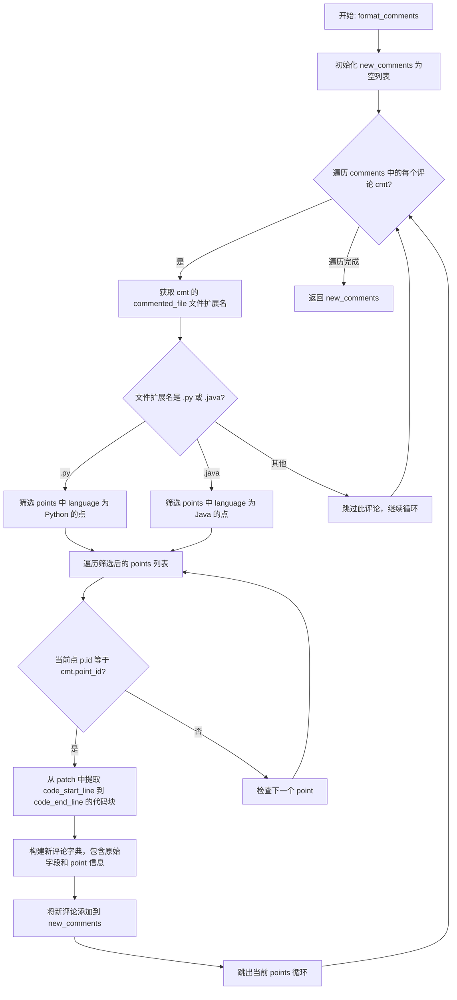
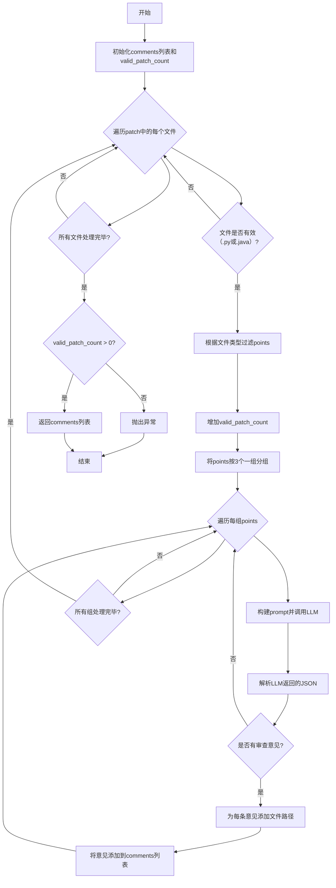

# `.\MetaGPT\metagpt\ext\cr\actions\code_review.py` 详细设计文档

该代码实现了一个基于大语言模型（LLM）的自动化代码审查（Code Review）功能。它接收一个代码补丁（Patch）和一系列代码规范点（Points），通过LLM分析补丁中的代码是否违反规范，生成审查意见，并经过二次确认后输出最终的审查结果。

## 整体流程

```mermaid
graph TD
    A[开始: 输入Patch和Points] --> B[预处理Patch: 清理无用部分并添加行号]
    B --> C{遍历Patch中的每个文件}
    C -- 是.py或.java文件 --> D[按语言筛选Points]
    D --> E[将Points分组(每组3个)]
    E --> F[对每组Points调用LLM进行审查]
    F --> G[解析LLM返回的JSON评论]
    G --> H[将评论关联到对应文件]
    H --> I{是否遍历完所有文件?}
    I -- 否 --> C
    I -- 是 --> J[将原始评论写入日志文件]
    J --> K[格式化评论: 关联Point详情并提取代码块]
    K --> L[确认评论: 调用LLM二次验证评论准确性]
    L --> M[过滤无效评论(如空代码块)]
    M --> N[将最终评论写入输出文件]
    N --> O[返回最终审查结果]
    C -- 非.py/.java文件 --> P[跳过]
    P --> I
```

## 类结构

```
Action (来自metagpt.actions.action)
└── CodeReview
```

## 全局变量及字段


### `CODE_REVIEW_PROMPT_TEMPLATE`
    
用于代码审查的提示词模板，定义了审查步骤、输入格式和输出格式。

类型：`str`
    


### `CODE_REVIEW_COMFIRM_SYSTEM_PROMPT`
    
用于确认代码审查结果的系统提示词，定义了审查者的角色和任务。

类型：`str`
    


### `CODE_REVIEW_COMFIRM_TEMPLATE`
    
用于确认代码审查结果的提示词模板，包含代码、审查评论、缺陷描述和判断参考示例。

类型：`str`
    


### `CodeReview.name`
    
动作的名称，固定为'CodeReview'，用于标识该动作的类型。

类型：`str`
    
    

## 全局函数及方法

### `CodeReview.format_comments`

该方法用于格式化代码审查的评论列表。它接收原始的评论列表、代码规范点列表和补丁集，根据评论对应的文件类型（Python 或 Java）筛选出相应的规范点，并将评论与对应的规范点详细信息（如规范点文本、详细描述等）关联起来，生成一个新的、更丰富的评论列表。

参数：

- `comments`：`list[dict]`，原始的代码审查评论列表，每个评论是一个字典，包含如 `commented_file`、`comment`、`code_start_line`、`code_end_line`、`point_id` 等字段。
- `points`：`list[Point]`，代码规范点列表，每个 `Point` 对象包含 `id`、`language`、`text`、`detail` 等属性。
- `patch`：`PatchSet`，表示代码变更的补丁集，用于根据行号提取具体的代码块。

返回值：`list[dict]`，返回一个新的评论列表。每个评论字典包含了原始评论的所有字段，并额外添加了 `code`（从补丁中提取的代码块）、`point`（规范点文本）和 `point_detail`（规范点详细描述）字段。

#### 流程图



#### 带注释源码

```python
def format_comments(self, comments: list[dict], points: list[Point], patch: PatchSet):
    new_comments = []  # 初始化一个新的列表，用于存放格式化后的评论
    logger.debug(f"original comments: {comments}")  # 记录原始评论列表，用于调试

    # 遍历原始的评论列表
    for cmt in comments:
        try:
            # 根据评论对应的文件类型，筛选出相应的代码规范点
            if cmt.get("commented_file").endswith(".py"):
                points = [p for p in points if p.language == "Python"]  # 只保留 Python 相关的规范点
            elif cmt.get("commented_file").endswith(".java"):
                points = [p for p in points if p.language == "Java"]  # 只保留 Java 相关的规范点
            else:
                continue  # 如果文件类型不是 .py 或 .java，则跳过此评论

            # 遍历筛选后的规范点列表，寻找与当前评论 point_id 匹配的规范点
            for p in points:
                point_id = int(cmt.get("point_id", -1))  # 获取评论的 point_id，默认为 -1
                if point_id == p.id:  # 如果找到匹配的规范点
                    # 从评论中获取代码块的起始和结束行号
                    code_start_line = cmt.get("code_start_line")
                    code_end_line = cmt.get("code_end_line")
                    # 根据行号从补丁集中提取具体的代码块
                    code = get_code_block_from_patch(patch, code_start_line, code_end_line)

                    # 构建一个新的评论字典，包含原始评论的所有字段，并添加代码块和规范点详细信息
                    new_comments.append(
                        {
                            "commented_file": cmt.get("commented_file"),  # 评论的文件路径
                            "code": code,  # 提取的代码块
                            "code_start_line": code_start_line,  # 代码起始行号
                            "code_end_line": code_end_line,  # 代码结束行号
                            "comment": cmt.get("comment"),  # 原始评论内容
                            "point_id": p.id,  # 规范点 ID
                            "point": p.text,  # 规范点文本描述
                            "point_detail": p.detail,  # 规范点详细描述
                        }
                    )
                    break  # 找到匹配的规范点后，跳出当前循环
        except Exception:
            pass  # 如果处理过程中出现异常，则跳过此评论

    logger.debug(f"new_comments: {new_comments}")  # 记录格式化后的评论列表，用于调试
    return new_comments  # 返回格式化后的评论列表
```

### `CodeReview.confirm_comments`

该方法用于对代码审查生成的评论进行二次确认。它接收原始的评论列表、代码补丁集和审查标准点，通过调用大语言模型（LLM）对每条评论的准确性进行判断。它会为每条评论提取相关的代码块（附带上下文），并构建一个提示词，要求LLM判断给定的代码是否确实违反了对应的审查标准点。只有被LLM确认为“True”的评论才会被保留在最终结果中，从而过滤掉可能不准确或无关的评论。

参数：

-  `patch`：`PatchSet`，包含代码变更的补丁集对象，用于提取特定行号的代码块。
-  `comments`：`list[dict]`，待确认的原始评论列表，每个评论是一个字典，包含`commented_file`、`comment`、`code_start_line`、`code_end_line`、`point_id`等字段。
-  `points`：`list[Point]`，代码审查所依据的标准点列表，每个`Point`对象包含`id`、`text`（描述）、`yes_example`、`no_example`等属性。

返回值：`list[dict]`，返回经过LLM确认后保留下来的评论列表，其结构与输入的`comments`参数一致。

#### 流程图

```mermaid
flowchart TD
    A[开始: confirm_comments] --> B[构建 points 字典<br>points_dict = {point.id: point}]
    B --> C[初始化新评论列表<br>new_comments = []]
    C --> D{遍历 comments 列表<br>cmt in comments}
    D --> E[根据 point_id 获取对应 Point 对象]
    E --> F{检查 code_start_line<br>和 code_end_line 是否有效?}
    F -- 否 --> G[记录日志并跳过此评论]
    G --> D
    F -- 是 --> H[提取代码块并添加上下文]
    H --> I{检查提取的代码块<br>是否仅包含空白/分隔符?}
    I -- 是 --> J[扩大上下文范围重新提取]
    J --> K
    I -- 否 --> K[根据文件扩展名确定编程语言]
    K --> L[构建确认提示词 prompt]
    L --> M[构建系统提示词 system_prompt]
    M --> N[调用 LLM 进行判断<br>resp = await self.llm.aask]
    N --> O{LLM 响应中<br>是否包含 'True' 或 'true'?}
    O -- 否 --> P[丢弃此评论]
    P --> D
    O -- 是 --> Q[将此评论加入 new_comments]
    Q --> D
    D --> R[遍历结束]
    R --> S[记录原始与确认后评论数量]
    S --> T[返回 new_comments]
```

#### 带注释源码

```python
async def confirm_comments(self, patch: PatchSet, comments: list[dict], points: list[Point]) -> list[dict]:
    # 将 points 列表转换为字典，便于通过 id 快速查找
    points_dict = {point.id: point for point in points}
    # 初始化一个空列表，用于存放通过确认的评论
    new_comments = []
    # 遍历输入的每一条评论
    for cmt in comments:
        try:
            # 根据评论中的 point_id 从字典中获取对应的审查标准点（Point 对象）
            point = points_dict[cmt.get("point_id")]

            # 从评论中获取代码块的起始行和结束行
            code_start_line = cmt.get("code_start_line")
            code_end_line = cmt.get("code_end_line")
            # 如果起始行或结束行为空，则丢弃这条评论并记录日志
            if not code_start_line or not code_end_line:
                logger.info("False")
                continue

            # 为了提升确认的准确性，提取代码块时附带上下文（前后各扩展3行）
            code = get_code_block_from_patch(
                patch, str(max(1, int(code_start_line) - 3)), str(int(code_end_line) + 3)
            )
            # 定义一个正则表达式模式，用于匹配仅包含空白字符、换行符或常见分隔符的字符串
            pattern = r"^[ \t\n\r(){}[\];,]*$"
            # 如果提取的代码块匹配上述模式（即几乎是空的或只有结构字符），则扩大上下文范围重新提取（前后各扩展5行）
            if re.match(pattern, code):
                code = get_code_block_from_patch(
                    patch, str(max(1, int(code_start_line) - 5)), str(int(code_end_line) + 5)
                )
            # 根据评论的文件扩展名确定编程语言，用于后续的系统提示词
            code_language = "Java"
            code_file_ext = cmt.get("commented_file", ".java").split(".")[-1]
            if code_file_ext == ".java":
                code_language = "Java"
            elif code_file_ext == ".py":
                code_language = "Python"
            # 使用模板构建发送给 LLM 的确认提示词，包含代码、评论、缺陷描述和正反示例
            prompt = CODE_REVIEW_COMFIRM_TEMPLATE.format(
                code=code,
                comment=cmt.get("comment"),
                desc=point.text,
                example=point.yes_example + "\n" + point.no_example,
            )
            # 构建系统提示词，指定 LLM 的角色和专长
            system_prompt = [CODE_REVIEW_COMFIRM_SYSTEM_PROMPT.format(code_language=code_language)]
            # 异步调用 LLM 进行判断
            resp = await self.llm.aask(prompt, system_msgs=system_prompt)
            # 检查 LLM 的响应中是否包含“True”（不区分大小写），如果是，则保留该评论
            if "True" in resp or "true" in resp:
                new_comments.append(cmt)
        except Exception:
            # 处理过程中发生任何异常，记录日志并跳过当前评论
            logger.info("False")
    # 记录原始评论数量和经过确认后保留的评论数量
    logger.info(f"original comments num: {len(comments)}, confirmed comments num: {len(new_comments)}")
    # 返回确认后的评论列表
    return new_comments
```

### `CodeReview.cr_by_points`

该方法根据给定的代码审查标准点（Points）对补丁（Patch）进行审查，生成不符合标准的代码注释。它通过分组处理标准点，调用大语言模型（LLM）进行分析，并收集所有生成的审查意见。

参数：

- `patch`：`PatchSet`，包含待审查代码变更的补丁集。
- `points`：`list[Point]`，代码审查标准点列表，每个点包含ID、描述、语言等信息。

返回值：`list[dict]`，返回一个字典列表，每个字典代表一条审查意见，包含文件路径、注释、代码起止行和引用的标准点ID。

#### 流程图



#### 带注释源码

```python
async def cr_by_points(self, patch: PatchSet, points: list[Point]):
    comments = []  # 初始化存储所有审查意见的列表
    valid_patch_count = 0  # 计数器，记录有效（支持的语言）补丁文件数量
    for patched_file in patch:  # 遍历补丁集中的每个文件
        if not patched_file:  # 如果文件对象为空，跳过
            continue
        if patched_file.path.endswith(".py"):  # 如果是Python文件
            points = [p for p in points if p.language == "Python"]  # 过滤出Python相关的审查点
            valid_patch_count += 1  # 有效文件计数加1
        elif patched_file.path.endswith(".java"):  # 如果是Java文件
            points = [p for p in points if p.language == "Java"]  # 过滤出Java相关的审查点
            valid_patch_count += 1  # 有效文件计数加1
        else:  # 如果是其他语言文件，跳过
            continue
        group_points = [points[i : i + 3] for i in range(0, len(points), 3)]  # 将审查点按每3个一组进行分组
        for group_point in group_points:  # 遍历每组审查点
            points_str = "id description\n"  # 构建审查点描述字符串的头部
            points_str += "\n".join([f"{p.id} {p.text}" for p in group_point])  # 将组内每个审查点的ID和描述拼接成字符串
            prompt = CODE_REVIEW_PROMPT_TEMPLATE.format(patch=str(patched_file), points=points_str)  # 格式化提示词模板
            resp = await self.llm.aask(prompt)  # 调用大语言模型（LLM）获取审查意见
            json_str = parse_json_code_block(resp)[0]  # 从LLM响应中解析出JSON字符串
            comments_batch = json.loads(json_str)  # 将JSON字符串反序列化为Python列表
            if comments_batch:  # 如果该批次有审查意见
                patched_file_path = patched_file.path  # 获取当前文件的路径
                for c in comments_batch:  # 遍历该批次的所有意见
                    c["commented_file"] = patched_file_path  # 为每条意见添加文件路径信息
                comments.extend(comments_batch)  # 将该批次的意见添加到总列表中

    if valid_patch_count == 0:  # 如果没有有效的补丁文件（即没有支持的语言）
        raise ValueError("Only code reviews for Python and Java languages are supported.")  # 抛出异常

    return comments  # 返回所有收集到的审查意见
```

### `CodeReview.run`

`CodeReview.run` 是 `CodeReview` 类的核心执行方法。它接收一个代码补丁（PatchSet）、一个代码审查标准点列表（Points）和一个输出文件路径，执行完整的自动化代码审查流程。该方法首先清理和预处理补丁，然后基于给定的审查标准点，使用大语言模型（LLM）对补丁中的代码进行审查，生成初步的审查意见。接着，它会格式化这些意见，并通过二次确认（再次调用LLM）来过滤掉可能不准确的意见。最终，将确认后的、有效的审查意见保存到指定的JSON文件中，并返回这些意见的列表。

参数：

- `patch`：`PatchSet`，表示待审查的代码变更补丁集，包含新增、修改或删除的代码行。
- `points`：`list[Point]`，代码审查的标准点列表，每个`Point`定义了特定编程语言（如Python、Java）的代码规范或最佳实践。
- `output_file`：`str`，指定最终审查结果（JSON格式）的保存路径。

返回值：`list[dict]`，返回一个字典列表，每个字典代表一条确认有效的代码审查意见，包含文件路径、问题代码、起止行号、审查意见、关联的标准点ID及详情等信息。

#### 流程图

```mermaid
graph TD
    A[开始: run(patch, points, output_file)] --> B[预处理补丁: <br>rm_patch_useless_part, add_line_num_on_patch]
    B --> C[初始化结果列表 result 和日志 reporter]
    C --> D{调用 cr_by_points 生成初步审查意见 comments}
    D --> E[将初步意见写入日志文件 .log]
    E --> F{判断 comments 是否为空?}
    F -- 是 --> G[直接进入结果保存阶段]
    F -- 否 --> H[格式化审查意见: format_comments]
    H --> I[确认审查意见有效性: confirm_comments]
    I --> J[过滤空代码或纯空白字符的意见]
    J --> K[将有效意见加入 result]
    K --> L[将最终确认的 comments 写入 output_file]
    L --> M[返回 result]
    G --> L
```

#### 带注释源码

```python
async def run(self, patch: PatchSet, points: list[Point], output_file: str):
    # 1. 预处理补丁：移除无用部分并为每行添加行号，便于后续定位和LLM理解。
    patch: PatchSet = rm_patch_useless_part(patch)
    patch: PatchSet = add_line_num_on_patch(patch)

    # 2. 初始化最终返回的结果列表。
    result = []
    # 3. 使用上下文管理器创建报告器，用于记录过程日志（如启用LLM流式输出）。
    async with EditorReporter(enable_llm_stream=True) as reporter:
        # 4. 定义并创建初步审查意见的日志文件路径。
        log_cr_output_path = Path(output_file).with_suffix(".log")
        # 5. 报告日志文件创建元信息。
        await reporter.async_report(
            {"src_path": str(log_cr_output_path), "filename": log_cr_output_path.name}, "meta"
        )
        # 6. 核心步骤：调用`cr_by_points`方法，使用LLM根据points审查patch，生成初步意见列表。
        comments = await self.cr_by_points(patch=patch, points=points)
        # 7. 确保日志文件目录存在。
        log_cr_output_path.parent.mkdir(exist_ok=True, parents=True)
        # 8. 将初步审查意见（原始LLM输出）写入日志文件，便于调试和追溯。
        async with aiofiles.open(log_cr_output_path, "w", encoding="utf-8") as f:
            await f.write(json.dumps(comments, ensure_ascii=False, indent=2))
        # 9. 报告日志文件已写入。
        await reporter.async_report(log_cr_output_path)

    # 10. 如果初步审查意见不为空，则进行后续处理。
    if len(comments) != 0:
        # 11. 格式化审查意见：将意见与具体的Point详情关联，并提取出对应的代码块。
        comments = self.format_comments(comments, points, patch)
        # 12. 确认审查意见：使用另一个LLM调用，判断每条意见是否准确有效，过滤掉误报。
        comments = await self.confirm_comments(patch=patch, comments=comments, points=points)
        # 13. 遍历确认后的意见，过滤掉代码块为空或仅为空白字符的无效意见。
        for comment in comments:
            if comment["code"]:
                if not (comment["code"].isspace()):
                    result.append(comment)

    # 14. 再次使用报告器（默认配置），处理最终结果的保存和报告。
    async with EditorReporter() as reporter:
        src_path = output_file
        cr_output_path = Path(output_file)
        # 15. 报告最终输出文件的元信息。
        await reporter.async_report(
            {"type": "CodeReview", "src_path": src_path, "filename": cr_output_path.name}, "meta"
        )
        # 16. 将最终确认且过滤后的审查意见（comments）写入指定的输出文件。
        async with aiofiles.open(cr_output_path, "w", encoding="utf-8") as f:
            await f.write(json.dumps(comments, ensure_ascii=False, indent=2))
        # 17. 报告输出文件已写入。
        await reporter.async_report(cr_output_path)
    # 18. 返回最终的有效审查意见列表。
    return result
```

## 关键组件

### CodeReview 类

`CodeReview` 类是 `Action` 的子类，负责执行代码审查的核心逻辑。它通过分析代码补丁（Patch）和给定的代码规范点（Points），利用大语言模型（LLM）生成审查意见，并对这些意见进行格式化和二次确认，最终输出结构化的审查结果。

### 张量索引与惰性加载

代码中未直接使用张量索引或惰性加载技术。主要的数据结构是 `PatchSet`（来自 `unidiff` 库）和 `Point` 列表，它们被完整加载到内存中进行处理。审查过程是按文件、按规范点分组进行的，但并未实现数据流的惰性加载。

### 反量化支持

代码中未涉及量化或反量化操作。这里的“量化”可能指代“量化策略”，即代码审查的规范点（Points）。系统支持根据不同的编程语言（如 Python、Java）筛选和分组这些规范点，但并未对规范点本身进行数值化或量化处理。

### 量化策略

代码审查的“量化策略”体现在对审查规范点（Points）的处理上。系统将规范点按语言（Python/Java）进行筛选，并为了控制提示词（Prompt）长度，将规范点分组（例如每3个一组）提交给大语言模型进行分析。这种分组策略是一种对审查范围和LLM输入长度的量化控制。

## 问题及建议

### 已知问题

-   **`format_comments` 方法中的 `points` 变量被意外覆盖**：在 `format_comments` 方法中，`points` 既是输入参数，又在循环内部被重新赋值（`points = [p for p in points if p.language == "Python"]` 等）。这会导致后续循环中使用的 `points` 列表是过滤后的子集，而非原始列表，可能引发逻辑错误，例如无法正确匹配其他语言的代码审查点。
-   **`cr_by_points` 方法中的 `points` 变量被意外覆盖**：与 `format_comments` 类似，`cr_by_points` 方法也根据文件扩展名过滤 `points` 列表（`points = [p for p in points if p.language == "Python"]`），这会改变传入的原始列表，影响后续处理。
-   **`confirm_comments` 方法中 `points_dict` 的键值类型不匹配**：`points_dict` 使用 `point.id` 作为键，但在 `format_comments` 中，`point_id` 是从 JSON 中获取的字符串，而在 `confirm_comments` 中，`cmt.get("point_id")` 返回的可能是字符串或整数，存在类型不一致的风险，可能导致键查找失败。
-   **`confirm_comments` 方法中正则表达式匹配逻辑可能过于宽松**：用于判断代码块是否为空的模式 `r"^[ \t\n\r(){}[\];,]*$"` 可能无法准确识别所有“空”或“无意义”的代码块，例如包含运算符或引号的代码片段可能被误判，导致不必要的上下文扩展。
-   **`cr_by_points` 方法中 `group_points` 的分组逻辑可能导致审查点遗漏**：将审查点按每3个一组进行分割，如果总点数不是3的倍数，最后一组可能包含少于3个点。虽然不影响功能，但分组处理可能增加LLM调用的复杂性，且未明确说明分组的原因（如避免token超限）。
-   **错误处理不够精细**：多个方法中使用 `try...except Exception` 捕获所有异常，并简单地 `pass` 或记录日志。这可能导致潜在的错误被忽略，难以调试和定位问题根源。
-   **代码重复**：`format_comments` 和 `cr_by_points` 方法中都有根据文件扩展名过滤 `points` 列表的逻辑，这部分代码可以抽取为公共函数以提高可维护性。
-   **硬编码的语言支持**：代码中仅明确支持 `.py` 和 `.java` 文件扩展名，缺乏扩展性。添加对新语言的支持需要修改多处条件判断。

### 优化建议

-   **避免修改输入参数**：在 `format_comments` 和 `cr_by_points` 方法中，应为过滤操作创建新的局部变量（如 `filtered_points`），而不是直接覆盖输入参数 `points`，以保持函数无副作用和逻辑清晰。
-   **统一数据类型**：确保 `point_id` 在整个处理流程中保持一致的整数类型。在 `format_comments` 中从 JSON 解析后，应将其转换为整数。
-   **优化空代码块检测逻辑**：考虑使用更精确的方法来检测代码块是否包含有意义的代码，例如检查是否包含字母数字字符或特定语言的关键字，而不是仅依赖空白字符和标点符号。
-   **重构分组逻辑**：评估 `cr_by_points` 中分组处理审查点的必要性。如果是为了控制提示词长度，可以考虑更动态的分组策略，或直接处理整个列表并依赖LLM的token限制处理。
-   **细化异常处理**：将通用的 `except Exception` 替换为更具体的异常类型捕获，并在捕获异常时记录更详细的错误信息（如异常对象、相关变量状态），以便于问题排查。
-   **提取公共函数**：将根据文件扩展名过滤审查点的逻辑提取为一个独立的函数，例如 `filter_points_by_language(points, file_extension)`，以减少代码重复。
-   **增强语言扩展性**：将支持的语言和对应的文件扩展名映射关系配置化（例如使用字典或配置文件），使得添加新语言时只需更新配置，而无需修改核心代码逻辑。
-   **添加输入验证**：在方法开始处添加对输入参数（如 `patch`、`points`、`output_file`）的基本验证，确保它们非空且符合预期格式，提高代码的健壮性。
-   **优化日志记录**：当前使用 `logger.debug` 和 `logger.info` 记录信息。可以考虑增加更结构化的日志输出，特别是在关键步骤（如开始审查、确认评论）和错误发生时，以便于监控和调试。

## 其它

### 设计目标与约束

该代码模块的核心设计目标是实现一个基于大语言模型（LLM）的自动化代码审查（Code Review）系统。其核心约束包括：1. 仅支持Python和Java两种编程语言的代码审查；2. 审查依据是外部提供的、结构化的代码规范点（`Point`）；3. 审查过程需分步进行，包括初步审查和结果确认，以提高准确性；4. 输出结果需为结构化的JSON格式，便于后续处理；5. 整个流程需要记录日志和生成报告。

### 错误处理与异常设计

代码中的错误处理主要采用“捕获并记录”的策略。在`format_comments`、`confirm_comments`和`cr_by_points`方法中，对可能出现的异常（如JSON解析错误、键值缺失、索引错误等）使用`try...except`块进行捕获，并通过`logger`记录异常信息或跳过当前处理项，避免单个错误导致整个流程中断。对于关键的业务逻辑错误，如未找到任何有效的补丁文件（`valid_patch_count == 0`），会抛出`ValueError`异常。整体设计偏向于健壮性，允许部分失败，但会通过日志提供足够的调试信息。

### 数据流与状态机

1.  **输入**：`PatchSet`对象（代表代码变更差异）、`Point`对象列表（代表审查标准）、输出文件路径。
2.  **处理流程**：
    *   **预处理**：清理补丁无用部分，为补丁行添加行号。
    *   **初步审查**：按文件、按规范点分组，调用LLM生成初步审查意见（`comments`）。
    *   **日志记录**：将初步审查结果写入日志文件。
    *   **格式化**：将初步审查意见与`Point`详情关联，并提取对应的代码块。
    *   **结果确认**：对每条审查意见，结合更广的代码上下文，再次调用LLM进行确认，过滤掉被判定为无效的意见。
    *   **结果过滤**：剔除代码内容为空或仅为空白字符的无效意见。
    *   **输出**：将最终确认的审查意见写入指定的输出文件。
3.  **输出**：结构化的JSON列表，包含每条审查意见的详细信息（文件、代码、行号、评论、关联的规范点等）。
4.  **状态**：流程是线性的，没有复杂的状态机。主要状态体现在`comments`列表的演变上：从`初步审查结果` -> `格式化后结果` -> `确认后结果` -> `最终过滤结果`。

### 外部依赖与接口契约

1.  **LLM服务**：通过`self.llm.aask`方法调用，是核心的外部依赖。接口契约要求LLM能理解特定的提示词模板并返回符合格式的文本。
2.  **`unidiff.PatchSet`**：用于解析和操作Git风格的补丁文件。依赖其提供的文件路径、代码行差异等信息。
3.  **`metagpt.ext.cr.utils`模块**：
    *   `cleaner`：提供`rm_patch_useless_part`, `add_line_num_on_patch`, `get_code_block_from_patch`函数，用于补丁预处理和代码提取。
    *   `schema`：提供`Point`数据类，定义了代码规范点的结构（如`id`, `text`, `detail`, `language`, `yes_example`, `no_example`）。
4.  **`metagpt.utils`模块**：
    *   `common`：提供`parse_json_code_block`函数，用于从LLM响应中解析JSON代码块。
    *   `report`：提供`EditorReporter`类，用于生成和报告处理日志。
5.  **文件系统**：通过`aiofiles`和`pathlib.Path`进行异步文件读写和路径操作，依赖文件系统的可访问性。
6.  **标准库**：`json`, `re`, `aiofiles`。
    