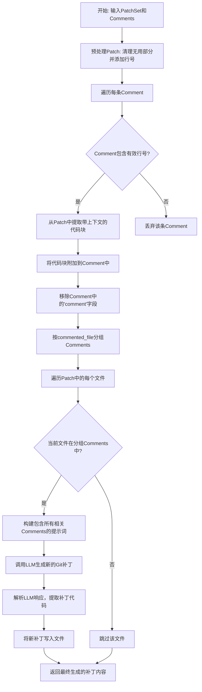

# `.\MetaGPT\metagpt\ext\cr\actions\modify_code.py` 详细设计文档

该代码实现了一个名为ModifyCode的Action类，其核心功能是根据代码审查意见（Comments）自动修改Git补丁（Patch）中的代码。它首先清理和预处理补丁文件，然后根据审查意见定位需要修改的代码块，最后使用大语言模型（LLM）生成符合Git补丁标准的新补丁文件，以实现代码的自动修复。

## 整体流程



## 类结构

```
Action (基类)
└── ModifyCode (代码修改动作)
```

## 全局变量及字段


### `SYSTEM_MSGS_PROMPT`
    
定义LLM系统提示词，用于设定AI代理的角色和能力，指导其作为软件开发者进行代码修改。

类型：`str`
    


### `MODIFY_CODE_PROMPT`
    
定义LLM用户提示词模板，包含代码修改任务的具体指令、输入格式（补丁和评论）以及输出格式（标准Git补丁）要求。

类型：`str`
    


### `ModifyCode.name`
    
表示Action的名称，用于标识此动作，在此类中固定为'Modify Code'。

类型：`str`
    


### `ModifyCode.pr`
    
表示与当前代码修改任务关联的Pull Request标识符，用于组织输出文件的目录结构。

类型：`str`
    
    

## 全局函数及方法

### `ModifyCode.run`

该方法根据代码审查意见（Comments）对给定的Git补丁（PatchSet）进行修改，生成符合Git标准的补丁文件。它首先清理和预处理补丁，然后根据评论中指定的代码位置和修复详情，为每个受影响的文件生成修改后的补丁。

参数：

- `patch`：`PatchSet`，包含需要修改的代码的Git补丁集。
- `comments`：`list[dict]`，代码审查意见列表，每个字典包含代码位置（code_start_line, code_end_line）、修复详情（point_detail）和文件名（commented_file）等信息。
- `output_dir`：`Optional[str]`，可选参数，指定生成的补丁文件的输出目录。如果未提供，则使用默认的工作空间路径。

返回值：`str`，返回最后一个生成的补丁内容字符串。如果处理了多个文件，则返回最后一个文件的补丁。

#### 流程图

```mermaid
graph TD
    A[开始: run(patch, comments, output_dir)] --> B[清理补丁无用部分]
    B --> C[为补丁添加行号]
    C --> D[遍历comments列表]
    D --> E{code_start_line和code_end_line存在?}
    E -->|是| F[从补丁中提取代码块]
    F --> G{代码块是否为空或仅含空白?}
    G -->|是| H[扩大上下文范围重新提取代码块]
    H --> I[将代码块存入comment]
    G -->|否| I
    I --> J[移除comment中的'comment'字段]
    E -->|否| J
    J --> K[按commented_file分组comments]
    K --> L[遍历补丁中的每个文件]
    L --> M{当前文件在分组comments中?}
    M -->|是| N[构建comments_prompt]
    N --> O[构建完整prompt]
    O --> P[确定输出目录和文件路径]
    P --> Q[创建目录]
    Q --> R[使用EditorReporter报告开始]
    R --> S[调用LLM生成修改后的补丁]
    S --> T[解析LLM响应中的代码]
    T --> U[将补丁写入文件]
    U --> V[使用EditorReporter报告完成]
    V --> W[保存补丁内容到resp]
    W --> X[继续处理下一个文件]
    M -->|否| X
    X --> Y[所有文件处理完毕?]
    Y -->|否| L
    Y -->|是| Z[返回resp (最后一个补丁内容)]
```

#### 带注释源码

```python
async def run(self, patch: PatchSet, comments: list[dict], output_dir: Optional[str] = None) -> str:
    # 1. 预处理补丁：移除无用部分并添加行号，便于后续定位代码
    patch: PatchSet = rm_patch_useless_part(patch)
    patch: PatchSet = add_line_num_on_patch(patch)

    # 2. 遍历所有审查意见，为每个有效的意见提取相关的代码上下文
    for comment in comments:
        code_start_line = comment.get("code_start_line")
        code_end_line = comment.get("code_end_line")
        # 如果代码位置信息有效，则从补丁中提取对应的代码块
        if code_start_line and code_end_line:
            # 提取代码块，并扩展几行上下文以提高修复准确性
            code = get_code_block_from_patch(
                patch, str(max(1, int(code_start_line) - 3)), str(int(code_end_line) + 3)
            )
            # 检查提取的代码块是否为空或仅包含空白字符
            pattern = r"^[ \t\n\r(){}[\];,]*$"
            if re.match(pattern, code):
                # 如果是，则扩大上下文范围重新提取
                code = get_code_block_from_patch(
                    patch, str(max(1, int(code_start_line) - 5)), str(int(code_end_line) + 5)
                )
            # 将提取的代码上下文存入评论字典中，供后续LLM使用
            comment["code"] = code
        # 移除评论中可能由LLM生成的'comment'字段，确保使用既定的修复方案
        comment.pop("comment")

    # 3. 将评论按文件名分组，便于按文件批量处理
    comments.sort(key=lambda x: x["commented_file"])
    grouped_comments = {
        key: list(group) for key, group in itertools.groupby(comments, key=lambda x: x["commented_file"])
    }
    resp = None  # 用于存储最后一个生成的补丁内容

    # 4. 遍历补丁集中的每个文件
    for patched_file in patch:
        # 提取目标文件名（不含路径）
        patch_target_file_name = str(patched_file.path).split("/")[-1]
        # 如果当前文件没有对应的审查意见，则跳过
        if patched_file.path not in grouped_comments:
            continue

        # 5. 为当前文件构建包含所有相关评论的提示字符串
        comments_prompt = ""
        index = 1
        for grouped_comment in grouped_comments[patched_file.path]:
            comments_prompt += f"""
                <comment{index}>
                {grouped_comment}
                </comment{index}>\n
            """
            index += 1

        # 6. 构建完整的LLM提示，包含补丁内容和审查意见
        prompt = MODIFY_CODE_PROMPT.format(patch=patched_file, comments=comments_prompt)

        # 7. 确定输出目录和补丁文件路径
        output_dir = (
            Path(output_dir)
            if output_dir
            else self.config.workspace.path / "modify_code" / str(datetime.date.today()) / self.pr
        )
        patch_file = output_dir / f"{patch_target_file_name}.patch"
        patch_file.parent.mkdir(exist_ok=True, parents=True)  # 确保目录存在

        # 8. 使用EditorReporter报告生成过程，并调用LLM生成修改后的补丁
        async with EditorReporter(enable_llm_stream=True) as reporter:
            # 报告开始生成补丁
            await reporter.async_report(
                {"type": "Patch", "src_path": str(patch_file), "filename": patch_file.name}, "meta"
            )
            # 调用LLM，传入提示和系统消息，获取响应
            resp = await self.llm.aask(msg=prompt, system_msgs=[SYSTEM_MSGS_PROMPT])
            # 从LLM响应中解析出标准的Git补丁代码
            resp = CodeParser.parse_code(resp, "diff")
            # 将生成的补丁写入文件
            with open(patch_file, "w", encoding="utf-8") as file:
                file.writelines(resp)
            # 报告补丁文件生成完成
            await reporter.async_report(patch_file)
    # 9. 返回最后一个生成的补丁内容（如果处理了多个文件，则是最后一个文件的补丁）
    return resp
```

## 关键组件


### 代码修改提示词模板 (MODIFY_CODE_PROMPT)

定义了指导大语言模型（LLM）如何根据代码审查意见修改代码的指令模板，包括输入格式（带行号的补丁和评论）、输出格式（标准Git补丁）以及具体的修改指南。

### 补丁预处理与增强 (rm_patch_useless_part, add_line_num_on_patch)

用于清理原始Git补丁中的无关部分，并为补丁中的每一行添加行号，以便后续步骤能够精确定位需要修改的代码块。

### 代码块提取与上下文增强 (get_code_block_from_patch)

根据评论中指定的代码起止行号，从预处理后的补丁中提取对应的代码片段。如果提取的代码为空或仅包含空白字符/分隔符，则自动扩展上下文范围重新提取，以提高后续LLM修复的准确性。

### 评论分组与组织 (grouped_comments)

将输入的评论列表按照`commented_file`（被评论的文件路径）字段进行分组和排序，确保后续处理能够按文件为单位，将同一文件的所有评论集中提供给LLM进行处理。

### 文件级补丁生成与持久化 (EditorReporter, patch_file)

针对每个包含评论的源文件，构造独立的提示词调用LLM生成修改补丁。使用`EditorReporter`进行过程报告，并将LLM返回的标准Git补丁内容解析后保存到以目标文件名命名的`.patch`文件中，实现修改结果的持久化存储。


## 问题及建议


### 已知问题

-   **代码健壮性不足**：`run` 方法中，`patch` 参数被重新赋值给同名变量，虽然类型提示为 `PatchSet`，但后续操作（如 `rm_patch_useless_part`）可能返回 `None` 或其它类型，存在类型安全风险。同时，`resp` 变量在循环外定义，在循环内赋值，如果 `patch` 为空或没有匹配到 `commented_file` 的文件，`resp` 将保持为 `None`，但函数最终返回 `resp`，可能导致调用方收到 `None`。
-   **错误处理缺失**：代码中多处存在潜在的异常点（如文件I/O操作、正则表达式匹配、路径操作、LLM调用等），但未进行任何异常捕获和处理。一旦发生异常，整个流程将中断，且无错误信息反馈。
-   **逻辑缺陷**：在遍历 `patch` 时，使用 `if patched_file.path not in grouped_comments:` 进行判断，如果不在则 `continue`。这意味着对于 `patch` 中每个文件，只有其路径恰好作为键存在于 `grouped_comments` 中时才会处理。然而，`grouped_comments` 的键是 `commented_file` 字段的值，而 `patch` 中文件的 `path` 属性可能包含相对路径或绝对路径，直接比较可能存在匹配失败的风险，导致应处理的评论被跳过。
-   **资源管理不当**：`EditorReporter` 在每次循环内部创建并使用，但根据其上下文管理器设计，每次进入循环都会创建新的实例。如果 `patch` 包含多个文件，这将导致多次创建和销毁报告器实例，可能造成不必要的开销。更合理的做法是在循环外创建一次。
-   **代码可读性与维护性**：`MODIFY_CODE_PROMPT` 模板字符串较长且包含具体格式要求，与业务逻辑紧密耦合，不利于单独维护或测试。部分变量命名可以更清晰（如 `resp`），且存在魔法数字（如 `-3`, `+3`, `-5`, `+5`）。

### 优化建议

-   **增强类型安全与健壮性**：为关键函数（如 `rm_patch_useless_part`, `add_line_num_on_patch`, `get_code_block_from_patch`）添加明确的返回类型注解。在 `run` 方法开始时，对输入参数进行有效性校验（如检查 `patch` 是否为空）。确保 `resp` 变量有合理的默认值（如空字符串 `""`），并在循环结束后检查其有效性后再返回。
-   **添加全面的异常处理**：使用 `try-except` 块包裹可能抛出异常的操作，特别是文件读写、LLM 调用和正则匹配。记录或上报异常信息，并根据情况决定是跳过当前文件继续处理，还是终止整个任务并向上抛出异常。
-   **修复路径匹配逻辑**：在比较 `patched_file.path` 和 `grouped_comments` 的键时，应考虑路径规范化（例如，使用 `Path` 对象或 `os.path.normpath`）以确保一致性。或者，在构建 `grouped_comments` 时，将键也转换为与 `patch` 中 `path` 属性可比的形式。
-   **优化资源使用**：将 `EditorReporter` 的创建移到循环外部。如果其设计不支持在单个实例中报告多个独立事件，则应评估其设计，或确认当前用法是否是其预期模式。
-   **提升代码结构与可维护性**：
    -   将 `MODIFY_CODE_PROMPT` 等大型模板字符串移至单独的模板文件或配置管理中。
    -   将魔法数字（上下文行数 `3` 和 `5`）提取为类常量或配置参数，并赋予有意义的名称。
    -   重命名 `resp` 为更具描述性的名称，如 `final_patch_content`。
    -   考虑将处理单个文件评论并生成补丁的逻辑抽取为一个独立的辅助方法（如 `_process_file_comments`），以提高 `run` 方法的主循环清晰度和可测试性。
    -   为关键逻辑添加详细的日志记录，便于调试和监控执行流程。


## 其它


### 设计目标与约束

本模块的核心设计目标是提供一个自动化的代码修改能力，能够根据给定的代码审查意见（Comments）和对应的代码差异（Git Patch），生成符合Git标准的修正补丁。其核心约束包括：1) 必须严格遵循`point_detail`字段描述的修复方案进行修改；2) 生成的补丁必须符合Git Patch标准格式，包含正确的`+`（新增）和`-`（删除）标记，且不能修改Hunk头部信息；3) 处理过程需忽略代码审查工具中可能存在的、由LLM生成的`comment`字段，仅依赖预定义的修复方案；4) 为提高修复准确性，需要为问题代码段动态地添加上下文（前后若干行代码）作为LLM的输入。

### 错误处理与异常设计

当前代码中的错误处理较为隐式，主要依赖于外部调用方（如`Action`基类）的异常处理机制。模块内部潜在的异常点包括：1) 文件路径操作（如`Path`创建、目录创建`mkdir`）可能因权限或磁盘空间问题失败；2) 文件读写操作（`open`）可能因文件被占用或编码问题失败；3) `unidiff.PatchSet`的解析和处理可能因输入格式错误而失败；4) `llm.aask`调用可能因网络或服务问题抛出异常。目前这些点均未显式捕获和处理异常，可能导致整个`run`方法执行中断。建议增加`try-except`块来捕获特定异常（如`OSError`, `IOError`, `ValueError`），并进行日志记录或返回错误状态，以提升模块的健壮性。

### 数据流与状态机

模块的数据流始于输入参数`patch` (PatchSet) 和 `comments` (list[dict])。处理流程可视为一个线性状态转换：1) **预处理状态**：清理补丁无用部分、为补丁行添加行号、为每条评论提取并附加关联的代码块上下文、过滤掉`comment`字段、按文件对评论进行分组。2) **核心处理状态**：遍历补丁中的每个文件，若该文件存在对应的评论组，则构造包含补丁和格式化评论的Prompt，调用LLM服务。3) **输出状态**：解析LLM返回的响应，提取标准diff格式的补丁，将补丁写入到以目标文件名命名的`.patch`文件中。整个过程无复杂的循环依赖或状态回退，是一个典型的批处理管道。

### 外部依赖与接口契约

1.  **输入接口契约**:
    *   `patch: PatchSet`: 必须是由`unidiff`库解析的有效Git补丁对象，包含待修改文件的差异信息。
    *   `comments: list[dict]`: 字典列表，每个字典必须包含`code_start_line`, `code_end_line`, `point_detail`, `commented_file`等关键字段，用于定位问题和描述修复方案。
    *   `output_dir: Optional[str]`: 可选参数，指定补丁文件的输出目录。若未提供，则使用配置的工作空间路径下的子目录。

2.  **输出接口契约**:
    *   返回值 `str`: 返回最后处理的文件所生成的Git补丁字符串。注意，如果多个文件被处理，此返回值仅为最后一个文件的补丁。
    *   副作用: 在指定的`output_dir`（或默认目录）下，为每个被处理的文件生成一个同名的`.patch`文件。

3.  **关键外部依赖**:
    *   `unidiff.PatchSet`: 用于解析和操作Git补丁格式。
    *   `metagpt.actions.action.Action`: 作为动作基类，提供框架集成和`llm`等资源的访问。
    *   `metagpt.utils.report.EditorReporter`: 用于报告处理进度和状态（如文件创建）。
    *   `metagpt.utils.common.CodeParser`: 用于从LLM响应中解析出代码块。
    *   `metagpt.ext.cr.utils.cleaner` 中的工具函数 (`rm_patch_useless_part`, `add_line_num_on_patch`, `get_code_block_from_patch`): 提供补丁预处理和代码提取功能。

4.  **配置依赖**:
    *   `self.config.workspace.path`: 用于构建默认的输出目录路径。

    