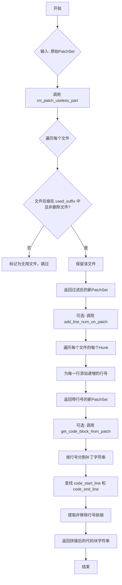
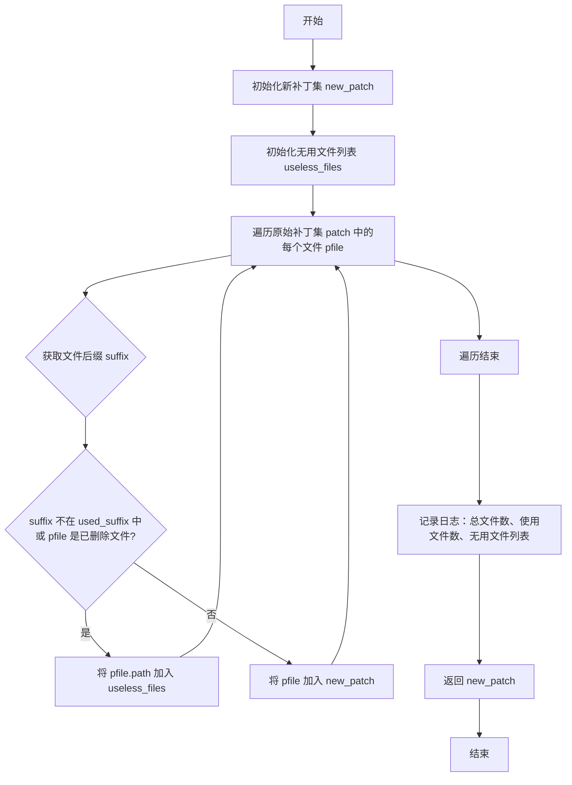
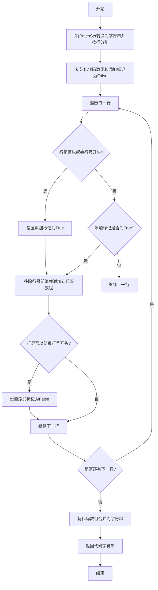

# `.\MetaGPT\metagpt\ext\cr\utils\cleaner.py` 详细设计文档

该代码是一个用于处理和清理Git补丁（Patch）的工具模块。它提供了三个核心功能：1）过滤掉不需要的文件类型（如非指定后缀的文件或已删除的文件）；2）为补丁中的每一行添加行号；3）从带行号的补丁中提取指定行号范围内的代码块。这些功能主要用于在代码审查、代码生成或自动化处理场景中，对差异文件进行预处理和内容提取。

## 整体流程



## 类结构

```
该文件不包含类定义，仅包含函数。
├── rm_patch_useless_part (全局函数)
├── add_line_num_on_patch (全局函数)
└── get_code_block_from_patch (全局函数)
```

## 全局变量及字段


### `logger`
    
用于记录日志的全局日志记录器实例，来自metagpt.logs模块

类型：`Logger`
    


    

## 全局函数及方法

### `rm_patch_useless_part`

该函数用于清理一个补丁集（`PatchSet`），过滤掉不需要的文件。具体来说，它会移除那些文件扩展名不在指定列表（默认为 `["java", "py"]`）中的文件，以及那些被标记为“已删除”的文件。函数会记录被移除的文件信息，并返回一个只包含有效文件的新补丁集。

参数：

- `patch`：`PatchSet`，输入的原始补丁集，包含多个文件的变更信息。
- `used_suffix`：`list[str]`，可选参数，默认为 `["java", "py"]`。这是一个文件扩展名列表，只有扩展名在此列表中的文件才会被保留。

返回值：`PatchSet`，返回一个新的补丁集，其中只包含符合条件（扩展名在 `used_suffix` 列表中且不是被删除的文件）的文件。

#### 流程图



#### 带注释源码

```python
def rm_patch_useless_part(patch: PatchSet, used_suffix: list[str] = ["java", "py"]) -> PatchSet:
    # 创建一个新的空 PatchSet 对象，用于存放过滤后的有效文件
    new_patch = PatchSet("")
    # 初始化一个列表，用于记录被过滤掉的无用文件路径
    useless_files = []
    # 遍历输入补丁集 patch 中的每一个文件对象 (PatchedFile)
    for pfile in patch:
        # 从目标文件名中提取文件扩展名（后缀）
        suffix = str(pfile.target_file).split(".")[-1]
        # 判断条件：如果文件后缀不在指定的 used_suffix 列表中，或者该文件是一个被删除的文件
        if suffix not in used_suffix or pfile.is_removed_file:
            # 满足条件，将此文件路径记录为无用文件
            useless_files.append(pfile.path)
            # 跳过当前文件，不将其加入新补丁集
            continue
        # 不满足上述条件，说明是有效文件，将其添加到新补丁集 new_patch 中
        new_patch.append(pfile)
    # 记录处理过程的日志信息：原始文件总数、处理后有效文件数、被过滤的无用文件列表
    logger.info(f"total file num: {len(patch)}, used file num: {len(new_patch)}, useless_files: {useless_files}")
    # 返回过滤后的新补丁集
    return new_patch
```

### `add_line_num_on_patch`

该函数用于处理一个 `PatchSet` 对象，为其中的每一行代码（包括上下文行和修改行）添加一个全局递增的行号前缀，并返回一个新的、包含这些带行号代码块的 `PatchSet` 对象。

参数：
- `patch`：`PatchSet`，输入的原始补丁集对象。
- `start_line_num`：`int`，可选参数，默认为1。表示行号计数的起始值。

返回值：`PatchSet`，一个新的补丁集对象，其中每个代码行都被添加了行号前缀。

#### 流程图

```mermaid
flowchart TD
    A[开始: 输入 patch, start_line_num] --> B[初始化 new_patch 和 lineno]
    B --> C{遍历 patch 中的每个 pfile?}
    C -->|是| D[为当前 pfile 创建新的 PatchedFile]
    D --> E{遍历 pfile 中的每个 hunk?}
    E -->|是| F[为当前 hunk 创建新的 Hunk]
    F --> G[将 hunk 的每一行转换为字符串]
    G --> H{遍历每一行 line?}
    H -->|是| I[为 line 添加行号前缀: f"{lineno} {line}"]
    I --> J[行号 lineno 自增 1]
    J --> H
    H -->|遍历完成| K[将处理后的行添加到 new_hunk]
    K --> E
    E -->|遍历完成| L[将 new_hunk 添加到 new_pfile]
    L --> C
    C -->|遍历完成| M[返回 new_patch]
```

#### 带注释源码

```python
def add_line_num_on_patch(patch: PatchSet, start_line_num: int = 1) -> PatchSet:
    # 创建一个新的空 PatchSet 对象，用于存放处理后的结果
    new_patch = PatchSet("")
    # 初始化行号计数器，从 start_line_num 开始
    lineno = start_line_num
    # 遍历输入 patch 中的每一个文件（PatchedFile）
    for pfile in patch:
        # 为当前文件创建一个新的 PatchedFile 对象，复制源文件、目标文件等信息
        new_pfile = PatchedFile(
            source=pfile.source_file,
            target=pfile.target_file,
            source_timestamp=pfile.source_timestamp,
            target_timestamp=pfile.target_timestamp,
        )
        # 遍历当前文件中的每一个代码块（Hunk）
        for hunk in pfile:
            # 将 hunk 中的每一行（Line 对象）转换为字符串，存入列表 arr
            arr = [str(line) for line in hunk]
            # 为当前 hunk 创建一个新的 Hunk 对象，复制源/目标起始行、长度、节标题等信息
            new_hunk = Hunk(
                src_start=hunk.source_start,
                src_len=hunk.source_length,
                tgt_start=hunk.target_start,
                tgt_len=hunk.target_length,
                section_header=hunk.section_header,
            )
            # 遍历 arr 中的每一行字符串
            for line in arr:
                # 为当前行添加行号前缀，格式为 "{lineno} {line}"
                line = f"{lineno} {line}"
                # 行号计数器加 1
                lineno += 1
                # 将处理后的行添加到新的 hunk 对象中
                new_hunk.append(line)
            # 将处理完的 new_hunk 添加到新的文件对象 new_pfile 中
            new_pfile.append(new_hunk)
        # 将处理完的 new_pfile 添加到新的补丁集 new_patch 中
        new_patch.append(new_pfile)
    # 返回包含所有带行号代码的新补丁集
    return new_patch
```

### `get_code_block_from_patch`

该函数用于从一个 `PatchSet` 对象中提取指定行号范围内的代码块。它通过解析补丁的字符串表示，识别起始行和结束行的标记，然后移除行号前缀，最终返回该范围内的纯代码文本。

参数：

- `patch`：`PatchSet`，包含代码变更信息的补丁集对象。
- `code_start_line`：`str`，指定代码块的起始行号（字符串形式）。
- `code_end_line`：`str`，指定代码块的结束行号（字符串形式）。

返回值：`str`，提取出的指定行号范围内的代码文本，每行代码已移除行号前缀。

#### 流程图



#### 带注释源码

```python
def get_code_block_from_patch(patch: PatchSet, code_start_line: str, code_end_line: str) -> str:
    # 将PatchSet对象转换为字符串，并按换行符分割成行数组
    line_arr = str(patch).split("\n")
    # 初始化一个空列表，用于存储提取的代码行
    code_arr = []
    # 初始化一个标志，用于标记是否开始添加代码行到code_arr
    add_line_tag = False
    # 遍历每一行
    for line in line_arr:
        # 检查当前行是否以指定的起始行号开头（注意后面有一个空格）
        if line.startswith(f"{code_start_line} "):
            # 如果是，则设置添加标记为True，开始收集代码
            add_line_tag = True

        # 如果添加标记为True，则处理当前行
        if add_line_tag:
            # 移除行号前缀：将行按空格分割，然后取第一个空格之后的部分
            # 例如，将"123 +some code" 转换为 "+some code"
            new_line = " ".join(line.split(" ")[1:])  # rm line-no tag
            # 将处理后的行添加到代码数组中
            code_arr.append(new_line)

        # 检查当前行是否以指定的结束行号开头（注意后面有一个空格）
        if line.startswith(f"{code_end_line} "):
            # 如果是，则设置添加标记为False，停止收集代码
            add_line_tag = False

    # 将代码数组中的行用换行符连接起来，形成一个完整的代码字符串并返回
    return "\n".join(code_arr)
```

## 关键组件

### 补丁集过滤组件

用于过滤掉不需要处理的文件，例如非指定后缀的文件或已被删除的文件，从而精简补丁集。

### 行号添加组件

为补丁集中的每一行代码添加一个全局递增的行号，便于后续的代码块定位和引用。

### 代码块提取组件

根据指定的起始行号和结束行号，从已添加行号的补丁集中提取出对应的代码块，并移除行号标签。

## 问题及建议


### 已知问题

-   **硬编码的文件后缀过滤**：`rm_patch_useless_part` 函数中，`used_suffix` 参数默认为 `["java", "py"]`，这限制了代码的通用性。如果用于处理其他语言（如 JavaScript, Go, C++）的补丁，需要显式传入参数，否则会被错误过滤。
-   **脆弱的行号生成逻辑**：`add_line_num_on_patch` 函数为每一行（包括上下文行和空行）都添加了行号并递增。这可能导致生成的行号序列与原始文件的真实行号严重不符，特别是当补丁包含大量上下文行时，会误导使用者。
-   **代码块提取逻辑存在缺陷**：`get_code_block_from_patch` 函数依赖于 `add_line_num_on_patch` 生成的行号标签进行提取。如果传入的 `patch` 未经行号处理，该函数将无法工作。同时，其匹配逻辑 (`line.startswith(f"{code_start_line} ")`) 要求行号后必须紧跟一个空格，如果格式不一致（如制表符），提取会失败。
-   **潜在的性能与内存问题**：`add_line_num_on_patch` 和 `get_code_block_from_patch` 函数在转换过程中进行了大量的字符串拼接、分割和列表操作。对于大型补丁文件，这可能带来不必要的性能开销和内存占用。
-   **错误处理缺失**：所有函数均未对输入参数进行有效性验证（例如，`patch` 是否为 `PatchSet` 类型，`code_start_line` 和 `code_end_line` 是否为有效数字字符串）。异常情况可能导致程序崩溃或返回错误结果。
-   **函数职责不单一**：`add_line_num_on_patch` 函数同时承担了“添加行号”和“深拷贝/重构 `PatchSet` 对象”两个职责。这使得函数逻辑复杂，且行号生成策略难以独立调整或复用。

### 优化建议

-   **提供更灵活的文件过滤机制**：将 `rm_patch_useless_part` 函数的默认后缀列表设为 `None` 或空列表，表示不过滤。或者，提供一个回调函数参数，允许调用者自定义过滤逻辑（例如基于文件路径正则匹配）。
-   **重构行号生成策略**：将行号生成逻辑与 `PatchSet` 对象重构解耦。可以创建一个专门的行号生成器，或者修改 `add_line_num_on_patch`，使其只对变更行（`+`， `-`）或用户指定的行类型添加行号，并允许指定行号起始值和增量策略。
-   **增强代码块提取的健壮性**：`get_code_block_from_patch` 函数应明确其前置条件（需要带行号的patch），或在函数内部进行判断。提取逻辑应更健壮，例如使用正则表达式匹配行号模式，而非简单的 `startswith`。
-   **引入输入验证与错误处理**：在每个函数的开始处，添加参数类型和值的检查。对于无效输入，应抛出明确的异常（如 `ValueError`, `TypeError`），而不是让错误在后续代码中暴露。
-   **优化数据处理流程**：考虑使用生成器（`yield`）来逐行处理补丁内容，避免一次性将整个补丁字符串加载到内存中。对于 `add_line_num_on_patch`，可以探索是否可以直接修改 `PatchSet` 对象中的行数据，而非完全重建新对象。
-   **拆分函数职责**：将 `add_line_num_on_patch` 拆分为两个函数：一个负责 `PatchSet` 的深拷贝或安全转换，另一个负责为给定的文本行添加行号。这样可以提高代码的可测试性和可维护性。
-   **增加单元测试**：为每个函数编写全面的单元测试，覆盖正常用例、边界用例和异常用例。这有助于在重构时保障功能正确性，并明确函数的行为契约。


## 其它


### 设计目标与约束

本模块的核心设计目标是提供一个轻量级的补丁文件（PatchSet）处理工具，用于在代码审查或代码生成等场景下，对标准的`unidiff`格式补丁进行预处理和关键信息提取。主要约束包括：
1.  **输入格式约束**：输入必须为`unidiff.PatchSet`对象，遵循标准的unified diff格式。
2.  **功能单一性**：每个函数职责单一，分别负责过滤、添加行号、提取代码块，便于组合使用。
3.  **向后兼容性**：处理函数应返回新的`PatchSet`或字符串，避免修改原始输入数据，保证调用方的数据安全。
4.  **性能考虑**：处理过程为内存中的线性操作，适用于中小型补丁文件，未针对超大型补丁文件进行流式处理优化。

### 错误处理与异常设计

当前代码采用隐式的错误处理策略，依赖于Python解释器的默认异常传播机制和`unidiff`库的内部校验。具体分析如下：
1.  **输入验证缺失**：函数未对输入参数（如`patch`是否为有效的`PatchSet`，`used_suffix`列表内容）进行显式校验。无效输入将导致`unidiff`库或后续逻辑抛出`AttributeError`、`IndexError`等异常。
2.  **异常处理缺失**：代码中没有`try-except`块。例如，`str(pfile.target_file).split(".")[-1]`在`target_file`为`None`或文件名无后缀时会引发异常。
3.  **日志记录**：仅在`rm_patch_useless_part`函数中使用`logger.info`记录操作摘要，未记录警告或错误。其他关键操作（如行号添加、代码块提取）无日志。
4.  **返回值约定**：函数均返回新对象。调用方需注意，若过滤后无有效文件，`rm_patch_useless_part`返回的`PatchSet`可能为空。

### 数据流与状态机

模块的数据流清晰，围绕`PatchSet`对象进行线性转换，无复杂的状态机。
1.  **核心数据对象**：`unidiff.PatchSet` 是贯穿所有函数的核心数据结构，包含`PatchedFile`列表，每个`PatchedFile`又包含`Hunk`列表。
2.  **处理流程**：
    *   **过滤流程** (`rm_patch_useless_part`)：输入`PatchSet` -> 遍历每个`PatchedFile` -> 根据文件后缀和是否被删除进行过滤 -> 输出新的`PatchSet`。
    *   **行号添加流程** (`add_line_num_on_patch`)：输入`PatchSet`及起始行号 -> 深度遍历`PatchedFile`、`Hunk`及每一行 -> 为每一行添加递增的行号前缀 -> 输出新的`PatchSet`。
    *   **代码提取流程** (`get_code_block_from_patch`)：输入`PatchSet`及起止行号 -> 将`PatchSet`转换为字符串并按行分割 -> 根据行号前缀匹配并提取行 -> 移除行号前缀 -> 输出拼接后的代码字符串。
3.  **数据状态**：数据在处理过程中被复制和转换，原始输入保持不变。`add_line_num_on_patch`函数中的`lineno`变量是唯一的跨文件状态，用于维护全局递增的行号。

### 外部依赖与接口契约

1.  **外部库依赖**：
    *   `unidiff`：核心依赖，用于解析和操作unified diff格式。本模块重度依赖其`PatchSet`、`PatchedFile`、`Hunk`等类。
    *   `metagpt.logs`：仅用于日志记录(`logger`)。这是一个项目内部模块，将该函数移至其他项目时需替换或移除此依赖。
2.  **接口契约（函数签名）**：
    *   `rm_patch_useless_part(patch: PatchSet, used_suffix: list[str] = ["java", "py"]) -> PatchSet`：契约要求输入有效的`PatchSet`，返回过滤后的新`PatchSet`。`used_suffix`默认值限定了常用语言。
    *   `add_line_num_on_patch(patch: PatchSet, start_line_num: int = 1) -> PatchSet`：契约要求输入`PatchSet`，返回一个每行都被添加了全局连续行号的新`PatchSet`。行号从`start_line_num`开始。
    *   `get_code_block_from_patch(patch: PatchSet, code_start_line: str, code_end_line: str) -> str`：契约要求输入已添加行号的`PatchSet`（通常由`add_line_num_on_patch`处理）和起止行号字符串，返回对应行号区间内的代码文本（已移除行号前缀）。
3.  **隐式契约**：`get_code_block_from_patch`函数要求输入的`patch`必须已经过`add_line_num_on_patch`处理，因为其匹配逻辑依赖于行号前缀的存在。模块文档中未明确说明此前置条件。

### 安全性与边界条件

1.  **路径遍历**：`rm_patch_useless_part`函数中访问`pfile.path`，该路径来自补丁文件，理论上可能包含恶意构造的路径（如`../../../etc/passwd`），但此处仅用于记录日志，未进行文件系统操作，风险较低。
2.  **资源消耗**：`add_line_num_on_patch`和`get_code_block_from_patch`会将整个补丁内容加载到内存中进行字符串操作。对于极端大的补丁，可能存在内存压力。
3.  **边界条件处理**：
    *   **空输入**：如果输入`PatchSet`为空，各函数应能正常处理并返回空结果（`PatchSet`或空字符串）。
    *   **行号溢出**：`add_line_num_on_patch`未处理行号`lineno`的整数溢出问题（在Python中极少发生）。
    *   **无效行号范围**：`get_code_block_from_patch`中，如果`code_start_line`未找到，则返回空字符串；如果`code_end_line`未找到，则提取从开始行到文件末尾的所有内容。这可能与调用方预期不符。
    *   **行号冲突**：补丁内容本身可能包含以数字开头的行，这与添加的行号前缀可能产生混淆，`get_code_block_from_patch`的匹配逻辑`line.startswith(f"{code_start_line} ")`可能因此误匹配。

### 测试策略建议

1.  **单元测试**：
    *   `rm_patch_useless_part`：测试包含不同后缀文件、被删除文件的过滤逻辑；测试默认后缀列表；测试空输入和全过滤情况。
    *   `add_line_num_on_patch`：测试行号是否正确递增并添加；测试跨多个文件的行号连续性；测试自定义起始行号；验证输出`PatchSet`的结构完整性。
    *   `get_code_block_from_patch`：测试正常范围内的代码提取；测试边界行号提取；测试起始行未找到、结束行未找到的情况；测试提取后行号前缀是否正确移除。
2.  **集成测试**：测试三个函数串联使用的场景，例如：过滤 -> 添加行号 -> 提取代码块。
3.  **异常测试**：构造无效的`PatchSet`输入，验证函数的异常抛出行为是否符合预期（当前为直接抛出）。
4.  **性能测试**：针对大型补丁文件，测试内存占用和处理时间，确保在预期负载下可接受。

    