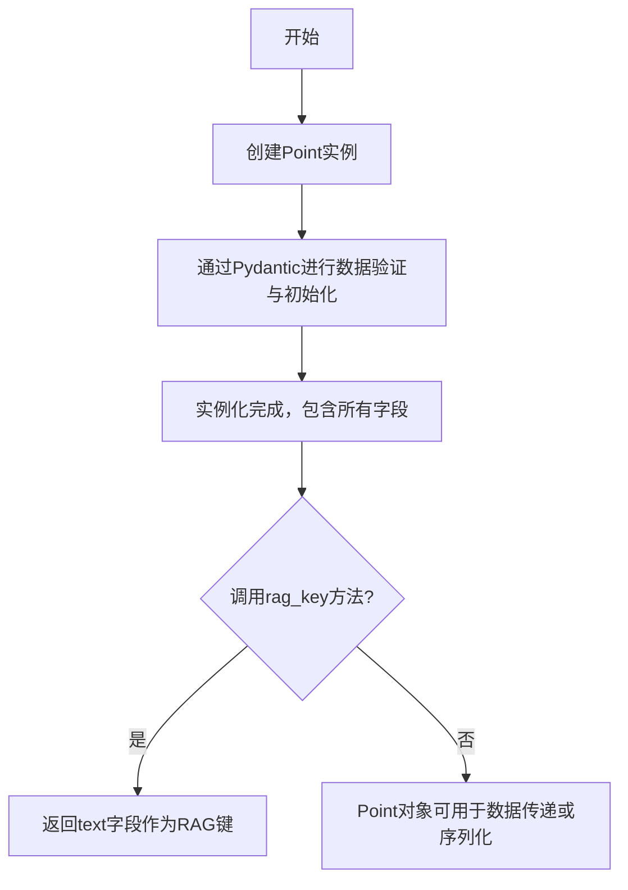
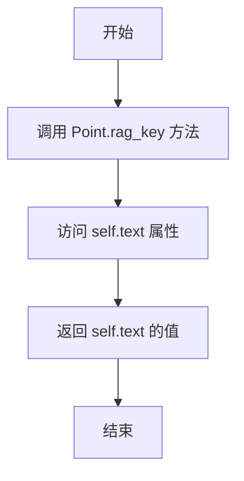

# `.\MetaGPT\metagpt\ext\cr\utils\schema.py` 详细设计文档

该代码定义了一个名为 `Point` 的数据模型类，用于表示代码审查或代码分析中的一个“要点”或“检查点”。它封装了与代码片段相关的元数据（如ID、编程语言、文件路径、行号范围）和内容（如文本描述、代码详情、正反示例），并提供了一个方法用于生成检索增强生成（RAG）的键。

## 整体流程



## 类结构

```
BaseModel (Pydantic基类)
└── Point (数据模型)
```

## 全局变量及字段


### `Point.id`
    
ID of the point.

类型：`int`
    


### `Point.text`
    
Content of the point.

类型：`str`
    


### `Point.language`
    
The programming language that the point corresponds to.

类型：`Literal['Python', 'Java']`
    


### `Point.file_path`
    
The file that the points come from.

类型：`str`
    


### `Point.start_line`
    
The starting line number that the point refers to.

类型：`int`
    


### `Point.end_line`
    
The ending line number that the point refers to.

类型：`int`
    


### `Point.detail`
    
File content from start_line to end_line.

类型：`str`
    


### `Point.yes_example`
    
yes of point examples

类型：`str`
    


### `Point.no_example`
    
no of point examples

类型：`str`
    
    

## 全局函数及方法


### `Point.rag_key`

该方法用于生成当前 `Point` 实例的检索键（RAG Key）。该键是向量数据库中进行相似性搜索和检索的核心依据，直接决定了检索的准确性和相关性。当前实现简单地返回 `Point` 的 `text` 字段内容。

参数：
-  `self`：`Point`，当前 `Point` 类的实例。

返回值：`str`，返回当前 `Point` 实例的 `text` 字段值，作为其唯一的检索标识符。

#### 流程图



#### 带注释源码

```python
def rag_key(self) -> str:
    # 直接返回当前 Point 实例的 `text` 字段内容。
    # 此字段通常包含了代码片段、注释或文档的核心文本信息，
    # 作为在 RAG（检索增强生成）流程中进行向量化并用于相似性检索的关键。
    return self.text
```


## 关键组件


### Pydantic 数据模型基类

使用 Pydantic 库的 `BaseModel` 作为基类，为 `Point` 类提供了强大的数据验证、序列化和配置管理功能。

### 数据字段定义与验证

通过 `Field` 类为每个字段定义默认值、类型约束和描述信息，确保 `Point` 对象在创建和修改时数据的完整性和一致性。

### 字面量类型约束

使用 `typing.Literal` 对 `language` 字段进行枚举式约束，确保其值只能是预定义的 "Python" 或 "Java" 之一，增强了代码的类型安全性。

### 检索增强生成键生成方法

`rag_key` 方法定义了用于检索增强生成（RAG）系统的关键标识，当前实现返回 `text` 字段的内容，作为检索和关联上下文的主要依据。


## 问题及建议


### 已知问题

-   **`language` 字段枚举值受限**：`language` 字段的类型被定义为 `Literal["Python", "Java"]`，这限制了其只能表示两种编程语言。如果未来需要支持更多语言（如 C++、JavaScript、Go 等），必须修改此处的类型定义和所有相关的代码逻辑，扩展性较差。
-   **字段默认值可能掩盖数据缺失**：多个字段（如 `id`, `text`, `file_path`, `start_line`, `end_line`）都设置了默认值（如 `0`, `""`）。在实例化时，如果未提供这些值，对象会使用默认值，这可能使得程序难以区分“未提供的值”和“值确实为默认值”的情况，尤其是在 `id=0` 或 `start_line=0` 可能具有业务含义的场景下。
-   **`rag_key` 方法逻辑过于简单**：`rag_key` 方法直接返回 `self.text` 作为检索键。如果 `text` 字段内容过长、包含噪音或在不同 `Point` 对象间可能重复，这可能导致检索效率低下或准确性不足。
-   **缺乏数据验证**：虽然 Pydantic 提供了基础的类型验证，但缺少对字段间逻辑关系的约束验证。例如，没有验证 `start_line` 是否小于或等于 `end_line`，也没有验证 `file_path` 在给定 `language` 下是否具有合理的文件扩展名。
-   **模型职责单一性可加强**：`Point` 类目前承担了数据容器和生成检索键的职责。如果未来业务逻辑（如复杂的键生成算法、数据持久化、序列化特殊逻辑）变得复杂，都堆砌在此类中，会违反单一职责原则。

### 优化建议

-   **扩展 `language` 字段的表示**：将 `language` 字段的类型定义从 `Literal` 改为更灵活的 `str`，或使用 `Enum` 类来管理所有支持的语言。使用 `Enum` 可以在保持类型安全的同时，方便地集中管理和扩展支持的语言列表。
-   **区分缺失值与默认值**：对于关键字段（如 `id`, `start_line`, `end_line`），考虑使用 `Optional[int]` 类型（即 `int | None`）并设置默认值为 `None`，以明确表示值未被提供。在业务逻辑中再对 `None` 值进行相应处理。
-   **增强 `rag_key` 方法**：优化检索键的生成逻辑。例如，可以对 `text` 进行清洗（去除多余空格、特殊字符）、截断、或结合其他字段（如 `id`、`language` 的前缀）生成一个更具唯一性和代表性的键。也可以考虑将键生成策略设计为可配置或可插拔的。
-   **添加自定义验证器**：利用 Pydantic 的 `@validator` 装饰器为模型添加自定义验证方法。例如，添加验证器确保 `start_line <= end_line`，以及 `file_path` 非空（如果业务要求）。这可以在数据创建阶段就保证其内在一致性。
-   **考虑模型重构与职责分离**：评估未来需求的复杂性。如果 `Point` 类的职责可能增加，可以考虑进行重构。例如，保持 `Point` 作为纯净的数据模型（DTO），将 `rag_key` 等业务方法移动到一个单独的 Service 或 Helper 类中。这样可以使数据模型更稳定，业务逻辑更易于测试和替换。


## 其它


### 设计目标与约束

本代码的设计目标是定义一个用于表示代码审查或代码分析中“要点”（Point）的数据模型。该模型主要用于存储与代码片段相关的元数据和内容，并支持后续的检索增强生成（RAG）操作。核心约束包括：
1.  **数据验证与序列化**：使用 Pydantic 库确保模型字段的类型安全，并自动提供数据验证、序列化（如转换为 JSON）和反序列化功能。
2.  **明确的字段定义**：每个字段都有清晰的类型注解、默认值和描述，以增强代码可读性和文档化。
3.  **轻量级与专注**：该类仅负责数据承载和基础键生成，不包含复杂的业务逻辑或持久化操作，遵循单一职责原则。

### 错误处理与异常设计

当前代码本身不包含显式的错误处理逻辑。错误处理主要依赖于 Pydantic 框架：
1.  **数据验证错误**：当使用无效数据（例如，为 `language` 字段提供非 “Python” 或 “Java” 的值，或为 `id` 字段提供非整数类型）创建 `Point` 实例时，Pydantic 会抛出 `ValidationError` 异常。调用方需要捕获并处理此异常。
2.  **`rag_key` 方法**：该方法直接返回 `self.text` 属性。如果 `text` 为 `None`（在 Pydantic 模型中，由于有默认值，通常不会），则可能返回空字符串。该方法本身不抛出异常，但其返回值作为 RAG 的键，如果为空可能影响后续检索逻辑的有效性。

### 数据流与状态机

`Point` 类是一个简单的数据容器（Data Transfer Object），不涉及复杂的状态变迁或数据流处理。
1.  **数据流入**：数据通过构造函数传入，由 Pydantic 进行解析和验证，并赋值给对应的实例字段。
2.  **数据存储**：数据以字段形式存储在 `Point` 实例中。
3.  **数据流出**：
    *   可以通过实例属性直接访问字段值。
    *   可以通过 Pydantic 提供的方法（如 `.dict()`， `.json()`）将实例序列化为字典或 JSON 字符串。
    *   可以通过 `rag_key()` 方法提取用于检索的关键信息（当前为 `text` 字段内容）。
该类是无状态的，其行为不随内部状态改变而改变。

### 外部依赖与接口契约

1.  **外部依赖**：
    *   `typing.Literal`：用于定义 `language` 字段的有限字符串字面量类型。
    *   `pydantic.BaseModel`：作为基类，提供数据验证、序列化等核心功能。
    *   `pydantic.Field`：用于为模型字段提供额外的元数据，如默认值和描述。
2.  **接口契约**：
    *   **构造函数**：接受与类字段同名的关键字参数。所有参数都是可选的，未提供的参数将使用 `Field` 中定义的默认值。
    *   **`rag_key` 方法**：无参数，返回一个 `str` 类型的值。该方法承诺返回一个可用于标识或检索该 `Point` 的字符串键。当前的实现返回 `text` 字段的值，这构成了一个隐式的契约：调用者期望 `text` 字段能唯一或有效地代表该要点。

### 配置与可扩展性

1.  **配置**：模型的配置主要通过 `Field` 函数内联完成，包括默认值、字段描述等。Pydantic 的 `Config` 类未被显式使用，因此使用的是默认配置（如允许额外字段、自动类型转换等）。
2.  **可扩展性**：
    *   **字段扩展**：可以通过添加新的类字段来扩展模型，以容纳更多的元数据（例如，添加 `category`、`severity` 或 `tags` 字段）。
    *   **方法扩展**：可以添加新的实例方法来提供更多功能（例如，计算代码片段的哈希值、格式化输出等）。
    *   **`rag_key` 逻辑扩展**：如果需要更复杂的检索键生成逻辑（例如，结合 `text` 和 `language`），可以重写 `rag_key` 方法。
    *   **继承扩展**：可以创建 `Point` 的子类，添加特定于某个领域或应用的额外字段和行为。

### 安全考虑

当前模型不直接涉及敏感操作或数据，安全风险较低。主要考虑点包括：
1.  **输入验证**：依赖 Pydantic 进行基础类型和字面量验证，防止无效数据进入系统。但未对 `text`、`detail`、`file_path` 等字符串字段的内容进行净化（如防止注入攻击），如果这些字段来自不可信源并在后续被渲染（如写入文件、拼接 SQL/命令、前端显示），则存在潜在风险。
2.  **`file_path` 字段**：该字段存储文件路径。如果路径信息来自用户输入，需要注意路径遍历攻击（如 `../../../etc/passwd`）。在后续使用该路径进行文件操作时，必须进行规范化并检查是否在允许的目录范围内。
3.  **信息泄露**：`detail` 字段包含文件内容，`yes_example` 和 `no_example` 可能包含代码示例。在序列化或传输模型数据时，需确保符合数据隐私和安全策略。

    